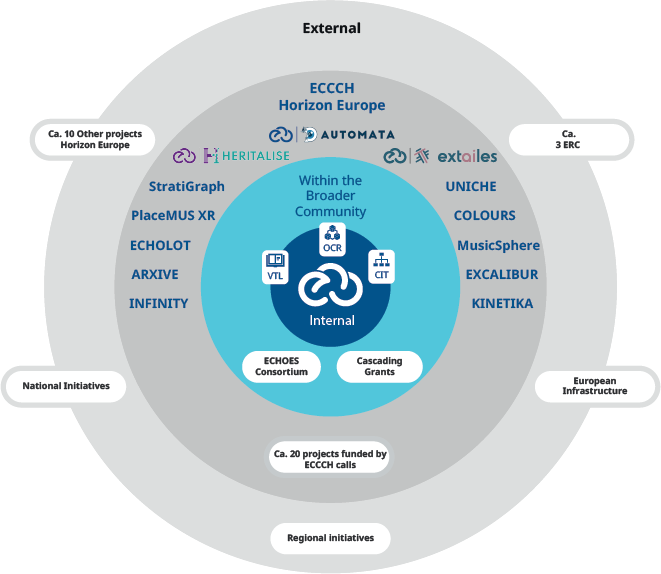
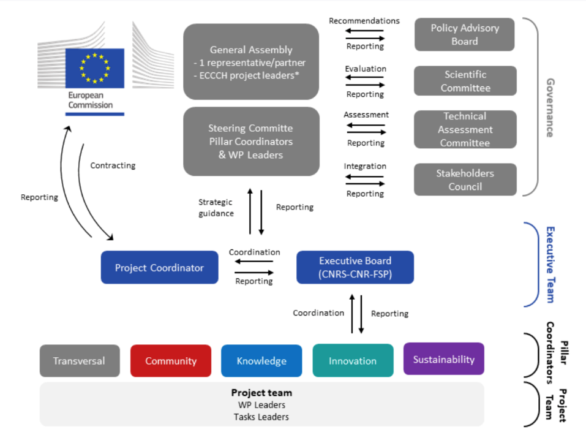

 European Cloud for Heritage Open Science

**Deliverable 3.1 – Integration Strategy for datasets, tools and workflows with potential for reuse in ECHOES**

HORIZON-CL2-2023-HERITAGE-ECCCH-01

Horizon Innovation action

**Responsible authors:**

Dimitris Kotzinos (CNRS - CY Cergy Paris University), Sally Chambers, Laure Barbot and Matej Ďurčo (DARIAH-EU), Gianni Dalla Torre (EGI Foundation)

|    Project start    | 1 June 2024             |
|:-------------------:|-------------------------|
|  Project duration   | 60 months               |
| Document Identifier | 10.5281/zenodo.17751335 |

© 2025 by the authors, the ECHOES consortium. This work is licensed under a “CC BY 4.0” license.

Deliverable Information

<table>
<colgroup>
<col style="width: 25%" />
<col style="width: 15%" />
<col style="width: 21%" />
<col style="width: 37%" />
</colgroup>
<thead>
<tr>
<th>Project Number</th>
<th>101157364</th>
<th>Acronym</th>
<th>ECHOES</th>
</tr>
</thead>
<tbody>
<tr>
<td>Full title</td>
<td colspan="3" style="text-align: left;">European Cloud for Heritage OpEn Science</td>
</tr>
<tr>
<td>Project URL</td>
<td colspan="3" style="text-align: left;"><a href="https://www.echoes-eccch.eu/">https://www.echoes-eccch.eu/</a></td>
</tr>
<tr>
<td>EU Project Officer</td>
<td colspan="3">Christian WILK</td>
</tr>
</tbody>
</table>

<table style="width:100%;">
<colgroup>
<col style="width: 26%" />
<col style="width: 15%" />
<col style="width: 21%" />
<col style="width: 36%" />
</colgroup>
<thead>
<tr>
<th>Deliverable</th>
<th>3.1</th>
<th>Title</th>
<th style="text-align: left;">Integration Strategy for datasets, tools and workflows with potential for reuse in ECHOES</th>
</tr>
</thead>
<tbody>
<tr>
<td>Work Package</td>
<td>3</td>
<td><strong>Title</strong></td>
<td style="text-align: left;">Enhancing Collaboration and Integration</td>
</tr>
<tr>
<td>Submission date</td>
<td colspan="3">10/12/2025</td>
</tr>
<tr>
<td>Pages</td>
<td>37</td>
<td><strong>Keywords</strong></td>
<td style="text-align: left;">Digital Cultural Heritage; Integration Strategy; Integration Roadmap; Services; Data; Workflows, Cultural Heritage Cloud</td>
</tr>
</tbody>
</table>

| Lead Partner | CNRS – CY Cergy Paris University |
|----|----|
| Responsible Author | Dimitris Kotzinos (CNRS-CYU) |
| Authors (Partners) | Sally Chambers, Laure Barbot and Matej Ďurčo (DARIAH-EU), Gianni Dalla Torre (EGI Foundation) |
| Contributors | Antoine Isaac (Europeana Foundation). Carlos Andujar (UPC), Joanna Kowalska (PCSS), Emmanuel Demetrescu (CNR) Kerstin Arnold (APEF), Xavier Rodier, Mailane Maira Messias Sampaio, Louise Gadoin (CNRS), Charlotte Gallini, Rémi Petitcol (FSP) |

<table>
<colgroup>
<col style="width: 17%" />
<col style="width: 10%" />
<col style="width: 40%" />
<col style="width: 31%" />
</colgroup>
<thead>
<tr>
<th colspan="4">Change log</th>
</tr>
</thead>
<tbody>
<tr>
<td>Date</td>
<td><strong>Version</strong></td>
<td><strong>Author</strong></td>
<td><strong>Change</strong></td>
</tr>
<tr>
<td>05/09/2025</td>
<td>V0.1</td>
<td style="text-align: left;">Sally Chambers, Matej Ďurčo, Laure Barbot (DARIAH-EU), Dimitris Kotzinos (CNRS-CYU), Gianni Dalla Torre (EGI Foundation)</td>
<td style="text-align: left;">Outlines</td>
</tr>
<tr>
<td>13/09/2025</td>
<td>V0.2</td>
<td style="text-align: left;">Laure Barbot (DARIAH-EU)</td>
<td style="text-align: left;">Writing resources section</td>
</tr>
<tr>
<td>22-31/10/2025</td>
<td>V0.3</td>
<td style="text-align: left;">Sally Chambers, Laure Barbot (DARIAH-EU), Dimitris Kotzinos (CNRS-CYU), Gianni dalla Torre (EGI Foundation), Carlos Andujar (UPC), Joanna Kowalska (PCSS)</td>
<td style="text-align: left;">Writing levels of integration section</td>
</tr>
<tr>
<td>30/10/2025</td>
<td>V0.4</td>
<td style="text-align: left;">Joanna Kowalska (PCSS)</td>
<td style="text-align: left;">Expanded section about Integration Levels</td>
</tr>
<tr>
<td>5/11/2025</td>
<td>V0.5</td>
<td style="text-align: left;">Sally Chambers (DARIAH-EU)</td>
<td style="text-align: left;">Writing purpose and scope</td>
</tr>
<tr>
<td>7/11/2025</td>
<td>V0.6</td>
<td style="text-align: left;">Charlotte Gallini (FSP)</td>
<td style="text-align: left;">Drafting ECHOES ecosystem section</td>
</tr>
<tr>
<td>12/11/2025</td>
<td>V0.7</td>
<td style="text-align: left;">Gianni Dalla Torre (EGI Foundation), Laure Barbot (DARIAH-EU)</td>
<td style="text-align: left;">Writing Integration roles section</td>
</tr>
<tr>
<td>16/11/2025</td>
<td>V0.8</td>
<td style="text-align: left;">Sally Chambers, Matej Ďurčo, Laure Barbot (DARIAH-EU)</td>
<td style="text-align: left;">Revisions to Purpose and Scope, Integration Principles and ECHOES ecosystem</td>
</tr>
<tr>
<td>26/11/2025</td>
<td>V0.9</td>
<td style="text-align: left;">Louise Gadoin (CNRS)</td>
<td style="text-align: left;">Revisions of the ECHOES ecosystem section and feedback</td>
</tr>
<tr>
<td>26/11/2025</td>
<td>V0.10</td>
<td style="text-align: left;">Emanuel Demetrescu (CNR)</td>
<td style="text-align: left;">Revisions of the integration principles</td>
</tr>
<tr>
<td>26/11/2025</td>
<td>V0.11</td>
<td style="text-align: left;">Laure Barbot, Sally Chambers (DARIAH-EU), Matej Ďurčo (EGI Foundation)</td>
<td style="text-align: left;">Integration of feedback</td>
</tr>
<tr>
<td>27/11/2025</td>
<td>1.0</td>
<td style="text-align: left;">Dimitris Kotzinos (CNRS-CYU), Antoine Isaac (Europeana)</td>
<td style="text-align: left;">Internal Review</td>
</tr>
<tr>
<td>28/11/2025</td>
<td>1.1</td>
<td style="text-align: left;">Laure Barbot, Sally Chambers (DARIAH-EU), Matej Ďurčo (EGI Foundation)</td>
<td style="text-align: left;">Integration of feedback</td>
</tr>
<tr>
<td>03/12/2025</td>
<td>1.2</td>
<td style="text-align: left;">Dimitris Kotzinos (CNRS-CYU)</td>
<td style="text-align: left;">Rewriting levels of integration section</td>
</tr>
<tr>
<td>04/12/2025</td>
<td>1.3</td>
<td style="text-align: left;">Antoine Isaac (Europeana)</td>
<td style="text-align: left;">Internal Review</td>
</tr>
<tr>
<td>05/12/2025</td>
<td>1.4</td>
<td style="text-align: left;">Laure Barbot, Matej Ďurčo, Sally Chambers (DARIAH-EU), Dimitris Kotzinos (CNRS-CYU)</td>
<td style="text-align: left;">Integration of feedback and Final Review</td>
</tr>
<tr>
<td>05/12/2025</td>
<td>1.5</td>
<td>Xavier Rodier (CNRS)</td>
<td>Final Review</td>
</tr>
</tbody>
</table>

# Abstract

The aim of the **ECHOES Integration Strategy (D3.1)** is to facilitate the development of the Cultural Heritage Cloud as a shared platform offering access to data, advanced digital tools and state-of-the-art workflows for the creation and analysis of a new generation of semantically rich and collectively produced heritage assets. The strategy helps to ensure that the Cultural Heritage Cloud becomes a coherent, sustainable and user-friendly infrastructure, optimising the reuse of the outcomes of EU and national cultural heritage projects, to meet the needs of the cultural heritage and research communities. The ultimate goal of this integration effort is to interconnect these datasets, tools and workflows in a federated manner, informed by the Community needs.

With its roots in the Cultural Heritage Cloud Founding Principles[^1], the ECHOES Integration strategy defines three **strategic pillars** (section 6) as the goals to be achieved to fully realise the ECCCH as a collaborative and federated cloud. From these pillars, a series of **integration guiding principles** are extracted (section 7), which are used to determine integration priorities by considering community needs, technical readiness and governance dimensions. The pillars and the guiding principles will enable ECHOES to navigate the integration expectations of the diverse range of actors in the **ECHOES ecosystem** (section 8), by setting clear objectives to reach and orientate the choices to be made. The core of the Integration Strategy to build a **Federated Digital Commons** by connecting distinct nodes in a federated ecosystem is outlined in Section 9. This includes the vision of creating a **Distributed Data Fabric** where applications, services, data and workflows are dynamically federated, scaled and actioned or used. The ECHOES **Governance Model** is presented in section 10, with a specific focus on the role of the Stakeholders Council and of the **ECHOES Integration Task Force** (**EITF)** to enable ECHOES to make informed, collective, and transparent integration decisions. The **ECHOES Integration Roadmap** (D3.2), which operationalises the integration strategy, is also introduced. How the roadmap will be managed by a number of **integration roles** in a series of **integration cycles** is outlined. The need to continue integration activities once the Cultural Heritage Cloud becomes a sustainable long-term cultural heritage data infrastructure, in anticipated.

Finally, the strategy concludes (section 11), by emphasising the pivotal role that the ECHOES Integration Strategy and Roadmap play in ensuring that the Cultural Heritage Cloud becomes a reality.

*Disclaimer: Views and opinions expressed are however those of the author(s) only and do not necessarily reflect those of the European Union or the European Research Executive Agency. Neither the European Union nor the granting authority can be held responsible for them.*

# Table of Contents

[1. Abstract](#abstract)

[2. Table of Contents](#table-of-contents)

[3. List of figures and tables](#list-of-figures-and-tables)

[4. List of abbreviations](#list-of-abbreviations)

[5. Purpose and scope](#purpose-and-scope)

[6. Strategic pillars](#strategic-pillars)

[7. Guiding Principles for Integration](#guiding-principles-for-integration)

[8. ECHOES ecosystem](#echoes-ecosystem)

[Within ECHOES](#within-echoes)

[Vertical Applications](#vertical-applications)

[ECHOES Cascading Grants](#echoes-cascading-grants)

[Within ECCCH](#within-eccch)

[Beyond ECCCH](#beyond-eccch)

[Broader European ecosystem](#broader-european-ecosystem)

[Data Space for Cultural Heritage](#data-space-for-cultural-heritage)

[European Open Science Cloud (EOSC)](#european-open-science-cloud-eosc)

[Joint Programming Initiative on Cultural Heritage (JPI CH)](#joint-programming-initiative-on-cultural-heritage-jpi-ch)

[High Performance Computing and AI Factories](#high-performance-computing-and-ai-factories)

[ESFRI Research Infrastructures and related initiatives](#esfri-research-infrastructures-and-related-initiatives)

[National Initiatives across Europe](#national-initiatives-across-europe)

[9. ECCCH Integration Strategy: Building the Federated Digital Commons](#eccch-integration-strategy-building-the-federated-digital-commons)

[Integration Units (IU)](#integration-units-iu)

[Levels of integration](#levels-of-integration)

[The Central Role of the Heritage Digital Twin (HDT)](#the-central-role-of-the-heritage-digital-twin-hdt)

[The HDT Creation Lifecycle](#the-hdt-creation-lifecycle)

[Provenance and Quality: The "Paradata"](#provenance-and-quality-the-paradata)

[Resource Integration Matrix](#resource-integration-matrix)

[Data and Metadata Integration](#data-and-metadata-integration)

[Applications and Services Integration](#applications-and-services-integration)

[Workflows Integration](#workflows-integration)

[Integrating European and National initiatives, institutions and individuals](#integrating-european-and-national-initiatives-institutions-and-individuals)

[The Final Federated (Integrated) Architecture](#the-final-federated-integrated-architecture)

[10. Integration Governance](#integration-governance)

[Stakeholders Council](#stakeholders-council)

[ECHOES Integration Task Force](#echoes-integration-task-force)

[Managing the roadmap](#managing-the-roadmap)

[Integration roles](#integration-roles)

[Integration Cycles](#integration-cycles)

[11. Conclusion](#conclusion)

[References](#references)

# List of figures and tables

<u>Figures</u>:

- Fig. 1 [ECHOES Ecosystem](#echoes-ecosystem)

- Fig. 2 [ECHOES Governance Structure](#integration-governance)

<u>Tables</u>:

- Table 1: [Digital Twin integration levels](#the-central-role-of-the-heritage-digital-twin-hdt)

- Table 2: [Data and Metadata Integration levels](#resource-integration-matrix)

- Table 3: [Applications and Services Integration levels](#resource-integration-matrix)

- Table 4: [Workflows Integration levels](#resource-integration-matrix)

- Table 5: [Community Integration Levels](#integrating-european-and-national-initiatives-institutions-and-individuals)

# List of abbreviations

| 3S     | Simple Storage Service                                      |
|--------|-------------------------------------------------------------|
| AAI    | Authentication and Authorization Infrastructure             |
| API    | Application Programming Interface                           |
| CH     | Cultural Heritage                                           |
| CLARIN | Common Language Resources and Technology Infrastructure     |
| DARIAH | Digital Research Infrastructure for the Arts and Humanities |
| DT     | Digital Twin                                                |
| E-RIHS | European Research Infrastructure for Heritage Science       |
| ECCCH  | European Collaborative Cloud for Cultural Heritage          |
| EITF   | ECHOES Integration Task Force                               |
| EOSC   | European Open Science Cloud                                 |
| ERIC   | European Research Infrastructure Consortium                 |
| ESFRI  | European Strategy Forum on Research Infrastructures         |
| FAIR   | Findable, Accessible, Interoperable, and Reusable           |
| GLAM   | Galleries, Libraries, Archives, and Museums                 |
| GPU    | Graphics Processing Unit                                    |
| HDT    | Heritage Digital Twin                                       |
| HDTO   | Heritage Digital Twin Ontology                              |
| HPC    | High Performance Computing                                  |
| JPI CH | Joint Programming Initiative on Cultural Heritage           |
| KB     | Knowledge Base                                              |
| VA     | Vertical Application                                        |

# Purpose and scope 

The **ECHOES Integration Strategy** plays a pivotal role in realising the Cultural Heritage Cloud. To enable this, ECHOES is establishing a shared platform offering access to data, advanced digital tools and state-of-the-art workflows for the creation and analysis of a new generation of semantically rich and collectively produced heritage assets. By bringing together diverse actors from various fields and disciplines from across the sector into a cohesive community of heritage professionals and researchers, it will enable collaborative scientific research.

The Integration Strategy facilitates the creation of a coherent, sustainable and user-friendly infrastructure, optimising the reuse of the outcomes of EU and national cultural heritage projects, to meet the needs of the cultural heritage and research communities. It is informed by a comprehensive gap analysis, undertaken in close collaboration with the Communities pillar. This gap analysis combines the results of the [ECHOES Consultation](https://www.echoes-eccch.eu/echoes-consultation/) and the [inventory](https://marketplace.sshopencloud.eu/search?order=score&f.keyword=ECHOES+inventory) of existing datasets, tools, and workflows with potential for reuse. The ultimate goal of this integration effort is to interconnect these datasets, tools and workflows in a federated manner, informed by the Community needs. An open-source infrastructure and modular architecture are key.

With its roots in the Cultural Heritage Cloud Founding Principles[^2], the ECHOES Integration strategy defines three key pillars (section 6) as the goals to be achieved to fully realise the ECCCH as a collaborative and federated cloud. From these pillars, a series of integration guiding principles are extracted (section 7), which are used to determine integration priorities by considering community needs, technical readiness and governance dimensions. The pillars and the guiding principles will enable ECHOES to navigate the integration expectations of the diverse range of actors in the ECHOES ecosystem (section 8), by setting clear objectives to reach and orientate the choices to be made.

ECHOES strategy to break down the complexity is to elaborate a resource-oriented approach of the integration activities, leading to the identification of Integration Units (section 9): it is not projects or initiatives per se that are integrated into the Cultural Heritage Cloud, but rather the resources - or assets, or key exploitable results – that their communities use or produce, and these resources interact with the Cultural Heritage Cloud Components.

Once this is clarified, it is of outmost importance for the ECHOES Integration Strategy to set up as well an environment in which a variety of actors and resources can interact, and this is why different levels of integration (section 9) are also conceptualised: in order to provide a gradual and inclusive framework encompassing both the available capacities and resources of the teams willing to contribute to the collaborative cloud and, on the other side, targeting the realisation of a fully Federated Architecture. The different levels of integration are there to also provide a vision on how at the end of the day the Cultural Heritage Cloud could function as a platform for collaborative and inclusive tools, applications, services and data that would actually benefit from all the promises that the Cloud brings (high availability, storage, sharing, computing, etc.).

The final section of the Strategy (section 10) elaborates on how all the dimensions presented can be orchestrated from a governance perspective. In such a distributed environment, bodies enabling co-design and co-construction dimensions and supporting democratic decision making are mandatory. This is the role of the Stakeholders Council and of the ECHOES Integration Task Force, to ensure a wide representation of Cloud Contributors and offer a common space to discuss integration matters respectively. This will enable ECHOES to make informed, collective, and transparent integration decisions.

Complementing the integration strategy, the **ECHOES Integration Roadmap** (D3.2) operationalises the integration principles outlined in the strategy. The management of the roadmap is outlined at the end of the strategy by introducing the roles and the notion of integration cycles that will provide a pace to ECHOES integration activities. Through the implementation of the roadmap, ECHOES will be able to demonstrate the breadth, depth, diversity, and granularity of integrations realised through a series of integration metrics complemented by integration examples.

From the Cultural Heritage Cloud founding principles to the integration implementation via the Roadmap, the present ECHOES Integration Strategy sets the goals to be achieved (i.e. strategic pillars), provides the conceptual framework to achieve them – i.e. a resource-based and gradual integration framework - and highlight the challenges to be solved along the way. By design, this Strategy and its companioned Roadmap are iterative, and will be enriched or amended based on the learned experiences from the initial steps of integration discussed and collected by the ECHOES Integration Task Force (EITF).

# Strategic pillars 

As a starting point, the ECHOES Integration Strategy builds on the Cultural Heritage Cloud Founding Principles[^3] and derives from them three key pillars of Integration Strategy are outlined as follows:

1.  **To build a federated open source infrastructure that enables the creation of practical applications driven by Cultural Heritage (CH) communities’ needs for both tangible and intangible CH**

ECHOES will establish the Cultural Heritage Cloud as an open-source cloud platform with a modular and extensible infrastructure, enabling the integration of tools from CH stakeholders in any sector and discipline. It will seamlessly integrate tools developed by consortium partners and external actors (i.e., future, and parallel ECCCH calls, ECHOES cascading grants, and independent contributors) and create a Distributed Data Fabric. The platform will offer libraries and Application Programme Interfaces (APIs) for tool development, data visualisation, intelligent data annotation, and search. Critical infrastructure components will be open source, accompanied by comprehensive documentation and training. ECHOES will address the current lack of a shared open-source ecosystem in CH and enhance the integration of heterogeneous data, multimedia formats and the modularity of tools used in different disciplines.

2.  **To integrate results of past, current and future ECCCH-related projects regarding data, services, digital processes and applications.**

ECHOES aims to seamlessly integrate outcomes from past, current, and future initiatives in CH, encompassing data, services, digital processes, and applications. The project will invite participants from prior and ongoing EU-funded endeavours to collaborate with ECCCH, contributing data and testing ECCCH tools. ECHOES Cascading grants programme will allow the testing of tools and applications developed outside the consortium to integrate them into the ECCCH. The project will establish transparent access rules, fostering connections among existing communities and initiatives linked to research and digital innovation in CH and creative industries. ECHOES will create a unified digital ecosystem for CH by capitalising on the outcomes of previous and ongoing EU initiatives.

3.  **To enable and foster innovative, collaborative co-creation of new knowledge around Digital Commons**

The long-term vision is to create the European *Collaborative* Cloud for Cultural Heritage. The ECHOES Integration Strategy will enable data, tools and workflows from across the ECHOES ecosystem, which have previously been isolated in disciplinary silos or communities, to be interconnected in a shared

Digital Commons. Federating cultural heritage resources in this way will foster innovative and collaborate co-creation of new knowledge about the Digital Commons by the wider CH community. The success of the collaborative aspect of the Cultural Heritage Cloud will be assessed as part of the Collaborative Research Scenarios that are being developed in ECHOES Task 3.3, *Enhancing and evaluating the collaboration potential of ECHOES*. They act as bridge between the technical integration of cultural heritage resources and the community dimensions, as developed within WP4, ensuring that the Cloud evolves to a functional collaborative ecosystem.

# Guiding Principles for Integration

A key principle underlying these three pillars is **finding a balance between standardisation and orchestration**. While ECHOES standardises core infrastructure components (Authentication and Authorisation Infrastructure (AAI), Knowledge Base, APIs) and semantic interoperability layers (HDTO, metadata schemas), it must also orchestrate diverse domain-specific approaches. Different cultural heritage disciplines - archaeology, conservation science, musicology - have legitimate methodological traditions that should not be forced into a single rigid framework. The integration strategy therefore distinguishes between mandatory standards for interoperability and flexible frameworks for domain-specific tool ecosystems.

Additionally, clarifying the distinction between integration and interoperability is an important role for the ECHOES Integration Strategy. For the purposes of this strategy, an emphasis on WHAT we would like to integrate and from WHOM is presented and complemented by the Integration Roadmap that says HOW we achieve these integrations, while Interoperability Guidelines (D6.2 to be published in early 2026) will clarify the prerequisites to reach to initiate integration.

**To guide future integrations within the ECCCH, the ECHOES Integration Strategy provides a set of principles and high-level criteria that are operationalised in *D3.2 Integration Roadmap* to support prioritisation decisions.** Considering the complexity of the ecosystem – as outlined in the following section – these criteria should balance technical feasibility, community relevance and legal or governance compliance, ensuring that the integration processes remain transparent, sustainable and aligned with the broader objectives of ECHOES and the building of the ECCCH.

**Community priorities**

A community-centric design is central to the development of the Cultural Heritage Cloud. Similarly, community priorities are the basis of the ECHOES Integration Strategy. To ensure a community-centred approach to the Integration Strategy, a key guiding principle is to assess whether a resource which has been highlighted for potential integration into the ECCCH responds to a known need identified within the ECHOES Community. This initial needs assessment is being undertaken by matching the results of the [ECHOES Consultation](https://www.echoes-eccch.eu/echoes-consultation/) against the [inventory](https://marketplace.sshopencloud.eu/search?order=score&f.keyword=ECHOES+inventory) of existing datasets, tools, and workflows with potential for reuse. It will culminate in ***D4.1 Report on Identification of Communities and their needs***, scheduled for delivery in May 2026. However, the identification of new or evolving needs will be continuously assessed. This work will be undertaken in close collaboration with the Communities pillar.

**Technical requirements**

Secondly, technical requirements will play an important role in assessing whether a resource is ready for integration. In particular, compliance with the elements developed in ***D6.2 Interoperability Guidelines*** (January 2026) should be considered a mandatory precondition for integration, guaranteeing consistency and compatibility across the ECCCH architecture. In addition, the **maturity** of the resources identified for potential integration is also an essential factor. Only stable, well-documented and maintained resources – i.e. not proofs of concept – should be considered for integration. Another critical aspect is the **coherence of the ECCCH overall architecture**, especially in cases where functionalities may overlap. The Integration Roadmap elaborates on how such overlaps are addressed as part of the prioritisation process. **Long-term sustainability** must also be a determining factor, with explicit responsibilities assigned to the resource providers for ongoing maintenance. Additionally, a process to manage cases where integrated resources become obsolete or are not actively maintained anymore must also be included in the Integration Roadmap. This could include considering the possible transfer of responsibilities to other partners within the ECCCH federation.

**Governance, Legal and Ethical considerations**

A final area of attention is Governance, Legal and Ethical considerations. On the governance level, within the wider framework of the European Collaborative Cloud for Cultural Heritage, **it is a requirement that all projects funded under the ECCCH Programme integrate their data, tools and workflows into the Cultural Heritage Cloud. In this way, the integration needs of the ECCCH sister-projects are a high priority for the ECHOES Integration Strategy**, alongside other key stakeholders prioritised for integration. This topic is explored in more detail in the following section on the ECHOES ecosystem.

Depending on the integration level, for applications to be included in the ECHOES Applications Catalogue, it is anticipated that a contractual framework, such as a collaboration or service level agreement, will be needed at an institutional level, to outline responsibilities of delivering functionality for the Cultural Heritage Cloud. Such agreements will need to consider procedures for software upgrades, security patches and bug fixes, including related roles and responsibilities of the providers and sustainability dimensions. In the long term, such agreements would be signed with the Cultural Heritage Cloud legal entity. The ECHOES Integration Task Force (EITF) will return to this topic once the ECHOES Integration Roadmap is established and is functioning smoothly at around May 2027 (Month 36 of the project).

ECHOES adopts a clear strategic preference for open resources wherever possible. Legal and ethical considerations therefore include the open licensing of the data (e.g. CC-BY), metadata (e.g. CC0) or open source software (e.g. European Union Public Licence). Nonetheless, resources under more restrictive or proprietary licenses will not be excluded from integration, provided that their conditions of use are clearly stated, respected and appropriately managed. A policy regarding the integration of proprietary resources is needed to guide the resource providers and *D10.2 Governance Model of the legal entity* (due in May 2026) will provide the first elements in that direction.

# ECHOES ecosystem 

The ECHOES project – the mission of which is to develop and implement the European Collaborative Cloud for Cultural Heritage (ECCCH) – operates within a multi-layered ecosystem of stakeholders (see Figure 1 below). At the core of this ecosystem are the ECHOES consortium members and the broader network of ECCCH-funded projects. Their close coordination aims to facilitate the integration of the data, tools and services developed by each project, through the adoption of common technical standards and interfaces that allow for interoperability and scalability across the European cloud environment. Additionally, the ECHOES project must also integrate the tools and datasets that constitute the outcomes of up to 50 projects selected through the three Cascading Grants calls.

Surrounding this core is a diverse ecosystem which also needs to be taken into account by the Integration Strategy. This ecosystem is composed of cultural heritage professionals, cultural and creative industries, educational and research communities, technology providers, open science networks, and relevant EU and national initiatives. The Cultural Heritage landscape, where the Cloud is situated, is composed of a wide diversity of institutions and infrastructures. Key examples include: the common European data space for cultural heritage, the European Open Science Cloud (EOSC), European research infrastructures such as DARIAH, CLARIN and E-RIHS, European projects from the Digital Cultural Heritage Cluster, the Time Machine Organisation, projects that reached out directly to ECHOES, national and local initiatives and many others.

Furthermore, the concentric circles depicted in the ECHOES Integration Ecosystem in Figure 1 are also indicative of the expected integration level, i.e. *Level 1: Tactical (Basic Connectivity)*, *Level 2: Strategic (Semantic and Technical Integration)* and *Level 3: Transformational (The Digital Commons Strategy)*, which are described in further detail in Section 9. The closer the initiative is to the centre of the diagram, the more advanced the expected level of integration. For example, ECCCH sister projects and ECHOES cascading grants projects are expected to reach at least Integration Level 2. However, it does not mean that initiatives currently "satellites” in the diagram should not aim for a high level of integration.

Figure 1 The ECHOES Ecosystem

## Within ECHOES 

### Vertical Applications 

Vertical Applications (VAs) in ECHOES are domain-specific, vertically designed web applications that integrate deeply with the ECHOES cloud infrastructure[^4]. While they can be seen as standalone tools that focus on a specific problem (like transcribing a digitised document or annotating a 3D model), they also work as components tightly connected to the core of the ECHOES infrastructure, hiding the complexity and the more tedious details of the inner infrastructure. The applications will be able to transparently access infrastructure resources like data storage, user management, AAI or processing capabilities. Moreover, the VAs will rely on the HDT ontology for metadata representation in order to guarantee a proper and coherent semantic representation in the Knowledge Base. **Because the first three VAs are developed within the ECHOES project, they will also serve as real-world tests validating how the cloud components integration operates and as practical examples for demonstrating how tightly coupled services can be built on the ECHOES cloud infrastructure.**

### ECHOES Cascading Grants 

The ECHOES Cascading Grants Programme provides funding for consortia led by Cultural Heritage Institutions (CHIs) to engage with the Cultural Heritage Cloud[^5]. The programme supports up to 50 projects across three calls to enhance digital engagement, data sharing, and collaboration. Smaller and medium-sized or lesser resourced CHIs are especially encouraged to apply.

The Key focus areas of the three calls are:

- **Call 1: Data** – Projects that contribute heritage data to the Cultural Heritage Cloud and would like to make use of its tools and infrastructure.

- **Call 2: Engagement and Collaboration** – Initiatives that promote digital skills, awareness, and collaboration with CHIs. Projects that strategically enlist professional umbrella organisations to promote the benefits of the cloud at the sector level to the different CH communities would be particularly welcomed.

- **Call 3: Data and Vertical Applications** – Projects that contribute new datasets to the Cultural Heritage Cloud or develop applications that integrate with enhance its functionalities.

The outcomes of the projects funded under the ECHOES Cascading Grants Programme are a key potential source of resources for integration into the Cultural Heritage Cloud in the form of datasets, training materials or vertical applications. They will not only demonstrate the engagement of the wider cultural heritage community with the Cultural Heritage Cloud but provide practical integration examples for validating the Integration Strategy and Roadmap.

## Within ECCCH 

Beyond the applications developed with the ECHOES project, the ECHOES community[^6] that the Integration Strategy must take into consideration is primarily composed of so-called “sister projects” funded under ECCCH calls.

The first three projects were awarded as part of the ECCCH call 2023, topic *Innovative tools for digitising cultural heritage objects:*

- **AUTOMATA** - focuses on the AUTOMated enriched digitisation of Archaeological liThics and cerAmics.

- **TEXTaiLES** - develops TEXTile digitisAtIon tooLs and mEthodS for cultural heritage.

- **HERITALISE** - explores Heritage Buildings and Objects Digitisation & Visualisation within the Cloud.

Building on the foundation of the three initial projects, the *2024 European Collaborative Cloud for Cultural Heritage – Innovative use cases call* awarded 10 projects listed below:

- **MusicSphere** - A Multimodal Approach for Digitizing, Analyzing, and Simulating Traditional Musical Organs Through 3D Technologies, Acoustic Analysis and Interactive Experiences

<!-- -->

- **KINETIKA** - Advancing the Digitization and Analysis of Dynamic Cultural Heritage Objects

- **StratiGraph** - Knowledge Graphs for Stratigraphy

- **ARXIVE** - Advanced Research and eXploration for Interoperable Value in European Heritage

- **ECHOLOT** - European Cultural Heritage Optimised Linked Open Tools

- **INFINITY** - Multidimensional knowledge-based annotation for ethical context-aware heritage data life cycles

- **UNICHE** - Unified No-Code platform for Interactive Cultural Heritage Experiences

- **PlaceMUS XR** - Digital Journey across Musical Places in Europe and Extended Realities

- **EXCALIBUR** - Advanced toolkits for interdisciplinary and enhanced study, conservation, and restoration in burial excavations and findings

- **COLOURS** - Collaborative On-cloud Lab for the conservation and digital restoration of ColOUred heritage collectionS

The diversity of themes and approaches addressed reinforces the need for a strong integration strategy ensuring interoperability by design and clarifying roles and responsibilities from the start (see Section 10 Integration Governance), especially considering that 9 out of these 10 projects include cascading grants schemes. As developed in the *section 10 Integration Governance* below, while the ECHOES project team provides the integration framework and establishes a close liaison with the sister projects, these projects remain responsible for the integration of their own cascading grants outputs in the ECCCH.

Furthermore, additional ECCCH projects will join this group of “sister projects”. At the time of writing, we know that 76 proposals were received for the ECCCH call 2025 on Innovative use cases. The final results will be published in early 2026. It is expected that 8 projects will be funded from this call.

While the three first sister projects are already onboarded in the ECHOES Integration Task Force (EITF), and with the next ten projects about to join, several key integration questions have already emerged and are used to structure the present strategy and the accompanying roadmap (D3.2). These include the need to identify resource types (section 8) and offer clear interoperability guidelines (D6.2, January 2026) and integration processes (D3.2, November 2025). Developing the storage and computing resources of the ECCCH under a federated model where not all the resources are provided by the same provider is a question that also needs to be tackled via the technical governance principles (D10.2, May 2026). In general, distinguishing between agreements during and beyond the projects’ lifetime is one of the main challenges discussed by the ECHOES Integration Task Force.

## Beyond ECCCH

Beyond ECHOES and the ECCCH framework developed by the European Commission through its calls, “external projects” are also expressing interest in integrating with the ECCCH. Even if the integration of the outcomes of these projects and their communities cannot be prioritised in the same way as the ECCCH projects or ECHOES Cascading Grants projects, they represent an important dimension of the Cultural Heritage Cloud in the making and are considered as potential ECCCH stakeholders.

These projects come from a wide range of initiatives, including Horizon Europe, European Strategy Forum on Research Infrastructures (ESFRI), European Research Council (ERC), European innovation Council (EIC), the Gaming Cluster, International Partnership for Cultural Heritage and Innovation (IPCI), the Co-funded European partnership for Resilient Cultural Heritage, the Digital Europe Programme (e.g. Data Space for cultural heritage and 3D4CH), as well as international (e.g. AI4LAM, IIIF), national and regional initiatives. A list of these projects, which is kept up to date by the ECHOES coordination team and includes projects that proactively reached out to the ECHOES team, and projects or initiatives expressing interest during in-person meetings or ECHOES presentations.

Based on the work conducted in ECHOES Work Package 4 around the identification of communities and their needs, we expect to refine the understanding of the ecosystem of interest for ECHOES integration by identifying even more projects, initiatives or stakeholders that could tomorrow become actors of the ECCCH. The formalisation of relationships between ECHOES and these external projects and the scope and modalities of their integration could take many forms. Confronted to this diversity and multiplicity, the role of the integration strategy is also to clarify different roles (users vs. providers for example as elaborated in section 10), and to set up mechanisms balancing easy contribution of all interested parties and capacities of the ECHOES consortium (and of the future legal entity) in supporting the integration of resources from these various communities (see section 9).

## Broader European ecosystem

The ECHOES project itself is developing in a context that needs to be highlighted in the integration strategy as it also influences some of the integration principles described above, and as synergies need to be developed with existing EU initiatives - from Data Spaces to Joint Programming Initiatives or Joint Undertakings - to ensure the long-term sustainability of the ECCCH, avoid the duplication of efforts, pool efforts and maximise investments.

### Data Space for Cultural Heritage 

The Data Space for Cultural Heritage (DS4CH) is inherently a twin initiative with substantial scope complementarity (Cultural Heritage) and consequently very close relations, requiring intensive and continuous information exchange and coordination to identify points of interaction/integration and to delineate the functional scopes of the two initiatives. While many aspects remain under discussion, a consensus is emerging on the main points of the relationship between the two initiatives:

- The Data Space serves as a source of metadata for the Cloud Infrastructure by exposing its metadata catalogue as one node of the distributed CH Knowledge Base, making it available for querying by researchers using the Cloud portal and other tools from the ECHOES Application Catalogue.

- The metadata contains pointers to the actual CH Digital Objects (content), stored and provided in repositories and services from Cultural Heritage Institutions, so that they are accessible and (re)usable in the research process

<!-- -->

- Dedicated access services will offer specialised means for retrieving and consuming the metadata and data, such as APIs that support search and export of item-level metadata, as well as packages of custom subsets.

### European Open Science Cloud (EOSC) 

The European Open Science Cloud[^7] and the emerging EOSC Federation[^8] are key initiatives in the European research data landscape. Recognised by the European Commission as the Data Space for Research and Innovation, EOSC additionally provides a bridging function with the common European Data Spaces. As a key initiative offering access to cultural heritage data for scientific research, it is important that ECHOES considers how the Cultural Heritage Cloud will position itself within the EOSC ecosystem. While this is a long-term endeavour, in the framework of the Integration Strategy, it is important that ECHOES considers the alignment with the EOSC technical and interoperability requirements as outlined in the EOSC Federation Handbook[^9]. For example, the EOSC Federation provides clear guidelines about the EOSC Authentication and Authorisation Infrastructure (AAI) Architecture[^10], based on the AARC Blueprint Architecture[^11]. It is therefore important that ECHOES already considers the EOSC approach to AAI, for the implementation of the ECHOES AAI solution. Such alignment will help facilitate the smooth integration of the Cultural Heritage Cloud into the EOSC Federation should it wish to establish itself as a node in the future.

### Joint Programming Initiative on Cultural Heritage (JPI CH) 

The Joint Programming Initiative on Cultural Heritage and Global Change[^12] was created in 2010 based on an instrument launched by the European Commission. It is a Member-State-driven initiative bringing together national research funding organisations, ministries, and research councils from Europe to address societal challenges in the framework of the European Research Area (ERA) to tackle the many threats that cultural heritage is exposed to, which, in addition to natural ageing, include climate change and pollution, increasing urbanisation, mass tourism, human negligence, vandalism and terrorism. The JPI CH addresses these challenges by, for example, improving the coordination of research on Cultural Heritage at the EU level by identifying short and long-term needs and priorities, promoting joint and multidisciplinary approaches to Cultural Heritage research and improving knowledge and increasing awareness of citizens, policymakers, and stakeholders. In the first instance, ECHOES has collaborated with the JPI CH regarding the potential integration of resources from projects listed in the [Heritage Research Hub](https://www.heritageresearch-hub.eu/heritage-projects/) in the ECHOES Inventory. Further opportunities for collaboration in the framework of the ECHOES Integration Strategy will be explored in the course of the project.

### High Performance Computing and AI Factories

The state-of-the-art tooling which will be integrated into the Cultural Heritage Cloud ecosytem, will make use of High Performance Computing (HPC) resources and Artificial Intelligence. It is therefore important that ECHOES aligns with and where possible leverages existing initiatives in this area such as the EuroHPC[^13] and the emerging AI Factories[^14]. There is already considerable interest from communities within ECHOES to make use of compute and storage resources, e.g. for training models for the analysis of cultural heritage artefacts. Assuming this need of providing computing resources is confirmed by the community, ECHOES provision of these resources could (partially) rely on existing EuroHPC or the forthcoming AI factories infrastructure, especially considering that some of consortium partners, like PCSS, are also leading AI Factories[^15]. In this context, it is also important to consider the tensions between commercial and and public sector computing provision.

### ESFRI Research Infrastructures and related initiatives 

European Research Infrastructures (RIs) are strategic contributors to the Europe Research and Technology Infrastructure ecosystem[^16]. The European Strategy Forum on Research Infrastructures (ESFRI)[^17] ensures that the European Research Infrastructures landscape remains coherent and carries out regular RIs landscape analysis while also evaluating, reviewing and monitoring EU RIs. Three ERICs from the Social Sciences and Humanities domain are partners of the ECHOES project - DARIAH, CLARIN and E-RHIS - ensuring that their expertise and infrastructure, including the data, tools and workflows contributed and used by their community can be leveraged for the benefits of the future ECCCH.

In addition to their establishment as European legal entities – European Research Infrastructure Consortia or ERICs[^18] - DARIAH, CLARIN and E-RHIS are also working towards a more harmonised data and services landscape, for example by sharing services provision when they benefit to their user base, and by collaborating through the SSH Open Cluster, one of the five science clusters[^19] operating within the context of the European Open Science Cloud (EOSC) to foster the uptake of Open Science practices in Europe.

### National Initiatives across Europe

At the national level, key initiatives are also funded that are very relevant to the ECHOES ecosystem, as they bring together major actors from the Cultural Heritage sector and pull together national resources for the benefits of the national users. There is a wide diversity of these national initiatives, however, the goal here is not to provide an exhaustive inventory, but rather to highlight some of the specificities that the ECHOES Integration Strategy must tackle – see next section – when it comes to their potential integration to the ECCCH. The French initiative ESPADON focusing on the Heritage Science, and on supporting dynamic analysis of ancient and digital objects[^20] aims, for example, by 2028, to create a network of platforms, facilities, instruments and expertise, at establishing a common framework for data management and archiving, especially by enabling the creation of “augmented CH objects”. In Italy, the H2IOSC project brings together the national representations of 4 major ERICs - CLARIN-IT, DARIAH-IT, E-RIHS.it and OPERAS-IT - with the ambition of establishing itself as an EOSC node. H2IOSC will provide its users with an ”open and multidisciplinary environment that enables access to advanced tools for conducting innovative and computationally intensive research on complex digital data and objects”[^21]. In Germany, the data infrastructure landscape, mostly structured via the national research data infrastructure (NFDI, Nationale Forschungsdateninfrastruktur), established several thematic consortia, including one particularly relevant for the ECCCH context: the NFDI4Culture, the Consortium for Research Data on Material and Immaterial Cultural Heritage. Through this consortium, the German community establishes a needs-based infrastructure covering all the stages of the data lifecycle for a wide range of research data (from architecture, art history and musicology to theatre, dance, film and media studies)[^22]. Finally, the last example is the UK initiative RICHeS (Research Infrastructure for Conservation and Heritage Science) programme, that funds, for example, the Heritage Science Data Service (HSDS) that offers unified access to services and data, as well as a collection aggregator, repository and a suite of VREs.

These examples illustrate the diversity of national initiatives, scientific or technical scope covered, as well as funding mechanisms involved in their development and envisioned sustainability. While it is important for the future ECCCH to rely on these existing building blocks to set up its infrastructure and its service and data offer, the inherent national dimensions of these initiatives also carry challenges such as the need to scale up services initially developed to support a smaller user-base than the one the ECCCH targets to address and importantly the availability of nationally funded resources to users from other countries.

The ECHOES ecosystem presented in this section presents itself as diverse and complex. Resources created or used in different contexts – by projects or already sustained and maintained by well-established institutions – presenting different maturity levels have to be integrated in the ECCCH. And potential ECCCH providers are identified as actors ranging from local/regional institutions to large scale clusters of EU infrastructures. While this possibility to build on the existent represents a strength for the ECCCH infrastructure that does not have to be built from scratch, hence the federation approach chosen, it also means that to address/face this heterogenous landscape the ECCCH Integration Strategy must ensure an inclusive and flexible framework. This strategic framework is presented in the next section.

#  ECCCH Integration Strategy: Building the Federated Digital Commons

The European Collaborative Cloud for Cultural Heritage (ECCCH) is not a central repository; it is a **federated ecosystem** connecting distinct nodes (national/regional clouds, institutional data centres, and the central hub, which itself is also federated). To achieve this, the integration strategy moves beyond simple file hosting to create a **Distributed Data Fabric** and beyond simple applcation cataloguing to create a live ecosystem of tools, applications and services that can scale, learn and work collaboratively for and with the users.

This strategy is designed to guide the transition from isolated project outputs to a cohesive, distributed and federated **Digital Commons** **for Cultural Heritage**. It defines how different resources, such as Data and Metadata, Applications and Services, and Workflows evolve across three levels to support this architecture, with specific attention to **provenance** (where data comes from) and **quality** (how reliable it is), and how **Integration Units (IU)** consisting of a “resource-cloud component pair” are used as a structuring concept to navigate the Integration Roadmap.

## Integration Units (IU)

An Integration Unit is defined as a pair consisting of a *resource to be integrated to the Cultural Heritage Cloud* and *a Cloud component to integrate with*. For a given resource, it could be that multiple integration units are needed. For example, an application could need to integrate with the ECCCH AAI and with the Knowledge Base. This would be considered as two different Integration Units. The processes leading to the identification of these Integration Units is described in detail in the Integration Roadmap. Breaking down contributions from the ecosystem to Integration Units is necessary to capture their diversity, to offer a unified but flexible integration framework, and to easily track progresses of numerous integration activities running in parallel across the many different actors involved.

## Levels of integration

The integration strategy accompanies partners while navigating the complex integration landscape by suggesting three different levels/types of integration depending on the operation mode, the maturity and the target of each organization wishing to contribute one or more integration units to the Cloud. Each phase represents a significant leap in how resources interact with the Cloud's core components, such as the Knowledge Base or the Authentication and Authorisation Infrastructure (AAI).

- **Level 1: Tactical Integration (“The Connected Storage Strategy”)** **Strategic Goal:**

The primary objective at this level is critical mass and visibility. We aim to lower the entry barrier for institutions to bring their assets onto the Cloud. Strategically, this phase focuses on ingestion and storage efficiency rather than deep computational interoperability. **Catalogue Federation:** The core node holds a pointer (URL) to the data, but the data remains stored in its original location, which can be outside of the Cloud.

- **Level 2: Strategic Integration ("The Interoperability Strategy")** **Strategic Goal:**

The objective shifts to meaning and connection. We move from pointing to the data, to understanding what it represents. Strategically, this level enforces the adoption of the Heritage Digital Twin Ontology (HDTO), ensuring that a dataset from Italy can be semantically aligned with a dataset from France, as well as implementation of unified APIs to access the distributed datasets. **Hybrid Federation:** Users search centrally but retrieve data via standardized APIs from member nodes. This creates a unified "search experience" even if the data storage is distributed.

- **Level 3: Transformational Integration ("The Digital Commons Strategy")** **Strategic Goal:**

The ultimate goal is automation, autonomy, and distributed trust. We transition from a repository to a Distributed Data Fabric where applications, services, data and workflows are dynamically federated, scaled and actioned or used. Strategically, this level enables Federated Compute, moving algorithms to the data or if needed, moving data to the algorithms. **Full Federation (including full mesh & edge computing):**

- **Compute Federation:** The Resource Manager can deploy a Level 3 "App" to any node where data resides to minimize latency (Edge Computing).

- **Cross-Node Orchestration:** A single workflow can transparently trigger ingestion in France, processing in Italy, and publishing in the Central Hub.

- **Sustainability:** By relying on the logic (Workflows) but distributing the storage, institutions maintain ownership of their data while benefiting from shared cloud intelligence.

## The Central Role of the Heritage Digital Twin (HDT)

The Heritage Digital Twin is the primary "citizen" of the ECCCH ecosystem. It differs from standard data because it combines computable data (e.g., geometry, text, audio) with semantic knowledge (e.g., history, context, relationships) governed by the Heritage Digital Twin Ontology (HDTO). The integration process essentially transforms a passive digital record into a (dynamic) HDT.

### The HDT Creation Lifecycle

The three integration levels correspond directly to the **maturity and capability** of the Digital Twin within the Cloud.

<table style="width:98%;">
<colgroup>
<col style="width: 20%" />
<col style="width: 24%" />
<col style="width: 53%" />
</colgroup>
<thead>
<tr>
<th style="text-align: left;"><strong>Integration Level</strong></th>
<th style="text-align: left;"><strong>Status of the Digital Twin</strong></th>
<th style="text-align: left;"><strong>Description of the "Twin" State</strong></th>
</tr>
</thead>
<tbody>
<tr>
<td style="text-align: left;">
<strong>Level 1: Tactical</strong>

<strong>(Ingredients of the HDT)</strong>
</td>
<td style="text-align: left;">The "Potential" Twin</td>
<td style="text-align: left;">Fragmented Assets. The Cloud holds the raw materials (point clouds, historical manuscripts, chemical analysis logs), along with their metadata descriptions. These are discoverable files but are not yet an HDT because they lack the semantic glue to be machine-readable as a unified entity.</td>
</tr>
<tr>
<td style="text-align: left;">
<strong>Level 2: Strategic</strong>

<strong>(Assembly of the HDT)</strong>
</td>
<td style="text-align: left;">The "Semantically Valid" Twin</td>
<td style="text-align: left;">Structured Entity. The partner maps their data to the HDTO. The raw assets are linked to create a coherent digital object. The Twin can now be queried semantically (e.g., "Show me all Amphorae from 500 BC found in this region"), but it is largely a container of the different elements.</td>
</tr>
<tr>
<td style="text-align: left;">
<strong>Level 3: Transformational</strong>

<strong>(Living HDT)</strong>
</td>
<td style="text-align: left;">The "Dynamic" Twin</td>
<td style="text-align: left;">Dynamic Agent. The HDT is fully synchronised with the Cultural Heritage Cloud. It can trigger workflows (e.g., auto-updating its condition report based on new sensor data). It is enriched by AI services running in the cloud and can interact with other HDTs in the federation.</td>
</tr>
</tbody>
</table>

Table 1: Digital Twin integration levels

### Provenance and Quality: The "Paradata" 

For a Digital Twin to be scientifically valid, the integration strategy must enforce rigorous paradata (documentation of the processing steps).

- **Level 1:** User uploads a narrative workflow, a PDF or alike, describing how the 3D scan was prepared (manual).

- **Level 2**: Paradata is created by processing applications, linked with workflows and is becoming part of the description of the cultural heritage asset.

- **Level 3:** The Workflow Engine automatically appends paradata to the HDT. For example, if a "Denoising Algorithm" is applied to the HDT’s geometry, the HDT’s metadata is automatically updated to reflect this change, creating an unalterable audit trail.

## Resource Integration Matrix

The following tables detail the technical progression for Data, Applications, and Workflows required to build this ecosystem.

### Data and Metadata Integration

**Objective**: To transition from isolated "Data Sources" to a semantically unified "Knowledge Graph".

<table style="width:99%;">
<colgroup>
<col style="width: 19%" />
<col style="width: 26%" />
<col style="width: 25%" />
<col style="width: 27%" />
</colgroup>
<thead>
<tr>
<th style="text-align: left;"><strong>Level</strong></th>
<th style="text-align: left;"><strong>Cloud Technical Perspective</strong></th>
<th style="text-align: left;"><strong>Data Provenance &amp; Quality</strong></th>
<th style="text-align: left;"><strong>Impact on Federation</strong></th>
</tr>
</thead>
<tbody>
<tr>
<td style="text-align: left;">
<strong>Level 1: Tactical</strong>

(Basic Connectivity)
</td>
<td style="text-align: left;">Object Storage (S3-like): Data is treated as "blobs" in buckets. Focus is on ingestion and storage cost efficiency.</td>
<td style="text-align: left;">
Provenance: Basic "Dublin Core" style tags (Creator, Date) manually entered.

Quality: "As-is." No validation performed. Responsibility lies with the provider.
</td>
<td style="text-align: left;">Catalogue Federation: The central KG holds a pointer (URL) to the data, but the data might still remain siloed.</td>
</tr>
<tr>
<td style="text-align: left;">
<strong>Level 2: Strategic</strong>

(Semantic &amp; Technical)
</td>
<td style="text-align: left;">Managed Databases &amp; Indexing: Metadata is ingested into a Semantic/Graph Database (e.g., RDF store) or Search Engine (Elasticsearch) to enable complex querying.</td>
<td style="text-align: left;">
Provenance: Compliance with HDTO allows linking datasets to their origins.

Quality: Metadata validation against schemas (SHACL). Incomplete records are flagged.
</td>
<td style="text-align: left;">Hybrid Federation: Users search centrally but retrieve data via standardised APIs from member nodes. Nodes are in many cases read-only. Authentication is centralised.</td>
</tr>
<tr>
<td style="text-align: left;">
Level 3: Transformational

(Federated Ecosystem)
</td>
<td style="text-align: left;">Data Fabric / Virtualisation: A virtualisation layer creates a single logical view of data across all nodes without moving it. High-performance Block Storage is provisioned for processing.</td>
<td style="text-align: left;">
Provenance: Automated Lineage Tracking. The system records every transformation step (e.g., "Algorithm A modified Image B").

Quality: Golden Records. Data is certified, enriched, and version-controlled by the community.
</td>
<td style="text-align: left;">Full Mesh: Data nodes act as active participants. They support read/write operations governed by global policies.</td>
</tr>
</tbody>
</table>

Table 2 Data and Metadata Integration levels

### Applications and Services Integration

**Objective:** To evolve from "downloadable tools" to "Cloud-Native Microservices".

<table style="width:96%;">
<colgroup>
<col style="width: 19%" />
<col style="width: 25%" />
<col style="width: 25%" />
<col style="width: 26%" />
</colgroup>
<thead>
<tr>
<th style="text-align: left;"><strong>Level</strong></th>
<th style="text-align: left;"><strong>Cloud Technical Perspective</strong></th>
<th style="text-align: left;"><strong>Data Provenance &amp; Quality</strong></th>
<th style="text-align: left;"><strong>Impact on Federation</strong></th>
</tr>
</thead>
<tbody>
<tr>
<td style="text-align: left;">
<strong>Level 1: Tactical</strong>

(Basic Connectivity)
</td>
<td style="text-align: left;">IaaS (Infrastructure as a Service): Users spin up a generic VM to run the software manually. The cloud acts merely as a host.</td>
<td style="text-align: left;">Provenance: The tool operates as a "black box." Outputs are saved locally with no automatic trace of what tool created them.</td>
<td style="text-align: left;">None. The application runs in isolation.</td>
</tr>
<tr>
<td style="text-align: left;">
<strong>Level 2: Strategic</strong>

(Semantic &amp; Technical)
</td>
<td style="text-align: left;">PaaS (Platform as a Service): Applications use Cloud APIs for Auth (AAI), Logging, and Storage. They are loosely coupled.</td>
<td style="text-align: left;">
Provenance: The application logs usage data to the central system. It "signs" its output metadata.

Quality: Tools must adhere to Software Development Guidelines to ensure stability.
</td>
<td style="text-align: left;">Service Federation: The tool uses the federated Identity Provider (AAI module) of the Cloud allowing users from any node to log in (Single Sign-On).</td>
</tr>
<tr>
<td style="text-align: left;">
<strong>Level 3: Transformational</strong>

(Federated Ecosystem)
</td>
<td style="text-align: left;">SaaS / FaaS (Serverless): Tools are containerised (Docker/Kubernetes). They are deployed as Microservices that scale automatically based on demand.</td>
<td style="text-align: left;">
Provenance: The Service Mesh automatically captures telemetry and inputs/outputs, updating the Knowledge Graph with the processing history.

Quality: Certified Tools. Algorithms are validated for accuracy on benchmark datasets.
</td>
<td style="text-align: left;">Compute Federation: The "App" can be deployed by the orchestrator to any node where data resides to minimise latency (Edge Computing).</td>
</tr>
</tbody>
</table>

Table 3 Applications and Services Integration levels

### Workflows Integration

**Objective**: To transition from "Wiki/Textual Instructions" to "Executable Scientific Workflows”.

<table style="width:99%;">
<colgroup>
<col style="width: 19%" />
<col style="width: 25%" />
<col style="width: 26%" />
<col style="width: 27%" />
</colgroup>
<thead>
<tr>
<th style="text-align: left;"><strong>Level</strong></th>
<th style="text-align: left;"><strong>Cloud Technical Perspective</strong></th>
<th style="text-align: left;"><strong>Data Provenance &amp; Quality</strong></th>
<th style="text-align: left;"><strong>Impact on Federation</strong></th>
</tr>
</thead>
<tbody>
<tr>
<td style="text-align: left;">
<strong>Level 1: Tactical</strong>

(Basic Connectivity)
</td>
<td style="text-align: left;"><strong>Documentation:</strong> Workflows are text files (PDF/Doc) stored in the repo. Execution is manual.</td>
<td style="text-align: left;"><strong>Provenance:</strong> Relies entirely on the human user to document their steps. High risk of "reproducibility crisis".</td>
<td style="text-align: left;"><strong>Knowledge Sharing:</strong> Other nodes can read <strong>how</strong> to do it but cannot execute it.</td>
</tr>
<tr>
<td style="text-align: left;">
<strong>Level 2: Strategic</strong>

(Semantic &amp; Technical)
</td>
<td style="text-align: left;"><strong>Scripting/Orchestration:</strong> Workflows are scripts described in some language and referenced in the Knowledge Graph that chain API calls or tools executions.</td>
<td style="text-align: left;">
<strong>Provenance:</strong> The script contains the logic, but intermediate data states might be lost if not explicitly saved.

<strong>Quality:</strong> Scripts are versioned (Git) and peer-reviewed.
</td>
<td style="text-align: left;"><strong>Portability:</strong> The script can be downloaded and run on any node that supports the required runtime environment.</td>
</tr>
<tr>
<td style="text-align: left;">
<strong>Level 3: Transformational</strong>

(Federated Ecosystem)
</td>
<td style="text-align: left;"><strong>Workflow Engine:</strong> Workflows are defined as Directed Acyclic Graphs (DAGs). The Cloud Orchestrator manages the execution state.</td>
<td style="text-align: left;">
<strong>Provenance:</strong> <strong>Deep Lineage.</strong> The workflow engine records the exact version of every tool and data packet used, ensuring 100% reproducibility.

<strong>Quality:</strong> Automated Quality Gates (e.g., "Stop workflow if OCR confidence &lt; 80%").
</td>
<td style="text-align: left;"><strong>Cross-Node Orchestration:</strong> A workflow can trigger Step 1 in France (Ingestion), Step 2 in Italy (Processing), and Step 3 in the Central Hub (Publishing) transparently.</td>
</tr>
</tbody>
</table>

Table 4: Workflows Integration levels

Beyond the Data, Applications, and Workflows, other resource types will need to be integrated to the ECCCH, such as semantic artefacts, AI models, training materials, etc. The list is not exhaustive[^23], but it is not presented here with the same level of detail as the needed integration is foreseen as less complex than the three main categories presented above. Dedicated “integration destinations“ (e.g. semantic artefacts catalogue) are under development to enable the integration of these other resource types into the ECCCH infrastructure.

## Integrating European and National initiatives, institutions and individuals

Considering the diversity of the actors involved in the ecosystem – as presented in the previous section - community integration in the federation is also a key dimension to tackle. The following table suggests community integration dimensions to be covered.

<table>
<colgroup>
<col style="width: 21%" />
<col style="width: 26%" />
<col style="width: 26%" />
<col style="width: 24%" />
</colgroup>
<thead>
<tr>
<th style="text-align: left;"><strong>Level</strong></th>
<th style="text-align: left;"><strong>Collaborative Initiatives (EU, national, projects etc.)</strong></th>
<th style="text-align: left;"><strong>Institutions</strong></th>
<th style="text-align: left;"><strong>Individuals</strong></th>
</tr>
</thead>
<tbody>
<tr>
<td style="text-align: left;"><strong>Level 1: Tactical</strong> (Basic Connectivity)</td>
<td style="text-align: left;">Ad-hoc contributions: Individual institutions as members of the collaboration contribute their data and services to the ECCCH (i.e. without the mediation of the cluster)</td>
<td style="text-align: left;">Alignment: using the ECCCH to scale up the institutional service and data offer. The ECCCH is an opportunity to align to standards and share resources beyond the institutional boundary.</td>
<td style="text-align: left;">User: Individual (or group of) researchers or CH professionals contributing their results to the ECCCH.</td>
</tr>
<tr>
<td style="text-align: left;">
<strong>Level 2: Strategic</strong>

(Semantic &amp; Technical)
</td>
<td style="text-align: left;">Coordinated participation: Alignment of the ECCCH interoperability requirements with the cluster/collaboration strategy and policies, motivating and supporting their members to contribute to the ECCCH.</td>
<td style="text-align: left;">Synergy: Proactive strategy to become an ECCCH resource provider</td>
<td style="text-align: left;">Ambassador: Becoming a ECCCH ambassador by promoting the use of the cloud in research, in the classroom, in articles, conferences etc.</td>
</tr>
<tr>
<td style="text-align: left;">
<strong>Level 3: Transformational</strong>

(Federated Ecosystem)
</td>
<td style="text-align: left;">Formal and legal collaboration: active role of the project/cluster in the ECCCH (governance and) sustainability</td>
<td style="text-align: left;">Core component provider: hardware or computing resources provision</td>
<td style="text-align: left;">Representative: Taking up role in the ECCCH governance, representing a user community</td>
</tr>
</tbody>
</table>

Table 5: Community Integration Levels

## The Final Federated (Integrated) Architecture

The ultimate goal of Level 3 Integration is to realise a fully **Federated Architecture**. This architecture fundamentally changes how Cultural Heritage data is stored, processed, and trusted across Europe. The four dimensions presented below detail how:

1.  **From Centralised Storage to Distributed Compute**

The architecture moves away from the concept of a single massive hard drive. Instead of moving petabytes of 3D data to a central server, the architecture must support **moving the compute** (algorithms/microservices) **to the data** residing in federated nodes, as exemplified with edge computing:

- If a dataset is stored in a National Node to save bandwidth, the "App" (Level 3 integration) can be deployed by the orchestrator directly to that node to perform analysis locally.

2.  **Distributed Objects**

In this federated view, a **Heritage Digital Twin** becomes a **Distributed Object**. A single HDT might be composed of:

- High-resolution **Geometry** stored in a National Node (e.g., France).

- **Historical Metadata** stored in a University Repository (e.g., Germany).

- **Conservation Records** are stored in the Central ECCCH Hub.

The **ECCCH Knowledge Base** acts as the map that assembles these distributed pieces into a single, cohesive view for the user, transparently fetching parts from different nodes.

3.  **Unified Control Plane & Trust Framework**

Regardless of where data resides, a core "pane of glass" (The Single Entry Point – SEP and the cloud resource manager) manages access, security, and governance. This relies heavily on a **trust framework** built on the quality and provenance standards defined above:

- **Quality Records:** Level 3 resources are quality-controlled by their corresponding owners and version-controlled, allowing users to trust data stored in nodes they do not control.

- **Provenance Chain:** When a dataset moves from one node in the federation to another, its provenance chain remains unbroken.

4.  **Sustainability**

The integration strategy, based on the ECCCH federation model, addresses the critical challenge of long-term sustainability by decoupling **storage** from **intelligence**. The ecosystem ensures that participating institutions and individuals maintain ownership of their data while benefiting from shared cloud intelligence. This architecture supports sustainability in three key dimensions:

1.  **Institutional Sovereignty (Data Ownership).** In traditional cloud models, institutions fear "data lock-in" or losing control over sensitive heritage assets. The Federated Architecture solves this by allowing data to reside in the node of origin.

- **Data Residency:** A museum can keep high-resolution masters in its local data centre (National Node) to comply with local laws or institutional mandates, while still exposing the metadata to the central Knowledge Base for European-wide discovery.

- **Support for small and medium organizations**: small and medium organizations will be able to create their own nodes on the cloud or use the core nodes of the cloud to store and process information they own, interacting with the KB and the other resources of the Cloud and following one of the integration levels.

- **Trust by Design:** Because provenance is tracked automatically and data remains under local control, institutions can trust the ecosystem without surrendering asset governance.

  1.  **Economic & Environmental Efficiency.** Moving petabytes of 3D data across Europe is expensive and environmentally costly (energy consumption). The Level 3 integration model reverses this flow.

<!-- -->

- **Move Code, Not Data:** By dispatching lightweight microservices (algorithms) to the heavy data residing in federated nodes, the ECCCH drastically reduces bandwidth costs and latency.

- **Shared Compute Pools:** For high-load tasks (e.g., training AI models), the Resource Manager dynamically allocates computational power from a shared federation pool. This prevents individual institutions from needing to purchase and maintain expensive, rapidly depreciating hardware.

  1.  **Technical Preservation (Combating "Project Rot").** A major threat to sustainability is "project rot”, where valuable software tools become obsolete once a project's funding ends. The integration strategy mitigates this through **Level 3 Integration**.

<!-- -->

- **Living Microservices:** Because tools are deployed as containerised microservices managed by the ECCCH, they are maintained centrally, which consolidates the capacity needed. If a file format standard changes, the central microservice is updated, and all federated members benefit instantly without needing to reinstall local software.

- **Asset Reuse:** By federating and validating resources, the ECCCH ensures that data remains usable for future research, maximizing the return on investment for every digitization effort.

# 10.Integration Governance

In order to ensure clear and transparent decision-making in relation to the ECHOES Integration Strategy and Roadmap it is important that ECHOES integration activities are embedded into the overall ECHOES Governance Structure[^24]. An overview of the ECHOES Governance Structure is provided below:

Fig. 2 ECHOES Governance Structure

## Stakeholders Council

Firstly, as part of the Governance layer of the overall ECHOES organisational structure, the **Stakeholders Council (StaC)** has been established to bring together representatives from the other ECCCH-funded projects and European initiatives related to Cultural Heritage. The StaC provides advisory support to the ECHOES General Assembly and a structural forum to facilitate the strategic integration of the broader community of stakeholders into the ECCCH ecosystem, as well as to oversee the ECHOES integration activities at a strategic level, for example, contributing to the development of and providing feedback on the ECHOES Integration Strategy. The first meeting of the Stakeholders Council will take place in March 2026 during the ECHOES Annual Event in Poznan. After which a regular feedback loop between the StaC and the ECHOES Integration Task Force will be established to facilitate the strategic and sustainable integration of ECCCH-sister projects and related initiatives into the Cultural Heritage Cloud.

## ECHOES Integration Task Force

While ensuring the provision of regular updates to the ECHOES Stakeholder’s Council, the day-to-day activities integration activities are coordinated by ECHOES Integration Task Force (EITF). The EITF, led by ECHOES project partners DARIAH-EU and CNRS-CY Cergy Paris University, is a dedicated Task Force at the level of the ECHOES Project Team, which was initiated at the start of the project. It is composed of ECHOES Work Package Leaders, from the Coordination Team (WP1), the Communities (WP4) and Capacity Building (WP5) work packages, as well as the technical work packages Cloud Environment (WP6), Digital Commons Knowledge Base (WP7) and Vertical Applications (WP8) plus the Cloud Assessment Framework work package (WP9). Other experts are invited as required. The EITF coordination is undertaken jointly by WP1 (T1.5 Managing and coordinating the project’s technical development and infrastructure) and WP3 (Enhancing Collaboration and Integration).

In addition to the ECHOES project partners, representatives from the ECCCH sister-projects may also be invited to EITF meetings. These meetings are essential to oversee the integration activities across the ECHOES ecosystem. The key roles and Terms of Reference of the EITF are outlined as follows. Firstly, the EITF forms a transversal structure within the ECHOES project team to ensure join-up between the work packages, in particular bridging the communities and technical areas of the project. Secondly, the EITF forms a structural framework for coordinating integration activities together with the ECHOES-sister projects. To support these activities, the EITF is responsible for designing and developing both the ECHOES Integration Strategy and Roadmap, as well as monitoring its activities and progress.

## Managing the roadmap

The ECHOES Integration Roadmap (D3.2) describes an initial set of processes to operationalise the Integration Strategy. The day-to-day management of the Roadmap is undertaken by the EITF Coordination Team who provide regular feedback to the ECHOES Integration Taskforce. The following subsections introduce the two key building blocks used in the Integration Roadmap: a) Integration Roles and b) Integration cycles. Finally, **integration risks** with related mitigation actions as well as **integration metrics** will be identified, monitored and iterated during the course of the project in close collaboration with the ECHOES Integration Task Force.

### Integration roles

First of all, given the broad collaborative dimension of the ECCCH and the involvement of many diverse stakeholders, it is essential to define a set of Integration Roles that can be applied across all integration use cases. These roles, outlined below, are also used to model the processes in D3.2. The guiding principles behind this role attribution is to establish a balanced relationship between ECHOES and the projects or initiatives that must – or wish to - integrate with the ECCCH, so that integration efforts are distributed as evenly as possible.

While the ECHOES team is tasked with developing the initial ECCCH infrastructure and provide the necessary information for other stakeholders to integrate with it, the ECCCH sister projects and projects or initiatives from the wider ECHOES ecosystem remain responsible for the resources they contribute. Based on this principle, the following roles support coordination and implementation of all integration activities, are anticipated.

**On the consumers’ side, e.g. a specific ECCCH-sister project:**

- **ECHOES adopter representative** = a representative of a project or initiative willing to integrate with ECHOES. For ECCCH-sister project, a representative is a member of the StaC and will be invited to EITF meetings as required.

- **ECHOES adopter technical contact(s)** = the individual(s) responsible for the specific resource to be integrated.

**On the ECHOES side:**

- **ECHOES cloud components providers** = partners in charge of developing and/or providing an ECHOES Cloud Component that can be integrated with.

- **ECHOES WP leaders** = the team leaders of the ECHOES work package responsible for facilitating the integration activities.

- **EITF coordination team** = this team is composed of DARIAH and CNRS-CYU coordinating the EITF, in close liaison with the CNRS, coordinator of the project, and with the support of other ECHOES project team members as required. Once established (November 2026), the possibility of including the management of integration-related activities via the ECHOES Service Desk will be explored.

As highlighted in the initial sections of the Integration Governance, both sides (adopters and ECHOES team) are united in the EITF, and thanks to this set-up, ECHOES adopters can also influence the overall direction of the Integration Strategy and Roadmap.

### Integration Cycles 

Secondly, a central element for enabling an iterative approach to integration activities is the concept of “integration cycles”. Organising and managing these cycles is at the core of the Integration Governance: the established cadence helps manage groups of incoming projects, allow for regular review and adjustment of processes, and provides regular metrics reflecting the diversity of the integration cases that will emerge.

Firstly, resource integration into the ECHOES ecosystem follows an **agile and iterative process** based on a **three (to six)-month cadence**. This cycle is not a strict delivery deadline, rather, it provides a **strategic time-box structure for planning, executing, and reviewing integration tasks**. Each cycle ends with a checkpoint during which the EITF assess progress, resolve obstacles, and adjust priorities for the next period. This cadence-based model is designed to manage the expected volume, diversity and complexity of the integrations to be undertaken.

A foundational principle of the integration roadmap is the **unit of integration,** defined as pairs consisting of resources (e.g. datasets, tools, services) from the ECHOES adopter and of an ECHOES Cloud Component. This resource-based approach combined to the units of integration allows the EITF to prioritise effectively (also based on the release dates of the major cloud components) and maintain predictable progress across diverse integration efforts.

Finally, as part of the implementation of the roadmap, ECHOES will identify and monitor **integration risks** with together related mitigation actions, which will be maintained in a risk register as part of the project. Furthermore, ECHOES will be able to demonstrate the breadth, depth, diversity, and granularity of integrations realised through a series of **integration metrics** complemented by integration examples. The design and implementation of these metrics, alongside the identification and mitigation of risks, will be undertaken, in close collaboration with the ECHOES Integration Task Force, during the project.

# Conclusion 

The ECHOES Integration Strategy represents a foundational step in the realisation of the Cultural Heritage Cloud, setting the goals and establishing a cohesive framework for connecting resources across Europe and beyond in a federated environment. By focusing on the integration of resources, rather than individual projects, the strategy provides a clear methodology to incorporate the diversity of cultural heritage initiatives across Europe, maximising the reuse of existing cultural heritage assets and project results. This resource-centred approach allows for a scalable and flexible platform and technical architecture.

The three strategic pillars presented here, and the guiding integration principles sourced from them, offer a structured way to navigate the diversity and complexity of the cultural heritage landscape, as visualised by the ECHOES ecosystem and to support decision-making. In addition, the multi-level integration framework ensures inclusivity and accommodates the diverse capacities of the various stakeholders.

Central to the strategy is the emphasis on community engagement, enabled by an inclusive model of Integration Governance and by the iterative nature of both the ECHOES Integration Strategy and its companioned Roadmap. The definition of clear roles and responsibilities as part of the Integration Governance model is crucial to the success of the integration activities. By establishing the Stakeholders Council and the ECHOES Integration Task Force, ECHOES ensures that integration decisions are informed, transparent and collective, reinforcing the legitimacy of the Cultural Heritage Cloud and supporting refinement based on shared experiences. Its iterative design ensures that the strategy will continue to evolve, responding to the evolution of the cloud architecture and components development themselves as well as to the refinement of the community needs as gathered all along the ECHOES project lifetime.

In addition to the technical sustainability outlined in section 9, the need to continue integration activities after the end of the ECHOES project, once the Cultural Heritage Cloud becomes a sustainable long-term cultural heritage data infrastructure, supported by its own legal entity, has already been anticipated. Once the ECHOES Integration Roadmap is established and functions smoothly, at around May 2027 (M36 of the project), the ECHOES Integration Task Force, in close relationship with the Stakeholder Council and the wider ECHOES Governance Structure, will initiate discussions as to how integration activities can continue beyond the formal end of the ECHOES project. These discussions will need to be undertaken in close collaboration with WP10 Cloud Governance and WP11 Long-term Sustainability.

Finally, by the end of the ECHOES project, the Cultural Heritage Cloud will have been established, including its related legal entity, as a first significant milestone towards the long-term sustainability. The ECHOES Integration Strategy and related Roadmap are fundamental building blocks in making the Cultural Heritage Cloud a reality.

# References

- Kanellopoulos, C., Adomeit, M., Ardizzone, V., Florio, L., Giacomini, F., Groep, D., Hardt, M., Kálmán, T., Kuczyński, T., Liampotis, N., Short, H., Sidorova, I., Michal, Š., & Wierenga, K. (2025). EOSC AAI Architecture 2025 (March 2025). Zenodo. <https://doi.org/10.5281/zenodo.15388270>

- Pollé, A., Vendrix, P., Czech, L., Petitcol, R., Gallini, C., Stadlinger, E., Steindl, C., Puhr, A., Marçal, E., Szatucsek, Z., Habibi Minelli, S., Nowak, A., EF, CNRS, FSP, ONB, PCSS/PSNC, & META. (2025). ECHOES Founding principles of the Cloud Governance (D10.1). Zenodo. <https://doi.org/10.5281/zenodo.17599162>

- Rodier, X., Gadoin, L., Sampaio, M., & CNRS. (2025). ECHOES Quality and Risk Management Plan (D1.3). Zenodo. <https://doi.org/10.5281/zenodo.17600734>

- AARC. (2025). *AARC Blueprint Architecture*. <https://aarc-community.org/architecture/>

- EuroHPC JU. (n.d.). *AI Factories*. <https://www.eurohpc-ju.europa.eu/ai-factories_en>

- EuroHPC JU. (n.d.). *EuroHPC Joint Undertaking*. <https://www.eurohpc-ju.europa.eu/index_en>

- EuroHPC JU. (n.d.). *PIAST-AI Factory (Poland)*. <https://www.eurohpc-ju.europa.eu/ai-factories/poland_en>

- ESPADON. (n.d.). Homepage *ESPADON*. <https://espadon.net/>

- European Commission. (n.d.). *European Research Infrastructure Consortium (ERIC)*. [https://research-and-innovation.ec.europa.eu/strategy/strategy-research-and-innovation/our-digital-future/european-research-infrastructures/eric_en](https://research-and-innovation.ec.europa.eu/strategy/strategy-research-and-innovation/our-digital-future/european-research-infrastructures/eric_en?utm_source=chatgpt.com)

- European Commission. (n.d.). *European Strategy for Research and Technology Infrastructures*. [https://research-and-innovation.ec.europa.eu/strategy/strategy-research-and-innovation/our-digital-future/european-strategy-research-and-technology-infrastructures_en](https://research-and-innovation.ec.europa.eu/strategy/strategy-research-and-innovation/our-digital-future/european-strategy-research-and-technology-infrastructures_en?utm_source=chatgpt.com)

- European Open Science Cloud – EU Node. (2025). *European Open Science Cloud*. <https://open-science-cloud.ec.europa.eu/>

- ESFRI. (n.d.). *European Strategy Forum on Research Infrastructures (ESFRI) Forum*. <https://www.esfri.eu/forum>

- H2IOSC – Humanities and Cultural Heritage Italian Open Science Cloud. (n.d.). <https://www.h2iosc.cnr.it/the-project/>

- NFDI4Culture. (n.d.). *NFDI4Culture – Network for Digital Scholarship in Cultural Heritage*. <https://nfdi4culture.de/index.html>

- SCIENCE CLUSTERS.eu. (n.d.). *SCIENCE CLUSTERS – Cross Domain Research Infrastructure Collaboration for Open Science*. [https://science-clusters.eu/](https://science-clusters.eu/?utm_source=chatgpt.com)

- Joint Programming Initiative on Cultural Heritage. (2025). *Joint Programming Initiative on Cultural Heritage*. <https://www.heritageresearch-hub.eu/joint-programming-initiative-on-cultural-heritage-homepage/joint-programming-initiative-on-cultural-heritage-about/>

[^1]: Pollé, A., Vendrix, P., Czech, L., Petitcol, R., Gallini, C., Stadlinger, E., Steindl, C., Puhr, A., Marçal, E., Szatucsek, Z., Habibi Minelli, S., Nowak, A., EF, CNRS, FSP, ONB, PCSS/PSNC, & META. (2025). ECHOES Founding principles of the Cloud Governance (D10.1). Zenodo. <https://doi.org/10.5281/zenodo.17599162>

[^2]: Pollé, A., Vendrix, P., Czech, L., Petitcol, R., Gallini, C., Stadlinger, E., Steindl, C., Puhr, A., Marçal, E., Szatucsek, Z., Habibi Minelli, S., Nowak, A., EF, CNRS, FSP, ONB, PCSS/PSNC, & META. (2025). ECHOES Founding principles of the Cloud Governance (D10.1). Zenodo. <https://doi.org/10.5281/zenodo.17599162>

[^3]: Pollé, A., Vendrix, P., Czech, L., Petitcol, R., Gallini, C., Stadlinger, E., Steindl, C., Puhr, A., Marçal, E., Szatucsek, Z., Habibi Minelli, S., Nowak, A., EF, CNRS, FSP, ONB, PCSS/PSNC, & META. (2025). ECHOES Founding principles of the Cloud Governance (D10.1). Zenodo. <https://doi.org/10.5281/zenodo.17599162>

[^4]: <https://www.echoes-eccch.eu/applications/>

[^5]: As described on the ECHOES website: <https://www.echoes-eccch.eu/cascading-grants/>

[^6]: See the ECHOES website for more details: <https://www.echoes-eccch.eu/community/>

[^7]: See: <https://open-science-cloud.ec.europa.eu/>

[^8]: See: <https://eosc.eu/building-the-eosc-federation/>

[^9]: See: <https://eosc.eu/building-the-eosc-federation/eosc-federation-handbook/>

[^10]: Kanellopoulos, C., Adomeit, M., Ardizzone, V., Florio, L., Giacomini, F., Groep, D., Hardt, M., Kálmán, T., Kuczyński, T., Liampotis, N., Short, H., Sidorova, I., Michal, Š., & Wierenga, K. (2025). EOSC AAI Architecture 2025 (March 2025). Zenodo. <https://doi.org/10.5281/zenodo.15388270>

[^11]: See: <https://aarc-community.org/architecture/>

[^12]: See: <https://www.heritageresearch-hub.eu/joint-programming-initiative-on-cultural-heritage-homepage/joint-programming-initiative-on-cultural-heritage-about/>

[^13]: See: <https://www.eurohpc-ju.europa.eu/index_en>

[^14]: See: <https://www.eurohpc-ju.europa.eu/ai-factories_en>

[^15]: See the description of the PIAST-AI Factory: <https://www.eurohpc-ju.europa.eu/ai-factories/poland_en>

[^16]: See: <https://research-and-innovation.ec.europa.eu/strategy/strategy-research-and-innovation/our-digital-future/european-strategy-research-and-technology-infrastructures_en>

[^17]: See: <https://www.esfri.eu/forum>

[^18]: See: <https://research-and-innovation.ec.europa.eu/strategy/strategy-research-and-innovation/our-digital-future/european-research-infrastructures/eric_en>

[^19]: See: <https://science-clusters.eu/>

[^20]: See: <https://espadon.net/>

[^21]: See: <https://www.h2iosc.cnr.it/the-project/>

[^22]: See: <https://nfdi4culture.de/index.html>

[^23]: In this context, DARIAH and OEAW, liaising with FSP and CLARIN to align on the ECHOES Glossary efforts conducted in WP4, are working on a resource category vocabulary. The draft version of this vocabulary is based on the initial ECHOES Inventory and on the analysis of 12 existing resource type vocabularies, such as the COAR resource type or the MARC GenreTerms Scheme, that led, after curation efforts, to an initial list of 78 concepts clustered by the 7 following top concepts: dataset, publication, semantic resource, service, software, training material, workflow. The first SKOS version of it is available (currently accessible with a login) via: <https://vocabs.acdh-dev.oeaw.ac.at/category_browse/en>

[^24]: See the ECHOES website dedicated section for more details: <https://www.echoes-eccch.eu/governance/>

    Rodier, X., Gadoin, L., Sampaio, M., & CNRS. (2025). ECHOES Quality and Risk Management Plan (D1.3). Zenodo. <https://doi.org/10.5281/zenodo.17600734>
