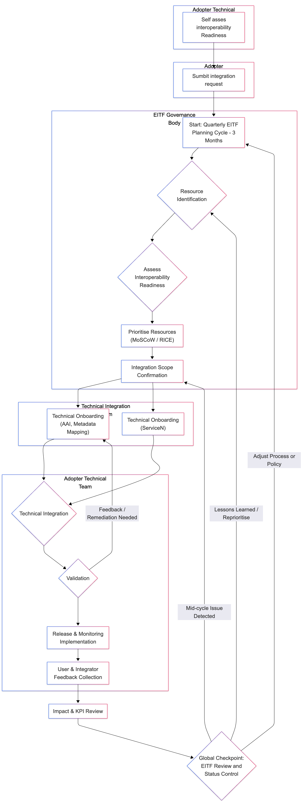
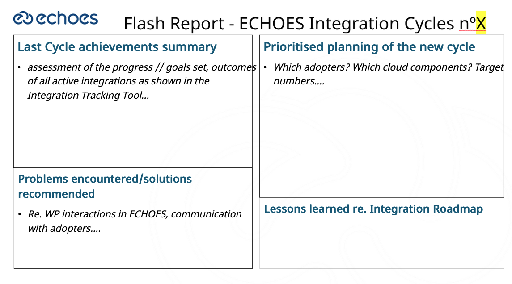

 European Cloud for Heritage Open Science

# Deliverable D3.2 Integration Roadmap

HORIZON-CL2-2023-HERITAGE-ECCCH-01

Horizon Innovation action

**Responsible authors:**

Sally Chambers, Laure Barbot and Matej Ďurčo (DARIAH-EU)

Gianni Dalla Torre (EGI Foundation**)**

|    Project start    | 1 June 2024             |
|:-------------------:|-------------------------|
|  Project duration   | 60 months               |
| Document Identifier | 10.5281/zenodo.17751670 |

© 2025 by the authors, the ECHOES consortium. This work is licensed under a “CC BY 4.0” license.

Deliverable Information

<table style="width:100%;">
<colgroup>
<col style="width: 25%" />
<col style="width: 15%" />
<col style="width: 21%" />
<col style="width: 36%" />
</colgroup>
<thead>
<tr>
<th>Project Number</th>
<th>101157364</th>
<th>Acronym</th>
<th>ECHOES</th>
</tr>
</thead>
<tbody>
<tr>
<td>Full title</td>
<td colspan="3" style="text-align: left;">European Cloud for Heritage OpEn Science</td>
</tr>
<tr>
<td>Project URL</td>
<td colspan="3" style="text-align: left;"><a href="https://www.echoes-eccch.eu/">https://www.echoes-eccch.eu/</a></td>
</tr>
<tr>
<td>EU Project Officer</td>
<td colspan="3">Christian WILK</td>
</tr>
</tbody>
</table>

<table style="width:100%;">
<colgroup>
<col style="width: 26%" />
<col style="width: 15%" />
<col style="width: 21%" />
<col style="width: 36%" />
</colgroup>
<thead>
<tr>
<th>Deliverable</th>
<th>D3.2</th>
<th>Title</th>
<th style="text-align: left;">Integration Roadmap</th>
</tr>
</thead>
<tbody>
<tr>
<td>Work Package</td>
<td>3</td>
<td><strong>Title</strong></td>
<td style="text-align: left;">Enhancing Collaboration and Integration</td>
</tr>
<tr>
<td>Submission date</td>
<td colspan="3" style="text-align: left;">10/12/2025</td>
</tr>
<tr>
<td>Pages</td>
<td>35</td>
<td><strong>Keywords</strong></td>
<td style="text-align: left;">Digital cultural heritage, Integration, Integration roadmap, Metadata, Applications, Workflows</td>
</tr>
</tbody>
</table>

| Lead Partner | DARIAH |
|----|----|
| Responsible Author | Sally Chambers (DARIAH) |
| Authors (Partner) | Sally Chambers, Matej Ďurčo, Laure Barbot (DARIAH), Gianni Dalla Torre (EGI Foundation) |
| Contributors | Georgios Artopoulos (CYI), Carlos Andújar (UPC), Lydia Cadevall (UPC), Dimitris Kotzinos (CNRS-CYU), Joanna Kowalska (PCSS) |

<table>
<colgroup>
<col style="width: 14%" />
<col style="width: 11%" />
<col style="width: 28%" />
<col style="width: 45%" />
</colgroup>
<thead>
<tr>
<th colspan="4">Change log</th>
</tr>
</thead>
<tbody>
<tr>
<td>Date </td>
<td><strong>Version </strong></td>
<td><strong>Author</strong></td>
<td><strong>Change</strong></td>
</tr>
<tr>
<td style="text-align: left;">12/08/2025</td>
<td style="text-align: left;">V0.1</td>
<td style="text-align: left;">Sally Chambers, Matej Ďurčo, Laure Barbot (DARIAH), Gianni Dalla Torre (EGI Foundation)</td>
<td style="text-align: left;">Outlines</td>
</tr>
<tr>
<td style="text-align: left;">12/08/2025</td>
<td style="text-align: left;">V0.2</td>
<td style="text-align: left;">Gianni Dalla Torre (EGI Foundation)</td>
<td style="text-align: left;">Initial Table of Content ; Purpose and scope &amp; how to use the roadmap</td>
</tr>
<tr>
<td style="text-align: left;">7/11/2025</td>
<td style="text-align: left;">V0.3</td>
<td style="text-align: left;">Laure Barbot (DARIAH), Gianni Dalla Torre (EGI Foundation)</td>
<td style="text-align: left;">Steps, timeline, annexes</td>
</tr>
<tr>
<td style="text-align: left;">8/11/2025</td>
<td style="text-align: left;">V0.3</td>
<td style="text-align: left;">Georgios Artopoulos (CYI)</td>
<td style="text-align: left;">Collaborative Research Scenarios section</td>
</tr>
<tr>
<td style="text-align: left;">12/11/2015</td>
<td style="text-align: left;">V0.3</td>
<td style="text-align: left;">Matej Durco (DARIAH)</td>
<td style="text-align: left;">VA integration section</td>
</tr>
<tr>
<td style="text-align: left;">17/11/2025</td>
<td style="text-align: left;">V0.3</td>
<td style="text-align: left;">Carlos Andújar, Lydia Cadevall (UPC)</td>
<td style="text-align: left;">KPIs section</td>
</tr>
<tr>
<td style="text-align: left;">19/11/2025</td>
<td style="text-align: left;">V0.3</td>
<td style="text-align: left;">Joanna Kowalska (PCSS)</td>
<td style="text-align: left;">Cloud components section</td>
</tr>
<tr>
<td style="text-align: left;">27/11/2025</td>
<td style="text-align: left;">V0.3</td>
<td style="text-align: left;">Dimitris Kotzinos (CNRS-CYU)</td>
<td style="text-align: left;">Internal review</td>
</tr>
<tr>
<td style="text-align: left;">28/11/2025</td>
<td style="text-align: left;">V.1</td>
<td style="text-align: left;">Laure Barbot (DARIAH)</td>
<td style="text-align: left;">Integration of feedback</td>
</tr>
<tr>
<td style="text-align: left;">30/11/2025</td>
<td style="text-align: left;">V1.1</td>
<td style="text-align: left;">Xavier Rodier (CNRS)</td>
<td style="text-align: left;">Final review and proofreading</td>
</tr>
</tbody>
</table>

## Abstract

The ECHOES Integration Roadmap provides the operational framework to implement the Integration Strategy defined in deliverable 3.1, translating the high-level and conceptual rationale into practical processes. Whereas the strategy outlines why integration is needed, the present roadmap on how diverse digital resources - from datasets and software to services, workflows, and semantic artefacts - can be prepared, aligned, and incorporated into the emerging Cultural Heritage Cloud (ECCCH). Designed primarily for technical teams and resource providers, the Integration Roadmap also serves as a reference for any external contributors seeking to understand how their resources may participate in the future ECCCH ecosystem.

To accommodate the diversity of integration targets, the roadmap defines a unified process that acts as a common foundation for all integration activities. This global workflow is developed to support sub-processes for resource-specific and level-specific integrations with the Cloud Components as they will be created throughout the ECHOES project by other Work Packages. The ECHOES Integration Roadmap presented here is inherently an iterative approach: integration activities unfold within structured 3 to 6 months “**Integration Cycles**” that support prioritisation, progress monitoring and continuous improvement. Through these cycles, the roadmap itself becomes a living process, enriched by feedback from the ECHOES integration adopters and ECHOES Work Package leaders developing the Cloud Components, all meeting in the ECHOES Integration Task Force (EITF).

At the heart of the roadmap lies a **six-steps integration workflow**, beginning with the identification of candidate resources for integration resulting in the creation of **units of integration**. It then progresses through interoperability self-assessment, technical onboarding, integration validation, release and monitoring and finally user evaluation. This workflow is supported by a dedicated integration tracking tool that manages issues, milestones (i.e. cycles) and progress metrics across all active integration units.

The timeline component of this roadmap situates all these processes within the ECHOES timeframe, from the initial roadmap release (in November 2025) through successive integration cycles (between December 2025 and June 2027) to major review of the roadmap planned for the second phase of the project (between July 2027 and November 2028). As the ECCCH matures, greater automation is expected for some of the integration steps initially described here.

Finally, the roadmap embeds quantitative and qualitative evaluation via the Key Performance Indicators framework and the Collaborative Research Scenarios the results of which ensure that integration success is not only measured in technical compliance but also in meaningful improvements to collaboration, usability and community impact.

*Disclaimer: Views and opinions expressed are however those of the author(s) only and do not necessarily reflect those of the European Union or the European Research Executive Agency. Neither the European Union nor the granting authority can be held responsible for them.*

## Table of Contents

[1. Abstract](#abstract)

[2. Table of Contents](#table-of-contents)

[3. List of figures and tables](#list-of-figures-and-tables)

[4. List of abbreviations](#list-of-abbreviations)

[5. Purpose & Scope](#purpose-scope)

[6. How to Use This Roadmap](#how-to-use-this-roadmap)

[7. Preliminary Integration explorations](#preliminary-integration-explorations)

[8. Integration Steps](#integration-steps)

[Step 1 - Candidate resources identification for integration](#step-1---candidate-resources-identification-for-integration)

[Step 2 - Interoperability Self-Assessment](#step-2---interoperability-self-assessment)

[Step 3 - Technical onboarding](#step-3---technical-onboarding)

[Step 4 - Integration validation](#step-4---integration-validation)

[Step 5 - Release & monitoring](#step-5---release-monitoring)

[Step 6 - User Evaluation](#step-6---user-evaluation)

[9. Timeline of the Integration Roadmap](#timeline-of-the-integration-roadmap)

[What is an Integration Cycle?](#what-is-an-integration-cycle)

[Planning and Prioritising an Integration Cycle](#planning-and-prioritising-an-integration-cycle)

[M18: Initial roadmap release](#m18-initial-roadmap-release)

[M19–M36: setting up 3-month integration cycles](#m19m36-setting-up-3-month-integration-cycles)

[M38 & M54: major reviews and updates](#m38-m54-major-reviews-and-updates)

[10. Monitoring & Review of the integration roadmap](#monitoring-review-of-the-integration-roadmap)

[Integration Tracking tool](#integration-tracking-tool)

[Resource Evaluation and Indicators](#resource-evaluation-and-indicators)

[Collaborative Research Scenarios (CRS)](#collaborative-research-scenarios-crs)

[Conclusion](#conclusion)

[Annexes](#annexes)

[Annex A: ECHOES Integration Questionnaire v.1](#annex-a-echoes-integration-questionnaire-v.1)

[Annex B: ECHOES Cloud Component Integration Factsheet](#annex-b-echoes-cloud-component-integration-factsheet)

[Annex C: Example integration workflow](#annex-c-example-integration-workflow)

[Annex D: Integration Cycles Flash Report Template](#annex-d-integration-cycles-flash-report-template)

[Annex E: Cross-reference tables](#annex-e-cross-reference-tables)

[References](#references)

## List of figures and tables

Figure 1: [Role View of the ECHOES Integration Steps](#integration-steps)

Table 1: [From ECHOES functionalities to Cloud Components](#how-to-use-this-roadmap)

Table 2: [Overview of the first six integration cycles](#timeline-of-the-integration-roadmap)

## List of abbreviations

| AAI   | Authentication and Authorisation Infrastructure    |
|-------|----------------------------------------------------|
| API   | Application Programming Interface                  |
| CH    | Cultural Heritage                                  |
| CRS   | Collaborative Research Scenarios                   |
| D     | Deliverable                                        |
| DT    | Digital Twin                                       |
| ECCCH | European Collaborative Cloud for Cultural Heritage |
| EITF  | ECHOES Integration Task Force                      |
| HDT   | Heritage Digital Twin                              |
| HDTO  | Heritage Digital Twin Ontology                     |
| KB    | Knowledge Base                                     |
| M     | Month                                              |
| SSO   | Single Sign-On                                     |
| UI    | User Interface                                     |
| VA(s) | Vertical Application(s)                            |

## Purpose & Scope 

This document, the ECHOES Integration Roadmap, serves as the primary operational guide for implementing the integration strategy defined in Deliverable (D)3.1. Whereas D3.1 outlines the strategic rationale, the "why", this roadmap focuses exclusively on the practical implementation, the "how". It provides clear, actionable steps and repeatable processes for integrating diverse digital resources into the future ECCCH ecosystem, while also fulfilling the requirements of a formal European Commission deliverable. It is primarily addressed to technical teams and resource providers who are responsible for carrying out integration tasks. However, it is also intended as a key resource for any external project, institution, or data provider seeking to understand the process for contributing to the European Cloud for Heritage Open Science (ECHOES) and the ECCCH under development.

The scope of this roadmap covers the integration of a wide range of digital resources with potential for reuse in ECHOES. This includes, but is not limited to, datasets, software, tools, services, semantic artefacts, and workflows. To accommodate this diversity, the roadmap establishes a **single, high-level integration process that acts as a general skeleton for all integration activities**. This unified framework is then designed to branch into specific sub-processes, checklists, and technical guidelines tailored to the unique requirements of each resource type. Candidate resources for integration are initially identified based on known outputs from the ECCCH-funded projects (such as AUTOMATA[^1], TEXTaiLES[^2], or HERITALISE[^3]), and from the ECHOES Inventory of existing datasets, tools, and workflows with potential for reuse (ECHOES Milestone 8), which consolidates resources mentioned in the initial answers to the ECHOES Consultation[^4].

In addition to the processes included and described in this Integration Roadmap, it is also important to highlight the fact that the roadmap itself is also a process that will be improved thanks to a continuous feedback loop. A series of Integration Cycles are indeed set up to structure the overall planning and prioritisation, monitoring and reviewing of the various units of integration. Thanks to these cycles and to the collaborative integration governance model described in the Strategy, some of the processes initially described here are designed to evolve to better meet the needs of all the actors involved (esp. projects or initiatives who will carry out integration tasks).

This roadmap is not a standalone document; its successful implementation is critically dependent on several other key ECHOES deliverables that provide its strategic and technical foundation. As mentioned above, it directly operationalises the high-level criteria, governance roles, and policies defined in the D3.1 Integration Strategy. In addition to that, the roadmap relies on the D6.1 Data Strategy for the Cultural Heritage (CH) Knowledge Base for the architecture of the CH Knowledge Base, and data lifecycle management. Most critically, the technical substance of this roadmap, including the specific criteria for integration levels and the technical onboarding checklists, is drawn directly from D6.2 Interoperability Requirements and Guidelines. Finally, the processes outlined here align with the broader vision for a collaborative environment, that WP4 deliverables (D4.1 Report on identification of communities and their needs due in May 2026 and D4.2 Strategy for community building due in May 2026) will contribute to shape and the creation of Digital Commons as described in D7.1 The Digital Commons also due in May 2026. Cross-reference tables are provided in the present deliverable to facilitate navigation between these interconnected documents.

## How to Use This Roadmap

This chapter provides guidance on how to navigate the Integration Roadmap effectively. It is essential to understand that this deliverable serves as the **stable framework** for all integration activities within ECHOES. Building on *Deliverable 3.1 Integration Strategy*, it defines the official process, roles, and stages for bringing new resources into the ecosystem. While this roadmap provides the structural skeleton, the detailed, evolving technical specifications and implementation guides are maintained as living documents, primarily within *Deliverable 6.2 Interoperability Requirements and Guidelines*. This approach ensures that the core process remains consistent, while the technical guidance can adapt to new technologies and the evolving needs of the integration objects.

All teams undertaking integration will follow the single, unified process described in **Chapter 8 (Integration Steps)** and will be included/registered in one or more **Integration Cycle(s) as described in Chapter 9** (Timeline of the Integration Roadmap). This provides a consistent, high-level workflow for every integration activity, from initial identification to final release and monitoring. However, the specific technical actions and requirements within each step will differ based on the nature of the resource being integrated.

To find the correct technical details for your specific task, you should consider the following key differentiator, as categories that will determine which specific sections of the technical guidelines (primarily in D6.2) apply to you at each stage of the integration process:

1.  **By Resource Type to integrate:**

The *Integration Strategy* elaborates on the main resource types that can be submitted for integration. The type of the resource determines the mode of integration. The technical requirements for integrating a **dataset** (e.g., metadata mapping, format validation) are fundamentally different from those for integrating **software** or a **service** (e.g., containerisation, Application Programming Interface (API) standards, Authentication and authorization infrastructure (AAI) compliance).

2.  **By Desired Integration Level:**

- Level 1 - Basic Connectivity

- Level 2 - Semantic and technical Integration

- Level 3 - Federated Ecosystem Participation

The levels of integration are defined in D3.1. The targeted level of integration determines the technical depth required. The effort for making a resource simply "connected" (Level 1) is far less than for fully participating in the federated ecosystem (Level 3). The technical criteria for each level will be explicitly defined in D6.2.

3.  **By ECHOES Functionality:** If your resource needs to interact with a specific ECHOES cloud component, such as AAI, Catalogues, or Monitoring, you will need to follow the specific API and protocol guidelines for that service. A preliminary list of expected services follows but we need to stress that: 1/this list is neither final nor exhaustive; 2/ most of the cloud components are under development. For components under development, more information related to the expected date of delivery, as well as possibility to interact with test instances while waiting for the final release will be communicated in due time to the teams willing to use these services. In addition to the overview table below, ECHOES Cloud Component Integration Factsheets – template available in Annex B - will be made publicly available.

| ECHOES Functionality | ECHOES Cloud Component name | Short description | When available |
|:---|----|----|----|
| Catalogue of ECHOES tools and workflows | Single Entry Point | Main entryway for all ECHOES requests | Month (M)30 (November 2026) |
| Authentication | ECHOES AAI |  | M30 (November 2026) |
| Authorization | ECHOES AAI | Manages access to ECHOES functionalities and resources | M30 (November 2026) |
| Security | Security Management | Ensures data and system security, identifies, prevents and diverts possible security threats. | M36 (May 2027) |
| Catalogues of semantic data | Knowledge Base (KB) |  | M48 (May 2028) |
| ECHOES Semantic Data Management | Knowledge Base Manager | Service that provides KG data and corresponding metadata and communicates with other cloud components. | M48 (May 2028) |
| Catalogues of ECHOES Non-Semantic Data and External Data | Internal and External Data Storage Components | Data integrated with ECHOES core services, available for users participating in ECHOES data processing workflows, including, but not limited to, relational databases and object stores. All types of data stored in the federated nodes (external to ECHOES core). | M36 (May 2027) |
| ECHOES Non-Semantic Data and External Data management | Integration Manager | Component that controls connection between various data sources, both ECHOES internal and federated. | M36 (May 2027) |
| Advanced Data Processing Tools | Vertical Applications | Applications offering specialized functionality for researchers. | M48 (May 2028) |
| ECHOES Data Search and Processing Tools | Processing Manager | A set of data search, visualization, and simple processing tools that are part of the ECHOES core. | M36 (May 2027) |
| Monitoring | Monitoring Component and High Availability Management | Monitors system health and performance. Maintains ECHOES uptime and fault tolerance. | M30 (November 2026) |
| Logging | All of the cloud components and a database for logs storage | Collects and stores operational logs for auditing and debugging. | M36 (May 2027) |
| Support | ECHOES Service Desk |  | M30 (November 2026) |
| Computing Resources Allocation | Queue Manager & corresponding database | Computational power allocation by holding task queue for asynchronous processing. | M36 (May 2027) |

Table 1 From ECHOES functionalities to Cloud Components

Complementing the high-level navigation view described in this section, the following one provides an exploration of what is intended by integrating with ECHOES today, and some preliminary thoughts on what integrating with the ECCCH will look like.

## Preliminary Integration explorations

To add a more lively view of what Integration with ECHOES means and set the full scene, the following use case is included in the Integration Roadmap as example showcasing the first interactions of the ECHOES Vertical Applications (VAs) with the Cloud components.

**Vertical Applications are the first implementations showcasing the integration of applications** offering specialized functionality for researchers with the Cloud Infrastructure of ECCCH. The two primary integration vectors are AAI and the CH Knowledge Base.

AAI integration is necessary condition to enable seamless user experience when switching the context of the central ECHOES Portal and the respective VA. The basic workflow/user story/scenario assumes that the user after logging in via their local identity provider (home organisation), will enter the ECHOES Portal with personal user space, catalogue exposing the HDTs in the CHKB and Application Catalogue offering direct access to the Vertical Applications. When moving/ switching context to the Vertical Application thanks to Single-Sign-On mechanism the user will be immediately recognized by the VA and will be able to continue work in the respective personalised workspace of the given VA.

In the Vertical Applications user will be able to create new HDT objects as well as work with existing ones. To this end, the VAs need to be able to interact with the CH Knowledge Base via its API and send and receive an HDT expressed in RDF format conforming to the HDT ontology. That means that the interoperability mechanism (the translation between native model and HDTO) is the responsibility of the Vertical Applications. In practice, this task can be outsourced to dedicated conversion services, which will be able to translate between established formats and HDTO, avoiding the need to implement equivalent functionality in each VA.

It is crucial that the VAs are able to write information about newly generated HDTs into the CHKB in order “to close the loop", i.e. to ensure that newly generated data automatically becomes “new citizen"/part of the ECCCH ecosystem. At the same time, VAs and potentially many other systems, being able to write to CHKB requires conceptual and technical considerations, as well as governance and policy decisions: Can anybody write anything, are there any restrictions and control mechanism in place. Given the multi-faceted nature of this issue, this will need to be answered in coordinated manner between WPs 3,6,7,8 and 9.

It is further expected that the VAs will equip/furnish the HDT with appropriate/comprehensive provenance information, indicating who generated given digital representation based on which source digital object with which tooling. Collecting this information systematically from each processing step in the Knowledge Base will implicitly generate a complete provenance chain for each digital representation of each HDT object. It is important to distinguish between the RDF representation of the HDT conformant to the HDT ontology and actual data/digital object generated by the Vertical Application. For example, in case of the VTL (Virtual Transcription Laboratory) the newly generated data is the text transcribed from a facsimile encoded in hOCR, ALTO, TEI or some other suitable format. This digital content needs to be handled separately: There has to be options to store it as a file / digital object in some storage system ideally integrated into the Cloud infrastructure. This can be a temporary content sharing platform (like owncloud), or a repository for permanent/long-term storage. By default, the personal user space within the Cloud infrastructure will serve as primary storage location, enabling the user to “push/publish” selected objects to a recognized/integrated repository.

Thus, the Vertical Applications are expected to generate pairs of digital content accompanied by an HDT representation of that content, pointing to the respective storage location.

While this Integration exploration section illustrates the first steps of the integration activities that one can expect from a complex ecosystem, it also demonstrates how much a common framework for all the integration activities is needed. That is what the three following sections elaborate on: first by describing the unified process each integration should follow (ch. 8 Integration steps); then by grounding these processes and tasks into the ECHOES timeline via the so-called integration cycles (ch. 9), and finally by highlighting the monitoring and reviewing tasks envisioned for the roadmap itself (ch. 10).

## Integration Steps

This section of the Integration Roadmap describes the core of the process that teams undertaking ECHOES Integration will have to follow. The 6 identified steps explicit processes to be followed, describe the interactions between the various actors involved in a given integration, and identify the operations to be conducted in the Integration Tracking Tool (further described in ch. 10). As presented in the *D3.1 Integration Strategy*, the following actors are involved:

**On the consumers’ side, e.g. a specific project:**

1.  **ECHOES adopter representative** = a representative of a project or initiative willing to integrate with ECHOES. For ECCCH-sister project, a representative is a member of the StaC and will be invited to EITF meetings as required.

2.  **ECHOES adopter technical contact(s)** = the individual(s) responsible for the specific resource to be integrated.

**On the ECHOES side:**

3.  **ECHOES cloud components providers** = partners in charge of developing and/or providing an ECHOES Cloud Component that can be integrated with.

4.  **ECHOES WP leaders** = the team leaders of the ECHOES work package responsible for facilitating the integration activities.

5.  **EITF coordination team** = this team is composed of DARIAH and CNRS-CYU coordinating the EITF, in close liaison with the CNRS, coordinator of the project, and with the support of other ECHOES project team members as required. Once established (November 2026), the possibility of including the management of integration-related activities via in the ECHOES Service Desk will be explored.

The diagram on the next summarises these steps and present them adopting a role view.

Figure 1: Role View of the ECHOES Integration Steps

### Step 1 - Candidate resources identification for integration 

**Actors involved:** ECHOES adopter representative, EITF coordination team

**Expected output:** list of integration units

**Step Description:** The initial step in the integration process is to identify what kind of resource is available for integration with the ECCCH. As described in D3.1, several resource types – like datasets, applications, APIs - are already taken into consideration. And if new (innovative) types should emerge along the way, for which no integration paths have been foreseen, the EITF would assess the ECCCH interest and capacity to support them.

The identification of candidate resources is supported by the **Integration Questionnaire (annex A)** that interested parties (i.e. ECHOES adopters) should fill out to: 1/provide a high-level description of their assets, 2/explain their current infrastructural set-up and 3/elaborate on the level of integration they would like to accomplish with the ECCCH.

To keep track of the initiatives or actors requesting an integration into the ECCCH and of the resources involved, an **overview spreadsheet is kept up-to-date by the EITF coordination team** and is used as an intermediary between the narrative integration questionnaire and its implementation in the ECHOES Integration Tracking Tool (see 10.1 tracking tools section).

The result of this initial step is the identification of integration pairs consisting of a resource from the ECHOES adopter and of an ECHOES Cloud Component. These pairs are also called **“units of integration”**, and one issue per unit is created in the Tracking Tool. One member of the EITF coordination team is assigned to a questionnaire (i.e. to a project or an initiative willing to integrate with ECHOES) and is in charge of creating the related issues in the Tracking Tool. Issues are created as they come in.

**Translation in the Integration tracking tool:** creation of an issue per unit of integration identified.

### Step 2 - Interoperability Self-Assessment 

**Actors involved:** ECHOES adopter technical contacts

**Expected output:** integration readiness

**Step Description:** Considering the ECCCH Interoperability Guidelines and requirements (D6.2 expected early 2026), some Interoperability Checklists will be created to enable a self-assessment of the various resources to be integrated into ECHOES. This second step has a great potential for automation, and validation tools could come into play relatively easily. In the meantime, and complementing the checklists, appropriate documentation – Guidelines, Factsheets (see Annex B), FAQ – and information sessions - onboarding or mentoring sessions, cloud components workshop presentation – will be organised by the EITF to complement the individual technical support available via common ECHOES project channels.

This Interoperability self-assessment step should lead to a better understanding of an **integration readiness** and to the identification of the best integration level or option per unit of integration.

**Translation in the Integration tracking tool:** agreement on the start and end date of the units of integration.

### Step 3 - Technical onboarding

**Actors involved:** ECHOES adopter technical contacts, ECHOES cloud components providers

**Expected output:** cloud components integration implemented

**Step Description:** Multiple technical onboarding steps can run in parallel.

Even though some cloud components are still under development at the time of writing this document, proper documentation is supposed to be available alongside the release of the testing instances of the components. Following the documentation, and exchange of information with the ECHOES Cloud Components provider where necessary should enable the ECHOES adopter technical contact to implement a given integration task.

**Translation in the Integration tracking tool:** each issue is assigned to two technical individuals (one ECHOES adopter technical contact and one ECHOES cloud component provider). Communication between them happens in the dedicated issues.

### Step 4 - Integration validation

**Actors involved:** ECHOES adopter technical contacts, ECHOES cloud components providers

**Expected output:** cloud component integration validated

**Step Description:** closely connected to step 3 technical onboarding, the validation of the units of integration relates to the approvement of the implementation from both side (ECHOES adopters and ECHOES component providers). Where needed, test instances) of the different cloud components can be used at this stage as they provide a sandbox like environment where the components can be properly tested before their adoption in full production environment.

**Translation in the Integration tracking tool:** change of status of the unit of integration validated

### Step 5 - Release & monitoring

**Actors involved:** ECHOES adopter technical contacts, ECHOES cloud components providers

**Expected output:** Released and actively monitored integrated resources (applications, Heritage Digital Twins (HDTs)); performance metrics collected such uptime, errors, and data usage.

**Step Description:** Once validation (Step 4) is complete, the services are released and enter a focused monitoring phase. Monitoring in ECHOES is intentionally lightweight, as many underlying components rely on external tools and infrastructures. The primary emphasis is therefore on monitoring the **integration layer**, ensuring that services, data flows, and interactions with the Knowledge Base operate reliably and consistently. Operational checks address uptime, performance, and error detection, while recognising that certain low-level components may fall outside the scope of ECHOES-native monitoring capabilities.

Data and HDT usage within the Knowledge Base is observed at a high level to verify integrity and overall usability. This includes collecting aggregated statistics on access patterns, HDT consultations, annotations, and user-generated metadata, supported by essential activity logging and auditing. Where beneficial, the infrastructure may employ tools such as ELK, Prometheus, Zipkin, or Nagios to improve visibility and support issue diagnosis.

The core monitoring capability is expected to be fully in place by Month 48 (KPI 1.7), and the insights gathered during this phase directly support Step 6 – User Evaluation.

**Translation in the Integration tracking tool:** related units of integration issues are closed and considered completed

### Step 6 - User Evaluation

**Actors involved:** ECHOES adopter representative

**Expected output:** User feedback on the integration cloud components; insights guiding further improvements; Collaborative Research Scenarios (CRS) implemented and evaluated

**Step Description:** In this step, the integration adopters evaluate how the integrated components perform with their user communities. Feedback may come from different sources, including surveys or workshops carried out in other work packages, but is consolidated here together with the more structured input gathered through the integration cycle. The feedback generally concerns either technical implementation aspects, potentially requiring a return to Step 4, or observations on usability and functionality, which are forwarded to the component owners.

**Translation in the Integration tracking tool: NA**

Finally, a process to manage cases where integrated resources become obsolete or are not actively maintained anymore needs to be developed. This could include considering the possible transfer of responsibilities to other partners within the ECCCH federation.

## Timeline of the Integration Roadmap

The timeline presented below provides an overview of how the ECHOES Integration Roadmap will unfold over the course of the project. It describes the key notion of **“Integration cycles”**, highlights how the coordination of these cycles that structure the progressive implementation and refinement of integration activities is foreseen. Through the phases approach presented in the last three sub-sections, the roadmap ensures both agility and continuity, allowing integration processes to evolve alongside the maturity of the ECCCH ecosystem.

### What is an Integration Cycle?

As stated in *D3.1 Integration Strategy*, Integration in ECHOES follows an **agile and iterative process** that combines open, rolling intake with ideally regular three-month coordination cycles that could be turned into six-month cycles upon decision of the EITF. This hybrid structure (iterative but with rolling intake) allows new integrations to start as soon as they are ready, while maintaining a clear rhythm to regularly “capture” the state of the integration activities. It enables a continuous improvement of the roadmap processes all along the project lifetime, as well as an easy way to **regularly review the progresses of the units of integration, update priorities and provide a snapshot of the ECHOES integration status.**

As explained in the previous section, the process begins with the identification of candidate resources through the integration questionnaire and the creation of the related unit of integration issues in the Integration Tracking Tool. Integrations entering the process in the middle of an integration cycle will be tagged appropriately - for ex. \`\`\`mid-cycle start\` - and added to the queue to avoid that they have to wait the next quarterly cycle. However, it is only as part of the next prioritisation session (at the beginning of the next cycle) that their alignment with the roadmap will be fully effective.

In practice, every three (or six) months, the EITF coordination team prepares the following:

1\. An **assessment of the progress** and outcomes of all active integrations within the ending integration cycle.

2\. A **prioritised planning** of the cycle to begin. decide what you track/goal/what you have to achieve – make sure there is liaison between people realising the integrations and those in charge of planning the next cycle. Checkmark to ensure that what is planned can actually be realised. Plan resource allocation

3\. A **consolidation of the lessons learned** is also kept up-to-date, in order to inform the roadmap itself and eventually change the processes supporting the management of the roadmap.

A summary of these elements is shared with the EITF to collect potential feedback from this wider group acting as a liaison body between all ECHOES adopters and the WP leads of the ECHOES project. The Integration Cycles Flash Report Template included in Annex D suggests a presentation format to support this work.

### Planning and Prioritising an Integration Cycle 

At the start of each cycle and to ensures that all incoming demands for integration are taken into account and scheduled as efficiently as possible, the EITF coordination team update the Integration Roadmap following a MoSCoW prioritisation methodology based on the following elements:

- *Must Have:* include integrations units with a strategic imperative. These integrations are considered critical to deliver the core objectives of the ECCCH Cloud. Most of the integration units from the ECCCH sister projects would likely fall under this category.

<!-- -->

- *Should Have*: include integrations to schedule for a given integration cycle. These integrations would significantly enhance the usability of/collaboration within the ECCCH, but are not so time-sensitive or strategically critical.

- *Could Have*: these integrations would add value and present an innovative potential but are not essential for the ECCCH “Minimum Viable Product”[^5] or short-term operations. Can be postponed to the next integration cycle.

- *Won’t Have (for now)*: these integrations are not justified for the current phase due to low impact or unresolved blockers. May be revisited later. Would fall under this category all the integrations relying on cloud components not yet available for example.

### M18: Initial roadmap release

The release of the present document, in November 2025 (M18), realises the initial roadmap release. Alongside the publication of the *Integration Strategy*, the Roadmap defines integration actors and processes, even though not all the cloud components are ready for integration yet. In parallel and as already mentioned, *D6.1 Data Strategy for the CH Knowledge Base* is released as well, offering/ensuring an initial view on the data formats and corresponding data harvesting protocols so that data from the ECCCH “contributors” can be prepared to be processed by ECHOES.

At the same time and as illustrated in section 7 Preliminary Integration Explorations, initial integrations (with the AAI and the Knowledge Base) are already happening, especially with the three Vertical Applications developed within the ECHOES project.

On the ECCCH projects side of things, as of November 2025, the first three sister projects are running for one year. They have one representative within the EITF and a first draft of the integration questionnaire has been shared (see annex C and the example integration workflow). In addition to that, 6 out of 10 projects from the second ECCCH projects wave have started in October 2025, and the 12 first ECHOES cascading grants projects call 1 will be notified in December 2025 of their selection.

### M19–M36: setting up 3-month integration cycles

Between December 2025 and June 2027, 6 integration cycles will run offering a chance to test and improve the integration roadmap while starting to collaboratively build the ECCCH. Table 2 below shows what kind of elements are already known and should be taken into consideration to plan and prioritise integrations throughout these upcoming cycles.

<table style="width:98%;">
<colgroup>
<col style="width: 22%" />
<col style="width: 74%" />
</colgroup>
<thead>
<tr>
<th colspan="2">Table 2: Overview of the first six integration cycles (with initial set of tasks)</th>
</tr>
</thead>
<tbody>
<tr>
<td>January-March 2026</td>
<td>
<em>Context:</em>

<ul>
<li>
January 2026 – EITF meeting
</li>
<li>
February 2026: <em>D6.2 Interoperability Guidelines</em> will provide detailed documentation needed to comply to ECHOES requirements
</li>
<li>
Quarter 1, 2026: 12 Cascading Grants call 1 data are expected to start
</li>
<li>
March 16-20: first Stakeholders Council during the ECHOES Annual meeting together with 13 sister projects
</li>
</ul>

<em>Expected goals:</em>

<ul>
<li>
Summary of the ECHOES VAs integration status
</li>
<li>
For the 1st ECCCH projects wave: integration step 2 completed
</li>
<li>
For the 2nd ECCCH projects wave: integration step 1 completed
</li>
<li>
For the Cascading Grants Call 1 – timeline alignment between projects and ECHOES Cloud Components planned releases
</li>
</ul></td>
</tr>
<tr>
<td>April-June 2026</td>
<td>
<em>Context:</em>

<ul>
<li>
Final cloud architecture
</li>
<li>
Final version of the HDTO
</li>
<li>
VAs: first working (external) prototypes publicly available
</li>
<li>
Mid-May 2026: 3d ECCCH projects wave starting
</li>
<li>
end of May 2026: Cascading grants call 2 engagement and collaboration indicative project start
</li>
</ul>

<em>Expected goals:</em>

<ul>
<li>
Integration questionnaire is made available for projects or initiatives proactively reaching out to the ECHOES coordinator
</li>
</ul></td>
</tr>
<tr>
<td>July-Sept. 2026</td>
<td>
<em>Context:</em>

<ul>
<li>
<em>Review meeting</em>
</li>
</ul>

<em>Expected goals:</em>

<ul>
<li>
To be defined
</li>
</ul></td>
</tr>
<tr>
<td>Oct. Dec. 2026</td>
<td>
<em>Context:</em>

<em>Expected goals:</em>

<ul>
<li>
Focus on the 12 cascading grants call 1 data - Last cycle for them to integrate their data
</li>
</ul></td>
</tr>
<tr>
<td>January-March 2027</td>
<td>
<em>Context:</em>

<em>Expected goals:</em>

<ul>
<li>
<em>To be defined</em>
</li>
</ul></td>
</tr>
<tr>
<td>April-June 2027</td>
<td>
<em>Context:</em>

<ul>
<li>
Cascading grants call 3 data and vertical applications projects start
</li>
</ul>

<em>Expected goals:</em>

<ul>
<li>
Assessing the integration processes overall and prepare major changes for the second phase (M37-M54)
</li>
<li>
Exploring the need for SLAs
</li>
</ul></td>
</tr>
</tbody>
</table>

### M38 & M54: major reviews and updates

Between July 2027 and November 2028, almost 6 new integration cycles will happen. While it is difficult to foresee what they will include or how the processes might have evolved in the meantime, one dimension that we can already highlight as one of the goals for this new phase, is that **more automation** – and less ad-hoc communication – should have entered the integration processes, thanks to the work delivered by other ECHOES Work Packages and to the feedback received from the ECHOES adopters. Even though **continuous human interaction** will remain needed in the integration process (and should remain needed as it is also one dimension contributing to the development of the (technical) ECHOES community), we can expect that more tools will come into play that will ease the assessment and validation steps.

In parallel, some major milestone will also be achieved by the ECHOES project that should considerably ease and fasten the integration activities. For ex. the three Virtual Applications developed within ECHOES will be online by M48 (cf. KPI 1.5), and the monitoring tools will be operational also by M48 (May 2028) (cf. KPI 1.7).

In addition to that, the EITF will also keep in mind that the target numbers for M60 (i.e. end of the ECHOES project, May 2029) include the following: more than 5000 of HDTs accessible; more than 2000 of HDTs processed by tools and more than 10 external VAs in development.

## Monitoring & Review of the integration roadmap

While the Integration Cycles are providing a framework and giving a pace to the tracking and assessment of the implementation of the integration strategy, as explained in the previous section, this chapter details how progresses are tracked and evaluated, including how the **Integration Tracking Tool** is set up, how the **Key Performance Indicators** of the project related to integration are taken on board in the roadmap, and how **Collaborative Research Scenarios** are offering a more qualitative approach and a user engagement dimension in the more technical dimensions discussed so far.

### Integration Tracking tool

At the time of writing this deliverable, the choice of a software forge/code repository for the ECHOES project has not been made yet, even though some platforms - especially GitLab and GitHub - are used by various partners and tested out at the project scale. This influences the deployment of the integration tracking tool, as, ideally, the issues created to manage integration activities should be living in the code repository where cloud components to be integrated with are developed. However, whatever the final choice of the platform, the same rationale explained below will be valid and implemented.

A dedicated “Integration” project is created in the repository. It allows the tracking and monitoring of all integration related activities and is used by the EITF coordination team as an **integration dashboard**. The following convention is used:

- 3 levels of issues are created[^6]:

  - A parent issue for the project/initiative willing to integrate with the ECCCH

  - A sub-issue per resource from this project/initiative

  - A third level of sub-issue per component integration, the so-called “unit of integrations” (in case several components should be integrated with a given resource (i.e. AAI and Monitoring))

- Milestones are set following the integration cycles defined in the timeline above

- Due dates are added to all issues, recording projects end dates, or estimated integration deadlines depending on the issue type

- Labels foreseen: one label per cloud component, one label to register the status of the issue (candidate, ready, active, done), one label to identify the \`mid-cycle start\`...

The Integration Tracking Tool is managed by the EITF coordination team but is set to public to allow interested parties to get an idea of the concrete steps covered by the implementation of an integration task.

### Resource Evaluation and Indicators 

Within ECHOES, WP9 is working on developing a set of **Evaluation Criteria and Sustainability indicators** for the ECCCH. Although this work is still under development, several elements can already be highlighted here as the dimensions and sub-dimensions considered by the nascent evaluation matrix are key to evaluate the relevance of the integration activities. Indeed, dimensions such as data quality, metadata and paradata quality, compliance with internal and external regulations, compatibility, usability, software quality (and the list is not exhaustive here) are defined and put into action by WP9. In parallel, investigations related to tools supporting validation, reasoning and quality assessment of semantic and linked data resources are also conducted. These tools include framework for checking data integrity and conformance to ontologies, for measuring dataset completeness, accuracy and FAIRness, and for reasoning over RDF graphs.

Thanks to the alliance of both the evaluation criteria and the tools that will be chosen to support validation, we can expect some major review of the integration roadmap towards automation of especially steps 2 and 4 of the current workflow described in Section 8. Regarding the interoperability self-assessment, several tools will help automate this process, for example, static code analysis tools to assess software contributions, and quality evaluation tools for data and metadata contributions. Once a new resource is integrated, WP9 will also provide tools to support its validation and user evaluation.

### Collaborative Research Scenarios (CRS)

To conclude this section about monitoring and reviewing the Integration Roadmap, it is important to present here a more qualitative and community approach to assess the success of the integrations: the Collaborative Research Scenarios. Indeed, ECHOES Task 3.3, *Enhancing and evaluating the collaboration potential of ECHOES*, acts as bridge between the planned infrastructure’s technical aspects and its community dimensions, as developed within WP4, ensuring that the Cloud evolves to a functional collaborative ecosystem. CRS are designed to iteratively map how ECHOES can increase collaboration across target user communities by using its resources, tools and workflows.

CRS are co-developed with key communities’ representatives identified with WP4 and engaged through events, such as DARIAH Annual Event 2025, in Gottingen, Germany, the Contemporary Social History Archives (ASKI) in Athens, Greece, DARIAH General Assembly and National Coordinators Committee Annual Meeting 2025, in Nicosia, Cyprus. Through this co-design process, user communities participate in a reflexive dialogue that helps ECHOES better understand what is needed for them to benefit from the Digital Continuum and documents the impact of ECHOES services on enabling interdisciplinary and intersectoral collaboration.

Each CRS operates as a *narrative, storyboard-style model* that illustrates how different actors might collaborate within ECHOES to achieve shared goals. By combining empathy mapping, persona development, and workflow design, these scenarios reveal the motivations, barriers, and needs, and data practices of cultural heritage professionals. Between M21-M36 (February 2026-May 2027) selected Integration Scenarios will be created and implemented with user communities’ representatives and the support of the EITF. After M36, WP3 and the EITF will work with mature ECCCH projects to co-design dedicated CRS based on their workflows and resources.

This process will allow WP3 to assess how integrated resources enhance collaboration within their respective communities and across communities. In particular, three distinct CRS will document and monitor qualitatively how the specific resources integrated meet the KPIs set in alignment with WP9. Some of the indicators that will measure collaboration include, among others, Value of technology index improvement, Knowledge improvement index, Partnership synergy, and Capacity changes. Results will be analysed in *D3.4 ECHOES Collaboration Potential Report*.

## Conclusion

This ECHOES Integration Roadmap establishes the operational backbone of the ECHOES integration efforts, translating the strategic dimensions defined in *D3.1 Integration Strategy* into a structured and iterative process. By providing a unified framework that accommodate a diversity of resource types, providers, various technological contexts and maturity levels, the roadmap ensures a coherence across the inherent heterogeneity of the ECCCH ecosystem.

The Integration Roadmap operationalises roles and responsibilities identified in the strategy, so that all stakeholders willing to contribute to the ECCCH in the making can get an idea of what is expected in terms of data, tools and workflows integration. As highlighted many times in this document, the processes described here will only take their full meaning once other key ECHOES deliverables are released, especially the Interoperability Guidelines.

Furthermore, the introduction of Integration Cycles and the Integration Tracking Tool provide a concrete mechanism for planning, monitoring and improving integration activities over time. As ECHOES enters new phases, the iterative model will support inclusion of major input from other WPs – interoperability guidelines, release of key cloud components for resource integration – progressive integration of different projects and initiatives (from the ECCCCH funded projects that have to use the ECHOES infrastructure to individual initiatives willing to be included in the ECCCH), and progressive complexity and depth of the integration realised.

Ultimately, the Integration Roadmap contributes not only to the technical implementation of the ECCCH but also to the capacity building and community-centered mission. Thanks to the development of the Collaborative Research Scenarios and the inclusion of community-driven evaluation methods, the roadmap ensures that the integration success is meaningfully measured. As a living document, this Roadmap will evolve over time and new versions will be made publicly available to the ECCCH stakeholders to reflect the most up-to-date integration documentation needed.

## Annexes

### Annex A: ECHOES Integration Questionnaire v.1

At the time of writing this deliverable, a series of feedback has been collected to improve this questionnaire, and a new version is already being developed, but not yet ready to be added here.

Target audience: projects wishing to integrate with ECHOES.

**1. What do you plan to integrate with ECHOES?**

According to the upcoming ECHOES Integration Guidelines, 3 main domains of integration with ECHOES are foreseen: 1/ Data/metadata integration (datasets, semantic artefacts...); 2/ Applications & Services integration; 3/ Workflows integration. Can you already identify which resources your project will integrate with ECHOES? What are the Key Exploitable Results of your project?

**2. During your project lifetime, what are your infrastructural set-up and your potential needs (for integration with ECHOES)?**

*If available provide a simple architecture diagram or sketch of your setup during the project.*

*As explained in the ECHOES FAQ, “effort to integrate key aspects like services and data models are supposed to be covered by the projects that are funded under the ECCCH related calls. (...) ECHOES is responsible for tools developed by and within the ECHOES Consortium. Support and maintenance for other tools and applications remain under the responsibility of the original developers, including tools emanating inside or outside the ECCCH calls.” That said,*

**3. Looking towards the sustainability of your project outputs, what are your needs (for integration)?**

*Based on the 5 areas described below, please provide a brief description of what you expect from the ECCCH at the end of your project. What do you plan to provide and sustain on your own, what do you expect from the ECCCH? Where possible, highlight the sustainability challenges you’ll face once your project will end.*

| **Areas**                               | **Expectations/needs** |
|-----------------------------------------|------------------------|
| Identity, access and management         |                        |
| ECHOES Knowledge Base – Discoverability |                        |
| Storage                                 |                        |
| Computation / processing                |                        |
| Deployment Environment                  |                        |
| Other (please specify)                  |                        |

**4. What are the main deliverables or milestones connected to the description or the release of your project key exploitable results? Please add the related due dates.**

Here, you should not provide us with the list of all your deliverables and milestones, but only the reports describing the main resources or outputs of your project, especially if they include sections on your relation to ECHOES.

| **Name of the deliverable or milestone** | **Short description** | **Due date** |
|:---|----|----|
|  |  |  |
|  |  |  |

### Annex B: ECHOES Cloud Component Integration Factsheet

The goal of the ECHOES Cloud Component Integration Factsheet is to provide a description of the component that are available for resource integration purposes. Inspired from the European Open Science Cloud (EOSC) Interoperability Guidelines[^7], these factsheets are intended as a summarised view of a given component, complementary of the ECHOES interoperability guidelines.

<table style="width:100%;">
<colgroup>
<col style="width: 33%" />
<col style="width: 66%" />
</colgroup>
<thead>
<tr>
<th colspan="2"><strong>ECHOES Integration Roadmap – Annex B – ECHOES Cloud Component Integration Factsheet template</strong></th>
</tr>
</thead>
<tbody>
<tr>
<td style="text-align: left;">Name of the Cloud Component</td>
<td style="text-align: left;"></td>
</tr>
<tr>
<td style="text-align: left;">Short description of the Component</td>
<td style="text-align: left;"></td>
</tr>
<tr>
<td style="text-align: left;">Licensing information</td>
<td style="text-align: left;"></td>
</tr>
<tr>
<td style="text-align: left;">Why to use it? Why adopt this cloud component?</td>
<td style="text-align: left;"></td>
</tr>
<tr>
<td style="text-align: left;">
How to integrate with it?

-Integration Option/Level 1

-Integration Option/Level 2

-.....
</td>
<td style="text-align: left;"></td>
</tr>
<tr>
<td style="text-align: left;">Examples of integration</td>
<td style="text-align: left;"></td>
</tr>
</tbody>
</table>

### 

### Annex C: Example integration workflow

Some of the ECCCH projects have started and are already actively contributing to the EITF. In that framework, the first integration questionnaires were received, and in this annex C we are trying to examplify a full integration workflow, based on the answer received to the questionnaire by the Textails project.

**1. Resource Identification**

The first step in the integration workflow is identifying the resources to be integrated. For Textailes, this includes their data lake, its schema, and the associated metadata and tools.

A detailed discussion between the project representative and the EITF coordination team is pending, aimed at refining the definition and structure of the data lake to ensure alignment with ECHOES interoperability guidelines once released.

**2. Interoperability assessment**

Once resources are identified, their interoperability is assessed, depending on the resource type:

**Data:** The compatibility of Textailes’ data schema with the **HDTO** is evaluated.

**Tools & Services:** All tools and services within the Textailes ecosystem are designed as containerized microservices. Each service is assessed for:

- Compatibility with **ECHOES API** specifications

- Communication endpoints (which service communicates via which API)

- Functionality offered

- Data inputs and outputs

- Deployment locations

This assessment is further refined by evaluating the need to interact with each individual cloud component separately.

**3. Technical Onboarding**

Technical personnels (from Textailes and from ECHOES) are assigned per integration unit. They maintain regular communication and reporting through issue tracking systems and check-ins with their superiors (Textailes representative in the EITF and ECHOES WP lead), ensuring a smooth implementation throughout **Integration Cycle(s)**.

**4. Integration Validation**

Individual integration unit implemented. Ideally, these units are presented collectively to the representatives of Textailes and ECHOES for approval before full deployment.

**5. Release & Monitoring**

Once validated, services are released and actively monitored:

- **Service Monitoring:** Conducted via ECHOES monitoring tools to track uptime, performance, and errors

- **Data Monitoring:** Performed using statistics collected over the Knowledge Base to ensure data integrity and usability

**6. User Evaluation**

Finally, the integrated resources are evaluated through the engagement of the Textailes user base. This includes testing the upgraded tools and integrated data/knowledge base and collecting feedback from the community to guide further improvements. At this stage, collaborative research scenarios engaging a user base beyond the one from the Textailes project can also be set up.

### 

### Annex D: Integration Cycles Flash Report Template

### 

### Annex E: Cross-reference tables 

To clarify the relationship between this roadmap and its companion deliverables, the following table provides a quick reference guide.

<table>
<colgroup>
<col style="width: 42%" />
<col style="width: 18%" />
<col style="width: 38%" />
</colgroup>
<thead>
<tr>
<th colspan="3"><strong>ECHOES Integration Roadmap Annex D Table 1 - Cross-Reference Table to other ECHOES delievrables</strong></th>
</tr>
</thead>
<tbody>
<tr>
<td style="text-align: left;"><strong>If you need to know...</strong></td>
<td style="text-align: left;"><strong>Primary Document</strong></td>
<td style="text-align: left;"><strong>Relevant Section(s)</strong></td>
</tr>
<tr>
<td style="text-align: left;">The official definition of a term used in this roadmap</td>
<td style="text-align: left;"><a href="https://docs.google.com/spreadsheets/d/1V6yJ7JN6xauLlXP6UyKK0KhcRsuLUskkHLw-lyFLK58/edit?gid=1070732103#gid=1070732103">ECHOES Glossary (T4.2.3)</a></td>
<td style="text-align: left;">The complete document is the reference for all terminology.</td>
</tr>
<tr>
<td style="text-align: left;">The overall integration strategy, goals, and governance roles</td>
<td style="text-align: left;"><a href="https://univtoursfr.sharepoint.com/:w:/r/sites/ECHOES2/Documents%20partages/WP%2003%20Enhancing%20Collaboration%20and%20Integration/241008_ECHOES_%20WP03_Deliverables/240624_ECHOES_D3.1_Integration_Strategy_for_datasets,_tools_and_workflows_with_potential_for_reuse_in_ECHOES/ECHOES_D3.1_Integration_Strategy.docx?d=wa29c8b809ab34b0ba7fbf3d1debd1d76&amp;csf=1&amp;web=1&amp;e=4PfJSL">D3.1 Integration Strategy</a></td>
<td style="text-align: left;">Sections covering policy, criteria, and EITF roles.</td>
</tr>
<tr>
<td style="text-align: left;">The step-by-step process for an integration cycle</td>
<td style="text-align: left;">D3.2 Integration Roadmap (this document)</td>
<td style="text-align: left;">Chapters 6 (Integration Cycle) and 7 (Steps).</td>
</tr>
<tr>
<td style="text-align: left;">The principles of data governance and the CH Knowledge Base architecture</td>
<td style="text-align: left;"><a href="https://univtoursfr.sharepoint.com/:w:/r/sites/ECHOES2/Documents%20partages/WP%2006%20Setting%20the%20Cloud%20Environment/241009_ECHOES_WP06_Deliverables/240624_ECHOES_D6.1_CH_knowledge_base_Data_Strategy/Semptember%20D6.1%20(WORKING%20DELIVERABLE).docx?d=w7dec0bf782d449b59e4a6528be9678d8&amp;csf=1&amp;web=1&amp;e=L7200N">D6.1 Data Strategy</a></td>
<td style="text-align: left;">Sections on data architecture, governance, and FAIR principles.</td>
</tr>
<tr>
<td style="text-align: left;">Specific technical standards for data, metadata, and APIs</td>
<td style="text-align: left;">D6.2 Interoperability Guidelines</td>
<td style="text-align: left;">Sections on data standards, protocols, and APIs.</td>
</tr>
<tr>
<td style="text-align: left;">Guidelines for software development, deployment, and security</td>
<td style="text-align: left;"><a href="https://univtoursfr.sharepoint.com/:w:/r/sites/ECHOES2/Documents%20partages/WP%2006%20Setting%20the%20Cloud%20Environment/241009_ECHOES_WP06_Deliverables/240624_ECHOES_D6.2_Interoperability_requirements_and_guidelines/240704_ECHOES_WP6_D6.2_Interoperability%C2%A0requirements%20and%C2%A0guidelines.docx?d=w884533d6ba45491890e35199cd80fb2d&amp;csf=1&amp;web=1&amp;e=A4vXK3">D6.2 Interoperability Guidelines</a></td>
<td style="text-align: left;">Section 6 (Software development guidelines).</td>
</tr>
<tr>
<td style="text-align: left;">The architecture of the ECHOES platform you are integrating with (data, application, and infrastructure components)</td>
<td style="text-align: left;">D6.3 Architecture for data and cloud components</td>
<td style="text-align: left;">Chapter 4, which details the business, data, application, and infrastructure architecture of ECHOES.</td>
</tr>
<tr>
<td style="text-align: left;">The vision for the ECHOES Digital Commons</td>
<td style="text-align: left;"><a href="https://univtoursfr.sharepoint.com/:w:/r/sites/ECHOES2/Documents%20partages/WP%2007%20Digital%20Commons%20Knowledge-Base/ECHOES_WP07_Deliverables/240624_ECHOES_WP07_D7.1_The_Digital_Commons/20250527-ECHOES_D7.1-DRAFT.docx?d=w0b78d9207dc84be8af1d4f84a484bb61&amp;csf=1&amp;web=1&amp;e=rcvfI8">D7.1 The Digital Commons</a></td>
<td style="text-align: left;">The complete document provides context for collaborative goals.</td>
</tr>
<tr>
<td style="text-align: left;">The ECCCH governance framework, and the envisioned functioning of the technical governance</td>
<td style="text-align: left;">D10.2 Governance Model of the legal entity</td>
<td style="text-align: left;">Section on the technical governance</td>
</tr>
</tbody>
</table>

<table style="width:98%;">
<colgroup>
<col style="width: 32%" />
<col style="width: 32%" />
<col style="width: 32%" />
</colgroup>
<thead>
<tr>
<th colspan="3" style="text-align: left;">ECHOES Integration Roadmap Annex D Table 2 - Cross-Reference Table to D3.1 (strategy) and D6.2 (technical requirements).</th>
</tr>
</thead>
<tbody>
<tr>
<td style="text-align: left;">D3.2 Section</td>
<td style="text-align: left;">D3.1 Strategic Reference</td>
<td style="text-align: left;">D6.2 Technical Reference</td>
</tr>
<tr>
<td style="text-align: left;">Purpose &amp; Scope</td>
<td style="text-align: left;">Sec. 1.2, H. 2</td>
<td style="text-align: left;">—</td>
</tr>
<tr>
<td style="text-align: left;">How to Use This Roadmap</td>
<td style="text-align: left;">Sec. 3, Sec. 4</td>
<td style="text-align: left;">—</td>
</tr>
<tr>
<td style="text-align: left;">Integration Cycle</td>
<td style="text-align: left;">Sec. 4.1, Sec. 5</td>
<td style="text-align: left;">Sec. 5, Sec. 6</td>
</tr>
<tr>
<td style="text-align: left;">Integration Levels</td>
<td style="text-align: left;">Sec. 4.3</td>
<td style="text-align: left;">Sec. 4.1</td>
</tr>
<tr>
<td style="text-align: left;">Monitoring &amp; Review</td>
<td style="text-align: left;">Sec. 6, Sec. 8</td>
<td style="text-align: left;">Sec. 7</td>
</tr>
</tbody>
</table>

## References

- Koumantaros, K., Themis Zamani, Kagkelidis Konstantinos, Thermolia, C., Emir Imamagic, Daniel Vrcic, Katarina Zailac, & Cyril L'Orphelin. (2023). EOSC Monitoring: Architecture and Interoperability Guidelines (1.0.1). Zenodo. <https://doi.org/10.5281/zenodo.8333934>

[^1]: European Commission. (n.d.). *AUTOmated enriched digitisation of Archaeological liThics and cerAmics* (AUTOMATA, Project ID 101158046). CORDIS. [https://cordis.europa.eu/project/id/101158046](https://cordis.europa.eu/project/id/101158046?utm_source=chatgpt.com)

[^2]: European Commission. (n.d.). *TEXTaiLES – Textile digitisAtion tools and methods for cultural heritage* (Project ID 101158328). CORDIS**.** <https://cordis.europa.eu/project/id/101158328>

[^3]: European Commission. (n.d.). *HERITALISE – Heritage buildings and objects’ digitisation & visualisation within the cloud* (Project ID 101158081). CORDIS. <https://cordis.europa.eu/project/id/101158081>

[^4]: <https://www.echoes-eccch.eu/echoes-consultation/>

[^5]: Although this terminology of an ECCCH Minimum Viable Product (MVP) is not used in the ECHOES context, it helps us to describe the state of the cloud infrastructure in the making that will be available to its first users and customers. See Minimum Viable Product definition on Wikipedia for more details: <https://en.wikipedia.org/wiki/Minimum_viable_product>

[^6]: If GitLab is chosen, the use of Epics, issues and tasks are foreseen; while if GitHub is chosen, hierarchy in the issues will be introduced.

[^7]: Koumantaros, K., Themis Zamani, Kagkelidis Konstantinos, Thermolia, C., Emir Imamagic, Daniel Vrcic, Katarina Zailac, & Cyril L'Orphelin. (2023). EOSC Monitoring: Architecture and Interoperability Guidelines (1.0.1). Zenodo. <https://doi.org/10.5281/zenodo.8333934>
