 European Cloud for Heritage Open Science

**Deliverable D6.1 - Data Strategy for the CH Knowledge Base**

HORIZON-CL2-2023-HERITAGE-ECCCH-01

Horizon Innovation action

**Responsible authors:**

**Cyprus Institute (CYI) & Poznańskie Centrum Superkomputerowo-Sieciowe (PCSS)**

|    Project start    | 1 June 2024             |
|:-------------------:|-------------------------|
|  Project duration   | 60 months               |
| Document Identifier | 10.5281/zenodo.17751757 |

© 2025 by the authors, the ECHOES consortium. This work is licensed under a “CC BY 4.0” license.

Deliverable Information

<table style="width:99%;">
<colgroup>
<col style="width: 21%" />
<col style="width: 15%" />
<col style="width: 13%" />
<col style="width: 48%" />
</colgroup>
<thead>
<tr>
<th>Project Number</th>
<th>101157364</th>
<th>Acronym</th>
<th>ECHOES</th>
</tr>
</thead>
<tbody>
<tr>
<td>Full title</td>
<td colspan="3" style="text-align: left;">European Cloud for Heritage OpEn Science</td>
</tr>
<tr>
<td>Project URL</td>
<td colspan="3" style="text-align: left;"><a href="https://www.echoes-eccch.eu/">https://www.echoes-eccch.eu/</a></td>
</tr>
<tr>
<td>EU Project Officer</td>
<td colspan="3">Christian WILK</td>
</tr>
</tbody>
</table>

<table style="width:99%;">
<colgroup>
<col style="width: 21%" />
<col style="width: 14%" />
<col style="width: 13%" />
<col style="width: 48%" />
</colgroup>
<thead>
<tr>
<th>Deliverable</th>
<th>D6.1</th>
<th>Title</th>
<th>Data Strategy for the CH Knowledge Base</th>
</tr>
</thead>
<tbody>
<tr>
<td>Work Package</td>
<td>WP6</td>
<td><strong>Title</strong></td>
<td style="text-align: left;">Setting the Cloud Environment</td>
</tr>
<tr>
<td>Submission date</td>
<td colspan="3">10/12/2025</td>
</tr>
<tr>
<td>Pages</td>
<td>70</td>
<td><strong>Keywords</strong></td>
<td style="text-align: left;">Data Strategy, Knowledge Base, Metadata, Semantic Data, Heritage Digital Twin, Ontology, Federated Architecture </td>
</tr>
<tr>
<td></td>
<td></td>
<td></td>
<td></td>
</tr>
</tbody>
</table>

<table style="width:99%;">
<colgroup>
<col style="width: 14%" />
<col style="width: 10%" />
<col style="width: 32%" />
<col style="width: 42%" />
</colgroup>
<thead>
<tr>
<th colspan="4">Change log</th>
</tr>
</thead>
<tbody>
<tr>
<td style="text-align: left;">Date </td>
<td style="text-align: left;"><strong>Version </strong></td>
<td style="text-align: left;"><strong>Author</strong></td>
<td style="text-align: left;"><strong>Change</strong></td>
</tr>
<tr>
<td>29/04/2025 </td>
<td>V1 </td>
<td>All authors </td>
<td>All chapters drafted  </td>
</tr>
<tr>
<td>10/06/2025 </td>
<td>V2 </td>
<td style="text-align: left;">All authors </td>
<td style="text-align: left;">All chapters extended </td>
</tr>
<tr>
<td>14/07/2025 </td>
<td>V3 </td>
<td style="text-align: left;">Andriana Sielli, Avgoustinos Avgousti (CYI), Joanna Kowalska (PCSS)</td>
<td style="text-align: left;">Refactoring and new assignments added </td>
</tr>
<tr>
<td>16/08/2025 </td>
<td>V4</td>
<td style="text-align: left;">All authors </td>
<td style="text-align: left;">Required sections updated </td>
</tr>
<tr>
<td>15/09/2025 </td>
<td>V5</td>
<td style="text-align: left;">Andriana Sielli, Avgoustinos Avgousti (CYI), Joanna Kowalska (PCSS)</td>
<td style="text-align: left;">Second round of review update completed and new assignments added </td>
</tr>
<tr>
<td>17/10/2025 </td>
<td>V6 </td>
<td style="text-align: left;">All authors </td>
<td style="text-align: left;">Required sections updated </td>
</tr>
<tr>
<td>31/10/2025 </td>
<td>V7 </td>
<td style="text-align: left;">Andriana Sielli, Avgoustinos Avgousti (CYI), Joanna Kowalska (PCSS)</td>
<td style="text-align: left;">Third round of review update completed </td>
</tr>
<tr>
<td>31/10/2025 </td>
<td>V7.1 </td>
<td>Dimitris Kotzinos (CNRS-CYU) </td>
<td>Full document review and comments </td>
</tr>
<tr>
<td>14/11/2025 </td>
<td>V8 </td>
<td style="text-align: left;">Andriana Sielli, Avgoustinos Avgousti (CYI) Joanna Kowalska (PCSS) </td>
<td>Refactoring </td>
</tr>
<tr>
<td>31/11/2025 </td>
<td>V9 </td>
<td style="text-align: left;">Joanna Kowalska (PCSS)</td>
<td>Final updates </td>
</tr>
<tr>
<td>31/11/2025</td>
<td>V10</td>
<td style="text-align: left;">Xavier Rodier (CNRS)</td>
<td>Final review</td>
</tr>
</tbody>
</table>

| Lead Partner | CYI, PCSS, FORTH |
|----|----|
| Responsibles Authors | CYI, PCSS |
| Authors (Partner) | Andriana Sielli (CYI), Avgoustinos Avgousti (CYI), Sorin Hermon (CYI), Paolo Cignoni (CNR), Emanuel Demetrescu (CNR), Joanna Kowalska (PCSS), Konrad Pawlikowski (PCSS), Anastasia Axaridou (FORTH), Carlos Andújar (UPC), Matej Ďurčo (OEAW), Evangelos Kritsotakis (FORTH), Maria Theodoridou (FORTH), Elias Tzortzakakis (FORTH), Marios Pitikakis (FORTH) |
| Contributors | Dimitrios Kotzinos (CNRS-CYU), Antoine Isaac (EUROPEANA), Sarah Middle (York University)  |

#  

# Abstract

This document, Deliverable D6.1 "Data Strategy for the CH Knowledge Base," establishes the foundational data and metadata management framework for the ECHOES project (European Cloud for Heritage Open Science). It outlines a comprehensive strategy to build a federated, semantically interoperable infrastructure that will support the creation, preservation, and reuse of Heritage Digital Twins (HDTs)—dynamic digital replicas of cultural heritage assets enriched with contextual knowledge. The strategy is designed to overcome critical challenges in the cultural heritage sector, including data fragmentation across institutions, semantic gaps, and scalability issues. It is grounded in core principles of semantic interoperability, a federated architecture that respects data ownership and provenance, and strict adherence to FAIR (Findable, Accessible, Interoperable, and Reusable) data practices. This approach ensures that cultural heritage institutions maintain control over their data while actively contributing to a shared, collaborative ecosystem. Key components of the strategy include: 

- **Technical Architecture:** A detailed design for the Knowledge Base (KB), comprising distributed and federated triplestores (with both public and private content), an administrative repository, REST APIs, and user interfaces to facilitate data ingestion, management, and querying. 

<!-- -->

- **Governance & Lifecycle:** A robust governance model defining roles, responsibilities, and policies for secure, ethical, and compliant data sharing, covering the entire data lifecycle from raw acquisition to interpreted knowledge. 

<!-- -->

- **Strategic Alignment:** Direct support for ECHOES's core objectives, particularly enabling a sustainable legal entity (SO2), integrating diverse outcomes, from past, present and future projects (SO4), and fostering collaborative knowledge co-creation around Digital Commons (SO5). 

This deliverable defines the functional and non-functional requirements for the system, illustrated through user personas and operational use cases. It also establishes mechanisms for monitoring, evaluation, and quality assurance to ensure the infrastructure meets its goals. Crucially, this Data Strategy lays the essential groundwork for the subsequent deliverable **"D6.2 Interoperability Requirements and Guidelines,"** which will expand upon this design to support advanced features such as distributed computing, automated annotation, and integration with Cascading Grants and Vertical Applications. This document is a critical step in realizing the vision of a unified, open, and sustainable European Collaborative Cloud for Cultural Heritage (ECCCH).

*Disclaimer: Views and opinions expressed are however those of the author(s) only and do not necessarily reflect those of the European Union or the European Research Executive Agency. Neither the European Union nor the granting authority can be held responsible for them.*

# Table of Contents

[Deliverable D6.1 - Data Strategy for the CH Knowledge Base](#_Toc216125431)

[Abstract](#_Toc216125432)

[Table of Contents](#table-of-contents)

[List of abbreviations](#list-of-abbreviations)

[Definitions](#definitions)

[1.Introduction](#introduction)

[1.1 Purpose and Scope of the Document](#purpose-and-scope-of-the-document)

[1.2 Knowledge Base in the Context of the CH Cloud](#knowledge-base-in-the-context-of-the-ch-cloud)

[1.3 Alignment with ECHOES Goals](#alignment-with-echoes-goals)

[Strategic Objective 1: Open-Source Infrastructure for Community-Driven Applications](#strategic-objective-1-open-source-infrastructure-for-community-driven-applications)

[Strategic Objective 2: Holistic Digital Transformation Approach](#strategic-objective-2-holistic-digital-transformation-approach)

[Strategic Objective 3: Community Integration and Cohesion](#strategic-objective-3-community-integration-and-cohesion)

[Strategic Objective 4: Integration of ECCCH-Related Projects](#strategic-objective-4-integration-of-eccch-related-projects)

[Strategic Objective 5: Enabling Collaborative Co-Creation around Digital Commons](#strategic-objective-5-enabling-collaborative-co-creation-around-digital-commons)

[Strategic Objective 6: Collaborative Co-Creation around Digital Commons](#strategic-objective-6-collaborative-co-creation-around-digital-commons)

[2. State of the Art](#state-of-the-art)

[2.1 Current Practices in Cultural Heritage Data Strategy](#current-practices-in-cultural-heritage-data-strategy)

[2.2 Gaps and Challenges](#gaps-and-challenges)

[2.3 Heritage Digital Twins: A New Paradigm](#heritage-digital-twins-a-new-paradigm)

[2.4 Metadata Transformation and Ontologies](#metadata-transformation-and-ontologies)

[2.5 Federated Architectures and FAIR Data](#federated-architectures-and-fair-data)

[2.6 Positioning of the ECHOES Knowledge Base](#positioning-of-the-echoes-knowledge-base)

[3. Understanding the Data Ecosystem](#żarówka-i-koło-zębate-z-wypełnieniem-pełnym)

[3.1 Data Processing Stages and Levels of Interpretation](#data-processing-stages-and-levels-of-interpretation)

[3.1.1 Example 1: Heritage science-based art historical investigation of the Derynia icon](#example-1-heritage-science-based-art-historical-investigation-of-the-derynia-icon)

[3.1.2 Example 2: Ayios Ioannis Lampadistis Monastery, Cyprus](#example-2-ayios-ioannis-lampadistis-monastery-cyprus)

[3.1.3 Example 3: Andrea Pisano's pulpit in the Church of Sant’Andrea in Pistoia (Italy)](#example-3-andrea-pisanos-pulpit-in-the-church-of-santandrea-in-pistoia-italy)

[3.2 Data Sources](#data-sources)

[3.2.1 Category 1: Structured databases](#category-1-structured-databases)

[3.2.2 Category 2: Semi-structured databases](#category-2-semi-structured-databases)

[3.2.3 Category 3: No/minimal-structured databases](#category-3-nominimal-structured-databases)

[3.3 Ontology Models](#ontology-models)

[4. Data Management Requirements](#data-management-requirements)

[4.1 Functional Requirements](#functional-requirements)

[4.1.1 End User Profiles](#end-user-profiles)

[4.1.2 Data Governance Roles](#data-governance-roles)

[4.1.3 User Scenarios](#user-scenarios)

[4.2 Non-Functional Requirements](#non-functional-requirements)

[4.2.1 FAIR Principles in ECHOES](#fair-principles-in-echoes)

[4.2.2 System Quality Characteristics in ECHOES](#system-quality-characteristics-in-echoes)

[5. Data Architecture Design](#data-architecture-design)

[5.1 Architecture Overview](#_Toc216125472)

[5.2 Federated Architecture and Data Lifecycle Management](#federated-architecture-and-data-lifecycle-management)

[5.2.1. Federated Knowledge Strategy](#federated-knowledge-strategy)

[5.2.2 User Personal Space](#user-personal-space)

[5.2.3 Semantic Metadata Persistence Strategy](#semantic-metadata-persistence-strategy)

[5.2.4 Potential Issues and Solutions](#potential-issues-and-solutions)

[5.3 Data Storage Solutions](#data-storage-solutions)

[5.4 Replication / Backup Strategy](#replication-backup-strategy)

[5.5 Core Platform Services and Administrative Subsystem](#core-platform-services-and-administrative-subsystem)

[5.5.1 Access to ECHOES - SSO](#access-to-echoes---sso)

[5.5.2 High-Level SSO process](#high-level-sso-process)

[5.5.3 Administrative Repository](#administrative-repository)

[5.5.4 Back-End - Web Services](#back-end---web-services)

[5.5.5 Management Console](#management-console)

[Conclusion](#conclusion)

[References](#references)

# List of abbreviations

| AAI   | Authentication and Authorization Infrastructure    |
|-------|----------------------------------------------------|
| API   | Application Programming Interface                  |
| CH    | Cultural Heritage                                  |
| CPU   | Central Processing Unit                            |
| CRM   | Conceptual Reference Model                         |
| CRUD  | Create, Read, Update, Delete                       |
| DB    | Database                                           |
| DMP   | Data Management Plan                               |
| DT    | Digital Twin                                       |
| ECCCH | European Collaborative Cloud for Cultural Heritage |
| EOSC  | European Open Science Cloud                        |
| ETL   | Extract, Transform, Load                           |
| FAIR  | Findable, Accessible, Interoperable, and Reusable  |
| GLAM  | Galleries, Libraries, Archives, and Museums        |
| GPU   | Graphics Processing Unit                           |
| HDT   | Heritage Digital Twin                              |
| HDTO  | Heritage Digital Twin Ontology                     |
| KB    | Knowledge Base                                     |
| LOD   | Linked Open Data                                   |
| OKD   | Origin Kubernetes Distribution                     |
| PCA   | Principal Component Analysis                       |
| PID   | Persistent Identifier                              |
| RDF   | Resource Description Framework                     |
| RDM   | Research Data Management                           |
| RML   | RDF Mapping Language                               |
| SSO   | Single Sign-On                                     |
| UI    | User Interface                                     |
| VA    | Vertical Application                               |

#  Definitions

**Heritage Digital Twin (HDT)**

The Heritage Digital Twin (HDT) is the state-of-the-art digital information about a real-world heritage asset, encompassing its tangible and intangible components. It describes the asset’s properties and captures its space-time-culture identity, all formally organized within a semantic framework described by the CIDOC Conceptual Reference Model (CRM)-based ontology (HDTO). The HDT enables access to data, their interpretation, and the workflows that generated them. Additionally, associated Knowledge Graphs represent inferences and reasoning processes related to statements about heritage assets.

**Digital Commons**

Digital Commons are holistic social institutions that govern the (re)production, sharing, and stewardship of digital resources—such as data, information, culture, and knowledge—through collaborative and interdisciplinary processes. These resources are created and/or maintained online and shaped by interrelated legal, socio-cultural, economic, and institutional dimensions. Digital Commons function within a sustainability-oriented framework, supported by interconnected components:

- **Digital Twins** (for acquisition, analysis, conservation, dissemination),

- **Innovation** (e.g. data handling, integration, thematic groups),

- **Digital Ecosystem** (platforms, marketplaces, socio-technical systems),

- **Communities** (end-user interfaces, training, participation),

- **Digital Continuum** (workflows, assessments), and

- **Knowledge** (semantic value, AI, pilots and vertical apps).

**Digital Continuum**

The ability to maintain digital information in such a way that it will continue to be available, as needed, despite changes in digital technologies. This means ensuring that digital content remains complete, available, and usable over time. Activities involved in supporting the digital continuum include:

- Information management and risk assessment

- Managing technical environments

- File format conversion

- Long-term preservation

**Data**

In ECHOES, data refers to the actual content or information collected, created, or used in the project. This includes images, texts, audio recordings, 3D models, measurements, and other digital representations of cultural heritage objects or phenomena.

**Metadata**

Metadata is “data about data.” In ECHOES, it describes and organizes the main data — for example, who created it, when, where, what it represents, and how it can be used. Metadata helps make the data searchable, understandable, and reusable, especially across different systems and institutions.

**Paradata**

Paradata is “data about the process of creating, processing, or interpreting data.” In ECHOES, paradata captures the context, methods, and provenance of how cultural heritage data was acquired, processed, refined, or interpreted.

**EGI Check-in**

EGI Check-in is a proxy service that operates as a central hub to connect federated Identity Providers (IdPs) with EGI service providers – more details can be found [on this website](https://www.egi.eu/egi-infrastructure/). providers.

**Heritage Digital Twin Ontology**

A *Heritage Digital Twin ontology* is a structured framework used to capture, organize, and interrelate all relevant knowledge about a heritage asset within a HDT. (Niccolucci et al., 2022). Later on, in this document, term E-HDTo will be also used as ECHOES HDTo.

**FAIR Data**

The FAIR Data Principles provide a framework for enhancing scientific data management by ensuring data is Findable, Accessible, Interoperable, and Reusable. These principles emphasize machine-actionable metadata, enabling both researchers and automated systems to efficiently discover, access, and reuse data. By following FAIR guidelines, researchers improve data sharing, reproducibility, and cross-disciplinary collaboration, increasing the long-term value of their work. Widely adopted by funding agencies, publishers, and research institutions, FAIR principles promote better data stewardship in an increasingly digital research landscape. (Wilkinson et al., 2016)

**Federated Architecture**

A federated architecture is a system design approach in which multiple autonomous components or subsystems - often managed by different organizations or units - are integrated into a cohesive whole while retaining their independence. Each subsystem, or *federate*, operates according to its own rules, its own data models and technologies, but participates in the larger system through standardized interfaces and shared protocols and data models. Communication and coordination are typically managed through loosely coupled mechanisms like message-oriented middleware, APIs, or data exchange standards. Federated architectures are especially suited to complex, distributed environments where full centralization is impractical or undesirable - such as in large enterprises, government consortia, or research infrastructures - because they support interoperability, scalability, and local autonomy while enabling collaboration and shared functionality. (Fernandez et al. 2003)

**Ontology**

An ontology is a structured way of organizing and connecting knowledge about a particular subject domain (in this case, cultural heritage). It helps describe objects, concepts, and relationships in a consistent and meaningful way, so that different people and systems can understand and use the information effectively. It offers a shared vocabulary and framework that allows researchers, institutions, and digital tools to work together, analyze data, and create new insights.

**CIDOC-CRM**

[**https://cidoc-crm.org/**](https://cidoc-crm.org/)

The CIDOC CRM is a formal ontology developed to support the integration, mediation, and exchange of cultural heritage information across diverse institutions such as museums, libraries, and archives. It provides a shared and extensible semantic framework for describing both the implicit and explicit relationships and concepts found in cultural heritage documentation. By enabling semantic interoperability across heterogeneous data sources, CIDOC CRM facilitates more effective data integration, discovery, and reuse in both research and heritage management contexts.

# 1.Introduction

## 1.1 Purpose and Scope of the Document

The Data Strategy for the ECHOES Cultural Heritage (CH) Knowledge Base (KB) establishes a comprehensive framework to guide the management, integration, and governance of cultural heritage semantic data within the European Collaborative Cloud for Cultural Heritage (ECCCH). The purpose of this document is to:

- Define guiding principles and methodologies for building and maintaining a semantically interoperable, federated CH Knowledge Base.

- Draft data governance policies to ensure secure, ethical, responsible, and sustainable sharing of Cultural Heritage data. These policies will be developed fully together with the complete ECHOES governance framework.

- Provide the technical and organisational foundation for linking, integrating, and enriching diverse CH datasets across domains, institutions, countries, and geographic regions.

- Align the Knowledge Base architecture and processes with ECHOES strategic objectives, KPIs, and the vision of community-driven Digital Commons.

Crucially, this strategy is designed to serve as the foundational data pillar for **the sustainable and inclusive legal entity outlined in Strategic Objective 2 (SO2)**, ensuring the ECCCH platform is supported by robust, long-term semantic data and metadata management practices from its inception. Furthermore, the technical approach detailed herein is fundamentally shaped by **Strategic Objective 4 (SO4)**, providing the specific semantic and interoperability framework required to integrate results from past, current, and future projects into a unified digital ecosystem. Additionally, this strategy supports **Strategic Objective 5 (SO5)** by establishing the foundation for technical and governance preconditions for a trusted collaborative environment that fosters innovative co-creation of new knowledge.

## 1.2 Knowledge Base in the Context of the CH Cloud

The Knowledge Base (KB) serves as the semantic and operational backbone of the European Collaborative Cloud for Cultural Heritage (ECCCH), designed to support intelligent integration, discovery, and reuse of cultural heritage data at scale. As a dynamic, standards-compliant linked data repository, the KB hosts Heritage Digital Twins (HDTs) - structured, machine-readable representations of CH assets enriched with contextual metadata, semantic relationships, and AI-driven insights (described in more detail in 2.3, below). Built on internationally recognized ontologies such as CIDOC-CRM and aligned with interoperability protocols, the KB ensures semantic consistency across heterogeneous datasets and enables federated querying across distributed data sources. This foundational role directly enables SO4 by providing the technical mechanism for integrating diverse project outcomes and supports SO5 by creating the structured environment necessary for collaborative knowledge co-creation.

Architecturally, the KB adopts a decentralized data mesh model (semantic data and corresponding metadata) that allows institutions to retain full ownership of their data while contributing to a federated, interoperable knowledge graph. This flexible approach supports both large-scale and small-scale deployments, empowering remote, under-resourced, or otherwise marginalized institutions to participate through reusable HDT templates and modular ingestion workflows. By ensuring equitable access to advanced digital heritage infrastructure, this architecture operationalizes the **inclusive and sustainable legal entity** envisioned in **SO2**, making long-term participation feasible for all institutions regardless of size or resources.

Operationally, Vertical Applications will be one of the preferential ways used to create, manage, and exploit HDT. The community tailored design of VAs will simplify the management of structured, machine-readable representations of CH assets enriched with contextual metadata and semantic relationships.

Beyond its technical foundation, the KB functions as a collaborative platform for community-driven knowledge creation. It supports interdisciplinary interpretation - enabling cultural heritage professionals, researchers, and institutions to co-create and extend the digital memory of cultural assets. This participatory model fosters transparency, provenance tracking, and enriched scholarly dialogue across domains, directly realizing the **Digital Commons vision** outlined in **SO5**.

Within the context of this Data Strategy, the KB plays a central role in linking the semantic tooling developed in WP7 with the cloud infrastructure of WP6, thereby operationalizing the HDT conceptual model and anchoring it within the broader ECHOES ecosystem. This strategic positioning ensures that the KB serves as the critical integration point between technical infrastructure and data semantics, fulfilling its role as the cornerstone of the ECCCH's value proposition.

## 1.3 Alignment with ECHOES Goals

Although, this Data Strategy is fundamentally anchored to the three strategies mentioned above it support all the six defined by the ECHOES project vision, ensuring that every technical decision and architectural choice directly contributes to the project's overarching goal of establishing the European Collaborative Cloud for Cultural Heritage (ECCCH). The KB serves as the central semantic data infrastructure that operationalizes these strategic objectives, transforming high-level project goals into concrete data management capabilities.

### Strategic Objective 1: Open-Source Infrastructure for Community-Driven Applications

The Data Strategy directly supports the vision of building an open-source infrastructure through the KB's federated architecture, which ensures that heritage institutions retain full ownership and control over their semantic data while participating in a shared, interoperable ecosystem. The implementation of a Heritage Digital Twin Ontology (HDTO) provides the standardized framework necessary for diverse applications to interact seamlessly with cultural heritage data. **KPI 1.3 (Heritage Digital Twin Availability)** drives the architectural decisions around HDT accessibility, with a target of making more than 5,000 HDTs accessible by Month 60.

The KB's modular design ensures that applications can be developed independently while leveraging shared data assets, fostering innovation within the CH community without compromising data integrity.

### Strategic Objective 2: Holistic Digital Transformation Approach

The KB operationalizes the paradigmatic shift from object-focused digitization to a holistic approach through the HDT conceptual model, which captures not only the digital representation of cultural objects but also the rich contextual information, interpretative narratives, and scholarly discourse that constitute their cultural significance.

The Data Strategy's semantic interoperability framework enables the integration of diverse data types - from 3D models and archival documents to contemporary interpretations -within a unified knowledge graph. **KPI 1.4 (Heritage Digital Twin Quality)** reflects this strategic priority by establishing targets for formally documented and integrated HDTs, with over 2,000 HDTs to be processed by project-developed tools by M60.

### Strategic Objective 3: Community Integration and Cohesion

The Data Strategy addresses community fragmentation by enabling multiple stakeholders to contribute to and enrich digital heritage assets within the KB architecture, fostering collaboration that transcends traditional institutional boundaries. The provenance tracking capabilities supported by the infrastructure ensure transparency and data integrity throughout the collaborative process.

The federated search and discovery capabilities of the KB allow users to locate and access relevant resources across participating institutions without requiring knowledge of specific institutional systems. The Data Strategy's commitment to Findable, Accessible, Interoperable, and Reusable (FAIR) principles ensures that contributed data becomes maximally useful to the broader community while respecting appropriate access controls.

### Strategic Objective 4: Integration of ECCCH-Related Projects

The KB is designed with integration capabilities that allow for the incorporation of datasets, tools, and workflows from external projects. **KPI 4.1 (Inventory and Gap Analysis)** drives the Data Strategy's comprehensive mapping approach, requiring the assessment of more than 50 European and national initiatives to identify alignment opportunities and interoperability gaps. The standards-based design approach ensures that external systems can interface with the KB using established ontology.

### Strategic Objective 5: Enabling Collaborative Co-Creation around Digital Commons

The Data Strategy provides the essential technical foundation for SO5 by breaking down cross-disciplinary barriers and enabling new knowledge generation. The KB facilitates this through FAIR-aligned semantic data representations, allowing diverse digital assets to be integrated into shared workflows. KPI 5.1 (Multidisciplinary Collaboration) drives the focus on creating high-quality, reusable Heritage Digital Twins (HDTs) for interdisciplinary research. Simultaneously, KPI 5.3 (Inclusive Approach) is supported by the federated architecture, enabling participation from institutions of all sizes and ensuring socio-cultural diversity.

The KB’s connection with ECHOES core cloud components enables both web-based and cloud-based solutions, like visualization, annotation, and analysis tools and create a practical environment for collaborative work. **KPI 5.2 (Advanced Visualisation)** directly shapes data structuring for sophisticated visual techniques, while the strategy's robust provenance and rights management framework - measured by **KPI 5.4 (Enhanced Metadata)** - builds trust and demonstrates the value of the Digital Commons through access and re-use metrics.

### Strategic Objective 6: Collaborative Co-Creation around Digital Commons

The KB serves as the technical substrate for Digital Commons creation by communicating with tools for collaborative annotation, interpretation, and knowledge building around cultural heritage assets. **KPI 5.2 (Advanced Visualisation)** influences the Data Strategy's approach to data representation, ensuring also that the ECHOES web version supports sophisticated visual techniques for communication and understanding. **KPI 5.4 (Enhanced Metadata)** drives the Data Strategy's emphasis on enriched metadata systems that improve information retrieval and accessibility. The collaborative capabilities of the KB enable multiple contributors to work on digital heritage assets while maintaining complete audit trails and supporting the evolution of interpretations over time.

The strategic alignments outlined in this section are operationalized through detailed technical specifications discussed in Section 4.1 (ECHOES Objectives Regarding Data) and throughout the subsequent sections of this deliverable. This strategic foundation ensures that the Data Strategy serves not only as a technical blueprint but as a roadmap for cultural heritage sector transformation in the digital age.

# 2. State of the Art

## 2.1 Current Practices in Cultural Heritage Data Strategy

Cultural Heritage (CH) data remains highly fragmented across institutions, regions, and disciplines. It is often confined to legacy systems - such as spreadsheets, local databases, and isolated digital repositories - that lack interoperability. While these systems have served individual institutions, they are inadequate for modern research, preservation, and public engagement needs.

Diverse institutional practices and a lack of harmonized metadata standards impede data sharing and reuse. Researchers and institutions face significant challenges when aggregating data from dispersed sources with incompatible classification schemes, ontologies, and access policies. This fragmentation limits scholarly research and hinders innovation in digital exhibitions, AI analysis, and community-driven initiatives.

In response, institutions are increasingly prioritizing the digitization of high-value resources and adopting practices to improve discoverability and interoperability. These include the use of controlled vocabularies, semantic enrichment, and Linked Open Data (LOD) principles. Many now provide API access to open data repositories, publishing digital collections as open datasets to increase visibility and enable data-driven research. As a result, heritage institutions are evolving into data providers and co-creators of knowledge, with Research Data Management (RDM) becoming an essential component of CH scientific work.

## 2.2 Gaps and Challenges

The digital transformation of the cultural heritage sector continues to face persistent and interconnected challenges that hinder progress and scalability.

**Fundamental Fragmentation:** Data remains dispersed across platforms and institutions in incompatible formats with divergent metadata conventions. This lack of standardization obstructs integration, prevents comparative analysis, and keeps cultural heritage data locked in isolated silos.

**Lack of collaboration and scalability:** Existing systems are typically not designed to support co-creation, dynamic updates, or scholarly annotation. Consequently, data remains locked in static silos, which prevents researchers from building upon each other’s work and inhibits connections across disciplines, institutions, and geographic regions. This challenge is further compounded by a widespread reliance on a narrow set of commercial providers. Many platforms are controlled by a small number of vendors who are internationally dominant and, in some cases, nationally entrenched. These vendors often prioritize proprietary, domain-specific solutions over interoperability. Examples of those are provided in the *Integration Strategy* and *Integration Roadmap* documents. As a result, the systems they provide frequently lack the essential functionality required for seamless collaboration, ultimately reinforcing existing institutional and geographic boundaries instead of bridging them.

**Risk to Long-Term Preservation:** Many legacy systems lack essential capabilities for digital stewardship, such as robust provenance tracking, version control, and support for semantic updates. This critical gap significantly increases the risk of data loss, format obsolescence, and the decontextualization of cultural heritage assets over time. The challenge is further exacerbated because preservation systems and collection management platforms often operate in separate silos. Built upon different technical standards and underlying data models, these disconnected systems disrupt metadata continuity and actively impede unified, comprehensive stewardship of the digital cultural record.

**Semantic Gaps Undermine Access and Context:** Traditional systems lack the mechanisms to dynamically link entities—such as people, events, places, and artifacts—across time, space, and collections. Without richer semantic frameworks like knowledge graphs and ontologies, cultural heritage data remains fundamentally fragmented. This severely limits its contextual richness and ultimate research value. The problem is exacerbated when preservation systems and collection management platforms operate on distinct metadata models, further isolating critical contextual knowledge. Bridging this semantic gap requires a systemic commitment to semantic alignment across the entire data stewardship pipeline, from initial data creation to long-term preservation.

**Lack of True Federated Solutions:** The challenges of collaboration and scalability are further constrained by the absence of robust, genuinely federated architectures. These would allow distinct data providers to participate in a shared environment while maintaining control over their data. A key limitation of current approaches is the inability to query a distributed knowledge repository as a single, unified system capable of supporting integrated analysis across all connected datasets. Existing infrastructures often cannot be queried in an integrated manner, while other solutions merely implement parallel named graphs within a centralized knowledge base; neither approach fulfils the requirements of true interoperability and federation. Consequently, a paramount challenge for cross-institutional research is to enable both seamless data integration and discoverability, as well as the capacity to perform comprehensive semantic queries across isolated sources with highly diverse content.

**Lack of Process-Aware Data Documentation:** Current cultural heritage platforms excel at storing structured data but remain rooted in traditional paradigms, acting as repositories for static information - mere "still pictures" of data - while failing to capture the dynamic, iterative, and context-rich processes that generated it. Consequently, the scientific workflows, interpretive decisions, and methodological sequences behind data creation are often lost.

This gap critically hinders reproducibility, interpretability, and collaborative knowledge building. Without access to the rationale, tools, and decision points behind data generation, it becomes difficult to assess quality, integrate results, or reuse information. A fundamental shift is needed: from storing only data outputs to formally capturing the entire knowledge creation workflow. This requires recording provenance, methodological pipelines, and decision-making logic in structured, semantic formats that allow for dynamic re-contextualization.

Existing initiatives like the Italian DIGILAB platform (E-RIHS.eu) explicitly address this by adopting a three-pillar model (Data, Process, and Knowledge Management). It extends beyond a semantic repository to include a workflow editor and engine that formally describe and execute scientific processes. This enables both the reproducibility of known procedures and the dynamic composition of new workflows, thereby bridging the critical divide between static data storage and active knowledge generation. ECHOES will function as a unifying system, designed to aggregate and streamline similar efforts.

## 2.3 Heritage Digital Twins: A New Paradigm

Heritage Digital Twins (HDTs) represent a transformative paradigm for the documentation, management, and interpretation of cultural heritage assets. HDT serves as the nexus of digital representations and their associated interpretations, enabling dynamic, evolving, and multi-perspective engagement with the cultural artifact over time.

Within the ECHOES platform, HDTs are realized as interoperable entities grounded in semantic ontologies, notably HDTO. They are hosted within the KB and linked to a broader digital continuum, a design that fundamentally promotes transparency, reusability, and cultural equity.

## 2.4 Metadata Transformation and Ontologies 

Supporting a semantic infrastructure for cultural heritage data necessitates the transformation of legacy, heterogeneous datasets into structured, interoperable formats. This is increasingly achieved by adopting formal ontologies like CIDOC CRM, which provide a robust conceptual framework for consistently representing complex relationships between events, actors, and objects. These semantic models are essential for reconciling disparate data sources into unified, machine-readable knowledge structures.

Within the ECHOES project, this foundation is extended through the ECCCH Heritage Digital Twin Ontology (HDTO), a CIDOC CRM-compatible extension specifically designed to serve as the core semantic layer of the European Collaborative Cloud for Cultural Heritage (ECCCH). E-HDTo builds upon and refines the original Heritage Digital Twin ontology \[NMTF23\] by introducing dedicated classes and properties—such as HC1 Heritage Entity, HC2 Heritage Digital Twin, HC9 Study, HC10 Heritage Valuation, and HC12 Heritage Declaration Event—to explicitly model the dynamic, socially conferred nature of heritage value, the provenance of digital knowledge production, and the evolving relationship between real-world assets and their digital counterparts. This enables the systematic aggregation of multimodal data (3D models, scientific analyses, restoration records, narratives) into versioned, semantically coherent Digital Commons that capture the full space-time-culture identity of heritage assets.

The CIDOC CRM Special Interest Group has defined SYNERGY, a reference model designed to standardize data provisioning and aggregation processes within the cultural heritage sector. SYNERGY defines a consistent set of business processes, user roles, generic software components, and open interfaces. Its core rationale addresses a fundamental sector-wide need: while institutions document collections in vastly different ways due to varying disciplines, objectives, and languages, handling this metadata as a unified whole is vital for advancing humanities research, enabling knowledgeable information retrieval, and facilitating seamless data exchange. E-HDTo fully aligns with SYNERGY principles by providing a standardized ontological target for metadata transformation pipelines, ensuring that institution-specific schemas can be mapped, enriched, and integrated into a shared, extensible knowledge graph.

This transformation process is inherently complex and resource intensive. It requires powerful tools to align, map, and convert existing schemas and datasets into E-HDTo compliant structures. Successful implementation demands close collaboration among domain experts, ontologists, data engineers, and cultural heritage curators to ensure both semantic fidelity and practical usability. Within ECHOES, this interdisciplinary effort is operationalized through dedicated work packages that develop mapping templates, validation workflows, and training resources - ultimately enabling institutions of all sizes to contribute to and benefit from the ECCCH’s interoperable, collaborative digital ecosystem.

## 2.5 Federated Architectures and FAIR Data

A key limitation of current semantic approaches is the absence of a unified querying layer that can seamlessly operate across multiple institutional endpoints. In practice, each institution exposes its data differently - through distinct SPARQL endpoints, APIs, or partial exports - requiring users to manually locate, access, and harmonize results. This places a heavy burden on researchers and prevents the execution of cross-collection queries that require consistent reasoning across distributed datasets. As a result, federated knowledge networks often behave as a set of parallel repositories rather than a truly integrated ecosystem. Addressing this gap is essential for ECHOES, where unified discovery, cross-institutional analytics, and collaborative enrichment depend on reliable, coherent querying mechanisms across the entire federation

The FAIR principles form a cornerstone of modern CH data management and are a core requirement within the ECHOES framework. Their systematic implementation is essential for maximizing the visibility, usability, and long-term value of CH datasets.

In ECHOES, these principles are operationalized through a **federated architecture**. Unlike centralized repositories, this model maintains data at its source institution while connecting it via a shared ontology, standardized APIs and interoperability protocols to enable machine-actionable access. This is underpinned by persistent identifiers and robust provenance tracking to guarantee data integrity and citation reliability.

This approach offers key advantages: it preserves institutional autonomy, safeguards the provenance and authenticity essential for scholarly trust, and supports responsible governance of sensitive or restricted information in alignment with legal, ethical, and intellectual property constraints. Through federated search and semantic integration, the ECHOES Knowledge Base enables controlled discovery of data across domains and jurisdictions. This balanced model fosters cross-institutional collaboration, broadens data reuse, and facilitates the participation of both large infrastructures and smaller, resource-limited institutions in a common knowledge space.

By uniting the distributed resilience of federation and application of the FAIR framework, ECHOES ensures cultural heritage data remains technically sustainable, socially inclusive, and semantically coherent.

## 2.6 Positioning of the ECHOES Knowledge Base

The ECHOES Cultural Heritage Knowledge Base (KB) is positioned to become a central hub within the evolving, interconnected landscape of cultural heritage data. Built on semantic web technologies and rigorously grounded in FAIR principles, it provides a unified, standards-aligned platform for the creation, discovery, and reuse of Heritage Digital Twins (HDTs).

The ECHOES KB represents more than a technical system; it embodies a vision for the dynamic preservation and continuous contextual enrichment of cultural heritage. By bridging institutional, disciplinary, and technological divides, it enables a future where Europe’s cultural legacy is not only safeguarded but also actively reinterpreted and reimagined, ensuring its vitality, accessibility, and relevance for generations to come.

Architecturally, the KB is designed as a modular, federated system that supports distributed contributions and shared governance while ensuring strict semantic consistency across diverse sources. It builds upon well-established models like the CIDOC CRM and leverages trusted linked data vocabularies to deliver reliable and scalable interoperability across institutions and domains.

Open access repositories like Zenodo (more information can be found [here](https://zenodo.org/)) are commonly used for sharing CH research outputs. While Zenodo supports FAIR principles and structured metadata, it is a general-purpose platform that cannot be customized to support specialized CH needs, such as semantic annotations or tailored APIs. Moreover, Zenodo is offering the ability to use datasets through a download only facility, so access (e.g. querying) specific data points is not possible.

The CH domain is thus shifting toward more collaborative, open data practices. Initiatives like Europeana have been instrumental in building frameworks for sharing high-quality, reusable data, with principles integrated into models like the Europeana Data Model (EDM). ECHOES KB will be a starting point to search for information on Cultural Heritage and work as integration layer between different data repositories. Federated strategies are gaining traction as they allow institutions to maintain control over their data and infrastructure while participating in a shared ecosystem built on common standards. This approach supports incremental ECHOES partnership by moving through different levels of integration, scalability, and local autonomy without requiring centralization.

Semantic federation is typically implemented in one of two ways: as distinct institutional knowledge bases or as a collection of semantic named graphs within a central repository. However, the first approach often lacks unified querying mechanisms, while the second is not a true federation due to its centralized nature.

Notable progress has been made within the European Open Science Cloud (EOSC) framework through projects such as:

- **FAIRsFAIR**, which developed practical tools and policies for implementing FAIR principles.

- **DARIAH's Generic Search Service**, which harvests metadata from distributed collections to create a unified, faceted search index.

- **SSH Open Marketplace**, which harmonizes tools, services, and workflows for the research data lifecycle.

Building on these foundations, the ECHOES project aims to establish a federated knowledge base aligned with EOSC and ECCCH principles. It will provide a FAIR-compliant KB infrastructure and metadata associated with it with rich APIs, tailored to the CH community. By leveraging existing expertise and advancing federation-based interoperability, ECHOES will create a distributed network of institutional knowledge bases connected through common standards and protocols, enhancing access, reuse, and long-term sustainability of CH data across Europe.

# 

*The document mentions several standards (e.g. RDF, Dublin Core, SKOS, IIIF, OAI-PMH), but it does not yet provide:*

- *a consolidated list of data/metadata formats,*

- *a distinction between mandatory and recommended standards,*

- *a mapping to specific contexts (e.g. 3D data, images).*

*D6.1 is more strategic in nature and technical details will be covered by D6.2.*

3\. Understanding the Data Ecosystem

## 3.1 Data Processing Stages and Levels of Interpretation 

This section outlines the data lifecycle within the ECHOES project, a framework designed to address the challenges faced by the cultural heritage sector—such as fragmentation and heterogeneity—by accommodating data at different stages and levels of refinement. From primary observations to semantically enriched knowledge representations, this structured progression ensures inclusivity for institutions with varying levels of technical maturity and enables increasingly sophisticated analysis and integration over time.

Within ECHOES, cultural heritage data evolves through a lifecycle characterized by progressive refinement, contextualization, and semantic enrichment (as presented in the *Figure 1*). Identifying these distinct stages is essential for ensuring interoperability, promoting reuse, and supporting the long-term preservation of cultural heritage knowledge. The lifecycle comprises the following key stages:

- **Raw Data**

Raw data refers to the unprocessed outputs collected directly from data acquisition instruments. These initial measurements - such as energy spectra or imaging data - are structured but have not yet undergone computational processing or semantic enrichment.

- Raw data must be accompanied by both descriptive metadata (e.g., unique identifier, object name, date of creation) and acquisition paradata (e.g., instrument settings, environmental conditions, operator). This is essential for establishing transparency and enabling accurate interpretation.

<!-- -->

- **Processed Data**

> Processed data is derived from raw data through computational or analytical techniques that improve its quality, clarity, and utility for specific research questions (e.g., elemental mapping, spectral peak fitting, Principal Component Analysis).

- Processed data must be rigorously linked to processing paradata, which documents the algorithms, software, and parameters used. This ensures full traceability, guarantees reproducibility, and defines the dataset's fitness-for-purpose.

<!-- -->

- **Post-Processed Data**

Post-processed data results from targeted refinement of processed outputs to optimize accuracy, consistency, and interoperability (e.g., through noise reduction, artifact correction, normalization).

- The refinement paradata details the rationale and methods for these corrective actions. This stage yields a validated, structured foundation ready for semantic annotation and integration.

<!-- -->

- **Interpreted Data**

Interpreted data integrates expert-derived knowledge and domain-specific insights, encoding higher-order relationships—such as temporal sequences or causal links—into structured, computationally tractable forms using semantic ontologies.

- This stage produces structured scholarly assertions. The provenance of these interpretations (including the expert, evidence, and rationale) is meticulously documented as paradata to ensure transparency and credibility. It enables advanced reasoning and drives knowledge discovery.

These stages align directly with the DIKW (Data–Information–Knowledge–Wisdom) model shown in *Figure 1*. Raw and processed inputs form the Data layer, providing the basic measurements collected from instruments. After validation and refinement, they become Information, suitable for reliable reuse and comparison. When experts interpret these validated outputs and map them to shared ontologies, they create Knowledge that is structured and semantically meaningful. Finally, connecting these knowledge elements across datasets and institutions produces Wisdom in the form of integrated knowledge graphs. This progression ensures that ECHOES can handle heterogeneous inputs while still enabling increasingly rich and interoperable cultural heritage insights.

**Synthesis: Towards a Semantic Knowledge Graph** Metadata will be connected to the HDTO. This consistent foundational layer facilitates the construction of rich, interoperable knowledge graphs that represent complex heritage relationships, thereby fulfilling the core ECHOES objective of transforming isolated data into a connected and federated, meaningful Digital Commons. The ECHOES infrastructure will be specifically designed to support the creation, management, and querying of these evolving knowledge graphs.

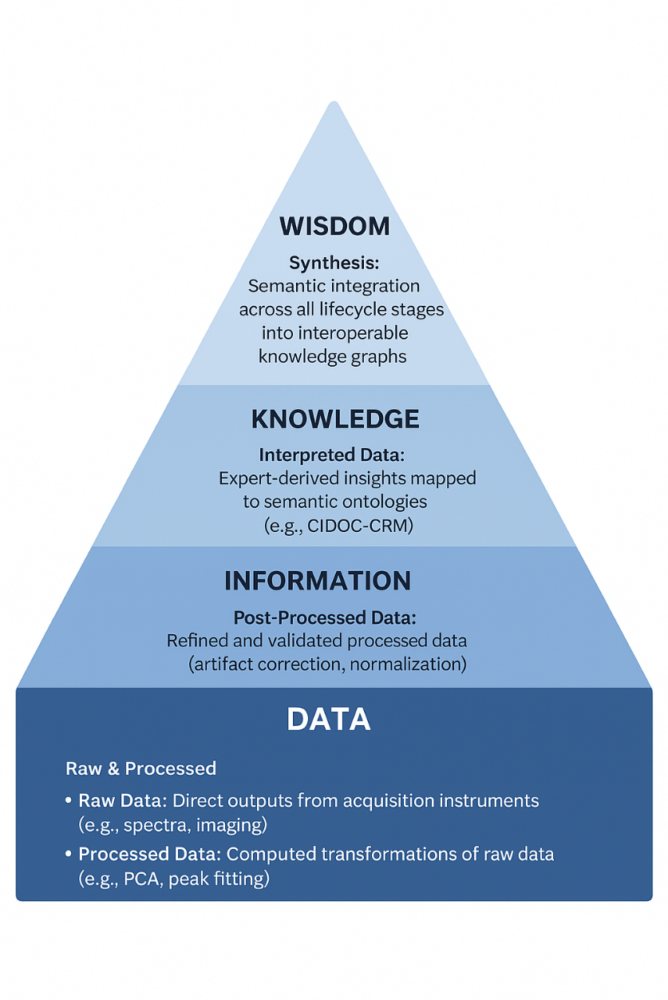

Figure 1: A DIWK pyramid that illustrates the project's data lifecycle framework

### 3.1.1 Example 1: Heritage science-based art historical investigation of the Derynia icon

This example illustrates the progression of cultural heritage data through its lifecycle stages by examining a pigment analysis of the Derynia icon, which is a specific religious icon from a church in the village of Derynia, Cyprus. The artwork was investigated using advanced imaging techniques, including Macro X-Ray Fluorescence (MA-XRF), Reflectance Imaging Spectroscopy (RIS), and Luminescence Imaging Spectroscopy (LIS). This case study demonstrates how raw instrumental signals are transformed into semantically rich, interpreted knowledge that supports both scientific and art historical research.

**Raw Data**

The raw data consists of unprocessed signals directly acquired from the analytical instruments. This foundational layer includes:

- XRF energy spectra

- RIS reflectance spectra

- LIS luminescence signals

**Acquisition Metadata & Acquisition Paradata**

This raw data is accompanied by detailed acquisition metadata (e.g., unique sample ID, artwork name, date of analysis) and acquisition paradata, which documents the essential instrumental settings and context required for reproducibility and interpretation:

- **XRF settings:** voltage (40 kV), current (500 µA), dwell time (80 ms/pixel)

- **Spectral ranges:** RIS (470–820 nm), LIS excitation wavelengths (365 nm and 655 nm)

- **Scan details:** duration (3 h 30 min), area (25 × 17 cm²), resolution (498 × 340 pixels)

**Processed Data** At this stage, raw signals are transformed through computational procedures to improve clarity and utility. This involves:

- Converting XRF spectra into elemental distribution maps (e.g., Hg-L for mercury, Pb-L for lead).

- Processing RIS and LIS data using spectral angle mapping (SAM) and NFINDER endmember extraction to isolate distinct pigment signatures.

- 

**Processed Paradata** The derivation of processed data is rigorously documented through processing paradata, which captures the computational environment and choices:

- **Software tools used:** PyMCA, pystools, and SPECTRONON.

**Post-Processed Data**

Processed outputs are further refined to optimize accuracy and support interoperability. This stage creates composite visualizations for enhanced analysis:

- Generation of RGB correlation maps.

- Creation of multi-element fusion images.

These products standardize the data, providing a validated foundation for integration and expert interpretation.

**Interpreted Data**

Domain experts integrate the analytical results with art-historical and material knowledge to generate higher-order insights. This stage produces structured scholarly assertions that encode meaning:

- Identification of specific pigments (e.g., mercury sulfide signifies cinnabar/vermilion; lead compounds indicate lead white).

This entire pipeline, from raw signals to interpreted knowledge, demonstrates how the ECHOES lifecycle facilitates the transformation of isolated technical measurements into semantically rich, interoperable, and trustworthy knowledge for the broader cultural heritage community.

> *Figure 2: Derynia Icon*

### 3.1.2 Example 2: Ayios Ioannis Lampadistis Monastery, Cyprus 

This example describes the 3D-based data workflow for the digital documentation and preservation of the Ayios Ioannis Lampadistis Monastery, which is a UNESCO World Heritage site in the Troodos Mountains of Cyprus, located in Kalopanayiotis village.

**Raw Data**

The initial data acquisition combines multiple sources to capture both geometric detail and historical context (*Figure 3* and *Figure 4*). This includes high-resolution laser scanning point clouds and photogrammetric images documenting the site’s precise geometry and surface appearance. These are complemented by topographic measurements, as well as archival drawings and historical documents provided by the Cyprus Department of Antiquities.

> 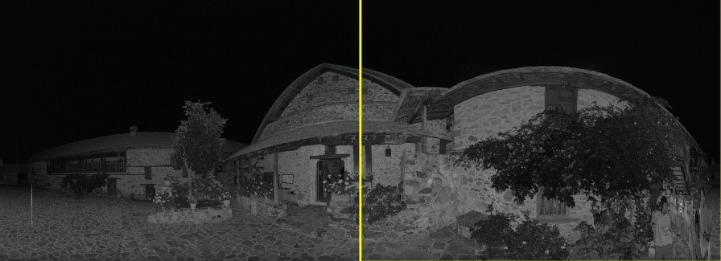
>
> Figure 3: A 2D panoramic image (raw data of the scanner) of the Kalopanayiotis monastery

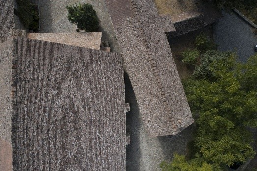

Figure 4: An aerial image of Kalopanayiotis monastery taken by the drone.

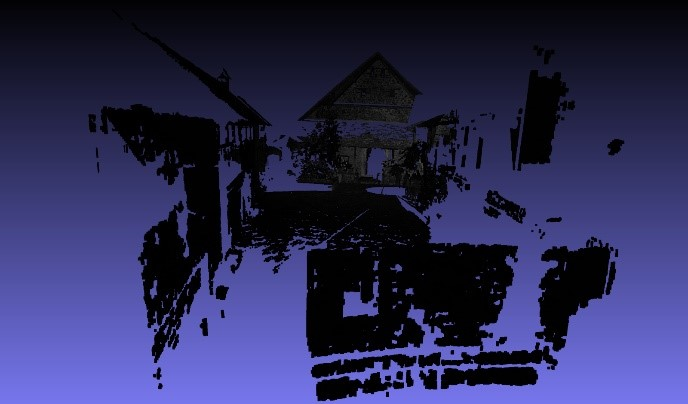

> Figure 5: The point cloud produced by the scanner of the same area of Figure 3.

**Acquisition Metadata and Acquisition Paradata**

Comprehensive metadata records include scanner parameters, camera specifications, GPS coordinates, date and time of acquisition, site conditions, and usage rights. These elements ensure data provenance, support interoperability, and facilitate long-term reuse.

**Processed Data**

Raw point clouds and photogrammetric images are cleaned, registered, and aligned within a unified georeferenced coordinate system. Photogrammetric data are processed into textured 3D models, while archival drawings are digitized and prepared for integration. The resulting models undergo further refinement through noise reduction, gap filling, and mesh optimization to ensure accuracy and visual coherence.

.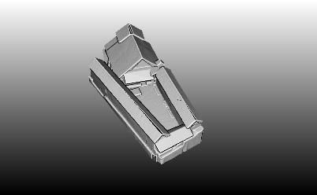

> Figure 6a: The completed model of Kalopanayiotis monastery (all scans aligned)

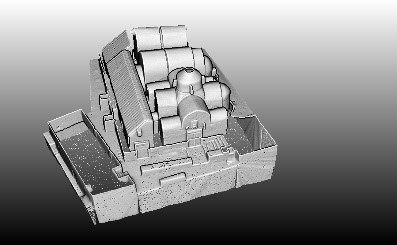

Figure 6b: The internal spaces of Kalopanayiotis monastery.

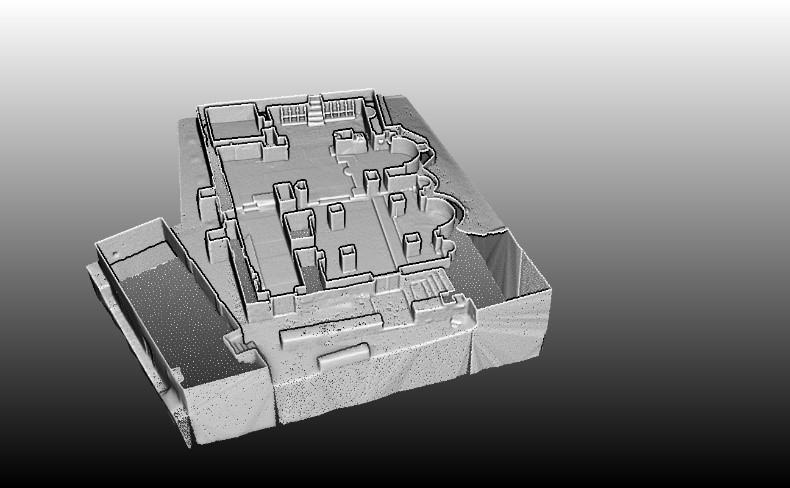

> Figure 6c: A section of the monastic complex

**Post-Processed Data: 3D HBIM Model**

In this stage the processing output is further refined to optimize the interpretation and data interoperability. A Historic Building Information Model (HBIM) is created by generating structured 3D geometry segmented according to the building’s architectural components and functional systems. The model is semantically enriched with integrated data on architectural features, materials, and historical context. Once completed, the HBIM is exported in a neutral, interoperable format (IFC) and published on web-based platforms to facilitate access, visualization, and data sharing.

**Interpreted Data: Integration with Multidisciplinary Studies**

The HBIM model is integrated with historical research, architectural analysis, and environmental assessments to support multidisciplinary interpretation. This synthesis enables a deeper understanding of the site's construction phases, historical evolution, and current conservation needs. The interpretive insights guide preservation strategies and contribute to the development of a DT for ongoing monitoring, analysis, and public engagement.

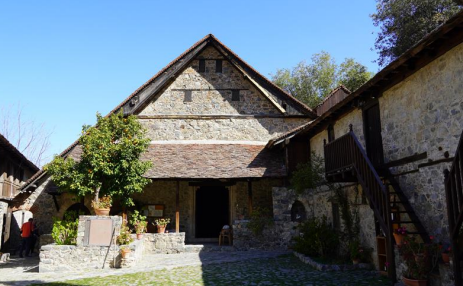

Figure 7: An image of the Kalopanayiotis monastery (at the yard covering part of the scanned area of fig 3 and 5.

### 3.1.3 Example 3: Andrea Pisano's pulpit in the Church of Sant’Andrea in Pistoia (Italy)

The intervention outlines the procedures adopted for the 3D digital documentation of Giovanni Pisano’s Pulpit in the church of Sant’Andrea in Pistoia. The survey was carried out to record the current state of conservation with precision, verify the structural condition of the work, and provide support for the subsequent monitoring program.

The marble pulpit inside the Church of Sant’Andrea in Pistoia, attributed to Giovanni Pisano and created between 1298 and 1301 (according to Vasari’s Lives and an inscription on the work), is considered his masterpiece and one of the highest expressions of Gothic sculpture \[<http://vocab.getty.edu/page/aat/300020775>\]. In medieval churches, the pulpit was an elevated architectural structure intended for the reading of the Gospel. The technical innovations introduced by Pisano and his intense rendering of the human figure had a direct influence on Michelangelo and other Renaissance sculptors. Its local significance is underscored by the fact that Pistoia is often referred to as “the city of pulpits,” due to this and other related works. The pulpit, therefore, beyond its material value, also carries an intangible meaning, representing an identity-defining element of the city’s artistic tradition. Further analogies connect it to the pulpits created by Giovanni Pisano and his father Nicola in Pisa and Siena. According to the inscription on the pulpit, the work was commissioned and funded by the parish priest Arnoldo; Andrea Vitelli and Tino di Vitale served as administrators of the project.

After the Counter-Reformation (16° century), pulpits lost their original function. Consequently, the work—originally placed on the right side of the church near the altar—was dismantled in 1619 and later reassembled in the fifth bay on the left, between the left aisle and the central nave. This relocation is likely the cause of the structural issues described below. The original lecterns are believed to be preserved today at the Metropolitan Museum \[inventory number 21.101\] and at the Bode Museum \[<https://recherche.smb.museum/detail/868114/engelpiet%c3%a0>\].

The pulpit is based on a hexagonal plan and features an elevation articulated in three levels: (i) bases and columns, (ii) arches and spandrels and (iii) parapet.

Each side of the hexagon measures about 1.4 meters, the total height is 3.95 meters, and the platform is located 3 meters above the ground. The platform is supported by seven slender columns (six at the corners and one in the center). The columns vary in height and display different Corinthian capitals; three rest on bases, while four stand on sculptures of animals or human figures, similar to other examples in Pistoia and to those made by Nicola Pisano (Giovanni’s father) in Pisa and Siena. The upper architectural elements and parapets are carved in high relief, depicting scenes from the life of Christ, religious symbols, Sibyls, and Prophets.

> 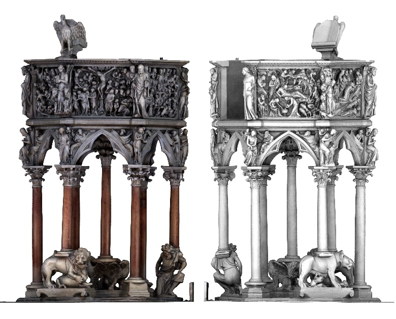
>
> Figure 8: Surface model. View of the 3D model

**Conservation status of CH Asset**

During the centuries the pulpit was disassembled and moved from the original position and several restoration works were performed in the last centuries. Nowadays the pulpit exhibits a slight overall inclination of each column along the South-West direction and some cracks on the arches. Several causes were ascribed for the current status of the pulpit: (i) errors in the reassembling in 1619, (ii) Foundation settlement, (iii) Subsidence phenomena in the whole city centre of Pistoia and (iv) Past seismic events. In 2007 an extensive investigation campaign was carried out, showing the presence of steel bars connecting the columns and the platform. Confirming the ongoing movement of the pulpit, the holes for the bars are ovalized and filled with fused plumb in the past, perhaps to restore the connection surface.

In 2019, the Soprintendenza Archeologia, Belle Arti e Paesaggio per la città metropolitana di Firenze e la provincia di Prato (which is the institution in charge of protecting and preserving the work of art) launched a new interdisciplinary documentation campaign involving several departments and research institutions for the following investigations:

- 3D digital documentation and structural analysis: Department of Civil and Environmental Engineering, University of Florence,

- Geo-physical and mechanical surveys: Department of Earth Sciences, University of Florence,

- Crack pattern survey and analysis of material components: Opificio delle Pietre Dure,

- Definition of the Structural monitoring system: Department of Civil and Environmental Engineering, University of Florence.

> Monitoring data data series have been available since 2022 and these data are collected to provide continuous information on the pulpit’s structural and environmental conditions. The system allows the detection of progressive deformations, the evaluation of the effects of climatic fluctuations, and the validation of numerical models developed for the interpretation of the pulpit’s behaviour.

**Raw Data**

The first step involved the establishment and measurement of a topographic network, which provided a unified reference system and enabled the registration of multiple survey campaigns, ensuring metric verification and validation of the results. This provided a solid foundation for the project’s long-term sustainability, allowing for future updates and continued monitoring activities.

Subsequently, 36 laser scanning acquisitions were carried out, with a sampling step designed to obtain a final sub-centimetric resolution point cloud model of the entire pulpit and its surrounding context, including RGB values.

Finally, a high-resolution photogrammetric campaign was conducted. A total of 368 micro-targets (1 cm × 1 cm) were placed and measured from the network vertices, and 6,529 photographs were captured to document the entire artifact. The photogrammetric project produced high-resolution orthophotos with a GSD of 0.2 mm, which supported the creation of orthogonal projections used to annotate the detailed crack pattern.

The point clouds obtained from laser scanning and photogrammetry were processed to generate surface models at different resolutions.

The entire survey campaign was accompanied by extensive historical and bibliographic research, fully available. The investigation focused in particular on:

- the figure of Giovanni Pisano and his artistic production, with special attention to the Pistoia context;

- the restoration interventions carried out on the pulpit over the centuries;

- the iconographic and literary sources that explored the symbolic meaning of the structure and its decorative apparatus.

**Visual Documentation:**

- Master 3D digital point cloud model;

- derived models, including high-resolution and decimated meshes;

- photogrammetric outputs;

- CAD drawings in orthogonal projections;

- photographic and video documentation;

- historical photographs.

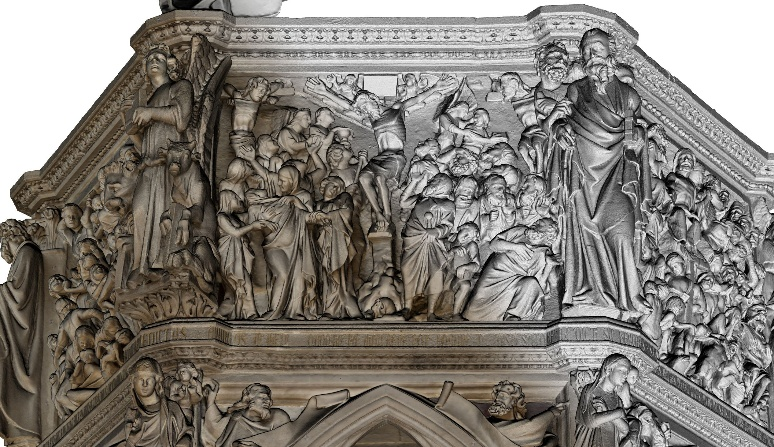

> Figure 9: Surface model. Axonometric view of the 3D model: panel with the scene of the Crucifixion

**Available Metadata and Paradata** 

- **Administrative Metadata**: Document the management information about the data (e.g. provenance, rights, access conditions, preservation requirements).

The 3D model, derived datasets, and associated digital assets are accompanied by administrative metadata specifying provenance, ownership, and access rights. Usage rights for all materials have been granted to UNIFI by SABAP for scientific research, documentation, and dissemination activities. Administrative metadata also record the responsible institution, data custodianship, and temporal scope of the acquisition campaign, ensuring traceability and compliance with institutional data policies

- **Descriptive Metadata**: Detail content-based metadata describing what the digital resources represent (subject matter, historical context, relationships to other objects, \| Linked Data: Relationships to other objects using ontology links referencing CIDOC CRM classes such as E22 Man-Made Object or E55 Type).

Data are documented with descriptive metadata defining their cultural and contextual meaning. Metadata fields about the asset include title, subject, artist/author, date, typology, materials, dimensions, and iconographic themes.Their relationships are expressed using CIDOC-CDM classes and properties.

- **Structural Metadata**: Information about how data components are organized and related to each other (e.g. file hierarchies, data dependencies).

A formal structural metadata schema will be created during the pilot to define the organisation and relationships between the project's heterogeneous datasets.

- **Technical Metadata**: Information about the digital files' technical characteristics (file formats, size, creation date, software used).

Technical metadata relating to the 3D survey, modelling and monitoring of the Pulpit are also available, although they are not yet systematically organised. They will be organised, together with those that will be generated for all new digital resources created as part of the pilot project.

- **Paradata:** There are no defined standards for collecting paradata relating to the surveying and modelling of 3D data. During data collection and management, paradata was collected in unstructured form (currently being organised according to the CIDOC-CRM schema) which will be used and implemented in the project, including:

Acquisition methodologies (photogrammetry, laser scanning) and processing pipeline.

Sources: historical inventories, floor plans, descriptive texts, historical photographs.

- **Data Quality Metadata:** Information about accuracy, completeness, consistency of the data. The quality and accuracy of the geometric data will be certified by the metadata contained in the survey reports and 3D modelling. The quality of the information content relating to the works of art described will be certified by its origin from the catalogue records of the Italian Ministry of Culture.

- **Usage History**: Documentation of how the data has been used previously, by whom, and for what purposes.

- The data has been delivered to stakeholders and partly used for previous studies and scientific publications.

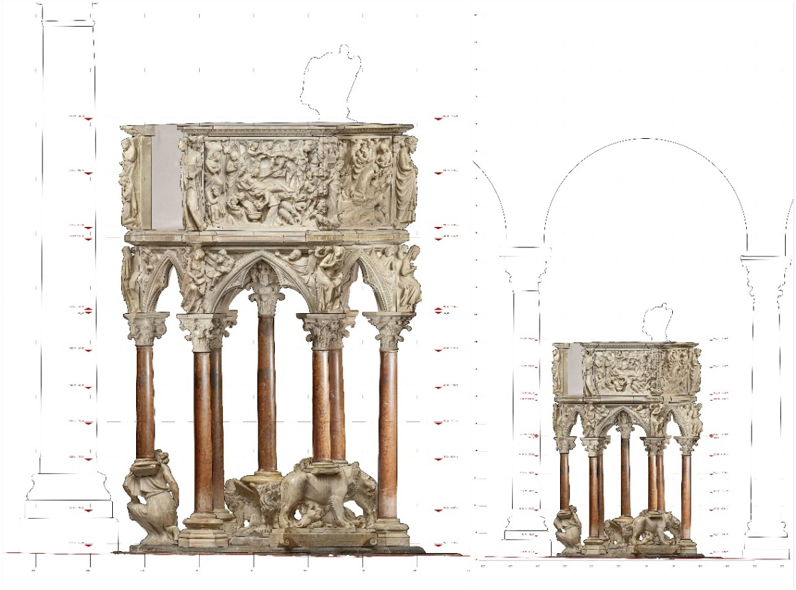

> Figure 10: Orthophoto of the 3D model

## 3.2 Data Sources

The ECHOES Knowledge Base integrates and standardizes cultural heritage data from diverse sources, ensuring compliance with FAIR principles and semantic interoperability. This federated ecosystem draws from institutional archives, public repositories, and collaborative platforms, each contributing unique datasets to enrich the collective knowledge base.

<figure>

<figcaption>
<em>A comprehensive list of data sources can be found in the D3.1 Integration Strategy document.</em>
</figcaption>
</figure>

### 3.2.1 Category 1: Structured databases

#### Institutional Databases

- **Description:** Structured datasets from museums, libraries, archives, and archaeological institutions

- **Examples:** The Louvre Database

- **Key Features:**

  - Advanced search capabilities

  - Metadata standards compliance

  - API support for external integrations

  - Robust database management systems

#### Public / Open Datasets 

- **Description:** Freely accessible datasets provided by governments, cultural organisations, and museums, often under Creative Commons or open data licenses and very often derived from institutional databases

- **Examples:** The datasets from the common European data space for cultural heritage, made available at Europeana.eu, and national heritage databases.

<!-- -->

- **Key features:**

  - **Standardized Licensing:** Clear usage rights (e.g., CC0, CC-BY, Open Data Commons)

  - **Bulk Access & APIs:** Enables large-scale downloads and programmatic integration

  - **Multilingual Metadata:** Often includes cross-lingual (semantic) annotations for broader accessibility

  - **Community-Enhanced:** Some platforms allow crowdsourced corrections or contributions

  - **Pre-processed Harmonization:** Many datasets already align with common vocabularies (e.g., Schema.org, Europeana Data Model)

  - **Global Reach:** Aggregates data from multiple countries/institutions into unified interfaces

### 3.2.2 Category 2: Semi-structured databases

#### Research Infrastructures

- **Description:** High-value, scholarly datasets produced by EU-funded projects (e.g., Horizon Europe) and academic consortia (e.g., DARIAH, CLARIN), featuring rigorous curation and rich contextual metadata

- **Examples:**

<!-- -->

- A multilingual epigraphy corpus developed under DARIAH

- CLARIN’s linguistic datasets with TEI/XML markup

- Archaeological field reports from Horizon Europe projects

<!-- -->

- **Key Features:**

- **Scholarly-Grade Data:** Outputs from digitization projects, archaeological surveys, historical corpora, or linguistic documentation

- **Enhanced Metadata:**

> Includes:

- Multilingual annotations

- Provenance and attribution tracking

- Temporal/spatial references (e.g., period-specific ontologies)

- Alignment with CIDOC CRM, SKOS, or domain-specific standards

<!-- -->

- **Project-Backed Curation:** Structured for long-term preservation and academic reuse (e.g., via institutional repositories)

### 3.2.3 Category 3: No/minimal-structured databases

#### Fieldwork and Crowdsourced Data

**Description:** Data generated through on-site cultural heritage documentation (fieldwork) or contributed by the public via crowdsourcing platforms. These sources capture rich, often underrepresented information such as transcriptions, local knowledge, classifications, or geotagged imagery, enhancing institutional collections.

**Examples:**

- Public-contributed artifact transcriptions

- Geotagged historical photos from community mapping projects

- Ethnographic fieldwork recordings with indigenous knowledge

**Key Features:**

- **Diverse Data Types:** Includes text transcriptions, images, audio recordings, and geospatial data

- **Community Participation:** Leverages public contributions for broader coverage and perspectives

- **Complementary Value:** Fills gaps in institutional records with local/non-institutional knowledge

- **Metadata Challenges:** Often needs standardization due to varied contributor expertise

#### Legacy/Digitized Collections

**Description:** Historical materials (manuscripts, photographs, maps, objects) digitized from physical archives or older digital formats, held by museums, libraries, or archives. Often requires normalization to meet modern standards. **Examples:**

- Scanned excavation notebooks from a national archive

- Digitized microfilm images of colonial-era documents

- Legacy museum catalogues converted from spreadsheets

**Key Features:**

- **Format Diversity:** Supports multiple file types and obsolete digital formats

- **Preservation Focus:** Digitizes fragile physical materials (e.g., aged paper, photographs) to prevent deterioration

- **Metadata Variability:** Often lacks standardized metadata, requiring manual or automated enrichment

**Processing Needs:** Requires conversion of image-based text into machine-readable formats.

## 3.3 Ontology Models 

**HDTo (Heritage Digital Twin ontology)** is the core semantic framework of the European Collaborative Cloud for Cultural Heritage (ECCCH), a CIDOC CRM-compatible extension that models the dynamic relationship between HC1 Heritage Entity (real-world tangible, intangible, or born-digital assets with socially conferred value) and HC2 Heritage Digital Twin (evolving propositional objects aggregating all state-of-the-art digital representations, studies, and provenance metadata). HDTo enables the creation of versioned, collaborative Digital Commons capturing the full space-time-culture identity of heritage assets.

ECHOES uses other standardized ontologies and vocabularies to ensure interoperability:

- **CIDOC CRM**: Museum and artifact modeling (ISO 21127:2023).

- **CIDOC CRM compatible models**:

  - **CRMinf**: the argumentation (inference) model

  - **CRMsci**: the scientific observation model

  - **CRMdig**: the model for provenance metadata and digitization processes

  - **CRMarchaeo**: the excavation model

  - **CRMtex**: the model for the study of ancient texts

  - **CRMact**: the model for activity planning and execution

- **LRMoo**: the library reference model (FRBR-aligned).

- **Dublin Core**: Descriptive metadata.

- **Schema.org**: Web schema and compatibility.

- **FOAF**: Personal entities (creators, contributors).

- **GeoSPARQL**: Geospatial data and queries.

HDTo serves as the integrative layer, harmonizing contributions from all listed models into a unified, extensible knowledge graph that supports cross-institutional collaboration, long-term preservation, and advanced research within the ECCCH.

# 4. Data Management Requirements

## 4.1 Functional Requirements

To ensure effective data management and user engagement, the ECHOES Knowledge Base must address the practical needs of its stakeholders. This section outlines key usage scenarios through representative user profiles, reflecting real-world challenges and informing system design.

This functional-needs analysis serves as a blueprint for the explicit and implicit expectations of stakeholders, encompassing a broad spectrum of project objectives. It includes a description of the proposed system's intended capabilities, user interactions, and output requirements to ensure that it will be designed to meet its intended purpose efficiently, thereby bridging the gap between user expectations and technical execution.

In this context, we identify the following:

- **Key Stakeholders**: categorization of the system’s diverse user groups with an emphasis on their distinct roles and interactions, their primary needs and challenges, and the ECHOES functional response and impact.

- **High-Level Functionalities and Requirements**: establishment of the fundamental capabilities, criteria and guidelines that steer the system's development, value proposition and user engagement. This ensures that every aspect of the system architecture and design converges towards fulfilling its intended purpose and user expectations.

- **Operational scenarios and representative use cases**: determination of how the system will integrate into the existing or intended operational environment, ensuring both efficiency and effectiveness in real-world applications.

- **Expected outcomes**: summarizing the expected outcomes and exploitable results, while providing information about the relevant stakeholders and the corresponding inherent requirements.

Below, there is a section that categorizes users based on their digital and technical advancement. Even though, for each of those categories a set of ECHOES functional responses is listed, it needs to be taken into account that needs of communities vary. The categories were made to present diversity of Cultural Heritage ecosystem and lines between those categories are blurry. That means ECHOES will offer its capabilities to all kinds of users, for them to select the most applicable ones.

### 4.1.1 End User Profiles

#### User Profile A: Independent Data Owners (Unstructured Assets)

**Profile:**

- Independent archaeologists, grassroots heritage NGOs, small private collectors.

- Generate unstructured data (photos, GPS tracks, field notes, spreadsheets, AV recordings).

- Store data across personal devices or consumer cloud services with minimal backup/versioning.

**Challenges:**

- Unstandardized Metadata – Poor interoperability due to inconsistent schemas/vocabularies.

- No Persistent Identifiers – Limits citation and long-term referencing.

- High Data Loss Risk – Reliance on personal devices (laptops, USB drives) without structured backups.

- Limited Infrastructure Support – No institutional repositories or IT assistance for preservation.

- Low Technical Capacity – Users lack time/expertise for complex data publishing workflows.

**Primary Needs:**

- Safe, durable storage solutions to preserve digital assets

- Low-barrier tools for organising and enriching data

- Mechanisms to make data findable, accessible, and citable

- Integration into broader cultural heritage data ecosystems without needing specialist skills

**ECHOES Functional Response** To address these needs, ECHOES will provide the following capabilities tailored for User Profile A:

- **User-Friendly Upload Interface:**

A guided, web-based tool for uploading files in various formats (images, CSV, GPX, PDFs) with automatic metadata extraction where applicable and linking it to the KB.

- **Lightweight Metadata Capture:**

Customisable templates with dropdowns and minimal required fields, aligned with CH standards (e.g., Dublin Core, DCAT, or LIDO), supporting later enrichment.

- **Automatic PID Assignment:**

Persistent identifiers are generated automatically upon dataset submission, ensuring data can be reliably cited in publications.

- **Basic Access Controls:**

Data owners can designate assets as private, restricted, or public and manage access accordingly.

- **Public Discoverability:**

Indexed in the ECHOES Knowledge Base, enabling external researchers and institutions to find and reuse datasets (with attribution).

- **Minimal Technical Requirements:**

All tools and services will be accessible via a standard web browser, requiring no installation or technical configuration.

**Impact:** By lowering the barriers to participation in digital heritage ecosystems, ECHOES empowers small-scale actors to preserve and share their data responsibly, enhancing long-term value for scholarship, education, and community heritage preservation.

#### User Profile B: Small-to-Medium GLAM Institutions (Structured Data, No Durable Storage)

**Profile:**

- Regional museums, galleries, libraries, and archives (GLAMs)

- Maintain organized catalogues in legacy systems.

- Operate with limited digital infrastructure and staff capacity

**Challenges:**

- Data Loss Risk - Outdated hardware and lack of backup systems

- Preservation Barriers - Inability to ensure long-term digital preservation

- Interoperability Issues - Limited connection to external platforms

- Technical Limitations - Lack of capacity to migrate to modern standards

- Compliance Pressure - Need to meet FAIR principles and open data requirements

**Primary Needs:**

- Reliable long-term hosting for structured digital records

- Support for standard data models

- Tools to enrich and link existing data

- Solutions that integrate with existing institutional workflows

**ECHOES Functional Response:**

- Legacy data import - Supports access with auto-mapping to standards

- Standards-compliant repository - Linked data models and semantic enrichment

- Customizable access controls - Manage internal/restricted/open permissions

- Automated preservation - Cloud storage with backups and PID assignment

- Curator-friendly interfaces - Web dashboards for non-technical users

- Federated publishing both via APIs and web dashboards

- Automated metadata harvesting and standards mapping

- Synchronized PID and access policy management

- Built-in FAIR compliance monitoring

**Impact:**

ECHOES enables GLAM institutions to sustainably manage and share their collections, bridging legacy systems with modern digital infrastructures while maintaining institutional control over cultural assets.

#### User Profile C: Scientific Community/Academics/Research Infrastructures, Large GLAM Institutions (Structured & Internally Hosted Data)

**Profile:**

- Universities, national laboratories, digital humanities centres

- Large-scale research consortia with advanced data infrastructures

- Operate sophisticated internal platforms

**Challenges:**

- Duplication of Effort - Redundant dissemination across multiple platforms

- Limited Visibility - Low reuse beyond immediate academic networks

- Fragmented Exposure - No unified EU-wide data dissemination layer

- Maintenance Overhead - High cost of supporting multiple dissemination systems

- Compliance Pressure - Need to meet evolving standards

**Primary Needs:**

- Federation capabilities for EU-wide integration

- Centralized dissemination without data migration

- Persistent identifiers and metadata propagation

- Semantic web and linked data interoperability

- Compliance tools for FAIR/EOSC requirements

**ECHOES Functional Response**

- Federated publishing directly via APIs

- Automated metadata harvesting and standards mapping

- No-migration integration model preserving data sovereignty

- Synchronized PID and access policy management

- Built-in FAIR compliance monitoring

**Impact:** ECHOES serves as a trusted intermediary, amplifying research data visibility across Europe while maintaining institutional infrastructure autonomy, enabling compliance and broader participation in cultural heritage knowledge commons.

### 4.1.2 Data Governance Roles

<figure>

<figcaption>
<em>Governance roles across the federation have to be confirmed. Below, the foundation for data governance has been described and may change when project progresses. Details on a consistent governance model and streamline decision-making will be defined by WP10: Cloud Governance in the related WP10 deliverables.</em>
</figcaption>
</figure>

Effective data governance within the ECHOES project relies on the collaboration of multiple actors, each with clearly defined roles and responsibilities. This section outlines the key functions of data providers, infrastructure operators, data stewards, data curators, and end users. Their coordinated efforts ensure that data is accurate, ethically managed, semantically aligned, and technically robust - supporting both immediate research needs and long-term sustainability.

#### Data Providers

Data Providers are responsible for delivering accurate, high-quality data while adhering to all relevant policies and standards.

**Key Responsibilities:**

- Submitting data accompanied by comprehensive documentation and detailed metadata to ensure clarity and usability.

- Complying with data privacy regulations, ethical guidelines, and GDPR requirements to protect sensitive information.

- Collaborating closely with infrastructure operators and data curators to uphold data integrity, quality, and long-term usability.

- Respect and align with semantic models and ontologies endorsed by the project to facilitate integration and discovery. ECHOES will provide mapping tools for those purposes.

#### Infrastructure Operators

Responsible for managing and maintaining the technical environment and ensuring the security of the infrastructure.

**Key Responsibilities:**

- Implement enforce role-based access control (RBAC), encryption, and federated identity management systems to safeguard data confidentiality, integrity, and availability.

- Monitoring service health, system performance and data flows to prevent data loss, corruption, or unauthorized access.

- Supporting data provenance tracking and maintaining comprehensive audit trails to ensure transparency.

- Ensuring interoperability by adhering to established standards such as CIDOC CRM.

- Providing user support and guidance on governance policies, FAIR principles, and the use of data management tools.

#### Data Stewards

Data Stewards are domain or institutional actors responsible for overseeing the quality and coherence of data as it is prepared for ingestion or publication. By default this role is also given to each Data Provider. In case a separate entity is needed, for example for large institutions, those two can be separated.

**Key Responsibilities:**

- Validate that metadata conforms to schema and controlled vocabularies before publication.

- Coordinate mapping activities from local schemas to project ontologies.

- Collaborate with infrastructure operators and data providers to ensure alignment with project-wide curation policies and update workflows.

- Act as contact points within their organisations for quality assurance, versioning, and semantic alignment.

#### Data Curators

Data Curators are internal to ECHOES and play a cross-cutting role in harmonizing data contributions, often working directly within the central ECHOES Knowledge Base.

**Key Responsibilities:**

- Review and refine contributed data to ensure semantic richness, completeness, and consistency across datasets.

- Support tasks such as linking entities, annotating relationships, and resolving ambiguities in large-scale ingestion workflows.

- Oversee versioning and re-validation of evolving datasets.

### 4.1.3 User Scenarios

In this section there are few examples of potential ECHOES functionalities.

Focus: helping users (conservators, archaeologists, curators) to learn, onboard and enrich heritage data, through metadata guidance, annotation support, and compliance resources.

Focus: infrastructure for ingestion, ETL (Extract, Transform, Load) pipelines, data transformation, triplestores, APIs, and validation services that enable robust and scalable knowledge management.

#### Use Case 1 – Rapid Onboarding of Unstructured Field Data 

**Objective:** Enable independent researchers to quickly ingest and structure unstandardized field data.

- **User Profile 1:** Independent archaeologist.

- **User / System Journey:**

  1.  User drag-and-drops data via the ECHOES Web Portal – files are stored in the ECHOES Internal Storage components.

  2.  Inline metadata wizard auto-extracts EXIF/CSV properties and suggests minimal HDTO classes (e.g., E22_Human-Made-Object, E53_Place).

  3.  AI-assisted annotation proposes vocabulary terms from Getty AAT and Geonames.

  4.  Validation dashboard flags missing mandatory fields.

  5.  User adds missing descriptions in Greek & English and confirms HDT creation.

  6.  Mint PID & licence are generated - a DOI and CC BY licence.

  7.  HDT is published to the public Knowledge Graph and thumbnails pushed to the ECHOES IIIF service.

#### Use Case 2 – AI-Assisted Conservation Documentation

- **Objective:** Show how the KB stores and serves structured conservation data to enable AI-driven analysis.

- **User Profile 2:** Conservator analyzing a deteriorating artifact.

- **User / System Journey:**

  1.  Conservator uploads 3D scans via a VA (Vertical Application) and confirms necessity to store them in the ECHOES Internal Storage.

  2.  User navigates to ECHOES Web Portal and shares 3D scans with selected users (collaborative functionality) and exchange comments on the files.

  3.  User confirms generation of a HDT - links to existing data and conservation datasets via federated queries.

  4.  User select AI-based tool to analyze scans.

  5.  User validates changes and once the annotation is completed and approved by the user it is published onto the KB.

  6.  Deterioration patterns across artifacts are queried by other researchers for comparison.

#### Use Case 3 – CIDOC-CRM Data Preservation & Publication for a Regional Museum

- **Objective:** Preserve and publish large existing museum collections in a sustainable RDF-based infrastructure.

- **User Profile 3:** Regional Museum

- **User Journey:**

  1.  Museum exports data in a CSV format through the APIs - ECHOES provides a mapping template.

  2.  ECHOES converts CSV to RDF (CIDOC CRM + HDTO).

  3.  Staging Triplestore validates logical consistency (SHACL shapes).

  4.  Museum chooses “hosted” option data to save it in the ECHOES managed storage components.

  5.  Federated search endpoints are exposed – data records will appear in cross-collection search.

#### Use Case 4 – Legacy Collection Modernization

- **Objective:** Highlight KB’s ETL capabilities for migrating legacy museum catalogs.

- **User Profile 1:** Curator digitizing a collection from spreadsheets.

- **User Journey:**

  1.  User selects Vertical Application that provides a mapping tool to convert spreadsheet fields into semantic triples.

  2.  The KB validates and transforms the data, flagging inconsistencies.

  3.  The KB suggests links to related artifacts in external collections.

  4.  Curator reviews and confirms links, which are stored as structured triples.

  5.  Sensitive data remains on-premises; public data is published to the KB’s semantic store.

  6.  Curator monitors ingestion progress and data quality.

  7.  The KB assigns persistent identifiers and licenses to published datasets.

#### **Use Case 5 – Federated Analytics Across Institutional Repositories**

- **Objective:** Enable institutions to perform analytics across federated repositories without losing local control.

- **User Profile 3:** European Research Infrastructure

- **User Journey:**

  1.  Endpoint Registration: ERICCH metadata enters the Registry with access policies (read-only, rate-limited).

  2.  Trust-on-First-Use handshake and ECHOES SSO establishes secure federation.

  3.  Query Broker rewrites user SPARQL queries, combining ECHOES data with other endpoints at runtime.

  4.  Analytics Toolkit visualizes spatial distributions and its results can be saved back as derived datasets.

  5.  Citation and Provenance trails are automatically generated.

## 4.2 Non-Functional Requirements

In the ECHOES project, non-functional requirements (NFRs) are just as critical as functional ones. While functional requirements describe what the system must do (e.g., ingest heritage data, provide annotation tools, or enable federated search), non-functional requirements define how well these functions should be delivered. They capture qualities such as usability, reliability, security, or accessibility, which directly determine whether researchers, curators, and conservators will be able to effectively work with the system over time.

To address this dimension of quality in ECHOES, we adopt a dual perspective:

- A structure model of software and system quality. Categories such as Usability, Reliability, Maintainability, and Security allow us to evaluate whether the ECHOES platform is robust, efficient, and trustworthy from a technical and user-experience standpoint.

- FAIR Principles (Findable, Accessible, Interoperable, Reusable) - which define the qualities of the data that flow through ECHOES. For cultural heritage, ensuring that digitized artefacts, annotations, and metadata are FAIR is essential for enabling discovery, cross-collection analysis, and long-term reuse.

These two perspectives are complementary rather than overlapping. First one focuses on the system and service level quality, ensuring that the infrastructure itself is reliable, secure, and usable. FAIR, in turn, focuses on the data level quality, ensuring that the cultural heritage objects managed within ECHOES can be discovered, accessed, and meaningfully reused by researchers across Europe and beyond.

### 4.2.1 FAIR Principles in ECHOES

#### Findable

- **Metadata is richly described** using shared vocabulary and persistent identifiers.

- **Activity Logging and Auditing** (FAIR perspective): Logging supports traceability of dataset usage and enhances findability metrics.

#### Accessible

- **Data and metadata are retrievable** via standardized protocols.

- **Clearly defined access conditions** accompany data.

- **GDPR compliance** ensures that access conditions respect privacy rights.

#### Interoperable

- **Community-endorsed formats and reference ontologies** such as CIDOC CRM ensure cross-system compatibility.

- **Sector-Specific Standards**: • Archives, museums, libraries, grassroots collections can integrate data.

- **CIDOC-CRM**: • Harmonizes heterogeneous datasets. • Supports provenance and chronology modelling. • Encourages interoperability with linked data environments.

- **HDTO**: • Bridges local data structures with target semantic models. • Facilitates mapping, alignment, and transformation. • Promotes transparency and reproducibility in data transformation.

- **Metadata Standards Alignment** with CIDOC-CRM, HDTO.

- **Interoperability Support** via SPARQL endpoints, REST APIs.

#### Reusable

- **Licensing, provenance, and documentation** support reuse, reproducibility, validation.

- **Data Quality and Validation Metadata**: inclusion of indicators, validation results, error logs.

- **Machine-Readable and Linked Data Compliance**: post-mapping metadata adheres to linked data principles for advanced querying and reasoning.

- **Extensibility and Flexibility** (FAIR perspective): architecture allows evolving data types and practices, supporting reuse in diverse contexts.

### 4.2.2 System Quality Characteristics in ECHOES

#### Security

- **Role-Based Access Control (RBAC):** Access rights are assigned according to user roles, ensuring users only access or modify data permitted by their privileges.

- **Data Classification System:** Data is categorized as public, restricted, or sensitive, guiding handling procedures and sharing policies to protect confidentiality and legal compliance.

- **Encryption:** Data is encrypted both in transit and at rest using industry-standard cryptographic methods to prevent unauthorized access.

- **Privacy and Compliance Layer:** • Ensure logging respects data protection policies (especially GDPR). • Personal data is anonymized or pseudonymized. • Users are informed (and potentially consent) to logging for cloud assessment purposes. • Distinction between operational logging and analytic tracking.

<figure>

<figcaption>
<em>System Quality Characteristics are only briefly described in this document, just to provide context relevant for data strategy. D6.1 does not specify minimal requirements such as encryption standards, access control models, data retention rules, or incident response procedures. This is not in the scope of this deliverable.</em>
</figcaption>
</figure>

#### Reliability & Accountability

- **Activity Logging and Auditing:** Detailed logs of data access, changes, and administrative actions support accountability and forensic investigations. These logs also capture: • Data usage (how datasets and metadata are accessed or downloaded). • Access frequency (unique and returning users, peak activity periods). • User demographics (geographic, institutional, user types). • Engagement metrics (number of HDTs accessed per session, annotations, user-generated metadata).

- **Usage Logging and Analytics System:** Must record every interaction with KB, tools, sessions. Each log entry should include: Timestamp, Action type, Resource/tool ID, User profile or pseudonymous ID, Access context.

- **Application & Tool Layer:** Tools emit structured events/logs whenever accessed or used, including token-derived user context.

- **Authentication & Authorization Infrastructure (AAI):** Tokens with attributes, pseudonymous identifiers, consent-aware release and processing of attributes.

- **User Profile Modeling:** Aggregate and normalize user profile data in compliance with GDPR. If full identity not stored, pseudonymous profiles still allow demographic/behavioral segmentation.

#### Maintainability & Sustainability

- **Tracking data provenance, versions, and transformations.**

- **Retention and Archival Policies:** applied in alignment with legal and ethical requirements.

- **Regular Policy Reviews:** continuous compliance monitoring by governance bodies.

- **Extensibility and Flexibility:** architecture supports evolving data types and user needs, extensions possible without compromising core model integrity.

- **Supports incremental harmonization workflows** in metadata practices .

- **Continuous Monitoring & Improvement:** Evaluation of: • CH data (digital assets and metadata in HDTs). • The Heritage Digital Twin Ontology (HDTO). • Infrastructure and digital services. • Vertical applications and tools. • Community-facing services (workshops, training, seminars). • Whole cloud ecosystem (usability, sustainability, innovation, collaboration).

#### Usability

- **Accessibility (ISO sense):** Ensure that cloud services and dashboards are usable by diverse profiles of CH stakeholders.

- **Community Feedback:** Gather feedback from users to assess the HDTO.

#### Legal & Ethical Compliance

- **Data Protection and Privacy:** Full adherence to GDPR and national data protection laws.

- **Copyright and Related Rights:** Respect for intellectual property rights, including copyright, moral rights, database rights, and related rights, applying appropriate licensing and permissions.

- **Traditional Knowledge and Indigenous Rights:** Consideration of cultural sensitivities, communal ownership, and consent for use and dissemination of culturally significant materials.

- **Ethical Use of Data:** Protection against misuse or misrepresentation of cultural heritage materials; responsible, respectful engagement with source communities.

# 5. Data Architecture Design

## 5.1 Architecture Overview

The ECHOES architecture is being designed around a layered approach that supports multiple repositories while ensuring seamless integration within a federated environment. This allows the platform to balance flexibility and openness with the requirements of security, access governance, and accountability. In this document we focus on the layers describing the KB design.

The Knowledge Base Management System (KBMS) is the central component of this architecture. It acts as a facilitator between users, external applications, and the cloud infrastructure. The KBMS is composed of several modules that support both administrative tasks and user operations. It manages querying, publishing, and editing of semantic data, while also providing monitoring and auditing functionalities to ensure traceability and compliance.

The end-users' access to the system is provided through a single-entry point based on Single Sign-On mechanism that allows a user to authenticate once and then access all authorized services without repeated login attempts. The process is handled through EGI Check-in, which functions as an identity broker and supports open standards such as OIDC and SAML. This ensures interoperability with a wide range of external identity providers, including academic federations, institutional systems, and social login services.

The backbone of data management relies on triplestores, which operate as semantic repositories supporting cultural heritage digital twins. The architecture distinguishes between i) ECHOES knowledge-sharing repositories, with open or restricted access, which serve as the official and versioned resources with strong provenance guarantees, ii) external repositories and iii) private-spaces repositories, which provide flexible collaborative spaces for individuals and teams. Semantic data prepared in private-spaces repositories can later be published into knowledge-sharing repositories, enabling a workflow that moves smoothly from iterative editing to formal release.

A dedicated administrative repository complements this architecture by storing auxiliary information such as user roles, descriptions and locations of triplestores, ownership records, and workspace definitions. This ensures consistent access management and makes it possible to monitor the health and availability of all nodes across the federation.

Low-level, technical, interaction with the system takes place through a user-facing web interface designed to go in the detail of the repository. The interface provides simple mechanisms for querying, editing, and inspecting data, while offering additional administrative features to authorized users, such as node registration and role assignment. To serve diverse communities, from researchers and curators to administrators and external stakeholders in a more specific way we envision the use of dedicated vertical applications.

The service layer of the architecture implements the business logic of the KBMS. It manages queries, registry functions, monitoring of federated nodes, and secure communications between components. All services are exposed via REST APIs, making it straightforward to integrate third-party vertical applications and external tools into the platform.

## 5.2 Federated Architecture and Data Lifecycle Management

### 5.2.1. Federated Knowledge Strategy

As described in section 2, above, a federated architecture enables searching for information across distributed data sources without consolidating them in a central repository. Instead of gathering all data into a single location, a federated Knowledge Graph (KG) leaves data in its original silos and dynamically constructs responses through federated queries. This approach is commonly used in portals that retrieve data from multiple databases while maintaining decentralized storage.

This section describes how a federation knowledge strategy is designed for the ECHOES requirements. The main key features of this strategy are discussed in the next paragraphs.

#### Types of federation nodes

Triplestores constitute the core storage layer of the Knowledge Base (KB), hosting the semantic RDF content, serving as the federated nodes of the infrastructure. These nodes may reside either within the ECHOES main infrastructure or be hosted by external providers. Their availability is monitored regularly to ensure the integrity and reliability of query results. Semantic representations of the HDTs are stored within these triplestores, enabling their seamless integration into the federated Knowledge Graph (KG).

The federation engages three main types of triplestores for knowledge aggregation and manipulation:

**ECHOES KG/knowledge-sharing nodes (for simplicity ECHOES-nodes),** authoritative triplestores of the system where semantic data can be shared either openly with all the users, or with restrictions only to authorized ECHOES users. The content of these nodes is built and structured according to the ECHOES federation rules using the provided KB REST API. They support ingest, snapshot versioning and provenance mechanisms, ensuring that their content is traceable, auditable, and immutable over time. These capabilities are critical for maintaining data integrity, reproducibility, and compliance with provenance requirements.

**External KG/knowledge-sharing nodes (for simplicity External-nodes)** associated queryable-only triplestores provided by other projects or organizations that want to join the ECHOES ecosystem. These triplestores publish semantic data to be shared within the ECHOES, but their content has been developed outside the ECHOES infrastructure. No snapshot versioning support or provenance mechanisms must be applied by the system.

**Auxiliary nodes**, serving internal KB mechanisms:

- **private-spaces nodes,** dedicated triplestores used to implement collaborative editing workspaces, where individuals or groups can prepare and enrich HDT representations and finally publish and share that work on the ECHOES-nodes. These spaces allow for concurrent updates and, therefore, exclude features such as history snapshots, provenance provisioning, etc. to prevent synchronization conflicts when multiple users edit the same content simultaneously. This setup facilitates flexible and iterative data editing workflows.

- **recycle-bin nodes,** used to preserve the replaced or deleted content from the federated ECHOES-nodes, for archival, snapshot versioning, and rollback purposes.

The ECHOES KB federation can integrate multiple distributed ECHOES nodes to support the creation and sharing of new knowledge within the ecosystem. It may also include External nodes, which are developed and maintained by external stakeholders. All knowledge-sharing nodes must be registered to participate in the federation.

The ECHOES-nodes are governed by rules and mechanisms applied by the KBMS. Named graphs (NGs) are an essential mechanism for partitioning RDF content in these triplestores for flexible management and snapshot versioning of semantic data. NG is the fundamental unit of knowledge exchanged and tracked within the KB, allowing for monitoring the evolution of the repository in time.

Since the ECHOES-nodes support HDT knowledge sharing and enrichment provided in the ECHOES ecosystem, activity based on user access, regarding ingestion, deletion, and querying of the semantic content, is manipulated via the KB RESTful API that controls and guarantees reliable operation for each knowledge-sharing node and the total federated KG as well.

*Proposed technology to be used: Virtuoso (Reference: <https://virtuoso.openlinksw.com/>) Information about the decision of using Virtuoso can be found in the Appendix*

#### Joining and leaving the federation

Data providers can join the federation in two ways: as full ECHOES Nodes and as External Nodes.

#### Full ECHOES Nodes

Repositories of this type are considered ECHOES nodes and are used for sharing knowledge within the ecosystem. Access to these repositories—either open or restricted is managed through the KBMS. This mode of participation requires the deployment of a Virtuoso triplestore, whose management is governed by the ECHOES rules via the KB REST API.

During the registration process, the repository owner and privileged users authorized to modify the repository must be defined.

Each triplestore registration must include a URL endpoint for REST access and a Virtuoso-specific JDBC connection string (JDBC URL, port, and user credentials). Furthermore, repositories providing HDT data are expected to comply with the HDT ontology; otherwise, their content may lack discoverability.

To safeguard intellectual property rights (IPR) on RDF content, restricted access policies should be applied at the triplestore level, controlling who can view or modify the data and thus maintaining data confidentiality and security. However, other solutions that combine both open-access and restricted content within the same repository will also be explored.

#### External Nodes

Repositories of this type also contribute to knowledge sharing within the ecosystem but are not governed by the ECHOES rules. This mode of participation requires only the registration of an open-access SPARQL REST endpoint, regardless of the underlying triplestore engine. Such endpoints can be integrated into federated queries across the ecosystem. Data providers requiring restricted access to their endpoints must implement appropriate protection mechanisms offered by their respective triplestore vendors. A typical example of an external repository includes large GLAM institutions that participate using their own managed SPARQL endpoints.

#### Leaving the Federation

A repository can leave the federation by invoking the ECHOES unregister process. This action notifies the Administrative Repository through the corresponding KB REST API service.

However, unregistering - particularly in the case of full ECHOES nodes - is strongly discouraged, as it may lead to inconsistencies and integrity issues within the federated KG.

#### Querying the federation

Queries over the federated Knowledge Graph (KG) can be executed through dedicated services of the KB REST API in two modes: federated SPARQL queries and parallel execution of SPARQL queries. Both methods are designed to handle service unavailability and can provide information on how each endpoint contributes to the result set.

#### Federated SPARQL Queries

These queries adhere to the SPARQL 1.1 standard, utilizing the SERVICE operator inline to specify the target endpoints. The query is executed on a triplestore that supports federated query processing, enabling seamless data retrieval across multiple sources. For queries that search for the same graph pattern across the federation, in other words to execute the same query on all KG nodes, the KB REST API offers a service that automatically builds the federated query and then executes it on a target triplestore. The target triplestore then manages the interaction with the participating federation nodes.

#### Parallel execution of SPARQL Queries

SPARQL queries can be executed directly and concurrently on target nodes within the ECHOES federation. The individual query results are then synchronized and merged to produce a unified response. A timeout parameter can be defined for each endpoint to control the synchronization process.

#### Central Management and Access Control

All the federated nodes are centrally managed by the ECHOES KBMS. The system handles the triplestores’ registration for joining the federation, applying user access control, and privacy policies. New data provider nodes can be registered to the federation by an infrastructure operator user interacting with the Administrative Repository of the KBMS. Users may query the shared content but can only edit or manage semantic content for which they have controlled authorization. Also, groups of users will be enabled under common authorization to interact with the triplestores of the federation. During the registration of a new triplestore, an ECHOES user can be assigned as the Owner, granting them authorization to enrich, update, and delete RDF content, as well as to designate maintainers who share these privileges for that triplestore.

Finally, unregistering any triplestore from the federation is possible. However, this operation may affect consistency and data integrity if other knowledge-sharing nodes reference data hosted by the removed node.

#### RDF Data Upload

Ingestion of RDF data into a target ECHOES-node triplestore is performed exclusively through distinct RDF file uploads. Each upload results in the creation of a newly named graph within the triplestore to store the uploaded RDF content and triggers the generation of metadata documenting the upload event, thereby supporting traceability and provenance. Since the semantic data is ingested into a named graph, it becomes available for querying by ECHOES users.

#### Collaborative Editing in Private Spaces of the KG

The system supports collaborative editing of semantic data through the creation of “temporary” Private Spaces. These are named graphs hosted on dedicated auxiliary triplestores facilitating easy isolation from shared content. These private named graphs allow for collaborating editing by individuals or groups to prepare and enrich HDT representations which can then be published and shared on the ECHOES-nodes. To ensure good performance and prevent synchronization conflicts during concurrent updates, these private spaces exclude features such as history snapshots and provenance provisioning.

Private Spaces are accessible only to authorized users. They are suitable for either working with completely new data or modifying a working copy of the KB shared data. Once editing is completed in a Private Space, the resulting content can be published as a newly created named graph on a target ECHOES-node. The system preserves the content in a new RDF file and records the publishing event, generating provenance metadata for the new upload.

Within Private Spaces, users can ingest any content from RDF files or perform SPARQL-Update operations directly on their named graphs. As already mentioned, the system does not track changes during this private editing process.

#### RDF Data Update and Versioning

Once a NG is created on an ECHOES-node, it cannot be modified with new content. Authorized users, including the NG owner, may replace an existing NG by uploading a new one via the KB REST API. When an NG is replaced, the following strategic actions take place:

- The existing NG is moved to a Recycle-bin node to preserve it for rollback and audit purposes.

- A new NG is created through the upload of a new RDF file.

- Metadata recording the replacement event is generated within the system.

The same strategy applies when an NG needs to be completely removed without replacement. Whenever an authorized system user deletes an NG, it is moved to a Recycle-bin node, and appropriate metadata records the deletion event within the system.

In contrast, triplestores dedicated to hosting Private Spaces do not support versioning or provisioning. Unlike the knowledge-sharing nodes, RDF provenance metadata is not enforced, allowing users to iteratively insert and update content with minimal overhead. Ownership is managed by the KBMS at the level of named graphs, which function as user- or group-specific workspaces.

The NG update strategy described here supports snapshot versioning, enabling the capture of the “active” RDF content at any point in time as needed. A snapshot corresponding to a specific date or timespan for a given HDT can be obtained by querying the knowledge-sharing and recycle-bin triplestores to retrieve the named graph URIs and/or their content that were active during the desired period.

#### Aggregated Knowledge and Discovery

Within the federated system, information about HDTs and other CH entities is distributed across named graphs. A single HDT may be referenced by multiple named graphs hosted on different triplestores. Each HDT maintains semantic links with a set of named graphs that capture these relationships within the context of each graph.

Queries across knowledge-sharing nodes—and across private spaces for authorized users—enable semantic discovery by identifying where digital twins are mentioned and in what context.

#### Intellectual Property Rights

To protect semantic content from public access on account of IP rights limitations, a dedicated triplestore can be deployed for each provider to host the protected content, with access restrictions enforced at the node level. This approach ensures the highest level of content protection. Additionally, solutions combining both open-access and restricted content within the same repository will also be explored.

*RDF File Persistence and Provenance*

All uploaded RDF files, either directly ingested by the users or published from Private Spaces are stored for provenance and reconstruction purposes. To meet this requirement, the system generates, alongside each RDF data file (e.g., *filename1.nt*), a companion metadata file (e.g., *filename1.nt.metadata*) containing audit information such as URI of the created named graph, upload time, user identity, etc.

#### HDT Registration Policy

To prevent duplicate references to the same HDT or to the physical object it represents, it is strongly recommended that creators verify the existence of an existing URI before instantiating a new HDT. To support this process, the system maintains a catalog of all HDTs created within ECHOES, which users can search to identify reusable URIs. When the creation of a new HDT URI is required, a dedicated service of the KB REST API is invoked to generate and register the new URI.

If duplicates are nevertheless detected within the Knowledge Base (KB), an authorized repair workflow can be initiated. During this process, redundant URIs can be replaced with the correct ones, the HDT registry is updated, and the corresponding named graphs are replaced with new versions. All modifications are documented through metadata to ensure that the KB remains consistent, traceable, and fully operational.

#### URI Generation Policy

The system applies to a ruled-based URI policy to ensure that each semantic resource has a persistent, unique, and context-independent identifier across the federation. This policy adopts the following principles:

*Namespaces allocation.* Namespaces used in URIs are systematically allocated based on resource types, enabling robust dereferencing across the federation.

*Human-readable elements in URIs.* Human-readable elements may be included in URIs when they are derived from stable, context-independent attributes of the resource. Where available and consistently generated, concise descriptive labels may be incorporated to improve readability. These enhance clarity, assist users and developers in identifying resource types, and support debugging and review during semantic data transformation and browsing.

*Avoidance of volatile elements.* Transient or context-specific information (e.g., temporary labels, locations, or user-specific data) should be excluded to ensure URIs remain valid across different systems, use cases, and timeframes.

*Use of classification attributes:* Faceted or hierarchical classifications that indicate the resource type or category may be embedded in the URI to support semantic consistency.

*Reuse of existing Identifiers.* If a resource is already identified in a trusted third-party repository, its existing URI should be reused. If no URI exists, but a stable identifier (e.g., inventory number or catalogue ID) is available; it may be incorporated into the new URI.

*Use of timestamps.* For time-sensitive resources, creation of timestamps may be used to distinguish versions or establish temporal uniqueness.

*Inclusion of provenance Information.* Elements such as the data provider, archival source, or originating system may be included if they help uniquely and persistently identify the resource.

The URI policy applies to the generation of URIs in the following cases:

- HDTs: System created URIs under a common namespace.

- Physical Objects that are represented by HDTs

- Media/Data files

- Named Graphs: System produced, formatted like e.g. \[echoes-domain\]/graph/user or organization/upload-timestamp

- ECHOES Actors:

  - Institutions / VOs (EGI VirtualOrganizations)

  - System Users

  - Authors

- Places:

  - Geographic: URIs aligned with Wikidata or geospatial registries.

  - Non-Geographic: Institutional places, areas, or local site-specific locations.

- Other Entities: Events, activities, and additional entity types follow domain-specific conventions.

### 5.2.2 User Personal Space

The User Personal Space (UPS) should be implemented as a dedicated logical space within the ECHOES infrastructure, isolated from the public-facing federated graph but fully integrated with the platform’s core services. At a high level, this could be achieved through:

- Authentication and Authorization: Integration with the ECHOES AAI (e.g., EGI Check-in) to ensure secure user identification, role management, and access control.

- Data Storage Layer: Private triplestore or RDF graph segment for unpublished data, with associated binary object storage for files and media assets. This private storage should be logically separated from the federated public knowledge graph, but interoperable for later controlled publishing.

- Editing and Enrichment Tools: Web-based user interface for HDT creation and editing, metadata management, and ontology alignment, reusing the same toolset available in the public space but operating in a sandboxed environment.

- Version Control and Provenance: Built-in mechanisms for tracking all changes, maintaining full revision history, and capturing provenance metadata even before publication.

- Publishing Pipeline: Configurable workflows to transition selected resources from the UPS to the public KB or shared collaborative spaces, with automated validation against metadata completeness, interoperability standards, and governance policies.

- Security and Compliance: data encryption at rest and in transit (so how we make sure that data is both secured when stored and transferred safely), regular backups, and strict enforcement of GDPR and IPR requirements, ensuring that sensitive or restricted content remains protected until publication.

### 5.2.3 Semantic Metadata Persistence Strategy

A key architectural consideration for federated knowledge graphs is ensuring that essential semantic information remains accessible and consistent across distributed environments. In cultural heritage contexts, where data may be replicated, shared, or migrated across institutions over time, the persistence of contextual metadata becomes critical for maintaining data integrity and legal compliance.

This section outlines strategies for embedding core semantic metadata directly within RDF datasets while maintaining operational efficiency through targeted separation of concerns.

The ECHOES KB uses a hybrid approach for metadata management, separating semantic metadata (which belongs in the RDF graph) from operational metadata (which stays in the Administrative Repository for performance).

#### Semantic Metadata in RDF

Core semantic metadata should live directly in the RDF datasets, following the principle that "metadata travels with data" - similar to how modern file systems like ZFS embed ownership and permissions with the actual files.

Here are some indicative examples of metadata that should go in RDF:

- Authorship: dcterms:creator, foaf:maker

- Licensing: dcterms:license, dcterms:rights

- Provenance: prov:wasGeneratedBy, prov:generatedAtTime

- Versioning: pav:version, dcat:version

This practice ensures that when data moves across federated nodes, its context and legal framework move with it.

This separation maintains operational efficiency while keeping semantic context in RDF. When federated SPARQL queries run across multiple triplestores, the semantic metadata automatically comes with the results. This ensures that users receive proper attribution and licensing information without requiring additional database lookups.

### 5.2.4 Potential Issues and Solutions

#### Consistency and Integrity 

Issues

Any removal of parts of the federated Knowledge Graph (KG), whether at the federation node level or at the named graph level, can lead to inconsistencies and integrity issues within the federation. Additionally, integrating an external repository into the federation may introduce inconsistencies.

Solution: Consistency checks using appropriate queries can detect such issues, allowing for timely repairs.

#### Redundant RDF Content and Performance 

Issues

The requirement to include minimal RDF data for each resource to ensure integrity may result in redundant information, as multiple named graphs can contain identical data. This redundancy complicates updates and corrections across the distributed data.

Solution: If performance issues arise with the current strategy of uploading RDF files to new graphs, an alternative approach will be adopted, such as using one named graph per owner or per HDT. Direct SPARQL updates through user queries should be avoided to maintain snapshot versioning control. However, minor edits like typo corrections may be permitted without replacing entire named graphs.

#### Query Performance 

Issues

- Fetching large datasets from multiple endpoints can cause bandwidth bottlenecks.

- Some endpoints may return partial data or truncate results due to internal limits.

- Certain endpoints require credentials or OAuth tokens that must be managed.

- Some endpoints may impose restrictions on query frequency or complexity.

Solutions and Best Practices:

- Avoid complex joins across many endpoints within a single query.

- Query only the necessary endpoints whenever possible.

- Configure Virtuoso to handle aliases and proxy services transparently.

- Consider breaking queries into multiple federated queries, ensuring that subqueries within each federated query share bound values for common variables to enable coordinated filtering and joining across remote services.

## 5.3 Data Storage Solutions

This section describes how the Data Preservation and Storage layer will support the assets managed in ECHOES, and how it will integrate with the Knowledge Base Management System (KBMS) and the overall ECHOES architecture. It proposes a model for storage repositories, dataset registration and persistent identifiers (PIDs).

The Data Preservation and Storage layer is responsible for:

- Hosting or referencing the digital assets (media files, raw data, derived datasets, documentation, etc.) associated with ECHOES resources.

- Providing durable, managed, and auditable storage endpoints operated by ECHOES partners (e.g. PCSS and other infrastructure providers).

- Exposing APIs that allow providers and internal services to register, update and access datasets in a controlled way.

- Maintaining a robust link between the actual files or datastreams and the semantic layer managed by the KB.

This layer does not prescribe a single monolithic storage system. Instead, it defines a common interoperability and governance framework within which multiple storage backends can operate.

We define a storage repository as any managed system that can host datasets for ECHOES and expose them through supported interfaces.

Examples of storage repositories in ECHOES:

- Object storage services (e.g. S3-compatible storage, OpenStack Swift, on-premise object stores).

- Institutional repositories or digital asset management systems operated by partners.

- Third-party Content Management Systems (CMS) or data repositories integrated through standard APIs (e.g. OAI-PMH, IIIF, REST).

For the initial implementation, ECHOES will:

- Use storage services operated by infrastructure partners (e.g. PCSS) as core ECHOES Storages, deployed in one or more data centres.

- Allow federated external storages operated by partners to participate, provided they implement the required interoperability mechanisms

While details of the storage integration with ECHOES will be included in D6.2 Data Interoperability Standards and Guidelines, on the higher level each storage repository must be registered in the ECHOES configuration with:

- A unique Storage ID (URI).

- Storage type (object store, CMS, institutional repository, etc.).

- Access protocols supported.

- Location/hosting organisation and basic policy information (retention, access control, availability).

## 5.4 Replication / Backup Strategy

The replication and backup strategy presented here constitutes an initial design, which will be further expanded and fully detailed in Deliverable D6.3. At this stage of the project, the approach foresees that replication will be handled primarily within the central ECHOES hub rather than across external institutional nodes. Core components will be replicated across multiple secure locations inside the main ECHOES hub to ensure high availability and prevent single points of failure. Regular scheduled backups (both incremental and full) will be stored separately under strict integrity verification procedures. For partners maintaining their own local triplestores, ECHOES will provide recommended guidelines, but local replication will remain optional and outside the scope of central coordination. This staged design ensures robust preservation and data continuity while allowing D6.3 to refine the final topology, failover mechanisms, and long-term operational model of the ECHOES infrastructure.

## 5.5 Core Platform Services and Administrative Subsystem

The Knowledge Base Management System (KBMS) constitutes the central component of the overall architecture, acting as a mediator between users, external applications, and the cloud infrastructure. It provides the core services required to manage and interconnect the distributed repositories that form the federated Knowledge Base (KB).

The system follows a modular, service-based architecture, designed to ensure flexibility, scalability, and ease of integration. It comprises a central service layer responsible for coordinating data exchange and administrative logic, supported by two main data domains:

- an administrative repository, used for maintaining configuration, user, and access-related metadata, and

- a semantic layer, composed of distributed repositories that store and expose the knowledge resources of the federation.

The KBMS integrates with the federated security and identity management framework, ensuring unified access control, single sign-on capabilities, and the enforcement of ownership and role-based policies across all nodes of the federation.

Through a well-defined set of web services, the KBMS enables the registration, discovery, and management of semantic repositories and digital twins. These services are accessible both to internal management tools and to external systems requiring programmatic interaction with the federated KB.

The primary stakeholders interacting with the system include (see details in section 4.1):

- Researchers

- Data Providers

- Infrastructure Operators

- Data Curators

- Third-party applications, such as Vertical Applications (VAs), which require access to the federated KB for querying data and interact with the associated metadata.

The following diagram illustrates the architecture, highlighting the main components of the KB and their interactions with external elements of the KB Cloud—such as the Single-Entry Point (SEP) and the Vertical Applications (VAs). The dark blue box represents the KBMS, which serves as the central facilitator responsible for coordinating communication between the federated repositories, the administrative data layer, and the external cloud services. All components depicted are described in the following subsections.

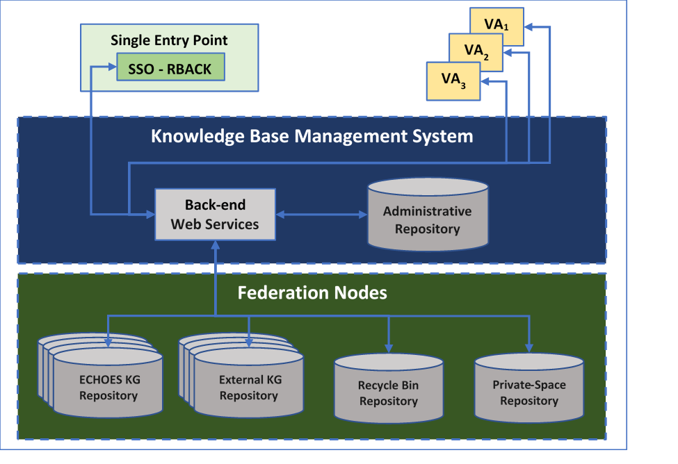

Figure 11: ECHOES Knowledge Base architecture

### 5.5.1 Access to ECHOES - SSO

Single Entry Point (SEP) is a critical component of the architecture, that ensures consistent, secure, and traceable access to the platform itself and its distributed services. It is based on the Single Sign-On (SSO) concept, which allows users to authenticate once and then access all authorized services without repeated login attempts.

SSO provides the following benefits:

- Seamless Access: users from multiple institutions can log in using their own credentials (e.g., ORCID) and access resources across services

- Centralized Authentication: the entire authentication process is managed through a central identity gateway, EGI Check-in

- Scalability and Interoperability – solution scales with new partners and supports open standards (OIDC, SAML) ensuring interoperability with external tools

EGI Check-In serves as an identity broker. It connects external Identity Providers (IdPs) such as eduGAIN federations, ORCID and social login providers.

EGI Check-In offers:

- Federated login

- Virtual Organization (VO) management

- Token issuance with entitlements

- OIDC and SAML compatibility

- Integration with external IAM and group management systems

- Support for web, CLI and programmatic access

*Key questions for EGI Check-In has been answered [here](https://univtoursfr.sharepoint.com/:w:/r/sites/ECHOES2/Documents%20partages/WP%2006%20Setting%20the%20Cloud%20Environment/241009_ECHOES_WP06_Deliverables/240624_ECHOES_D16.1_Single_Entry_Point_to_the_CH_cloud/Q%26A%20EGI%20capabilities.docx?d=w049341f0db9c4c079f82757f460189a4&csf=1&web=1&e=2ugqYO) – that document should be a base*

<figure>

<figcaption>
<em>for AAI design and implementation.</em>
</figcaption>
</figure>

### 5.5.2 High-Level SSO process

The core workflow follows these essential steps:

- EGI Check-in serves as Identity Hub – It acts as an authorization server and identity broker, presenting a discovery service that lists available Identity Providers based on user context and configured federation

- Identity Provider Selection – Users select their institution from the supported federation

- External IdP authenticates user – Chosen IdP performs authentication using local credentials and returns OIDC Id token containing user attributes and institutional affiliations.

#### Detailed Authentication Architecture - Overview

The diagram below shows the high-level authentication and authorization flows managed by EGI Check-in as the central AAI provider. These flows ensure secure and interoperable access across the platform, supporting both web-based user interactions and programmatic access via CLIs and APIs.

The architecture covers 4 core access patterns that will be widely utilized during the project lifecycle:

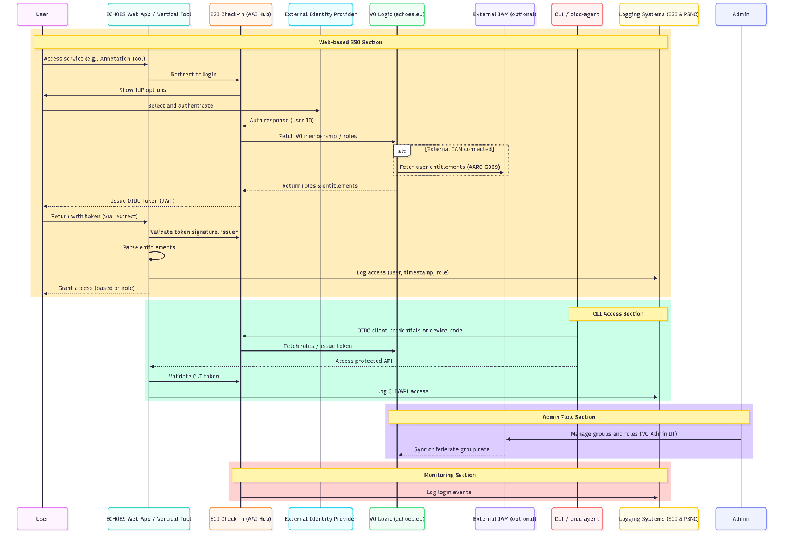

Figure 12: Authentication and Authorization flow

1.  Web-based SSO flow – Users log in via their institutional or external identity provider through EGI Check-in, which issues an OIDC token containing user attributes and entitlements. Services validate the token and grant access based on role

2.  CLI/API Access flow – CLI tools and services authenticate using OIDC client credentials to obtain tokens for accessing protected resources/APIs

3.  Administrative Flow – management of roles, groups and virtual organisations through admin interface

4.  Monitoring and logging – all authentication and access events are logged for traceability and security compliance

A more detailed description will follow in Deliverable D16.1: Single Entry Point to the CH Cloud.

### 5.5.3 Administrative Repository

The Administrative Repository manages metadata related to Knowledge Base (KB) users and triplestores, which constitute the nodes of the federated KB infrastructure. It serves as the central coordination layer for maintaining information about repository registration, configuration, ownership, and accessibility.

While user authentication and role management are handled by an external identity management service, the Administrative Repository stores complementary metadata necessary to define user-specific permissions within the KB. This includes references to authenticated users, their ownership and maintenance assignments, and their associations with specific triplestores of the ECHOES ecosystem. It also maintains descriptive and operational metadata for each registered in the federation triplestore, such as its identifier, URL, availability status, and configuration details.

By centralizing this information, the Administrative Repository contributes to the governance and integrity of the federated KB, ensuring that user access rights are consistently enforced and that KB repository interactions remain traceable and auditable. Its document-oriented structure supports scalability and extensibility, enabling the inclusion of additional metadata types or policy mechanisms as the federation evolves. In this way, the Administrative Repository plays a key role in maintaining secure, coherent, and well-governed access to the distributed resources of the KB.

A document-oriented database (MongoDB) supports the storage of this metadata, providing flexibility for evolving access control structures and integrating seamlessly with the external user and role management infrastructure.

*Proposed technology to be used: MongoDB (Reference: <https://www.mongodb.com/>)*

### 5.5.4 Back-End - Web Services

This is the core component of the KB architecture, responsible for implementing all essential business logic. It provides:

1.  A KB REST API for third-party applications and individual stakeholders (i.e., Vertical Applications).

2.  RESTful microservices that facilitate communication with the front-end.

The back end interacts with all components described above and manages security by integrating with the **SSO & RBAC system,** which is part of the Single-Entry Point—a separate component outside the KB architecture itself.

At a high level, this component, together with the Administrative Repository utilizes metadata to deliver the following functionality:

- Web services to support basic CRUD operations on the federated KB;

- Registry services to maintain a catalog of all connected triplestores and their associated ownership and maintenance assignments;

- Monitoring and tracking of federated node availability;

- Administrative functionality for managing users and KB nodes;

- Administrative functionality for auditing KB RDF content enrichment evolution

- Security features, including the protection of all REST API interactions, ensuring that user access rights are consistently enforced.

- A KB REST API for third-party applications and individual stakeholders (i.e., Vertical Applications).

*Proposed technology to be used: Spring Boot (Reference: <https://spring.io/projects/spring-boot>)*

#### API Endpoints and Operations

The KB REST API for the basic CRUD operations (for triplestore interaction) and registry services is presented in the Appendix section *API Endpoints and Operations*. The completed API for all the provided services will be published in the ECHOES GitHub repository.

### 5.5.5 Management Console

The KB Management Console is a web-based user interface designed to support administrative operations within the federated KB environment. It serves as a central access point for managing knowledge-sharing and private-spaces repositories, configuring user access, and handling digital twin registrations. The interface aims to provide a unified and intuitive environment for administrators and authorized users to perform governance-related actions without requiring direct interaction with low-level APIs or backend configurations.

Through this console, users will be able to perform operations such as registering new triple stores and digital twins, constructing and managing working groups, and assigning ownership and maintenance roles to users. It will also offer a simple interface for executing basic Create, Read, Update, and Delete (CRUD) operations over the triple stores, leveraging the underlying KB Management REST API for secure and standardized interactions.

Beyond these core functions, the console will emphasize usability, transparency, and traceability. Administrative actions—such as repository registration and access control modification—will be logged to ensure accountability and facilitate auditability. The interface will include mechanisms for visualizing repository status, such as availability indicators, providing administrators with a clear overview of the operational landscape of the federated KB.

In alignment with the overall architectural principles, the console will act primarily as a thin client layer, with all logic and data manipulation handled by the backend services. This separation of concerns ensures scalability, maintainability, and consistent enforcement of access control policies across the system. The design will also allow for future extensions, such as integrating analytics dashboards, monitoring services, or collaborative management tools, supporting the evolving needs of the Knowledge Base infrastructure.

*Proposed technology to be used: ReactJS (Reference: https://react.dev/)*

# Conclusion

Deliverable D6.1 presents the foundational Data Strategy for the ECHOES Cultural Heritage Knowledge Base (KB), outlining the principles, requirements, and preliminary architectural approach for building a federated, semantically interoperable data ecosystem within the European Collaborative Cloud for Cultural Heritage (ECCCH). The document establishes how cultural heritage data - from raw scientific measurements to interpreted knowledge -will be managed, integrated, enriched, and made reusable across institutions, domains, and countries. 

At its core, the strategy addresses long-standing challenges in the cultural heritage sector, including fragmentation of data across legacy systems, lack of harmonized metadata, insufficient interoperability, and limited support for collaborative research workflows. It highlights the importance of semantic technologies, ontology alignment (notably CIDOC CRM and the ECHOES Heritage Digital Twin Ontology), and FAIR principles as the foundation for a shared European knowledge environment. The document also identifies critical gaps in existing infrastructures, such as the absence of unified querying across distributed repositories, and positions ECHOES as a unique opportunity to overcome these limitations through a federated but semantically coherent architecture. 

D6.1 defines the conceptual data lifecycle used in ECHOES - from raw data to processed, post-processed and interpreted datasets - and demonstrates it through detailed examples from heritage science, 3D documentation, and conservation research. It categorizes data sources expected to be integrated into the KB and describes the roles and responsibilities of data providers, institutions, data stewards, curators, and infrastructure operators within a multi-level governance model. 

The deliverable outlines high-level functional and non-functional requirements based on user profiles ranging from independent researchers to large research infrastructures. It presents example user scenarios illustrating how ECHOES will support data ingestion, transformation, semantic enrichment, publication, preservation, and federated analytics. It also offers an initial sketch of the technical architecture, including triplestores, metadata pipelines, APIs, identity and access management, and federation mechanisms, noting that the complete, final architecture will be published in June 2026. 

Overall, D6.1 establishes the strategic, conceptual, and methodological framework for managing cultural heritage data in ECHOES. It prepares the ground for subsequent deliverables, particularly D6.2 on interoperability requirements and guidelines and D6.3 on cloud architecture, where the technical specifications, standards, and implementation details will be further formalized and extended. 

# References

- Niccolucci, F., Felicetti, A. and Hermon, S., Populating the Data Space for Cultural Heritage with Heritage Digital Twins. Data, 7(8), 105 (2022). 

- Wilkinson, M., Dumontier, M., Aalbersberg, I. *et al.* The FAIR Guiding Principles for scientific data management and stewardship. *Sci Data* 3, 160018 (2016). <https://doi.org/10.1038/sdata.2016.18> 

- Fernandez, George & Zhao, Liping & Wijegunaratne, Inji. (2003). Patterns for Federated Architecture.. Journal of Object Technology. 2. 135-149. 10.5381/jot.2003.2.3.a4. 

- Niccolucci, F., Markhoff, B., Theodoridou, M., Felicetti, A., & Hermon, S. (2023). The Heritage Digital Twin: A bicycle made for two. The integration of digital methodologies into cultural heritage research. arXiv preprint arXiv:2302.07138. <https://doi.org/10.48550/arXiv.2302.07138> 

# Appendix

**API Endpoints and Operations**

The final KB REST API - currently in development - will be published in the [ECHOES GitHub repository](https://github.com/ECHOES-ECCCH). The following table outlines several core operations. All the requests of the API must include a valid JWT in the Authorization header.

<table style="width:98%;">
<colgroup>
<col style="width: 29%" />
<col style="width: 10%" />
<col style="width: 57%" />
</colgroup>
<thead>
<tr>
<th><strong>Endpoint</strong></th>
<th><strong>Method</strong></th>
<th><strong>Description</strong></th>
</tr>
</thead>
<tbody>
<tr>
<td>graph/insert</td>
<td>POST</td>
<td>Imports an RDF file on a given triplestore under certain named graph which is automatically generated (multipart/form-data)</td>
</tr>
<tr>
<td colspan="3">
Parameters:

RDF File – The triples file to be validated and located in the triplestore - multipart/form-data;

The content type of the file to be uploaded - Text

Triplestore ID - Text;

Response: A JSON object holding

A succeed/failed Boolean value;

The automatically generated named graph used;

The appropriate message.
</td>
</tr>
<tr>
<td>graph/replace</td>
<td>POST</td>
<td>Replaces an existing named graph with a new</td>
</tr>
<tr>
<td colspan="3">
Parameters:

RDF File – The triples file to be validated and located in the triplestore - File

The content type of the file to be uploaded - Text

Triplestore ID - Text;

Named graph old - Text;

Named graph new - Text;

Response: A JSON object holding

A succeed/failed Boolean value;

The appropriate message.
</td>
</tr>
<tr>
<td>graph/download</td>
<td>GET</td>
<td>Downloads the contents of specific named graph</td>
</tr>
<tr>
<td colspan="3">
Parameters:

The content type of the output file - Text;

The content disposition – Text

Triplestore ID - Text;

The named graph - Text;

Response: The raw binary (or text) content of the file itself.
</td>
</tr>
<tr>
<td>hdt/download</td>
<td>GET</td>
<td>Downloads the RDF content of specific digital twin as a file</td>
</tr>
<tr>
<td colspan="3">
Parameters:

The content type of the output file - Text;

The content disposition – Text;

Triplestore ID – Text;

The digital twin ID - Text;

Response: The raw binary (or text) content of the file itself.
</td>
</tr>
<tr>
<td>triplestore/query/download</td>
<td>GET</td>
<td>Downloads the contents from specific query as a file</td>
</tr>
<tr>
<td colspan="3">
Parameters:

The content type of the output file - Text;

The content disposition – Text

Triple SPARQL query - Text;

Response: The raw binary (or text) content of the file itself.
</td>
</tr>
<tr>
<td>graph/content</td>
<td>GET</td>
<td>Returns the RDF contents of specific named graph</td>
</tr>
<tr>
<td colspan="3">
Parameters:

Triplestore ID – Text;

The named graph - Text;

Response: The text content of the named graph.
</td>
</tr>
<tr>
<td>hdt/content</td>
<td>GET</td>
<td>Returns the RDF content of specific digital twin</td>
</tr>
<tr>
<td colspan="3">
Parameters:

Triplestore ID - Text;

The digital twin ID - Text;

Response: The text content of the digital twin.
</td>
</tr>
<tr>
<td>triplestore/query/result</td>
<td>GET</td>
<td>Returns the text result after applying specific query</td>
</tr>
<tr>
<td colspan="3">
Parameters:

The SPARQL query - Text;

Response: The text content of the query’s results.
</td>
</tr>
<tr>
<td>graph/delete</td>
<td>DELETE</td>
<td>Deletes a named graph from specific triplestore</td>
</tr>
<tr>
<td colspan="3">
Parameters:

Triplestore ID - Text;

Named graph - Text;

Response: A JSON object holding

A succeed/failed Boolean value;

The appropriate message.
</td>
</tr>
<tr>
<td>triplestore/catalog/register</td>
<td>POST</td>
<td>Registers or updates metadata of a triplestore in the Administrative Repository</td>
</tr>
<tr>
<td colspan="3">
Parameters:

URL – Text;

Name – Text;

Description – Text;

Response: A JSON object holding

A succeed/failed Boolean value;

The appropriate message.
</td>
</tr>
<tr>
<td>triplestore/catalog/get</td>
<td>GET</td>
<td>Returns all metadata of a triplestorefrom the Administrative Repository</td>
</tr>
<tr>
<td colspan="3"></td>
</tr>
<tr>
<td>triplestore/search</td>
<td>POST</td>
<td>Searches for triplestore based on filters</td>
</tr>
<tr>
<td colspan="3">
Parameters:

Creator – Text;

Triplestore name;

Creation Date;

Response: A JSON object holding

A succeed/failed Boolean value;

The appropriate message.
</td>
</tr>
<tr>
<td>Hdt/search</td>
<td>POST</td>
<td>Searches for digital twins</td>
</tr>
<tr>
<td colspan="3">
Parameters:

Digital Twin’s name – Text;

Creator – Text;

Creation Date;

Response: A JSON object holding

A succeed/failed Boolean value;

The appropriate message.
</td>
</tr>
</tbody>
</table>

**Selecting Triplestore for the ECHOES**

The decision for the adopted selection of SPARQL Triplestore for the ECHOES project is documented in [241204_TripleStoreComparison.docx.url](https://univtoursfr.sharepoint.com/:u:/r/sites/ECHOES2/Documents%20partages/WP%2006%20Setting%20the%20Cloud%20Environment/241009_ECHOES_WP06_Deliverables/240624_ECHOES_D6.1_CH_knowledge_base_Data_Strategy/D.1-APPENDIX/241204_TripleStoreComparison.docx.url?csf=1&web=1&e=NHkcEd)
