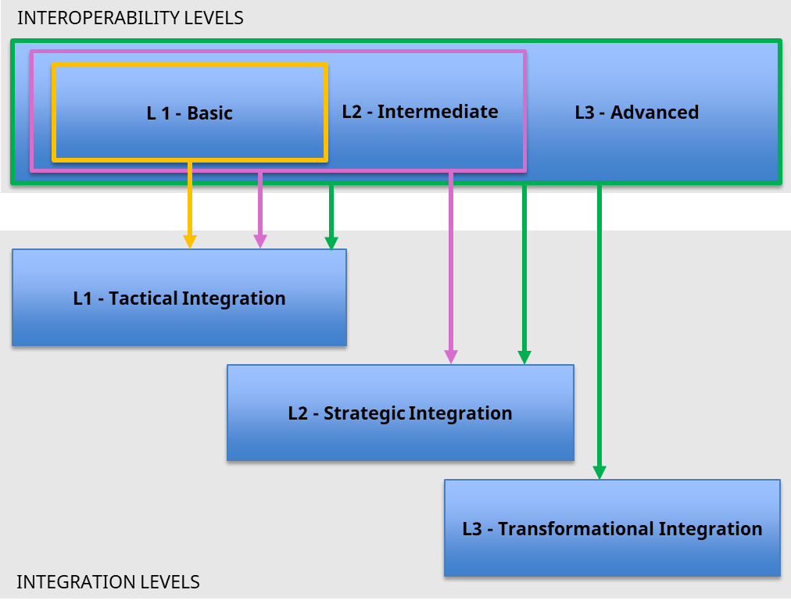

 European Cloud for Heritage Open Science

Deliverable D6.2 Interoperability

Requirements and Guidelines

HORIZON-CL2-2023-HERITAGE-ECCCH-01

Horizon Innovation action

Responsible authors Joanna Kowalska (PCSS) and Konrad Pawlikowski (PCSS)

|    Project start    | 1 June 2024             |
|:-------------------:|-------------------------|
|  Project duration   | 60 months               |
| Document Identifier | 10.5281/zenodo.18656368 |

© 2025 by the authors, the ECHOES consortium. This work is licensed under a “CC BY 4.0” license.

# Deliverable Information

<table style="width:94%;">
<colgroup>
<col style="width: 23%" />
<col style="width: 23%" />
<col style="width: 23%" />
<col style="width: 23%" />
</colgroup>
<thead>
<tr>
<th>Project Number</th>
<th>101157364</th>
<th>Acronym</th>
<th>ECHOES</th>
</tr>
</thead>
<tbody>
<tr>
<td>Full title</td>
<td colspan="3">European Cloud for Heritage OpEn Science</td>
</tr>
<tr>
<td>Project URL</td>
<td colspan="3"><a href="https://www.echoes-eccch.eu/">https://www.echoes-eccch.eu/</a></td>
</tr>
<tr>
<td>EU Project Officer</td>
<td colspan="3">Christian WILK</td>
</tr>
</tbody>
</table>

<table style="width:94%;">
<colgroup>
<col style="width: 23%" />
<col style="width: 23%" />
<col style="width: 13%" />
<col style="width: 33%" />
</colgroup>
<thead>
<tr>
<th>Deliverable</th>
<th>D6.2</th>
<th>Title</th>
<th>Interoperability Requirements and Guidelines</th>
</tr>
</thead>
<tbody>
<tr>
<td>Work Package</td>
<td>WP6</td>
<td>Title</td>
<td>Setting the Cloud Environment</td>
</tr>
<tr>
<td>Submission date</td>
<td colspan="3">15/02/2026</td>
</tr>
<tr>
<td>Pages</td>
<td>91</td>
<td>Keywords</td>
<td>Interoperability, Integration, Technical Documentation</td>
</tr>
</tbody>
</table>

| Lead Partner | PCSS |
|----|----|
| Responsible Author | PCSS |
| Authors (Partner) | Konrad Pawlikowski (PCSS), Joanna Kowalska (PCSS), Laure Barbot (DARIAH-EU), Tobias Hellmund (Fraunhofer), Carlos Andujar (UPC), Leszek Malchrowicz (PCSS), Marios Pitikakis (FORTH-IESL) |
| Contributors | Emanuel Demetrescu (CNR), Tobias Hellmund (Fraunhofer IOSB), Maximilian Zenner (Fraunhofer IOSB), Antoine Isaac (EF), Paolo Cignoni (CNR), Kerstin Arnold (APEF), Sally Chambers (DARIAH-EU), Matej Durco (OEAW), Alvar Vinacua (UPC), Lydia Cadevall (UPC), Dimitrios Kotzinos (CNRS-CYU), Sarah Middle (York University) |

<table style="width:94%;">
<colgroup>
<col style="width: 16%" />
<col style="width: 10%" />
<col style="width: 23%" />
<col style="width: 44%" />
</colgroup>
<thead>
<tr>
<th colspan="4">Change log</th>
</tr>
</thead>
<tbody>
<tr>
<td>Date </td>
<td>Version</td>
<td>Author</td>
<td>Change</td>
</tr>
<tr>
<td>15.12.2025</td>
<td>1.0</td>
<td>Konrad Pawlikowski</td>
<td>Drafting all sections</td>
</tr>
<tr>
<td>23.12.2025</td>
<td>2.0</td>
<td>Joanna Kowalska</td>
<td>Changing document template</td>
</tr>
<tr>
<td>5.01.2026</td>
<td>3.0</td>
<td>Konrad Pawlikowski</td>
<td>Adding content to various sections</td>
</tr>
<tr>
<td>15.01.2026</td>
<td>4.0</td>
<td>Joanna Kowalska</td>
<td>Changing order of chapters, merging content of various chapters</td>
</tr>
<tr>
<td>20.01.2026</td>
<td>4.1</td>
<td>Marios Pitikakis</td>
<td>Adding chapter about integration vs interoperability</td>
</tr>
<tr>
<td>08.02.2026</td>
<td>5.0</td>
<td>
Joanna Kowalska,

Konrad Pawlikowski, Leszek Malchrowicz
</td>
<td>Refactoring</td>
</tr>
<tr>
<td>15.02.2026</td>
<td>6.0</td>
<td>Joanna Kowalska</td>
<td>Final Updates</td>
</tr>
<tr>
<td>15.02.2026</td>
<td>6.1</td>
<td>Xavier Rodier</td>
<td>Proofreading</td>
</tr>
</tbody>
</table>

# Abstract

This deliverable defines the interoperability requirements and implementation guidelines for the European Collaborative Cloud for Cultural Heritage (ECCCH). It establishes a structured interoperability framework covering technical, semantic, organizational, and legal dimensions necessary to enable reliable exchange, reuse, and federation of cultural heritage data, services, workflows, and applications across distributed infrastructures.

The document introduces three cumulative interoperability levels (L1–L3), providing a progressive onboarding and maturity path for providers while ensuring consistent validation, security, and operational readiness across the CH Cloud ecosystem. These interoperability levels are aligned with the integration model defined in the ECHOES Integration Strategy (D3.1), ensuring that interoperability readiness enables corresponding levels of integration within the federated architecture.

The deliverable specifies testable technical requirements, provider guidelines, validation and monitoring mechanisms, and federation-readiness expectations for datasets, APIs, applications, workflows, semantic artefacts, and infrastructure nodes. Together, these elements form the normative interoperability framework supporting the development of a coherent, secure, and sustainable Cultural Heritage Cloud.

Disclaimer: Views and opinions expressed are however those of the author(s) only and do not necessarily reflect those of the European Union or the European Research Executive Agency. Neither the European Union nor the granting authority can be held responsible for them.

#  Table of Contents

[Deliverable Information](#deliverable-information)

[Abstract](#abstract)

[Table of Contents](#table-of-contents)

[List of figures and tables](#list-of-figures-and-tables)

[List of abbreviations](#list-of-abbreviations)

[1 Introduction](#introduction)

[1.1 Importance of Interoperability in ECHOES](#importance-of-interoperability-in-echoes)

[1.2 Consequences of Poor Interoperability](#consequences-of-poor-interoperability)

[1.3 How to Read This Document](#how-to-read-this-document)

[2 State of the Art ](#state-of-the-art)

[2.1 Data Architecture - Standards and Formats](#data-architecture---standards-and-formats)

[2.2 Protocols and APIs](#protocols-and-apis)

[2.3 Deployment and infrastructure](#deployment-and-infrastructure)

[2.4 Security and data privacy](#security-and-data-privacy)

[2.5 Access and use/reuse for legal interoperability](#access-and-usereuse-for-legal-interoperability)

[3 Interoperability Requirements](#interoperability-requirements)

[3.1 Structure and Classification](#structure-and-classification)

[3.2 Requirements by Function](#requirements-by-function)

[3.3 Requirements by Resource Type](#requirements-by-resource-type)

[3.4 Requirements by Level](#requirements-by-level)

[3.5 Federation and Node Requirements](#federation-and-node-requirements)

[4 Interoperability Guidelines](#interoperability-guidelines)

[4.1 Guidelines by Function](#guidelines-by-function)

[4.2 Checklists](#checklists)

[4.3 Guidelines for Software Development](#guidelines-for-software-development)

[5 Evaluation and monitoring of interoperability](#evaluation-and-monitoring-of-interoperability)

[5.1 Interoperability Evaluation Framework and KPIs](#interoperability-evaluation-framework-and-kpis)

[5.2 Monitoring Tools and Signals (Interoperability Maintenance)](#monitoring-tools-and-signals-interoperability-maintenance)

[5.3 Semantic Monitoring (Vocabulary, Ontology and KB Integrity)](#semantic-monitoring-vocabulary-ontology-and-kb-integrity)

[6 Validation and Conformance Testing](#validation-and-conformance-testing)

[6.1 Validation workflow](#validation-workflow)

[6.2 Validation Artefacts and Machine-Testable Rules](#validation-artefacts-and-machine-testable-rules)

[6.3 Responsibilities](#responsibilities)

[6.4 Findings Classification](#findings-classification)

[6.5 Reporting and Error Handling](#reporting-and-error-handling)

[7 Governance, Updates, and Compliance](#governance-updates-and-compliance)

[7.1 Governance structure](#governance-structure)

[7.2 Standards update process](#standards-update-process)

[7.3 Compliance audits](#compliance-audits)

[7.4 Change management and versioning](#change-management-and-versioning)

[7.5 Documentation templates](#documentation-templates)

[7.6 Communication and onboarding process](#communication-and-onboarding-process)

[7.7 Compliance recordkeeping](#compliance-recordkeeping)

[8 Conclusion](#conclusion)

[8.1 Key findings](#key-findings)

[8.2 Recommendations](#recommendations)

[8.3 Summary of requirements and guidelines](#summary-of-requirements-and-guidelines)

[8.4 Risk analysis and mitigation](#risk-analysis-and-mitigation)

[8.5 Future work](#future-work)

[9 Annexes](#annexes)

[A. Relevant CH and research infrastructures](#relevant-ch-and-research-infrastructures)

[B. RICE Scoring](#rice-scoring)

# List of figures and tables

[Table 1-1: Scope of this deliverable](#_Toc222088922)

[Figure 1: Interoperability Levels](#_Toc222088923)

[Table 1-2: Examples of Interoperability Levels & Requirements](#_Toc222088924)

[Table 1-3: Interoperability & Integration Strategic Goals](#_Toc222088925)

[Table 1-4: Key concepts](#_Toc222088926)

[Table 2-1: Standards summary](#_Toc222088927)

[Table 3-1: Structure and Classification](#_Toc222088928)

[Table 3-2: Mandatory vs recommended and level-gating](#_Toc222088929)

[Table 3-3: Validation classification](#_Toc222088930)

[Table 3-4: Metadata baseline](#_Toc222088931)

[Table 3-5: Extended Metadata requirements](#_Ref219295403)

[Table 3-6: Identifiers and persistence](#_Toc222088933)

[Table 3-7: Structural conformance and JSON-LD](#_Toc222088934)

[Table 3-8: Controlled vocabularies and context integrity](#_Toc222088935)

[Table 3-9: RDF and SHACL](#_Toc222088936)

[Table 3-10: Provenance separation and mappings](#_Toc222088937)

[Table 3-11: Identification and contract](#_Toc222088938)

[Table 3-12: Transport and protocol obligations](#_Toc222088939)

[Table 3-13: Predictable behaviour and error model](#_Toc222088940)

[Table 3-14: Pagination and query quality](#_Toc222088941)

[Table 3-15: Versioning and deprecation](#_Toc222088942)

[Table 3-16: Federation operability](#_Toc222088943)

[Table 3-17: Semantic APIs](#_Toc222088944)

[Table 3-18: Stability safeguards](#_Toc222088945)

[Table 3-19: Data service endpoint requirements](#_Ref219295376)

[Table 3-20: Deployment repeatability and artefacts](#_Toc222088947)

[Table 3-21: Runtime operability (cross-reference)](#_Toc222088948)

[Table 3-22: Logs and metrics](#_Toc222088949)

[Table 3-23: Backup, recovery, integrity, dependencies](#_Toc222088950)

[Table 3-24: Baseline Security](#_Toc222088951)

[Table 3-25: Authentication and authorisation](#_Toc222088952)

[Table 3-26: Monitoring and Provenance Baseline](#_Toc222088953)

[Table 3-27: Runtime observability](#_Toc222088954)

[Table 3-28: Monitoring and Provenance](#_Toc222088955)

[Table 3-29: User feedback mechanism (applications, L2+)](#_Toc222088956)

[Table 3-30: Monitoring of restricted access](#_Toc222088957)

[Table 3-31: Drift monitoring (contracts and schemas)](#_Toc222088958)

[Table 3-32: Provenance and lineage](#_Toc222088959)

[Table 3-33: Reassessment and remediation lifecycle](#_Toc222088960)

[Table 3-34: Datasets applicability matrix](#_Toc222088961)

[Table 3-35: Data quality and Integrity Requirements](#_Ref219295409)

[Table 3-36: Applications applicability](#_Toc222088963)

[Table 3-37: APIs and Web Services applicability](#_Toc222088964)

[Table 3-38: Semantic Artefacts Applicability](#_Toc222088965)

[Table 3-39: Workflows Applicability](#_Toc222088966)

[Table 3-40: Node requirements](#_Toc222088967)

[Table 4-1: Where to find implementation guidance](#_Toc222088968)

[Table 4-2: Data Organization](#_Toc222088969)

[Table 4-3: System Communication](#_Toc222088970)

[Table 4-4: System Operation](#_Toc222088971)

[Table 4-5: Security](#_Toc222088972)

[Table 4-6: Monitoring and Provenance](#_Toc222088973)

[Table 4-7: Documentation](#_Toc222088974)

[Table 4-8: Compact provider checklist by interoperability level](#_Toc222088975)

[Table 4-9: Software development and operations practices](#_Toc222088976)

[Table 5-1: KPI model](#_Toc222088977)

[Table 5-2: 1. Monitoring objectives](#_Toc222088978)

[Table 5-3: 2. Monitoring scope and coverage](#_Toc222088979)

[Table 5-4: 3. Signal groups](#_Toc222088980)

[Table 5-5: 4. Semantic assets under monitoring](#_Toc222088981)

[Table 5-6: 5. Semantic signal types (mandatory checks)](#_Toc222088982)

[Table 5-7: Severity, escalation, and reassessment rules](#_Toc222088983)

[Table 6-1: Dataset Validation](#_Toc222088984)

[Table 7-1: Decision rights (RACI)](#_Toc222088985)

[Table 8-1: Summary of requirements and guidelines](#_Toc222088986)

[Table 10-2: Relevant CH and research infrastructures](#_Toc222088987)

[Table 10-3: Each factor SHALL be scored using the following scale](#_Toc222088988)

[Table 10-4: RICE Scoring (Quantitative Ranking Mechanism)](#_Toc222088989)

# List of abbreviations

| Abbreviations | Meaning                                                   |
|---------------|-----------------------------------------------------------|
| API           | Application Programming Interface                         |
| CIDOC-CRM     | Conceptual Reference Model for Cultural Heritage          |
| DCAT          | Data Catalog Vocabulary                                   |
| EDM           | Europeana Data Model                                      |
| EOSC          | European Open Science Cloud                               |
| FAIR          | Findable, Accessible, Interoperable, Reusable             |
| GDPR          | General Data Protection Regulation                        |
| HDT           | Heritage Digital Twin                                     |
| HDTO          | Heritage Digital Twin Ontology                            |
| HTTP          | Hypertext Transfer Protocol                               |
| IIIF          | International Image Interoperability Framework            |
| JSON          | JavaScript Object Notation                                |
| JSON-LD       | JavaScript Object Notation for Linked Data                |
| OAI-PMH       | Open Archives Initiative Protocol for Metadata Harvesting |
| OAuth2        | Open Authorization Framework v2                           |
| OIDC          | OpenID Connect                                            |
| OGC           | Open Geospatial Consortium                                |
| OWL           | Web Ontology Language                                     |
| PID           | Persistent Identifier                                     |
| RDF           | Resource Description Framework                            |
| REST          | Representational State Transfer                           |
| SHACL         | Shapes Constraint Language                                |
| SKOS          | Simple Knowledge Organization System                      |
| SPARQL        | SPARQL Protocol and RDF Query Language                    |
| URI           | Uniform Resource Identifier                               |

# Introduction

Interoperability is the ability of two or more systems, organizations, or components to exchange information and to use the information that has been exchanged. In practice, this means that data, services, and tools can interact in a predictable manner without requiring ad hoc conversions, bespoke integrations, or manual intervention at each interaction point. 

In the European Collaborative Cloud for Cultural Heritage (ECCCH) context, interoperability is a foundational prerequisite for federation: it enables the onboarding and integration of heterogeneous resources originating from different institutions and countries, implemented with different technologies, and governed under different policies. Interoperability reduces fragmentation, avoids duplicated effort, and increases the consistency and reuse potential of cultural heritage assets and related digital services. 

This deliverable treats interoperability as a coordinated set of complementary layers. A purely technical connection between systems is insufficient if the meaning of exchanged data is inconsistent, if organizational processes prevent reliable cooperation, or if legal constraints prevent reuse. Therefore, this document distinguishes four interoperability layers (Technical, Semantic, Organizational, Legal).

To support realistic onboarding and continuous improvement, the deliverable also defines **Interoperability Levels** (L1, L2, L3). Levels provide a structured progression path: providers can publish and register resources with baseline interoperability, and then incrementally improve toward richer interoperability and stronger guarantees. Those levels are mapped to the **Integration Levels**, described in [D3.1 ECHOES Integration Strategy](https://zenodo.org/records/17751335). Levels also allow the ECCCH federation to apply consistent validation rules and to express interoperability status transparently. 

In practice, interoperability applies to how data, metadata, services, tools, and applications expose, consume, and combine functionalities through standardized interfaces, shared semantic models, and agreed protocols. It is therefore the ECCCH components and resources, acting within a federated architecture, that are the direct subjects of interoperability, enabling consistent discovery, access, exchange, and reuse across organizational and technical boundaries.

- **Technical interoperability** ensures that systems can exchange data through compatible protocols, APIs, and formats. It is concerned with transport, interface contracts, encodings, and runtime operability (e.g., stable endpoints, error handling, versioning). 

- **Semantic interoperability** ensures that exchanged data retains a consistent meaning across systems. It depends on shared conceptual models and controlled vocabularies so that terms, entities, and relationships are interpreted consistently (e.g., shared identifiers for places/persons/concepts; mappings across vocabularies). 

- **Organizational interoperability** ensures that cooperating actors can coordinate effectively to deliver predictable outcomes across organizational boundaries. It covers alignment of roles, responsibilities, operational processes, and governance mechanisms such as incident response, update procedures, and decision rights. 

- **Legal interoperability** ensures that exchange and reuse of resources is lawful and predictable. It covers licensing, rights expressions, access conditions, and compliance requirements that affect what can be shared, under which conditions, and what obligations apply to downstream users. 

These layers are mutually reinforcing. Technical connectivity without semantic alignment produces unusable or misleading results; semantic alignment without organizational processes leads to unreliable operations; and any form of interoperability without legal clarity can prevent reuse entirely. 

## Importance of Interoperability in ECHOES

Interoperability is particularly critical in the cultural heritage domain because cultural heritage resources - including data, objects, narratives, interpretations, and tools - are inherently heterogeneous, distributed, and often multilingual. They are produced using different standards, stored in diverse repositories, and governed by distinct institutional and legal constraints. Without a common interoperability framework, these resources remain fragmented: difficult to discover, expensive to integrate, and often impossible to reuse reliably. 

Interoperability enables cultural heritage data and applications to reach their full potential in the following ways: 

**Integration of heterogeneous resource types**

Cultural heritage collections span multiple modalities and structures: text, images, 3D, audio/video, geospatial data, annotations, archival and museum records, and derived analytical datasets. Interoperability enables these to be linked and jointly processed, supporting aggregation, federation, and cross-collection analysis. 

**Consistent cross-institution meaning and discovery**

Semantic interoperability (shared vocabularies and conceptual models) enables meaningful search and discovery across collections, supports cross-collection exploration, and enables automated enrichment and reasoning where appropriate. This is essential when integrating resources from museums, libraries, archives, research infrastructures, and digital humanities initiatives. 

**Long-term sustainability and preservation readiness**

Interoperability reduces dependence on proprietary or isolated systems by using documented formats, schemas, and interfaces. It supports migration and transformation of resources over time with reduced risk of meaning loss, aligning with FAIR principles and open science practices where applicable. 

**Reuse, enrichment, and innovation **

Interoperable resources can be reused across projects and institutions, enriched with annotations and semantic links, integrated into new workflows, and leveraged by advanced tools (including AI-based services) without repeatedly rebuilding conversion pipelines. This allows innovation produced by one actor to benefit the wider ecosystem. 

**Cross-disciplinary research and advanced use cases**

Cultural heritage research frequently requires combining historical context, linguistic analysis, geospatial interpretation, material science, conservation data, and interpretive scholarship. Interoperability provides the technical and semantic foundation for such multi-modal, cross-domain research, and supports advanced federation use cases such as virtual exhibitions and digital twins. 

**Improved user experience and public access **

Interoperability improves searchability, supports multilingual exploration, enables cross-institution user journeys (including integrated portals and storytelling), and supports connected experiences such as virtual exhibitions and digital twins. This enhances public access while strengthening the preservation and visibility of cultural heritage. 

Interoperability is therefore not only a technical concern but a strategic enabler: it transforms isolated digital collections and tools into a connected, reusable, and evolvable ecosystem that supports preservation, research, innovation, and public engagement at European scale. 

## Consequences of Poor Interoperability 

Poor interoperability in the Cultural Heritage domain has far-reaching consequences that affect not only technical systems, but also institutional collaboration, legal compliance, sustainability, and the ability to generate new knowledge.

Because CH data and tools originate from diverse institutions, countries, disciplines, and technological backgrounds, insufficient interoperability can create structural barriers that inhibit reuse and innovation.

Fragmentation of cultural heritage data

When institutions use different metadata schemas, formats, identifiers, or storage systems, data becomes isolated and difficult to combine. Consequences include:

- limited ability to aggregate or compare datasets,

- inconsistent user experience across collections,

- duplication of digitization and documentation efforts,

- data loss when systems change or become obsolete.

This fragmentation prevents the creation of unified cultural heritage knowledge graphs or multi-institution research environments.

**Loss of meaning and context**

Without semantic alignment like ontologies, controlled vocabularies, and shared conceptual models, information may be misinterpreted or cannot be reliably linked across datasets. Consequences:

- incompatible descriptions of similar objects or events,

- reduced accuracy in search and discovery systems,

- inconsistent interpretation of multilingual data,

- ambiguity in AI enrichment or automated annotation.

This undermines one of the core goals of the CH Cloud: to build semantically rich, reusable, and intelligible CH data.

**Barriers to reuse, integration, and innovation**

Poor interoperability significantly limits the ability to combine and reuse digital resources and services across the cultural heritage research ecosystem. In practice, this affects the coherent use of:

- digital collections, which remain isolated in institution-specific systems and formats,

- analysis and processing tools, which cannot be easily chained or reused across platforms,

- machine learning pipelines, whose integration often requires custom, project-specific adaptations,

- visualization and exploration environments, which struggle to consume heterogeneous data and services, and

- scholarly or community annotations, which are rarely portable or reusable beyond their original context.

As a consequence, poor interoperability leads to:

- increased development costs, driven by repeated implementation of similar integration logic,

- limited reproducibility of workflows and results, as technical dependencies and configurations cannot be easily replicated, and

- reduced potential for research collaboration, particularly across institutional, disciplinary, and national boundaries.

This contradicts FAIR, open science, and sustainability principles.

**Technical lock-in and sustainability risks**

Heterogeneous proprietary formats, undocumented APIs, or non-standard deployment models create dependencies that are hard to maintain over time.

Risks include:

- loss of access when vendors discontinue support,

- migration difficulties,

- inability to scale or federate services,

- high maintenance cost and operational inefficiency.

Long-term preservation of digital heritage depends on open, standardized, interoperable formats and services.

**Limitations in cross-institution and cross-border collaboration**

Inconsistent policies, workflows, and governance mechanisms limit the ability of institutions across Europe to collaborate.

Results include:

- unclear roles and responsibilities in data sharing,

- limited participation of smaller institutions with fewer technical resources,

- Inability to integrate outputs of national or regional projects.

This prevents efficient cooperation across the European CH landscape.

**Legal and licensing incompatibilities**

Legal interoperability is often overlooked but essential.

Poor interoperability causes:

- unclear or incompatible licenses (CC-BY, CC0, custom terms),

- barriers to reuse due to restrictive rights metadata,

- GDPR non-compliance in user or contributor data exchange,

- uncertainty around data ownership and provenance,

- legal conflicts when combining or redistributing metadata with different terms.

In the context of the CH Cloud, inconsistent or missing rights of information can stop workflows entirely or prohibit federation with external infrastructures (e.g., EOSC, data spaces, aggregators).

**Risks to data quality, provenance, and trust**

Without shared interoperability guidelines:

- provenance may be lost or inconsistently captured,

- versioning is unclear,

- data integrity checks vary between institutions,

- Users cannot assess the reliability or authenticity of datasets.

- This undermines the trustworthiness of CH resources and weakens the scientific value of heritage data.

**User experience degradation**

End users like researchers, citizens, educators may encounter:

- broken links,

- inconsistent metadata,

- incompatible formats,

- non-functioning cross-collection search,

- loss of context when moving between tools.

This reduces the impact of cultural heritage digitization efforts.

In summary, poor interoperability creates technical, semantic, organizational, and legal barriers that impede the CH domain's ability to function as a unified knowledge ecosystem. For the European Cultural Heritage Cloud, resolving these challenges is essential to ensure sustainable, trustworthy, and meaningful integration of cultural data and applications at scale.

## How to Read This Document

The purpose of this document is to define the interoperability requirements and guidelines that enable the European Collaborative Cloud for Cultural Heritage (ECCCH) to function as a coherent, federated, and sustainable digital ecosystem. It establishes the technical, semantic, organizational, and legal foundations that allow cultural heritage data, applications, workflows, and services originating from diverse institutions, infrastructures, and projects to be exchanged, combined, reused, and integrated meaningfully.

This document distinguishes clearly between requirements and guidelines to separate **compliance obligations (“what”)** from **implementation guidance (“how”).**

<table>
<caption>
Table 1-1: Scope of this deliverable
</caption>
<colgroup>
<col style="width: 50%" />
<col style="width: 49%" />
</colgroup>
<thead>
<tr>
<th>Within scope</th>
<th>Out of scope (covered by different documents)</th>
</tr>
</thead>
<tbody>
<tr>
<td><ul>
<li>
Semantic interoperability (metadata models, ontologies, controlled vocabularies),
</li>
<li>
technical interoperability (APIs, formats, protocols, deployment),
</li>
<li>
organizational interoperability (roles, workflows, onboarding procedures),
</li>
<li>
legal interoperability (rights metadata, licensing, GDPR considerations),
</li>
<li>
resource-type-specific requirements and checklists,
</li>
<li>
validation and conformance testing methods,
</li>
<li>
interoperability levels and maturity assessment,
</li>
<li>
federation and node requirements.
</li>
</ul></td>
<td><ul>
<li>
implementation of CH Cloud components,
</li>
<li>
detailed service descriptions,
</li>
<li>
ontology engineering work,
</li>
<li>
platform deployment, operation, or user interfaces,
</li>
<li>
governance of the entire CH Cloud beyond interoperability.
</li>
</ul></td>
</tr>
</tbody>
</table>

### Intended Audience

The deliverable is written for a diverse audience within and beyond the consortium:

1.  **Technical partners** responsible for software engineering, data modelling, API development, deployment, and infrastructure management.

2.  **Semantic and data specialists** working with metadata, ontologies, vocabularies, mappings or knowledge organization systems

3.  **Cultural institutions and CH data providers** contribute collections, datasets, and domain expertise to the CH Cloud.

4.  **Non-technical partners, domain experts, and decision-makers** need conceptual and organizational clarity regarding interoperability requirements.

5.  **Developers of applications and services** seeking to integrate their tools with the CH Cloud.

6.  **External projects and infrastructures** (e.g., CH Data Space, EOSC, RIs, sister projects, national digitization programs) planning onboard data or tools

Details of technical requirements, intended especially for groups from point 5 and 6, can be found in the ECHOES Technical Documentation.

### ECHOES Technical Documentation 

This document defines the interoperability requirements and guidelines for the CH Cloud. While the normative principles and interoperability levels defined here are expected to remain stable, some implementation-level technical details may evolve as ECHOES grows and the technical ecosystem matures.

To ensure that the guidance remains precise, practical, and up to date, technical and implementation details, that are likely to evolve over time, are maintained in a dedicated page in the project GitHub (Living Documentation). Readers are encouraged to consult this repository for the most current technical recommendations, examples, and reference implementations.

The content of this document should be considered normative at the requirements level, while the GitHub documentation provides evolving technical guidance that may be updated as technologies, standards, and project decisions develop.

ECHOES Living Documentation can be found under the following link:

<https://echoes-eccch-technical.github.io/internal-documentation/>

### Key concepts

This chapter introduces the key concepts used throughout this document. Its purpose is to clarify terminology, define the relationship between interoperability requirements and implementation guidance, and explain how interoperability levels are structured and applied within the CH Cloud.

Understanding these concepts is essential for providers preparing resources for onboarding, integration, and validation. The definitions and distinctions presented here establish the conceptual foundation for the interoperability requirements described in the following sections.

#### Requirements vs. Guidelines

**Requirements define what** must be satisfied to achieve and maintain interoperability at a given level. They represent the formal, normative criteria used for onboarding, validation, and conformance assessment. Requirements are written to be evidence-based and testable, and their fulfilment is assessed through defined validation mechanisms. Failure to meet a mandatory requirement results in non-conformance with the claimed interoperability level.

**Guidelines define how** requirements can be implemented in practice. They translate the interoperability model and levels into provider-facing implementation patterns for datasets, applications, APIs, semantic artefacts, and workflows. Guidelines do not introduce new requirements; they operationalize existing ones by explaining compliant implementation approaches and expected patterns.

The following interpretation rules apply:

- **No contradiction:** guidelines SHALL NOT contradict or weaken requirements.

- **Operationalization:** every mandatory requirement is supported by one or more guidelines explaining how it can be implemented.

- **Precedence:** in case of conflict, **requirements take precedence** over guidelines.

- **Validation alignment:** guidelines are written to support validation, provider self-assessment, and remediation, and are limited to behaviors that can be verified.

This separation ensures that providers can clearly identify what is required for compliance, while using the guidelines as practical, structured support for implementation, without blurring obligations and recommendations.

#### Interoperability vs. Integration

Although often used interchangeably, interoperability and integration describe distinct concepts.

**Interoperability** refers to the **ability of systems to communicate and use exchanged information meaningfully**, based on shared standards and agreed conventions, without requiring system-specific adaptations.

**Integration,** by contrast, refers to the architectural **effort required to make systems work together**. It typically involves tightly coupled solutions, custom connectors, middleware, and transformation layers that align heterogeneous systems into a single operational setup.

Interoperability is a prerequisite of Integration. At different technical layers, this manifests as follows:

**Data**

Interoperability focuses on data exchange, where systems can immediately consume exchanged data thanks to shared formats and standards (e.g. JSON, XML, RDF).

Integration focuses on data consolidation, usually through ETL processes that transform heterogeneous data into a unified internal format.

**Metadata**

Interoperability relies on shared semantic models and schemas agreed across participants.

Integration relies on metadata mappings between schemas.

**Service**

Interoperability relies on choreography, where services expose standardized APIs and can interact directly, allowing components to be substituted without breaking workflows.

Integration commonly uses orchestration via middleware that coordinates and translates between services.

**Ecosystem**

Interoperable ecosystems are loosely coupled and vendor-neutral, enabling a plug-and-play environment where tools can be replaced without re-engineering the entire stack.

Integrated systems tend to be tightly coupled and system-specific.

#### Interoperability Levels 

ECHOES defines three mandatory, cumulative interoperability levels. Providers MUST declare a target level and the CH Cloud MUST validate it automatically. No resource may be onboarded below L1. Also, failure to maintain compliance will result in a level downgrade.

**L1 – Basic**

Minimum entry level ensuring discoverability, basic access, stable identifiers, clear licensing, and baseline security. No semantic interoperability.

**L2 – Intermediate**

Adds structured semantics and operational readiness: JSON-LD/RDF metadata, controlled vocabularies, documented/versioned APIs, entitlement-based access, and health/logging support.

**L3 – Advanced**

Full federated participation: formal ontologies, SHACL validation, semantic endpoints, fine-grained access control, workflow integration, object-level provenance, and cross-node federation.

Levels determine onboarding, integration scope, validation, security, and federation participation. They are based on **a** **cumulative model** which means that **L2 includes all L1 requirements** and **L3 includes L1 and L2 requirements**. Providers should treat level upgrades as incremental:

- **L1 to L2:** add structured metadata (JSON-LD), schema/profile declarations, controlled vocabularies or mappings, contract-driven APIs (OpenAPI + tests), basic monitoring, and (if restricted) federated AAI via EGI Check-in.

Figure 1: Interoperability Levels

**L2 to L3:** add RDF representations, SHACL constraints and validation, URI stability discipline, and semantic drift monitoring.

In the Table 1-2, you can find examples of how different Interoperability Levels can influence Interoperability Requirements. To fully understand the approach this document describes, there is a need to introduce **MoSCoW** - a project management technique used to prioritize requirements by classifying them into four categories: **MUST**-have, **SHOULD**-have, **COULD**-have, and **WON'T**-have. This mechanism determines whether a requirement is mandatory, recommended, optional, or out of scope.

<table>
<caption>
Table 1-2: Examples of Interoperability Levels &amp; Requirements
</caption>
<colgroup>
<col style="width: 39%" />
<col style="width: 17%" />
<col style="width: 20%" />
<col style="width: 22%" />
</colgroup>
<thead>
<tr>
<th>Requirement</th>
<th>L1</th>
<th>L2</th>
<th>L3</th>
</tr>
</thead>
<tbody>
<tr>
<td colspan="4"><strong>Metadata &amp; Semantics</strong></td>
</tr>
<tr>
<td>Minimal metadata</td>
<td>MUST</td>
<td>MUST</td>
<td>MUST</td>
</tr>
<tr>
<td>JSON-LD or RDF</td>
<td>SHOULD</td>
<td>MUST</td>
<td>MUST</td>
</tr>
<tr>
<td>Controlled vocabularies</td>
<td>COULD</td>
<td>SHOULD</td>
<td>MUST</td>
</tr>
<tr>
<td>CIDOC-CRM</td>
<td>WON’T</td>
<td>SHOULD</td>
<td>SHOULD</td>
</tr>
<tr>
<td>SHACL constraints</td>
<td>WON’T</td>
<td>SHOULD</td>
<td>MUST</td>
</tr>
<tr>
<td colspan="4"><strong>APIs &amp; Interfaces</strong></td>
</tr>
<tr>
<td>OpenAPI 3.0</td>
<td>SHOULD</td>
<td>MUST</td>
<td>MUST</td>
</tr>
<tr>
<td>SPARQL endpoint</td>
<td>WON’T</td>
<td>COULD</td>
<td>MUST</td>
</tr>
<tr>
<td>Pagination/filtering</td>
<td>SHOULD</td>
<td>MUST</td>
<td>MUST</td>
</tr>
<tr>
<td>Semantic annotations</td>
<td>WON’T</td>
<td>SHOULD</td>
<td>MUST</td>
</tr>
<tr>
<td colspan="4"><strong>Security &amp; Access</strong></td>
</tr>
<tr>
<td>OIDC (if restricted)</td>
<td>WON’T</td>
<td>MUST</td>
<td>MUST</td>
</tr>
</tbody>
</table>

There is also a strong connection between Interoperability Levels and the Integration Levels from ECHOES' Integration Strategy, the Strategic goals for both types being the same:

<table>
<caption>
Table 1-3: Interoperability &amp; Integration Strategic Goals
</caption>
<colgroup>
<col style="width: 49%" />
<col style="width: 50%" />
</colgroup>
<thead>
<tr>
<th style="text-align: center;">Interoperability L1</th>
<th style="text-align: center;">Integration L1</th>
</tr>
</thead>
<tbody>
<tr>
<td colspan="2" style="text-align: center;">
Strategic Goal:

The primary objective at this level is critical mass and visibility. We aim to lower the entry barrier for institutions to bring their assets onto the Cloud. Strategically, this phase focuses on ingestion and storage efficiency rather than deep computational interoperability.
</td>
</tr>
<tr>
<td style="text-align: center;">Interoperability L2</td>
<td style="text-align: center;">Integration L2</td>
</tr>
<tr>
<td colspan="2" style="text-align: center;">
Strategic Goal:

The objective shifts to meaning and connection. We move from pointing to the data, to understanding what it represents. Strategically, this level enforces the adoption of the Heritage Digital Twin Ontology (HDTO) as part of domain ontology alignment (see Table 1-2), ensuring that a dataset from Italy can be semantically aligned with a dataset from France, as well as implementation of unified APIs to access the distributed datasets.
</td>
</tr>
<tr>
<td style="text-align: center;">Interoperability L3</td>
<td style="text-align: center;">Integration L3</td>
</tr>
<tr>
<td colspan="2" style="text-align: center;">
Strategic Goal:

The ultimate goal is automation, autonomy, and distributed trust. We transition from a repository to a Distributed Data Fabric where applications, services, data and workflows are dynamically federated, scaled, and actioned or used. Strategically, this level enables Federated Compute, moving algorithms to the data or, if needed, moving data to the algorithms.
</td>
</tr>
</tbody>
</table>

Fulfilling interoperability at **Level 1 - Basic** will enable provider to integrate at **Level 1 – Tactical**

Fulfilling interoperability at **Level 2 - Intermediate** will enable provider to choose to integrate at **Level 1 – Tactical** **OR Level 2 – Strategic**

Fulfilling interoperability at **Level 3 - Advanced** will enable provider to choose to integrate at **Level 1 – Tactical OR Level 2 – Strategic OR Level 3 – Transformational**

#### Resource Types

CH Cloud resources take different forms and therefore have different interoperability requirements.

- **Datasets** Structured or unstructured collections of data made available for discovery, access, reuse, or processing within the CH Cloud.

- **Applications** Software tools, services, or platforms that consume, process, visualise, generate, enrich, or manage cultural heritage data.

- **APIs** Programmatic interfaces exposing data or functionality through network-accessible endpoints.

- **Semantic artefacts**

Vocabularies, ontologies, thesauri, authority files, mappings, or alignment resources used to support semantic interoperability.

- **Workflows** Automated or semi-automated processes combining datasets, services, and applications, including orchestration and task execution.

#### Other Terms

In this section, definitions of other terms important in the context of interoperability are provided. The comprehensive ECHOES glossary is maintained separately and is linked in Section 1.3.5 (Useful Resources).

| Term | Definition |
|----|----|
| Persistent Identifier (PID) | A stable, long-lasting reference (e.g., DOI, Handle, ARK) that uniquely identifies a digital object, dataset, resource, or entity. PIDs support citation, traceability, and long-term availability. |
| URI / IRI | A machine-readable identifier used to uniquely reference entities in linked data. URIs are essential for semantic interoperability and graph-based knowledge representation. |
| Vocabulary / Controlled Vocabulary | A list of predefined terms used to maintain consistency in description. Examples: Getty AAT, ICONCLASS. |
| Federated Infrastructure | A distributed system where multiple nodes operate collaboratively while maintaining autonomy. Federation requires interoperability at technical, semantic, and organizational levels. |
| AAI (Authentication and Authorization Infrastructure) | The set of protocols and services enabling secure identification of users and access control. Examples: OAuth2, OpenID Connect, SAML. |
| Semantic Enrichment | The process of augmenting datasets with additional contextual information, for example annotations, links, classifications. |
| Web Service | A remotely accessible software function exposing data or processes via APIs. |
| API (Application Programming Interface) | A defined interface through which systems exchange data or functionality. Examples: REST, GraphQL, SPARQL, IIIF APIs. |
| Node (ECCCH context) | A participating infrastructure component capable of providing storage, compute, services, or data to the federated CH Cloud. |
| Provider | An entity that contributes datasets, services, applications, workflows, or semantic artefacts to the CH Cloud. |
| Consumer | An entity that uses datasets, services, or tools provided by the CH Cloud. |
| Rights Information / Licensing | Information describing copyright status, usage rights, access conditions, and legal restrictions. Examples: CC licenses, custom institutional terms. |
| Validation | A process for checking the conformity of a resource against predefined rules (schema, SHACL shapes, API specifications). |
| Conformance | The degree to which a resource fulfils mandatory interoperability requirements (L1/L2/L3 criteria). |

Table 1-4: Key concepts

###  Useful Resources

Project Page - [Link](https://www.echoes-eccch.eu/)

Provides the overall technical and organisational context needed to understand interoperability goals, architecture, and service integration principles in ECHOES.

**ECHOES Data Strategy for the CH Knowledge Base (D6.1) - [Link](https://zenodo.org/records/17751757)**

Defines how data, metadata, and semantic resources are structured, governed, and made reusable across the CH Cloud, forming the foundation for semantic interoperability.

**ECHOES Integration Strategy for datasets, tools and workflows with potential for reuse in ECHOES (D3.1) - [Link](https://zenodo.org/records/17751335)**

Explains how datasets, applications, and workflows are onboarded and integrated into the CH Cloud infrastructure, ensuring technical interoperability across components.

**ECHOES Integration Roadmap (D3.2) -** [Link](https://zenodo.org/records/17751670)

Describes the phased approach to integration and alignment of services, helping providers understand how to progressively achieve higher integration levels.

**Other ECHOES reports -** [Link](https://www.echoes-eccch.eu/reports/)

Provide complementary technical, governance, and implementation guidance supporting consistent interoperability across the ecosystem.

**The European Open Science Cloud (EOSC) resources**

As one of the Data Spaces with which the ECCCH is expected to interact, the EOSC Federation is defining its Interoperability Framework in the EOSC Federation Handbook (<https://doi.org/10.5281/zenodo.18454649>), in alignment with Regulation (EU) 2024/903 on a high level of public sector interoperability across the Union (Interoperable Europe Act).

At present, the main interoperability guidelines being enforced within the emerging EOSC Federation concern Authentication and Authorisation Infrastructure (AAI) and Resource Catalogues. The EOSC AAI Architecture 2025 (<https://doi.org/10.5281/zenodo.15388269>) builds on the Authentication and Authorisation for Research and Collaboration (AARC) Blueprint Architecture (<https://aarc-community.org/architecture/>) to implement authentication and authorisation across the federation.

The aggregation of resources, including services and research products, within the EOSC Knowledge Graph follows established guidelines (<https://doi.org/10.5281/zenodo.15516019> and <https://doi.org/10.5281/zenodo.17513487>), enabling federation nodes to adopt common resource profiles and API protocols.

Additional guidelines, for example concerning the use of Persistent Identifiers (PIDs) across the federation, are still under development. The governance of the EOSC Interoperability Framework is likewise expected to be established through several ongoing EOSC-related projects.

# State of the Art 

This section surveys the interoperability standards, specifications, and practices that underpin the CH Cloud framework. It covers data formats, metadata schemas, semantic technologies, exchange protocols, deployment patterns, security mechanisms, and legal interoperability, within the context of cultural heritage (CH) and research infrastructures.

The objective is to: (i) identify standards relevant to dataset and application onboarding, (ii) inform the interoperability levels and requirements defined later in this deliverable, and (iii) provide a reference point for mapping CH Cloud guidance to established international norms. Decisions on what is mandated and what is recommended are defined in subsequent chapters.

Terminology used in this chapter (e.g., interoperability, semantic interoperability, metadata, identifiers) is defined in Chapter 1 and expanded in **Deliverable D6.1 (Semantic Data Strategy).**

Detailed implementation guidance is maintained in the Living Documentation:

<https://echoes-eccch-technical.github.io/internal-documentation/engineering-handbook/>

| Domain | Standards/specifications | Documentation reference |
|----|----|----|
| Semantic & knowledge representation | RDF, OWL, SKOS, CIDOC-CRM | /Data-standards-and-protocols/ |
| Metadata schemas & profiles | Dublin Core, EDM, DCAT, MARCXML, EAD/EAG | /Data-standards-and-protocols/ |
| Persistent identifiers | DOI, Handle, ARK, HTTP URIs | /Data-standards-and-protocols/Data-standards/Identifiers-and_URIs/ |
| Media & domain formats | JSON/JSON-LD, XML, CSV/TSV, RDF Turtle/N-Triples, OBJ/glTF, GeoJSON/WKT | /Data-standards-and-protocols/ |
| Exchange & packaging | BagIt, RO-Crate | /Data-standards-and-protocols/Data-standards/Packaging/ro-crate/ |
| Provenance and traceability | W3C PROV, PROV-O | /Data-standards-and-protocols/ |
| Protocols for access / harvesting | IIIF, OAI-PMH, REST, Solid, OGC WMS/WFS/WMTS, SPARQL (where applicable) | /Data-standards-and-protocols/protocols/ |
| API description & validation | OpenAPI, JSON Schema, SHACL | /Data-standards-and-protocols/protocols/ |
| Deployment interoperability | OCI, Kubernetes (plus packaging/mesh add-ons where relevant), Infrastructure-as-Code | /SDLC/iac-process/ |
| Security interoperability | OAuth2, OIDC, SAML2 (as needed), HTTPS/TLS, consistent authorisation models | /Security/security-and-data-privacy/ |
| Rights & legal interoperability | Creative Commons, RightsStatements.org, DCTERMS rights/license, IIIF rights, EDM edm:rights | See Chapters 3 and 4 |

Table 2-1: Standards summary

## Data Architecture - Standards and Formats

CH Cloud groups relevant standards into: (i) semantic representation (e.g., RDF/OWL/SKOS), (ii) metadata schemas (e.g., Dublin Core, EDM, DCAT), (iii) media and domain formats, (iv) exchange/packaging (e.g., BagIt, RO-Crate), and (v) rights/licensing mechanisms.

These categories align with the interoperability levels used in this deliverable:

- L1 (Basic): minimal discovery metadata and simple serialisations sufficient for basic discovery and access.

- L2 (Intermediate): richer metadata and semantic alignment, typically via JSON-LD and controlled vocabularies.

- L3 (Advanced): full semantic integration using graph-based linked data, shared ontologies, and formal constraints (e.g., SHACL).

Schemas, profiles, and concrete examples are provided in the Living Documentation

## Protocols and APIs

Protocols and APIs determine how systems communicate and exchange data. They affect ingestion and synchronisation, delivery of digital objects, metadata harvesting, and semantic querying across distributed services.

For CH Cloud integration, commonly referenced protocol families include:

- IIIF for interoperable access to high-resolution images and structured manifests for complex digital objects.

- OAI-PMH for metadata harvesting, used widely by CH institutions and aggregators.

- REST APIs for general service interfaces and query patterns.

- Decentralised protocols (e.g., Solid) as an optional interoperability approach where relevant.

- OGC Web Services (WMS/WFS/WMTS) for geospatial layers and GIS interoperability.

To support automated compliance checks, CH Cloud also relies on machine-readable validation artefacts such as:

- OpenAPI for API contracts.

- JSON Schema for payload validation.

- SHACL for RDF graph validation.

## Deployment and infrastructure

Interoperability depends not only on formats and APIs but also on reproducible deployment across heterogeneous deployment environments (i.e., different node infrastructure stacks, including institutional on-site installations and cloud-native environments). Key enabling practices include:

- OCI containers and Kubernetes-based orchestration (where applicable).

- Infrastructure-as-Code (declarative provisioning; e.g., Terraform/Ansible/ class tools).

- CI/CD and GitOps patterns to standardise build/test/deploy workflows across nodes.

## Security and data privacy

Distributed services require a shared trust framework. In practice, this includes unified identity and authentication, consistent authorisation rules, secure transport, and audit/provenance-relevant security logging.

Within CH Cloud, commonly referenced security families include:

- OIDC OAuth2, and SAML2 for identity and authentication interoperability.

- HTTPS/TLS for transport security.

- Consistent RBAC/ABAC-style authorisation enforcement aligned with rights and provenance requirements.

## Access and use/reuse for legal interoperability

CH Cloud does not redefine legal rules; instead, it provides technical mechanisms that make legal constraints machine-actionable and enforceable across providers. This includes:

- Expressing rights and licences in machine-readable form (e.g., Creative Commons, RightsStatements.org), typically via URI-based licence statements.

- Translating rights, embargoes, and sensitivity constraints into predictable access behaviours (e.g., restricted downloads, embargo handling, role-based restrictions).

- Supporting GDPR-related technical practices such as pseudonymisation, data minimisation, privacy-aware logging, and traceability for access/erasure workflows.

- Coupling rights metadata with AAI-derived entitlements to support consistent policy enforcement across nodes, including cross-border reuse scenarios.

# Interoperability Requirements

This chapter defines technical **interoperability requirements** for resources onboarded into the CH Cloud. It translates the interoperability model into an evidence-driven requirements catalogue used for onboarding decisions, level assignment (L1/L2/L3), and conformance testing.

To ensure that document can quickly address Reader’s needs – requirements are presented from different angles and mapped to the following groups: requirements by function, requirements by resource type and requirements by level. One requirement can be present in more than one category.

Authoritative inputs include the Grant Agreement, D6.1/WP6 outputs, D3.1/D3.2 technical design outputs, and previous sections of this deliverable. Where sources overlap, the requirement is expressed once as a single canonical statement.

## Structure and Classification

| Field | Required | Description |
|----|----|----|
| REQ-ID | Yes | Stable identifier (do not renumber between drafts) |
| Statement | Yes | Single testable normative statement |
| Applies-to | Yes | Resource types in scope |
| Role | When relevant | Provider / Operator / Workflow provider |
| Level | Yes | Minimum level (L1/L2/L3), using cumulative model |
| Evidence | Yes | Artefact(s) and/or runtime proof |
| Rationale | Optional | Interoperability risk addressed |
| Validation class | Optional | Static / Dynamic / Operational / Manual audit |

Table 3-1: Structure and Classification

| Classification | Trigger | Interpretation |
|----|----|----|
| Mandatory (MUST) | baseline compliance | Minimum for onboarding and/or for claiming a level |
| Recommended (SHOULD) | best practice | Improves operability; may affect maturity expectations |
| Level-gating | explicitly required for a specific level | Failure blocks **that level** claim, not necessarily onboarding at lower level |
| Blocking | explicitly marked blocking | Failure blocks onboarding at any level |

Table 3-2: Mandatory vs recommended and level-gating

| Validation class | What is checked | Typical evidence/examples |
|----|----|----|
| Static (artefact-based) | Files/docs | OpenAPI, schemas, SHACL, metadata records, licences |
| Dynamic (runtime-based) | Executed tests/calls | Endpoint behaviour, auth flows, error model, /health, /ready |
| Operational (monitoring-based) | Signals over time | Availability/latency/error rate, drift checks, repeated auth failures |
| Manual audit (exception-only) | When automation infeasible | Documented audit record |

Table 3-3: Validation classification

## Requirements by Function

###  Data Organization

This section defines normative requirements for metadata, semantic representation, and semantic alignment. Implementation guidance and checklists are provided in Chapter 4 (Interoperability Guidelines), while validation artefacts and machine-testable rules are specified in Chapter 6 (Validation and Conformance Testing). Governance and change control are defined in Chapter 7.

| REQ-ID | Statement | Applies-to | Level | Evidence |
|----|----|----|----|----|
| REQ-META-001 | Every onboarded resource MUST provide machine-readable discovery metadata. | Dataset, Application, API/Service, Workflow, Semantic artefact | L1+ | Metadata record (JSON/JSON-LD/XML or agreed catalogue format) |
| REQ-META-002 | Discovery metadata MUST include: title, description, provider/owner, contact point, license/reuse conditions, and version or last-modified indicator. | Dataset, Application, API/Service, Workflow, Semantic artefact | L1+ | Metadata record containing required fields |
| REQ-META-003 | Each onboarded resource MUST be assigned a globally unique and stable identifier. | Dataset, Application, API/Service, Workflow, Semantic artefact | L1+ | Identifier in metadata and used consistently |

Table 3-4: Metadata baseline

| REQ-ID | Name | Statement |
|----|----|----|
| REQ-MD-01 | Metadata | Each dataset MUST be accompanied by rich, machine-readable metadata and an explicit, durable binding between the metadata record and the data using persistent, resolvable identifiers and references. |
| REQ-MD-02 | Metadata catalogue | Metadata SHOULDbe stored in a catalogue that provides metadata for each dataset and is accessible independently of the dataset itself. |
| REQ-MD-03 | Data provenance | Each dataset MUST explicitly identify its authors and owners in machine-readable metadata using unambiguous, persistent, and resolvable identifiers (e.g., ORCID for individuals), including roles, affiliations, and contact information. |
| REQ-MD-04 | Licensing | A license MUST be attachable to and persistently associated with every dataset. |
| REQ-MD-05 | Temporal validity | Each dataset MUST include machine-readable metadata that describes its temporal validity, including start and end timestamps, for example as ISO 8601 intervals with timezonetime zone/offset, the applicable time reference (e.g., observation, acquisition, publication), sampling cadence where relevant, and any uncertainty or deprecation dates. |
| REQ-MD-06 | Geographical validity | Each dataset MUST include machine-readable metadata that describes its spatial validity, specifying the spatial extent as geometries, the coordinate reference system and positional accuracy/uncertainty. |
| REQ-MD-07 | Data creation | Each dataset MUST include machine-readable creation metadata describing its creation process, including instruments/equipment used, software and algorithm versions, configuration parameters, calibration standards, operating conditions, responsible operators, timestamps, and source inputs. |

Table 3-5: Extended Metadata requirements

| REQ-ID | Statement | Applies-to | Level | Evidence |
|----|----|----|----|----|
| REQ-META-004 | Resource identifiers MUST remain stable across releases; if superseded, the relationship MUST be expressed explicitly (versioning or successor linkage). | Dataset, Application, API/Service, Workflow, Semantic artefact | L2+ | Versioning policy + metadata fields |

Table 3-6: Identifiers and persistence

| REQ-ID | Statement | Applies-to | Level | Evidence |
|----|----|----|----|----|
| REQ-META-005 | If a structured metadata schema/profile is used, it MUST be declared explicitly and referenced from the resource metadata. | Dataset, API/Service, Semantic artefact, Workflow | L2+ | Schema/profile identifier (URI/version ref) |
| REQ-META-006 | Resources claiming L2+ MUST provide metadata in JSON-LD, or a deterministic transformation into JSON-LD. | Dataset, API/Service, Workflow, Semantic artefact | L2+ | JSON-LD or transformation spec + test output |

Table 3-7: Structural conformance and JSON-LD

| REQ-ID | Statement | Applies-to | Level | Evidence |
|----|----|----|----|----|
| REQ-SEM-001 | Where metadata fields represent controlled concepts, providers MUST use controlled vocabulary identifiers or provide a mapping. | Dataset, API/Service | L2+ | Vocabulary IDs or mapping artefact |
| REQ-SEM-002 | Controlled vocabulary terms in L2+ metadata MUST use stable identifiers; provider-controlled vocabularies MUST be dereferenceable. | Dataset, API/Service, Semantic artefact | L2+ | Resolvable vocabulary URIs |
| REQ-SEM-003 | When multilingual labels are provided, language tags MUST be present and consistent per label. | Dataset, API/Service, Semantic artefact | L2+ | Label samples + tagging rules |
| REQ-SEM-009 | JSON-LD contexts referenced by L2+ resources MUST be resolvable and version-controlled; meaning-altering changes MUST be versioned. | Dataset, API/Service, Semantic artefact, Workflow | L2+ | Resolvable @context + changelog |

Table 3-8: Controlled vocabularies and context integrity

| REQ-ID | Statement | Applies-to | Level | Evidence |
|----|----|----|----|----|
| REQ-SEM-004 | Resources claiming L3 MUST provide an RDF representation of their metadata assertions using stable URI’s and make it accessible via persistent URL query endpoint | Dataset, Semantic artefact, API/Service | L3 | RDF file or endpoint URL + sample triples + URI policy info |
| REQ-SEM-005 | RDF assets claiming L3 MUST provide SHACL shapes and MUST validate against them. | Dataset, Semantic artefact | L3 | SHACL shapes + validation report |
| REQ-SEM-010 | L3 linked data resources MUST maintain URI stability and MUST not remove/change meaning without publishing deprecation and replacement information. | Dataset, API/Service, Semantic artefact | L3 | Deprecation policy + replacement links/redirect patterns |

Table 3-9: RDF and SHACL

| REQ-ID | Statement | Applies-to | Level | Evidence |
|----|----|----|----|----|
| REQ-SEM-006 | If metadata is enriched/derived, provider MUST preserve original values and distinguish derived assertions from source assertions. | Dataset, Workflow, API/Service | L2+ (mandatory for L3) | Data model + doc of enrichment |
| REQ-SEM-007 | Semantic artefacts MUST be versioned and MUST declare maintenance contact and change policy. | Semantic artefact | L2+ | Version ID + changelog + contact |
| REQ-SEM-008 | Mapping artefacts MUST be machine-readable and traceable to source/target artefact versions. | Semantic artefact, Dataset | L2+ (mandatory for L3) | Mapping with version refs + mapping changelog |

Table 3-10: Provenance separation and mappings

###  System Communication

APIs must be discoverable, contract-driven, predictable for integrators, and operable in a federated environment.

| REQ-ID | Statement | Level | Evidence |
|----|----|----|----|
| REQ-API-001 | Every API/service MUST publish a stable service identifier and a human-readable service description. | L1+ | Service metadata + doc page/README |
| REQ-API-002 | APIs claiming L2+ MUST publish a machine-readable API contract as OpenAPI 3.x. | L2+ | OpenAPI document parses successfully |
| REQ-API-003 | Deployed API behaviour MUST be consistent with published OpenAPI contract for documented endpoints and schemas. | L2+ | Contract conformance report |

Table 3-11: Identification and contract

| REQ-ID | Statement | Level | Evidence |
|----|----|----|----|
| REQ-API-004 | APIs MUST be accessible over HTTP and MUST support HTTPS in accordance with security requirements (see REQ-SEC-\*). | L1+ | Endpoint reachable over HTTPS; certificate validity |
| REQ-API-005 | APIs MUST declare request/response media types and MUST use consistent Content-Type headers. | L1+ | OpenAPI (L2+) + runtime header inspection |
| REQ-API-006 | Textual payloads MUST use UTF-8 encoding. | L1+ | OpenAPI/docs + runtime inspection |

Table 3-12: Transport and protocol obligations

| REQ-ID | Statement | Level | Evidence |
|----|----|----|----|
| REQ-API-007 | APIs MUST return predictable HTTP status codes and MUST return a machine-readable error object for non-2xx responses. | L2+ | Error schema + negative tests |
| REQ-API-008 | For versioned endpoints, response fields MUST not change meaning without a major version change. | L2+ | Versioning policy + changelog + contract history |
| REQ-API-009 | Endpoints documented as safe/idempotent MUST behave idempotently as specified. | L2+ | Contract + behavioural tests |

Table 3-13: Predictable behaviour and error model

| REQ-ID | Statement | Level | Evidence |
|----|----|----|----|
| REQ-API-010 | Collection endpoints returning unbounded result sets MUST support pagination. | L2+ | OpenAPI + runtime tests |
| REQ-API-011 | Search/discovery endpoints SHOULD provide server-side filtering and sorting. | L2+ | OpenAPI/docs + runtime tests (if implemented) |
| REQ-API-012 | For identical queries on stable datasets, APIs SHOULD return consistent results within documented consistency constraints. | L2+ | Consistency model doc + repeated query tests |

Table 3-14: Pagination and query quality

| REQ-ID | Statement | Level | Evidence |
|----|----|----|----|
| REQ-API-013 | APIs claiming L2+ MUST implement explicit versioning for public interfaces. | L2+ | Versioning scheme (path/header) + changelog |
| REQ-API-014 | APIs MUST publish a deprecation policy defining how deprecated endpoints/fields are announced and removed. | L2+ | Policy with timelines + migration expectations |
| REQ-API-015 | Within a major version, backward-incompatible changes MUST NOT be introduced. | L2+ | Contract history + release notes + regression tests |

Table 3-15: Versioning and deprecation

| REQ-ID | Statement | Level | Evidence |
|----|----|----|----|
| REQ-API-016 | L2+ services MUST expose a health endpoint indicating liveness. | L2+ | /health runtime test |
| REQ-API-017 | L2+ services MUST expose a readiness endpoint indicating ability to accept requests. | L2+ | /ready runtime test |
| REQ-API-018 | Services SHOULD expose deployed version (ideally build identifier) through a documented mechanism. | L2+ | /version or runtime metadata |

Table 3-16: Federation operability

| REQ-ID | Statement | Level | Evidence |
|----|----|----|----|
| REQ-API-019 | L3 services exposing linked data MUST provide an RDF representation for relevant resources. | L3 | RDF serialisation via endpoint/artefact |
| REQ-API-020 | If SPARQL is provided, service MUST declare endpoint URL, supported features, and operational limits. | L3 | Documentation + availability tests |

Table 3-17: Semantic APIs

| REQ-ID | Statement | Level | Evidence |
|----|----|----|----|
| REQ-API-021 | APIs SHOULD implement safeguards (rate limiting, request size limits, timeout policies) to protect stability under federated usage. | L2+ | Documented policies + configuration |

Table 3-18: Stability safeguards

| Requirement Number | Name | Statement |
|----|----|----|
| REQ-DS-001 | Earth observations and satellite imagery service standards | Earth observation data and satellite imagery MUST be provided via interoperable, standards-based interfaces and formats, such as OGC WMS, WFS, etc. (see Annex). |
| REQ-DS-002 | Time series data service standards | Appropriate data standards MUST be used for time series data, such as the OGC SensorThings API (which targets IoT and environmental monitoring with a standards-based, RESTful interface designed for scalable deployments across cloud and edge environments). |
| REQ-DS-003 | Omission of proprietary formats | All technical data exchange interfaces MUST use community standards and open formats (e.g., GeoJSON, JSON, NetCDF). Use of proprietary formats is prohibited unless pluggable, configurable, import/export transformations are provided to automate conversion to and from those formats. |
| REQ-DS-004 | Security and access control | Data MUST be exposed through endpoints that implement user authentication and authorization and provide fine-grained access management for datasets. |
| REQ-DS-005 | Searchability | The catalogue for data (and metadata) SHOULD be searchable and accessible. Data and metadata should be decoupled via stable, standards-based, machine-readable interfaces with support for pagination and filtering. |
| REQ-DS-006 | Persistence | Datasets SHOULD be accessible via stable, versioned, and persistent HTTP(S) URLs with immutable version-specific endpoints. |

Table 3-19: Data service endpoint requirements

###  System Operation

This section defines deployment characteristics enabling interoperable operation in federated environments.

| REQ-ID | Statement | Applies-to | Level | Evidence |
|----|----|----|----|----|
| REQ-DEP-004 | Deployed/hosted applications and services MUST externalise environment-specific configuration (including endpoints and credentials) and MUST NOT hard-code such values into code or images. | API/Service, Application (if deployed/hosted) | L2+ | Configuration mechanism documentation + redacted sample configuration |
| REQ-DEP-005 | Deployed/hosted applications and services MUST provide deployment and operability documentation sufficient to reproduce the runtime environment (dependencies, ports, storage, required external services) and support portability across infrastructures. | API/Service, Application (if deployed/hosted) | L2+ | Deployment/operability documentation (README/runbook) + dependency list |
| REQ-DEP-007 | Deployed/hosted applications and services MUST provide a repeatable deployment procedure (scripted or documented) enabling reliable redeployment of the same version and rollback where applicable. | API/Service, Application (if deployed/hosted) | L2+ | Deployment scripts/IaC or step-by-step procedure + versioned artefacts |
| REQ-DEP-008 | Deployable artefacts MUST be versioned and MUST NOT be overwritten once published. | API/Service, Application | L2+ | Version tags + registry/release history |
| REQ-DEP-009 | Shared-environment services SHOULD be containerised unless justified exception exists. | API/Service, Application | L2+ | Container image + docs, or exception rationale |

Table 3-20: Deployment repeatability and artefacts

| REQ-ID | Statement | Level | Notes |
|----|----|----|----|
| REQ-DEP-010 | Services claiming L2+ MUST provide health/readiness indicators suitable for orchestration and monitoring. | L2+ | Canonical endpoints and semantics are defined in REQ-API-016/017; monitoring expectations in REQ-MON-003. |

Table 3-21: Runtime operability (cross-reference)

| REQ-ID | Statement | Level | Evidence |
|----|----|----|----|
| REQ-DEP-011 | Services MUST emit logs sufficient to diagnose failures and MUST avoid logging secrets or sensitive tokens. | L1+ | Log examples + redaction policy |
| REQ-DEP-012 | L2+ services SHOULD expose basic service metrics (availability/error rate/latency) in a consumable form. | L2+ | Metrics endpoint/export + docs |

Table 3-22: Logs and metrics

| REQ-ID | Statement | Applies-to | Level | Evidence |
|----|----|----|----|----|
| REQ-DEP-013 | Stateful services MUST document backup and recovery procedures required to restore functionality. | Stateful API/Service, Workflow platforms, Applications | L2+ | Backup/restore docs + evidence of process (if applicable) |
| REQ-DEP-014 | Where integrity is critical, providers SHOULD implement integrity mechanisms (checksums, ingest/export validation, or equivalent). | Dataset providers, stateful services | L2+ | Integrity controls doc + validation reports |
| REQ-DEP-015 | Services MUST declare external runtime dependencies and MUST handle dependency failure gracefully. | API/Service, Workflow runtime | L2+ | Dependency list + failure-mode docs |
| REQ-DEP-016 | Providers SHOULD document material changes to operational dependencies that may affect interoperability. | API/Service, Application | L2+ | Release notes / changelog entries |

Table 3-23: Backup, recovery, integrity, dependencies

###  Security

| REQ-ID | Statement | Applies-to | Level | Evidence |
|----|----|----|----|----|
| REQ-SEC-001 | Network services MUST enforce HTTPS for all authenticated or sensitive traffic and MUST use valid certificates. | API/Service, Applications with network interfaces | L1+ | TLS config + endpoint test + cert validity |
| REQ-SEC-002 | Source code and deployment artefacts MUST NOT contain hardcoded secrets or credentials. | All software components | L1+ | Repo scan output + CI secret scanning evidence |
| REQ-SEC-003 | Providers MUST document the access model: public vs restricted, and the expected authentication mechanism where restricted. | Dataset, API/Service, Application, Workflow | L1+ | Documentation + metadata fields |

Table 3-24: Baseline Security

| REQ-ID | Statement | Applies-to | Level | Evidence |
|----|----|----|----|----|
| REQ-SEC-004 | Restricted resources claiming L2+ MUST integrate with the CH Cloud AAI approach (e.g., EGI Check-in/OIDC) as applicable and MUST validate issuer/audience/expiry. | API/Service (restricted), Workflow execution services | L2+ | Auth config + token validation tests |
| REQ-SEC-005 | Restricted endpoints MUST enforce authorisation consistently (no bypass routes). | API/Service, Applications | L2+ | Negative tests + periodic synthetic checks |
| REQ-SEC-006 | Security-relevant events MUST be logged without recording secrets or raw tokens. | API/Service, Workflow runtime | L2+ | Log schema + redaction rules |

Table 3-25: Authentication and authorisation

###  Monitoring and Provenance

| REQ-ID | Statement | Level | Evidence |
|----|----|----|----|
| REQ-MON-001 | Responsible party MUST be identified for each onboarded service/workflow endpoint and MUST provide a technical incident contact. | L1+ | Metadata/docs with responsibility + contact |
| REQ-MON-002 | L2+ services MUST be monitored for availability and error rate, with automated detection of sustained failures. | L2+ | Monitoring config/outputs + alert conditions |
| REQ-MON-003 | L2+ operators MUST configure automated probes against the service health/readiness endpoints(see REQ-DEP-010) and MUST alert on sustained probe failures. | L2+ | Runtime endpoints + semantics + probe results |

Table 3-26: Monitoring and Provenance Baseline

| REQ-ID | Statement | Level | Evidence |
|----|----|----|----|
| REQ-MON-004 | L2+ services MUST produce diagnostic logs and support request correlation (e.g., request IDs), without logging secrets/raw tokens. | L2+ | Logging policy + runtime evidence |
| REQ-MON-005 | L2+ services SHOULD expose basic service metrics (min latency and error rate) in machine-consumable form. | L2+ | Metrics endpoint/export mechanism |
| REQ-MON-006 | Services SHOULD expose deployed version and maintain a change log enabling incident release correlation (mandatory for L3). | L2+ | /version + changelog |
| REQ-MON-013 | L2+ applications and services MUST provide a standardised observability interface that allows the ECHOES analytics framework to query and retrieve telemetry (logs, metrics, and traces), or MUST grant secure access to existing CH Cloud/API/OTLP streams where equivalent data is already available (no duplication required). | L2+ | Reachable observability endpoint or verified access grant; interface specification (OpenAPI/OTLP/JSON as applicable); sample response showing mandatory signal set; evidence of secure access control for the Analytics Collector. |

Table 3-27: Runtime observability

Minimum telemetry signal set (L2+): providers MUST expose, at minimum, the standardised signals below. The authoritative naming conventions, schemas, and examples are maintained in Living Documentation.

| Data name | Dimension | Notes (privacy-preserving) |
|----|----|----|
| response_time | Performance | Latency (e.g., p95) for key endpoints/interactions. |
| throughput | Performance | Request/job processing rate (e.g., conversions per minute). |
| error_rate | Reliability | Error frequency (e.g., HTTP 4xx/5xx) and/or failure counts. |
| system_uptime | Reliability | Uptime over a defined window (service availability %). |
| active_users | User adoption | Unique user count per period; derived from pseudonymous identifiers (do not export raw identifiers unless agreed and compliant). |
| auth_success_rate | Security | Successful vs failed authentication events (aggregated). |
| access_frequency | Data usage | Views/downloads/access counts per resource (aggregated). |
| licensing_compliance | Governance | Presence of valid, machine-readable licence URI (and enforcement where applicable). |

Table 3-28: Monitoring and Provenance

| REQ-ID | Statement | Level | Evidence |
|----|----|----|----|
| REQ-APP-001 | Applications claiming L2+ MUST provide a visible, standardised user-feedback trigger (e.g., “Feedback / Rate this tool”) to capture evaluation input aligned with the ECHOES Evaluation Framework. The mechanism MUST: (a) present an informed consent notice before data capture; (b) support low-friction “quick review” with optional opt-in to a detailed questionnaire; (c) transmit feedback to the central ECHOES survey endpoint hosted by PSNC (PCSS). For authenticated sessions, the payload MUST include a pseudonymous identifier derived from the OIDC subject (sub) claim; for guest sessions, submissions MUST be anonymous. | L2+ | Documentation of UI trigger and consent flow; proof of end-to-end integration with the PSNC survey endpoint; example payloads (authenticated and guest) demonstrating pseudonymous vs anonymous handling. |

Table 3-29: User feedback mechanism (applications, L2+)

Living Documentation for evaluation integration (survey UI patterns, consent text, questionnaire templates, endpoint notes):

<https://echoes-eccch-technical.github.io/internal-documentation/engineering-handbook/Interoperability-evaluation-and-KPI/>

| REQ-ID | Statement | Level | Evidence |
|----|----|----|----|
| REQ-MON-007 | For restricted L2+ services, monitoring MUST detect authentication failures and repeated authorisation denials indicative of drift. | L2+ | Security event logs + alert rules/outputs |
| REQ-MON-008 | Restricted resources MUST be monitored to detect unintended anonymous access paths. | L2+ | Synthetic checks / audit evidence |

Table 3-30: Monitoring of restricted access

| REQ-ID | Statement | Level | Evidence |
|----|----|----|----|
| REQ-MON-009 | L2+ APIs MUST detect breaking changes to interface contract before production deployment. | L2+ | CI/CD contract diff/regression evidence |
| REQ-MON-010 | Where schemas/profiles exist, providers SHOULD monitor conformance drift after releases or data updates (mandatory for L3 RDF assets). | L2+ | Periodic validation reports + job config |

Table 3-31: Drift monitoring (contracts and schemas)

| REQ-ID | Statement | Level | Evidence |
|----|----|----|----|
| REQ-PROV-001 | If outputs are transformed/enriched, provenance MUST distinguish source assertions from derived assertions. | L2+ (mandatory for L3) | Provenance fields + transformation docs |
| REQ-PROV-002 | Updated datasets and semantic artefacts MUST be versioned and MUST provide change history sufficient to identify changes. | L2+ | Version IDs + changelog/release notes |
| REQ-PROV-003 | Reusable workflow outputs MUST declare inputs and processing steps used to generate outputs. | L2+ | Workflow metadata / lineage record |

Table 3-32: Provenance and lineage

| REQ-ID | Statement | Level | Evidence |
|----|----|----|----|
| REQ-MON-011 | Providers MUST trigger re-validation when major version, schema/profile, authZ/authN change occurs, or when monitoring failures indicate drift. | L2+ | Change process docs + re-validation records |
| REQ-MON-012 | Critical monitoring failures MUST lead to remediation plan or temporary downgrade of claimed interoperability level. | L2+ | Incident record + remediation plan / level adjustment record |

Table 3-33: Reassessment and remediation lifecycle

## Requirements by Resource Type

###  Datasets

A dataset is any onboarded data collection intended for discovery, access, processing, or reuse in CH Cloud workflows and services, including assets supporting **Heritage Digital Twins** (e.g., digitised collections, 3D assets and associated metadata, annotations, and derived/enriched datasets).

#### Minimum dataset onboarding evidence package

Providers MUST supply:

- Discovery metadata (REQ-META-001/002) with identifier (REQ-META-003)

- Access method(s) and access policy (public/restricted)

- License/reuse statement (part of REQ-META-002)

- Version/last-modified (part of REQ-META-002; plus REQ-META-004 for L2+)

- If transformations/enrichment exist: provenance and lineage evidence (REQ-PROV-001/003)

- For L3: RDF + SHACL + validation results (REQ-SEM-004/005)

| Requirement ID | Type | Level | Evidence expected for datasets |
|----|----|----|----|
| REQ-META-001 | Mandatory | L1+ | Machine-readable discovery metadata record |
| REQ-META-002 | Mandatory | L1+ | Metadata includes required fields (title/desc/owner/contact/license/version) |
| REQ-META-003 | Mandatory | L1+ | Stable unique dataset identifier present in metadata |
| REQ-META-004 | Level-gating | L2+ | Versioning/supersession relation expressed + policy/changelog |
| REQ-META-005 | Level-gating | L2+ | Schema/profile declaration (where schema exists) |
| REQ-META-006 | Level-gating | L2+ | JSON-LD metadata or deterministic transform specification + output |
| REQ-SEM-001 | Level-gating | L2+ | Controlled vocabulary IDs or mapping artefact (where controlled fields exist) |
| REQ-SEM-002 | Mandatory | L2+ | Stable vocabulary identifiers; dereferenceable if provider-controlled |
| REQ-SEM-003 | Mandatory | L2+ | Language tags on multilingual labels (if multilingual labels provided) |
| REQ-SEM-006 | Mandatory (L3 strict) | L2+ | Provenance separation model for derived/enriched assertions (if enrichment exists) |
| REQ-SEM-009 | Level-gating | L2+ | Resolvable, versioned JSON-LD @context (if JSON-LD contexts used) |
| REQ-PROV-001 | Mandatory (L3 strict) | L2+ | Provenance capture for transformations/enrichment (if present) |
| REQ-PROV-002 | Mandatory | L2+ | Dataset releases versioned + change history provided |
| REQ-PROV-003 | Mandatory | L2+ | Derived dataset declares input(s) + processing steps (if derived outputs provided) |
| REQ-SEM-004 | Level-gating | L3 | RDF representation available (file or endpoint) + stable URIs |
| REQ-SEM-005 | Level-gating | L3 | SHACL shapes + validation report (pass or documented exceptions) |
| REQ-SEM-010 | Mandatory | L3 | URI stability + deprecation/replacement discipline evidence |
| REQ-MON-010 | Mandatory (L3) | L2+ | Periodic schema/profile validation reports; SHACL drift checks for L3 RDF assets |
| REQ-MON-011 | Mandatory | L2+ | Re-validation triggered on releases/schema/policy/auth changes |
| REQ-MON-012 | Mandatory | L2+ | Remediation plan or level downgrade on critical conformance failures |
| REQ-APP-001 | Level-gating | L2+ | Visible feedback trigger + consent notice; proof of integration with PSNC-hosted ECHOES survey endpoint; authenticated payload includes OIDC subject-derived pseudonymous ID; guest submissions anonymous. |
| REQ-MON-013 | Level-gating | L2+ | Reachable observability endpoint (or verified access to existing OTLP/API streams) returning the mandatory L2+ telemetry signal set with standardised naming; sample response; access grant for the ECHOES Analytics Collector. |

Table 3-34: Datasets applicability matrix

Notes:

- Binary assets (images/3D/AV) are covered via their **metadata and relationships**; semantic requirements apply to metadata/RDF, not the binaries.

- Controlled vocabularies apply “where controlled fields exist”; otherwise REQ-SEM-001 is N/A.

| Requirement Number | Name | Description |
|----|----|----|
| REQ-DQ-01 | Data Completeness | Datasets MUST be preserved and distributed in full, without truncation, downsampling, or lossy compression, to ensure complete reusability across use cases; if compression is required, only documented lossless codecs may be used, with integrity checks (e.g., checksums) and references to the authoritative, complete dataset. |
| REQ-DQ-02 | Versioning | Each dataset MUST implement robust versioning to detect and track changes over time, including immutable releases identified by persistent identifiers, semantic version numbers, machine-readable changelogs or diffs with timestamps, and provenance links between versions. |
| REQ-DQ-03 | Data Schema | Where applicable, datasets SHOULD conform to an explicit, versioned schema, and data should be machine-validated against the declared schema (e.g., JSON Schema, XSD). |
| REQ-DQ-04 | UUIDs | All datasets MUST be identified and persisted with a unique global identifier. |

Table 3-35: Data quality and Integrity Requirements

### Applications

Applications are software tools onboarded for use within or alongside CH Cloud (e.g., HDT creation/visualisation tools, annotation tools, processing GUIs). Applications may be purely client-side or may expose runtime endpoints.

#### Minimum application onboarding evidence package

Providers MUST supply:

- Discovery metadata + identifier (REQ-META-001/002/003)

- If the application exposes endpoints: TLS proof and endpoint classification (SEC-01/SEC-03)

- Deployment and operability documentation for hosted applications (REQ-DEP-004/005/007/008 as applicable)

- If restricted: EGI Check-in integration evidence and authZ enforcement evidence (SEC-04/07/09)

- Monitoring and observability evidence for hosted apps (REQ-MON-001/002/004/006/013 as applicable). Evaluation feedback mechanism evidence for L2+ application (REQ-APP-001 as applicable)

| Requirement ID | Type | Level | Evidence expected for applications |
|----|----|----|----|
| REQ-META-001 | Mandatory | L1+ | Discovery metadata record |
| REQ-META-002 | Mandatory | L1+ | Required metadata fields present |
| REQ-META-003 | Mandatory | L1+ | Stable unique application identifier |
| REQ-DEP-004 | Level-gating | L2+ | Externalised configuration (if deployed/hosted) |
| REQ-DEP-005 | Level-gating | L2+ | Environment portability documentation (if deployed/hosted) |
| REQ-DEP-007 | Level-gating | L2+ | Repeatable deployment procedure (if deployed/hosted) |
| REQ-DEP-008 | Mandatory | L2+ | Versioned, immutable release artefacts |
| REQ-DEP-011 | Mandatory | L1+ | Logging policy (if hosted/runtime) with no secret/token leakage |
| REQ-MON-001 | Mandatory | L1+ | Responsible party + incident contact |
| REQ-MON-006 | Mandatory (L3) | L2+ | Version exposure + changelog for correlation (if hosted/runtime) |
| SEC-01 | Blocking | L1+ | HTTPS enforced for any exposed endpoints |
| SEC-03 | Mandatory | L1+ | Public/restricted/internal endpoint classification (if endpoints exist) |
| SEC-04 | Level-gating (restricted) | L2+ | EGI Check-in integration (if restricted access) |
| SEC-07 | Level-gating (restricted) | L2+ | Token validation correctness (if restricted access) |
| SEC-09 | Level-gating (restricted) | L2+ | Authorization enforcement consistency (if restricted access) |
| SEC-15 | Mandatory (restricted) | L2+ | Security event logging policy (if restricted access) |
| REQ-MON-011 | Mandatory | L2+ | Re-validation on changes (if hosted/restricted) |

Table 3-36: Applications applicability

Notes:

- If the application is purely client-side with no exposed endpoints, SEC/DEP/MON runtime requirements may be N/A.

###  APIs and Web Services

APIs and services provide machine interfaces to CH Cloud capabilities (data access, workflow execution, registries, semantic services). They are critical federation integration points.

#### Minimum API/service onboarding evidence package

Providers MUST supply:

- Discovery metadata + identifier (REQ-META-001/002/003)

- OpenAPI contract for L2+ (REQ-API-002) and conformance evidence (REQ-API-003)

- Endpoint and versioning policy (REQ-API-013/014/015)

- Health/readiness endpoints (REQ-API-016/017; REQ-DEP-010)

- Security evidence (SEC-01 baseline; SEC-04/07/09 for restricted)

- Monitoring evidence (REQ-MON-001/002/004/007/009)

| Requirement ID | Type | Level | Evidence expected for APIs/services |
|----|----|----|----|
| REQ-META-001/002/003 | Mandatory | L1+ | Service metadata incl. license/access and identifier |
| REQ-API-001 | Mandatory | L1+ | Stable service identifier + human documentation |
| REQ-API-004/005/006 | Mandatory | L1+ | HTTPS reachability, correct media types and UTF-8 |
| SEC-01 | Blocking | L1+ | TLS enforcement |
| SEC-03 | Mandatory | L1+ | Endpoint classification (public/restricted/internal) |
| REQ-API-002 | Level-gating | L2+ | OpenAPI 3.x contract |
| REQ-API-003 | Level-gating | L2+ | Contract conformance test report |
| REQ-API-007/010/013/014/015 | Level-gating/Mandatory | L2+ | Error schema, pagination, versioning and deprecation policy + evidence |
| REQ-API-016/017 | Level-gating | L2+ | Health + readiness endpoints |
| REQ-DEP-004/005/007/008 | Level-gating/Mandatory | L2+ | Externalised config, portability, repeatable deployment, immutable artefacts |
| REQ-MON-001/002/004 | Level-gating/Mandatory | L2+ | Contact, availability/error monitoring, structured logs |
| REQ-MON-007/008 | Mandatory | L2+ | AAI failure monitoring + anonymous access checks (restricted resources) |
| SEC-04/07/09 | Level-gating (restricted) | L2+ | EGI Check-in authn + correct token validation + authZ enforcement |
| REQ-MON-009 | Level-gating | L2+ | CI evidence for contract drift detection |
| REQ-API-019/020 | Level-gating/Conditional | L3 | RDF access and (if SPARQL exists) declared limits/features |
| REQ-MON-011/012 | Mandatory | L2+ | Re-validation triggers + remediation/level downgrade discipline |

Table 3-37: APIs and Web Services applicability

### Semantic Artefacts

Semantic artefacts include SKOS vocabularies/thesauri, OWL ontologies, mapping files, SHACL shapes, and other semantic constraints used for CH Cloud semantic interoperability and (where applicable) knowledge graph integration.

#### Minimum semantic artefact onboarding evidence package

Providers MUST supply:

- Discovery metadata + identifier (REQ-META-001/002/003)

- Version + changelog + maintenance contact (REQ-SEM-007)

- Resolvable identifiers and stable URIs where provider-controlled (REQ-SEM-002)

- Mapping traceability (REQ-SEM-008 if mappings exist)

- For L3 constraints: SHACL + validation evidence where applicable (REQ-SEM-005)

| Requirement ID | Type | Level | Evidence expected for semantic artefacts |
|----|----|----|----|
| REQ-META-001/002/003 | Mandatory | L1+ | Metadata record + stable ID |
| REQ-SEM-007 | Mandatory | L2+ | Versioning + changelog + contact/change policy |
| REQ-SEM-002 | Mandatory | L2+ | Stable concept/term URIs; dereferenceable where provider-controlled |
| REQ-SEM-003 | Mandatory | L2+ | Language-tagged labels (if multilingual labels exist) |
| REQ-SEM-008 | Mandatory (if mappings exist) | L2+ | Machine-readable mapping + source/target version references |
| REQ-SEM-004 | Level-gating | L3 | RDF representation accessible |
| REQ-SEM-005 | Level-gating (constraints) | L3 | SHACL shapes + validation report (where claims exist) |
| REQ-SEM-010 | Mandatory | L3 | Deprecation/replacement discipline for published identifiers |
| REQ-MON-010 | Mandatory (L3 SHACL) | L2+ | Drift monitoring for SHACL/semantic conformance where applicable |
| REQ-MON-011/012 | Mandatory | L2+ | Re-validation triggers + remediation discipline |

Table 3-38: Semantic Artefacts Applicability

###  Workflows

Workflows are executable processes that transform, enrich, validate, or analyse resources (including HDT-related processing pipelines). Workflows may be deployed as services or distributed as portable packages.

#### Minimum workflow onboarding evidence package

Providers MUST supply:

- Discovery metadata + identifier (REQ-META-001/002/003)

- Workflow version and change history (REQ-PROV-002)

- Lineage: inputs and processing steps for outputs (REQ-PROV-003)

- Provenance separation for derived outputs (REQ-PROV-001 where transformation/enrichment occurs)

- If executed as a service: deployment repeatability and runtime monitoring evidence (REQ-DEP-007; REQ-MON-002/004)

- If restricted: EGI Check-in integration and authorization enforcement (SEC-04/07/09)

| Requirement ID | Type | Level | Evidence expected for workflows |
|----|----|----|----|
| REQ-META-001/002/003 | Mandatory | L1+ | Workflow metadata record + stable ID |
| REQ-PROV-002 | Mandatory | L2+ | Workflow release versioning + changelog |
| REQ-PROV-003 | Mandatory | L2+ | Declared inputs + processing steps for outputs |
| REQ-PROV-001 | Mandatory (L3 strict) | L2+ | Provenance capture for transformations/enrichment (if present) |
| REQ-DEP-004/005/007 | Level-gating (service) | L2+ | Externalised config, portability docs, repeatable deployment (if hosted) |
| REQ-MON-001 | Mandatory | L1+ | Responsible party + incident contact |
| REQ-MON-002/004 | Level-gating (service) | L2+ | Availability/error monitoring and structured logs (if hosted) |
| SEC-01 | Blocking (if exposed) | L1+ | TLS for exposed workflow endpoints |
| SEC-03 | Mandatory (if exposed) | L1+ | Endpoint classification |
| SEC-04/07/09 | Level-gating (restricted) | L2+ | EGI Check-in authn, token validation, and authZ enforcement |
| REQ-SEM-004/005 | Level-gating (if RDF outputs) | L3 | RDF + SHACL validation if workflow outputs RDF assets |
| REQ-MON-010 | Mandatory (L3 RDF) | L2+ | Drift monitoring for SHACL/semantic conformance (if RDF outputs) |
| REQ-MON-011/012 | Mandatory | L2+ | Re-validation triggers + remediation discipline |

Table 3-39: Workflows Applicability

###  External repositories and sister projects (integration cases)

This section applies only where CH Cloud integrates/federates with external repositories. In such cases, the integration MUST ensure at minimum:

- discovery metadata and reuse conditions are available (REQ-META-001/002/003),

- access policy enforcement is consistent for restricted resources (SEC-01; SEC-04/07/09 where applicable),

- monitoring detects integration drift for critical dependencies (REQ-MON-002/011).

A provider MAY satisfy these obligations by supplying mapping/bridge services that meet the API, security, and monitoring requirements in this chapter.

## Requirements by Level

A resource is assigned the highest level for which:

1.  all **blocking** requirements are satisfied,

2.  all **mandatory** and **level-gating** requirements applicable to that level are satisfied,

3.  required **evidence** exists for those requirements.

If any higher-level gating requirement fails, the resource MAY still be onboarded at the highest lower level whose requirements are satisfied.

###  Level 1

#### Mandatory requirement set

All resource types:

- **REQ-META-001** (machine-readable discovery metadata)

- **REQ-META-002** (mandatory metadata fields)

- **REQ-META-003** (globally unique stable identifier)

If the resource exposes any externally reachable endpoint (API/UI/workflow endpoint):

- **SEC-01** (blocking: TLS/HTTPS enforcement)

- **SEC-03** (endpoint classification: public/restricted/internal)

If the resource is operated as a runtime service (hosted application/service/workflow endpoint):

- **REQ-MON-001** (responsible party + incident contact)

#### Minimum evidence package

- Metadata record satisfying **REQ-META-001/002**

- Identifier evidence (**REQ-META-003**)

- Licence/reuse statement (part of **REQ-META-002**)

- Endpoint inventory and classification if endpoints exist (**SEC-03**)

- Proof of HTTPS/TLS enforcement if endpoints exist (**SEC-01)**

- Responsible party/contact if runtime service exists (**REQ-MON-001**)

#### Typical downgrade/block conditions

- Any exposed endpoint without HTTPS/TLS → onboarding blocked (**SEC-01**)

- Missing licence/reuse statement → L1 not assignable (**REQ-META-002**)

- Missing stable identifier → L1 not assignable (**REQ-META-003**)

###  Level 2

#### Mandatory requirement set 

L2 includes all applicable L1 requirements plus:

Metadata and semantics (where applicable per resource type):

- **REQ-META-004** (identifier stability across releases)

- **REQ-META-005** (schema/profile declaration, where schemas exist)

- **REQ-META-006** (JSON-LD metadata or deterministic transform)

- **REQ-SEM-001** (controlled vocabulary IDs or mappings for controlled fields, where applicable)

- **REQ-SEM-002** (stable vocabulary identifiers; dereferenceable where provider-controlled)

- **REQ-SEM-003** (multilingual language tagging where multilingual labels exist)

- **REQ-SEM-009** (JSON-LD context resolvable and versioned, if used)

- **REQ-SEM-006** (provenance separation when enrichment/derivation occurs)

- **REQ-PROV-001/002/003** (provenance/versioning/lineage, where transformations/derived outputs exist)

APIs and services (if the resource exposes an API/service):

- **REQ-API-002** (OpenAPI contract)

- **REQ-API-003** (contract conformance)

- **REQ-API-007** (machine-readable error model)

- **REQ-API-010** (pagination for unbounded collections)

- **REQ-API-013/014/015** (versioning + deprecation + no breaking changes within major)

- **REQ-API-016/017** (health + readiness endpoints)

Deployment and operability (if deployed/hosted):

- **REQ-DEP-004/005** (externalised configuration and portability documentation)

- **REQ-DEP-007/008** (repeatable deployment; immutable versioned artefacts)

- **REQ-DEP-010** (health/readiness operability for orchestration/monitoring)

- **REQ-DEP-011** (logging without secrets/tokens)

Monitoring (for hosted services and critical endpoints):

- **REQ-MON-002** (availability/error monitoring)

- **REQ-MON-004** (structured logs + correlation)

- **REQ-MON-009** (contract drift detection in delivery pipeline, for APIs)

Security and access control (for restricted resources):

- **SEC-04** (EGI Check-in integration)

- **SEC-07** (token validation correctness)

- **SEC-09** (authorization enforcement)

- **SEC-11** (fail-closed for restricted access)

- **SEC-15/16** (security event logging and traceability)

- **SEC-17** (no hardcoded secrets)

- **SEC-18** (secrets storage and rotation for hosted services)

Lifecycle reassessment:

- **REQ-MON-011** (re-validation triggers on major changes)

#### Minimum evidence package

All L1 evidence, plus:

- Versioning/supersession policy evidence (**REQ-META-004**)

- JSON-LD metadata (or deterministic transform artefacts) (**REQ-META-006**)

- Schema/profile references where applicable (**REQ-META-005**)

- Vocabulary IDs or mapping evidence where applicable (**REQ-SEM-001/002/003**)

- Provenance/lineage evidence where transformations exist (**REQ-PROV-001/003**) and release history (**REQ-PROV-002**)

- For APIs: OpenAPI + conformance test report; error model; versioning/deprecation policy; health/readiness results

- For hosted deployments: deployment documentation and immutable release artefacts; logging policy; monitoring configuration evidence

- For restricted resources: EGI Check-in integration evidence; token validation checks; authorization enforcement tests; security event logging policy

- Reassessment trigger process (**REQ-MON-011**)

#### Typical downgrade/block conditions 

- Missing OpenAPI contract or contract mismatch for an API: L2 not assignable (**REQ-API-002/003**)

- Restricted service without federated AAI integration or incorrect token validation: L2 not assignable (**SEC-04/07**)

- Missing health/readiness for hosted services: L2 not assignable (**REQ-API-016/017** or **REQ-DEP-010**)

- Missing provenance for derived/enriched outputs: L2 not assignable for derived resources (**REQ-PROV-001/003**)

###  Level 3 

#### Mandatory requirement set

L3 includes all applicable L1 and L2 requirements plus:

Semantic (for resources claiming L3 semantic interoperability):

- **REQ-SEM-004** (RDF representation)

- **REQ-SEM-005** (SHACL shapes + validation report)

- **REQ-SEM-010** (URI stability and deprecation discipline)

- **REQ-MON-010** (mandatory semantic/schema drift monitoring for L3 RDF assets)

Monitoring and lifecycle:

- **REQ-MON-006** (mandatory: deployed version exposure + changelog for correlation for hosted/runtime services)

- **REQ-MON-012** (mandatory: remediation plan or level downgrade on critical L3 conformance failures)

APIs exposing semantic interfaces (conditional):

- **REQ-API-019** (RDF representations via service interfaces)

- **REQ-API-020** (if SPARQL provided: declare supported features and limits)

#### Minimum evidence package

All L2 evidence, plus:

- RDF distribution/access mechanism and URI policy (REQ-SEM-004/010)

- SHACL shapes + validation report (REQ-SEM-005)

- Evidence of semantic drift monitoring runs (REQ-MON-010)

- For hosted services: version/build exposure and correlation evidence (REQ-MON-006)

- Remediation/downgrade procedure evidence for critical conformance failures (REQ-MON-012)

#### Typical downgrade/block conditions 

- SHACL validation failures without approved exceptions: L3 not assignable (**REQ-SEM-005**)

- Semantic drift not monitored: L3 not assignable (**REQ-MON-010**)

- Breaking changes to URIs/meaning without deprecation/replacement discipline: L3 not assignable (**REQ-SEM-010**)

- Persistent critical failures without remediation/downgrade: L3 status revoked (**REQ-MON-012**)

## Federation and Node Requirements

This chapter defines the normative baseline for CH Cloud federation nodes (sites/environments) that host or expose CH Cloud resources. It focuses on stable and secure endpoint exposure, consistent cross-site access control for restricted services, and operational controls that prevent interoperability from drifting.

**Node types (non-exclusive):** compute / data / service / integration / control-plane participant.

**Responsibility model:** For each node and hosted resource, operators MUST define responsibilities for platform availability/security (Node Operator), service behaviour/contract conformance (Service Provider), dataset metadata/provenance/access policy (Data Provider), and federation-level registries/trust/monitoring integration (Federation Operator). An incident/escalation contact MUST be published (aligned with REQ-MON-001).

Operational guidance, validation procedures, evidence examples, and reference node patterns are maintained as Living Documentation:

<https://echoes-eccch-technical.github.io/internal-documentation/engineering-handbook/Federation-nodes/nodes-requirements/>

> 

| ID | Requirement | Applicability |
|----|----|----|
| NODE-NET-01 | Nodes exposing federation endpoints MUST provide stable DNS/routing so published endpoints remain reachable for their declared lifecycle. | Scope: Endpoint nodes; Level: L1+; Criticality: Mandatory |
| NODE-NET-02 | **\[BLOCKING\]** Externally reachable endpoints MUST enforce HTTPS/TLS (SEC-01), including certificate management/renewal. | Scope: Endpoint nodes; Level: L1+; Criticality: Mandatory (blocking) |
| NODE-NET-03 | Nodes MUST separate public ingress, internal service networks, and management/admin surfaces; admin surfaces MUST NOT be publicly exposed by default. | Scope: All nodes; Level: L1+; Criticality: Mandatory |
| NODE-NET-04 | Nodes hosting restricted services MUST support outbound connectivity required for token validation, registries, and monitoring export. | Scope: Restricted services; Level: L2+; Criticality: Mandatory |
| NODE-CMP-01 | Nodes MUST provide isolation boundaries and quotas suitable for multi-tenant execution (CPU/RAM and GPU controls where applicable). | Scope: Hosted services; Level: L2+; Criticality: Mandatory |
| NODE-CMP-02 | Nodes MUST maintain accurate time synchronisation (e.g., NTP) to support token validation and monitoring correlation. | Scope: Restricted services; Level: L2+; Criticality: Mandatory |
| NODE-STO-01 | Nodes SHOULD provide object storage suitable for large CH assets and workflow outputs (S3-compatible recommended). | Scope: Data/storage; Level: L2+; Criticality: Recommended |
| NODE-STO-02 | Storage exposure MUST enforce declared access policy: public objects only if declared public; restricted objects MUST require authenticated/authorised access. | Scope: Data/storage; Level: L1+; Criticality: Mandatory |
| NODE-STO-03 | Nodes operating stateful services MUST implement and document backup/restore aligned with service criticality. | Scope: Stateful services; Level: L2+ (where stateful); Criticality: Mandatory |
| NODE-REG-01 | Nodes MUST support publishing and maintaining machine-readable resource metadata into federation discovery mechanisms. | Scope: Endpoint nodes; Level: L1+; Criticality: Mandatory |
| NODE-REG-02 | Deployed endpoint/version MUST match what is registered; drift MUST trigger revalidation (REQ-MON-011). | Scope: Endpoint nodes; Level: L2+; Criticality: Mandatory |
| NODE-SYNC-01 | If a resource is replicated, the operator MUST declare the consistency model and expected propagation delays. | Scope: Replicated resources; Level: L2+ (where replicated); Criticality: Mandatory |
| NODE-SYNC-02 | Operators MUST NOT overwrite published immutable versions of deployable artefacts/specs/shapes; version/supersession MUST be explicit. | Scope: All nodes; Level: L2+; Criticality: Mandatory |
| NODE-SYNC-03 | Caches serving metadata or policy decisions SHOULD use TTL/invalidation rules preventing prolonged staleness. | Scope: Cache layers; Level: L2+; Criticality: Recommended |
| NODE-AAI-01 | **\[BLOCKING\]** Nodes hosting restricted services MUST apply token validation consistent with SEC-07 (issuer, audience, signature, lifetime), with bounded clock skew. | Scope: Restricted services; Level: L2+; Criticality: Mandatory (blocking) |
| NODE-AAI-02 | **\[BLOCKING\]** Restricted services MUST declare the policy enforcement point and MUST enforce authorisation consistently (SEC-09) and fail closed (SEC-11). | Scope: Restricted services; Level: L2+; Criticality: Mandatory (blocking) |
| NODE-SEC-01 | Nodes MUST provide a secrets mechanism suitable for hosted services, with controlled access (SEC-18). | Scope: Hosted services; Level: L2+; Criticality: Mandatory |
| NODE-SEC-02 | **\[BLOCKING\]** Cluster/management UIs and administrative APIs MUST be restricted and MUST NOT be publicly exposed. | Scope: All nodes; Level: L1+; Criticality: Mandatory (blocking for admin surfaces) |
| NODE-MON-01 | Nodes MUST be monitored for ingress availability and platform/storage health relevant to hosted resources. | Scope: All nodes; Level: L2+; Criticality: Mandatory |
| NODE-MON-02 | Nodes MUST maintain an incident process and escalation contact aligned with REQ-MON-001. | Scope: All nodes; Level: L1+; Criticality: Mandatory |
| NODE-MON-03 | Nodes hosting services MUST probe service health/readiness and alert on sustained failures (REQ-API-016/017; REQ-DEP-010). | Scope: Hosted services; Level: L2+; Criticality: Mandatory |
| NODE-MON-04 | Nodes SHOULD provide a standard path for structured logs and basic metrics, with protections against secret/token leakage. | Scope: Hosted services; Level: L2+; Criticality: Recommended |
| NODE-MON-05 | Nodes MUST trigger revalidation when platform changes may affect compliance (ingress/TLS/AAI/runtime upgrades). | Scope: All nodes; Level: L2+; Criticality: Mandatory |

Table 3-40: Node requirements

###  Node onboard evidence package

To onboard a node, operators MUST provide (or provide stable links to) the following minimum evidence:

- Node roles/type(s), responsibility statement, and escalation contact (REQ-MON-001 alignment).

- Ingress endpoints and DNS/TLS approach, including certificate lifecycle/renewal mechanism.

- Admin-surface exposure statement (management of UIs/APIs restricted) and network segmentation summary.

- Runtime model(s) used (containers/VM/hybrid) and isolation/quota controls (including GPU scheduling if applicable).

- Storage interfaces used for datasets/artefacts, access-policy enforcement approach, and backup/restore (where stateful).

- Registry/discovery integration method and a drift-control statement (runtime vs registry consistency).

- For restricted services: AAI/token validation configuration and policy enforcement point declaration (SEC-07/SEC-09/SEC-11).

- Monitoring coverage summary (availability + platform signals), health/readiness probing for hosted services, and revalidation trigger process (REQ-MON-011).

### Optional capability HPC/GPU

GPU/HPC is optional. If exposed as federation-facing services/workflows, GPU-backed capabilities MUST comply with applicable API (REQ-API-\*), deployment/operability (REQ-DEP-\*), security (SEC-\*), monitoring (REQ-MON-\*), and provenance requirements (REQ-PROV-\*). Providers/operators SHOULD document scheduling/quotas and capture processing environment identifiers for reproducibility.

### Relationship to resource validation

Node compliance is necessary but not sufficient for resource compliance. Nodes provide the execution/security/monitoring baseline; resources remain responsible for their own REQ-\* (metadata, semantics, API contracts, behaviour) and SEC-\* (authorisation logic) obligations. Conformance testing links node evidence and runtime checks to the validation workflow and reporting format defined in Chapter 6.

# Interoperability Guidelines

Guidelines explain how providers can implement the interoperability requirements in practice. They complement the normative requirements in Chapter 3 by providing concise implementation patterns and expectations.

To keep this deliverable stable and publishable, detailed recipes, configuration examples, templates, and extended checklists are located in ECHOES Engineering Handbook.

Normative requirements: Chapter 3. Validation artefacts and testable rules: Chapter 6. Governance and change control: Chapter 7.

<table>
<caption>
Table 4-1: Where to find implementation guidance
</caption>
<colgroup>
<col style="width: 13%" />
<col style="width: 28%" />
<col style="width: 58%" />
</colgroup>
<thead>
<tr>
<th><strong>Interoperability function</strong></th>
<th><strong>What this chapter covers</strong></th>
<th><strong>Engineering Handbook</strong></th>
</tr>
</thead>
<tbody>
<tr>
<td>Data organization</td>
<td>Key patterns for metadata, identifiers, semantic representation by level.</td>
<td><ul>
<li>
Data standards and protocols / Data standards (Metadata practices, Metadata vocabularies, Semantic &amp; Linked Data, Identifier &amp; URI management)
</li>
<li>
Validation (Semantic validation): Metadata/IDs/RDF/SHACL templates, anti-patterns
</li>
</ul></td>
</tr>
<tr>
<td>System communication</td>
<td>API-level conventions (resource orientation, versioning, error handling).</td>
<td><ul>
<li>
Data standards and protocols / Protocols (IIIF, OAI-PMH, decentralised protocols)
</li>
<li>
Validation (API validation): OpenAPI examples, pagination patterns, event messaging
</li>
</ul></td>
</tr>
<tr>
<td>System operation</td>
<td>Operational baseline (deployability, configuration, portability).</td>
<td><ul>
<li>
SDLC / Deployment (environments &amp; IaC, pipelines &amp; rollback, validation &amp; versioning)
</li>
<li>
Federation nodes (runtime models, storage): Container/K8s/IaC recipes and reference pipelines
</li>
</ul></td>
</tr>
<tr>
<td>Security</td>
<td>Security baseline expectations aligned to interoperability levels.</td>
<td><ul>
<li>
Security (security and data privacy)
</li>
<li>
SDLC (security): OAuth/OIDC integration notes, secrets management patterns
</li>
</ul></td>
</tr>
<tr>
<td>Monitoring &amp; provenance</td>
<td>What to monitor and what provenance to capture at each level.</td>
<td><ul>
<li>
SDLC (continuous monitoring and feedback loops)
</li>
<li>
Interoperability evaluation &amp; KPI (semantic monitoring): Logging/metrics/traces, PROV patterns, reporting templates
</li>
</ul></td>
</tr>
<tr>
<td>Documentation</td>
<td>Minimum documentation set for providers and users.</td>
<td><ul>
<li>
SDLC (software documentation and codification): Documentation templates, examples and checklists
</li>
</ul></td>
</tr>
<tr>
<td>Checklists</td>
<td>Compact readiness checklist by level; evidence expectations aligned to Chapter 7.</td>
<td><ul>
<li>
Interoperability requirements (provider requirements)
</li>
<li>
Federation nodes (conformance evidence package)
</li>
<li>
Validation (workflow): Full checklists, evidence templates, worked examples
</li>
</ul></td>
</tr>
<tr>
<td>Software development</td>
<td>Engineering practices that reduce interoperability drift and improve reproducibility.</td>
<td><ul>
<li>
SDLC (code reviews, CI/CD, testing, deployment, security, service management): Detailed practices, templates, anti-patterns
</li>
</ul></td>
</tr>
</tbody>
</table>

## Guidelines by Function

###  Data Organization

Core expectations by interoperability level:

<table style="width:100%;">
<caption>
Table 4-2: Data Organization
</caption>
<colgroup>
<col style="width: 9%" />
<col style="width: 90%" />
</colgroup>
<thead>
<tr>
<th>Level</th>
<th>Implementation guidance</th>
</tr>
</thead>
<tbody>
<tr>
<td>L1+</td>
<td><ul>
<li>
Expose machine-readable metadata with minimum discovery fields.
</li>
<li>
Use stable resource identifiers; keep them consistent across metadata and content.
</li>
<li>
Express license/rights in a machine-readable way (prefer URIs).
</li>
</ul></td>
</tr>
<tr>
<td>L2+</td>
<td><ul>
<li>
Use JSON-LD for metadata exchange and adopt controlled vocabularies where appropriate.
</li>
<li>
Make identifiers dereferenceable and stable across versions/releases.
</li>
<li>
Document used metadata profile (fields, datatypes, expected formats).
</li>
</ul></td>
</tr>
<tr>
<td>L3</td>
<td><ul>
<li>
Represent data/metadata as RDF where semantic interoperability is required.
</li>
<li>
Provide SHACL constraints (or equivalent) for validation of semantic structures.
</li>
<li>
Capture provenance/versioning for transformations (e.g., named graphs or explicit PROV links).
</li>
</ul></td>
</tr>
</tbody>
</table>

Details, templates, and examples: Data standards and protocols / Data standards (Metadata practices, Metadata vocabularies, Semantic & Linked Data, Identifier & URI management), Validation (Semantic validation).

###  System Communication

Core expectations by interoperability level:

<table style="width:100%;">
<caption>
Table 4-3: System Communication
</caption>
<colgroup>
<col style="width: 9%" />
<col style="width: 90%" />
</colgroup>
<thead>
<tr>
<th>Level</th>
<th>Implementation guidance</th>
</tr>
</thead>
<tbody>
<tr>
<td>L1+</td>
<td><ul>
<li>
Provide an HTTP(S) interface with stable URIs and basic error handling.
</li>
<li>
Document endpoints and payload formats at a minimum level sufficient for integration.
</li>
<li>
Avoid opaque/RPC-style endpoints for anything beyond basic interoperability.
</li>
</ul></td>
</tr>
<tr>
<td>L2+</td>
<td><ul>
<li>
Publish an OpenAPI specification for APIs and version it with the service.
</li>
<li>
Use standard HTTP methods/status codes, pagination, and content negotiation consistently.
</li>
<li>
Keep identifiers consistent between metadata and API responses.
</li>
</ul></td>
</tr>
<tr>
<td>L3</td>
<td><ul>
<li>
Provide machine-testable interface contracts and conformance tests.
</li>
<li>
Support asynchronous/event-driven integration where applicable (standardized messaging).
</li>
<li>
Maintain backward-compatibility or explicit deprecation policy for API evolution.
</li>
</ul></td>
</tr>
</tbody>
</table>

Details, templates, and examples: Data standards and protocols / Protocols (IIIF, OAI-PMH, decentralised protocols); Validation (API validation).

###  System Operation

Core expectations by interoperability level:

<table style="width:100%;">
<caption>
Table 4-4: System Operation
</caption>
<colgroup>
<col style="width: 9%" />
<col style="width: 90%" />
</colgroup>
<thead>
<tr>
<th>Level</th>
<th>Implementation guidance</th>
</tr>
</thead>
<tbody>
<tr>
<td>L1+</td>
<td><ul>
<li>
Declare runtime dependencies and operating assumptions (runtime, storage, network).
</li>
<li>
Keep configuration externalized (environment variables/config files), not hard-coded.
</li>
<li>
Provide basic operational instructions (start/stop, backups where applicable).
</li>
</ul></td>
</tr>
<tr>
<td>L2+</td>
<td><ul>
<li>
Package services for reproducible deployment (containers) and define health checks.
</li>
<li>
Provide baseline logging and operational metrics, and document versioning strategy.
</li>
<li>
Automate build and release steps (CI) to reduce configuration drift.
</li>
</ul></td>
</tr>
<tr>
<td>L3</td>
<td><ul>
<li>
Support scalable and resilient operation (orchestrators, autoscaling, SLO-oriented monitoring).
</li>
<li>
Provide upgrade/rollback procedures and automation for controlled changes.
</li>
<li>
Document operational interfaces for federation-level management where relevant.
</li>
</ul></td>
</tr>
</tbody>
</table>

Details, templates, and examples: SDLC / Deployment (environments & IaC, pipelines & rollback, validation & versioning), Federation nodes (runtime models, storage).

###  Security

Core expectations by interoperability level:

<table style="width:100%;">
<caption>
Table 4-5: Security
</caption>
<colgroup>
<col style="width: 9%" />
<col style="width: 90%" />
</colgroup>
<thead>
<tr>
<th>Level</th>
<th>Implementation guidance</th>
</tr>
</thead>
<tbody>
<tr>
<td>L1+</td>
<td><ul>
<li>
Use HTTPS/TLS and apply basic access control where required.
</li>
<li>
Do not embed secrets in code or images; keep credentials externalized and rotatable.
</li>
<li>
Publish a security contact and incident-handling path.
</li>
</ul></td>
</tr>
<tr>
<td>L2+</td>
<td><ul>
<li>
Integrate with common identity and authorization approaches (e.g., OAuth2/OIDC) when applicable.
</li>
<li>
Apply least-privilege to service accounts and log security-relevant events.
</li>
<li>
Maintain a vulnerability management approach for dependencies and images.
</li>
</ul></td>
</tr>
<tr>
<td>L3</td>
<td><ul>
<li>
Support fine-grained authorization (attribute/role-based where needed) and robust key management.
</li>
<li>
Automate security checks in CI (SAST/dependency scanning) and maintain attestable builds.
</li>
<li>
Provide auditable trails for access and changes for regulated/high-sensitivity data.
</li>
</ul></td>
</tr>
</tbody>
</table>

Details, templates, and examples: Security (security and data privacy) and SDLC (security).

###  Monitoring and Provenance

Core expectations by interoperability level:

<table style="width:100%;">
<caption>
Table 4-6: Monitoring and Provenance
</caption>
<colgroup>
<col style="width: 8%" />
<col style="width: 91%" />
</colgroup>
<thead>
<tr>
<th>Level</th>
<th>Implementation guidance</th>
</tr>
</thead>
<tbody>
<tr>
<td>L1+</td>
<td><ul>
<li>
Monitor basic availability and error rates; retain logs for troubleshooting.
</li>
<li>
Record provenance at the source (who produced what, when, under which license).
</li>
<li>
Ensure monitoring does not expose sensitive data.
</li>
</ul></td>
</tr>
<tr>
<td>L2+</td>
<td><ul>
<li>
Use structured logs and metrics; define alert thresholds for critical failures.
</li>
<li>
Capture provenance for transformations/enrichment steps (inputs, parameters, outputs).
</li>
<li>
Reference the same persistent identifiers in monitoring/provenance artefacts.
</li>
</ul></td>
</tr>
<tr>
<td>L3</td>
<td><ul>
<li>
Provide end-to-end observability (metrics + logs + traces) for composed workflows.
</li>
<li>
Represent provenance in a standard form (e.g., W3C PROV) where appropriate.
</li>
<li>
Enable drift detection and periodic reassessment for interoperability claims.
</li>
</ul></td>
</tr>
</tbody>
</table>

Details, templates, and examples: SDLC (continuous monitoring and feedback loops); Interoperability evaluation & KPI (semantic monitoring).

###  Documentation

Core expectations by interoperability level :

<table style="width:100%;">
<caption>
Table 4-7: Documentation
</caption>
<colgroup>
<col style="width: 8%" />
<col style="width: 91%" />
</colgroup>
<thead>
<tr>
<th>Level</th>
<th>Implementation guidance</th>
</tr>
</thead>
<tbody>
<tr>
<td>L1+</td>
<td><ul>
<li>
Provide a human-readable description of the resource (purpose, inputs/outputs, licensing).
</li>
<li>
Provide contact/support and basic usage instructions.
</li>
<li>
Ensure documentation is kept in sync with released versions.
</li>
</ul></td>
</tr>
<tr>
<td>L2+</td>
<td><ul>
<li>
Provide a structured documentation set: API spec (where relevant), metadata profile, versioning/deprecation policy.
</li>
<li>
Include examples and integration notes targeted to CH Cloud consumers.
</li>
<li>
Document interoperability level claims and the evidence produced.
</li>
</ul></td>
</tr>
<tr>
<td>L3</td>
<td><ul>
<li>
Provide full traceability from requirements to implementation evidence and test results.
</li>
<li>
Maintain release notes and change logs, including semantic/versioning impacts.
</li>
<li>
Publish machine-readable documentation where feasible (OpenAPI, SHACL, schemas).
</li>
</ul></td>
</tr>
</tbody>
</table>

Details, templates, and examples: SDLC (software documentation and codification).

## Checklists

The following checklists provide a compact readiness view. Full checklists and evidence templates are provided in the ECHOES Engineering Handbook.

<table style="width:100%;">
<caption>
Table 4-8: Compact provider checklist by interoperability level
</caption>
<colgroup>
<col style="width: 8%" />
<col style="width: 91%" />
</colgroup>
<thead>
<tr>
<th>Level</th>
<th>Provider should be able to demonstrate</th>
</tr>
</thead>
<tbody>
<tr>
<td>L1+</td>
<td><ul>
<li>
Machine-readable metadata with minimum fields; license expressed clearly.
</li>
<li>
Stable identifiers used consistently.
</li>
<li>
Documented access method (download/API/UI) and basic support contact.
</li>
<li>
Basic operational readiness (config externalized; minimal monitoring).
</li>
</ul></td>
</tr>
<tr>
<td>L2+</td>
<td><ul>
<li>
JSON-LD metadata exchange and documented metadata profile.
</li>
<li>
OpenAPI/specification for APIs; consistent error handling and versioning.
</li>
<li>
Containerized/reproducible deployment and CI-based builds.
</li>
<li>
Structured logs/metrics and incident response path.
</li>
<li>
Identity integration approach (where required) and least-privilege service accounts.
</li>
</ul></td>
</tr>
<tr>
<td>L3</td>
<td><ul>
<li>
Semantic representation and constraints (RDF + SHACL or equivalent), with alignment notes.
</li>
<li>
Automated conformance checks and validation evidence.
</li>
<li>
End-to-end observability and standardized provenance for workflows.
</li>
<li>
Robust security posture (rotation, supply-chain checks, auditable trails).
</li>
<li>
Controlled change management and regression testing for interoperability claims.
</li>
</ul></td>
</tr>
</tbody>
</table>

Full checklists, evidence templates, and worked examples: Interoperability requirements (provider requirements); Federation nodes (conformance evidence package); Validation (workflow)

## Guidelines for Software Development

This section highlights engineering practices that reduce interoperability drift and improve reproducibility. Detailed procedures and templates are provided in the ECHOES Engineering Handbook.

<table style="width:97%;">
<caption>
Table 4-9: Software development and operations practices
</caption>
<colgroup>
<col style="width: 14%" />
<col style="width: 54%" />
<col style="width: 28%" />
</colgroup>
<thead>
<tr>
<th><strong>Area</strong></th>
<th><strong>Summary</strong></th>
<th><strong>Handbook sections</strong></th>
</tr>
</thead>
<tbody>
<tr>
<td>Prohibited practices</td>
<td><ul>
<li>
Hard-coding identifiers, endpoints, or credentials into code or images.
</li>
<li>
Breaking identifier stability between releases without explicit deprecation/migration.
</li>
<li>
Undocumented API changes or undocumented metadata structures.
</li>
<li>
Free-text where controlled vocabularies are required, without mapping.
</li>
<li>
Silently losing provenance during transformations or enrichment.
</li>
<li>
Publishing non-versioned schemas/shapes/specifications.
</li>
</ul></td>
<td><ul>
<li>
Provider requirements (Prohibited practices)
</li>
<li>
URI management (Anti-patterns)
</li>
<li>
SDLC (security)
</li>
</ul></td>
</tr>
<tr>
<td>Code versioning and openness</td>
<td><ul>
<li>
Version source code and release artefacts consistently (semantic versioning recommended).
</li>
<li>
Publish release notes describing interoperability-impacting changes.
</li>
<li>
Where licensing allows, provide open-source access or clear access terms for review.
</li>
</ul></td>
<td><ul>
<li>
SDLC (code versioning and open-source practice)
</li>
</ul></td>
</tr>
<tr>
<td>Development and automation</td>
<td><ul>
<li>
Automate builds and tests in CI; treat the build pipeline as part of the evidence.
</li>
<li>
Use automated linting, dependency checks, and reproducible build inputs.
</li>
<li>
Maintain environment parity across dev/staging/prod via declarative configuration.
</li>
</ul></td>
<td><ul>
<li>
SDLC (CI/CD)
</li>
<li>
SDLC / Deployment (pipelines and rollback)
</li>
</ul></td>
</tr>
<tr>
<td>Documentation standards and codification</td>
<td><ul>
<li>
Keep API and schema documentation versioned with the codebase.
</li>
<li>
Provide examples and usage notes aligned to CH Cloud integration scenarios.
</li>
<li>
Maintain traceability from requirements to implemented artefacts to tests.
</li>
</ul></td>
<td><ul>
<li>
SDLC (software documentation and codification)
</li>
</ul></td>
</tr>
<tr>
<td>Deployment, environments and versioning management</td>
<td><ul>
<li>
Package deployable services reproducibly (containers) and document runtime assumptions.
</li>
<li>
Use pinned base images and controlled upgrade paths; support rollback.
</li>
<li>
Expose health checks and operational metrics suitable for federation monitoring.
</li>
</ul></td>
<td><ul>
<li>
SDLC / Deployment (deployment environments and versioning; environments &amp; IaC; pipelines &amp; rollback; validation &amp; versioning)
</li>
</ul></td>
</tr>
<tr>
<td>Security and secrets management</td>
<td><ul>
<li>
Externalize secrets; support rotation and least-privilege access.
</li>
<li>
Align identity integration with federation expectations where applicable (OIDC/OAuth2).
</li>
<li>
Log security-relevant events and maintain vulnerability management for dependencies.
</li>
</ul></td>
<td><ul>
<li>
SDLC (security)
</li>
<li>
Security (security and data privacy)
</li>
</ul></td>
</tr>
<tr>
<td>Service management and interoperability standards</td>
<td><ul>
<li>
Define ownership, support channels, and incident-handling procedures.
</li>
<li>
Document service-level expectations relevant for federation operation (availability, maintenance windows).
</li>
<li>
Provide interoperability claim statements and keep them updated after changes.
</li>
</ul></td>
<td><ul>
<li>
SDLC (service management and interoperability standards)
</li>
</ul></td>
</tr>
<tr>
<td>Event-driven architecture and standardized messaging protocols</td>
<td><ul>
<li>
Use standardized message envelopes and schemas for event-driven integration (where used).
</li>
<li>
Document routing keys/topics and version messages; avoid undocumented ad-hoc formats.
</li>
<li>
Ensure that events reference stable identifiers used elsewhere in the ecosystem.
</li>
</ul></td>
<td><ul>
<li>
Data standards and protocols (protocols)
</li>
<li>
SDLC (testing: event contracts; service management)
</li>
</ul></td>
</tr>
<tr>
<td>Test automation and quality assurance</td>
<td><ul>
<li>
Automate conformance checks for schemas/shapes/specifications.
</li>
<li>
Maintain regression tests for API behavior and payload compatibility.
</li>
<li>
Publish evidence artefacts (reports/logs) needed for validation.
</li>
</ul></td>
<td><ul>
<li>
SDLC (testing)
</li>
<li>
Validation (tooling and CI patterns)
</li>
</ul></td>
</tr>
<tr>
<td>Continuous monitoring and feedback loops</td>
<td><ul>
<li>
Monitor key SLIs (latency, errors, uptime) and publish escalation paths.
</li>
<li>
Detect interoperability drift (breaking schema/API changes, vocabulary divergence).
</li>
<li>
Use monitoring findings to trigger re-validation when needed.
</li>
</ul></td>
<td><ul>
<li>
SDLC (continuous monitoring and feedback loops)
</li>
<li>
Interoperability evaluation &amp; KPI (semantic monitoring)
</li>
</ul></td>
</tr>
<tr>
<td>Minimum compliance</td>
<td><ul>
<li>
Meet all L1+ checklist items at a minimum for onboarding.
</li>
<li>
Provide evidence required for the claimed interoperability level (Chapter 7).
</li>
<li>
Adopt change control, so that interoperability claims remain valid after updates.
</li>
</ul></td>
<td><ul>
<li>
Interoperability requirements (provider requirements)
</li>
<li>
Governance (change control, compliance)
</li>
<li>
Federation nodes (conformance evidence)
</li>
</ul></td>
</tr>
</tbody>
</table>

# Evaluation and monitoring of interoperability

This chapter defines how the CH Cloud evaluates interoperability at onboarding and monitors it continuously to detect drift from regressions, schema changes, configuration updates, dependency upgrades, or policy modifications. It operationalises the interoperability levels (Key Concepts in Chapter 1) and provider requirements (Chapter 3) into measurable checks and evidence-based outputs, without introducing new requirements.

KPIs derive from normative obligations in D6.2. Concrete KPI thresholds and reporting cadence are set and maintained through project governance and the project’s validation activities.

## Interoperability Evaluation Framework and KPIs

The evaluation framework supports: (1) pre-onboarding evaluation of conformance at the claimed interoperability level (L1/L2/L3), and (2) continuous monitoring to ensure that interoperability remains valid as systems evolve.

Evaluation readiness (L2+): as part of continuous evaluation, applications are expected to support (a) a standardised user-feedback trigger and (b) telemetry accessibility for the ECHOES analytics framework (see REQ-APP-001 and REQ-MON-013). A dedicated PASS/FAIL KPI is used during onboarding and reassessment to confirm that these mechanisms function end-to-end. Operational details are maintained in Living Documentation:

<https://echoes-eccch-technical.github.io/internal-documentation/engineering-handbook/Interoperability-evaluation-and-KPI/>

###  Governance alignment and responsibilities

Responsibility for maintaining and operating the evaluation framework (including KPI definitions, measurement cadence, and evidence handling) is distributed across project work packages as follows:

- WP9 (Evaluation Framework): accountable for the survey content, questionnaire methodology, and interpretation of evaluation analytics.

- WP6 (Setting the Cloud Environment): responsible for enforcing the technical integration of evaluation and monitoring mechanisms as mandatory interoperability requirements.

- PSNC (PCSS): responsible for hosting the federated infrastructure and storage for collected evaluation and monitoring data.

###  Evaluation Principles

- Evidence-based: every interoperability claim MUST be backed by verifiable documentation, machine-testable artefacts, or runtime behaviour.

- Repeatable: results MUST be reproducible when the same inputs are tested under the same conditions.

- Level-bound: evaluation MUST be performed against the specific level (L1/L2/L3) being claimed.

- Cross-layer: semantic, technical, and organisational interoperability MUST be assessed independently; a pass in one layer MUST NOT compensate for a failure in another.

- Automatable-by-default: where feasible, checks MUST be automated; manual checks MUST be used only where automation is unreliable or not possible.

### Minimum evaluation evidence

A resource MUST be considered evaluable only if the provider supplies the minimum evidence required for its type (see Sections 6.2 and 7.2). Evaluation evidence includes:

- Machine-readable specifications (e.g., OpenAPI for APIs at L2+, JSON Schema/XSD for structured metadata, SHACL for RDF constraints at L3).

- Runtime evidence (reachable endpoints, predictable error handling, authentication/authorisation behaviour for protected resources, health/readiness for L2+ services).

- Governance evidence (declared license/reuse conditions, ownership/stewardship, access-policy declarations).

- Operational evidence where applicable (logs/metrics exposure, incident handling contact/procedure, versioning and change history).

If required evidence for a claimed level is missing, the resource MUST NOT be assigned beyond L1 until the missing evidence is provided and validated.

###  KPI model

KPIs SHALL be defined and reported across four measurement categories aligned with the interoperability model and obligations in Chapters 3 and 4:

| Category | Intent |
|----|----|
| Conformance KPIs | Does the resource meet the required standards and requirements? |
| Operational KPIs | Is the resource usable and stable in federated operation? |
| Semantic KPIs | Is the meaning consistent, linkable, and (where applicable) queryable across providers? |
| Governance KPIs | Are access and reuse rules explicit, consistent, and enforceable? |

Table 5-1: KPI model

Security & AAI KPIs (Authentication and Authorisation Infrastructure, AAI) and API Behaviour KPIs are treated as subgroups within the Conformance and Operational categories.

The authoritative KPI catalogue is maintained in Living Documentation:

<https://echoes-eccch-technical.github.io/internal-documentation/engineering-handbook/Interoperability-evaluation-and-KPI/kpis/>

Mandatory KPIs per resource type/level, thresholds, and measurement cadence are confirmed and maintained through project validation governance.

## Monitoring Tools and Signals (Interoperability Maintenance)

This section defines what SHALL be monitored to maintain interoperability over time. It complements the previous section by focusing on continuous signals that detect degradation or “interoperability drift” after onboarding. Where concrete tools are mentioned, they are illustrative; requirements are expressed as capabilities and signals, not vendor/tool mandates.

| Objective area | Objective (SHALL) | Examples of detectable triggers/events |
|----|----|----|
| Interoperability regressions | Detect regressions introduced by changes to services, APIs, workflows, or their dependencies | new releases; schema/profile changes; security policy updates; dependency upgrades; infrastructure reconfiguration |
| Operational degradation | Detect degradation that impacts federation operation and cross-service workflows | availability drops; latency increases; elevated error rates; failing health/readiness checks; authentication failures |
| Semantic drift | Detect silent semantic degradation affecting meaning and cross-provider consistency | broken URIs; invalid/outdated mappings; inconsistent vocabulary usage; SHACL failures (L3) |
| Governance inconsistencies | Detect governance/policy changes that reduce legal or operational reusability | licence changes without versioning; access policy mismatch (declared vs enforced); missing/outdated ownership/contact points |

Table 5-2: 1. Monitoring objectives

| Monitoring target | Examples | Minimum applicable signals (by group) |
|----|----|----|
| APIs and web services | REST/GraphQL/SPARQL endpoints | Availability/Health; Performance; Contract; Security/AAI (if protected); Change/Release correlation |
| Dataset access endpoints | download/query/retrieval | Availability; Performance; Data/Metadata Quality; Governance/Policy |
| Metadata/catalogue endpoints | discovery/onboarding metadata | Availability; Correctness/Contract; Data/Metadata Quality; Governance/Policy |
| AAI integration paths | EGI Check-in authN/authZ | Security/AAI; Availability; Correctness |
| Workflows/scheduled processes | pipelines, sync jobs | Availability; Correctness; Change/Release; Logs/Audit evidence |
| Semantic assets (where applicable) | vocabularies/ontologies/mappings/shapes | Semantic Integrity; Identifier/URI integrity; Change/Release correlation |
| Node/platform signals (operator-facing) | cluster/runtime/storage/network | See Chapter 3 for node-level obligations; integrate availability + health into federation monitoring |

Table 5-3: 2. Monitoring scope and coverage

| Signal group | What it detects | Typical evidence |
|----|----|----|
| Availability & Health | outages, failing readiness | probe results, uptime series |
| Performance | latency regressions, error spikes | p95 latency, 4xx/5xx rates, RPS |
| Correctness & Contract | API/schema drift | OpenAPI diff, synthetic checks |
| Security & AAI | auth failures, unintended access | audit logs, token flow checks |
| Data/Metadata Quality | missing rights/contacts, drift | validation reports, metadata diffs |
| Semantic Integrity | URI drift, mapping/shape failures | SHACL reports, URI/link checks |
| Governance/Policy | licence/policy mismatch | policy diffs, access enforcement checks |
| Change/Release correlation | regressions tied to change events | release events, build IDs, config version IDs |

Table 5-4: 3. Signal groups

###  Minimal monitoring baseline by level

The baseline below provides a practical minimum aligned with REQ-MON-\* obligations; additional signals may be required by resource criticality.

**L1** requires basic endpoint reachability where applicable, with manual monitoring acceptable.

**L2** adds health/readiness endpoints for services, availability/error rate/latency monitoring, AAI path monitoring for protected resources, and contract drift detection (OpenAPI/schema, recommended).

**L3** includes all L2 signals plus automated conformance drift checks (including SHACL where applicable), structured logging and auditability, and change correlation (release/config tracking).

###  Monitoring outputs and escalation

Monitoring SHALL produce time-series metrics for availability/performance, structured logs and audit events, validation status summaries (conformance drift), and alerts/incident tickets for failures. Each monitored service SHALL have a declared escalation contact, remediation ownership (responsible team), and defined response expectations for critical failures.

## Semantic Monitoring (Vocabulary, Ontology and KB Integrity)

Semantic monitoring extends the scope of the previous subchapter with semantic-specific signals, validation methods, and drift detection mechanisms for resources that use semantic representations (JSON-LD, RDF, SKOS, OWL, mappings, SHACL). Semantic failures are often silent: endpoints may remain available while meaning becomes inconsistent across providers.

This section applies to semantic metadata (L2+), controlled vocabularies/thesauri (L2+), ontologies/knowledge models (primarily L3), RDF graphs and SPARQL endpoints (L3), and mappings/alignments between semantic artefacts (L2/L3).

**Living Documentation:** Operational procedures, worked examples, and reusable check templates for semantic monitoring are maintained in Live Documentation: <https://echoes-eccch-technical.github.io/internal-documentation/engineering-handbook/Interoperability-evaluation-and-KPI/semantic-monitoring/>

###  Semantic monitoring objectives

- Detect semantic drift (changes altering interpretation).

- Detect semantic integrity failures (broken URIs, context resolution issues, SHACL violations, ontology inconsistencies where reasoning is used).

- Ensure semantic reproducibility (stable versions and traceable changes).

- Provide actionable remediation guidance correlated with change events.

| Asset class | Examples |
|----|----|
| JSON-LD contexts | provider/project contexts; external contexts referenced |
| Controlled vocabularies | SKOS concept schemes; authority files |
| Ontologies | OWL ontologies; CIDOC-CRM expressions/extensions |
| Mapping artefacts | SKOS mappings |
| RDF graphs | datasets published as RDF |
| SPARQL endpoints | where provided |
| Constraint artefacts | SHACL shapes |

Table 5-5: 4. Semantic assets under monitoring

For each monitored asset, providers SHALL declare: identifier and version, authoritative location (URI), dependencies (imports/references), and a governance contact.

| Signal category | Mandatory checks | Level |
|----|----|----|
| Identifier & URI integrity | URI stability across releases; dereferenceability where expected; explicit deprecation (no silent disappearance) | L2+ |
| JSON-LD context & serialization | @context URLs resolve; representative payloads expand deterministically; key terms resolve to consistent IRIs across releases | L2+ |
| Vocabulary integrity (SKOS) | stable skos:Concept URIs; at most one skos:prefLabel per language; consistent broader/narrower (no unintended cycles); vocabulary versioning | L2+ (when used) |
| Mapping integrity | mapping targets resolvable; appropriate mapping predicates; versioned artefacts; backward traceability of mapping changes | L2/L3 (where present) |
| Ontology integrity | explicit immutable versions; imports resolve and are pinned where possible; stable ontology IRI | L3 (where provided) |
| SHACL constraint integrity | shapes are versioned and accessible; RDF validates against declared shapes; reproducible validation output | L3 (for declared RDF assets) |
| SPARQL / semantic API integrity | endpoint availability/auth; query execution within declared timeouts; declared feature support; stable namespace behaviour | L3 (if endpoint provided) |

Table 5-6: 5. Semantic signal types (mandatory checks)

| Severity | Examples (non-exhaustive) | Required response |
|----|----|----|
| Critical | broken identifiers for core entities; production JSON-LD context resolution failure; widespread SHACL failures on declared L3 assets | incident escalation; level re-evaluation; remediation plan with timeline |
| Major | significant mapping coverage regressions; ontology import failures; widespread label/URI breakages | prioritized remediation; re-test after fix/release |
| Minor | isolated label gaps; non-blocking vocabulary hygiene issues | backlog item / scheduled improvement |

Table 5-7: Severity, escalation, and reassessment rules

###  Outputs

Semantic monitoring SHALL produce pass/fail validation status per monitored asset, drift reports correlated with releases/changes, lists of broken URIs/failed contexts/failed constraints, mapping regression summaries, and recommended remediation actions. Outputs SHALL feed into validation and conformance testing and governance/compliance processes.

# Validation and Conformance Testing

This chapter defines the validation and conformance testing process used to assess compliance with the interoperability requirements defined in Chapter 3, applied per resource type and evaluated against interoperability levels. The objective is to ensure that onboarding and level-assignment decisions are repeatable, evidence-based, and machine-verifiable wherever feasible.

Validation is structured around four validation classes:

- **Static validation (artefact-based):** checks against submitted files/documents (metadata records, OpenAPI, schemas, SHACL, licenses).

- **Dynamic validation (runtime-based):** checks against deployed endpoints (reachability, error model, auth flows, pagination, health/readiness).

- **Operational verification (monitoring-based):** checks based on metrics/logs/alerts over time.

- **Manual audit (exception-only):** applied only when automation is not feasible; must still produce recorded evidence.

Detailed guidance on validation process with examples is maintained as Living Documentation in the project repository

Living Documentation reference:

<https://echoes-eccch-technical.github.io/internal-documentation/engineering-handbook/Validation/>

## Validation workflow

Validation SHALL follow this standard workflow:

1.  **Submission:** Provider submits resources for onboarding/reassessment with required metadata and evidence package (per resource type), including declared version and contact.

2.  **Pre-validation (static checks):** Automated checks verify metadata completeness, identifier presence, schema/profile declarations, and required artefacts.

3.  **Runtime validation (dynamic checks):** If resource exposes endpoints/services, runtime tests verify availability, protocol behavior, contract conformance, and security controls.

4.  **Operational verification (where required):** For L2+ hosted services and L3 semantic assets, monitoring/periodic validation evidence is evaluated.

5.  Decision: Level assignment SHALL follow the level requirements in Section 3.4 and the findings classification in Section 6.4:

    1.  Failing any blocking requirement blocks onboarding

    2.  Failing level-gating requirements triggers downgrade

    3.  Missing evidence is treated as non-compliance for mandatory requirements

6.  Reporting: A conformance report SHALL be generated (see Section 6.5).

7.  **Remediation and reassessment:** Provider remediates issues and resubmits evidence. Reassessment SHALL be triggered on major changes and sustained failures (REQ-MON-011). Persistent critical failures SHALL trigger remediation plans or level downgrades (REQ-MON-012).

## Validation Artefacts and Machine-Testable Rules

Validation SHALL use machine-testable artefacts where feasible:

**Metadata records:** JSON, JSON-LD, XML, or agreed catalogue format; declared schemas/profiles

**Structural validation artefacts:** JSON Schema, XSD/RelaxNG, CSVW metadata, SHACL shapes where applicable

**API contracts:** OpenAPI 3.x where applicable; conformance tests; versioning and deprecation documentation

**Security evidence:** Endpoint classification; AAI integration evidence for restricted services; token validation results; authorization enforcement tests; security logging policy; secrets policy evidence

### Resource-Type Validation Rules

<table>
<caption>
Table 6-1: Dataset Validation
</caption>
<colgroup>
<col style="width: 14%" />
<col style="width: 14%" />
<col style="width: 70%" />
</colgroup>
<thead>
<tr>
<th>Level</th>
<th>Validation Class</th>
<th>Checks</th>
</tr>
</thead>
<tbody>
<tr>
<td>L1</td>
<td>Static</td>
<td>
Metadata exists and is machine-readable (REQ-META-001)

Mandatory metadata fields present (REQ-META-002)

Stable identifier present (REQ-META-003)
</td>
</tr>
<tr>
<td>L2</td>
<td>Static</td>
<td>
Identifier stability and version/supersession evidence (REQ-META-004)

Schema/profile reference where applicable (REQ-META-005)

JSON-LD metadata or deterministic transform output (REQ-META-006)

Controlled vocabulary IDs/mappings where applicable (REQ-SEM-001/002/003)

Provenance and lineage for derived/enriched datasets (REQ-PROV-001/003)

Release versioning and change history (REQ-PROV-002)
</td>
</tr>
<tr>
<td>L3</td>
<td>Static and Operational</td>
<td>
Identifier stability and version/supersession evidence (REQ-META-004)

Schema/profile reference where applicable (REQ-META-005)

JSON-LD metadata or deterministic transform output (REQ-META-006)

Controlled vocabulary IDs/mappings where applicable (REQ-SEM-001/002/003)

Provenance and lineage for derived/enriched datasets (REQ-PROV-001/003)

Release versioning and change history (REQ-PROV-002)
</td>
</tr>
</tbody>
</table>

**Output:** Dataset conformance report listing pass/fail per requirement ID with evidence pointers.

Evidence package (minimum): consent and UI flow documentation; timestamped network trace (e.g., HAR) demonstrating submission; and a verified sample telemetry response (or access proof) suitable for the ECHOES Analytics Collector. Worked examples and scripts are maintained in Living Documentation.

Telemetry access audit: verify that the observability interface is reachable (or that access to existing OTLP/API streams is granted) and that the mandatory L2+ telemetry signal set is returned with standardised naming (REQ-MON-013).

Synthetic smoke test (where CI/CD is available): scripted trigger of the feedback event and assertion of successful HTTPS submission; simulate backend unavailability and confirm the primary workflow continues without user-facing errors (graceful degradation).

Supervised UI walkthrough (where applicable): confirm a visible feedback trigger, informed consent notice, and end-to-end submission to the PSNC survey endpoint; authenticated submissions include an OIDC subject-derived pseudonymous identifier; guest submissions are anonymous (REQ-APP-001).

For applications, validation confirms that the provider meets the applicable interoperability obligations. For L2+ claims, validators SHALL additionally verify evaluation integration and telemetry accessibility.

### API and Service Validation

L1 checks (dynamic):

- HTTPS/TLS enforcement (SEC-01)

- Media types and UTF-8 behavior (REQ-API-005/006)

- Endpoint classification evidence (SEC-03)

- Service description and identifier (REQ-API-001)

L2 checks (static + dynamic):

Static:

- OpenAPI 3.x contract exists and parses (REQ-API-002)

- Versioning scheme documented (REQ-API-013)

- Deprecation policy documented (REQ-API-014)

- No breaking changes within major version (REQ-API-015, validated via contract diff or release evidence)

Dynamic:

- Contract conformance tests pass (REQ-API-003)

- Deterministic error model tests (REQ-API-007)

- Pagination tests for collection endpoints (REQ-API-010)

- Health and readiness endpoints behave as documented (REQ-API-016/017)

- Timeouts and resilience behavior where applicable (REQ-API-021)

Restricted services (dynamic):

- EGI Check-in integration for authentication (SEC-04)

- Token validation correctness (SEC-07: issuer/audience/expiry/signature)

- Authorization enforcement consistency (SEC-09)

- Fail-closed behavior when policy cannot be evaluated (SEC-11)

###  Semantic Validation (Vocabularies, Ontologies, Mappings, Constraints)

L2 semantic artefact checks (static):

- Versioning, changelog, maintenance contact, change policy (REQ-SEM-007)

- Stable identifiers; dereferenceable where provider-controlled (REQ-SEM-002)

- Language tags for multilingual labels where applicable (REQ-SEM-003)

- Mapping artefacts traceability to source/target versions (REQ-SEM-008)

- JSON-LD context integrity where contexts are used (REQ-SEM-009)

L3 semantic checks (static + operational):

- RDF representation available (REQ-SEM-004)

- SHACL shapes and validation report (REQ-SEM-005 where constraints claimed)

- URI stability/deprecation discipline (REQ-SEM-010)

- Drift monitoring evidence for SHACL/semantic conformance (REQ-MON-010)

**Output:** Semantic conformance report referencing artefact locations, versions, and validation of outputs.

## Responsibilities

- **Providers MUST** submit the required evidence package, keep artefacts versioned, remediate failures, and maintain compliance over time (including reassessment on major change and sustained operational failures).

- Validators/operators SHALL execute the workflow in Section 7.1 consistently, run automated checks where feasible, apply level rules deterministically, and publish conformance reports with REQ-ID traceability.

## Findings Classification

Validation findings SHALL be classified as:

- **Blocking failure:** Blocks onboarding (e.g., SEC-01 TLS failure)

- **Level-gating failure:** Blocks claimed level; triggers downgrade

- **Non-blocking failure:** Fails a SHOULD requirement (warning/recommendation)

- **Evidence missing:** Treated as failure for mandatory requirements

## Reporting and Error Handling

Each validation run SHALL produce a conformance report containing:

- Resource identifier and version

- Resource type and claimed level

- Applied requirement set (list of requirement IDs)

- For each requirement: status (Pass/Fail/Not applicable), evidence pointer(s), validation class used (static/dynamic/operational/manual), failure details (if any)

Providers MUST remediate blocking and level-gating failures before onboarding at the target level. Reassessment SHALL be triggered on major changes and sustained failures (REQ-MON-011). Persistent critical failures SHALL trigger remediation plans or level downgrades (REQ-MON-012).

# Governance, Updates, and Compliance

This chapter defines the governance controls required to keep the CH Cloud interoperability framework stable, enforceable, and continuously maintainable. It specifies decision rights, change control, audits, exception handling, and recordkeeping obligations that preserve interoperability over time.

## Governance structure

###  Governance bodies and responsibilities

The CH Cloud interoperability framework SHALL be governed through the following functions (roles may be implemented by one or more project bodies, depending on project organisation):

- Interoperability Governance Board (IGB)

Owns the interoperability framework and publishes authoritative versions of:

- interoperability levels (Chapter 1),

- requirements catalogue (Chapter 3),

- validation process (Chapter 6),

- node/federation requirements (Chapter 3).

<!-- -->

- Technical Validation Team (TVT)

Executes conformance testing per Chapter 6 and produces conformance reports. Maintains test suites and validation tooling.

- Operational Federation Team (OFT)

Operates federation-wide control plane components (where applicable), coordinates cross-site operational processes, and ensures monitoring and revalidation triggers are applied consistently across nodes.

- Change Control Secretariat (CCS)

Manages change requests, decision records, version publication, and communication to providers and operators.

| Area | Accountable | Admin | Consulted | Informed |
|----|----|----|----|----|
| Requirements catalogue (REQ/SEC/NODE) | IGB | CCS | TVT, OFT | Providers/Operators |
| Validation rules/tooling | TVT | CCS | OFT | IGB, Providers/Operators |
| Node/federation operational requirements | OFT | CCS | TVT | IGB, Providers/Operators |
| Documentation templates | CCS | CCS | TVT, OFT | Providers/Operators |

Table 7-1: Decision rights (RACI)

Decision rights SHALL be documented in a governance charter and reviewed at least annually.

## Standards update process

###  Inputs triggering updates

Updates to the interoperability framework MAY be triggered by:

- new project needs (new resource types, new workflows, HDT pipeline requirements),

- changes in external standards (e.g., new versions of OpenAPI, SHACL, IIIF, OIDC/OAuth profiles),

- security advisories requiring stricter controls,

- operational evidence (recurring conformance failures indicating unclear or impractical requirements).

###  Change request (CR) lifecycle

All updates MUST follow a formal CR lifecycle:

- CR submission

Includes: scope, rationale, impacted chapters/REQ-IDs, backward compatibility analysis, proposed effective date.

- Impact assessment (mandatory)

  - interoperability impact (levels affected),

  - validation impact (tooling/test cases affected),

  - migration impact on providers and nodes.

- Draft update publication

A draft version is circulated with:

- diff summary (requirements added/changed/deprecated),

- proposed migration rules.

<!-- -->

- Review and approval

  - technical review (TVT/OFT),

  - governance approval (IGB),

  - recorded decision with unique ID.

- Release and communication

Publication of the updated framework version (see Section 8.4) and provider/operator guidance.

## Compliance audits

###  Audit objectives

Audits SHALL verify that:

- onboarded resources continue to satisfy the requirements corresponding to their assigned level,

- node environments continue to satisfy federation requirements,

- conformance reports remain reproducible and evidence-backed.

###  Audit scope and cadence

Audits SHALL be performed:

- **at onboarding** (full conformance validation),

- **periodically** for L2/L3 resources and nodes (cadence defined by governance; more frequent for high-criticality services),

- **on trigger events** (REQ-MON-011), such as major releases, schema changes, AAI policy changes, repeated monitoring failures.

###  Audit artefacts and outputs

Each audit SHALL produce a conformance report including: findings severity, required remediation actions, deadlines, and responsible parties. If remediation is not completed within the agreed timeframe, the assigned level SHALL be downgraded (or the resource temporarily de-listed, if necessary to protect federation integrity).

## Change management and versioning

###  Versioning of the interoperability framework

The interoperability framework SHALL be versioned using semantic versioning:

- MAJOR.MINOR.PATCH

Versioning applies to:

- requirements catalogue (Chapter 3 and master table),

- level definitions (Chapter 1),

- validation workflow and test rules (Chapter 6),

- node requirements (Chapter 3),

- templates (see Living Documentation).

Each published version MUST include:

- release date,

- change log,

- migration guidance (if not patch-level),

- list of deprecated items (REQ-IDs, templates, test suites).

###  Deprecation policy

When a requirement, template, or validation rule is deprecated:

- it MUST remain supported for a defined deprecation window,

- replacements MUST be provided (new REQ-ID or updated template),

- providers MUST be given an upgrade path.

Deprecations MUST NOT silently reduce interoperability assurances. If a requirement is removed, equivalent assurance MUST be maintained through replacement controls or revised level definitions.

###  Exceptions and waivers

Exceptions MAY be granted only under controlled conditions:

- exception request MUST specify affected REQ-ID(s), rationale, risk assessment, and compensating controls.

- exceptions MUST be time-bounded and reviewed.

- exceptions MUST be recorded and included in audit reports.

Exceptions MUST NOT be used to bypass blocking security requirements (e.g., SEC-01) for externally reachable endpoints.

## Documentation templates

To support consistent onboarding and validation, the following templates SHALL be maintained and published as versioned artefacts:

###  Required templates

- **Resource metadata template** (minimum fields and optional extensions)

- **API documentation template** (OpenAPI guidance + operational endpoints + error model)

- **Deployment template** (configuration, dependencies, health/readiness, rollback)

- **Security template** (endpoint classification, auth model, token validation rules, secrets handling)

- **Monitoring template** (metrics/logs, alert rules, incident contact)

- **Provenance template** (input/output lineage, transformation steps, version links)

###  Template governance

Templates MUST:

- be versioned and change-controlled (see Section 8.4),

- map fields directly to relevant REQ-/SEC- identifiers,

- provide validation guidance (static/dynamic/operational checks).

## Communication and onboarding process

###  Onboarding process overview

Onboarding SHALL follow a deterministic process aligned with Chapters 3, 4, and 6:

1.  Provider prepares evidence package using templates (see Section 7.5).

2.  Submission includes resource type, intended level claim, and access classification.

3.  TVT executes validation workflow (Chapter 6).

4.  Conformance report is issued; failures are categorised.

5.  Level assignment is issued per Section 3.4.

6.  Resource is registered and becomes discoverable; monitoring integration is confirmed (where applicable).

###  Communication obligations

Governance SHALL ensure:

- each framework release includes a change summary and migration guidance,

- providers are notified of deprecations and deadlines,

- operational incidents affecting federation interoperability are communicated with remediation expectations.

###  Support and escalation

A support model SHALL exist that includes:

- a technical support channel for onboarding questions,

- an escalation process for security issues,

- a process for disputing validation findings (with recorded decisions).

## Compliance recordkeeping

All conformance-related artefacts SHALL be retained in a controlled repository, including:

- conformance reports,

- exception/waiver records,

- framework version references used for each validation,

- evidence artefacts (or stable links to them),

- audit findings and remediation outcomes.

Record retention policies SHALL align with applicable legal and organizational requirements and MUST support traceability over the lifecycle of onboarded resources.

# Conclusion

This deliverable (D6.2) defines the interoperability requirements and technical guidelines for the ECCCH ecosystem. It consolidates the interoperability landscape relevant to cultural heritage and research infrastructures, establishes a CH Cloud–specific interoperability framework, and provides a requirements-first model that is evidence-driven and suitable for federated onboarding, validation, and continuous compliance.

D6.2 is designed to be operational: it supports the onboarding of diverse CH Cloud resources (datasets, applications, APIs/services, semantic artefacts, workflows) into a federated environment by combining (i) clear interoperability levels, (ii) canonical requirements, (iii) resource-type applicability rules, (iv) validation and conformance testing procedures, and (v) federation/node and governance processes that prevent interoperability drift over time

## Key findings

1.  **Interoperability is a system property.** It requires coordinated semantic, technical, and orgorganizationalignment to enable consistent discovery, access, integration, and reuse across providers.

2.  **Interoperability must be requirements first and evidence backed.** Canonical requirements catalogue with explicit applicability and evidence rules to reduce ambiguity and support repeatable onboarding decisions.

3.  **Interoperability levels must be enforceable.** L1–L3 are defined as cumulative technical levels and are tied to concrete evidence and validation steps.

4.  **Security and access control are core interoperability enablers.** Federated AAI, secure endpoint exposure and operational controls must be validated rather than assumed

5.  **Validation and reassessment prevent drifts.** In a living federation, services and datasets evolve. Operational monitoring, revalidation triggers and remediation discipline are required to keep conformance claims accurate

6.  Federation sustainability depends on node and governance capabilities.

Node-level operability requirements and governance processes are necessary to keep interoperability constitent at scale.

## Recommendations

1.  **Adopt L2 as the default onboarding target** for resources expected to be integrated and reused across providers.

2.  **Apply L3 selectively** for use cases that require stronger semantic guarantees and machine-testable constraints

3.  **Treat conformance as part of delivery pipelines.** Evidence of artefacts (contracts, schemas/shapes, versioning, monitoring hooks, provenance) should be produced continuously, not assembled lately.

4.  **Operationalise governance and revalidation triggers early** to manage change, enforce consistent interpretation, and prevent interoperability from drifting.

## Summary of requirements and guidelines

D6.2 provides interoperability guidance and requirements in a layered structure:

- **Interoperability context and baseline vocabulary** clarify scope, roles, and terminology to ensure a shared understanding across technical and non-technical partners.

- **Existing standards and approaches** are reviewed to anchor CH Cloud interoperability in widely adopted specifications and practices.

- **The CH Cloud interoperability framework** defines levels, applicability rules, and a requirements-first approach that drives conformance outcomes.

- **Provider-facing guidelines** translate framework expectations into actionable engineering and operational guidance.

- **Technical requirements** are expressed in a canonical catalogue, applied per resource type, and mapped to levels.

- **Validation and conformance testing** formalise how compliance is checked and evidenced.

- **Federation and node requirements** ensure the federated execution environment supports interoperable operation.

- **Governance, updates, and compliance** define how the framework evolves and remains enforceable over time.

The categories below summarise the scope of the interoperability framework and point to the authoritative locations in the deliverable.

| Category | What it covers | Where defined in D6.2 |
|----|----|----|
| Metadata and identifiers | Discovery metadata, stable identifiers, versioning basics | Requirements catalogue; resource mappings; level definitions |
| Semantic interoperability | Controlled vocabularies, JSON-LD/RDF alignment, constraints and validation artefacts | Requirements catalogue; semantic validation; L3 level definition |
| API and service interoperability | Contract-driven APIs, error model, pagination, versioning, health/readiness | Requirements catalogue; service validation; resource mappings |
| Deployment and operability | Repeatable deployment, externalised configuration, logging, operational endpoints | Requirements catalogue; validation workflow; federation/node chapter |
| Security and access control | Secure endpoint exposure, federated authentication for restricted resources, authorization enforcement, secrets handling, security logging | Requirements catalogue; conformance testing; federation/node requirements |
| Monitoring and provenance | Monitoring hooks, drift detection, provenance/lineage capture, remediation triggers | Monitoring chapter; requirements catalogue; validation workflow |
| Federation and nodes | Node capabilities, endpoint stability, cross-site trust constraints, monitoring integration | Federation and node requirements chapter |
| Governance and compliance | Updates, versioning, audits, templates, onboarding communication | Governance chapter |

Table 8-1: Summary of requirements and guidelines

Note: The canonical requirement statements and their identifiers are the authoritative references. Provider-facing guidelines are intended to operationalise those requirements and MUST remain consistent with the canonical catalogue.

## Risk analysis and mitigation

- **Interoperability drift:** mitigate via revalidation triggers, periodic audits, and remediation or downgrade discipline.

- **Inconsistent interpretation:** mitigate via deterministic validation workflows, machine-testable artefacts, and standardised reporting.

- **Security misconfiguration:** mitigate by treating access enforcement and secure endpoint exposure as mandatory, validated interoperability properties.

- **Onboarding burden:** mitigate via clear L1 entry, L2 as the practical default target, and standard templates/evidence packages.

- **Tooling gaps:** mitigate by maintaining validation suites, templates, and governance-controlled updates to rules and procedures

## Future work

D6.2 establishes a stable foundation, the following activities will further improve interoperability assurance and operational efficiency:

1.  Automate conformance testing and reporting as standard pipeline artefacts.

2.  **Provide interoperability dashboards** for levels, drift signals, and audit outcomes.

3.  **Refine domain-specific profiles** and associated validation artefacts.

4.  Strengthen cross-infrastructure integration patterns (repositories and external infrastructures).

5.  **Iterate using onboarding feedback** to improve clarity, templates, and validation procedures under change control.

# Annexes

## Relevant CH and research infrastructures

<table>
<caption>
Table 10-2: Relevant CH and research infrastructures
</caption>
<colgroup>
<col style="width: 23%" />
<col style="width: 76%" />
</colgroup>
<thead>
<tr>
<th>Infrastructure</th>
<th>Description</th>
</tr>
</thead>
<tbody>
<tr>
<td>Common Data Space for cultural heritage and Europeana</td>
<td>
The common data space for cultural heritage is built on the set of foundations developed by the Europeana Initative. The infrastructure encmpasses a large metadata respository, a set of tools and APIs, frameworks, trainings and a network of professionals supporting it.

Data flows will be established between the ECCCH and the data space in the context of the ECHOES project.
</td>
</tr>
<tr>
<td>EOSC</td>
<td>A major research infrastructure supporting open science and cross-domain access to research data.</td>
</tr>
<tr>
<td>Gaia-X</td>
<td>A framework for federated cloud governance promoting transparency, interoperability, and data sovereignty.</td>
</tr>
<tr>
<td>E-RIHS</td>
<td>Part of the wider ecosystem collaborating data and tools.</td>
</tr>
<tr>
<td>ARCHE</td>
<td>Listed among European initiatives relevant to data, services, and practice of exchange.</td>
</tr>
<tr>
<td>JPI Cultural Heritage, New European Bauhaus, EIT Culture &amp; Creativity</td>
<td>These initiatives provide complementary frameworks, communities, and knowledge sources for collaboration.</td>
</tr>
</tbody>
</table>

Large umbrella organizations and networks part of the ECHOES consortium

The grant explicitly references their involvement and data/tool sharing:

- DARIAH ERIC

- CLARIN ERIC

- LIBER

- ICOMOS

- ICOM

- E.C.C.O.

- NEMO

- ENCATC

- ARIADNE RI

- Europeana

How these infrastructures relate to CH Cloud integration:

Data flow integration (DS4CH, Europeana)

Alignment with metadata schemas, vocabulary, identifiers, and APIs.

Focus on interoperability of:

- EDM/CIDOC-CRM

- linked data models

- multilingual vocabularies

Research data workflows (EOSC, RIs)

Integration through FAIR compliance, dataset registries, and shared AAI patterns.

Federated cloud governance (Gaia-X)

CH Cloud must align with:

- transparency

- data sovereignty

- interoperability principles

Tools and services integration (E-RIHS, ARCHE, DARIAH, CLARIN)

These infrastructures bring:

- workflows (e.g., annotation, analysis, imaging tools)

- corpora and domain-specific metadata

- semantic resources

Cross-project onboarding (ECHOES cascading grants programme)

WP3 requires the CH Cloud to integrate tools and datasets from external projects, making interoperability guidelines critical.

## RICE Scoring

RICE is used to rank eligible requirements and to determine level assignments (L1/L2/L3).

**RICE Score** = (Reach × Impact × Confidence) / Effort

#### RICE Factors (Normative Scales)

Each factor SHALL be scored using the following scale:

| Factor     | Scale | Definition                                             |
|------------|-------|--------------------------------------------------------|
| Reach      | 1–5   | Number of providers/resources affected                 |
| Impact     | 1–5   | Degree of interoperability improvement                 |
| Confidence | 1–5   | Certainty based on architecture and provider readiness |
| Effort     | 1–5   | Estimated implementation cost                          |

Table 10-3: Each factor SHALL be scored using the following scale

#### RICE Thresholds (Binding)

| RICE Score | Interpretation | Action              |
|------------|----------------|---------------------|
| ≥ 15       | Critical       | MUST (L1 or L2)     |
| 8–14       | High value     | MUST (L3) or SHOULD |
| 4–7        | Moderate       | SHOULD              |
| \< 4       | Low            | COULD or WILL NOT   |

Table 10-4: RICE Scoring (Quantitative Ranking Mechanism)

RICE SHALL NOT override MoSCoW classification, but MAY restrict scope (e.g. MUST at L3 only).
