 European Cloud for Heritage Open Science

Deliverable D6.3 - Architecture for Data and Cloud Components

HORIZON-CL2-2023-HERITAGE-ECCCH-01

Horizon Innovation action

**Responsible authors**

Konrad Pawlikowski (PCSS) & Joanna Kowalska (PCSS)

|    Project start    | 1 June 2024                           |
|:-------------------:|---------------------------------------|
|  Project duration   | 60 months                             |
| Document Identifier | \[ number\] |

© 2025 by the authors, the ECHOES consortium. This work is licensed under a “CC BY 4.0” license.

Deliverable Information

<table>
<colgroup>
<col style="width: 25%" />
<col style="width: 25%" />
<col style="width: 25%" />
<col style="width: 25%" />
</colgroup>
<thead>
<tr>
<th>Project Number</th>
<th>101157364</th>
<th>Acronym</th>
<th>ECHOES</th>
</tr>
</thead>
<tbody>
<tr>
<td>Full title</td>
<td colspan="3" style="text-align: left;">European Cloud for Heritage OpEn Science</td>
</tr>
<tr>
<td>Project URL</td>
<td colspan="3" style="text-align: left;"><a href="https://www.echoes-eccch.eu/">https://www.echoes-eccch.eu/</a></td>
</tr>
<tr>
<td>EU Project Officer</td>
<td colspan="3">Christian WILK</td>
</tr>
</tbody>
</table>

<table>
<colgroup>
<col style="width: 25%" />
<col style="width: 25%" />
<col style="width: 14%" />
<col style="width: 35%" />
</colgroup>
<thead>
<tr>
<th>Deliverable</th>
<th>D6.3</th>
<th>Title</th>
<th style="text-align: left;">D6.3 - Architecture for Data and Cloud Components</th>
</tr>
</thead>
<tbody>
<tr>
<td>Work Package</td>
<td>WP6</td>
<td><strong>Title</strong></td>
<td style="text-align: left;">Setting up the Cloud Environment</td>
</tr>
<tr>
<td>Submission date</td>
<td colspan="3">29.05.2026</td>
</tr>
<tr>
<td>Pages</td>
<td>81</td>
<td><strong>Keywords</strong></td>
<td style="text-align: left;">CH Cloud Components, ECCCH Architecture, Federation</td>
</tr>
</tbody>
</table>

| Lead Partner | PCSS |
|----|----|
| Responsible Author | PCSS |
| Authors (Partner) | Joanna Kowalska (PCSS), Konrad Pawlikowski (PCSS), |
| Contributors | Leszek Malchrowicz (PCSS), Damian Kacprzak (PCSS), Carlos Andujar (UPC), Barthélemy Serres (CNRS), Dimitris Kotzinos (CYU), Xavier Rodier (CNRS) |

<table>
<colgroup>
<col style="width: 25%" />
<col style="width: 25%" />
<col style="width: 25%" />
<col style="width: 25%" />
</colgroup>
<thead>
<tr>
<th colspan="4">Change log</th>
</tr>
</thead>
<tbody>
<tr>
<td>Date </td>
<td><strong>Version </strong></td>
<td><strong>Author</strong></td>
<td style="text-align: left;"><strong>Change</strong></td>
</tr>
<tr>
<td>5.01.2026</td>
<td>v1</td>
<td>Joanna Kowalska (PCSS)</td>
<td style="text-align: left;">Structure of the document</td>
</tr>
<tr>
<td>30.01.2026</td>
<td>v2</td>
<td>Konrad Pawlikowski (PCSS)</td>
<td style="text-align: left;">Drafting chapters</td>
</tr>
<tr>
<td>16.02.2026</td>
<td>v3</td>
<td>Joanna Kowalska (PCSS)</td>
<td style="text-align: left;">Drafting chapters</td>
</tr>
<tr>
<td>17.04 2026</td>
<td>v3.1</td>
<td>Joanna Kowalska (PCSS), Konrad Pawlikowski (PCSS)</td>
<td style="text-align: left;">Updating chapters after feedback</td>
</tr>
<tr>
<td>4.05.2026</td>
<td>v4</td>
<td>Konrad Pawlikowski (PCSS)</td>
<td style="text-align: left;">Adding diagrams</td>
</tr>
<tr>
<td>6.05.2026</td>
<td>V4.1</td>
<td>Joanna Kowalska (PCSS)</td>
<td style="text-align: left;">Adding diagrams</td>
</tr>
<tr>
<td>14.05.2026</td>
<td>v5</td>
<td>Joanna Kowalska (PCSS), Konrad Pawlikowski (PCSS), Leszek Malchrowicz (PCSS), Damian Kacprzak (PCSS)</td>
<td style="text-align: left;">Updating chapters after official internal feedback</td>
</tr>
<tr>
<td>29.05.2026</td>
<td>V5.1</td>
<td>Xavier Rodier</td>
<td style="text-align: left;">Final proofreading</td>
</tr>
</tbody>
</table>

*Disclaimer: Views and opinions expressed are, however, those of the author(s) only and do not necessarily reflect those of the European Union or the European Research Executive Agency. Neither the European Union nor the granting authority can be held responsible for them.*

Abstract

This deliverable defines the target architecture of the Cultural Heritage Cloud and establishes the M24 architectural baseline for data and cloud components. It addresses the challenge of operating the Cloud as a hybrid federated environment in which centrally governed platform capabilities coexist with provider-operated services, external repositories and domain-specific applications.

The core architectural choice is a layered model that separates access and trust, platform control-plane responsibilities, execution, knowledge, storage, and applications and integration concerns. A common access boundary, built around the Cloud Web UI, Single Entry Point, Access Edge and shared AAI, provides a unified trust and entry context. Behind this boundary, the platform control plane coordinates policy resolution, knowledge-graph governance, binary asset handling, discoverability and managed platform operations. Vertical Applications are treated as partner-owned domain systems integrated through shared platform contracts, with platform governance remaining in the shared cloud core.

The architecture separates authoritative sources of truth. Identity and entitlements remain governed by AAI, semantic ownership and governance metadata by the Administrative Repository, and storage targets and policy state by the Storage Registry / Data API. Platform services use this authoritative state to resolve effective operational context and avoid duplicated governance logic.

The deliverable also clarifies the User Personal Space as a logical capability composed of a private semantic workspace and a private binary zone, resolved by platform policy instead of being hard-coded by applications. The Heritage Digital Twin is defined as a compound platform-managed object combining semantic representation, references to binary or non-semantic assets, governance metadata, operational state, persistent identity and publication state. This distinction supports consistent handling of VA-local preparation, platform-managed save and publication paths, snapshot-oriented versioning and explicit lifecycle transitions.

Finally, observability, monitoring and operational continuity are treated as cross-cutting capabilities. Centrally operated services expose a full baseline of health, metrics, logs, traces and operation-state telemetry, while provider-operated or federated participants expose the diagnostic signals needed for conformance verification and operational governance. Together, these elements define the structural architecture and operational baseline for onboarding, execution, publication and federated participation across the ECHOES ecosystem.

Table of Contents

[1 Introduction](#introduction)

[1.1 Purpose and scope](#purpose-and-scope)

[1.2 Document status and consolidation basis](#document-status-and-consolidation-basis)

[1.3 How to read this architecture in practice](#how-to-read-this-architecture-in-practice)

[1.4 Architectural decisions summary](#architectural-decisions-summary)

[2 Main functions of the ECCCH Platform](#main-functions-of-the-eccch-platform)

[2.1 The role of the CH Cloud within ECHOES](#the-role-of-the-ch-cloud-within-echoes)

[2.2 Principal design drivers](#principal-design-drivers)

[2.3 Architectural principles](#architectural-principles)

[2.4 Scope boundaries](#scope-boundaries)

[2.5 Functional view of the CH Cloud](#functional-view-of-the-ch-cloud)

[2.6 Architecture Validation Scenarios](#architecture-validation-scenarios)

[3 Overview of the architecture model](#overview-of-the-architecture-model)

[3.1 Layered model](#layered-model)

[3.2 Canonical component inventory](#canonical-component-inventory)

[3.3 Repository and storage categories](#repository-and-storage-categories)

[3.4 Sources of truth and control-plane boundaries](#sources-of-truth-and-control-plane-boundaries)

[3.5 Architectural consequences](#architectural-consequences)

[3.6 Mapping the layered model to business, data, application and infrastructure views](#mapping-the-layered-model-to-business-data-application-and-infrastructure-views)

[4 Cloud components](#cloud-components)

[4.1 Access and trust layer](#access-and-trust-layer)

[4.2 Platform control plane](#platform-control-plane)

[4.3 Execution plane](#execution-plane)

[4.3.1 AI-enabled capabilities in the ECCCH Platform](#ai-enabled-capabilities-in-the-eccch-platform)

[4.4 Knowledge plane](#knowledge-plane)

[4.5 Storage plane](#storage-plane)

[4.6 Applications and integration edge](#applications-and-integration-edge)

[4.6.1 Vertical Applications as black-box domain applications](#vertical-applications-as-black-box-domain-applications)

[4.6.2 Integration model](#integration-model)

[4.6.3 Canonical platform interfaces and architectural contracts](#canonical-platform-interfaces-and-architectural-contracts)

[4.7 HDT as a platform-managed object](#hdt-as-a-platform-managed-object)

[5 Workflow and interaction patterns](#workflow-and-interaction-patterns)

[5.1 Access and session continuation](#access-and-session-continuation)

[5.2 UPS provisioning on first Platform-managed write](#ups-provisioning-on-first-platform-managed-write)

[5.3 Vertical Application save HDT pattern](#vertical-application-save-hdt-pattern)

[5.4 Processing Manager, tool execution, chaining and workflow orchestration](#processing-manager-tool-execution-chaining-and-workflow-orchestration)

[5.4.1 What the Processing Manager is in practical terms](#what-the-processing-manager-is-in-practical-terms)

[5.4.2 Interaction logic and dependency boundaries](#interaction-logic-and-dependency-boundaries)

[5.4.3 How the Processing Manager reacts in concrete scenarios](#how-the-processing-manager-reacts-in-concrete-scenarios)

[5.4.4 Managed-operation failure handling](#managed-operation-failure-handling)

[5.5 Resource onboarding and integration levels](#resource-onboarding-and-integration-levels)

[5.6 Data architecture, lifecycle, versioning and caching](#data-architecture-lifecycle-versioning-and-caching)

[5.6.1 Lifecycle states and transitions](#lifecycle-states-and-transitions)

[5.6.2 Versioning strategy](#versioning-strategy)

[5.6.3 Caching and materialised views](#caching-and-materialised-views)

[6 Interoperability, security and governance alignment](#interoperability-security-and-governance-alignment)

[6.1 Alignment with D6.2 interoperability levels](#alignment-with-d6.2-interoperability-levels)

[6.2 AAI, entitlement model and service protection](#aai-entitlement-model-and-service-protection)

[6.3 Policy enforcement, quota and auditability](#policy-enforcement-quota-and-auditability)

[6.4 Federation and node responsibilities](#federation-and-node-responsibilities)

[6.5 Enforcement matrix for D6.2 requirement families](#enforcement-matrix-for-d6.2-requirement-families)

[7 Operations, monitoring and sustainability](#operations-monitoring-and-sustainability)

[7.1 Observability baseline](#observability-baseline)

[7.2 Continuity, backup and recovery](#continuity-backup-and-recovery)

[7.3 Deployment and infrastructure assumptions](#deployment-and-infrastructure-assumptions)

[7.4 Ownership and responsibility model](#ownership-and-responsibility-model)

[8 Conclusion](#conclusion)

[8.1 Summary](#summary)

[8.2 Next steps](#next-steps)

[9 Appendix A. Open Architectural Issues](#appendix-a.-open-architectural-issues)

List of figures and tables

[Figure 1 Representative validation scenario for creating/enriching an HDT](#_Toc229719802)

[Figure 2 Representative validation scenario for HDT discovery and reuse](#_Toc229719803)

[Figure 3 Representative validation scenario for resource onboarding](#_Toc229719804)

[Figure 4 Representative validation scenario for workflow execution](#_Toc229719805)

[Figure 5 Representative validation scenario for collaborative research](#_Toc229719806)

[Figure 6 Canonical layered model of the Cultural Heritage Cloud](#_Toc229719807)

[Figure 7 Common access boundary and access-trust handoff](#_Toc229719808)

[Figure 8 User Personal Space and storage / publication model.](#_Toc229719809)

[Figure 9 Vertical Application integration boundary and platform-governed processing](#_Toc229719810)

[Figure 10 Canonical Vertical Application create / save HDT flow](#_Toc229719811)

[Figure 11 Processing Manager governed execution pattern](#_Toc229719812)

[Figure 12 Processing Manager logical responsibilities and interaction surfaces](#_Toc229719813)

[Figure 13 Three representative operational reactions of the Processing Manager](#_Toc229719814)

[Figure 14 Observability and correlation model of the ECCCH Cloud](#_Toc229719815)

<u>List of Figures</u>

[Table 1 Principal architectural design drivers](#_Toc229719816)

[Table 2 Functional view of the Cultural Heritage Cloud](#_Toc229719817)

[Table 3 Canonical component inventory of the Cultural Heritage Cloud](#_Toc229719818)

[Table 4 Repository and storage categories](#_Toc229719819)

[Table 5 Mapping of the layered model to architectural views](#_Toc229719820)

[Table 6 Manager responsibilities and interaction boundaries](#_Toc229719821)

[Table 7 Ownership boundaries of core platform components](#_Toc229719822)

[Table 8 Platform-facing contract catalogue](#_Toc229719823)

[Table 9 Interaction patterns and minimum evidence for platform-facing contracts](#_Toc229719824)

[Table 10 Minimum architectural interpretation of an HDT](#_Toc229719825)

[Table 11 Architectural interpretation of interoperability levels](#_Toc229719826)

[Table 12 Enforcement matrix for D6.2 requirement families](#_Toc229719827)

[Table 13 Observable signal classes for the ECCCH Platform](#_Toc229719828)

[Table 14 Minimum observability expectations by component class](#_Toc229719829)

[Table 15 Operational reaction and durable remediation ownership](#_Toc229719830)

[Table 16 Ownership and responsibility model for platform and federated components](#_Toc229719831)

List of Tables

List of Abbreviations

| **AAI**   | Authentication and Authorisation Infrastructure    |
|-----------|----------------------------------------------------|
| **AEM**   | Access / Entitlement Mapper                        |
| **API**   | Application Programming Interface                  |
| **CRUD**  | Create, Read, Update, Delete                       |
| **ECCCH** | European Collaborative Cloud for Cultural Heritage |
| **EGI**   | European Grid Infrastructure                       |
| **HDT**   | Heritage Digital Twin                              |
| **KB**    | Knowledge Base                                     |
| **KBMS**  | Knowledge Base Management Service                  |
| **OIDC**  | OpenID Connect                                     |
| **PID**   | Persistent Identifier                              |
| **SEP**   | Single Entry Point                                 |
| **UPS**   | User Personal Space                                |
| **VA**    | Vertical Application                               |
| **VO**    | Virtual Organisation                               |
| **WP**    | Work Package                                       |

Glossary

In addition to the abbreviation list, the following selected concepts are used in D6.3 with a fixed architectural meaning. These definitions are included because they recur across interoperability, governance and cloud-component discussions.

Hybrid Federated Architecture

An architectural approach in which some functions are delivered through common central services, while others remain distributed across participating providers, nodes, or external ecosystems. In ECCCH, federation is combined with stronger centralisation around the access layer, a dedicated knowledge layer, and shared operational functions.

Interoperability

The ability of systems, organisations, or components to exchange information and use that information meaningfully, based on shared standards and agreed conventions, without requiring ad hoc or system-specific adaptations. In ECCCH interoperability is treated as a prerequisite for federation and structured participation in the Cloud, as stated in D6.2 through interoperability levels, conformance expectations and onboarding requirements.

Integration

The architectural effort required to make systems, resources, or services work together in practice. In the ECHOES context, interoperability defines compatibility and readiness, while integration concerns the actual architectural connection and operational use of systems together.

Node

A participating infrastructure element capable of providing data, services, storage, or compute to the federated Cloud environment. Nodes are part of the distributed structure through which the Cloud can scale beyond a single central platform.

Onboarding

The process through which datasets, applications, services, workflows, or other resources are prepared, described, validated, and admitted into the CH Cloud ecosystem. In ECHOES, onboarding is closely linked to interoperability levels, validation logic, and provider obligations.

Validation

The process of checking whether a resource conforms to predefined technical or semantic rules, such as schemas, SHACL shapes, API contracts, or metadata requirements. Validation is one of the core mechanisms used to ensure reliable participation in the ECHOES ecosystem.

Conformance

The degree to which a resource fulfils the mandatory interoperability requirements applicable to its declared level or type. In practice, conformance provides the basis for deciding whether a resource is ready to be onboarded and maintained within the Cloud.

Persistent Identifier (PID)

A stable, long-lasting identifier, such as a DOI, Handle, or ARK, used to uniquely identify a digital object, dataset, resource, or entity. PIDs support citation, traceability, findability, and long-term availability across the ecosystem.

URI / IRI

A URI or IRI is a standard identifier used to name and reference resources, entities, graphs and vocabularies in semantic systems. In ECCCH, these identifiers are a core mechanism of the semantic layer, namely in Knowledgebase Management System and related services. URIs/IRIs are essential for stable graph-based representation, semantic interoperability and linking across private, shared and federated knowledge contexts.

Named graph

A named graph is an RDF graph identified by a URI/IRI. It allows a set of semantic statements to be grouped under a distinct graph identifier, so that they can be queried, governed, controlled, versioned or published as an identifiable semantic unit.

Controlled Vocabulary

A curated set of predefined terms used to ensure consistency in description and classification. Controlled vocabularies support semantic interoperability by helping different providers describe resources in compatible and reusable ways.

Semantic Enrichment

The process of augmenting data with additional contextual or machine-readable information, such as annotations, links, classifications, or mappings. In the ECCCH context, semantic enrichment supports stronger knowledge connections, better discovery, and richer reuse of cultural heritage resources.

Data provenance

Information about the origin, transformation, versioning and processing context of data and generated outputs. In the ECCCH context, this refers to the provenance of digital representations, semantic assertions and generated knowledge, not to the historical provenance of the cultural heritage object itself. Consistent with D6.2, data provenance helps distinguish original assertions from derived ones, record changes over time and document the inputs and processing steps behind a result.

Digital Continuum

A conceptual model in which cultural heritage data and knowledge objects remain reusable, enrichable and connected over time rather than existing as isolated outputs. In ECCCH this concept is linked to traceability, semantic enrichment, knowledge graph evolution, long-term reuse of HDT-related resources and finally the ability for outputs produced by one application to be reused by other applications within the platform ecosystem.

Rights Information / Licensing

Information describing copyright status, usage rights, access conditions, and legal restrictions applying to a resource. Clear rights information is required to support lawful reuse, transparent onboarding, and predictable participation in the Cloud.

Storage Target

A storage target is an approved destination where the platform can store, retrieve or publish binary and other non-semantic assets. Examples include the internal UPS binary zone, temporary workflow storage, publication storage or a recognised institutional repository. The target is not hard-coded by a Vertical Application. The platform resolves or makes available suitable targets for a given operation based on storage policy, user or workspace context, quota, rights, operation type and the current status of the target.

Access / Entitlement Mapper (AEM)

AEM is used as the name for the platform’s policy and context resolution capability. It combines trusted identity context with platform-owned policy inputs to derive effective access and operation context for the platform-facing operations. It should not be read as a source of truth for access rights or a mandatory central policy decision point for every request.

# Introduction

## Purpose and scope

Deliverable D6.3 defines the target architecture of the ECHOES Cultural Heritage Cloud and serves as the architectural counterpart to the data strategy and interoperability framework developed in WP6. It explains how the Cloud is structured, which core capabilities it provides, how responsibilities are assigned, and how the resulting environment supports the integration of datasets, services, workflows and applications across the wider ECCCH ecosystem.

This document is an architecture description, not a software specification. It defines component boundaries, control-plane responsibilities, repository and storage classes, workflow patterns, observability assumptions and responsibility splits. Detailed API payloads, deployment configurations and low-level implementation choices are outside its scope where multiple technology-neutral options remain viable.

The scope covers the shared cloud core, the user-facing entry layer, platform control-plane services, execution and workflow capabilities, knowledge and storage architecture, application-facing integration patterns, and the operational and governance foundations required to keep the Cultural Heritage Cloud interoperable and sustainable over time

## Document status and consolidation basis

This document consolidates the architectural baseline for the CH Cloud at M24. Earlier working notes and exploratory models are treated as inputs to this consolidation, while D6.3 sets the reference vocabulary and responsibility model used in the remainder of the document.

It defines the target architecture and the M24 baseline, but does not claim that all described components are fully operational at submission time. As reflected in D3.2, cloud capabilities are delivered progressively across later milestones. For example, SEP-facing and AAI-facing platform components are expected around M30, while the Knowledge Base and its management services are introduced later as part of the staged cloud build-out.

Diagrams, models and component catalogues are used as explanatory aids. The authoritative definitions of component names, architectural boundaries and responsibility assignments are given in the text. Section 3.2 provides the reference vocabulary, while Section 4 defines the corresponding responsibility model.

This deliverable also refines terminology used in earlier project documents, especially for access-boundary, control-plane and knowledge-governance components. Where earlier roadmap or domain-specific texts use broader, provisional or local labels, D6.3 adopts the more explicit M24 architecture vocabulary needed to clarify responsibility boundaries and interface surfaces, without prejudging later implementation-focused specifications.

**What D6.3 does not define**

D6.3 defines the architecture, responsibility boundaries, control-plane logic and operational model of the CH Cloud. It does not define final API payload schemas, detailed machine-level contracts or deployment configurations, which belong in lower-level interface and implementation specifications and are expected to be further addressed in Deliverable D16.4. Unless explicitly stated otherwise, the components and interactions described here define the target architectural baseline, while their actual availability at M24 remains partial and aligned with the phased delivery plan described in D3.2.

## How to read this architecture in practice

This document can be read from three complementary practical perspectives.

For **resource providers** and **onboarding of their resources,** the most relevant sections are the component inventory, the interoperability alignment and the onboarding and federation sections. Together they explain which capabilities must exist, what evidence is expected and how resources may be admitted, monitored or suspended.

For **Vertical Application integration**, the key material concerns the control‑plane model, canonical platform interfaces, application‑facing integration patterns and save and publication flows. These sections define the platform contract that applications are expected to rely on and the architectural boundaries they should not bypass.

For **central platform operation**, the most important sections concern sources of truth, ownership boundaries, lifecycle semantics and deployment assumptions. These explain which services remain authoritative, which state must be durable, and which responsibilities are retained centrally rather than delegated to providers or applications.

## Architectural decisions summary

The decisions below summarise the most important architecture-level decisions established in this deliverable. They are intended to make the baseline easier to review by showing, for each major choice, the problem addressed, the chosen baseline, its main consequence and what remains outside scope.

**Decision 1. Canonical layered model**

**Problem addressed**

Earlier project inputs described the Cloud architecture from multiple partially overlapping perspectives, making it difficult to establish a stable reference model.

**Chosen baseline**

The architecture is organised around a canonical layered model that distinguishes six main architectural areas: Access and trust layer, Platform control plane, Execution plane, Knowledge plane, Storage plane, and Applications and integration edge.

**Main consequence**

This vocabulary provides a single reference frame against which other work packages, designs and implementations can align. The same names are used across the architectural decisions, the layered model, the component inventory and the detailed component descriptions, without prescribing a fixed deployment topology.

**Out of scope / not assumed**

The layered model does not imply a monolithic system, a single technology stack or a one-to-one mapping between architectural areas and deployments.

**Decision 2.** **Separated sources of truth**

**Problem addressed**

Duplicating policy logic across services risks conflicting decisions about identity, semantic authority and storage policy.

**Chosen baseline**

Authoritative responsibility is explicitly separated: AAI governs identity and entitlements, the Administrative Repository governs semantic ownership and governance metadata, and the Storage Registry / Data API governs storage targets and policy state.

**Main consequence**

Platform services consume authoritative state instead of redefining governance logic locally, improving traceability and auditability.

**Out of scope / not assumed**

Applications and services may define domain-specific policies, but they do not replace platform-authoritative sources of truth where shared governance or cross-domain decisions are required.

**Decision 3. Shared access-boundary baseline**

**Problem addressed**

Without a common trust boundary, governance, audit and access control become fragmented across applications.

**Chosen baseline**

The common ECHOES access boundary is the default and preferred entry point for integrated Vertical Applications and user‑facing services. Direct exposure of services is treated as a controlled exception.

**Main consequence**

Access control, authentication, auditability and policy enforcement remain anchored at a shared boundary rather than scattered across applications.

**Out of scope / not assumed**

Universal direct public exposure of Vertical Applications is not assumed.

**Decision 4. Vertical Applications as black-box domain applications**

**Problem addressed**

Allowing ECCCH-facing applications to embed governance‑critical logic risks turning them into hidden mini‑platforms.

**Chosen baseline**

Vertical Applications are partner-owned, domain-specific applications integrated with the ECCCH Platform through shared platform contracts, while retaining their domain logic as a black-box system. The underlying software product may also exist in non-ECCCH deployments, but in this document the term Vertical Application refers to its ECCCH-integrated use.

**Main consequence**

Application providers can preserve their own domain logic, technology choices and application-specific workflows, while ECCCH-facing actions such as governed save, publication, storage-target resolution and lifecycle handling remain resolved through platform services.

**Out of scope / not assumed**

Non-ECCCH deployments of the same underlying application are outside this architectural scope. The constraint applies only when the application operates in its ECCCH-integrated mode. In that mode, applications do not own platform-wide orchestration, semantic authority or storage-policy decisions.

**Decision 5. Centrally governed Knowledge Graph**

**Problem addressed**

Early large‑scale semantic federation introduces operational risk before shared governance can stabilise.

**Chosen baseline**

A centrally governed semantic core forms the M24 baseline, with external semantic federation treated as a selective advanced integration path.

**Main consequence**

Shared governance, monitoring and publication discipline can be established before wider semantic federation is expanded.

**Out of scope / not assumed**

Uniform federated semantic readiness from all participants is not assumed at M24.

**Decision 6.** **User Personal Space as a logical capability**

**Problem addressed**

Hard-coding working storage choices into applications limits architectural flexibility and makes it difficult to handle different capacity, performance, access or institutional requirements over time.

**Chosen baseline**

UPS is defined as a logical capability composed of a private semantic workspace and a private binary zone. Storage targets are resolved by the platform according to registered storage policy, user or workspace context, quota, operation type and target availability, rather than being hard-coded by a Vertical Application.

**Main consequence**

Applications use stable platform contracts instead of binding directly to repositories, buckets, personal pods or other storage services. If the default platform-provided target is not suitable, the platform may make registered and approved alternative or extended storage targets available, including institutionally managed or externally managed backends. A user interface may expose a choice of target, but only among targets already registered, governed and admitted by platform policy.

**Out of scope / not assumed**

UPS is not reduced to a single immutable storage implementation.

**Where reflected**

Sections 4.5, 5.2

**Decision 7. HDT as a compound platform-managed object**

**Problem addressed**

Treating semantic representation, binary assets, governance metadata and lifecycle state as independent concerns makes consistent HDT governance difficult, especially when material moves from local application preparation into platform-managed save, publication, enrichment or withdrawal flows.

**Chosen baseline**

An HDT is modelled as a compound platform-managed object combining semantic representation, references to binary or non-semantic assets, governance metadata, operational state, persistent identity and publication state. Local draft or editing state maintained inside a Vertical Application is not treated as a platform-managed HDT state, whether it is created from scratch or derived from platform-managed material loaded for viewing, reuse or editing. It becomes relevant to the platform when the application invokes a platform-facing save, patch, upload, enrichment, publication or related governed lifecycle operation.

**Main consequence**

The architecture distinguishes VA-local preparation from platform-managed HDT states. After a platform-facing save or publication action, semantic representation, binary asset references, identifiers, provenance and lifecycle state can be coordinated through platform services without assuming that the entire HDT is stored in one repository, one graph or one storage backend.

**Out of scope / not assumed**

Published HDTs are not treated as ordinary mutable working drafts. This does not prevent later enrichment, correction, withdrawal, replacement or supersession. Such changes are expected to be handled through governed lifecycle, versioning or replacement flows rather than as silent in-place edits of the published form.

**Decision 8. Managed operations for governed lifecycle and execution flows**

**Problem addressed**

Some platform actions cannot be treated as simple synchronous calls because they cross semantic, storage, governance or execution boundaries. This is especially relevant for HDT-related operations that coordinate semantic representations, binary assets, provenance or governance metadata.

**Chosen baseline**

Platform-governed save, publish, withdrawal, deletion-request, replacement and selected execution flows are treated as managed operations only when they cross component boundaries, require durable operation state, or need coordinated completion. This mainly covers HDT-related lifecycle flows and selected workflow or execution flows. It does not mean that every local CRUD operation, private graph edit or Knowledge Base update must be handled as a managed operation.

**Main consequence**

Cross-domain or lifecycle-sensitive operations can be tracked, retried, cleaned up and diagnosed end-to-end. Simple domain-local operations may still be handled by the relevant service using trusted context and local enforcement rules.

**Out of scope / not assumed**

Managed operations may rely on local transactional behaviour inside individual services and may later be implemented using workflow-style or saga-like coordination patterns. They are not assumed to be distributed ACID transactions across semantic, storage, governance and execution services. Request acceptance alone is not treated as proof of business success.

**Decision 9. Observability as a cross-cutting capability**

**Problem addressed**

Diagnosing failures across central and federated components requires consistent observability assumptions.

**Chosen baseline**

Centrally operated services expose a full observability baseline, while provider‑operated or federated participants expose a minimum diagnosable signal set.

**Main consequence**

Operational degradation and conformance drift can be detected and acted on without requiring full partner telemetry disclosure.

**Out of scope / not assumed**

Universal internal telemetry from all partner‑operated components is not required.

# Main functions of the ECCCH Platform

## The role of the CH Cloud within ECHOES

The Cultural Heritage Cloud (CH Cloud) is the enabling technical environment of the wider ECCCH ecosystem. It provides a coherent access layer, common trust and identity, shared semantic services, governed storage and publication pathways, execution capabilities for tools and workflows, and the operational foundations required for reliable participation by users, providers and connected applications.

The CH Cloud is not conceived as a single monolithic application. ECHOES documentation describes a distributed and extensible ecosystem in which some capabilities are centrally visible and centrally governed, while others remain partner-hosted, application-specific or externally connected. This deliverable therefore addresses both the core cloud environment and the governed relationships between that environment and the wider ecosystem of repositories, services, tools and Vertical Applications.

The target architecture also supports governed integration with existing European and domain-specific data and application ecosystems relevant to ECHOES, including research infrastructures, heritage data spaces and external semantic or repository environments. Integration is based on open standards, documented interfaces and policy-governed boundaries.

The shared cloud environment can also provide a controlled place for AI-enabled processing capabilities delivered in later work packages or connected infrastructures. These capabilities are modelled as governed shared interfaces, not as local prerequisites for each institution. Section 4.3.1 describes this as an extension of the execution, integration and knowledge-management model.

## Principal design drivers

The architecture is shaped by a small number of design drivers derived from the Grant Agreement and related ECHOES documentation. These drivers explain the main constraints behind the platform model and the architectural decisions summarised in this deliverable. Table 1 presents the drivers and their architectural consequences.

| **Design driver** | **Architectural significance** | **Architectural consequence** |
|:---|----|----|
| Hybrid federation | The cloud must interact with distributed providers, applications and repositories, without assuming one runtime or one repository model | User access, trust and core governance are established centrally, while data, applications and selected storage or knowledge resources may remain distributed |
| Interoperability by design | Integration can scale only when participation follows documented technical requirements and evidence-based conformance, not bespoke bilateral arrangements | Interfaces, identifiers, access controls, validation rules and monitoring obligations are explicit elements of the architecture |
| Knowledge‑centred design | The Knowledge Base is a core semantic capability of the platform | Knowledge services, publication rules, provenance requirements and repository classes are treated as first‑class architectural concerns |
| Support for modular workflows | The platform must support not only discovery and access but also asynchronous execution, chaining and application‑driven processing | Execution coordination, durable workflow state, orchestration and tool execution are explicit responsibilities of the platform |
| Secure common access | Users and applications require a trusted access environment across distributed services | SEP and AAI are core access and trust capabilities, not local implementation details |
| Operational sustainability | The cloud must remain supportable over time and cannot silently absorb unlimited storage or operational responsibility | Activity monitoring, quota enforcement1, backup, recovery and clear responsibility boundaries were planned by design from the beginning |

Table 1 Principal architectural design drivers

*1 Note: In the Table 1 quota enforcement refers to mechanisms that prevent unlimited consumption of shared platform resources. It covers two domains. Storage-side quota enforcement concerns private working storage, publication targets, retention and allowed write destinations. These checks are relevant when the platform resolves storage targets or provisions user space. Execution-side budget enforcement concerns compute-intensive operations such as job execution, GPU use or other execution capacities exposed by the platform. These checks are relevant when the platform runs managed operations.*

## Architectural principles

The architecture defined in this deliverable is guided by a small set of principles that shape both the component model and the operational patterns introduced in the following chapters. These principles capture the core architectural choices of the CH Cloud including how responsibilities are separated, how integration is governed and how the Platform is expected to remain sustainable over time. Together they provide reasoning behind the component boundaries and interactions described later in the document.

At the core of the architecture is the idea of **common access with distributed participation**. Users experience one coherent access boundary, even though data repositories, applications, execution environments and storage targets may remain distributed across different providers and institutions. This allows the platform to reduce fragmentation without forcing all participants into a single deployment or ownership model.

A second foundational principle is the **separation of concerns**. Access control, semantic governance, execution coordination, storage policy and operational monitoring are treated as distinct architectural responsibilities, even when they are realised by closely connected services. This separation is essential to avoid hidden coupling, duplicated policy logic and competing sources of truth.

Closely related is the principle of **composable cloud components**. Rather than prescribing one monolithic workflow or processing pipeline, the platform is built from specialised capabilities that can be combined in different ways. This allows the same architectural backbone to support discovery, private work, governed publication, asynchronous processing and federated participation without requiring each application to implement separate platform logic.

One of the most operationally consequential principles is **policy‑driven target resolution**. Applications and tools do not hard‑code decisions about where data is stored, published or processed. Instead, the platform resolves targets centrally based on identity, policy and declared capability context. This keeps governance‑critical decisions inside shared platform services and allows storage and repository infrastructures to evolve over time without breaking application logic.

The architecture also explicitly supports **progressive integration depth**. Not all datasets, services or applications are expected to reach the same level of semantic or operational maturity at once. The platform therefore accommodates participation ranging from baseline discoverability to deeper semantic integration and selective federation, with clear evidence and conformance expectations at each stage.

These principles support FAIR-oriented practice in operational terms. Findability depends on identifiers, registration and catalogue mechanisms. Accessibility depends on documented APIs and protected access routes. Interoperability depends on semantic representation, ontology alignment and validation rules. Reusability depends on provenance, licensing context and disciplined publication. Together, these mechanisms provide the architectural basis for the Open Science ambitions of ECHOES.

Finally, the principles reflect a sustainability-aware view of scope and responsibility. The architecture distinguishes between services that ECHOES operates directly, services it coordinates, and resources it links to or federates with. Making these boundaries explicit from the start is necessary to keep the CH Cloud interoperable and supportable over time, and to avoid taking on operational responsibilities that have not been explicitly agreed.

## Scope boundaries

The architecture includes the cloud components required to make the CH Cloud coherent: access and trust components, platform control‑plane services, knowledge services, storage and publication functions, workflow orchestration and cross‑cutting observability. It does not assume that every domain‑specific application or every external repository is centrally hosted by ECHOES.

Similarly, D6.3 defines architectural responsibilities and operational boundaries but does not, by itself, define all future governance agreements, funding models or product‑level implementation choices. Where long‑term responsibility for durable storage, application maintenance or provider‑operated nodes lies outside the central cloud core, that boundary is explicitly marked in the architecture.

## Functional view of the CH Cloud

This section summarises the main functions that the CH Cloud must support at architecture level. It is a functional view, not a second component model. Section 3.2 remains the canonical component vocabulary, while Section 4 defines the corresponding responsibilities, interfaces and operational boundaries.

<table style="width:100%;">
<caption>
Table 2 Functional view of the Cultural Heritage Cloud
</caption>
<colgroup>
<col style="width: 21%" />
<col style="width: 42%" />
<col style="width: 35%" />
</colgroup>
<thead>
<tr>
<th style="text-align: left;"><strong>Main cloud function</strong></th>
<th style="text-align: left;"><strong>Architectural intent</strong></th>
<th style="text-align: left;"><strong>Primary component groups</strong></th>
</tr>
</thead>
<tbody>
<tr>
<td style="text-align: left;">Access, identity and trust</td>
<td style="text-align: left;">Provide one coherent and trusted access boundary for users, applications and protected services across a distributed environment</td>
<td style="text-align: left;">Cloud Web UI, Single Entry Point, Access Edge / API Gateway, AAI</td>
</tr>
<tr>
<td style="text-align: left;">
Collaboration and

continuity of work
</td>
<td style="text-align: left;">Enable private and collaborative working contexts in which HDT‑related material can be prepared, refined and retained before governed publication</td>
<td style="text-align: left;">User Personal Space capability, private semantic repositories, internal UPS binary storage, KBMS</td>
</tr>
<tr>
<td style="text-align: left;">
Services, tools and

applications
</td>
<td style="text-align: left;">Expose platform capabilities to Vertical Applications and lightweight tools through stable contracts and managed execution paths</td>
<td style="text-align: left;">SEP Integration API, Processing Manager, Tool Catalogue, Resource Manager, Vertical Applications</td>
</tr>
<tr>
<td style="text-align: left;">
Knowledge, discovery

and HDT handling
</td>
<td style="text-align: left;">Make semantic content, metadata and HDT‑related objects discoverable, governable and reusable across private and shared contexts</td>
<td style="text-align: left;">KBMS, Administrative Repository, private and shared semantic repositories, Resource Manager</td>
</tr>
<tr>
<td style="text-align: left;">
Orchestration and

execution
</td>
<td style="text-align: left;">Coordinate asynchronous processing, chained operations and workload fairness across shared execution resources</td>
<td style="text-align: left;">Processing Manager, workflow orchestration substrate, queue and workload manager, workers and runtime services</td>
</tr>
<tr>
<td style="text-align: left;">
Storage and

continuity
</td>
<td style="text-align: left;">Differentiate working, temporary, publication and recognised institutional storage targets while keeping routing policy‑driven rather than application‑driven</td>
<td style="text-align: left;">Storage Registry / Data API, Non‑Semantic Data &amp; Integration Manager, internal UPS storage, recognised external repositories</td>
</tr>
<tr>
<td style="text-align: left;">
Operations and

reliability
</td>
<td style="text-align: left;">Provide the operational backbone required for observable, supportable and sustainable cloud operation over time</td>
<td style="text-align: left;">Monitoring and observability stack, operation state store, backup and recovery arrangements</td>
</tr>
<tr>
<td style="text-align: left;">
Ecosystem

participation
</td>
<td style="text-align: left;">
Allow external datasets, services, tools and providers to participate progressively through

documented contracts and integration evidence
</td>
<td style="text-align: left;">Resource Manager, interoperability alignment mechanisms, onboarding and validation processes</td>
</tr>
</tbody>
</table>

The CH Cloud is a governed operational environment for collaboration, execution, knowledge management, publication and federation, not a discovery or storage layer alone.

## Architecture Validation Scenarios

To support the verification of the architectural completeness of the CH Cloud, a selected set of user scenarios was introduced alongside the functional description of the platform. The purpose of these scenarios is not to redefine the architecture from a user-experience perspective alone, but to test whether the proposed cloud functions and components, when considered together, form a coherent and usable whole. In other words, the scenarios serve as an analytical bridge between architectural intentions and plausible modes of use. They make it possible to verify whether the architecture can realistically support contribution, discovery, collaboration, processing, knowledge exchange, and reuse across different categories of users and institutions. This approach is consistent with the broader ECCCH architectural approach, where technical design is explicitly informed by user profiles, collaborative scenarios, ongoing requirements collection, and feedback from applications and evaluation activities.

Using scenarios in this way is particularly valuable in an initiative such as ECCCH, where the target environment is both hybrid and federated, and where the architecture must support heterogeneous users, resources, and participation paths. A purely component-based description can define responsibilities and interfaces, but it does not always reveal whether those elements combine into meaningful end-to-end journeys. Scenario-based verification helps expose such questions early: whether access and identity mechanisms connect correctly to workspaces, whether storage and orchestration support realistic workflows, whether the Knowledge Base can be meaningfully reached from applications and collaborative contexts, and whether onboarding, processing, and publication form coherent sequences rather than isolated functions. This also reflects the role of the Vertical Applications and other cloud-facing services as facilitators that shield users from underlying complexity while still relying on the common architectural backbone.

The scenarios are therefore used as a structured way to check coverage across the architecture: not only at the level of major functions of the Cloud, but also at the level of specialised components. This makes them useful for identifying missing links, under-specified transitions, or components whose role may appear clear in isolation but less clear in practice. The exercise also supports architectural prioritisation, because it highlights which combinations of components are most central to likely user journeys and where stronger coordination between WP6, WP7, WP8 and related work may be needed.

At the same time, these scenarios should not be understood as final or exhaustive descriptions of future ECCCH use. Both the Grant Agreement and the evolving technical material position ECCCH as a flexible and extensible environment, expected to accommodate new data sources, processing routines, APIs, Vertical Applications and additional use cases emerging from target communities, sister projects, cascading grants and future feedback loops. The current scenarios therefore establish a credible validation baseline without attempting to anticipate every possible future configuration in detail.

For this reason, the scenarios included in this deliverable should be read as representative validation scenarios, not final operational procedures. Their role is to demonstrate that the proposed architecture can support a diverse set of meaningful user situations while remaining open to refinement as the project matures. As more detailed implementation choices are made, and as requirements continue to crystallise through prototyping, Vertical Applications, Knowledge Base development and community feedback, the scenarios can be elaborated, adjusted or expanded without changing the architectural logic of the document.

Diagram legend

The validation scenarios use a common colour language to distinguish different types of actions, decisions and outcomes across the ECCCH Platform architecture.

|  |
|:--:|
| Dark blue marks the start and end of a scenario. |
| Light blue marks user or provider entry steps, such as authentication, access to the platform, initial selection or context setting. |
| Light yellow marks platform operations, such as collecting metadata, validation, policy checks, execution, monitoring and output handling. |
| Light red marks decisions or blocked paths, such as validation results, access denial, failed execution or incomplete onboarding. |
| Light green marks user-facing actions, successful continuation or final outcomes. |

Some blocks refer to steps from other scenarios instead of repeating the same platform path. This reflects the modular nature of the ECCCH Platform architecture and shows that common platform patterns can be reused across different user journeys.

HDT Creation and Enrichment

The following scenario illustrates one representative path for creating and enriching an HDT within the Platform. It validates how users can move from local preparation in a Vertical Application to governed save, semantic and binary handling, and eventual publication through the Platform. It should be read as an architectural validation path rather than as a fixed operational procedure.

This scenario should be read as an architectural validation path. It shows how a user can move from authentication access and local preparation in Vertical Application towards governed platform save, semantic and binary handling and eventual publication.

**Access and context first** – Authentication and trusted context are established before concrete User Personal Space resources are necessarily materialised.

**VA local work remains possible** – A VA may keep local draft or editing state, platform persistence begins when the user or application performs a platform-facing save

**UPS is resolved when needed** – private semantic workspace and binary working target are provisioned only when required by a platform-managed write

<figure>
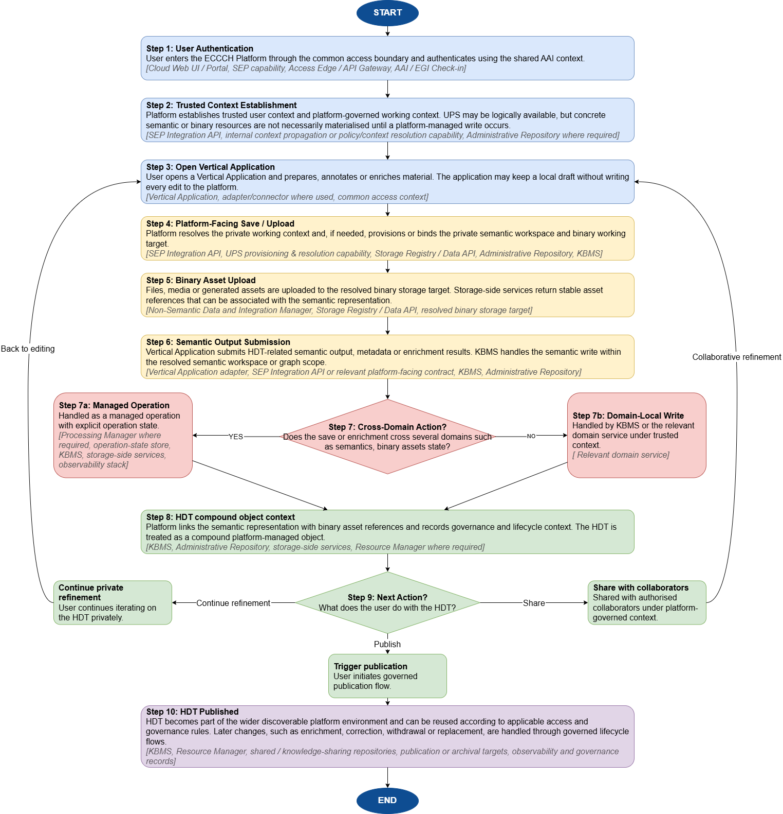
<figcaption>
Figure 1 Representative validation scenario for creating/enriching an HDT
</figcaption>
</figure>

**Semantic and binary handling stay distinct** – Binary assets are uploaded to a resolved storage target and returned as stable asset references. Semantic output is written through KBMS within the resolved semantic workspace

**Managed operation is conditional -** Only cross-domain or lifecycle flows need explicit managed operation state

**Published HDTs follow governance** – After publication, HDT becomes discoverable according to governance rules

HDT Discovery and Reuse Scenario

The following scenario illustrates one representative path for discovering and reusing an existing HDT or related resource within the Platform. It validates how users can search for resources, review metadata, provenance and access conditions, and continue into permitted reuse paths governed by the Platform.

<figure>
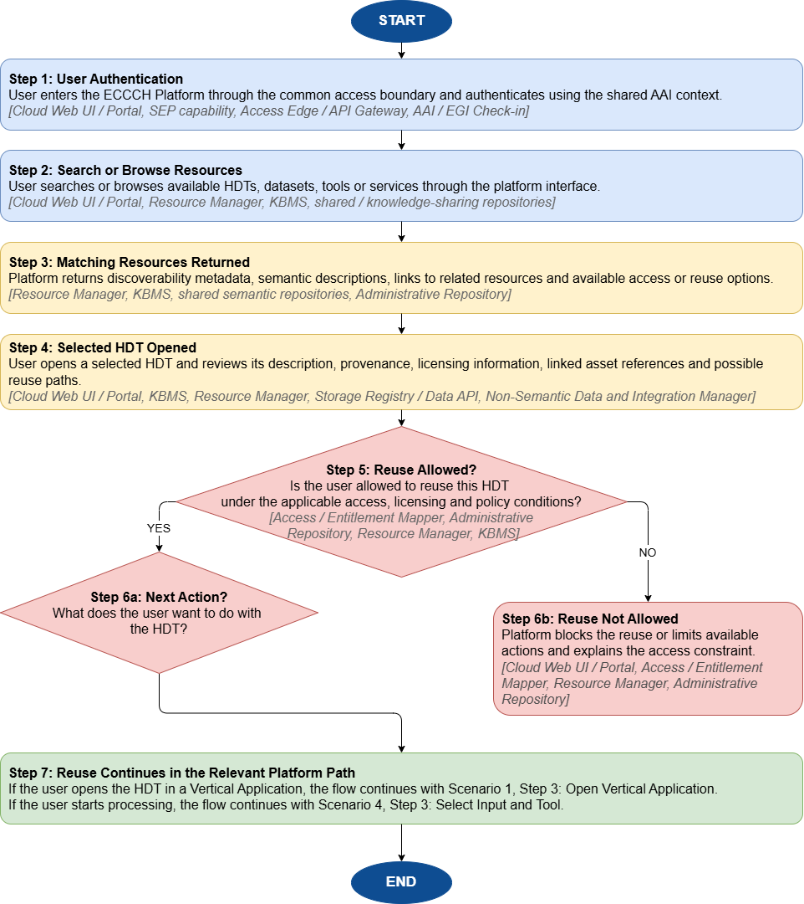
<figcaption>
Figure 2 Representative validation scenario for HDT discovery and reuse
</figcaption>
</figure>

Resource Onboarding Scenario

The following scenario illustrates one representative path for onboarding a resource into the Platform. It validates how a resource provider can register and validate a resource before it becomes discoverable and usable in the Platform.

<figure>
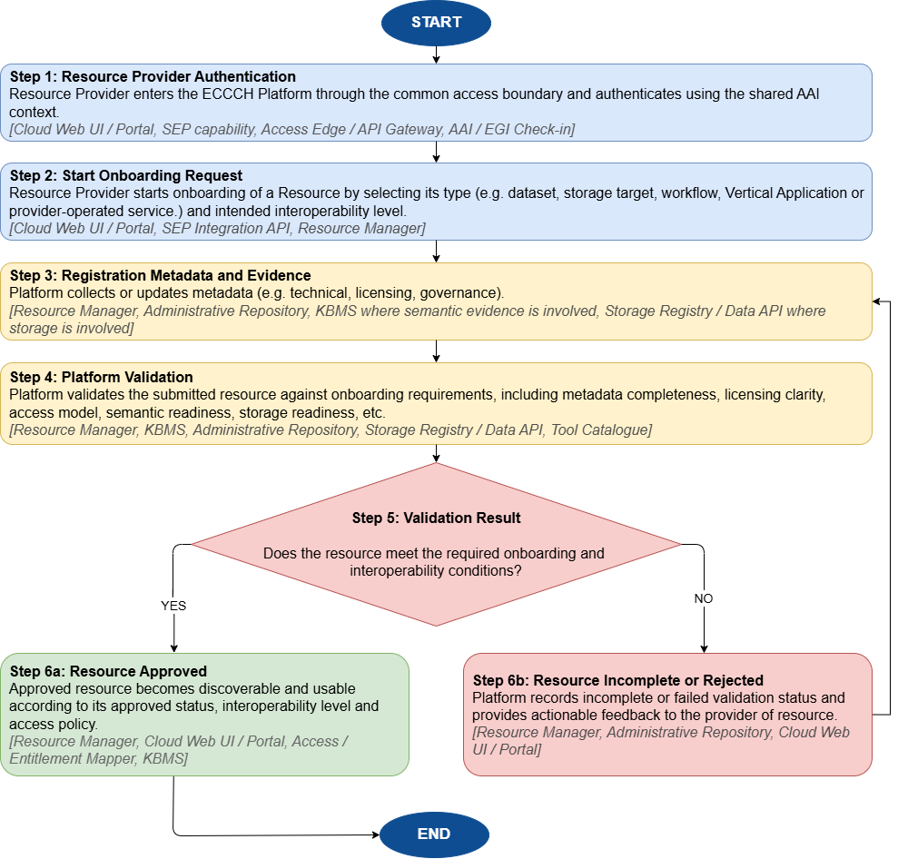
<figcaption>
Figure 3 Representative validation scenario for resource onboarding
</figcaption>
</figure>

Workflow Execution Scenario

The following scenario illustrates one representative path for turning a user-initiated processing request into a governed workflow execution. It validates how the Platform checks permissions, resolves policy, quota and storage context, coordinates execution and records outputs, status and provenance.

<figure>
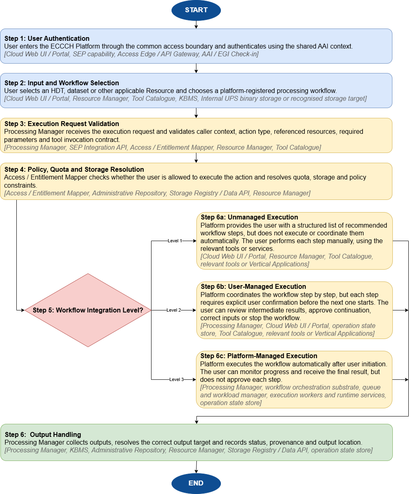
<figcaption>
Figure 4 Representative validation scenario for workflow execution
</figcaption>
</figure>

Collaborative Research Scenario

The following scenario illustrates one representative path for collaborative research within the Platform. It validates how researchers can collaborate around shared data, workspace context and outputs governed by the Platform.

<figure>
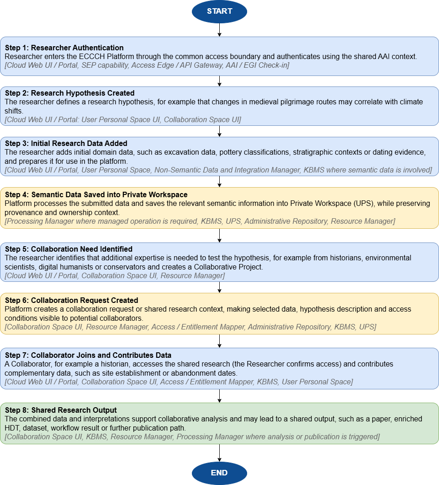
<figcaption>
Figure 5 Representative validation scenario for collaborative research
</figcaption>
</figure>

# Overview of the architecture model

## Layered model

The consolidated architecture is organised around a canonical layered model of the Cultural Heritage Cloud. The model distinguishes six main architectural areas: Access and trust layer, Platform control plane, Execution plane, Knowledge plane, Storage plane, and Applications and integration edge. These names are used consistently across the component inventory, diagrams and detailed component descriptions.

The layered model is a responsibility model, not a deployment topology or a strict runtime sequence. It identifies the shared architectural backbone of the cloud and the main classes of state, processing and integration governed through that backbone. Observability, monitoring, continuity and responsibility boundaries are treated as cross-cutting capabilities, not as a separate functional layer.

Applications and external ecosystem participants interact with the platform through the relevant access, integration and control-plane boundaries. This preserves policy-driven routing, consistent governance and the separation between authoritative sources of truth and consuming services.

<figure>
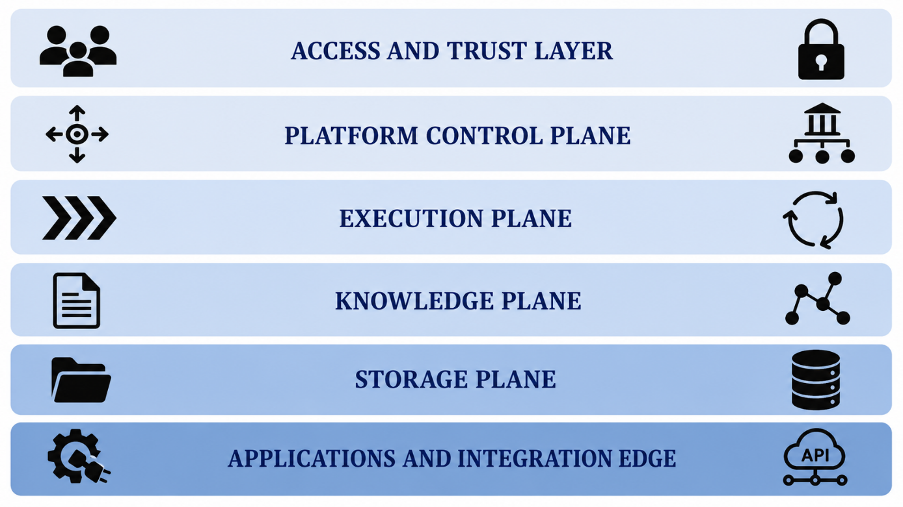
<figcaption>
Figure 6 Canonical layered model of the Cultural Heritage Cloud
</figcaption>
</figure>

## Canonical component inventory

This section defines the canonical component inventory of the Cultural Heritage Cloud. The inventory establishes the shared terminology, primary responsibility boundaries and placement of the main platform components within the layered model. Implementation details and deployment choices are addressed in later interface, engineering and deployment work. Detailed explanations of component roles, dependencies and interaction logic are provided in Section 4.

Earlier roadmap or domain-specific documents sometimes use broader or provisional labels, such as Knowledge Base Manager, ECHOES Semantic Data Management Manager, Queue Manager or KB Management Console. These labels are consolidated in Table 3 into the more explicit M24 architecture vocabulary used in this document. The aim is to clarify ownership boundaries and interface surfaces, while preserving continuity with earlier project material.

The inventory lists the main deployable or service-facing platform components and their primary architectural area. Repository and storage categories are handled separately in Section 3.3. KBMS, Storage Registry / Data API and Non-Semantic Data & Integration Manager are included as platform control-plane capabilities because they expose governed management, policy or routing functions. The underlying semantic repositories and actual storage targets are described in Section 3.3 as part of the Knowledge plane and Storage plane.

For the access-facing entry stack, the concise inventory entries are complemented by the fuller distinction between SEP, Access Edge / API Gateway and SEP Integration API in Section 4.1.

<table>
<caption>
Table 3 Canonical component inventory of the Cultural Heritage Cloud
</caption>
<colgroup>
<col style="width: 26%" />
<col style="width: 73%" />
</colgroup>
<thead>
<tr>
<th style="text-align: left;">Component or capability</th>
<th style="text-align: left;">Primary architectural role</th>
</tr>
</thead>
<tbody>
<tr>
<td colspan="2" style="text-align: left;">Architectural area - Access and trust layer</td>
</tr>
<tr>
<td style="text-align: left;">Cloud Web UI / Portal</td>
<td style="text-align: left;">Main browser-facing application of the CH Cloud, providing interactive access to personal views, catalogues, selected status information and user-initiated actions within the governed cloud context.</td>
</tr>
<tr>
<td style="text-align: left;">Single Entry Point (SEP)</td>
<td style="text-align: left;">Common access capability and common access boundary of the CH Cloud, unifying browser-facing access, protected service exposure and authorised entry into platform capabilities without implying one single deployable product. SEP should be read as a composite access capability rather than as one standalone software product. Realisation is explained further in Section 4.1.</td>
</tr>
<tr>
<td style="text-align: left;">Access Edge / API Gateway</td>
<td style="text-align: left;">Technical ingress and trust-enforcement boundary responsible for request routing, token validation, transport-level protection and route-level access control for exposed protected services.</td>
</tr>
<tr>
<td style="text-align: left;">AAI / EGI Check-in</td>
<td style="text-align: left;">Federated identity, authentication and entitlement capability providing a trusted access context for users and applications.</td>
</tr>
<tr>
<td colspan="2" style="text-align: left;">Architectural area - Platform control plane</td>
</tr>
<tr>
<td style="text-align: left;">SEP Integration API</td>
<td style="text-align: left;">Platform integration surface for portal-side and authorised application-side operations in the governed cloud context.</td>
</tr>
<tr>
<td style="text-align: left;">Processing Manager</td>
<td style="text-align: left;">Control-plane owner of managed execution requests, including job creation, operation state handling and workflow coordination where a request requires managed execution semantics.</td>
</tr>
<tr>
<td style="text-align: left;">Resource Manager</td>
<td style="text-align: left;">Registration, governance status and discoverability of datasets, APIs, tools, workflows and applications.</td>
</tr>
<tr>
<td style="text-align: left;">KBMS</td>
<td style="text-align: left;">Semantic governance capability for Knowledge Base management, including semantic operations, publication discipline, registry functions and node or graph management behaviours. It exposes governed semantic management functions, while the underlying semantic repositories are described in Section 3.3.</td>
</tr>
<tr>
<td style="text-align: left;">Non-Semantic Data &amp; Integration Manager</td>
<td style="text-align: left;">Governance and routing capability for binary and other non-semantic asset handling, including upload management, storage-target resolution and storage-side transitions.</td>
</tr>
<tr>
<td style="text-align: left;">AEM</td>
<td style="text-align: left;">Policy and context resolution capability that combines trusted identity context with platform-owned policy inputs to derive effective access and operation context for platform-facing operations.</td>
</tr>
<tr>
<td style="text-align: left;">Storage Registry / Data API</td>
<td style="text-align: left;">Authoritative registry for storage targets, policy state, usage and accounting context. Actual storage targets and storage categories are described in Section 3.3.</td>
</tr>
<tr>
<td style="text-align: left;">Administrative Repository</td>
<td style="text-align: left;">Authoritative repository for semantic ownership, workspace definitions, governance metadata and centrally governed KB registry or node metadata.</td>
</tr>
<tr>
<td colspan="2" style="text-align: left;">Architectural area - Execution plane</td>
</tr>
<tr>
<td style="text-align: left;">Workflow orchestration substrate</td>
<td style="text-align: left;">Durable coordination of long-running and multi-step execution flows, including state progression across retries and restarts.</td>
</tr>
<tr>
<td style="text-align: left;">Queue and workload manager</td>
<td style="text-align: left;">Admission control, scheduling and fairness for execution requests across shared processing resources.</td>
</tr>
<tr>
<td style="text-align: left;">Execution workers and runtime services</td>
<td style="text-align: left;">Execution of technical processing tasks, transformations and transfers under control-plane coordination.</td>
</tr>
<tr>
<td style="text-align: left;">Tool Catalogue / Toolbox</td>
<td style="text-align: left;">Specialised execution-facing catalogue of invocable tools and operations, holding runtime-oriented descriptors such as executable capability metadata, invocation contracts and supported execution patterns.</td>
</tr>
<tr>
<td style="text-align: left;">AI-enabled execution specialisation</td>
<td style="text-align: left;">Optional future execution specialisation for shared model-serving, model routing, AI-specific audit, usage accounting, safety filtering, prompt and response governance, or brokering access to external AI infrastructures.</td>
</tr>
<tr>
<td colspan="2" style="text-align: left;">Architectural area - Applications and integration edge</td>
</tr>
<tr>
<td style="text-align: left;">Vertical Applications</td>
<td style="text-align: left;">Domain-specific applications integrated over the common cloud backbone that consume platform capabilities under a governed integration contract.</td>
</tr>
<tr>
<td style="text-align: left;">Domain APIs and lightweight tools</td>
<td style="text-align: left;">Externally exposed or provider-operated services that interact with the platform through documented interfaces and declared interoperability levels.</td>
</tr>
<tr>
<td style="text-align: left;">Application-side adapters / connectors</td>
<td style="text-align: left;">Minimal application-owned integration logic used to invoke shared platform contracts, map local application structures to platform requests and handle platform responses where needed.</td>
</tr>
<tr>
<td style="text-align: left;">External providers and repositories</td>
<td style="text-align: left;">Provider-operated datasets, services or repositories that participate in the ecosystem under declared governance and interoperability conditions.</td>
</tr>
</tbody>
</table>

## Repository and storage categories

Section 3.2 lists the main deployable or service-facing components. This section complements that inventory by describing the repository and storage categories through which the Knowledge plane and Storage plane are realised. A key architectural distinction is the separation between cloud components, which expose governed capabilities or interfaces, and repository or storage categories, which describe where state is persisted and how private, shared, temporary, publication or external targets differ in architectural role. These categories should not be understood as implementation-level classes.

| **Category** | **Interpretation** | **Architectural purpose** |
|:---|----|----|
| Knowledge‑sharing repositories | Shared ECHOES semantic repositories | Provide a centrally governed semantic core for reuse, release discipline, persistent identifiers, provenance and knowledge federation |
| Private‑space semantic repositories | Private named graphs or equivalent isolated semantic scopes | Support private or collaborative semantic work within the User Personal Space prior to governed publication |
| External semantic repositories | Partner‑hosted or federated semantic endpoints | Enable advanced federated participation beyond the central semantic core under declared interoperability and governance conditions |
| Internal UPS binary storage | Platform‑managed private binary zone | Act as the default working storage for user files, media and generated assets during private work |
| Temporary / working storage | Transient execution and staging areas | Support intermediate artefacts, hand‑off data and in‑progress transformations during managed execution |
| Recognised institutional repositories | Partner‑operated repositories, DAM, CMS or archival systems | Provide publication, archival or institutional continuity targets outside the internal working storage |

Table 4 Repository and storage categories

## Sources of truth and control-plane boundaries

This section explains two related architectural ideas that are easy to confuse on first reading: sources of truth and control-plane boundaries. In practical terms, the question is simple: which platform component is authoritative for a given kind of state, and which components are only allowed to consume that state and act on it. The architecture separates these roles deliberately so that portal-facing components, Vertical Applications and execution services do not each maintain their own competing versions of user rights, semantic ownership or storage policy.

A source of truth is the authoritative place where a specific class of information is managed and from which the rest of the platform derives decisions. In the current baseline, AAI is authoritative for user identity, authentication state, VO and group entitlements and the trusted context attached to tokens. The Knowledge Base, accessed and governed through KBMS, is authoritative for semantic content represented in the KB, including HDT-related semantic representations and controlled vocabularies. KBMS also enforces semantic write discipline, graph or workspace constraints and semantic publication rules within its own domain. The Administrative Repository is authoritative for semantic ownership, assignments, graph and node metadata, workspace definitions, review and publication governance, and related registry metadata needed for managed semantic participation. The Storage Registry / Data API is authoritative for storage target definitions, protocols, policy state, usage, quota and activation status. Other services may cache or present parts of this information, but they should not redefine it locally.

At the same time, the Knowledge Base should not be treated as the primary store for platform-level operational records such as user profiles, resource registration records, storage policy, quota state, execution budgets or cloud action logs. These records remain governed by the dedicated services responsible for those domains. Where such information is relevant for semantic interpretation, the KB may reference or link to it semantically, but it should not become the primary source of truth for those platform-level records.

Control-plane boundaries describe how these authoritative sources are used by the platform. The control plane is formed by the platform components that interpret policy, resolve effective permissions, coordinate execution and route operations to the correct target. In this model, the common access boundary remains the user-facing and trust-establishing side of the platform. Within that boundary, the browser-facing portal environment, the SEP capability and the technical ingress layer do not become authoritative for semantic permissions or storage allocations. Vertical Applications likewise do not decide on their own where assets should be written or which private graph should be used. Instead, they call platform services that resolve those decisions against the authoritative repositories.

A typical interaction makes this clearer. A user authenticates through AAI and reaches the platform through the common access boundary, typically via the browser-facing portal environment. When a Vertical Application needs to save an asset or publish semantic output, the request is evaluated by platform control-plane services. The AEM combines the trusted user context from AAI with semantic governance metadata from the Administrative Repository and storage policy from the Storage Registry / Data API. The resulting resolved context, and where required a decision for the cross-domain operation, is then consumed by services such as KBMS, the Non-Semantic Data and Integration Manager or the Processing Manager. These services carry out the operation and enforce the constraints that belong to their own domain without becoming new sources of truth themselves.

This separation has three architectural benefits. First, it avoids duplicated and potentially inconsistent policy logic in multiple applications. Second, it keeps the portal and the Vertical Applications relatively thin, because they can rely on platform decisions instead of hard-coding infrastructure knowledge. Third, it improves traceability and auditability: when permissions, graph ownership or storage usage need to be explained, the architecture makes clear which repository or service is authoritative.

## Architectural consequences

The source-of-truth and control-plane model has the following architectural consequences:

- SEP remains part of the common access boundary. Neither SEP nor the other entry-side components own semantic state, storage state or execution state.

- Vertical Applications use documented domain APIs and platform contracts. They do not hard-code knowledge, storage or execution backends.

- Publication to shared knowledge repositories and publication to recognised binary repositories are separate but coordinated actions. Cross-domain publication therefore needs governed completion, failure and cleanup state, so that each sub-step is not treated as an independent success.

- Operations and observability apply across the architecture. They are baseline capabilities for centrally operated services and conformance expectations for federated participants at higher integration levels.

- UPS is resolved centrally as a logical workspace. The underlying storage implementation can evolve under platform policy.

D3.1 critical architectural challenges

D3.1 identified three architectural challenges requiring explicit treatment in D6.3 like knowledge-graph technical readiness, dual integration paths, and the decision between a centrally governed and a federated Knowledge Base architecture. The M24 baseline resolves these challenges as follows.

First, knowledge-graph technical readiness is not assumed uniformly across future participants. The architecture therefore supports both native semantic participation and transformation-led integration for heterogeneous or legacy resources, rather than presuming universal RDF/SPARQL readiness from the start. In practice, native semantic participation refers to participants or resources that can expose semantically aligned artefacts directly, for example RDF-based metadata, graph-ready resources, stable identifiers or SPARQL interfaces. Transformation-led integration refers to cases where non-semantic, legacy or app-specific resources must first be mapped or transformed by the Platform or by an intermediary ingestion or mapping process before they can participate in the shared semantic model. For instance, a semantically ready participant may expose graph-compatible resources directly, where a legacy collection may first need harvesting and mapping before it can be governed and reused through the Platform model.

Second, dual integration paths are treated as a deliberate architectural feature, not as an unresolved ambiguity. Native semantic participation and transformation-led integration remain two admissible paths, with onboarding evidence, declared interoperability readiness, and the actual semantic and technical readiness of the participant determining which path is realistic in a given case. This means that the architecture can accommodate both semantically ready contributors and those whose resources require an additional mediation step before they can be governed and reused.

Third, for the federated-versus-centralized Knowledge Base question, the M24 baseline adopts a centrally governed semantic core as the operational baseline, while external semantic federation remains a selective advanced path for participants that can meet stricter semantic, technical and governance expectations. The rationale is that shared semantic governance, monitoring, discoverability and long-term sustainability require one stable central baseline first, whereas federated semantic nodes become acceptable only where contract, monitoring, governance and durability expectations can be met.

This position is also consistent with the HDT innesto principle referenced in D3.1 and D6.1, as the platform does not require semantic models contributed by sister projects, external providers or participating communities to be discarded. Instead, it governs how heterogeneous semantic contributions are connected, validated and published through the shared semantic architecture.

## Mapping the layered model to business, data, application and infrastructure views

The layered model used throughout D6.3 can also be read through the four architectural views explicitly referenced by D3.2. *Table 5* clarifies how the current component inventory maps to business, data, application and infrastructure architecture, without introducing a second competing structural model.

| **Architecture view** | **Primary concern in D6.3** | **Representative components or categories** | **Why the view matters** |
|----|----|----|----|
| Business architecture | User entry, governance boundaries, provider participation and publication responsibilities | Common access boundary (SEP capability, portal environment, Access Edge / API Gateway), AAI, Processing Manager, responsibility boundaries defined in Section 7 | Clarifies who participates in the cloud, which actions are governed centrally and which remain provider‑operated |
| Data architecture | Semantic state, binary assets, versioning, lifecycle and authoritative sources of truth | KBMS, Administrative Repository, Storage Registry / Data API, private and shared repositories, storage categories | Explains where data lives, how it changes state over time and which architectural components remain authoritative sources of truth |
| Application architecture | Control‑plane services, integration contracts, workflow coordination and manager responsibilities | SEP Integration API, AEM, Processing Manager, Resource Manager, semantic and binary services | Defines the cloud capabilities that applications and providers integrate with in practice |
| Infrastructure architecture | Deployment assumptions, runtime separation, durable state handling and approved external targets | Container‑orchestrated runtime baseline, stateful repositories and registries, internal working storage, recognised external targets | Clarifies what the architecture assumes below the logical model without prescribing a fixed technology stack |

Table 5 Mapping of the layered model to architectural views

# Cloud components

This chapter provides the detailed component view of the architecture. Section 3.2 defines the canonical component inventory, while this chapter explains what each component owns, which interfaces and dependencies matter, what it relies on, and which operational assumptions apply.

A central principle of the CH Cloud is that policy resolution, cross-domain coordination and lifecycle control remain platform responsibilities. They are not delegated to individual applications or providers.

## Access and trust layer

The access and trust layer is formed by the Cloud Web UI / Portal, the Single Entry Point, the Access Edge / API Gateway and the shared Authentication and Authorisation Infrastructure. Together, these elements form the common access boundary of the ECCCH Cloud. This boundary gives users and applications a consistent entry point, establishes trusted access context and protects exposed service routes. Semantic governance, storage policy and execution state remain owned by the relevant platform services.

For the M24 baseline, SEP is treated as a common access capability. It combines the browser-facing entry experience, the technical ingress and trust-enforcement boundary, and the backend handoff through which authorised requests enter governed platform operations. This provides one access model without assuming one single SEP product or final implementation split.

The Cloud Web UI / Portal is the main browser-facing application of the ECCCH Platform. It provides access to personal views, catalogue views, selected status information and user-initiated actions. A portal-side backend-for-frontend may aggregate and adapt platform responses for user-facing workflows, but it remains an access-side mediation component. Identity, permissions, semantic authority, storage authority and operation state remain governed by their respective platform services.

The Access Edge / API Gateway is the technical ingress and trust-enforcement boundary of the platform. Protected requests cross this boundary under token validation, routing, transport-level protection and route-level access control.

The SEP Integration API is the backend platform handoff for portal-side and other authorised application-side calls that need to enter managed platform operations through the shared access boundary. It is distinct from the portal. For operations with a more specific documented control-plane interface, authorised callers may use that interface directly.

AAI provides identity federation and trusted access context. The current baseline assumes EGI Check-in as the shared AAI approach, with a single ECHOES VO and group or subgroup structures used to represent institutions, domains, work packages or other access partitions. Interactive services use OIDC-based sign-in. Protected service-to-service calls can rely on bearer-token propagation or client credentials, depending on the exposure model. Identity and sign-in session continuity remain rooted in AAI and in the common access boundary. Lightweight portal continuity state may exist for navigation or UX convenience, but it remains auxiliary and does not become a second source of identity truth. *Figure 7* provides the consolidated architectural interpretation of the common access boundary used in the M24 baseline.

<figure>
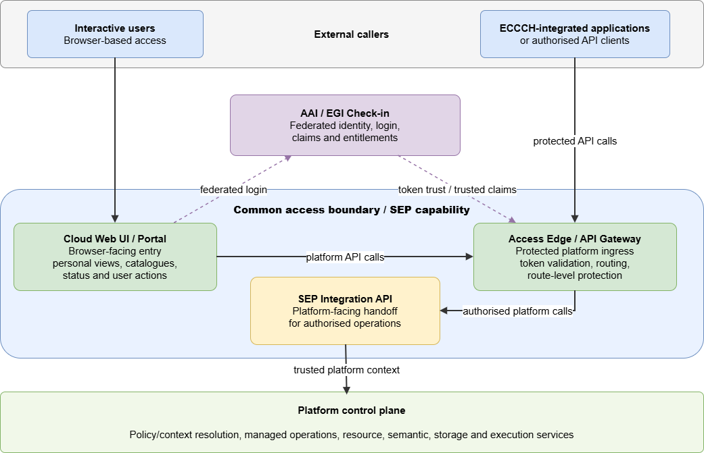
<figcaption>
Figure 7 Common access boundary and access-trust handoff
</figcaption>
</figure>

The figure shows the common access boundary as the externally visible part of the access and trust layer. It distinguishes the browser-facing path, the protected API path, shared AAI trust context and the SEP Integration API as the backend-facing handoff into platform-facing contracts.

## Platform control plane

The platform control plane is the operational heart of the CH Cloud. It does not represent one deployable product, but a group of services that coordinate governed platform operations. These services handle routing, execution coordination, semantic governance, storage policy resolution, discoverability and policy composition. Their role is to turn requests into controlled platform actions, apply the relevant architectural boundaries and policy constraints, and coordinate outcomes without duplicating the authoritative state held in the registries, repositories and domain services named elsewhere in the architecture.

Processing Manager formalises execution-oriented requests into jobs or workflow instances and hands them to orchestration and queueing services. Resource Manager makes data, APIs, workflows and applications visible and governable through registration and catalogue logic. KBMS acts as the semantic governance capability of the platform, exposing knowledge-facing APIs for CRUD, registry functions, node and graph management, semantic publication and federated query behaviour. Request-time authentication and protected API entry remain part of the shared access boundary and AAI model. KBMS consumes the resulting trusted caller context and the platform-resolved access context rather than replacing them with a KB-local access system.

Non-Semantic Data & Integration Manager is the complementary binary side of the control plane. It owns upload session creation, routing to binary storage, final URI or PID return, and storage-side state transitions required by workflows or application saves. AEM provides policy and context resolution for platform-facing operations. It combines trusted identity context with platform-owned policy inputs so that services can derive effective rights, allowed actions, operation scope, target context and quota context without reproducing complex policy logic in clients or Vertical Applications. AEM should not be read as a source of truth for identity, ownership, storage policy, semantic governance or execution budgets. It should also not be read as a mandatory central Policy Decision Point for every request. Storage Registry / Data API and Administrative Repository provide part of the durable state needed for context resolution and platform decisions, including storage policy, semantic governance metadata and, where relevant, centrally governed KB registry or node-availability metadata.

Manager responsibilities and interaction logic

This section should be read as a responsibility and interaction map rather than as step-by-step execution trace. Its purpose is to clarify which manager-like components remain authoritative in their own domain, which ones coordinate across domains, and how incoming platform requests are turned into governed operations.

These manager components should not be read as isolated products. They are coordination services that absorb heterogeneity at the edge and turn incoming requests into governed platform operations. Requests may originate from the browser-facing portal environment, from authorised application-side clients crossing the common access boundary, from Vertical Applications or from domain APIs. Before anything is written, executed or published, the control plane resolves the relevant context, policy constraints and target selection.

In practical terms, the managers divide the work into five recurring responsibilities: context resolution, registration and discoverability, semantic governance, binary routing, and execution coordination. The same request may involve more than one manager, but the role of each remains stable. AEM resolves effective access and operation context. Resource Manager governs what is visible and registrable. KBMS governs semantic state. Non-Semantic Data & Integration Manager governs binary asset transitions. Processing Manager governs jobs, tool invocations and workflow chains.

Architecturally these managers belong to the centrally governed CH Cloud core rather than to individual Vertical Applications or partner repositories. A VA may call them and provider-side services may integrate with them, but they do not replace them. Institution-level implementation can evolve over time. The functional boundary that matters in D6.3 is that policy and context resolution, routing, execution coordination and semantic or storage governance remain platform responsibilities.

AEM resolves effective access and operation context for platform-facing requests by combining trusted identity context with relevant platform and domain inputs. It may support cross-domain decisions where a request affects several domains, but it does not replace the authoritative services and repositories that own identity, semantic governance, storage policy, quota or execution state. Technical caching of claims or policy inputs may be used where appropriate, but authoritative values remain in the services and repositories that own them.

The table distinguishes authoritative ownership from cross-component coordination. Some components remain authoritative for one domain of state or decision, while others combine or sequence actions when a single platform request affects more than one domain.

<table>
<caption>
Table 6 Manager responsibilities and interaction boundaries
</caption>
<colgroup>
<col style="width: 33%" />
<col style="width: 31%" />
<col style="width: 35%" />
</colgroup>
<thead>
<tr>
<th style="text-align: left;">Primary responsibility</th>
<th style="text-align: left;">Reads from/depends on</th>
<th style="text-align: left;">Main interaction boundary</th>
</tr>
</thead>
<tbody>
<tr>
<td colspan="3" style="text-align: left;">AEM</td>
</tr>
<tr>
<td style="text-align: left;">Resolves effective access and operation context for platform-facing requests. This may include allowed action scope, target context, quota context and governance constraints where cross-domain resolution is required.</td>
<td style="text-align: left;">AAI, Administrative Repository, Resource Manager, Storage Registry / Data API, execution-budget or quota services, and domain services such as KBMS where needed.</td>
<td style="text-align: left;">Used by the Portal, SEP Integration API, Processing Manager and selected control-plane services. Domain services remain responsible for enforcing rules that belong to their own scope, using trusted context and resolved scope where relevant.</td>
</tr>
<tr>
<td colspan="3" style="text-align: left;">Resource Manager</td>
</tr>
<tr>
<td style="text-align: left;">Maintains registration, visibility, governance status and discoverability of datasets, APIs, workflows, tools and applications.</td>
<td style="text-align: left;">Provider declarations, onboarding evidence, metadata profiles, governance status, interoperability and conformance information.</td>
<td style="text-align: left;">Used by catalogue, discovery, onboarding and integration flows. Provides resource visibility and registration context to platform services and users.</td>
</tr>
<tr>
<td colspan="3" style="text-align: left;">KBMS</td>
</tr>
<tr>
<td style="text-align: left;">Governs semantic state, graph or workspace scope, semantic validation, publication discipline and knowledge-facing operations.</td>
<td style="text-align: left;">Semantic repositories, named graphs, ontology and vocabulary context, and Administrative Repository metadata where relevant.</td>
<td style="text-align: left;">Used by platform services and applications through governed semantic interfaces. Enforces semantic-domain rules within its own scope.</td>
</tr>
<tr>
<td colspan="3" style="text-align: left;">Non-Semantic Data &amp; Integration Manager</td>
</tr>
<tr>
<td style="text-align: left;">Governs binary and non-semantic data transitions, including upload sessions, storage routing, return of asset references and storage-side state changes.</td>
<td style="text-align: left;">Storage Registry / Data API, storage targets, upload metadata, asset references and relevant operation context.</td>
<td style="text-align: left;">Used by application save flows, upload flows, publication flows and managed operations that involve files or other non-semantic assets.</td>
</tr>
<tr>
<td colspan="3" style="text-align: left;">Processing Manager</td>
</tr>
<tr>
<td style="text-align: left;">Coordinates jobs, tool invocations and workflow chains. Turns execution-oriented requests into managed operations where needed.</td>
<td style="text-align: left;">Tool Catalogue / Toolbox, operation state, queue and workload status, resolved operation context where required, and execution quota or budget inputs.</td>
<td style="text-align: left;">Used by workflow, tool execution, ingestion and chained processing flows. Delegates execution to orchestration, queueing and worker services.</td>
</tr>
</tbody>
</table>

The table is intended to clarify responsibility boundaries between manager-like components. It shows where state ownership, coordination responsibility and downstream use are located during platform operations. The managers are peers inside one control plane. They exchange trusted context, resolve operation context where needed and route operations to the relevant downstream capability, but they do not all persist the same state locally. This reduces duplication of access-context handling, quota checks and operation status tracking across multiple applications.

Registry and discoverability scope do not extend to KB-internal nodes, graph structures or workspace assignments. These remain within the semantic-governance scope of KBMS and the Administrative Repository.

For later low-level design, the most important boundary is the difference between durable state ownership and cross-component coordination. Processing Manager owns managed operation state. Resource Manager owns registration and discoverability state. KBMS owns semantic state and graph or workspace enforcement. Non-Semantic Data & Integration Manager owns binary upload and transfer state. AEM resolves access and operation context where platform-facing requests require policy inputs from more than one domain, but it does not replace the services and repositories that own those policy inputs.

For quick reference, *Table 7* summarises the most critical platform components in one compact view. It consolidates the most operationally relevant ownership boundaries.

<table>
<caption>
Table 7 Ownership boundaries of core platform components
</caption>
<colgroup>
<col style="width: 37%" />
<col style="width: 28%" />
<col style="width: 34%" />
</colgroup>
<thead>
<tr>
<th style="text-align: left;">Owns / coordinates</th>
<th style="text-align: left;">Does not own</th>
<th style="text-align: left;">Main inputs</th>
</tr>
</thead>
<tbody>
<tr>
<td colspan="3" style="text-align: left;">SEP Integration API</td>
</tr>
<tr>
<td style="text-align: left;">Platform-facing entry contracts for portal-side and authorised application-side actions, request normalisation and operation submission.</td>
<td style="text-align: left;">Long-running workflow state, semantic authority, storage policy authority or execution semantics.</td>
<td style="text-align: left;">Verified caller context from the access boundary and resolved context from control-plane services.</td>
</tr>
<tr>
<td colspan="3" style="text-align: left;">AEM</td>
</tr>
<tr>
<td style="text-align: left;">Resolved access and operation context for platform-facing requests, especially where context depends on identity, semantic governance, storage, quota or execution constraints.</td>
<td style="text-align: left;">Identity truth, semantic ownership, storage policy, execution budgets or domain-specific enforcement.</td>
<td style="text-align: left;">AAI, Administrative Repository, Resource Manager, Storage Registry / Data API, execution-budget or quota services, and domain services where needed.</td>
</tr>
<tr>
<td colspan="3" style="text-align: left;">Processing Manager</td>
</tr>
<tr>
<td style="text-align: left;">Managed operation lifecycle, including operation identifiers, state transitions and governed completion outcomes.</td>
<td style="text-align: left;">Direct execution of technical tasks, semantic storage of HDT content or authoritative storage policy.</td>
<td style="text-align: left;">Resolved operation context, execution policies, resource metadata and tool metadata.</td>
</tr>
<tr>
<td colspan="3" style="text-align: left;">Resource Manager</td>
</tr>
<tr>
<td style="text-align: left;">Registration, discoverability and platform-facing lifecycle status of datasets, APIs, workflows, tools and published resources.</td>
<td style="text-align: left;">Semantic storage, binary upload routing or execution orchestration.</td>
<td style="text-align: left;">Provider-supplied registration metadata, onboarding evidence and platform governance state.</td>
</tr>
<tr>
<td colspan="3" style="text-align: left;">KBMS</td>
</tr>
<tr>
<td style="text-align: left;">Semantic CRUD operations, graph or workspace enforcement and semantic publication discipline.</td>
<td style="text-align: left;">Binary routing, storage quota authority or end-to-end execution state.</td>
<td style="text-align: left;">Semantic repositories, Administrative Repository metadata and resolved semantic context.</td>
</tr>
<tr>
<td colspan="3" style="text-align: left;">Non-Semantic Data &amp; Integration Manager</td>
</tr>
<tr>
<td style="text-align: left;">Upload initiation, binary routing and target-aware storage-side transitions.</td>
<td style="text-align: left;">Semantic authority, publication policy as a source of truth or broad workflow orchestration.</td>
<td style="text-align: left;">Storage Registry / Data API, storage targets and resolved operation context.</td>
</tr>
</tbody>
</table>

## Execution plane

The Execution plane supports asynchronous processing, long-running workflows and the reuse of executable tools. It takes requests prepared by the control plane and turns them into governed running work. Durable execution state belongs in the execution substrate, not in the portal or in ad hoc application memory.

The workflow orchestration substrate maintains workflow state for long-running and chained operations, persists progression across retries or restarts, and exposes machine-readable status transitions. The queue and workload manager provides dispatch discipline through priorities, fairness, admission control, scheduling and retry handling within configured policy bounds. User policy, storage eligibility and semantic authority are resolved before work reaches the execution substrate.

Execution workers and related runtime endpoints perform the technical work: tool runs, transfers, transformations, enrichment steps and other workflow tasks. They may be centrally hosted or provider-operated depending on the integration model, but they must expose a common status and observability model so that managed execution remains diagnosable across the platform.

The Tool Catalogue / Toolbox complements the Resource Manager. The Resource Manager governs platform-level registration and discoverability of datasets, APIs, tools, workflows and applications. The Catalogue focuses on execution-facing descriptors for invocable tools and operations, including invocation contracts, supported execution patterns, runtime requirements, result models and observability expectations. A tool may be visible at platform level through the Resource Manager while its runtime behaviour is described in the Catalogue for use by the Processing Manager and execution services.

### AI-enabled capabilities in the ECCCH Platform

AI-enabled capabilities should be treated in the ECCCH Platform architecture as a governed extension of the existing execution, integration and knowledge-management model. AI is not introduced as a separate architectural layer by default, but as a capability that can be integrated through the same platform mechanisms that already support tools, workflows, Vertical Applications and managed execution.

In practice, AI may appear in the ECCCH Platform in four main ways:

1.  **New AI-native services and Vertical Applications**

New AI applications may be developed specifically for cultural heritage workflows. These may support tasks such as automatic metadata extraction, semantic enrichment, image and video analysis, transcription, translation, classification, entity recognition, similarity search, recommendation, reconstruction support or assisted creation of Heritage Digital Twins.

2.  **AI overlays for existing tools**

> AI may also be added as an extension to services that already exist. In this model, an existing application does not need to be rebuilt as a fully AI-based system. Instead, selected functions may be enhanced with AI, for example by adding assisted annotation, automated description, object recognition, translation, summarisation or quality checks.

3.  **Platform-level AI assistance for users**

> The platform may also provide an AI assistant, for example a chatbot embedded in the Cloud Web UI or exposed through the Single Entry Point. Such an assistant could help users understand available platform functions, navigate documentation, discover tools and datasets, choose appropriate workflows, or understand how to use ECCCH services. However, it should not become a new source of truth or make governance decisions independently. It should operate over platform-managed documentation, service descriptions, Resource Manager metadata and access-aware user context.

4.  **Use of external AI infrastructure and computing capacity**

> Some AI workflows may require significant computing resources, specialised AI infrastructure or access to model development environments. In such cases, the ECCCH Platform should remain open to future integration with European and national AI infrastructure initiatives, including the EuroHPC AI Factories ecosystem. For example, the PIAST-AI Factory is being developed as a Polish AI innovation hub combining HPC, cloud-based AI services and advanced research infrastructure. PIAST-AI should not be described as a component of the ECCCH Platform itself, but as an adjacent infrastructure and competence environment that may support future AI-enabled cultural heritage workflows.

All these AI-enabled capabilities should follow the same architectural discipline as other platform functions. Where AI tools are offered as platform Resources, they should be registered and discoverable through the Resource Manager. Where they are executable tools, they should be described in the Tool Catalogue and coordinated through the Processing Manager if execution is long-running, resource-intensive or workflow-based. The queue and workload manager can apply scheduling, quota and fairness rules, while execution workers or external runtime services perform the actual processing.

This is especially important because AI outputs are often derived, probabilistic or interpretative. If an AI tool generates annotations, classifications, descriptions, links, translations, transcriptions or other enrichments, the platform should distinguish these outputs from original source data and from human-validated curatorial decisions. Relevant provenance should therefore be captured, including the input object or dataset version, the tool or model used, the execution context, the date of processing and, where available, quality indicators or later human validation.

At this stage, this future AI ecosystem is still evolving. Many Vertical Applications and services developed within ECHOES and its sister projects are still being designed, prototyped or refined. At the same time, the European AI infrastructure landscape is also changing rapidly, with several AI Factories and related national or European initiatives still under development. This means that the ECCCH Platform should not hard-code one fixed AI integration model too early. Instead, the architecture should provide a stable and governed foundation that can accommodate AI-enabled tools, services and infrastructures once their functional scope, technical interfaces, governance requirements and operational models become clearer.

## Knowledge plane

The knowledge plane is centred on the Core Knowledge Base, but it is expressed through repository classes rather than one undifferentiated KG block. Knowledge-sharing repositories form the shared semantic core. Private-space semantic repositories hold governed private or collaborative work before release. KBMS is the semantic governance capability across these repositories: it governs semantic writes, reads and publication, but it is not the authority for storage routing, quota policy or binary continuity.

The KB Management Console described in D6.1 should therefore be read here as a specialised administrative UI surface within, or alongside, the broader portal environment. It is not a separate platform control plane, but a role-specific operational face of KBMS and related governance services.

Private-space semantic repositories form the semantic part of the User Personal Space. They are realised as named graphs or equivalent isolated graph segments, preferably hosted on auxiliary triplestores to protect shared performance and to keep collaborative workspaces separable from released semantic content. They are suitable for preparing new semantic data or working on a copy of shared data before publication.

External semantic repositories remain a valid advanced path for federation. They are not the baseline obligation for every provider, but they are architecturally supported where interoperability, monitoring, ownership, identifier discipline and semantic governance are mature enough. In all cases, KBMS remains the central mediator of shared semantic governance, even when some semantic assets are stored outside the central cloud core.

## Storage plane

The Storage plane covers storage-side categories and capabilities used for private work, temporary execution, publication, archival continuity and recognised external targets. User Personal Space is described here because it is the platform’s main private working-space capability. It links a private semantic workspace with a private binary zone, but it is not a separate canonical architectural area.

UPS is a logical capability composed of two linked sub-capabilities: a private semantic space and a private binary zone. One user should have one canonical platform-level UPS, but the internal mapping of that space may evolve over time and may use more than one backend. This keeps the architecture stable for applications while still allowing infrastructure migration, policy changes or approved alternative working targets for selected institutions.

The binary part of UPS does not require a bucket-per-user implementation as an architectural principle. What matters is that the platform can identify the user’s logical binary zone, apply access rules, enforce quota and maintain stable references. The semantic part is governed through KBMS and the Administrative Repository. The binary part is governed through the Non-Semantic Data & Integration Manager and the Storage Registry / Data API.

<figure>
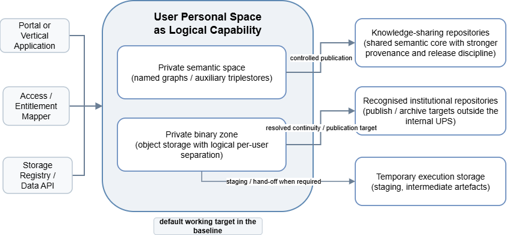
<figcaption>
Figure 8 User Personal Space and storage / publication model.
</figcaption>
</figure>

## Applications and integration edge

Vertical Applications are domain-facing applications integrated with the common cloud backbone. From a user perspective, they may be among the most visible parts of the Cloud. Architecturally, they remain partner-owned applications that participate in the shared platform environment through governed integration contracts.

At minimum, Vertical Applications align with shared identity and access, use documented interfaces and participate in the common discovery and monitoring model. Integration depth may vary. A shared minimum integration baseline applies to all Vertical Applications, while richer storage, execution and knowledge-facing patterns depend on application function, maturity and the targeted interoperability level. Vertical Applications may create and save governed HDT-related outputs into private platform-managed contexts, while publication remains a portal-side or explicitly exposed platform-API action.

Applications do not select physical storage or repository targets directly. A Vertical Application does not decide whether a save goes to internal UPS storage, an institutional repository or another approved target. It calls documented platform-facing APIs, such as save asset, initialise upload, publish or save semantic output, and the platform resolves the target from context and policy.

### Vertical Applications as black-box domain applications

Vertical Applications should be treated architecturally as domain-specific, partner-owned black-box applications rather than as decomposed internal modules of the platform. Their internal pipelines, algorithms, intermediate toolchains and technology choices remain application-specific. From the perspective of the ECCCH platform, the relevant concern is the governed integration boundary through which the application authenticates the user, obtains an effective working context, consumes selected cloud capabilities, and returns HDT-related outputs, assets, metadata or semantic structures.

This distinction is important because it prevents the platform architecture from absorbing partner-specific processing logic into the cloud core. A Vertical Application may internally perform OCR, translation, reconstruction, annotation, enrichment, entity extraction or domain mapping. None of those internal stages need to be modelled as platform components unless the consortium explicitly decides to expose them as separate shared tools. What the platform must model is the contract at the boundary: what is submitted, which semantic scope is editable, where results may be saved, and how outcomes become platform-governed objects. This boundary also covers the user’s platform context: which ECHOES objects the user can see, which actions are available, and which private, collaborative or released HDT views may be opened through the application. The Vertical Application may decide how to present these views in its own user experience, but it should not become the source of truth for platform-level visibility or permissions.

### Integration model

The recommended baseline is a shared platform-side integration contract with only the necessary local integration on the application side. The platform remains responsible for governed processing at the integration boundary: user-context resolution, access-right evaluation, storage-target resolution, HDT-related create/save behaviour, managed operation handling, status tracking and, where exposed, governed publication. Vertical Applications invoke documented platform-facing contracts and rely on the platform control plane to resolve these concerns.

Application-side integration is still required. A Vertical Application must be able to call platform services, submit the relevant payloads, receive platform responses, associate operation identifiers with local user-facing objects or sessions, and reflect platform status in its interface where needed. The internal organisation of this logic remains application-specific. It may be implemented as a request layer, lightweight handlers or a local integration module. Orchestration, PID allocation, semantic-scope resolution, target resolution, rollback semantics, publication policy and managed completion semantics remain platform responsibilities.

A Vertical Application may maintain its own local working draft, edit session or temporary interaction state before a governed save is requested. That local state remains application-local and is not authoritative platform state. Once an ECHOES-facing operation is initiated, the request crosses the governed platform boundary and is resolved by shared platform services.

This model preserves the black-box character of partner-owned applications while keeping governance-critical responsibilities on the platform side. Different technologies, local data models and domain-specific user experiences can remain in place. Policy resolution, target selection, operation-state semantics and publication discipline remain inside shared platform capabilities.

The M24 baseline uses the common ECCCH Platform access boundary as the default trust boundary for integrated Vertical Applications. Alternative direct entry paths may exist only as controlled exceptions under separate trust and governance arrangements. In all cases, ECCCH Platform-facing operations must still reach the shared platform boundary so that authenticated context, effective rights, permitted semantic scope, allowed storage or publication targets and managed operation semantics are resolved consistently.

In summary, a Vertical Application is responsible for local invocation and response handling. It is not a technical transit backend for the browser-facing portal, it does not hard-code physical storage or repository choices, and it does not maintain a competing source of truth for permissions, target resolution, publication policy or managed completion.

<figure>
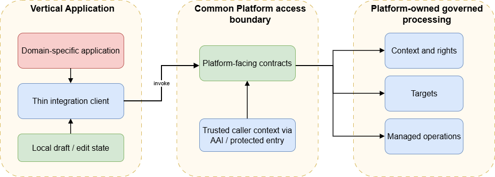
<figcaption>
Figure 9 Vertical Application integration boundary and platform-governed processing
</figcaption>
</figure>

### Canonical platform interfaces and architectural contracts

Interoperability in the ECCCH Platform depends on stable platform-facing contracts. These contracts define how the Portal, Vertical Applications, provider-operated services and authorised platform clients interact with shared cloud capabilities. They are architectural contracts, not full API specifications: they identify the minimum surface, the main platform capability involved, the expected interaction pattern and the behaviour or evidence needed for conformance-oriented implementation.

At architecture level, the contracts fall into two operational families. Identity and context resolution, resource registration updates and selected read-oriented calls can remain synchronous when they do not create a multi-step governed state transition. Upload initialisation, HDT save, publication and job submission are treated as managed-operation contracts when their outcome depends on several technical domains or on governed completion conditions.

This distinction also clarifies caller position. Context resolution, save initiation and job submission may be relevant for both portal-facing and VA-facing integration surfaces. Governed publication remains primarily portal-facing unless an explicitly exposed platform API adopts the same governance path. Where a contract creates a managed operation, request acceptance is not treated as final success. The architecture requires a completion state that is observable through status retrieval, audit evidence or an equivalent governed completion signal.

The contract view is presented in two complementary tables. Table 8 lists the main platform-facing contract families and their purpose. Table 9 summarises the expected interaction pattern and the minimum evidence associated with each family.

| Contract family | Main platform capability | Purpose |
|:---|----|----|
| Identity and context resolution | SEP Integration API with internal context propagation and policy/context resolution where required | Establish trusted caller context, allowed actions, semantic scopes and permitted targets. |
| Upload initiation | SEP Integration API with storage-side services | Create a governed upload session and resolve the permitted working target. |
| Upload completion and asset finalisation | Storage-side services, with Processing Manager where managed completion is required | Finalise a delegated upload and materialise stable asset references under platform governance. |
| Semantic save | KBMS | Persist semantic content within the resolved workspace or graph scope under semantic governance. |
| Publication | SEP Integration API with Processing Manager and relevant domain services where required | Promote or release governed HDT-related outputs into shared semantic or recognised publication targets. |
| Job submission or workflow invocation | Processing Manager | Create and coordinate a governed execution instance. |
| Job or operation status | Processing Manager with Operation Registry or operation-state store | Expose the current state of a managed platform operation. |
| Resource registration or update | Resource Manager | Register or update discoverable metadata for datasets, APIs, tools, workflows or applications. |

Table 8 Platform-facing contract catalogue

| Contract family | Interaction pattern | Minimum evidence or behaviour |
|:---|----|----|
| Identity and context resolution | Synchronous request-response | Authenticated access, stable response structure, clear authorisation failure behaviour and traceable decision context where cross-domain resolution is required. |
| Upload initiation | Synchronous initiation returning delegated upload information | Explicit target resolution, quota or policy check where applicable, and clear error behaviour for invalid or disallowed targets. |
| Upload completion and asset finalisation | Synchronous or managed-operation continuation depending on scope | Idempotent completion semantics, stable asset references, operation correlation and explicit failure state if finalisation cannot be completed. |
| Semantic save | Synchronous or managed asynchronous depending on scope | Validation rules, ownership or scope enforcement, semantic target resolution and stable error classification. |
| Publication | Managed operation where publication crosses semantic, storage or governance boundaries | Operation identifier, observable status, policy enforcement and auditable completion state. |
| Job submission or workflow invocation | Asynchronous managed operation | Durable job state, status exposure, retry behaviour and diagnosable failure semantics. |
| Job or operation status | Synchronous status retrieval or polling interface | Stable state vocabulary, terminal and non-terminal states, consistent access control behaviour and correlation with the original operation. |
| Resource registration or update | Usually synchronous for simple updates, or asynchronous/admin-mediated where validation or review is required | Validation of required metadata, governance status assignment and evidence of successful registration or rejection. |

Table 9 Interaction patterns and minimum evidence for platform-facing contracts

## HDT as a platform-managed object

The Heritage Digital Twin is treated in this deliverable as a compound platform-managed object, not as a single payload. At minimum, an HDT combines a semantic representation managed through KBMS, references to binary or other non-semantic assets managed through the storage side of the platform, governance metadata such as ownership and workspace or publication scope, and operational state associated with long-running creation, update or publication flows. This is consistent with the wider ECHOES concept and clarifies how WP6 cloud components realise it technically.

On the semantic side, HDT representations are expected to follow the HDTO semantic framework referenced in D6.1 and developed further in WP7.1. This section explains how HDTO-based semantic representations are handled together with asset references, governance metadata and operation state within the cloud component model.

This has three practical consequences.

First, an HDT is more than one named graph. Its governable lifecycle also depends on binary asset references, policy context and publication state.

Second, save and publish actions are coordinated platform operations over several coupled parts of the object. For example, publishing an HDT representation may require semantic validation, creation or replacement of a named graph, provenance recording, finalisation of asset references, update of governance metadata and exposure through discovery services.

Third, the cloud preserves the distinction between VA-local preparation, platform working-state HDTs and governed released HDTs in shared or recognised publication targets. Private creation, collaborative refinement, governed publication, archival transfer and eventual retirement are different lifecycle situations of the same architectural object class, even when implemented by different technical components.

At runtime, KBMS owns the semantic representation and semantic write discipline, the storage side owns binary persistence and publication routing, the Administrative Repository stores ownership and graph or workspace assignments, and the Processing Manager owns the stateful progression of composite operations such as create, promote or publish. This keeps semantic, storage and workflow responsibilities separate while allowing HDT handling to operate as one coordinated cloud capability.

Identifier assignment follows the same governance split. Where the platform assigns an identifier to an HDT, or to a governed release of its semantic representation, the assignment is part of the managed semantic and publication path. The exact PID technology remains implementation-dependent, but identity-bearing assignment belongs inside the managed save or publication path and is bound to the semantic authority that governs the resulting object.

For quick reference, Table 10 summarises the minimum architectural interpretation of an HDT.

| **Aspect** | **Minimum architectural meaning** |
|:---|----|
| Semantic representation | The governed semantic representation of the object, managed through KBMS across private or shared semantic targets |
| Binary /non-semantic assets | One or more binary assets or binary references managed through the storage side of the platform and linked to the semantic representation |
| Governance metadata | Ownership, editable scope, workspace or graph assignment, publication eligibility and other control metadata required for governed operation |
| Operational state | The managed‑operation state associated with save, publication, deletion, recovery, archival retention or other lifecycle transitions |
| Persistent identity | A stable HDT‑level identifier, or published semantic identifier where required, assigned under KBMS‑led semantic governance control |
| Publication state | The distinction between working or private forms and published, archived or retired forms of the same HDT lineage |

Table 10 Minimum architectural interpretation of an HDT

A working-state HDT is not yet a release-grade object. It remains a governed working form that may change through private save operations and managed completion steps rather than through publication-grade release semantics. A published HDT should be treated as an immutable governed release or release-grade snapshot. Supersession, archival retention and later retirement still belong to the same object lineage, but they are not equivalent to continued editing of the working-state form.

# Workflow and interaction patterns

## Access and session continuation

The basic user story begins with a user entering the common ECHOES access boundary, typically through the browser-facing portal environment, and authenticating through the shared AAI. Once authenticated, the user should experience continuity when switching between the central portal and a Vertical Application. This continuity depends on shared SSO, trusted token propagation and a common understanding of user entitlements and protected routes.

A second path remains possible in which a user reaches a Vertical Application before crossing into shared ECHOES services, but this should be read in line with the access-boundary distinction defined in Section 4.1.

For protected services, the same shared trust context must be available to portal-facing functions, workflow execution paths and integrated applications. Restricted L2+ services therefore depend on correct token validation, issuer and audience checks and consistent authorisation enforcement, not merely on the presence of login.

## UPS provisioning on first Platform-managed write

The preferred provisioning model is not the unconditional creation of the full UPS on first login, but provisioning or resolution when the user or application first performs a platform-managed write. In this context, a platform-managed write means an action that requires platform-managed persistence or governance, such as saving HDT-related material, uploading assets, creating or resolving a private semantic workspace, or starting a managed operation that requires platform-owned working context.

This distinction is important because the UPS is a logical platform capability, not a single storage location. From the user’s perspective, a personal working context may be visible through the Portal or a Vertical Application before any data is written. From the platform’s perspective, however, concrete resources such as a private semantic graph, a binary working zone, quota context or storage-policy binding do not need to be created or selected until an operation actually requires them.

For workflows that begin in a Vertical Application, local editing can remain application-specific until the user or application performs an ECHOES-facing write. At that point, the platform may resolve the UPS as the initial private working target, allowing HDT-related content to be refined in a private context before later decisions are made about sharing, publication or promotion into governed platform workflows. Under the M24 baseline, integrated Vertical Applications rely on the common ECHOES access boundary as the default and preferred trust boundary, as defined in Section 4.1. Alternative direct entry paths remain controlled exceptions under separate trust and governance arrangements and do not remove the need for the common platform boundary when an application performs an ECHOES-facing action such as create, save, query or job submission.

## Vertical Application save HDT pattern 

Before a governed save is requested, a Vertical Application may keep its own application-level working draft or edit bundle so that local user interaction does not force every field-level change through the platform. The platform is therefore not intended to act as a field-by-field live editing backend for each application. The governed boundary is crossed when the application submits an explicit create, save or patch request for an HDT-related object.

*Figure 10* summarises the VA create/save pattern and shows how local application work, platform-facing save requests, binary upload, semantic write and managed completion relate to one another.

<figure>
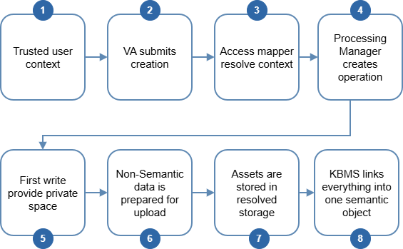
<figcaption>
Figure 10 Canonical Vertical Application create / save HDT flow
</figcaption>
</figure>

The create/save pattern distinguishes control flow from data flow. Control flow remains with the platform: identity and trusted caller context are established, effective rights and allowed targets are resolved, a managed operation is created, first-write provisioning can be triggered where needed, upload sessions are prepared and governed status is returned. The binary payload follows the shortest safe route to the resolved storage backend, without being proxied through unnecessary intermediaries.

In practice, the application submits the relevant request through the appropriate platform-facing contract, together with the user context available at the point where the governed action is initiated. The AEM resolves the effective access and operation context, including allowed targets and quota state where required, by combining AAI-derived context with semantic governance metadata from the Administrative Repository and storage policy from the Storage Registry / Data API. The Processing Manager creates a managed operation with an operation identifier and, on the first ECHOES-relevant write, ensures that the required private semantic and binary zones exist. The Non-Semantic Data & Integration Manager then creates an upload session and returns the upload URL or target key. The binary asset is uploaded directly to the resolved storage backend. Once that delegated upload has been completed and a stable binary reference is available, the semantic representation is submitted to KBMS so that the semantic record and binary location are linked in a governed way and the managed operation can reach explicit completion.

This pattern remains valid whether the user reaches ECHOES through the common access boundary first or encounters a Vertical Application before crossing into shared ECHOES services. Even in such controlled exception cases, ECHOES-facing actions such as create, save, query or job submission must still cross the common platform boundary so that access resolution, target selection, first-write provisioning and semantic-scope enforcement remain consistent with the rest of the cloud.

The local VA integration layer is limited to invoking the platform-facing contract, submitting the relevant payload, receiving the platform response and tracking any returned operation identifier. Orchestration, identifier assignment, storage routing and publication governance remain platform responsibilities.

Four main operational paths follow from this pattern. Create or save HDT in a private context is the baseline path. The caller obtains resolved context, triggers first-write provisioning where needed, receives binary upload instructions and completes a managed save that binds binary references and semantic state under one governed operation.

Publish HDT is a separate governed path starting from an existing object. It re-evaluates publication eligibility and target policy, coordinates binary and semantic publication steps, and exposes a published outcome only after the managed operation reaches governed completion.

Delete, recover and retire form a lifecycle path under policy control. Deletion is not treated as immediate physical erasure once an object has become a public or governed reference point. Recovery is limited to the configured retention window, and final retirement is an explicit terminal governance action.

Run tool on HDT is the execution path. The object acts as governed input to a processing flow. The Processing Manager owns the operation semantics, while workers or tools remain replaceable execution endpoints reporting through the common status and observability model.

## Processing Manager, tool execution, chaining and workflow orchestration

The execution model of the CH Cloud is easiest to understand if the Processing Manager is treated as the platform function that owns managed execution semantics. It is not the component that performs heavy processing itself, nor should it be reduced to a narrow job launcher for one specific class of tool runs. Instead, it receives execution-oriented requests, validates and normalises them, creates durable execution state where needed, determines the appropriate execution pattern, and coordinates hand-off to queueing, orchestration and runtime services.

*Figure 11* provides a visual overview of this high-level execution pattern.

<figure>
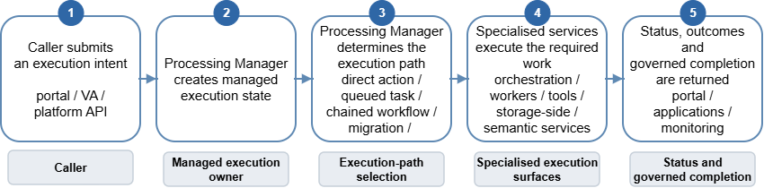
<figcaption>
Figure 11 Processing Manager governed execution pattern
</figcaption>
</figure>

Architecturally, the Processing Manager should be understood as a control-plane capability rather than as one fixed deployable unit. It may be realised as one service or as a small set of cooperating services behind a stable platform-facing contract. The key point is the responsibility boundary: one platform function must own execution intake, execution-state coordination, governed completion, and the translation of user or application intent into a managed execution flow.

Not every action in the Cloud has the same execution model. Some actions are short and almost synchronous. Others require queued execution, durable state, retries, polling, multi-step coordination, governed write-back to semantic or storage services, or orchestration across several runtime steps. Tool execution is one important example, but it is not the only one. The same general pattern also applies to migrations, chained transformations, governed save or publication flows, and other composite platform operations that must remain diagnosable and policy-consistent over time.

The Processing Manager should therefore be read as a reusable platform capability for turning heterogeneous execution intents into governed operational paths. Its concrete internal decomposition may evolve as the platform matures, but the architectural principle remains the same: callers should not own long-running execution coordination themselves, and runtime services should not be burdened with platform-level responsibility for job semantics, governed completion or cross-service execution state.

### What the Processing Manager is in practical terms

In practical terms, the Processing Manager accepts an execution intent and turns it into a managed platform action. It sits between the caller and the execution substrate. The caller may be the portal, a Vertical Application, or another platform-side API, but the manager remains responsible for deciding how the request should be formalised, tracked and completed.

It does not replace KBMS, storage services or runtime engines. Those components still perform their own specialised work. The manager keeps the overall action coherent, whether that means forwarding a simple request or coordinating several governed steps.

- **Request intake and validation:** checks the caller context, action type, required parameters, referenced resource identifiers and whether the request is well-formed enough to enter managed execution.

- **Execution planning:** determines whether the action should be handled as a direct call, a queued task, a chained workflow, a migration flow, or a governed save / publish operation.

- **Job registry and state tracking:** creates a durable execution record with a job identifier, correlation metadata, ownership context and status progression visible to the portal, applications and monitoring.

- **Dispatch and runtime hand-off:** submits the work to queueing, orchestration or runtime adapters without forcing the caller to keep an interactive session open.

- **Completion and failure handling:** collects outcomes, triggers governed commit steps, records audit information and returns a diagnosable completion or failure state.

### Interaction logic and dependency boundaries

The manager only works because it relies on other components that remain authoritative in their own domains. It should therefore be described through its interaction surfaces rather than as an isolated black box. *Figure 12* summarises their interaction surfaces.

<figure>
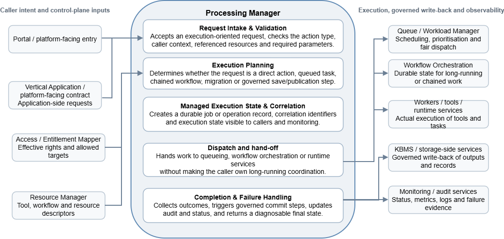
<figcaption>
Figure 12 Processing Manager logical responsibilities and interaction surfaces
</figcaption>
</figure>

- **AEM:** provides resolved access and operation context where required, including caller context, permitted operation scope, target context and relevant quota or policy constraints.

- **Resource Manager and tool metadata:** provide the descriptors needed to resolve what is being invoked, how it should be run and which integration depth or runtime pattern applies. Resource Manager provides platform-facing registration and discoverability metadata, whereas the Tool Catalogue provides execution-facing descriptors and invocation contracts.

- **Storage Registry / Data API and Non-Semantic Data & Integration Manager:** provide the storage-side truth needed for staging inputs, resolving default or allowed targets, preparing uploads or transfers and committing binary outputs.

- **KBMS and Administrative Repository:** provide the semantic-side truth needed when the action touches private graphs, public graph publication, HDT-related structures, provenance or identifier-bearing semantic records.

- **Queueing, orchestration and runtime services:** own actual scheduling, durable workflow state and execution of tools or transfer tasks. Processing Manager instructs them but does not become the runtime itself.

- **Monitoring and audit services:** receive job state, execution evidence, logs and failure signals so that long-running work remains operationally visible and supportable.

### How the Processing Manager reacts in concrete scenarios

The function of the Processing Manager is best illustrated when it is put to the test through representative platform operations. The following list does not purport to lay out strict algorithms for their implementation, but serves to illustrate the type of response that is expected by the architectural design. The following diagram illustrates three representative responses before their detailed description.

<figure>
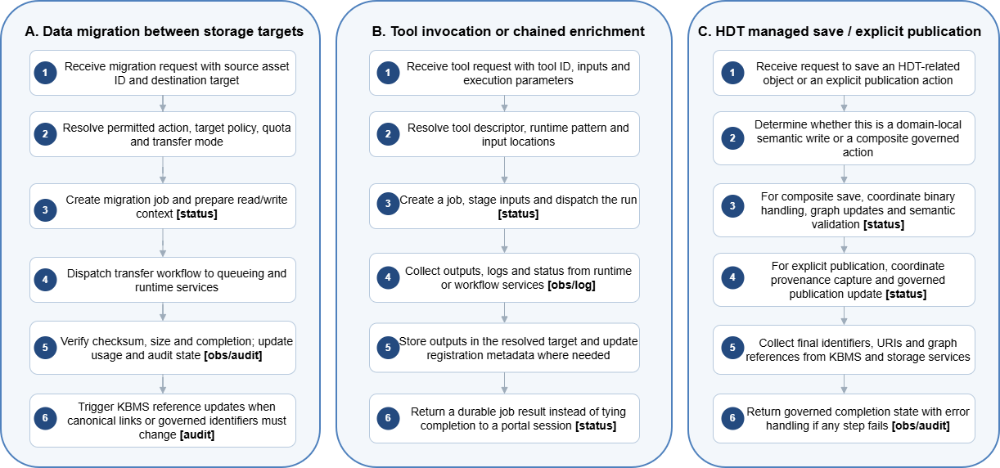
<figcaption>
Figure 13 Three representative operational reactions of the Processing Manager
</figcaption>
</figure>

In the figure above, small observability/audit tags indicate steps that should emit operation status, logs, audit evidence or diagnostic signals to the observability and operations layer.

**A. Migration of data between storage targets**

A migration request arrives with a source asset identifier and a destination target or target class. The Processing Manager uses the resolved access and operation context to check whether the migration can proceed and whether the destination is eligible for the user, application or workflow context. It then creates a migration job, asks storage-side services to prepare the source and target transfer context, and dispatches the transfer workflow to queueing and runtime components. When the transfer finishes, the Processing Manager does not stop at a raw success signal. It requests verification, such as checksum, size or policy completion, updates usage and audit state, and triggers semantic reference updates through KBMS where canonical links, identifiers or provenance relations need to change.

**B. Invocation of a tool or chained enrichment path**

A tool execution request arrives with a tool identifier, input references and execution parameters. The Processing Manager uses resource and tool metadata to determine the runtime pattern, where the inputs are stored, and whether the result should return immediately or as a durable asynchronous job. It then creates a job, stages inputs from UPS or other recognised storage, and dispatches the run to the appropriate execution substrate. Once the runtime completes, the Processing Manager collects outputs, logs and status, resolves the correct output target and checks, based on operation context and descriptors, whether follow-up registration or chaining is needed. This keeps workflow logic out of the Portal frontend and out of individual Vertical Applications.

**C. Managed save or explicit publication of an HDT-related object**

A request to save an HDT-related object, or an explicit publication action invoked through the appropriate platform-facing entry point, may look like a single user action but can represent a composite platform operation. A simple synchronous metadata write may still go directly to KBMS. The manager becomes necessary when the save implies binary staging, graph updates, validation, provenance capture, identifier assignment or publication to a recognised target. In that situation the manager coordinates the required steps with storage-side and semantic-side services and only completes the action when the resulting identifiers, URIs, graph references and governed status are consistent enough to be returned as one coherent result. Where a stable object identity or publication-grade identifier must be assigned, that assignment should occur inside the same managed save or publication path under semantic governance rather than as a detached follow-up step.

### Managed-operation failure handling

Managed operations may involve several independent platform services, such as semantic storage, binary storage, governance records and execution services. The architecture does not assume one global transaction that can automatically commit or roll back all of these services at once. Accepting a request therefore only means that the platform has started handling it. The operation is successful only when it reaches an explicit governed completion state.

This distinction matters when an operation crosses several domains. For example, a binary asset may be uploaded successfully while the related semantic write fails, or a semantic update may succeed while the final storage reference, publication update or workflow result is not yet confirmed. Such partial completion must remain visible and must not be reported as success.

If a failure happens before any cross-domain state is changed, the platform may return a terminal failed state with a stable reason. If a failure happens after part of the operation has already completed, the operation should remain observable as a non-successful managed operation, for example pending cleanup or cleanup running, until the affected state is reconciled or escalated as cleanup failed.

The Processing Manager coordinates operation state and cleanup coordination for managed operations, but it does not become the owner of semantic content, binary persistence, storage policy or domain-specific governance. KBMS, storage-side services, Resource Manager and governance repositories remain responsible for their own domain state. The Processing Manager preserves the operation record, exposes the current state through the documented operation-status contract, and ensures that partial completion is not treated as governed completion.

These failure states belong to the managed-operation layer rather than to the HDT object lifecycle itself. They may temporarily constrain further actions on an affected object or context, but they do not replace lifecycle states such as working, staged, published, archived or retired. Observability and alerting should make failed, pending cleanup and cleanup failed operations visible to operators and, where appropriate, to callers.

## Resource onboarding and integration levels

The preceding sections describe interaction patterns triggered by users, Vertical Applications or platform services at runtime. Resource onboarding is included here as a complementary provider-facing interaction pattern: it describes how a dataset, API, tool, workflow, application or provider-operated service becomes known to the Platform and becomes eligible for discovery, execution, semantic participation or monitored federation.

Integration with the Cultural Heritage Cloud follows the process logic established in D3.2 and aligned with the interoperability framework of D6.2: candidate identification, self-assessment, technical onboarding, integration validation, release and monitoring. D6.3 does not redefine that process or the level criteria. Its role is to show which cloud components participate in the operational path. Resource Manager supports registration, discoverability and governance status. SEP and AAI provide the protected access boundary where relevant. KBMS provides the semantic integration point for graph-ready content, semantic mappings or HDT-related representations. Storage-side services support binary or non-semantic assets, while Processing Manager, Tool Catalogue and execution services become relevant when the onboarded resource is an invocable tool, workflow or managed operation.

The assigned integration or interoperability level determines how the resource may participate in later platform flows. A resource may first become discoverable, then semantically integrated, and finally eligible for stronger federation or monitored cross-node participation. In this sense, onboarding defines the operational state that allows resources to participate in save, publish, query, execution, enrichment or federation patterns described elsewhere in this chapter.

## Data architecture, lifecycle, versioning and caching

This section defines the operational data model for HDT-related objects in the Platform. It covers lifecycle states, versioning semantics and the role of caches or derived read layers. The model complements data-refinement lifecycle described in D6.1 which focuses on how data and knowledge are refined over time.

### Lifecycle states and transitions

At the architectural level, the platform distinguishes five lifecycle states for HDT-related content. Platform working state covers material that has already crossed into platform-managed persistence, such as private semantic or binary working zones, for ongoing user or application work. Staged state covers material accepted into a managed operation, possibly with reserved targets, operation identifiers or temporary execution artefacts, before it becomes a completed released object. Published state covers a governed object whose semantic representation and binary references have been promoted to the relevant shared or recognised publication targets. Archived state covers material retained for continuity, preservation or institutional responsibility. Retired or expired state covers objects that are no longer active in normal discovery or write flows and are retained only under explicit retention rules, if retained at all.

Lifecycle transitions are owned by the component responsible for the relevant domain of change. The Processing Manager owns transitions that span multiple technical domains, such as semantic write, binary transfer and discovery registration. KBMS owns semantic transitions, including private-graph save and publication into knowledge-sharing repositories. Storage-side services own transitions concerning working storage, publication targets and archival destinations. Lifecycle state belongs to the coupled operation and object model of the platform, not to one isolated repository. An HDT becomes fully published only when binary publication, semantic publication and any mandatory registration steps have reached governed completion.

Managed-operation failure states, such as failed, pending cleanup, cleanup running or cleanup failed, are operation-layer states. They may constrain further actions on an affected object or context until reconciliation is complete, but they do not replace lifecycle states such as working, staged, published, archived or retired.

The minimal operational state model distinguishes user-initiated transitions, managed-operation transitions and governance-only transitions. Create, edit intent, submit for publication and request delete are user-initiated actions. Save, first-write provisioning, upload completion, semantic commit and publication completion are managed-operation transitions. Final retirement, suspension, recovery-window expiry and policy-driven deactivation are governance-only transitions, not casual end-user shortcuts. Deletion in private UPS may appear immediate from the user’s perspective because the object is not yet a public reference point. Deletion of a published or otherwise exposed HDT enters a governed pending-deletion or retirement-pending-cleanup state, withdraws the object from public exposure, and completes through managed asynchronous reference cleanup or reconciliation before final purge or permanent retirement.

Within this model, platform working state and published state are different lifecycle forms of the same governed lineage. Platform working-state HDTs support private progress and managed completion after they have crossed into platform-managed persistence. Published HDTs represent release-grade governed snapshots. Supersession, archival retention and retirement apply to the published lineage without turning release objects back into editable working-state forms.

### Versioning strategy

The architecture should adopt a snapshot-oriented versioning strategy for released HDTs. For published or externally exposed HDTs, each released version should be treated as an immutable architectural snapshot with stable semantic references, explicit provenance and a clear relation to previous or superseded versions. This avoids ambiguous in-place overwrite semantics in the shared knowledge layer and is better aligned with citation, provenance and release discipline.

In the current baseline, private semantic workspaces do not assume built-in history snapshots or provenance provisioning. This keeps D6.3 aligned with the private-space model established in D6.1, where private editing supports iterative work without publication-grade versioning, enforced provenance trails or mandatory change tracking for each edit. On the binary side, the platform should prefer immutable asset identifiers or versioned asset references wherever an asset participates in a governed HDT version. Reuse of the same binary payload across multiple HDT versions is acceptable, provided the references remain explicit and provenance remains reconstructable. Versioning baseline applies to governed published HDT representations. Private semantic workspaces are not expected to provide platform-level checkpointing, change-history tracking, or provenance provisioning or user-facing recovery mechanisms. This does not preclude ordinary infrastructure-level backup or disaster-recovery measures covered by operational continuity model.

### Caching and materialised views

Cache layers and materialised views support the read path. They do not own platform state. Semantic result caches, portal metadata views and other projections may sit between user-facing services, KBMS and repository targets, but the authoritative state remains in the services that own it. Semantic ownership and graph rules remain governed through the Administrative Repository and knowledge services. Storage targets, quota and allocations remain governed through the Storage Registry / Data API and storage-side services.

Short-lived caches and portal views may be used for frequently accessed metadata, discovery results or publication status. They are refreshed or invalidated after successful commit, publication or lifecycle transition. Event-driven invalidation is preferred. Time-based expiry can be used when immediate invalidation is not available. The baseline architecture does not require a dedicated central cache component.

The Knowledge Base remains the semantic source of truth for HDT-related semantic content, but it does not need to serve every repeated read directly. The Portal, SEP-mediated clients and Vertical Applications may use derived views, response caches, search indexes or semantic read replicas. These mechanisms support retrieval and performance. They do not create new sources of truth.

# Interoperability, security and governance alignment 

This chapter explains how defined architecture supports interoperability, security and governance expectations established in D6.2.

## Alignment with D6.2 interoperability levels

The architecture described in this document is intentionally aligned with the cumulative interoperability model defined in D6.2. The L1/L2/L3 labels used here refer to interoperability level, not to the separate integration-level language used in D3.2 and D6.2. L1 corresponds to minimum discoverability, stable identifiers, clear licensing, baseline security and basic access. L2 adds structured semantics and operational readiness, including JSON-LD metadata, controlled vocabularies, versioned APIs, entitlement-based access and health and logging support. L3 corresponds to selective advanced federation with RDF discipline, SHACL validation, workflow integration, object-level provenance, semantic drift monitoring and stronger cross-node obligations.

Architecturally this means that the cloud must support gradual deepening of participation rather than one rigid integration threshold. The current baseline assumes L2 as the practical target for resources expected to be integrated and reused across providers. L3 is reserved for resources and nodes able to sustain stricter semantic and operational guarantees. Achieving a given interoperability level should not be read as automatically implying the same level of broader organisational or roadmap integration.

| **Interoperability level** | **Minimum architectural effect** | **Typical components involved** |
|:---|----|----|
| L1 | Baseline discovery, stable identification, licence visibility and secure exposure of resources | Resource Manager, Single Entry Point, AAI, basic service exposure |
| L2 | Entitlement‑aware access, structured semantics and monitored operational behaviour | AAI, SEP, AEM, KBMS or domain APIs, monitoring stack |
| L3 | Advanced semantic integration, formal constraints and selective federation | KBMS, knowledge‑sharing or external semantic repositories, governance and monitoring services |

Table 11 Architectural interpretation of interoperability levels

## AAI, entitlement model and service protection

AAI and entitlement handling are part of the interoperability baseline for protected services in the ECCCH Platform. A protected API, tool, workflow endpoint, application or node should be able to use trusted identity and access context consistently, and enforce access decisions in a way that is auditable and compatible with the wider platform.

EGI Check-in provides the federated identity and entitlement baseline at the platform boundary. Its claims establish who the user is and which broad community, institutional or role-based context can be trusted. They do not, by themselves, answer platform-specific questions such as which HDT the user may edit, which semantic graph may be written to, which storage target is available, or whether an execution quota has been exhausted. These decisions remain governed by the relevant platform services, repositories and domain-specific authorisation rules.

This does not imply that every authorisation question must be decided by one central component. Platform-specific access decisions must be based on authoritative platform and domain sources, enforced consistently and kept auditable. Depending on the operation, enforcement may rely on AEM-resolved context, the relevant domain service, or a coordinated decision across several domains.

For protected services, the expectation is therefore more specific than the presence of login. Services, or the gateways protecting them, must validate the token or trusted internal context appropriate to their exposure model and enforce the relevant access context consistently. Depending on the exposure model, this may include issuer, audience, expiry, required scopes or entitlements, platform-resolved or domain-specific permissions, or a signed internal authorisation context.

The exposure model matters. Publicly exposed protected services may validate EGI-issued tokens directly or be protected by a gateway that validates and enforces the relevant access context before forwarding the request. Internal platform services should consume a platform-issued trusted context where that pattern is used, rather than each becoming an independent public AAI service provider. This internal context should carry only the information needed by the downstream service to trust the caller and enforce its own domain-specific constraints and it should not become a second full IAM model.

For L2+ resources and services, this becomes part of interoperability evidence. A provider-operated API, tool, workflow endpoint or node should be able to demonstrate how protected access is enforced, how entitlements or platform-resolved permissions are consumed, how unauthorised and forbidden requests are handled, and how access-relevant events are logged or made auditable. In this sense, AAI and service protection contribute directly to interoperability conformance, operational monitoring and governance accountability.

## Policy enforcement, quota and auditability

Access to the ECCCH Platform is not decided only at login. A user may be authenticated and still be unable to perform a specific action. For example, the user may not own a given HDT, may not be allowed to write to a selected semantic workspace, may have reached a storage or execution limit, or may be trying to publish into a context that requires additional approval. Runtime policy enforcement combines identity and entitlements with platform-specific information such as roles, ownership, workspace scope, storage policy, quota, execution budget and governance constraints.

Policy decisions are resolved by platform and domain services, not by clients. SEP, the Portal and Vertical Applications do not hard-code storage choices, object-level permissions or publication rules. They call the appropriate platform interfaces and receive a decision or operational context. This avoids different applications making conflicting decisions about the same user, object or target.

AEM supports this model by resolving access and operation context for platform-facing requests where several policy inputs need to be combined. Authorisation is not centralised in AEM. Domain services remain responsible for enforcing rules that belong to their own scope.

Storage target selection is policy-driven by default. The platform determines which targets are allowed, unavailable, default, read-only or subject to additional approval by considering the user or workspace context, operation type, storage policy and current quota state. If the user interface allows a user to choose a storage target, that choice should be limited to targets already permitted by platform policy. Quota does not replace storage policy. It only affects whether an otherwise eligible target can still be used for a given operation.

Quota enforcement applies to binary and semantic private space, even when the accounting model differs. Binary UPS quota can be based on storage usage. Semantic workspace limits may be based on graph count, triple count or other policy-based constraints. Execution limits, such as compute, GPU or workflow budgets, are related but separate and should be handled as execution-budget decisions.

Policy enforcement also covers legal and governance constraints where they affect runtime behaviour. Licensing, IPR, data-protection obligations, publication eligibility, federation status or downstream reuse conditions may determine whether a resource can be written, published, transferred, exposed or reused. Users, administrators, applications and operators should be able to understand, at an appropriate level, why an action or target was allowed, denied, unavailable or routed through approval. Internal policy rules do not need to be exposed, but denial reasons, operation correlation and auditable traces are required for exceptional overrides or governance-driven decisions.

## Federation and node responsibilities

Node and service responsibilities must be explicit. At minimum, the architecture assumes distinct responsibility lines for platform availability and security, service behaviour and contract conformance, dataset metadata and access policy, and federation-level registries, trust and monitoring integration. This follows the spirit of the D6.2 node model and is necessary to keep federated participation workable over time.

Where external repositories or federated nodes participate, the cloud does not absorb all their operational obligations. Instead, it requires that they expose the necessary contracts, identifiers, access policy information, endpoint metadata and monitoring signals to participate safely. The central cloud core remains responsible for its own registries, trust model and governance decisions, but provider-side operators remain responsible for the durability and behaviour of their own systems unless those systems are explicitly taken over as central cloud services.

Minimum federation readiness should therefore be read as a controlled admission bar rather than as a vague aspiration. For external semantic repositories this means stable identifiers, explicit access policy, semantic governance compatibility, observable health and a conformance package sufficient for the declared integration level. For recognised institutional storage targets it means registered target metadata, publication policy alignment, stable protocol support, diagnosable write behaviour and the ability to suspend or deactivate the target if monitoring, conformance or governance conditions degrade. Revalidation and operational suspension should be treated as normal parts of federation management, not as exceptional last-resort actions.

## Enforcement matrix for D6.2 requirement families

D6.2 establishes interoperability as contract-driven and evidence-backed. The matrix below shows, at architecture level, which ECHOES components are expected to enforce or operationalise the major requirement families and what forms of evidence they should produce during onboarding or operation.

<table style="width:100%;">
<caption>
Table 12 Enforcement matrix for D6.2 requirement families
</caption>
<colgroup>
<col style="width: 26%" />
<col style="width: 36%" />
<col style="width: 37%" />
</colgroup>
<thead>
<tr>
<th style="text-align: left;">Primary obligations addressed</th>
<th style="text-align: left;">How enforcement occurs at architecture level</th>
<th style="text-align: left;">Typical evidence produced</th>
</tr>
</thead>
<tbody>
<tr>
<td colspan="3" style="text-align: left;">Access Edge / API Gateway</td>
</tr>
<tr>
<td style="text-align: left;">Security and monitoring obligations related to protected service exposure.</td>
<td style="text-align: left;">Token validation, route-level access control and rejection of unauthorised requests at the platform trust boundary.</td>
<td style="text-align: left;">Auth failure codes, structured access logs and availability signals.</td>
</tr>
<tr>
<td colspan="3" style="text-align: left;">SEP Integration API</td>
</tr>
<tr>
<td style="text-align: left;">API-level interoperability and contract stability requirements.</td>
<td style="text-align: left;">Stable platform-facing integration surface with input validation, operation correlation and versioned exposure.</td>
<td style="text-align: left;">Documented interface descriptions, request and response examples, and consistent error behaviour.</td>
</tr>
<tr>
<td colspan="3" style="text-align: left;">AEM</td>
</tr>
<tr>
<td style="text-align: left;">Authorisation and policy/context resolution obligations.</td>
<td style="text-align: left;">Runtime composition of effective access and operation context from identity, semantic, storage, execution and governance policy sources, especially where decisions cross more than one domain.</td>
<td style="text-align: left;">Context-resolution traces, decision traceability for cross-domain operations, test cases for allowed and denied actions, target-resolution evidence and evidence of consistent downstream enforcement.</td>
</tr>
<tr>
<td colspan="3" style="text-align: left;">KBMS</td>
</tr>
<tr>
<td style="text-align: left;">Semantic governance, provenance and publication discipline requirements.</td>
<td style="text-align: left;">Enforced semantic CRUD rules, graph and workspace permissions, publication eligibility checks and semantic validation.</td>
<td style="text-align: left;">Graph ownership enforcement evidence, validation outcomes, service health and readiness signals.</td>
</tr>
<tr>
<td colspan="3" style="text-align: left;">Storage Registry / Data API</td>
</tr>
<tr>
<td style="text-align: left;">Storage governance and quota enforcement obligations.</td>
<td style="text-align: left;">Authoritative registration of storage targets, policy state, usage accounting and quota context.</td>
<td style="text-align: left;">Target registry records, quota and accounting evidence, usage and allocation logs.</td>
</tr>
<tr>
<td colspan="3" style="text-align: left;">Storage-side binary services</td>
</tr>
<tr>
<td style="text-align: left;">Deployment, security and monitoring obligations for binary handling.</td>
<td style="text-align: left;">Delegated upload handling, target enforcement and telemetry at storage boundaries.</td>
<td style="text-align: left;">Upload flow logs, storage-side health signals and error reporting.</td>
</tr>
<tr>
<td colspan="3" style="text-align: left;">Processing Manager</td>
</tr>
<tr>
<td style="text-align: left;">Provenance, execution monitoring and workflow accountability obligations.</td>
<td style="text-align: left;">Managed operation lifecycle with durable state, observable status transitions and governed completion.</td>
<td style="text-align: left;">Operation identifiers, status endpoints, execution logs and failure diagnostics.</td>
</tr>
<tr>
<td colspan="3" style="text-align: left;">Workflow, queue and worker substrate</td>
</tr>
<tr>
<td style="text-align: left;">Operational monitoring and execution continuity obligations.</td>
<td style="text-align: left;">Controlled dispatch, retry semantics and worker-level observability under platform policies.</td>
<td style="text-align: left;">Queue metrics, workload statistics, trace identifiers and correlation identifiers.</td>
</tr>
<tr>
<td colspan="3" style="text-align: left;">Resource Manager</td>
</tr>
<tr>
<td style="text-align: left;">Metadata completeness and discoverability obligations.</td>
<td style="text-align: left;">Validation and governance of registered datasets, APIs, tools and workflows.</td>
<td style="text-align: left;">Registration outcomes, metadata validation evidence and discoverability state.</td>
</tr>
</tbody>
</table>

# Operations, monitoring and sustainability

This chapter focuses on operational sustainability, understood as the ability to keep shared and provider-operated services observable, diagnosable, recoverable and supportable over time. In this sense, monitoring is not only a technical support function. It helps the platform remain operable as more services, applications, providers and federated participants are onboarded.

The broader organisational, legal and financial sustainability model of the Cultural Heritage Cloud is addressed through the project’s governance and sustainability work. The focus here is narrower. The sections below explain how observability, backup and recovery, deployment assumptions and responsibility boundaries support incident response, capacity planning, conformance checks, recovery verification and decisions about remediation, degraded status or suspension.

## Observability baseline

Observability in the CH Cloud is a centrally governed cross-cutting capability, not an optional local add-on to individual services. It covers more than component availability. It must also make managed platform operations diagnosable end-to-end across entry APIs, control-plane managers, the execution substrate, semantic services and storage-side services. The baseline includes health and readiness signals, metrics, structured logs, correlation-capable traces, operation-state telemetry and security events relevant to incident analysis.

The baseline is tiered according to operational responsibility. Centrally operated services provide the full observability baseline. Provider-operated or external participants provide a minimum diagnostically useful signal set, sufficient for diagnosis, conformance verification and, where necessary, degraded status or suspension.

**Observable signal classes**

The observability baseline distinguishes several signal classes instead of treating monitoring as one undifferentiated stream. At architecture level, the following classes form the minimum useful set for ECCCH.

| Signal class | What it covers | Why it matters in ECCCH |
|:---|----|----|
| Health and readiness | Liveness, readiness and dependency reachability of exposed components | Distinguishes hard failure from overload or dependency degradation for central and partner-facing services |
| Request and API telemetry | Latency, throughput, success/failure rates, request-side errors, service-side failures and authentication failures | Protects the trust boundary and shows degradation on portal, SEP and documented platform APIs |
| Managed operation state | State transitions such as created, running, succeeded, failed, pending cleanup or retired | Makes save, publish, delete and run-tool operations diagnosable beyond a simple endpoint response |
| Workflow and worker telemetry | Queue depth, retries, stuck jobs, worker crashes and dispatch backlog | Shows whether the execution plane remains fair, available and able to complete managed operations |
| Semantic and repository diagnostics | CRUD failures, validation outcomes, publication failures and graph/workspace enforcement errors | Supports diagnosis of KBMS behaviour and semantic publication discipline |
| Storage-side diagnostics | Upload-session lifecycle, target write failures, timeouts, quota/accounting update failures | Makes binary save, handoff and publication continuity observable |
| Security and audit events | Repeated denied actions, auth anomalies, admin-sensitive actions and policy denials | Supports incident response, abuse detection and audit-relevant traceability |
| Federation and conformance signals | Health exposure, contract failures, stale evidence and suspended targets | Supports governance of partner-operated and federated participation without requiring full internal telemetry |

Table 13 Observable signal classes for the ECCCH Platform

**Correlation and operation traceability**

Because one user action may traverse the access boundary, the control plane, the execution substrate and downstream semantic or storage targets, observability must support correlation across these layers. Requests entering through SEP or the Access Edge should receive stable request identifiers. Managed operations such as save, publish, delete or workflow execution should also receive operation identifiers. Traces, structured logs and operation-state records should preserve these identifiers across services so that a failure can be diagnosed from the user-facing request down to the responsible downstream component.

This is especially important for stateful lifecycle transitions. For publish and delete, observability should not stop at “the endpoint returned success”. The platform must be able to follow progression through states such as pending publication, published, pending deletion, cleanup running, cleanup failed or retired, and to relate those states back to the originating request, actor and governed object.

**Minimum expectations by component class**

Not every class of component emits the same telemetry depth. The baseline expectations should remain proportionate to the architectural role of each class.

| Component class | Minimum baseline signals | Architectural purpose of the signals |
|:---|----|----|
| Access-facing components | Health and readiness, request latency, auth failures, route-protection telemetry | Protect the trust boundary and diagnose degraded access or misrouted calls |
| Control-plane managers | Dependency health, validation or policy-resolution failures, managed-operation diagnostics | Explain why an operation could not be admitted, resolved or advanced |
| Semantic core and repositories | CRUD outcomes, publication failures, semantic validation and graph/workspace enforcement errors | Preserve diagnosability of the semantic source of truth and governed release path |
| Binary and storage-side services | Upload-session lifecycle, target write failures, timeout and quota-related constraint signals | Explain continuity-of-work issues and binary publication or handoff failures |
| Workflow, queue and workers | Queue depth, retries, stuck operations, worker failures and dispatch backlog | Show whether the execution plane remains fair and able to complete managed work |
| Resource and registry layer | Registration failures, discoverability errors, stale onboarding states and contract mismatch events | Support catalogue continuity, provider onboarding and operational governance |
| Provider-operated or federated participants | Minimum health, contract and failure signals at the integration boundary | Enable diagnosis, conformance checks and possible operational suspension without requiring full internal partner telemetry |

Table 14 Minimum observability expectations by component class

**Alerting and incident-relevant signals**

Alerting should not be limited to infrastructure outages. The baseline should also include repeated authentication failures, degraded request success rates, stuck or repeatedly failing managed operations, queue saturation, semantic publication or cleanup failures, target deactivation or storage-write degradation, and conformance degradation of federated participants. The purpose of alerting is to support timely operational reaction and to preserve reliability, not merely to populate dashboards.

## Continuity, backup and recovery

Continuity and recovery measures should remain diagnosable and testable rather than existing only as policy statements. Backup success or failure, restore verification outcomes and stateful dependency degradation should therefore be part of the operational observability model for central repositories, registries and workflow state. Recovery planning is not sufficient unless its execution path can also be observed and verified.

This applies especially to KBMS-related services, the Administrative Repository, the Storage Registry / Data API, operation state and any central storage areas holding user or execution state. Shared semantic repositories require stronger continuity commitments because they underpin discoverability and integration across the wider cloud, while binary-side obligations can remain differentiated across working, temporary and recognised publication targets.

Recovery planning should also cover exceptional cases where data corruption, malicious writes or compromised integrations are suspected. In such cases, the affected workspace, graph, storage target or integration route may need to be temporarily isolated until review and reconciliation are complete.

The architecture does not imply that all binary storage becomes a permanent ECHOES cost centre. Instead, it distinguishes working, temporary and recognised publication targets so that retention, backup and recovery obligations can be applied proportionately and linked to the actual operational role of the target.

**Sustainability and responsibility boundaries**

Central ECHOES-operated services should expose a full observability baseline under ECHOES operational responsibility. Provider-operated or external services remain outside the same direct operations boundary, but participation in the ecosystem should still require exposure of the minimum health, contract and diagnostic signals needed for conformance checks, federation governance and incident triage. Insufficient operational visibility may therefore become a reason for degraded status or suspension.

This distinction is particularly important for integrated Vertical Applications and other partner-operated services. ECHOES should monitor the integration boundary and the declared contract surface like for example exposed endpoints, documented callbacks, managed-operation outcomes or declared health signals without requiring full introspection into the internal implementation pipelines of every partner application.

In operational practice, observability should remain visible at least to three groups: central platform operations, domain owners of key capabilities such as semantic, storage and execution services, and governance or onboarding owners responsible for partner-operated and federated participation.

<table>
<caption>
Table 15 Operational reaction and durable remediation ownership
</caption>
<colgroup>
<col style="width: 23%" />
<col style="width: 38%" />
<col style="width: 37%" />
</colgroup>
<thead>
<tr>
<th style="text-align: left;">Signal or problem</th>
<th style="text-align: left;">First reacting role</th>
<th style="text-align: left;">Owner of durable remediation</th>
</tr>
</thead>
<tbody>
<tr>
<td style="text-align: left;">
SEP or access

boundary

degraded
</td>
<td style="text-align: left;">Central platform operations</td>
<td style="text-align: left;">
Owner of access edge / portal /

platform entry capabilities
</td>
</tr>
<tr>
<td style="text-align: left;">
KBMS or semantic

publication failures
</td>
<td style="text-align: left;">Platform operations with semantic service owner</td>
<td style="text-align: left;">Semantic governance / KBMS owner</td>
</tr>
<tr>
<td style="text-align: left;">
Storage target timeout or

UPS upload failures
</td>
<td style="text-align: left;">Platform operations with storage-side owner</td>
<td style="text-align: left;">
Storage governance / binary

integration owner
</td>
</tr>
<tr>
<td style="text-align: left;">
Stuck or repeatedly failing

managed operations
</td>
<td style="text-align: left;">Platform operations / processing owner</td>
<td style="text-align: left;">Processing Manager / workflow runtime owner</td>
</tr>
<tr>
<td style="text-align: left;">
Federated participant

contract degradation
</td>
<td style="text-align: left;">Governance or onboarding owner with provider contact</td>
<td style="text-align: left;">
Partner/provider plus federation

governance owner
</td>
</tr>
</tbody>
</table>

## Deployment and infrastructure assumptions

This section clarifies how the architectural choices described earlier translate into basic deployment assumptions. It is not intended as an infrastructure blueprint or an operational manual. Instead, it describes the minimum deployment expectations required to keep the Cultural Heritage Cloud coherent, governable and operable in a hybrid federated setting.

At deployment level, the logical component model should not be read as a final public exposure map. The architecture assumes that externally reachable surfaces are kept explicit and protected, with public ingress concentrated where appropriate around the common access boundary, Access Edge / API Gateway, SEP-facing interfaces or explicitly admitted provider-operated endpoints. Control-plane, semantic, storage and execution components may have different deployment realisations, but their exposure should be governed by a clear service-protection pattern, monitoring expectation and responsibility boundary rather than by accidental direct publication of internal interfaces.

A fundamental assumption of the architecture is the distinction between components that are logically central to the platform and components that may remain provider‑operated or externally hosted. In particular, the common access boundary including the portal environment, Access Edge and SEP Integration API is treated as a centrally governed capability, regardless of how it is physically deployed. This ensures that authentication, policy enforcement and routing decisions remain consistent, even if individual components are decomposed or hosted in different environments.

The same principle applies to the platform control plane. Core governance services, registries and execution‑coordination capabilities are assumed to operate under shared responsibility at platform level. This does not imply a single hosting technology or a fixed infrastructure stack. What matters architecturally is that authoritative state, policy resolution and managed‑operation semantics remain controlled, durable and observable across deployments. Stateless components may be scaled or adapted more freely, while state‑bearing services require stronger continuity and governance discipline.

Execution components follow a more flexible deployment model. Workflow workers, tools and runtime endpoints may be operated centrally or by participating providers, depending on the integration scenario. Where execution is provider‑operated, the platform does not require insight into internal implementation details. It does, however, assume that a minimal set of health, status and outcome signals is exposed at the integration boundary, so that managed operations remain diagnosable and accountable from the platform perspective.

Observability is therefore treated as a platform‑level concern rather than a local service feature. Central services are expected to expose a complete operational signal baseline, while provider‑operated components contribute only the signals necessary to support diagnosis, monitoring and conformance checks. Operator‑facing dashboards, logs and traces are assumed to be maintained outside the public portal environment, so that operational governance does not leak into user‑facing interaction.

These assumptions deliberately avoid prescribing a specific deployment topology or infrastructure solution. They define the architectural guardrails within which deployment choices may vary over time. As long as the shared access boundary, governance responsibilities and operational visibility are preserved, components may be redeployed, migrated or re‑hosted without undermining the integrity of the Cultural Heritage Cloud.

<figure>
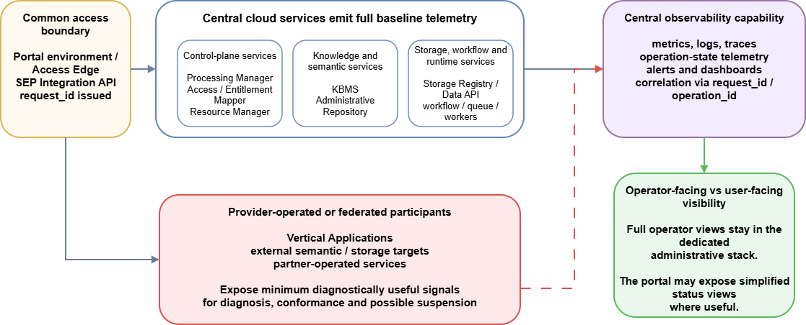
<figcaption>
Figure 14 Observability and correlation model of the ECCCH Cloud
</figcaption>
</figure>

## Ownership and responsibility model

The architecture deliberately distinguishes between centrally managed cloud core capabilities, provider-operated integrated services and external targets. Table 16 is not a legal RACI, but a practical architecture-level responsibility map clarifying which side is expected to operate, govern or simply consume each capability. Read together with Sections 7.1–7.3, it also indicates where the full observability baseline remains central and where only minimum partner-side signals are required. This architecture-level map should be read together with the governance and accountability vocabulary established in D6.2 and with the broader project governance arrangements of WP10. Where formal accountability, escalation or compliance ownership is required, those governance instruments take precedence over the technical responsibility view used here.

| Capability or class | Primary operational owner | Responsibility boundary |
|:---|----|----|
| Common access boundary: SEP capability, portal environment, Access Edge, SEP Integration API | Central ECHOES cloud core | Central entry, trust boundary and user‑facing continuity remain centrally operated, while applications and providers act as callers of the shared platform interfaces |
| AAI / EGI Check‑in integration | Shared federation service or agreed AAI provider | Identity and federated entitlements are external to most business services, but trust integration is part of the platform baseline |
| Administrative Repository, KBMS, knowledge‑sharing repositories | Central ECHOES cloud core | Shared semantic governance and publication baseline remain centrally governed, while external semantic federation is an advanced integration option |
| Private semantic workspaces | Central cloud core for platform operation, with users and institutions owning content | Users own their content and permissions, while platform services enforce governance, isolation and lifecycle discipline |
| Storage Registry / Data API and storage governance | Central ECHOES cloud core | Target definitions, policy and quota semantics are governed centrally even when physical storage backends vary |
| Internal working storage / UPS binary zones | Central ECHOES cloud core | Default working storage remains part of the central platform baseline unless an explicitly approved alternative target is configured |
| Recognised external or institutional storage targets | External institution or provider | The external owner operates the repository, while ECHOES governs eligibility, integration contracts and routing to the target |
| Vertical Applications | Provider or partner | Applications remain black‑box, provider‑owned domain tools, while ECHOES governs the shared platform contract they rely on |
| Provider‑operated tools or APIs registered in the cloud | Provider or partner | Providers own functionality and maintenance, while ECHOES governs discoverability, contract expectations and integration conditions |

Table 16 Ownership and responsibility model for platform and federated components

# Conclusion

## Summary

This deliverable establishes the M24 architectural baseline for the ECHOES Cultural Heritage Cloud. It describes how access and trust, platform control-plane services, execution capabilities, knowledge services, storage and application-facing integration are organised into a hybrid federated cloud environment. The resulting model allows the platform to scale across institutions, applications and providers while preserving shared governance, interoperability and operational visibility.

The architecture is built around a common access and trust boundary, a centrally governed control plane, separated sources of truth, and policy-driven storage and target resolution. Vertical Applications remain partner-owned domain systems integrated through stable platform contracts, while the Heritage Digital Twin is treated as a compound platform-managed object whose semantic representation, asset references, governance metadata, identity and lifecycle state can be coordinated consistently.

D6.3 also defines the operational baseline needed to make this model sustainable. It clarifies where platform services remain authoritative, where provider-operated or federated components may participate, how managed operations are coordinated, and how observability, auditability, continuity and responsibility boundaries support reliable cloud operation. The architecture therefore supports Open Science by making resources discoverable, traceable, reusable and governable across the ECCCH ecosystem.

Rather than prescribing one fixed deployment or implementation stack, the document focuses on stable architectural responsibilities, contracts and interaction patterns. This document is therefore intended as a reference for phased implementation, onboarding and federation, while leaving room for later technical choices and deployment-specific decisions.

## Next steps

D6.3 is intended to serve as a shared architectural reference for consortium discussion, detailed technical design and implementation planning. It provides the baseline against which future cloud components, integrations and onboarding activities can be aligned and assessed.

At the same time, the document makes explicit where further alignment will be required as the platform evolves. These include hosting and operational responsibility boundaries, storage policy and long-term continuity arrangements, role mapping within the AAI model, compute allocation and workload prioritisation policy, the operational model and minting authority for PID assignment, and the detailed scope and governance of AI-enabled capabilities.

Addressing these topics incrementally, while preserving the architectural boundaries and governance principles established here, will be essential to the sustainable development of the Cultural Heritage Cloud in later project phases.

# Appendix A. Open Architectural Issues

The following topics are intentionally left open at this stage because they influence both detailed technical design and the long‑term operational model of the Cultural Heritage Cloud. They are not omissions of the architecture defined in D6.3, but areas where further project‑level agreement, governance input or operational experience will be required.

The current baseline establishes the architectural boundaries within which these questions should be addressed in later phases.

- Hosting models and operational responsibility boundaries for core platform components.

- AAI attribute models, role mapping and tenant separation rules.

- Storage policy, including the division between temporary, working and long‑term responsibility.

- Security hardening and recovery procedures for corrupted or malicious operations, including temporary isolation of affected workspaces, graphs, storage targets or integration routes and reconciliation from verified recovery points.

- Compute allocation and workload prioritisation policies across shared execution resources, within the execution-control model defined in this document.

- Operational model, minting authority and external-provider alignment for PID assignment within the KBMS-led governance path.

- Expected depth of integration for different classes of Vertical Applications.

Scope, governance and integration model of AI-enabled capabilities, including possible future AI execution specialisation and integration with external AI infrastructures such as AI Factories.
