European Cloud for Heritage Open Science

Deliverable D7.1

**The Digital Commons**

HORIZON-CL2-2023-HERITAGE-ECCCH-01

Horizon Innovation action

**Responsible authors:** Sorin Hermon (CyI), Maria Theodoridou (FORTH)

| **Project start** | 1 June 2024 |
|:--:|----|
| **Project duration** | 60 months |
| **Document Identifier** | 10.5281/zenodo.\[ number\] |

Deliverable Information

<table style="width:94%;">
<colgroup>
<col style="width: 27%" />
<col style="width: 65%" />
</colgroup>
<thead>
<tr>
<th>Project Number</th>
<th>101157364</th>
</tr>
</thead>
<tbody>
<tr>
<td>Acronym</td>
<td>ECHOES</td>
</tr>
<tr>
<td>Full Title</td>
<td>European Cloud for Heritage OpEn Science</td>
</tr>
<tr>
<td>Project URL</td>
<td>https://www.echoes-eccch.eu/</td>
</tr>
<tr>
<td>EU Project Officer</td>
<td>Christian WILK</td>
</tr>
<tr>
<td></td>
<td></td>
</tr>
<tr>
<td>Deliverable Number</td>
<td>D7.1</td>
</tr>
<tr>
<td>Deliverable Title</td>
<td>The Digital Commons</td>
</tr>
<tr>
<td>Work Package Number</td>
<td>WP7</td>
</tr>
<tr>
<td>Work Package Title</td>
<td>Digital Commons Knowledge-Base</td>
</tr>
<tr>
<td></td>
<td></td>
</tr>
<tr>
<td>Deliverable nature</td>
<td>R</td>
</tr>
<tr>
<td>Dissemination level</td>
<td>PU</td>
</tr>
<tr>
<td>Contractual Date</td>
<td>31/05/2026</td>
</tr>
<tr>
<td>Submission Date</td>
<td>27/05/2026</td>
</tr>
<tr>
<td>Version</td>
<td>v1.1</td>
</tr>
<tr>
<td>Document Identifier</td>
<td>ECHOES-D7.1-The-Digital-Commons-v1.1</td>
</tr>
<tr>
<td></td>
<td></td>
</tr>
<tr>
<td>Lead Partner(s):</td>
<td>Sorin Hermon, Valentina Vassallo, Andriana Sielli (CYI)</td>
</tr>
<tr>
<td>Author(s):</td>
<td>
Maria Theodoridou, Athina Kritzotaki, Martin Doerr (FORTH)

Beatrice Markoff, Florian Hivert (CNRS)

Antoine Isaac (Europeana)
</td>
</tr>
<tr>
<td>Responsible Author(s)</td>
<td>Sorin Hermon (CyI), Maria Theodoridou (FORTH)</td>
</tr>
<tr>
<td>Contributor(s)</td>
<td>
Emanuel Demetrescu (CNR)

Michela De Bernardin (IIT)

Tobias Hellmund, Maximilian Zenner (Fraunhofer)
</td>
</tr>
<tr>
<td></td>
<td></td>
</tr>
<tr>
<td>Pages</td>
<td>109</td>
</tr>
<tr>
<td>Keywords</td>
<td>Heritage Digital Twin Ontology; data model; CIDOC CRM</td>
</tr>
<tr>
<td>Status</td>
<td>[final]</td>
</tr>
</tbody>
</table>

Change Log

<table style="width:94%;">
<colgroup>
<col style="width: 17%" />
<col style="width: 14%" />
<col style="width: 26%" />
<col style="width: 34%" />
</colgroup>
<thead>
<tr>
<th style="text-align: center;">Date</th>
<th style="text-align: center;">Version</th>
<th style="text-align: center;">Author/Editor</th>
<th style="text-align: center;">Summary of Changes made</th>
</tr>
</thead>
<tbody>
<tr>
<td style="text-align: center;">25/10/24</td>
<td style="text-align: center;">v0.1</td>
<td style="text-align: center;">Sorin Hermon</td>
<td style="text-align: center;">Draft report template</td>
</tr>
<tr>
<td style="text-align: center;">27/05/25</td>
<td style="text-align: center;">v0.2</td>
<td>Sorin Hermon, Maria Theodoridou, Athina Kritsotaki, Martin Doerr, Beatrice Markoff, Florian Hivert</td>
<td style="text-align: center;">First Draft of HDTO</td>
</tr>
<tr>
<td style="text-align: center;">26/09/25</td>
<td style="text-align: center;">v0.3</td>
<td>
Sorin Hermon, Valentina Vassallo, Andriana Sielli, Maria Theodoridou, Athina Kritsotaki, Beatrice Markoff, Florian Hivert,

Antoine Isaac, Emanuel Demetrescu
</td>
<td>Comments and improvements</td>
</tr>
<tr>
<td style="text-align: center;">31/10/25</td>
<td style="text-align: center;">v0.4</td>
<td>Sorin Hermon, Maria Theodoridou, Athina Kritsotaki, Martin Doerr</td>
<td>Second Draft of HDTO</td>
</tr>
<tr>
<td style="text-align: center;">26/04/26</td>
<td style="text-align: center;">v0.5</td>
<td>Michela De Bernardin, Maria Theodoridou, Athina Kritsotaki</td>
<td>Added illicit trafficking related classes and properties</td>
</tr>
<tr>
<td style="text-align: center;">21/04/26</td>
<td style="text-align: center;">v0.6</td>
<td>Sorin Hermon, Valentina Vassallo, Andriana Sielli, Maria Theodoridou, Athina Kritsotaki</td>
<td>First version submitted for internal review</td>
</tr>
<tr>
<td style="text-align: center;">20/05/26</td>
<td style="text-align: center;">v0.7</td>
<td>Sorin Hermon, Maria Theodoridou, Athina Kritsotaki, Tobias Hellmund, Maximilian Zenner</td>
<td>Consolidated comments, added OCG related classes and properties</td>
</tr>
<tr>
<td style="text-align: center;">25/5/2026</td>
<td style="text-align: center;">v1.0</td>
<td>Sorin Hermon, Maria Theodoridou, Athina Kritsotaki</td>
<td>Consolidated, final version</td>
</tr>
</tbody>
</table>

Table of contents

[List of Figures](#list-of-figures)

[List of Abbreviations](#list-of-abbreviations)

[Executive Summary](#executive-summary)

[1. Introduction and Background](#introduction-and-background)

[1.1. The Need for Semantic Integration in Cultural Heritage (CH)](#the-need-for-semantic-integration-in-cultural-heritage-ch)

[1.2 The role of ECHOES in Creating Digital Commons](#the-role-of-echoes-in-creating-digital-commons)

[1.3 Definitions - The digital commons and ensuring their digital continuum](#definitions---the-digital-commons-and-ensuring-their-digital-continuum)

[1.4. The rationale behind conceptualizing the Heritage Digital Twin and its related Ontology](#the-rationale-behind-conceptualizing-the-heritage-digital-twin-and-its-related-ontology)

[2. The Heritage Digital Twin (HDT) and its related Ontology (HDTO)](#the-heritage-digital-twin-hdt-and-its-related-ontology-hdto)

[2.1. Introduction to HDTO as the Semantic Backbone of the ECCCH and its Knowledge Base](#introduction-to-hdto-as-the-semantic-backbone-of-the-eccch-and-its-knowledge-base)

[2.2. HDTO’s main functionalities](#hdtos-main-functionalities)

[2.3. Building The Heritage Digital Twin Ontology](#building-the-heritage-digital-twin-ontology)

[2.4. Naming conventions](#naming-conventions)

[2.5. HDTO Fundamental Concepts](#hdto-fundamental-concepts)

[2.6. HDTO Property Declaration](#hdto-property-declaration)

[3. The HDTO in action – an example](#the-hdto-in-action-an-example)

[4. Detailed description of the HDTO](#detailed-description-of-the-hdto)

[4.1. Class declaration](#class-declaration)

[HC1 Heritage Entity](#hc1-heritage-entity)

[HC2 Heritage Digital Twin](#hc2-heritage-digital-twin)

[HC3 Tangible Heritage Entity](#hc3-tangible-heritage-entity)

[HC4 Intangible Heritage Entity](#hc4-intangible-heritage-entity)

[HC5 Digital Representation](#hc5-digital-representation)

[HC6 Sensor Data](#hc6-sensor-data)

[HC7 Digital Audiovisual Object](#hc7-digital-audiovisual-object)

[HC10 Heritage Valuation](#hc10-heritage-valuation)

[HC11 Digital Twin Maintenance](#hc11-digital-twin-maintenance)

[HC12 Heritage Declaration Event](#hc12-heritage-declaration-event)

[HC13 Project](#hc13-project)

[HC14 Volatile Digital Object](#hc14-volatile-digital-object)

[HC15 Persistent Digital Object](#hc15-persistent-digital-object)

[HC16 Heritage Proposition Set](#hc16-heritage-proposition-set)

[HC17 Observation with Inference](#hc17-observation-with-inference)

[HC18 Provenance Statement](#hc18-provenance-statement)

[HC19 Provenance Assessment](#hc19-provenance-assessment)

[HC20 Illicit Removal](#hc20-illicit-removal)

[4.2. Property Declaration](#property-declaration)

[HP1 has digital twin (is digital twin of)](#hp1-has-digital-twin-is-digital-twin-of)

[HP2 has story (is story about)](#hp2-has-story-is-story-about)

[HP3 is digital twin component of (has digital twin component)](#hp3-is-digital-twin-component-of-has-digital-twin-component)

[HP4 narrates (is narrated through)](#hp4-narrates-is-narrated-through)

[HP5 has intangible heritage entity (is intangible heritage entity of)](#hp5-has-intangible-heritage-entity-is-intangible-heritage-entity-of)

[HP6 has manifestation event (event is manifestation of)](#hp6-has-manifestation-event-event-is-manifestation-of)

[HP7 is manifestation of (is manifested by)](#hp7-is-manifestation-of-is-manifested-by)

[HP8 is narrated in document (document used for narration)](#hp8-is-narrated-in-document-document-used-for-narration)

[HP9 is visual representation of (has visual representation)](#hp9-is-visual-representation-of-has-visual-representation)

[HP10 tells about (is told by)](#hp10-tells-about-is-told-by)

[HP12 regards as origin (is regarded as origin by)](#hp12-regards-as-origin-is-regarded-as-origin-by)

[HP13 had target (was community for)](#hp13-had-target-was-community-for)

[HP14 values (is valued by)](#hp14-values-is-valued-by)

[HP15 is heritage of (has original heritage)](#hp15-is-heritage-of-has-original-heritage)

[HP16 initiated (was initiated by)](#hp16-initiated-was-initiated-by)

[HP17 terminated (was terminated by)](#hp17-terminated-was-terminated-by)

[HP18 has documented (was documented by)](#hp18-has-documented-was-documented-by)

[HP19 has composed (was composed by)](#hp19-has-composed-was-composed-by)

[HP20 was carried out under (had contribution)](#hp20-was-carried-out-under-had-contribution)

[HP21 is 3D representation output of (has 3D representation)](#hp21-is-3d-representation-output-of-has-3d-representation)

[HP22 represents (has digital representation)](#hp22-represents-has-digital-representation)

[HP23 was about (was subject of)](#hp23-was-about-was-subject-of)

[HP24 has disciplinary focus (is aspect of)](#hp24-has-disciplinary-focus-is-aspect-of)

[HP25 has created (was created by)](#hp25-has-created-was-created-by)

[HP26 studied specifically (was studied by)](#hp26-studied-specifically-was-studied-by)

[HP27 used content of (content was used by)](#hp27-used-content-of-content-was-used-by)

[HP28 has snapshot (is snapshot of)](#hp28-has-snapshot-is-snapshot-of)

[HP29 has digital object part](#hp29-has-digital-object-part)

[HP30 added content (content was added by)](#hp30-added-content-content-was-added-by)

[HP31 deleted content (content was deleted by)](#hp31-deleted-content-content-was-deleted-by)

[HP32 replaced (was replaced by)](#hp32-replaced-was-replaced-by)

[HP33 contains (is proposition set of)](#hp33-contains-is-proposition-set-of)

[HP34 contained (is former proposition set of)](#hp34-contained-is-former-proposition-set-of)

[HP35 made primary observation (was observation of)](#hp35-made-primary-observation-was-observation-of)

[HP36 is about the provenance of (has provenance claim)](#hp36-is-about-the-provenance-of-has-provenance-claim)

[HP37 concluded provenance (was assessed by)](#hp37-concluded-provenance-was-assessed-by)

[HP38 is sensor representation of (has sensor representation)](#hp38-is-sensor-representation-of-has-sensor-representation)

[References](#references)

[5. Referred CIDOC CRM Classes and Properties](#referred-cidoc-crm-classes-and-properties)

[5.1 Referred CIDOC CRM Classes](#referred-cidoc-crm-classes)

[E1 CRM Entity](#e1-crm-entity)

[E2 Temporal Entity](#e2-temporal-entity)

[E4 Period](#e4-period)

[E5 Event](#e5-event)

[E7 Activity](#e7-activity)

[E10 Transfer of Custody](#e10-transfer-of-custody)

[E13 Attribute Assignment](#e13-attribute-assignment)

[E18 Physical Thing](#e18-physical-thing)

[E28 Conceptual Object](#e28-conceptual-object)

[E31 Document](#e31-document)

[E36 Visual Item](#e36-visual-item)

[E39 Actor](#e39-actor)

[E55 Type](#e55-type)

[E65 Creation](#e65-creation)

[E70 Thing](#e70-thing)

[E74 Group](#e74-group)

[E89 Propositional Object](#e89-propositional-object)

[E90 Symbolic Object](#e90-symbolic-object)

[5.2. Referred CIDOC CRM Properties](#referred-cidoc-crm-properties)

[P2 has type (is type of)](#p2-has-type-is-type-of)

[P9 consists of (forms part of)](#p9-consists-of-forms-part-of)

[P16 used specific object (was used for)](#p16-used-specific-object-was-used-for)

[P17 was motivated by (motivated)](#p17-was-motivated-by-motivated)

[P94 has created (was created by)](#p94-has-created-was-created-by)

[E90 Symbolic Object](#_Toc230787391)

[P129 is about (is subject of)](#p129-is-about-is-subject-of)

[P130 shows features of (features are also found on)](#p130-shows-features-of-features-are-also-found-on)

[P134 continued (was continued by)](#p134-continued-was-continued-by)

[P138 represents (has representation)](#p138-represents-has-representation)

[P148 has component (is component of)](#p148-has-component-is-component-of)

[5.3. Referred CIDOC CRMsci Classes](#referred-cidoc-crmsci-classes)

[S15 Observable Entity](#s15-observable-entity)

[S27 Observation](#s27-observation)

[S28 Observable Situation](#s28-observable-situation)

[5.4. Referred CIDOC CRMsci Properties](#referred-cidoc-crmsci-properties)

[O36 expressed the observed as (was the expression of)](#o36-expressed-the-observed-as-was-the-expression-of)

[5.5. Referred CIDOC CRMdig Classes](#referred-cidoc-crmdig-classes)

[D1 Digital Object](#d1-digital-object)

[D2 Digitization Process](#d2-digitization-process)

[D11 Digital Measurement Event](#d11-digital-measurement-event)

[D9 Data Object](#d9-data-object)

[5.6. Referred CIDOC CRMdig Properties](#referred-cidoc-crmdig-properties)

[L1 digitized (was digitized by)](#l1-digitized-was-digitized-by)

[L20 has created (was created by)](#l20-has-created-was-created-by)

[5.7. Referred CIDOC CRMinf Classes](#referred-cidoc-crminf-classes)

[I1 Argumentation](#i1-argumentation)

[I4 Proposition Set](#i4-proposition-set)

[I5 Inference Making](#i5-inference-making)

[I10 Provenance Statement](#i10-provenance-statement)

[I15 Provenance Assessment](#i15-provenance-assessment)

[5.8. Referred CIDOC CRMinf Properties](#referred-cidoc-crminf-properties)

[J20 is about the provenance of (has provenance claim)](#j20-is-about-the-provenance-of-has-provenance-claim)

[J21 concluded provenance (was assessed by)](#j21-concluded-provenance-was-assessed-by)

[5.9. Referred Parthenos Classes](#referred-parthenos-classes)

[PE19 Persistent Digital Object](#pe19-persistent-digital-object)

[PE20 Volatile Digital Object](#pe20-volatile-digital-object)

[D1 Digital Object](#d1-digital-object-1)

[5.10. Referred Parthenos Properties](#referred-parthenos-properties)

[PP17 has snapshot (is snapshot of)](#pp17-has-snapshot-is-snapshot-of)

[PP18 has digital object part (is digital object part of)](#pp18-has-digital-object-part-is-digital-object-part-of)

[5.11. Referred Narrative Ontology Classes](#referred-narrative-ontology-classes)

[Narration](#narration)

[Narrative](#narrative)

[5.12. Referred Narrative Ontology Properties](#referred-narrative-ontology-properties)

[hasText](#hastext)

[partOfNarrative](#partofnarrative)

[Disclaimer](#disclaimer)

[Endnotes](#endnotes)

# List of Figures

[Figure 1. The Digital Commons at the core of the ECCCH. [14](#_Toc230787435)](file:///C:\Users\maria\Downloads\D7.1_final.docx#_Toc230787435)

[Figure 2. The DIKW pyramid and ECHOES [15](#_Toc230787436)](file:///C:\Users\maria\Downloads\D7.1_final.docx#_Toc230787436)

[Figure 3. Valuation of an HDT. [17](#_Toc230787437)](file:///C:\Users\maria\Downloads\D7.1_final.docx#_Toc230787437)

[Figure 4. Maintenance of an HDT. [17](#_Toc230787438)](file:///C:\Users\maria\Downloads\D7.1_final.docx#_Toc230787438)

[Figure 5. Study of an HDT. [18](#_Toc230787439)](file:///C:\Users\maria\Downloads\D7.1_final.docx#_Toc230787439)

[Figure 6. Conceptual structure of an HDT. [20](#_Toc230787440)](file:///C:\Users\maria\Downloads\D7.1_final.docx#_Toc230787440)

[Figure 7. Core elements of an HDT. [20](#_Toc230787441)](file:///C:\Users\maria\Downloads\D7.1_final.docx#_Toc230787441)

[Figure 8: The observation of a crack by measuring temperature and crack width. [24](#_Toc230787442)](file:///C:\Users\maria\Downloads\D7.1_final.docx#_Toc230787442)

[Figure 9: Entities in Sensor Things API Standard. [24](#_Toc230787443)](file:///C:\Users\maria\Downloads\D7.1_final.docx#_Toc230787443)

[Figure 10. The Deryneia icon. [25](#_Toc230787444)](file:///C:\Users\maria\Downloads\D7.1_final.docx#_Toc230787444)

[Figure 11. The main components of the Deryneia icon’s knowledge graph. [26](#_Toc230787445)](file:///C:\Users\maria\Downloads\D7.1_final.docx#_Toc230787445)

[Figure 12: The complete knowledge graph describing the research activities on the Deryneia icon. [27](#_Toc230787446)](file:///C:\Users\maria\Downloads\D7.1_final.docx#_Toc230787446)

[Figure 14. The heritage entity Deryneia icon as represente d by the HDTO’s main classes.](#_Toc230787447)

[Figure 15. The valuation of the HC1 heritage entity Deryneia icon.](#_Toc230787448)

[Figure 16. The study of the HDT Deryneia icon, with its main HDTO classes.](#_Toc230787449)

[Figure 17. The maintenance of the Deryneia icon, as represented by the HDTO classes.](#_Ref230624864)

[Figure 18. The maintenance of the Deryneia icon, as represented by the HDTO classes (cont. from Figure 17.)](#_Toc230787451)

[Figure 19. The HDT ontology. [39](#_Toc230787452)](file:///C:\Users\maria\Downloads\D7.1_final.docx#_Toc230787452)

[Figure 20. HDT ontology - details. [41](#_Toc230787453)](file:///C:\Users\maria\Downloads\D7.1_final.docx#_Toc230787453)

[Figure 21. HDTO example (cont.) [42](#_Toc230787454)](file:///C:\Users\maria\Downloads\D7.1_final.docx#_Toc230787454)

# List of Abbreviations

ECCCH – European Collaborative Cloud for Cultural Heritage

HDT – Heritage Digital Twin

HDTO – Heritage Digital Twin Ontology

CH – Cultural Heritage

*crm* – conceptual reference model

*crmpem* – conceptual reference model Parthenos extension

# Executive Summary

The deliverable describes the rationale for creating the Heritage Digital Twin (HDT) and its Ontology (HDTO), as the core ontology for organizing the data forming the ECCCH’s Knowledge Base and provides a detailed description of its classes and properties, along with concrete examples and references to CIDOC-CRM extensions the HDTO refers to.

Currently, at [this page](https://isl.ics.forth.gr/ontology/echoes/html/HDT_v1.1.html) - <https://isl.ics.forth.gr/ontology/echoes/html/HDT_v1.1.html> you can navigate through the HDTO’s classes and properties.

## 1. Introduction and Background

### 1.1. The Need for Semantic Integration in Cultural Heritage (CH)

Cultural Heritage practices cover a broad range of disciplines, societal sectors and actions. Drawing on diverse humanities, sciences, and engineering disciplines, CH research encompasses all forms of scientific inquiry into human works and the combined works of nature and humans that are of value to people. The field focuses on enhancing the understanding, care, sustainable use, and management of tangible and intangible heritage, aiming to enrich people's lives both today and in the future.

CH integrates data generated from within its sphere of activities as well as it gathers data from other domains, thus posing a great challenge to its integration and interoperability. Moreover, this data is generated by heterogenous methods and workflows, under the umbrella of conceptually different ontologies, with different professional vocabularies and semantic descriptions. Considering the main axes of activities related to CH, namely its study, its conservation and its valorization, it is clear we need to address the requirements of communities ranging from researchers, scientists, professionals in conservation, museology, museography or architecture (to name a few), CH managers and public administrators, to creative industries and the private sectors, as well as citizens from different countries, cultural backgrounds and varying interests.

Semantic integration addresses the challenges of CH data fragmentation by establishing shared ontologies, controlled vocabularies, and linked data structures. By converting heterogeneous datasets into coherent knowledge graphs, it enables complex queries across modalities—such as linking material composition to construction phases or degradation patterns—and supports computational analysis and machine learning. This shared semantic framework transforms isolated datasets into an interconnected, actionable "heritage knowledge commons”. Semantic modelling is essential to implement the FAIR principles (Findable, Accessible, Interoperable, Reusable), widely recognized as best practice in CH. The ECCCH promotes FAIR-compliant ontologies, enhancing data discoverability, transparency, long-term preservation, and equitable access across fragmented research communities. By breaking interoperability barriers, semantic integration enables more robust, reproducible, and inclusive interpretations of CH.

### 1.2 The role of ECHOES in Creating Digital Commons

Aligned with the *ex-ante* Report on the European collaborative cloud for CH, the European Commission granted ECHOES, a consortium of more than 50 institutions around Europe, the mission to set the foundations for the establishment of the European Collaborative Cloud for Cultural Heritage (ECCCH), “…a shared platform designed to facilitate collaboration among heritage professionals and researchers, enabling them to modernize their workflows and processes … (it) will offer access to data, cutting-edge scientific and training resources, and advanced digital tools…”.

Following expected paradigm shifts in CH research as a result of recent advancements in AI models and tools, there is an imperious need that high quality CH research data is made accessible to such AI agents, the ECCCH considering it as a priority. AI largely relies on Machine Learning, based on advanced statistical and mathematical principles requiring access to data algorithms optimization; Deep Learning, involving neural networks that simulate human brain activities and thus requiring the use of large-scale training data and reasoning models and Natural Language models, necessitating access to a high amount of textual data in order to extract valuable information. Thus, it is clear that the success of intelligently engaging with AI models to build new knowledge in CH relies on providing AI agents access to large amounts of data largely generated by peer-reviewed research.

Despite numerous efforts coordinated by the European Commission to provide policies, norms and digital platforms for the digitization and delivery of open access to its CH and a plethora of scientific papers detailing the implementation of such processes, the amount and the content of digital data available, as provided by CH institutions and museums, is still lacking the necessary depth and breadth needed for its re-use in scientific and professional contexts. Moreover, digital catalogues of museums’ collections, predominantly based on the OBJECT ID data model[^1], often provide a general description of artefacts, with information mainly related to curatorial and management aspects, and not necessarily for research purposes.

Main obstacles in conducting exhaustive research based on openly available digital content published in museums’ catalogues are scarcity of high-quality documentation material (e.g. 3D models, images, etc.) of the investigated artefacts, a poor description of artefacts (usually de-contextualized from their original socio-cultural / archaeological contexts) and the overall limited number of artefacts digitized. Moreover, such descriptions often lack the consistency of using agreed upon terminologies, shared thesauri and data models, thus complicating attempts at unifying access to their digital collections.

The ECHOES (European Cloud for Heritage Open Science) project establishes a federated cloud-based infrastructure for open and interoperable CH data, operationalizing the concept of “digital commons” where multiple institutions and research communities can contribute, access, and collaboratively use digital heritage resources. ECHOES promotes the FAIR principles by embedding semantic interoperability through the CIDOC CRM-based Heritage Digital Twin Ontology (HDTO) and, ensuring that heterogeneous datasets, covering the broad range of disciplines constituting CH (social sciences and the humanities, such as archaeology, anthropology, architecture, etc., natural sciences such as biology, chemistry or physics or exact sciences such as mathematics and computer sciences) are integrated into a unified, searchable knowledge graph. By maintaining explicit provenance chains, distinguishing raw observations and interpretative statements, and supporting reproducible workflows, the platform ensures that heritage knowledge remains transparent, traceable, and sustainable, thereby enabling robust cross-disciplinary collaboration and long-term reusability.

### 1.3 Definitions - The digital commons and ensuring their digital continuum

The concept of **<u>digital commons</u>** is anchored in the following conceptual definition: “…holistic social institutions for governing the (re)production of (digital) resources, addressed here as data, information, culture and knowledge, created and/or maintained online and articulated through interrelated legal, socio-cultural, economic and institutional dimensions…”[^2]. Digital commons are based on resources available, their quality and usability, a broad range of beneficiary communities to re-use these resources and managing frames in sustainable, collaborative and long-time perspective.

The success of building meaningful digital commons relies on the ability to design, implement and adopt <u>agile technologies</u> to support their creation, management and use, the assurance of building <u>a collaborative community</u> with shared interests in building, maintaining and updating digital commons in a joint effort of mutual benefit and sustainability, generating a paradigm shift in CH practices, with the emphasis on collaboration and mutual support. The frame providing the requirements to create digital commons in CH and ensure their digital continuum must start with providing access to high-quality data, relevant to a broad range of communities which co-create, customize, adapt and re-use this data for a broad range of applications. A first requisite for such data relies on its accountability, formal description of its provenance and how it was processed and post-processed, to ensure its transparency. Data-driven derivative statements must be associated with their source observation, workflows that generated them and reasoning models applied in generating them.

Figure 1. The Digital Commons at the core of the ECCCH.

### 1.4. The rationale behind conceptualizing the Heritage Digital Twin and its related Ontology 

The definition of Digital Twins for Heritage assets adopted here parts away from the traditional approach of a “digital replica” of a real-world asset, as primarily conceptualized for industrial applications[^3]. We believe that the definition applied here, which regards a digital twin of a heritage asset as the complex of digital information about a real-world heritage asset (see below), better answers the necessities and peculiarities of the cultural heritage domain. Moreover, it has a specific scope, to gather and semantically unify existing information on a particular asset, possibly generated by various researchers, in different places and times. Thus, in a way, it maintains the initial definition of a digital twin[^4] as a digital replica of a real-world heritage asset, the difference being that its properties (materiality, shapes, functions, etc.) are described through the semantic description of the intellectual processes that generated these properties, rather than just simply providing a list of them. This is fundamentally important, since, unlike the manufacturing industry, where products parameters (materials, shape, etc.) are known by their initial design, in the Cultural Heritage (CH) domain, characterization of heritage assets is the result of intellectual processes, in a way, as a kind of “reverse engineering” approach, hence the importance of adopting a definition that suits best the CH reality. Consequently, the ontology proposed considers the pluri-disciplinary approaches CH is studied and processed and how data generated is used and re-used by a broad spectrum of stakeholders from multiple societal sectors (again, unlike the manufacturing industry). Finally, the flexibility of the ontology proposed, based on CIDOC-CRM, enables to captures various granularity levels of representation, aligned with the data models proposed to be integrated within the HDT.

As characteristics of CH assets may change in time, it is important to understand the nature of these changes, the factors influencing them and the agents responsible for these changes (either natural or anthropogenic). Thus, following the initial conceptual role of Digital Twins as connectors between the physical and the digital worlds, the HDTO defines specific classes (see below), that capture the contribution of Internet of Things sensors (in particular time series data), described through the OGC (Open Geospatial Consortium) standards[^5], aimed at specifically describing these time-related changes in the structure and shape of CH assets.

## 2. The Heritage Digital Twin (HDT) and its related Ontology (HDTO)

### 2.1. Introduction to HDTO as the Semantic Backbone of the ECCCH and its Knowledge Base

The proposed Heritage Digital Twin (HDT), defined as the complex of digital information about a real-world heritage asset, with its tangible and intangible components, capturing the entirety of its space-time-culture identity and formally organized in a semantic framework and described by the CRM - based ontology (HDTO), aims to formally answer the above requirements, by providing the semantic glue and conceptual framework to achieve the expected vision of the ECCCH, having at its core the digital commons, as HDTs, co-created and co-used by CH communities. Main aspects to highlight are the completeness of information about a CH asset, as generated by various approaches to the study and interpretation of various disciplines, which cover both material and immaterial aspects of the CH asset, along its entire time existence.

<figure>
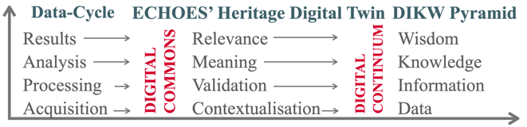
<figcaption>
Figure 2. The DIKW pyramid and ECHOES
</figcaption>
</figure>

As shown in the adjacent figure, the HDT helps moving along the DIKW pyramid, integrating in a semantic structure contextualized data, processed data and its validation and a formal description of the meaning deriving from the data, coupling between observation and derivative statements.

Semantic interoperability is achieved by applying the CIDOC-CRM built HDTO. It provides event-oriented semantic structures tailored for CH assets’ digital twins (HDTs). It represents entities, measurements, and analytical processes as interconnected RDF resources, enabling harmonization of heterogeneous datasets into a unified knowledge graph. This ontology-driven approach facilitates reasoning over datasets, supporting expert interpretation and computational analysis.

The main requirements for an HDT, as reflected in its structure and scope notes, to represent digital commons and ensure their digital continuum, are:

- Relevance

  - Capture communities of use needs – customization, participation and co-creation.

  - Enable quality assessment and accountability.

  - Advances research, management, valorization, conservation / preservation of CH.

- Representation

  - Data gathered captures the CH asset’s existence within its time-space-culture cube.

  - Cover its material and immaterial attributes and components.

  - Ability to absorb new data / information and integrate it in the semantic framework.

- Re-use

  - Open formats, clearly defined workflows.

  - A virtual research environment to present the ensemble of information available – data and derivate inference processes (measurements, observation vs. statements).

  - IPR and ownership management, access and control of content.

The stability of an HDT lies not in the identity of the instance itself but in its structured propositional content, which represents the set of documented facts, interpretations, and digital materials associated with the CH entity. This content forms the stable and shareable element to be referenced and discussed across contexts. Within a semantic network, an HDT acquires meaning within a defined functional and project environment. It represents the structured set of information that a given information provider or project makes available on a specific CH entity. The notion of an HDT instantiated by a node in a semantic network makes only sense with respect to a particular functional role in a project context, representing facts that an information provider has agreed to provide digital material about.

Structural relationships between HDTs are established through modelling decisions made by content providers. For example, the property **HP3 is digital twin component of** (has digital twin component) allows digital twins to be organized hierarchically, enabling smaller components to be integrated into larger digital twin structures. Similarly, the relationship linking **HC2 Heritage Digital Twin** to **HC1 Heritage Entity** — mediated through tangible or intangible heritage subclasses—reflects modelling choices defined within a specific project context rather than objective ontological distinctions.

The Heritage Digital Twin framework also allows digital twin components to be linked to distinct **spatio-temporal elements**, enabling the detailed documentation of specific portions or phases of a CH entity. These elements are defined primarily through spatial and temporal boundaries, rather than by material composition, allowing the systematic representation of historical transformations and interventions over time. For tangible heritage entities, these (sub)elements may correspond to construction phases, architectural components, restoration areas, or other spatially bounded features of a structure or site. For intangible heritage entities, they may represent specific performances, ritual phases, or variations of cultural practices occurring within particular spatial and temporal contexts. By associating HDTs with such sub granular elements, the HDTO framework maintains its heritage-oriented perspective while enabling structured connections with specialized documentation domains. These connections are established through formal linking mechanisms that support detailed heritage analysis while preserving interoperability with broader cultural heritage data models.

The ontology includes <u>Observation with Inference</u>, a class representing activities where observations of real-world situations are paired with interpretative reasoning to produce formal knowledge statements. This concept supports the modelling of scholarly processes through which raw observations are transformed into documented interpretations and structured heritage knowledge. Overall, the HDTO class structure provides a comprehensive semantic framework that connects heritage entities, digital representations, scholarly research, institutional recognition, and knowledge management processes. It enables systematic organization of heritage knowledge and supports the creation and maintenance of digital heritage knowledge bases, such as those envisioned in large-scale infrastructures for cultural heritage research and documentation.

### 2.2. HDTO’s main functionalities 

The HDTO explicitly models the dynamic, socially conferred nature of heritage value, the provenance of digital knowledge production and the evolving relationship between real-world assets and their digital counterparts. This enables the systematic aggregation of multimodal data (3D models, scientific analyses, restoration records, narratives) into versioned, semantically coherent Digital Commons that capture the full space-time-culture identity of CH assets. Going up the ladder of the data cycle and the knowledge pyramid (Figure 2), data provenance is formally contextualized by (1) providing technical information on how it was created, the workflows that generated it and related paradata; (2) by formal description of the protocols of processing data, validating the recent generation of information and (3) by formal description of passing on of historical information (or oral tradition) from one hand and valid source to another, to the degree possible. The HDTO specializes the following epistemological areas and connects them into a functionally complete whole. Three main functionalities are important to highlight here:

\[a\] How specific items or traditions are defined to constitute a unit of CH, i.e., which current social groupings claim historically justified any social or spiritual ties to one or more related CH items, and which (typically wider) identifiable current social groupings explicitly value these items as CH and respect their specific local ties. This provides the definition of one identity — one HDT. This is implemented by the classes HC1 Heritage Entity and subclasses, HC10 Heritage Valuation, HC12 Heritage Declaration Event and their respective properties, and the related CRM concepts (Figure 3 — The declaration of an entity as a CH unit).

Figure 3. Valuation of an HDT.

<figure>

<figcaption>
Figure 4. Maintenance of an HDT.
</figcaption>
</figure>

\[b\] The second function relates to how a HDT is defined and maintained by organized collaborative frameworks, i.e., how the knowledge in the HDT is maintained, updated and kept up to date by the responsible consortium, caring for the authenticity, relevance and scientific quality of its content. The model draws on the distinction between “volatile” and “persistent” digital content. It foresees properties for explicating part-whole relations to HDTs of other heritage entity units and to potentially competing projects. The main purpose of this function is to systematically organize and monitor the completion of an HDT into a cumulative and comprehensive set of documentations of relevant disciplinary aspects. As such, it may be combined with a more detailed workflow model, adequate for scholarly collaboration. It can be considered as the administrational framework for eliciting or selecting the studies or documents with specific disciplinary focus on the respective heritage entity.

This functionality is implemented by the classes HC13 Project, HC11 Digital Twin Maintenance (the update event), HC2 Heritage Digital Twin (subclass of HC14 Volatile Digital Object), HC16 Heritage Proposition Set (the persistent content parts, subclass of HC15 Persistent Digital Object) and their respective properties, in particular those to HC9 Study and crm:E31 Document, and to other related CRM-based concepts.

\[c\] The last function concerns the processes of creating studies and the representation of their findings on domain-specific aspects of a heritage entity or its parts, detailing the empirical-observational level, or by the analysis of historical sources and their authenticity. It further comprises cross-disciplinary studies and annotated literature. The studies may have been carried out or not on behalf of the specific consortium maintaining the HDT. A factual representation of the findings together with metadata and the data provenance should be provided in digital knowledge representation encoding, to be embedded in the knowledge graph of a corresponding **HC16 Heritage Proposition Set**, and thus becoming globally accessible to digital processing in all detail. They should include primary digital visual or audio-visual representations with all their metadata. Beyond that, they should always be accompanied by a comprehensive, citable and open-access scholarly publication for complete description of the context and interpretations, keeping in mind the dangers of format obsoletion.

<figure>

<figcaption>
Figure 5. Study of an HDT.
</figcaption>
</figure>

This functionality is implemented by the class HC9 Study, explicating the disciplinary focus and part of the heritage entity investigated for understanding and managing the cross-disciplinary coverage of the HDT. The study, legacy or current, always results in a crm:E31 Document. By inheritance, the latter includes the classes HC5 Digital Representation and subclasses, using and specializing the CRM extension CRMdig (see below). Via inclusion in the knowledge graph, the data analysis process in a study is captured by describing the reasoning, through the CRM argumentation model and CRMsci (see below), pairing between observations and their derivative statements, to formally express the knowledge acquired through the analyses performed. The argumentation model also applies to the passing on of information (Figure 5 — Studies and the representation of their findings about specific disciplinary aspects of a heritage entity or its parts).

The HDTO is designed to enable interested communities to overcome major shortcomings of: (1) A lack of reliable provenance information of scientific findings and referred and passed-on information; (2) a lack of formally expressed contextual knowledge, rather than administrational data, about heritage entities; (3) a lack of complementary multi-disciplinary documentation and (4) a lack of effective indexing of literature by its relation to a CH entity rather than to its general library subject. It does so by providing a conceptual model for an IT environment to manage and monitor open collaborations between respective experts and communities, across institutions, for continuously complementing and improving cross-disciplinary documentation and access to it for the needs of communities of use. The results of the research will be considered by these communities, to assess their usefulness and relevance to create the sought wisdom. This is achievable by a formal representation of the relation between the research question, the methodology applied and by the accountability of results, all aspects formally expressed in the HDTO and its related data-model.

As mentioned above in (1.4), a basic functionality of a digital twin, as initially designed in the industrial manufacturing domain

### 2.3. Building The Heritage Digital Twin Ontology 

The current version of the ontology represents a revision, refinement, and clarification of an earlier one introduced [in a previous study](https://arxiv.org/pdf/2302.07138). The updated model incorporates conceptual improvements, clearer definitions, and an expanded set of classes and properties, to better support the representation of heritage entities and their digital twins within interoperable CH infrastructures. The revised ontology aims to provide a consistent semantic framework for describing CH entities, their digital representations, and the processes through which heritage knowledge is created, documented, and maintained. In particular, the model was aligned with existing standards and best practices in CH data modelling, ensuring that the ontology can support complex digital heritage applications while remaining interoperable with established knowledge graphs and digital infrastructures.

The HDTO is a formal extension of CIDOC CRM (ISO 21127:2023), the international standard ontology for the integration and exchange of CH information. It ensures semantic compatibility with the CRM ecosystem and facilitates interoperability with existing CH datasets, digital repositories, and research infrastructures. The development of HDTO follows a methodology based on the systematic analysis, selection, and refinement of relevant concepts from the CRM and its associated extensions. The goal is to construct a coherent conceptual model specifically tailored to the representation and management of Heritage Digital Twins (HDTs). This process involves identifying appropriate classes and properties from the CRM framework, clarifying their intended use within the context of digital heritage documentation, and introducing targeted refinements where required.

The ontology proposes specialized extensions that simplify modelling practices and improve the clarity of relationships between entities. These extensions introduce new classes and properties that capture domain-specific aspects of HDTs while maintaining full conceptual alignment with the CIDOC CRM model. The new elements follow explicit naming conventions—HC (Heritage Class) and HP (Heritage Property)—which distinguish HDTO extensions from standard CRM concepts while preserving semantic consistency with the underlying ontology. Overall, this approach ensures that the HDTO remains methodologically grounded in the CRM and are sufficiently specialized to support the complex requirements of HDT systems, including representation of heritage entities, their digital documentation, associated narratives, scholarly studies, and ongoing maintenance activities.

### 2.4. Naming conventions

The HDTO follows the naming conventions of the CRM. As such, all new declared classes and properties were given both a name and an identifier. For classes, the identifier consists of the letters HC (Heritage Class) followed by a number. Accordingly, Properties were given a name and an identifier. The identifier consists of the letters HP (Heritage Property), followed by a number, which is followed by the letter “i” each time the property is mentioned “backwards”, i.e., from target to domain (inverse link). “HC” and “HP” do not have any other meaning. They correspond respectively to letters “E” and “P” in the CRMbase naming conventions, where “E” originally meant “entity” (although the CRMbase “entities” are now consistently called “classes”), and “P” means “property”. Whenever CRMbase classes are used in our model, they are named by the name they have in the original CRMbase. The same applies for all the extensions which also follow the same conventions.

### 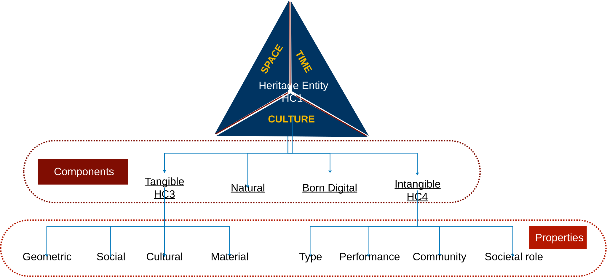2.5. HDTO Fundamental Concepts

Figure 6. Conceptual structure of an HDT.

The ontology introduces a structured conceptual framework to represent both CH entities and their corresponding digital representations. The model is organized around two central classes that capture the relationship between real-world CH assets and their digital counterparts: **HC1 Heritage Entity** and **HC2 Heritage Digital Twin**, described in detail [here](https://isl.ics.forth.gr/ontology/echoes/html/HDT_v1.1.html).

<figure>
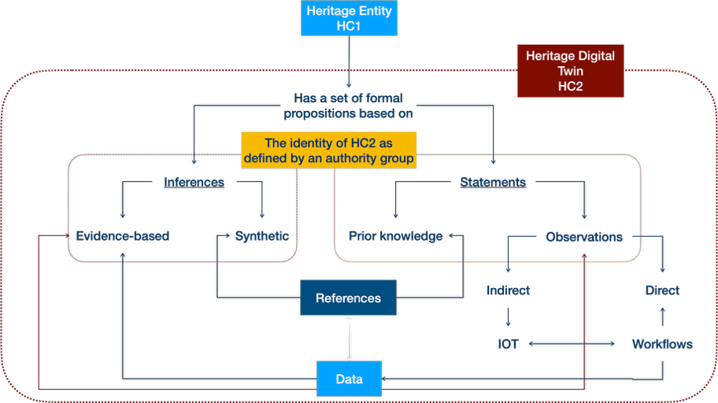
<figcaption>
Figure 7. Core elements of an HDT.
</figcaption>
</figure>

The core class of HDTO, **HC1 Heritage Entity**, represents any real-world entity socially recognized as having cultural, historical, or scientific value. The defining characteristic of a CH entity is not intrinsic to the entity itself but derives from social attribution and cultural recognition. Heritage status is context-dependent, dynamic, and socially constructed. Ontologically speaking, the classification of an entity as heritage can be understood as a role (see DOLCE[^6] ontology). This means that the designation of an entity as heritage[^7] does not alter its identity or persistence conditions; the entity continues to exist independently of its heritage status. Instead, the classification reflects a cultural or institutional attribution applied to the entity.

The assignment of the HC1 Heritage Entity role typically requires the presence of a declaring authority or recognizing community operating within a specific social and temporal context. This recognition may arise through formal processes such as heritage designation policies or through broader forms of community acknowledgement. Consequently, HC1 represents a relationship between an entity and the society that attributes heritage value to it, rather than a strictly intrinsic category. When such a distinct social or institutional context is not relevant, it may be sufficient to describe the entity using more neutral domain categories (for example, building, monument, or manuscript). The absence of the HC1 classification in these cases does not deny potential heritage value but simply reflects the absence of explicit contextual attribution within the model.

The class HC1 Heritage Entity encompasses two primary categories (see also below):

- HC3 Tangible Heritage Entity, referring to physical heritage objects such as monuments, artefacts, buildings, archaeological remains, or cultural landscapes.

- HC4 Intangible Heritage Entity, referring to non-material cultural expressions, including traditions, practices, knowledge systems, and collective cultural memories.

Although tangible heritage entities are primarily material, they often embody significant intangible dimensions, such as symbolic meanings, historical interpretations, or associated cultural practices. Conversely, some heritage entities exist exclusively as intangible cultural expressions. In this sense, HC1 Heritage Entity functions as a socially grounded and context-dependent classification that captures attributed heritage value while preserving the independent ontological identity of the underlying entity. Within the ontology, HC1 also serves as the primary entry point for linking heritage entities to their digital representations through HC2 Heritage Digital Twin (see below).

The class **HC2 Heritage Digital Twin** represents a digital construct that aggregates structured knowledge about a CH entity. Unlike the heritage entity itself, which refers to a real-world phenomenon, the digital twin is an epistemic object whose interpretation may vary depending on perspective, scale, or the actors responsible for its creation.

As a conceptual object, an instance of HC2 is defined by its propositional content and by the actor responsible for its creation or maintenance. Updates to a digital twin do not necessarily eliminate earlier versions; multiple instances may coexist, reflecting different perspectives, documentation processes, or project contexts. The ontology does not assume the intrinsic singleness of a digital twin. If a digital twin is considered singular[^8], this status is defined by a specific actor or institution—often within the scope of a particular project or digital infrastructure. Different digital twins describing the same CH entity may overlap in content, partially share information, or represent different modelling choices. There are no other objective criteria to distinguish a digital twin from another apart from comparing the statements that compose it. Therefore, it is the content of the HC2 rather than its attributes that can be robustly used for identifying it and sharing it unambiguously across contexts.

**HC3 Tangible Heritage Entity** represents physical heritage objects, *e.g.* artefacts, monuments, buildings, archaeological remains or urban complexes. Although primarily material, tangible heritage may embody important intangible dimensions, such as traditions, cultural meanings, or symbolic interpretations associated with it. The digitization of tangible heritage objects is modelled through the CRMdig extension, enabling the representation of digitization processes and the resulting digital surrogates, maintaining a clear distinction between the physical entity and its digital representations.

**HC4 Intangible Heritage Entity** represents non-material cultural expressions such as traditions, practices, rituals, or collective memories. These entities exist through social recognition and community validation rather than through physical form. Their manifestations may occur through events, performances, or practices that demonstrate the living expression of cultural traditions.

The HDTO models various forms of digital representations associated with CH entities. **HC5 Digital Representation** includes digital objects such as images, videos, and other digital files documenting observable aspects of CH entities. This category is further specialized through subclasses. **HC7 Digital Audiovisual Object** represents (audio)visual documentation, *e.g.* photographs, videos, analytical imagery (multi / hyper-spectral), and immersive media such as virtual or augmented reality content. **HC8 3D Model** represents detailed three-dimensional digital models produced through processes such as 3D scanning or digital modelling. These models are treated as distinct digital objects with their own properties describing their creation, format, and technical characteristics.

The HDTO models the production of scholarly knowledge on CH entities. **HC9 Study** represents scholarly activities *e.g.* research, analysis, or documentation. These may occur in diverse SSH domains, in natural or exact sciences. They may produce outputs such as publications, reports, or datasets, which subsequently contribute to the content of an HDT. Studies may also form sequences of related research activities that collectively build a comprehensive understanding of a CH entity.

The social and institutional processes through which heritage value is recognized are represented as well here. **HC10 Heritage Valuation** represents the recognition by communities or institutions that a specific CH entity possesses heritage value. This recognition is an institutional and social fact that persists over time until it is revoked, forgotten, or rendered obsolete. The formal act of designating an entity as heritage is modeled by **HC12 Heritage Declaration Event**, which represents official decisions taken by authorities or committees according to established procedures and criteria, such as national or international heritage listings.

Digital heritage knowledge is often generated and maintained by organized collaborative frameworks. **HC13 Project** represents coordinated activities of institutions or research groups to produce heritage-related outcomes. Within these, **HC11 Digital Twin Maintenance** activities represent the processes through which HDTs are created, updated, and curated. These activities integrate knowledge produced by studies and ensure that the digital twin remains coherent and traceable to reliable sources.

To support the management of digital information, the ontology distinguishes between different categories of digital objects. **HC14 Volatile Digital Object** represents digital resources whose content may change over time, such as heritage digital twins or other evolving digital datasets. These objects may generate snapshots that capture their state at a specific moment in time. Such snapshots are represented by **HC15 Persistent Digital Object**, which are stable digital objects defined by fixed content and identifiable creation moments. Persistent digital objects may contain structured knowledge units known as **HC16 Heritage Proposition Sets**, which represent formally encoded sets of propositions describing heritage-related knowledge. These proposition sets constitute the persistent building blocks that can be aggregated and updated within digital twins.

### 2.6. HDTO Property [Declaration](https://isl.ics.forth.gr/ontology/echoes/html/HDT_v1.1.html) 

The HDTO defines a set of semantic properties that establish relationships between CH entities, their digital twins, narratives, studies, and digital documentation processes. These extend the CRM model and its extensions to support the representation and management of CH knowledge within digital infrastructures. Through these relationships, the HDTO describes how heritage entities are digitally represented, interpreted through narratives, investigated through scholarly research, socially valued, and maintained over time within HDT’s environments.

A central group of properties defines the relationship between CH entities and their digital twins. The property **HP1 has digital twin links** a CH entity with a corresponding digital twin that aggregates structured knowledge about it. This relationship forms the fundamental connection between real-world CH entities and their digital counterparts within the system. **HP3** **is digital twin component of** enables the hierarchical organization of digital twins, allowing the digital twin of a specific asset to be part of a larger digital twin representing a city, archaeological site, or cultural landscape.

The ontology also includes properties that link CH entities to digital representations generated by digitization processes. The property **HP9 is visual representation** that connects observable entities with digital audio-visual objects such as photographs, scans, or other visual documentation. Similarly, **HP21** **is 3D representation output of** associates CH entities with 3D models produced through scanning or digital modelling techniques. At a more general level, **HP22** **represents** connects digital representations with the observable entities they depict. Together, these properties describe various forms of digital documentation that may contribute to the content of an HDT.

Another group of properties addresses the narrative and interpretative dimension of CH entities, associated with stories, historical accounts, etc. The property **HP2** **has story** links CH entities with narratives describing their historical development, cultural meaning, or symbolic significance. **HP4** narrates connects a narration work with the narrative it expresses, following the conceptual distinctions of the FRBR model. The property **HP8** **is narrated in document** associates narratives with the symbolic objects or documents in which they are recorded. **HP10** tells about links narratives to events they describe, enabling the representation of historical and mythical events in CH narratives.

The ontology captures relationships between tangible and intangible heritage. Many physical heritage entities embody associated intangible cultural practices or meanings. **HP5** has intangible heritage entity links tangible heritage objects with related intangible heritage elements such as traditions, rituals, or symbolic values. The property **HP6** **has manifestation event** connects intangible heritage entities with events through which they manifest in the physical world, such as festivals or ritual performances. Conversely, **HP7** **is manifestation of** links tangible heritage entities with the intangible cultural practices they physically express or materialize.

The social recognition of heritage value is represented through a set of properties related to heritage valuation. **HP14** **values** connects an instance of heritage valuation with the heritage entity that is being recognized as valuable. **HP12** **regards as origin** identifies the community or group that regards the heritage entity as part of its cultural origin or identity. **HP13** **had target** identifies the communities expected to recognize or value the heritage designation. To simplify these relationships, **HP15** **is heritage of** directly links a heritage entity with the community for which it constitutes heritage, summarizing the valuation process. The HDTO models heritage declaration events, which represent formal acts recognizing heritage value. **HP16** **initiated** links a heritage declaration event to the valuation process it triggers; **HP17 terminated** links a declaration event to the termination of a heritage valuation. These relationships allow the HDTO to represent the temporal lifecycle of heritage recognition, including processes such as listing or de-listing heritage sites.

A crucial aspect of the HDTO is the creation and maintenance of HDTs. Digital twins evolve over time as new information becomes available. **HP18 has documented** links digital twin maintenance activities with the heritage entities being documented. **HP19** **has composed** associates maintenance activities with the digital twin objects they create or update. **HP20** **was carried out under** links maintenance activities to the projects within which they take place. **HP27** **used content of** identifies documents or research outputs used as sources during the creation / update of a digital twin.

The ontology supports the representation of scientific studies and research activities related to heritage entities. **HP23** **was about** connects a study with the heritage entities it investigates. **HP24** h**as disciplinary focus** identifies the disciplinary perspective of the study, such as conservation, archaeology, or anthropology. **HP25** **has created studies** links with the documents or publications they produce. When a study focuses on specific elements of a heritage entity, **HP26** **studied** precisely links the study with actors, events, or items investigated.

Another important group of properties supports version control and content evolution within digital twins. HDTs aggregate structured knowledge units known as heritage proposition sets. **HP30** added content records the addition of proposition sets to a digital twin during maintenance activities, while **HP31** **deleted content** records their removal when superseded by updated knowledge. **HP32** **replaced** links proposition sets that replace earlier versions. The property **HP33** **contains** associates a digital twin with currently valid proposition sets, while **HP34** **contained** links it to earlier versions that remain preserved for scholarly reference. These mechanisms ensure traceability and preserve the historical integrity of digital heritage knowledge.

Finally, the HDTO includes properties supporting digital object management. **HP28** **has snapshot** links volatile digital objects, whose content may change over time, with persistent digital objects that capture their state at a specific moment. **HP29** **has digital object part** describes structural relationships between digital objects and their components. Overall, the HDTO property structure provides semantic relationships required to connect heritage entities with digital representations, narratives, research activities, valuation processes, and evolving digital documentation. These relationships enable a systematic organization and traceability of heritage knowledge within digital infrastructures and support the creation and long-term maintenance of HDTs.

Figure 8: The observation of a crack by measuring temperature and crack width.

Figure 9: Entities in Sensor Things API Standard.

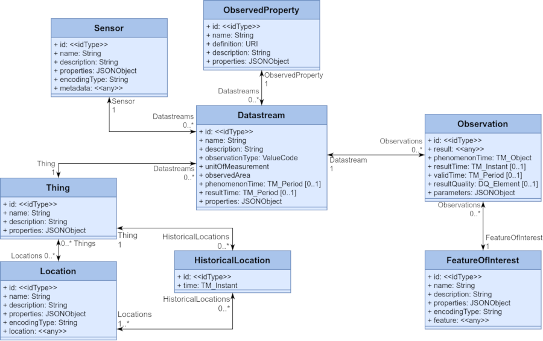

A complementary challenge in enriching the HDT is the link between the virtual realm of digital data and the physical world, through updates coming from IoT (Internet of Things) sensors, primarily useful in monitoring environmental conditions around heritage assets and the assessment of various natural / anthropogenic agents’ impact on them. For example, SensorThings provide Time Series Data on a variety of aspects related to the above – in the adjacent picture, one can observe changes in wall cracks due to changes in the temperature.

Image 2. Entities in Sensor Things API Standard.

The Open Geospatial Consortium (OGC) develops standards for describing such data; image 2 depicts schematically the OGC Sensor Things API Standard, transformable in json data formats. Common STA entities are: \[a\] Thing; \[b\] Location; \[c\] ObservedProperty; \[d\] Sensor; \[e\] Datastream and \[f\] Observation (+FeatureOfInterest). Consequently, we defined a mapping between the common STA entities and the HDTO or CIDOC CRM family classes depicted in Table 1.

| **OGC Sensor Things API Standard** | **HDTO/CIDOC CRM family class/property** |
|----|----|
| Thing | hdto: HC1 Heritage Entity, crm:E70 Thing |
| Location | crm: E53 Place |
| ObservedProperty | crmsci:O8 observed: crmsci:S15 Observable Entity or crmsci:O9 observed property type: crmsci:S9 Property Type |
| Sensor | crmdig: D8 Digital Device |
| Datastream | crm:E73 Information Object (Result of a sparql query) |
| Observation | crmsci: S4 Single Observation |
| FeatureOfInterest | crm: E55 Type or crmsci:S15 Observable Entity crmsci: S9 Property Type or crm:E70 Thing |

Table 1. Mapping the OGC Sensor Things API Standard entities to HDTO and CIDOC CRM family classes.

## 3. The HDTO in action – an example 

<figure>
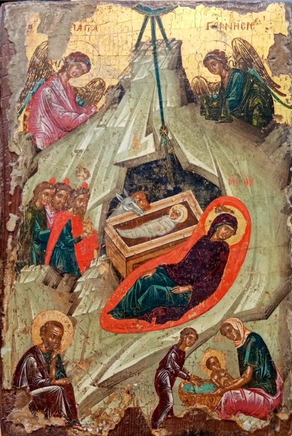
<figcaption>
Figure 10. The Deryneia icon.
</figcaption>
</figure>

The text below demonstrates the applicability of the HDTO for documenting a multi-disciplinary study, published extensively here[^9], and summarised below. The research focuses on the study of a linseed oil/tempera and gold on wood panel icon originating from Deryneia (Cyprus), measuring 23 x 34 x 6 cm. Its iconography depicts the birth of Christ and belongs to the broader “Nativity” theme. The icon was painted by an unknown author with an estimated date based on style, sometime in the 16th century. It comes from the Church of the Virgin Mary in Deryneia, Cyprus, with a possible alternative provenance of the small 15th-16th century church of St. George, in the same town. There are no written records on previous restorations or on its ownership history. The icon maintains most of the traditional features of a Byzantine “Nativity” icon, although it omits the depiction of the shepherds and the devil, common elements in other icons of the same type. It is part of a series of twelve icons representing the twelve Great Church Feasts in the liturgical calendar of the Orthodox Church (the so-called Dodekaorton).

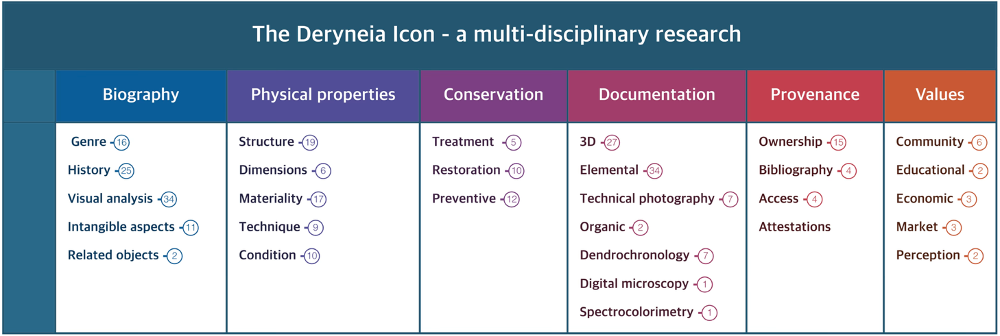The main research questions were \[a\] **art historical** – to describe the materiality of the icon and assess its provenance, to understand the style of painting technique, to identify possible overpaints and to position the icon in the broader synthetic research on Byzantine icons in Cyprus; \[b\] **conservation** – to identify the pigments used, to identify possible restorations and positions them in a timeframe and to characterize the painting’s integrity and deterioration conditions. To achieve these goals, an art historical study, based on visual analysis, aimed to define its descriptive principles (its composition, organisational patterns, colours, light and symmetry), the history of the icon, in terms of history of its ownership and its possible mention in written sources, its historiography and social aspects related to its intangible attributes and to reconstruct the context of the icon, described through its style, typology, location. The interpretative process focused on providing explicatory narratives contextualizing in the present the 16th century icon, its cultural meaning and its intangible values.

Figure 11. The main components of the Deryneia icon’s knowledge graph.

A complementary heritage sciences investigation, based on dendrochronology, to identify the wood species and its possible cutting date and on imaging techniques, namely hyper-spectral imaging (obtained with a multi-modal scanner, with x-ray fluorescence (XRF), reflectance imaging (RIS) and luminescence (LIS)), digital microscopy and infra-red imaging aimed to identify pigments used and to describe how they were applied by the painter and by conservator(s) / restorer(s) in recent times. A dedicated scientific visualization platform was built as well, to spatially position all analytical and imaging data collected within a single spatial xyz space, delineated by the 3D model of the icon.

The HDT provides a single semantic descriptive framework for documentation data related to the scientific processes described above. We define here a knowledge graph that helps navigate between interpretative statements on the investigated icon, the reasoning processes behind them and the data on which they were based. The base is a common descriptive framework (an extendable knowledge graph) for painted artworks, which includes six principal nodes and their components. These cover descriptions of the tangible as well as intangible aspects of the artwork, such as its biography and the related art historical research, its physical properties, aspects related to its conservation, the methods applied for its documentation and the generated data and results (representing in this way both the data provenance and the scientific processes for obtaining them), the provenance of the artwork, including history of its ownership, exhibitions, publications and other attestations and finally a category named values which aims at capturing its risks of being illegally trafficked, its religious and community values and its potential re-use in education or by creative industries

<figure>
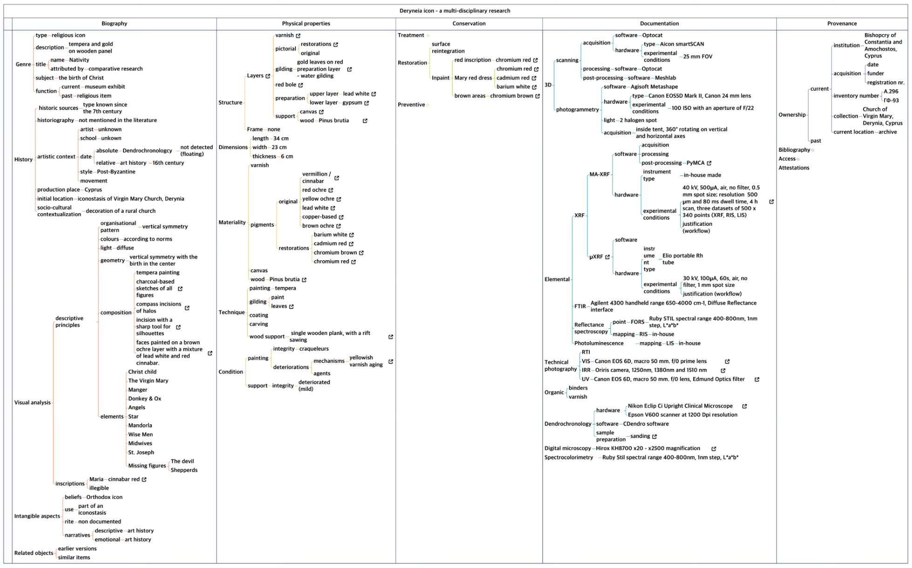
<figcaption>
Figure 12: The complete knowledge graph describing the research activities on the Deryneia icon.
</figcaption>
</figure>

The knowledge construction process builds on inferences deriving from formally described observations and the statements derived from them, based on reproducible workflows, using data that is presented in an accountable and transparent way and is described by the HDTO, as shown below.

<figure>
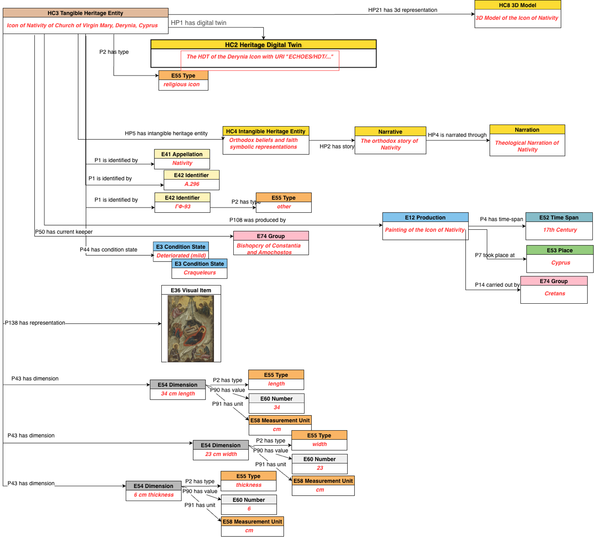
<figcaption>
Figure 14. The heritage entity Deryneia icon as represente d by the HDTO’s main classes.
</figcaption>
</figure>

<figure>
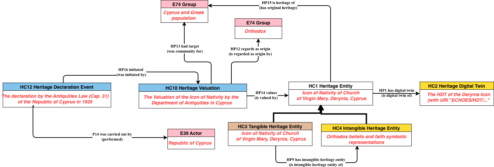
</figure>

Figure 15. The valuation of the HC1 heritage entity Deryneia icon.

<figure>

<figcaption>
Figure 16. The study of the HDT Deryneia icon, with its main HDTO classes.
</figcaption>
</figure>

Finally, the three consequent diagrams describe the entirety of the HDT of the Derenyia icon:

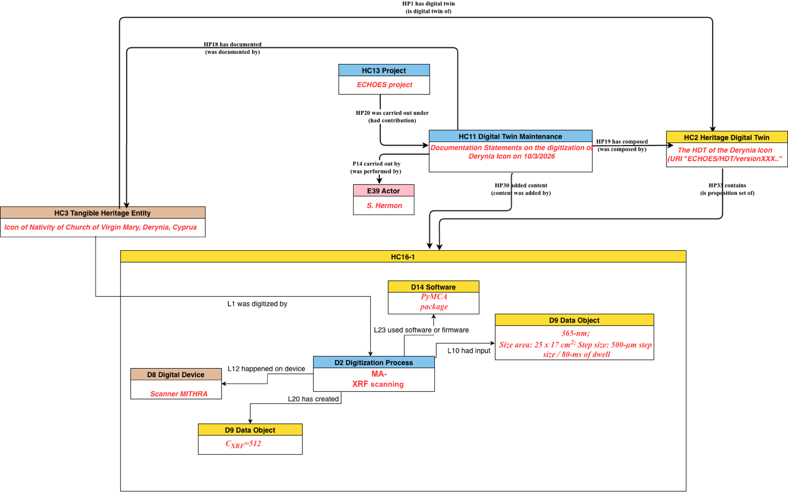

<figure>

<figcaption>
Figure 17. The maintenance of the Deryneia icon, as represented by the HDTO classes.
</figcaption>
</figure>

<figure>
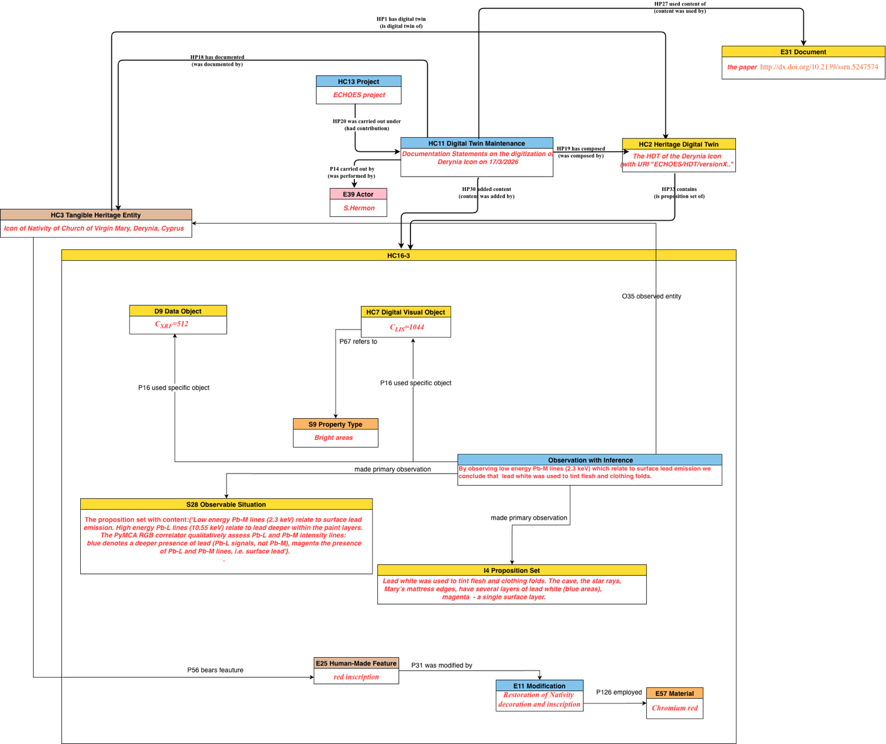
<figcaption>
Figure 18. The maintenance of the Deryneia icon, as represented by the HDTO classes (cont. from <a href="#_Ref230624864">Figure 17.</a>)
</figcaption>
</figure>

## 4. Detailed description of the HDTO

### 4.1. Class declaration 

At this page <https://isl.ics.forth.gr/ontology/echoes/html/HDT_v1.1.html> you can navigate** t**hrough Classes & Properties declarations of version 1.1 by:

- Scrolling up/down the current page.

- Using the hyperlinks defined for each Class or Property identifier (e.g. [HC1](https://isl.ics.forth.gr/ontology/echoes/html/HDT_v1.1.html#HC1) Heritage Entity).

- Using the control located at the upper-right corner of this page (Click on 'Navigate to a section' text). Type any part of the Class or Property full name, and press Enter or select the preferred option to be automatically navigated to the relevant declaration.

#### HC1 Heritage Entity

Subclass of: crm:E70 Thing

Superclass of: HC3 Tangible Heritage Entity

> HC4 Intangible Heritage Entity

Scope Note:

> The class comprises tangible and intangible CH entities of the real world declared as valuable because of their contribution to society, knowledge and/or culture. The value that a heritage entity acquires is relative to the society and culture that assigns it each time. Instances of HC1 Heritage Entity constitute real assets of any nature: physical, movable and immovable, immaterial, or born digital. They may also constitute types or patterns of specific cultural events, traditions and practices, typical of the intangible heritage that should be documented with their features and their extent in space and time. Individual events can be associated to specific instances of HC1 Heritage Entity and be related via their types or patterns to an instance of HC1 Heritage Entity. An instance of HC1 can be considered as the focal item for aggregating the content of its corresponding HC2 Digital Twin instance.
>
> Parts of an instance of HC1 Heritage Entity may constitute Heritage Entities in their own right, such as a temple within an archaeological site.

Examples:

> the Knossos Palace (HC1), part of the Knossos WH archaeological site (HC1)
>
> the “Palio di Siena”
>
> the Stonehenge Complex, a WH site (WH denoting is “world heritage” value)
>
> The Dresden Elbe Valley

Properties:

> HP1 has digital twin (is digital twin of): HC2 Heritage Digital Twin
>
> HP2 has story (is story about): nont:Narrative
>
> HP15 is heritage of (has original heritage): crm:E74 Group

#### HC2 Heritage Digital Twin

Subclass of: HC14 Volatile Digital Object

Superclass of:

Scope Note:

> The class comprises aggregates of sets of formal propositions related to an instance of HC1 Heritage Entity documented as single units and serve a specific purpose (formally declared) about the latter. Characteristically, the collected sets of propositions may relate information available in a given system including digital visual representations (e.g. 3D models, images, videos), textual descriptions (e.g. digital documents, narrations or stories), information of the effects or images of events that influenced or/and are related to the state of the Heritage Entity (e.g. earthquakes, floods) and of activities (e.g. restorations, conservations etc.) carried out on it. In other words, it is the aggregation of all (or a selected set of) named graphs that contain formal assertions about or related to the HC1 Heritage Entity. It is the corpus of all (or a set of) named graphs (instances of E73) that contain statements related to the heritage entity.
>
> In the context of a defining project or authority, every instance of HC2 Heritage Digital Twin should be linked to one instance of HC1 Heritage Entity and is valid for a specific timespan. It aims to provide an archive of the documented history, traits and social relationships of the corresponding HC1 Heritage Entity. However, there may be multiple instances of HC2, created by different projects, that may overlap or include each other as they are related to the same HC1. The creation of an instance of HC2 depends on the valuation of a heritage entity, since the classification of an item as heritage entity itself primarily depends on the valuation.
>
> An instance HC2 Heritage Digital Twin is composed of one or more (persistent) instances of HC16 Heritage Proposition Set, which may be added to, deleted from, or replaced in the Digital Twin at any point in time via distinct actions that are each an instance of HC11 Digital Twin Maintenance. HC2 is thus a subclass of HC14 Volatile Digital Object **(**as per the **Parthenos Entity Model**[^10]**.**. All information referred to in the content units having constituted a Digital Twin at any point in time should be traceable back to persistent (“fixed”), **citable** or at least permanently accessible documents, which the respective studies should anyhow independently have provided according to scientific practice.

Examples:

the HDT of the Pisa Leaning Tower, containing a 3D survey project done by CNR

> the HDT of the Knossos Palace, aimed for its conservation
>
> the HDT of the Florence Historical Centre, to delineate specific historic neighborhoods’

Properties:

> HP3 is digital twin component of (has digital twin component): HC2 Heritage Digital Twin
>
> HP33 contains (is proposition set of): HC16 Heritage Proposition Set
>
> HP34 contained (is former proposition set of): HC16 Heritage Proposition Set

#### HC3 Tangible Heritage Entity

Subclass of: HC1 Heritage Entity

crm:E18 Physical Thing

Superclass of:

Scope Note:

> This class comprises tangible, material entities of the real world, movable objects (*e.g*. artistic, archaeological, or cultural) and immovable (built heritage e.g. buildings monuments, cities etc.), regarded as valuable because of their contribution to society, knowledge and/or culture. The “tangible” term here does not exclude that its instances can be associated with an intangible heritage entity, specified through the HP5 has intangible heritage entity property.
>
> The digitization of an HC3 is represented by crmdig:L1i was digitized by crmdig:D2 Digitization Process inherited by CRMdig.

Examples:

the Neptune Fountain in Bologna (Italy)

> the Pisa Leaning Tower
>
> the Nike of Samothrace of the Louvre Museum in Paris (France)

Properties:

> HP5 has intangible heritage entity (is intangible heritage entity of): HC4 Intangible Heritage Entity

HP7 is manifestation of (is manifested by): HC4 Intangible Heritage Entity

#### HC4 Intangible Heritage Entity

Subclass of: HC1 Heritage Entity

crm:E89 Propositional Object

Superclass of:

Scope Note:

> This class comprises expressions and declarations of cultural events, specific communication means, traditions and practices having particular social, historical and cultural significance, including practices and expressions, memories and oral traditions about events, things, people. An Intangible Heritage Entity is identified by a society or by evidence or other kind of manifestations. The identity of an Intangible Heritage Entity results from an agreement and a validation made by a group of people for a specific timespan.

Examples:

the Mediterranean diet

the whistle language of mountain communities in Turkey

the Rebetiko music tradition

Properties:

HP6 has manifestation event (event is manifestation of): crm:E5 Event

#### HC5 Digital Representation

Subclass of: crmdig:D9 Data Object

Superclass of: HC6 Sensor Data

HC7 Digital Audiovisual Object

> HC8 3D Model

Scope Note:

> This class comprises the digital representations of an crmsci:S15 Observable Entity, representing the HC3 Tangible Aspect of an HC1 Heritage Entity or tangible parts of the latter, such as images, 3D models audio or video items of objects, sites, scenes or paper documents. Instances of HC5 Digital Representation constitute documents in the sense of crm:E31 Document and inherit its properties.
>
> To document pieces or collections of digital, non-visual documents, born-digital or digitized physical, real-world ones, typically containing textual or information regarding an HC1 Heritage Entity and intended to be referred to or to become part of the related HC2 Heritage Digital Twin, use the more general class of crm:E31 Document.
>
> For scientific data or audio-visual documents, including video and digital 3D models, use the more specific classes of this model - HC7 Digital Audiovisual Object and HC8 3D Model.

Examples:

The digital version of Vasari’s “Vite”

The video <https://www.youtube.com/watch?v=P1Uv4Zf5xKk>

The Pafos Gate laser scanning 3D model

Properties:

HP22 represents (has digital representation): crmsci:S15 Observable Entity

#### HC6 Sensor Data

Subclass of**:** HC5 Digital Representation

Superclass of:

Scope Note:

> This class comprises sensor-based digital representations of a crmsci:S15 Observable Entity. Primarily, this class is used for documenting various sensor data types, gathered in real-time or in processing stages, associated with HC1 Heritage Entities. Typical examples include temperature readings, air quality indices from environment sensors, or real-time heritage site monitoring data acquired via IoT applications or imported from tabular data sources. This class provides a format-agnostic abstraction layer that accommodates both standardized API-based sensor data (per OGC SensorThings API) and legacy tabular formats (CSV). Instances of this class often contribute to HC2 Heritage Digital Twins and inherit properties from crm:E31 Document.

Examples:

> Knossos site temperature data collected via DS18B20 temperature sensor
>
> Environmental sensor data of 2025 about air quality surrounding Pisa Leaning Tower UNESCO monument.

Properties:

HP38 is sensor representation of (has sensor representation): crmsci:S15 Observable Entity

#### HC7 Digital Audiovisual Object

Subclass of: HC5 Digital Representation

Superclass of:

Scope Note:

> This class comprises digital visual objects, such as photos, videos, special imagery (*e.g.* hyper spectral, X-ray images, chemical-physical spectra, etc.), intended to become part of the HC2 Heritage Digital Twin of an HC1 Heritage Entity. Digital documentation of this kind can be born digital or digitised from physical objects (such as paper photographs, drawings and so on). Other examples are Virtual Reality (VR), Augmented Reality (AR) models, other types of visual digital artefacts pertaining to a HC1 Heritage Entity. Both VR and AR products rely on 3D models of the related heritage entity, but may content additional information, unrelated to the current state of the heritage entity, hence their differentiation from 3D models.

Examples:

> The digitized photo of the Tower of Pisa, taken by Paolo Monti in 1960 and [published in Europeana](https://api.europeana.eu/thumbnail/v2/url.json?uri=http%3A%2F%2Fatena.beic.it%2Fwebclient%2FDeliveryManager%3Fpid%3D6363979%26custom_att_2%3Ddeeplink&type=IMAGE).

Properties:

HP9 is visual representation of (has visual representation): crmsci:S15 Observable Entity

**HC8 3D Model**

Subclass of: HC5 Digital Representation

Superclass of:

Scope Note:

> This class is used to describe in detail the 3D model of HC1 Heritage Entity and is intended as a particular crmdig:D1 Digital Object having its definite identity and resulting from operations such as digitization, acquisition, processing and other actions typical of the three dimensional modelling world (e.g., 3D scanning, wireframe modelling, etc.). The particular features of a 3D model (e.g., its type, format, resolution, size) and its relationships with the series of activities carried out for its creation and manipulation are modelled through the properties inherited from its superclass HC5, which in turn inherits from crmdig:D1 Digital Object, and through the other classes and properties of CRMdig.
>
> Specifically, the information regarding the creation of a 3D model as a result output of a digitisation process can be documented using the property path from crmdig crmdig:D2 Digitization Process *crmdig:L20 has created* HC8 3D Model and respectively information regarding the digitisation of the material object is represented by crm:E18 Physical Thing *crmdig:L1i was digitized by* crmdig:D2 Digitization Process.

Examples:

> The 3D model of the Neptune Fountain produced by ISTI-CNR as part of the documentation used for the restoration of the Fountain in Bologna (Italy). <https://www.cnr.it/en/focus/074-43/3d-supported-restoration-the-neptune-fountain-inbologna>

Properties:

HP21 is 3D representation output of (has 3D representation): HC1 Heritage Entity

**HC9 Study**

Subclass of: crm:E65 Creation

Superclass of:

Scope Note:

> This class comprises activities of analysing heritage entities or other material and immaterial items or events related to heritage entities and studying their relevant contexts throughout the past, with the purpose of revealing and documenting their nature and significance for past, current and future societies, as well as preserving themselves and the knowledge about them. The results of an instance of HC9 Study may be in the form of a scientific or scholarly publication or a dataset.
>
> Characteristically, instances of HC9 study occur in units given by specific scientific domain aspects or skills, such as history of art, conservation history, isotope dating, and so forth. Ideally, the study of the different discipline aspects should inform and provide arguments for each other. For instance, techniques or materials identified by conservation science may allow to narrow down time and area of production for an art history study, or historical knowledge may help excluding certain materials during the interpretation of chemical analysis.
>
> Instances of HC9 Study may directly relate to the execution of a particular scholarly workflow aiming at systematically planning, finding or initiating studies and collecting their results until they cover all disciplinary aspects intended by a respective project. The progress of such a workflow, constituting an intentional sequence of activities and a coherence of outcomes of the involved activities, can be documented by the inherited crm property “*P134 continued (was continued by)”* between instances of HC9 Study.
>
> The results of an instance of HC9 Study should be documented in a persistent, citable or at permanently accessible form according to scholarly and scientific practice, independently from being represented partially or completely in an instance of HC2 Digital Twin.
>
> If an instance of HC9 Study occurs in the framework of an instance of **HC13 Project**, the relationship should be documented with the property *crm:P9 consists of (forms part of)*, such as “The creation of the 3D reconstitution of the Tour de Choeur of Notre-Dame de Chartres cathedral (HC9) *forms part of* The ChArtRes project (HC13)” or with the property crm:*P17 was motivated by (motivated),* if the HC13 Project is seen as reason for carrying out the study.
>
> The realization of a HC9 Study on an object should trigger a HC10 Heritage Valuation Event if no valuation from institutions or communities was previously documented. The interest from the community and the results of the study are proof of valuation of the object as an HC1 Heritage Entity, which may lead to a proper declaration (HC12 Heritage Declaration Event). A different HC9 Study may terminate the declaration of the object as an HC1 Heritage Entity due of its results.

Examples:

> The Heritage Science research on the Portrait of Caterina Cornaro.
>
> The multi-dimensional documentation of the restoration of the Notre-Dame cathedral.
>
> The filming of archaeological excavations at the Sobibor extermination camp
>
> The study of ornaments on the Tour de Choeur of Notre-Dame de Chartres cathedral
>
> The studying of neurological effects of the sound of Aztec death whistles on the human brain
>
> The analysis and measurement made to produce the 3D reconstitution of the Tour de Choeur of Notre-Dame de Chartres cathedral

Properties:

HP23 was about (was subject of): HC1 Heritage Entity

HP24 has disciplinary focus (is aspect of): crm:E55 Type

HP25 has created (was created by): crm:E31 Document

HP26 studied specifically (was studied by): crm:E1 CRM Entity

<figure>
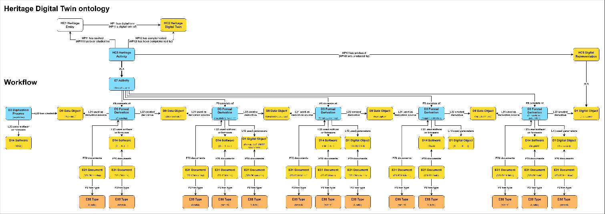
<figcaption>
Figure 19. The HDT ontology.
</figcaption>
</figure>

<figure>

<figcaption>
Figure 20. HDT ontology - details.
</figcaption>
</figure>

<figure>

<figcaption>
Figure 21. HDTO example (cont.)
</figcaption>
</figure>

#### 

#### HC10 Heritage Valuation

Subclass of: crm:E2 Temporal Entity

Superclass of:

Scope Note:

> The class comprises the characterizations of instances of E70 Thing as instances of HC1 Heritage Entity. An Instance of HC10 constitutes an institutional fact, i.e., it comes into being by declaration of a competent authority and a related community respecting it. It ends with the loss of the heritage entity value, termination of its status by the declaring authority or loss of respect of the declaration or declaring authority by the related communities.
>
> An instance of Heritage Valuation will characterize the Heritage Entity as being heritage in the narrower sense of a local community which created it and/or for which it constitutes its active tradition, object of tradition or believe system.

Examples:

> The valuation of the Dresden Elbe Valley in Germany in March 2004 by ICOMOS (2003)

Properties:

> HP12 regards as origin (is regarded as origin by): crm:E74 Group
>
> HP13 had target (was community for): crm:E74 Group
>
> HP14 values (is valued by): HC1 Heritage Entity

#### HC11 Digital Twin Maintenance

Subclass of: crm:E65 Creation

Superclass of:

Scope Note:

> The class comprises the documentation of information about a heritage entity in the form of knowledge representation statements, to create or to maintain an instance of HC2 Heritage Digital Twin, that aims to represent or to link to the knowledge on this entity from related studies and their provenance. Such knowledge is typically the result of an instance of HC9 Study. The collection as a Digital Twin is carried out on behalf of a project which maintains a consistent and coherent knowledge base contributed by such studies.
>
> Since instances of HC2 Heritage Digital Twin are volatile objects in the sense of the **Parthenos Entity Model,** care should be taken that all information in the Digital Twin can be traced back to persistent (“fixed”), citable or permanently accessible documents, which the respective studies should anyhow independently have provided as per scientific practice.
>
> Instances of HC11 Digital Twin Maintenance should directly relate to the execution of a specific scholarly workflow aiming to systematically plan, find or initiate studies and collect their results until they cover all disciplinary aspects intended by a respective project.

Examples:

The Deryneia icon Digital Twin Creation by CyI

Properties:

HP18 has documented: HC1 Heritage Entity

HP19 has composed (was composed by): HC2 Heritage Digital Twin

> HP20 was carried out under (had contribution): HC13 Project
>
> HP27 used content of (content was used by): crm:E31 Document
>
> HP30 added content (content was added by): HC16 Heritage Proposition Set
>
> HP31 deleted content (content was deleted by): HC16 Heritage Proposition Set

#### HC12 Heritage Declaration Event

Subclass of: crm:E13 Attribute Assignment

Superclass of:

Scope Note:

> The class comprises statement activities that lead to the identification and declaration of instances of E70 Thing as instances of HC1 Heritage Entity heritage entity because of their accepted value and contribution to society, knowledge and/or culture. They are activities carried out by legal committees and authorities that decide, report and designate heritage entities following a guideline and specific criteria.

Examples:

> The UNESCO listing of the Dresden Elbe Valley in 2004 (Decision 28 COM 14B.40 [- Nominations of Cultural Properties to the World Heritage List (Dresden Elbe Valley 2004)](https://whc.unesco.org/en/decisions/123)
>
> The UNESCO de-listing of the Dresden Elbe Valley in 2009 (<https://whc.unesco.org/en/list/1156>, UNESCO World Heritage News 2009).

Properties:

> HP16 initiated (was initiated by): HC10 Heritage Valuation
>
> HP17 terminated (was terminated by): HC10 Heritage Valuation

#### HC13 Project

Subclass of: crm:E7 Activity

Superclass of:

Scope Note:

> The class comprises instances of collaborative enterprise activities over a time period intended to produce outcomes by to a plan defined by a consortium or a responsible organization/group.
>
> An instance of a Project comes into being with the formation of an instance of a Group acting as a team whose aim it is to carry out and maintain the project.
>
> An instance of this class may be documented partially already at initiating time, i.e., the activity is expected to continue in the future. As work continues, the instance will accumulate more property instances until it is finished. Note that the future evolution may cause ambiguous identity conditions from some time on. At this point in time, the activity should be declared finished and be reinitiated unambiguously. (Therefore, activities expected to continue in the future are not in the scope of the CIDOC CRM in the narrower sense).

Examples:

> The ECHOES project 2024-2029
>
> Project Notre-Dame
>
> Project ESPADON
>
> SilkNow

Properties:

#### HC14 Volatile Digital Object

Subclass of: crmdig:D1 Digital Object

Equivalent to crmpem:PE20 Volatile Digital Object

Superclass of: HC2 Heritage Digital Twin

Scope Note:

> This class comprises instances of a digital object whose content is subject to continuous change, not requiring specific notification or archiving of intermediate state, but which can be considered as one and the same with regards to its provenance, curating authority and the curation plan that determines its information, goal and subject coverage. The curating authority is responsible for assigning a unique identifier of an instance of HC14 Volatile Digital Object and a link to its current content.
>
> The content of an instance of HC14 Volatile Digital Object can be anytime identified with a snapshot of the current state of the content, an instance of HC15 Persistent Digital Object taken by the responsible curating authority. This forms a version of previous snapshots taken from the same instance of HC14 Volatile Digital Object. The curator may assign a persistent identifier to a snapshot and is the only one who can identify a true representative snapshot. Reference to content of an instance of PE20 Volatile Digital Object is by official snapshots.

Examples:

The Deryneia icon Digital Twin

The Archive of Archaeological Data Service UK Archaeology Data Service: Archives, n.d.

The source code of development of X3ML

Properties:

> HP28 has snapshot (is snapshot of): HC15 Persistent Digital Object
>
> HP29 has digital object part: crmdig:D1 Digital Object

#### HC15 Persistent Digital Object

Subclass of: crmdig:D1 Digital Object

Equivalent to crmpem:PE19 Persistent Digital Object

Superclass of: HC16 Heritage Proposition Set

Scope Note:

> This class comprises instances of digital objects that are the result of a distinct creation moment in which the entirety of the digital object’s content was established and encoded at bit level, whether the creation moment is known or not. Persistent digital objects are identified by their content, bit level encoding and moment of production as a whole unit of information.
>
> An instance of persistent digital object continues to exist as long as one copy of it remains on one carrier which has been maintained without change to its internal content, thus propagating the original condition of the instance.

Examples:

Submitted copy of ECHOES deliverable 7.1 in Microsoft Word format

Themas version 1.1 (ICS - THEMAS - Thesaurus Management System, n.d.)

Properties:

#### HC16 Heritage Proposition Set

Subclass of: crminf:I4 Proposition Set

> HC15 Persistent Digital Object

Superclass of: HC18 Provenance Statement

Scope Note:

> The class comprises content units defined as sets of propositions that are formally encoded in a knowledge representation language. The identity of an instance of HC16 Heritage Proposition Set depends on the total of contained propositions, regardless of equivalent encodings. In a Knowledge Base implementation, an instance of HC16 Heritage Proposition Set may be represented by the URI of a Named Graph comprising its propositions and/or by an external file with a representative encoding of its content.

Examples:

The proposition set (Namegraph URI) with content:{'The Derynia Icon of Nativity' (HC3)

> P2 has type: 'religious icon' (E55 Type) P108 was produced by: 'Painting of the Nativity' (E12 Production) P50 has current keeper:'Bishopcry of Constantia and Amochostos '(E74 Group) P1 is identified by: 'Nativity' (E41 Appellation).}

Properties:

HP32 replaced (was replaced by): HC16 Heritage Proposition Set

#### HC17 Observation with Inference 

Subclass of:

crmsci:S27 Observation

crminf:I5 Inference Making

Scope note:

> This class comprises propositions making activities and statements on material states of affairs of reality through directly related inference from the primary result of an observation. This class is designed as a modelling convenience for the frequent case when the primary result of an observation is used in the same context of activity by the same Actor for an inference on the purpose of the observation providing the most relevant conclusion. The primary result and the conclusions should be expressed as sets of formal propositions regarded as true.
>
> Besides all properties of I5 Inference Making being applicable to instances of this class, one of the premises implicitly links to the range of the instance of the property HP35 made primary observation: S28 Observable Situation as being true. Thereby, a complex connection between the observation and the inference is a shortcut, without losing the distinction between primary observation and direct interpretation.

Examples:

> The observation of low energy Pb-M lines (2.3 keV) which relate to surface lead emission with conclusion on that lead white was used to tint flesh and clothing folds in 2025.

Properties:

HP35 made primary observation (was observation of): crmsci:S28 Observable Situation

#### HC18 Provenance Statement 

Subclass of: HC16 Heritage Proposition Set

Equivalent to crminf:I10 Provenance Statement

Superclass of:

Scope Note:

> This class comprises statements about the provenance of instances of E70 Thing existing at the time of making the provenance statements. An instance of HC18 Provenance Statement must contain propositions about the presence of the respective instances of E70 Thing in an event or spatiotemporal context of reference.
>
> The class comprises statements on the distinctive meaning of provenance as the declared object’s pedigree, that is, the chain of custody, ownership and display of a cultural object.
>
> In case that only information objects exist describing the proper thing of interest, such as a photo of a lost archaeological object, or a photo of a photo thereof, an instance of HC18 Provenance Statement should contain the relevant chain of intermediate events transferring the information from the proper thing of interest up to the extant information objects considered, or they, at least, should refer to said chain of intermediate events.
>
> The property *HP36* *is about the provenance of (has provenance claim)* can be used to link the instance of Provenance Statement with the proper thing of interest. It is a constraint to the provenance statement that it must contain the description of the relevant context of reference, and, if applicable, to the relevant chain of intermediate events transferring the information.

Examples:

> The provenance statement that “the Chariot of Eretum originates from the chamber tomb XI of Colle del Forno” can be represented with by a set of CRM-compatible propositions: {“The Chariot of Eretum’ (HC3) is embedding of ‘Funeral Deposits’ (A7) is embedding of ‘Chamber tomb XI of Colle del Forno necropolis’ (E24) was object encountered through ‘Tomb Discovery in 1970’ (S19)..}.
>
> The reported museum catalogue’s provenance statement that “The painting YY is documented in XZ family collection until early ‘20s. Gallery XX in 1982; acquired by the museum, Bonhams 1990.” (HC18).

Properties:

HP36 is about the provenance of (has provenance claim): crm:E70 Thing

#### HC19 Provenance Assessment 

Subclass of: crminf:I1 Argumentation

Equivalent to: crminf:I15 Provenance Assessment

Superclass of:

Scope Note:

> This class comprises activities of making arguments and concluding on the likely provenance of instances of E70 Thing existing at the time of the assessment, or about provenance of things referred to or represented by existing information objects, and subsequent references.

Examples:

The assessment by Glyptotek in 1979 about the provenance of the Chariot of Eretum.

> The assessment in the year of the catalogue publication by the museum’s collection manger about the provenance of the “painting YY”.

Properties:

HP37 concluded provenance (was assessed by): HC18 Provenance Statement.

#### HC20 Illicit Removal 

Subclass of: crm:E10 Transfer of Custody

Superclass of:

Scope Note:

> The class comprises activities that involve illegal actions related to CH objects, such as theft, damaging removal, illicit excavation and looting. An instance of HC20 Illicit Removal documents the criminal event, its typology, and any other relevant details that may be associated with the affected heritage object. The class is intended to support the identification of objects subject to illicit trafficking, promote interoperability with existing police registries/databases (e.g., Interpol Works of Art database, Italian Carabinieri TPC Leonardo database, French OCBC Treima database), and provide a basis for legal provenance assessment.

Examples:

> The theft of a painting from a museum (e.g. as reported in the museum registry under the specific artwork entry).
>
> The illicit excavation or looting of an archaeological site (e.g. as reported in archaeological excavations records).
>
> The theft of archaeological findings from an excavation site (e.g. as reported in archaeological excavations records).

Properties:

### 4.2. Property Declaration

#### HP1 has digital twin (is digital twin of)

Domain: HC1 Heritage Entity

Range: HC2 Heritage Digital Twin

Subproperty of:

Superproperty of:

Quantification: one to one (1,1:1,1)[^11]

Scope note:

> This property links an instance of HC1 Heritage Entity with an instance of its related HC2 Heritage Digital Twin in a given system. If a part of a Heritage Entity is described by an instance of Heritage Digital Twin, it implies that this instance of the Heritage Digital Twin is also part of the instance of the Heritage Digital Twin of the composite Heritage Entity.

Examples:

> The Pafos Gate in Nicosia, Cyprus (HC1) *has digital twin* the Pafos Gate digital twin (HC2) created by Cyprus Institute.

#### HP2 has story (is story about)

Domain: HC1 Heritage Entity

Range: nont:Narrative

Subproperty of:

Superproperty of:

Quantification: many to many (0,n:0,n)

Scope note:

> This property links an instance of HC1 Heritage Entity with an instance of a nont:Narrative that refers to it.

Examples:

Falconry (HC1) *has story* the history of Falconry over the centuries (nont:Narrative).

#### HP3 is digital twin component of (has digital twin component)

Domain: HC2 Heritage Digital Twin

Range: HC2 Heritage Digital Twin

Subproperty of:

Superproperty of:

Quantification: many to many (0,n:0,n)

Scope note:

> This property associates an instance of HC2 Heritage Digital Twin with another HC2 of which is component. The term ‘component’ here is not limited to physical or geographical relationships (see examples) but encompasses any kind of main-associated relationship.

Examples:

> The HC2 Digital Twin of Pafos Gate in Nicosia (Cyprus) *is a digital twin component of* the HC2 Digital Twin of Nicosia’ City Walls.
>
> The HC2 Digital Twin of Vichy is digital *twin component of* the HC2 Digital Twin of the UNESCO WHS The Great Spa Towns of Europe.
>
> The HC2 Digital Twin of the “Basilica of San Salvatore in Spoleto, Italy” is *digital twin component of* the HC2 Digital Twin of “Spoleto”, which *is digital twin component of* the UNESCO WHS “Longobards in Italy. Places of Power”.

#### HP4 narrates (is narrated through)

Domain: nont:Narration

Range: nont:Narrative

Subproperty of: crm:P148 has component.

Superproperty of:

Equivalent to nont:hasNarrative

Quantification: many to many (0,n:0,n)

Scope note:

> This property links an instance of nont:Narration, a subclass of Work in the sense of the FRBR model, with an instance of a nont:Narrative that constitutes a particular expression of it, in the sense of the FRBR model. It is equivalent to the nont:hasNarrative property.

Examples:

> The “De Arte Venandi Cum Avibus” treatise by the Holy Roman Emperor Frederick II (nont:Narration) *narrates* the history of Falconry (nont:Narrative).

#### HP5 has intangible heritage entity (is intangible heritage entity of)

Domain: HC3 Tangible Heritage Entity

Range: HC4 Intangible Heritage Entity

Subproperty of:

Superproperty of:

Quantification: many to many (0,n:0,n)

Scope note:

> This property associates an instance of HC3 Tangible Heritage Entity with its intangible heritage entities (HC4), i.e. the cultural, social and historical value it incorporates.

Examples:

> The “Theotokos of Vladimir” (HC3) icon *has intangible heritage entity* the secular veneration that is addressed to it (HC4).
>
> The UNESCO WHS site “Routes of Santiago de Compostela” (HC3) *has intangible heritage entity* pilgrimage to Santiago (HC4).

#### HP6 has manifestation event (event is manifestation of)

Domain: HC4 Intangible Heritage Entity

Range: crm:E5 Event

Subproperty of: crm:P129 is about (is subject of)

Superproperty of:

Quantification: many to many (0,n:0,n)

Scope note:

> This property associates an instance of HC4 Intangible Heritage Entity with the instances of the crm:E5 Event (or of the unique and specific crm:E5 Event) through which the intangible entity manifests itself in the physical world.

Examples:

> The Palio di Siena (HC4) *has manifestation event* the historical horse race held in Siena on 17/8/2022 (E5).

#### HP7 is manifestation of (is manifested by)

Domain: HC3 Tangible Heritage Entity

Range: HC4 Intangible Heritage Entity

Subproperty of:

Superproperty of:

Quantification: many to many (0,n:0,n)

Scope note:

> This property associates instances of HC3 Tangible Heritage Entity with the HC4 Intangible Heritage Entity of which they are the manifestation in the physical world.

Examples:

> The set of graffiti engraved on the walls of the Church of the Holy Sepulchre in Jerusalem (HC3) *is manifestation of* the pilgrimage of which the church is the destination (HC4).

#### HP8 is narrated in document (document used for narration)

Domain: nont:Narrative

Range: crm:E90 Symbolic Object

Subproperty of:

Superproperty of:

Equivalent to nont:hasText

Quantification: many to many (0,n:0,n)

Scope note:

> This property associates an instance of nont:Narrative with instances of E90 Symbolic Object that constitutes a particular version of it.

Examples:

> The “De Arte Venandi Cum Avibus” treatise by the Holy Roman Emperor Frederick II (nont:Narrative) *is narrated in document* the “MS. Lat. 419” manuscript, now in the library of the University of Bologna (crm:E31).

#### HP9 is visual representation of (has visual representation)

Domain: HC7 Digital Audiovisual Object

Range: crmsci:S15 Observable Entity

Subproperty of:

> HC5 Digital Representation. HP22 represents (has digital representation): crmsci:S15 Observable Entity

Superproperty of:

Quantification: many to many (0,n:0,n)

Scope note:

> This property associates an instance of crmsci:S15 Observable Entity with instances of HC7 Digital Audiovisual Object in which it is visually represented.
>
> This property expresses the digitisation of the heritage entity by the use of techniques such as digital photography, flatbed or infrared scanning.

Examples:

> The Pisa Leaning Tower (S15) *has visual representation* the Europeana digital version of the paper picture of the Pisa Leaning Tower taken by Paolo Monti in 1960 (HC7)
>
> (https://www.europeana.eu/it/item/9200369/webclient_DeliveryManager_pid_6363979_c ustom_att_2_simple_viewer).

#### HP10 tells about (is told by)

Domain: nont:Narrative

Range: crm:E5 Event

Subproperty of: crm:P129 is about (is subject of)

Superproperty of:

Equivalent to nont:hasEvent (inverse of nont:partOfNarrative)

Quantification: many to many (0,n:0,n)

Scope note:

> This property associates an instance of nont:Narrative with a specific, real or potentially real event that is reported in it. Mythical events constitute instances of crm:E89 Propositional Objects that have no well-defined identity in all their parts, but rather are represented by individual versions, according to each narrative, around a core of common propositions.

Examples:

> “The history of Falconry (nont:Narrative) *tells about* the writing of “De Arte Venandi Cum Avibus” treatise by the Holy Roman Emperor Frederick II (E5).

#### HP12 regards as origin (is regarded as origin by)

Domain: HC10 Heritage Valuation

Range: crm:E74 Group

Subproperty of:

Superproperty of:

Quantification: many to many (0,n:0,n)

Scope note:

> This property links an instance of HC10 Heritage Valuation with an instance of E74 Group for which the valued Heritage Entity is regarded to constitute direct heritage, by originating, being created, valued and/or maintained in this Group.

Examples:

> The valuation of the Al Aksa Mosque (HC10) *regards as origin* Muslim worshippers (crm:E74 Group).

#### HP13 had target (was community for)

Domain: HC10 Heritage Valuation

Range: crm:E74 Group

Subproperty of:

Superproperty of:

Quantification: many to many (0,n:0,n)

Scope note:

> This property links an instance of HC10 Heritage Valuation with an instance of E74 Group which is expected to value the respective entity as Heritage Entity following the declaration, in the case of UNESCO the nations under the UNO.

Examples:

> The valuation of the Icon of The Nativity by the Department of Antiquities in Cyprus (HC10) *had target* the Cyprus and Greek Population (E74).

#### HP14 values (is valued by)

Domain: HC10 Heritage Valuation

Range: HC1 Heritage Entity

Subproperty of:

Superproperty of:

Quantification: many to one (1,1:0,n)

Scope note:

> This property links an instance of HC10 Heritage Valuation with an instance of a Heritage Entity the valuation is about.

Examples:

> The valuation of the Dresden Elbe Valley in March 2004 by ICOMOS (HC10) *values* the Dresden Elbe Valley (HC1) (ICOMOS, 2003).

#### HP15 is heritage of (has original heritage)

Domain: HC1 Heritage Entity

Range: crm:E74 Group

Subproperty of:

Superproperty of:

Quantification: many to many (0,n:0,n)

Scope note:

> This property links an instance of HC1 Heritage Entity with an instance of E74 Group for which the valued Heritage Entity is regarded to constitute heritage, by originating, being created, valued and/or maintained in this Group.
>
> This property is a shortcut for the full path from HC1 Heritage Entity through *HP14i is valued by,* HC10 Heritage Valuation, *HP12i is regarded as origin by* to crm:E74 Group.

Examples:

> The Dresden Elbe Valley (HC1) *is heritage of* the population of Dresden (E74).
>
> The Pisa Leaning Tower (HC1) *is heritage of* UNESCO World Heritage Listing.

#### HP16 initiated (was initiated by)

Domain: HC12 Heritage Declaration Event

Range: HC10 Heritage Valuation

Subproperty of:

Superproperty of:

Quantification: one to one (1,1:1,1)

Scope note:

> This property links an instance of HC12 Heritage Declaration Event with an instance of HC10 Heritage Valuation that thereby begins the treatment of the valued entity as being of with heritage value.

Examples:

> The UNESCO listing of the Dresden Elbe Valley in 2004 (HC12) *initiated* the valuation of the Dresden Elbe Valley in March 2004 (HC10) (Decision 28 COM 14B.40 - Nominations of Cultural Properties to the World Heritage List (Dresden Elbe Valley 2004).

#### HP17 terminated (was terminated by)

Domain: HC12 Heritage Declaration Event

Range: HC10 Heritage Valuation

Subproperty of:

Superproperty of:

Quantification: one to one (1,1:1,1)

Scope note:

> This property links an instance of HC12 Heritage Declaration Event with an instance of HC10 Heritage Valuation that thereby ends the treatment of the valued entity with a heritage value.

Examples:

> The UNESCO de-listing of the Dresden Elbe Valley in 2009 (HC12) *terminated* the valuation of the Dresden Elbe Valley in 2004 (HC10) (https://whc.unesco.org/en/list/1156, UNESCO World Heritage News 2009).

#### HP18 has documented (was documented by)

Domain: HC11 Digital Twin Maintenance

Range: HC1 Heritage Entity

Subproperty of: crm:E7 Activity. crm:P16 used specific object (was used for): crm:E70 Thing

Superproperty of:

Quantification: many to one, necessary (1,1:0,n)

Scope note:

> This property links an instance of HC11 Digital Twin Maintenance with an instance of a Heritage Entity that refers to.

Examples:

> The ECHOES Project team CNRS Digital Twin Maintenance (HC11) *has documented* the Pafos Gate in Nicosia (HC1).

#### HP19 has composed (was composed by)

Domain: HC11 Digital Twin Maintenance

Range: HC2 Digital Twin

Subproperty of: crm:P94 has created (was created by): crm:E28 Conceptual Object

Superproperty of:

Quantification: many to one, necessary, dependent (1,1:1,n)

Scope note:

> This property links an instance of HC11 Digital Twin Maintenance with an instance of HC2 Digital Twin it has composed or complemented.

Examples:

> The ECHOES Project team CyI Maintenance (HC11) *has composed* the HDT of the Pafos Gate in Nicosia (HC2).

#### HP20 was carried out under (had contribution)

Domain: HC11 Digital Twin Maintenance

Range: HC13 Project

Subproperty of: crm:E4 Period. crm:P9i consists of (forms part of): crm:E4 Period

Superproperty of:

Quantification: many to one, necessary (1,1:0,n)

Scope note:

> This property links an instance of HC11 Digital Twin Maintenance with an instance of HC13 Project on behalf of which the documentation and maintenance was carried out.

Examples:

> The ECHOES Project team CNRS Maintenance (HC11) *was carried out under* the ECHOES project 2024-2029 (HC13).

#### HP21 is 3D representation output of (has 3D representation)

Domain: HC8 3D Model

Range: HC1 Heritage Entity

Subproperty of:

> HC5 Digital Representation. HP22 represents (has digital representation): crmsci:S15 Observable Entity

Superproperty of:

Quantification: many to many (0,n:0,n)

Scope note:

> This property associates an instance of HC1 Heritage Entity with instances of HC8 3D Model in which it is digitised and represented.

Examples:

> The 3D model of the Neptune Fountain (HC8) *is 3D representation output of* the Neptune Fountain in Bologna (HC1).

#### HP22 represents (has digital representation)

Domain: HC5 Digital Representation

Range: crmsci:S15 Observable Entity

Subproperty of: crm:E36 Visual Item. crm:P138 represents (has representation): crm:E1 CRM Entity

Superproperty of: HC7 Digital Audiovisual Object: HP9 is visual representation of (has visual representation): crmsci:S15 Observable Entity

> HC8 3D Model: HP21 is 3D representation output of (has 3d representation): HC1 Heritage Entity

Quantification: many to many (0,n:0,n)

Scope note:

> This property associates an instance of crmsci:S15 Observable Entity with instances of HC5 Digital Representation in which it is digitally represented.

Examples:

> The digital version of Vasari’s “Vite” (HC5) *represents* the 'Vite' of Giorgio Vasari work (S15).

#### HP23 was about (was subject of)

Domain: HC9 Study

Range: HC1 Heritage Entity

Subproperty of: crm:E7 Activity. crm:P16 used specific object (was used for): crm:E70 Thing

Superproperty of:

Quantification: many to many, necessary (1,n:0,n)

Scope note:

> This property associates an instance of HC9 Study with instances of HC1 Heritage Entity (their HC3 Tangible Heritage Entity and HC4 Intangible Heritage Entity) which were studied or related in relevant ways to a more specific item the study was actually about.

Examples:

> The multi-dimensional analysis and the memorization made during the restoration of Notre-Dame cathedral (HC9) *was about* the Notre-Dame cathedral (HC1).

#### HP24 has disciplinary focus (is aspect of) 

Domain: HC9 Study

Range: E55 Type

Subproperty of: crm:E1 CRM Entity. crm:P2 has type (is type of): crm:E55 Type

Superproperty of:

Quantification: many to many, necessary (1,n:0,n)

Scope note:

> This property associates an instance of HC9 Study with the disciplinary aspect under which it investigated the respective heritage entities or related items, such as art conservation, history of art, C14 dating or anthropology.

Examples:

> The Heritage Science based Art historical Investigation of the Derynia Icon (HC9) *has disciplinary focus* Painting Techniques (E55).

#### HP25 has created (was created by)

Domain: HC9 Study

Range: crm:E31 Document

Subproperty of: crm:E65 Creation. crm:P94 has created (was created by): crm:E28 Conceptual Object

Superproperty of:

Quantification: one to many, necessary, dependent (1,n:1,1)

Scope note:

> This property associates an instance of HC9 Study with the resulting instance of crm:E31 Document in a persistent (“fixed”), citable or at least permanently accessible form according to scholarly and scientific practice, independently from being represented partially or completely within an instance of HC2 Digital Twin.

Examples:

> The filming of archaeological activities (HC9) on the remains of the Sobibor extermination camp (HC9) *has created* the documentary film " Sheol " (HC7 or E31).
>
> The Heritage Science based Art historical Investigation of the Derynia Icon (HC9) *has created* the scientific report [http://dx.doi.org/10.2139/ssrn.5247574](https://dx.doi.org/10.2139/ssrn.5247574) (E31)

#### HP26 studied specifically (was studied by)

Domain: HC9 Study

Range: crm:E1 CRM Entity

Subproperty of:

Superproperty of:

Quantification: many to many (0,n:0,n)

Scope note:

> This property associates an instance of HC9 Study with an item that was specifically investigated in this study and related in some way to the instances of HC1 Heritage Entity the study was about, such as instances of crm:E39 Actor or crm:E5 Event. This property should only be used, if the instance of HC1 Heritage Entity documented by the property HP23 was about (was subject of) was not the direct object of investigation.

Examples:

> The multi-dimensional analysis and the memorization made during the restoration of Notre-Dame cathedral (HC9) *studied* *specifically* the Notre-Dame cathedral (HC1).
>
> The Heritage Science based Art historical Investigation of the Derynia Icon (HC9) *studied specifically* the icon material composition (E1).

#### HP27 used content of (content was used by)

Domain: HC11 Digital Twin Maintenance

Range: crm:E31 Document

Subproperty of: crm:E7 Activity. crm:P16 used specific object (was used for): crm:E70 Thing

Superproperty of:

Quantification: many to many, necessary (1,n:0,n)

Scope note:

> This property associates an instance of HC11 Digital Twin Maintenance with an instance of crm:E31 Document, typically results of an instance of HC9 Study, that were used for composing or complementing an instance of HC2 Heritage Digital Twin.

Examples:

> The creation of the HDT of the Tour de Coeur of Chartres cathedral (HC11), through the production of a resource page (HC6) and digital photographs (HC7) *used content of* the study of the ornaments of the Tour de Coeur of Notre-Dame de Chartres cathedral realised during the ROSER project (E31).
>
> The Deryneia icon Digital Twin Creation by CyI (HC11) *used content of* the scientific report [http://dx.doi.org/10.2139/ssrn.5247574](https://dx.doi.org/10.2139/ssrn.5247574) (crm:E31).

#### HP28 has snapshot (is snapshot of)

Domain: HC14 Volatile Digital Object

Range: HC15 Persistent Digital Object

Subproperty of: crm:P130 shows features of (features are also found on

Superproperty of:

Equivalent to: crmpem:PP17 has snapshot (is snapshot of)

Quantification: many to many (0,n:0,n)

Scope note:

> This property associates an instance of HC14 Volatile Digital Object with an instance of HC15 Persistent Digital Object that captured the official content version of the volatile object at a given point in time, which is equal to the time of creation of the associated persistent object (as to be documented via an instance of crm:E65 Creation or a subclass of it and its properties).

Examples:

> The submitted copy of ECHOES deliverable 7.1 in Microsoft Word format (HC15) is snapshot of the ECHOES deliverable doc (HC14), before its 1st release.

#### HP29 has digital object part 

Domain: HC14 Volatile Digital Object

Range: crmdig:D1 Digital Object

Subproperty of: crm:P106 is composed of (forms part of)

Superproperty of:

Equivalent to: crmpem:PP18 has digital object part (is digital object part of)

Quantification: many to many (0,n:0,n)

Scope note:

> This property associates an instance of HC14 Volatile Digital Object with a structural part of that instance. This structural part may be another instance of crmdig:D1 Digital object, be it also a HC14 Volatile Digital Object or in fact be an instance of HC15 Persistent Digital Object.

Examples:

> The HDT of the Pisa Leaning Tower (HC2) *has digital part* a 3D survey project database (crmdig:D1).

#### HP30 added content (content was added by)

Domain: HC11 Digital Twin Maintenance

Range: HC16 Heritage Proposition Set

Subproperty of: crm:E7 Activity. crm:P16 used specific object (was used for): crm:E70 Thing

Superproperty of:

Quantification: many to many, necessary (1,n:0,n)

Scope note:

> This property associates an instance of HC11 Digital Twin Maintenance with an instance of HC16 Heritage Proposition Set that it has added to an instance of HC2 Digital Twin. In this way it composes or complements an instance of HC2 Heritage Digital Twin.

Examples:

> The Deryneia icon Digital Twin Creation by CyI (HC11) *added content* the proposition set (Namegraph URI) with content:{'The Derynia Icon of Nativity' (HC3) crm:P2 has type: 'religious icon' (crm:E55 Type) crm:P108 was produced by: 'Painting of the Nativity' (crm:E12 Production) P50 has current keeper:'Bishopcry of Constantia and Amochostos '(crm:E74 Group) crm:P1 is identified by: 'Nativity' (crm:E41 Appellation)} (HC16).

#### HP31 deleted content (content was deleted by)

Domain: HC11 Digital Twin Maintenance

Range: HC16 Heritage Proposition Set

Subproperty of: crm:E7 Activity. crm:P16 used specific object (was used for): crm:E70 Thing

Superproperty of:

Quantification: many to many, necessary (1,n:0,n)

Scope note:

> This property associates an instance of HC11 Digital Twin Maintenance with an instance of HC16 Heritage Proposition Set that it has deleted from. Typically, this is done in a single action with adding one or more proposition sets that supersedes the deleted one. In this way it composes or complements an instance of HC2 Heritage Digital Twin.
>
> Note that the deletion only means to replace the property *HP33 contains (is proposition set of)* between the respective instance of HC2 Heritage Digital Twin and the “deleted” *proposition set* by the property *HP34 contained (if former proposition set of),* and not that the content unit has been purged from the archives.

Examples:

> The Deryneia icon Digital Twin Creation by CyI (HC11) *deleted content* the proposition set (Namegraph URI) with content:{'The Derynia Icon of Nativity' (HC3) crm:P2 has type: 'religious icon' (crm:E55 Type) P108 was produced by: 'Painting of the Nativity' (crm:E12 Production) crm:P50 has current keeper:'Bishopcry of Constantia '(E74 Group)} (HC16).

#### HP32 replaced (was replaced by)

Domain: HC16 Heritage Proposition Set

Range: HC16 Heritage Proposition Set

Subproperty of:

Superproperty of:

Quantification: one to one (1,1:1,1)

Scope note:

> This property associates an instance of HC16 Heritage Proposition Set with an instance of HC16 Heritage Proposition Set, that was replaced by it in some instance of HC2 Heritage Digital Twin. In detail, if an instance of HC11 Digital Twin Maintenance added a *proposition set* via *HP30 added content (content was added*) and deleted another one via *HP31 deleted content (content was deleted by)* from a Digital Twin, this property allows to document that the deleted one is replaced by the former, i.e., it constitutes a no more valid version.
>
> This property allows documenting directly a chain of previous versions of some *proposition sets*, starting from the most recent one. The latter should be associated with the property *HP33 contains (is proposition set of)* to the respective instance of HC2 Heritage Digital Twin for which it is currently valid. All other *proposition set* in the same chain of versions should be associated with the property *HP34 contained (if former proposition set of)* to the respective instance of HC2 Heritage Digital Twin for which they had been previously valid.

Examples:

> The proposition set with content:{'The Derynia Icon of Nativity' (HC3) crm:P2 has type: 'religious icon' (crm:E55 Type) crm:P108 was produced by: 'Painting of the Nativity' (crm:E12 Production) crm:P50 has current keeper:'Bishopcry of Constantia and Amochostos '(crm:E74 Group) P1 is identified by: 'Nativity' (crm:E41 Appellation)} (HC16) *replaced* the proposition set with content:{'The Derynia Icon of Nativity' (HC3) crm:P2 has type: 'icon' (crm:E55 Type) crm:P1 is identified by: 'The Nativity' (crm:E41 Appellation)} (HC16)

#### HP33 contains (is proposition set of)

Domain: HC2 Heritage Digital Twin

Range: HC16 Heritage Proposition Set

Subproperty of:

Superproperty of:

Quantification: one to many, necessary (1,n:0,1)

Scope note:

> This property associates an instance of HC2 Heritage Digital Twin with an instance of HC16 Heritage Proposition Set that constitutes a currently valid part of its content.

Examples:

> The Deryneia icon Digital Twin (HC2) *contains* the proposition set with content:{'The Derynia Icon of Nativity' (HC3) crm:P2 has type: 'religious icon' (crm:E55 Type) crm:P108 was produced by: 'Painting of the Nativity' (crm:E12 Production) crm:P50 has current keeper:'Bishopcry of Constantia and Amochostos '(crm:E74 Group) crm:P1 is identified by: 'Nativity' (crm:E41 Appellation)} (HC16).

#### HP34 contained (is former proposition set of)

Domain: HC2 Heritage Digital Twin

Range: HC16 Heritage Proposition Set

Subproperty of:

Superproperty of:

Quantification: one to many (0,n:0,1)

Scope note:

> This property associates an instance of HC2 Heritage Digital Twin with an instance of HC16 Heritage Proposition Set that constituted a former, now no more valid part of its content. This property is necessary to maintain referential integrity for scholarly references to previous content of this instance of HC2 Heritage Digital Twin.

Examples:

> The Deryneia icon Digital Twin (HC2) *contained* the proposition set with content: {'The Derynia Icon of Nativity' (HC3) crm:P2 has type: 'icon' (crm:E55 Type) crm:P1 is identified by: 'The Nativity' (crm:E41 Appellation)} (HC16).

#### HP35 made primary observation (was observation of)

Domain: HC17 Observation with Inference

Range: crmsci:S28 Observable Situation

Subproperty of: crmsci:S27 Observation. crmsci:O36 expressed the observed as (was the expression of): crmsci:S28 Observable Situation

Superproperty of:

Quantification: many to one, necessary (1,1:0,n)

Scope note:

> This property associates an instance of HC17 Observation with Inference with an instance of crmsci:S28 Observable Situation that constitutes the expression of the primary observation and premise for the following implicit inference by the actors carrying out the respective activity.
>
> The alleged timespan of validity of the observed situation must be equal or within the overall timespan of the domain instance used for this property. A narrower timespan of validity for the observed situation can be documented via the property crmsci:S28 Observable Situation. crminf:J24[^12] held at least for (is at least validity of): crm:E52 Timespan.

Examples:

> The observation of low energy Pb-M lines (2.3 keV) with conclusions on pigments identifications (HC17) *made primary observation* the situation stated that “Lead white was used to tint flesh and clothing folds. The cave, the star rays, Mary’s mattress edges, have several layers of lead white (blue areas), magenta - a single surface layer” (crmsci:S28). \[*This statement can be represented by containing a set of CRM-compatible propositions\].*

#### HP36 is about the provenance of (has provenance claim)

Domain: HC18 Provenance Statement

Range: crm:E70 Thing

Subproperty of:

Superproperty of:

Equivalent to: crminf:J20 is about the provenance of (has provenance claim)

Quantification: many to many, necessary (1,n:0,n)

Scope note:

> This property associates an instance of HC18 Provenance Statement with an instance of crm:E70 Thing, the provenance of which the statement describes.

Examples:

> The provenance statement that “the Chariot of Eretum originates from the chamber tomb XI of Colle del Forno” (HC18) *is about the provenance of* “the Chariot of Eretum (crm:E70).
>
> The provenance statement by the museum collection manager within the museum catalogue about the provenance of the painting YY (HC19) *concluded provenance* that “The painting YY is documented in XZ family collection until early ‘20s. Gallery XX in 1982; acquired by the museum, Bonhams 1990.” (HC18).

#### HP37 concluded provenance (was assessed by)

Domain: HC19 Provenance Assessment

Range: HC18 Provenance Statement

Subproperty of:

Superproperty of:

Equivalent to: crminf:J21 concluded provenance (was assessed by)

Quantification: many to many, necessary (1,n:0,n)

Scope note:

> This property associates an instance of HC18 Provenance Statement that constitutes the conclusion of the provenance.

Examples:

> The assessment by Glyptotek in 1979 about the provenance of the Chariot of Eretum (HC19) *concluded provenance* the provenance statement that “the Chariot of Eretum originates from the chamber tomb XI of Colle del Forno” (HC18).

#### HP38 is sensor representation of (has sensor representation)

Domain: HC6 Sensor Data

Range: crmsci:S15 Observable Entity

Subproperty of:

Superproperty of:

Quantification: many to many (0,n:0,n)

Scope note:

> This property links a SensorThings API representation with a Thing that is being monitored within the SensorThings data model. It establishes the association between a digital sensor representation and the real-world entity (cultural heritage site, object, or system) it observes.

Examples:

The data of the Knossos Palace monitoring system (HC6) is sensor representation of the Knossos Palace (S15).

## References

ICOMOS, 2003. Evaluation in nomination file, Dresden Elbe Valley (Germany) No. 1156. Paris: UNESCO World Heritage Centre, p.85, https://whc.unesco.org/en/list/1156/documents/

"Dresden is deleted from UNESCO’s World Heritage List," UNESCO World Heritage News, June 25, 2009.

https://whc.unesco.org/en/decisions/123, Decision 28 COM 14B.40 - Nominations of Cultural Properties to the World Heritage List (Dresden Elbe Valley 2004)

https://whc.unesco.org/en/list/1156

Bartalesi, V., Meghini, C. and Metilli, D. (2017) “A conceptualisation of narratives and its expression in the CRM” Int. J. Metadata Semant. Ontol. 2017, 12, 35–46,

https://doi.org/10.1504/IJMSO.2017.087692

Meghini, C., Bartalesi, V., and Metilli, D. (2021) “Representing Narratives in Digital Libraries: The Narrative Ontology”. Semantic Web, vol.12, no. 2, pp. 241 – 264, 2021

Bruseker, G., Doerr, M., & Theodoridou, M. (2018). PARTHENOS D5.5 Report on the Common Semantic Framework. Zenodo. <https://doi.org/10.5281/zenodo.2575465>

## 5. Referred CIDOC CRM Classes and Properties

Since our model refers to and reuses, wherever appropriate, large parts of ISO21127, the CIDOC Conceptual Reference Model, this section provides a comprehensive list of all constructs used from ISO21127, together with their definitions following version 7.3 maintained by CIDOC. The complete definition of the CIDOC Conceptual Reference Model can be found in its official site here - <https://cidoc-crm.org>

### 5.1 Referred CIDOC CRM Classes

This section contains the complete definitions of the classes of the CIDOC CRM Conceptual Reference Model version 7.3 referred to by the model.

#### E1 CRM Entity

Superclass of:

> [E2](https://frc-word-edit.officeapps.live.com/we/wordeditorframe.aspx?ui=en-US&rs=fr-FR&wopisrc=https%3A%2F%2Funivtoursfr.sharepoint.com%2Fsites%2FECHOES2%2F_vti_bin%2Fwopi.ashx%2Ffiles%2F899dc0a513ba4955a8c76f3c4aead3e3&wdpid=4fb769df&wdenableroaming=1&mscc=1&hid=05BCCAA1-F076-E000-2CEC-6BD82236BCDB.0&uih=sharepointcom&wdlcid=en-US&jsapi=1&jsapiver=v2&corrid=68327bcc-76b3-5288-7f5f-4dc0d0140fdf&usid=68327bcc-76b3-5288-7f5f-4dc0d0140fdf&newsession=1&sftc=1&uihit=docaspx&muv=1&ats=PairwiseBroker&cac=1&sams=1&mtf=1&sfp=1&sdp=1&hch=1&hwfh=1&dchat=1&sc=%7B%22pmo%22%3A%22https%3A%2F%2Funivtoursfr.sharepoint.com%22%2C%22pmshare%22%3Atrue%7D&ctp=LeastProtected&rct=Normal&wdorigin=Other&afdflight=87&csiro=1&instantedit=1&wopicomplete=1&wdredirectionreason=Unified_SingleFlush#_toc7310) Temporal Entity
>
> [E52](https://frc-word-edit.officeapps.live.com/we/wordeditorframe.aspx?ui=en-US&rs=fr-FR&wopisrc=https%3A%2F%2Funivtoursfr.sharepoint.com%2Fsites%2FECHOES2%2F_vti_bin%2Fwopi.ashx%2Ffiles%2F899dc0a513ba4955a8c76f3c4aead3e3&wdpid=4fb769df&wdenableroaming=1&mscc=1&hid=05BCCAA1-F076-E000-2CEC-6BD82236BCDB.0&uih=sharepointcom&wdlcid=en-US&jsapi=1&jsapiver=v2&corrid=68327bcc-76b3-5288-7f5f-4dc0d0140fdf&usid=68327bcc-76b3-5288-7f5f-4dc0d0140fdf&newsession=1&sftc=1&uihit=docaspx&muv=1&ats=PairwiseBroker&cac=1&sams=1&mtf=1&sfp=1&sdp=1&hch=1&hwfh=1&dchat=1&sc=%7B%22pmo%22%3A%22https%3A%2F%2Funivtoursfr.sharepoint.com%22%2C%22pmshare%22%3Atrue%7D&ctp=LeastProtected&rct=Normal&wdorigin=Other&afdflight=87&csiro=1&instantedit=1&wopicomplete=1&wdredirectionreason=Unified_SingleFlush#_toc8096) Timespan
>
> [E53](https://frc-word-edit.officeapps.live.com/we/wordeditorframe.aspx?ui=en-US&rs=fr-FR&wopisrc=https%3A%2F%2Funivtoursfr.sharepoint.com%2Fsites%2FECHOES2%2F_vti_bin%2Fwopi.ashx%2Ffiles%2F899dc0a513ba4955a8c76f3c4aead3e3&wdpid=4fb769df&wdenableroaming=1&mscc=1&hid=05BCCAA1-F076-E000-2CEC-6BD82236BCDB.0&uih=sharepointcom&wdlcid=en-US&jsapi=1&jsapiver=v2&corrid=68327bcc-76b3-5288-7f5f-4dc0d0140fdf&usid=68327bcc-76b3-5288-7f5f-4dc0d0140fdf&newsession=1&sftc=1&uihit=docaspx&muv=1&ats=PairwiseBroker&cac=1&sams=1&mtf=1&sfp=1&sdp=1&hch=1&hwfh=1&dchat=1&sc=%7B%22pmo%22%3A%22https%3A%2F%2Funivtoursfr.sharepoint.com%22%2C%22pmshare%22%3Atrue%7D&ctp=LeastProtected&rct=Normal&wdorigin=Other&afdflight=87&csiro=1&instantedit=1&wopicomplete=1&wdredirectionreason=Unified_SingleFlush#_toc8120) Place
>
> [E54](https://frc-word-edit.officeapps.live.com/we/wordeditorframe.aspx?ui=en-US&rs=fr-FR&wopisrc=https%3A%2F%2Funivtoursfr.sharepoint.com%2Fsites%2FECHOES2%2F_vti_bin%2Fwopi.ashx%2Ffiles%2F899dc0a513ba4955a8c76f3c4aead3e3&wdpid=4fb769df&wdenableroaming=1&mscc=1&hid=05BCCAA1-F076-E000-2CEC-6BD82236BCDB.0&uih=sharepointcom&wdlcid=en-US&jsapi=1&jsapiver=v2&corrid=68327bcc-76b3-5288-7f5f-4dc0d0140fdf&usid=68327bcc-76b3-5288-7f5f-4dc0d0140fdf&newsession=1&sftc=1&uihit=docaspx&muv=1&ats=PairwiseBroker&cac=1&sams=1&mtf=1&sfp=1&sdp=1&hch=1&hwfh=1&dchat=1&sc=%7B%22pmo%22%3A%22https%3A%2F%2Funivtoursfr.sharepoint.com%22%2C%22pmshare%22%3Atrue%7D&ctp=LeastProtected&rct=Normal&wdorigin=Other&afdflight=87&csiro=1&instantedit=1&wopicomplete=1&wdredirectionreason=Unified_SingleFlush#_toc8144) Dimension
>
> [E59](https://frc-word-edit.officeapps.live.com/we/wordeditorframe.aspx?ui=en-US&rs=fr-FR&wopisrc=https%3A%2F%2Funivtoursfr.sharepoint.com%2Fsites%2FECHOES2%2F_vti_bin%2Fwopi.ashx%2Ffiles%2F899dc0a513ba4955a8c76f3c4aead3e3&wdpid=4fb769df&wdenableroaming=1&mscc=1&hid=05BCCAA1-F076-E000-2CEC-6BD82236BCDB.0&uih=sharepointcom&wdlcid=en-US&jsapi=1&jsapiver=v2&corrid=68327bcc-76b3-5288-7f5f-4dc0d0140fdf&usid=68327bcc-76b3-5288-7f5f-4dc0d0140fdf&newsession=1&sftc=1&uihit=docaspx&muv=1&ats=PairwiseBroker&cac=1&sams=1&mtf=1&sfp=1&sdp=1&hch=1&hwfh=1&dchat=1&sc=%7B%22pmo%22%3A%22https%3A%2F%2Funivtoursfr.sharepoint.com%22%2C%22pmshare%22%3Atrue%7D&ctp=LeastProtected&rct=Normal&wdorigin=Other&afdflight=87&csiro=1&instantedit=1&wopicomplete=1&wdredirectionreason=Unified_SingleFlush#_toc8245) Primitive Value
>
> [E77](https://frc-word-edit.officeapps.live.com/we/wordeditorframe.aspx?ui=en-US&rs=fr-FR&wopisrc=https%3A%2F%2Funivtoursfr.sharepoint.com%2Fsites%2FECHOES2%2F_vti_bin%2Fwopi.ashx%2Ffiles%2F899dc0a513ba4955a8c76f3c4aead3e3&wdpid=4fb769df&wdenableroaming=1&mscc=1&hid=05BCCAA1-F076-E000-2CEC-6BD82236BCDB.0&uih=sharepointcom&wdlcid=en-US&jsapi=1&jsapiver=v2&corrid=68327bcc-76b3-5288-7f5f-4dc0d0140fdf&usid=68327bcc-76b3-5288-7f5f-4dc0d0140fdf&newsession=1&sftc=1&uihit=docaspx&muv=1&ats=PairwiseBroker&cac=1&sams=1&mtf=1&sfp=1&sdp=1&hch=1&hwfh=1&dchat=1&sc=%7B%22pmo%22%3A%22https%3A%2F%2Funivtoursfr.sharepoint.com%22%2C%22pmshare%22%3Atrue%7D&ctp=LeastProtected&rct=Normal&wdorigin=Other&afdflight=87&csiro=1&instantedit=1&wopicomplete=1&wdredirectionreason=Unified_SingleFlush#_toc8533) Persistent Item
>
> [E92](https://frc-word-edit.officeapps.live.com/we/wordeditorframe.aspx?ui=en-US&rs=fr-FR&wopisrc=https%3A%2F%2Funivtoursfr.sharepoint.com%2Fsites%2FECHOES2%2F_vti_bin%2Fwopi.ashx%2Ffiles%2F899dc0a513ba4955a8c76f3c4aead3e3&wdpid=4fb769df&wdenableroaming=1&mscc=1&hid=05BCCAA1-F076-E000-2CEC-6BD82236BCDB.0&uih=sharepointcom&wdlcid=en-US&jsapi=1&jsapiver=v2&corrid=68327bcc-76b3-5288-7f5f-4dc0d0140fdf&usid=68327bcc-76b3-5288-7f5f-4dc0d0140fdf&newsession=1&sftc=1&uihit=docaspx&muv=1&ats=PairwiseBroker&cac=1&sams=1&mtf=1&sfp=1&sdp=1&hch=1&hwfh=1&dchat=1&sc=%7B%22pmo%22%3A%22https%3A%2F%2Funivtoursfr.sharepoint.com%22%2C%22pmshare%22%3Atrue%7D&ctp=LeastProtected&rct=Normal&wdorigin=Other&afdflight=87&csiro=1&instantedit=1&wopicomplete=1&wdredirectionreason=Unified_SingleFlush#_toc8723) Spacetime Volume

Scope note:

> This class comprises all things in the universe of discourse of the CIDOC Conceptual Reference Model. It is an abstract concept providing for three general properties:

Identification by name or appellation, and in particular by a preferred identifier

Classification by type, allowing refinement of the specific subclass an instance belongs to

> Attachment of free text and other unstructured data for the expression of anything not captured by formal properties
>
> All other classes within the CIDOC CRM are directly or indirectly specialisations of E1 CRM Entity.

Examples:

> the earthquake in Lisbon 1755 (E5) (Chester, 2001)

In first-order logic:

E1(x)

Properties:

> [P1](https://frc-word-edit.officeapps.live.com/we/wordeditorframe.aspx?ui=en-US&rs=fr-FR&wopisrc=https%3A%2F%2Funivtoursfr.sharepoint.com%2Fsites%2FECHOES2%2F_vti_bin%2Fwopi.ashx%2Ffiles%2F899dc0a513ba4955a8c76f3c4aead3e3&wdpid=4fb769df&wdenableroaming=1&mscc=1&hid=05BCCAA1-F076-E000-2CEC-6BD82236BCDB.0&uih=sharepointcom&wdlcid=en-US&jsapi=1&jsapiver=v2&corrid=68327bcc-76b3-5288-7f5f-4dc0d0140fdf&usid=68327bcc-76b3-5288-7f5f-4dc0d0140fdf&newsession=1&sftc=1&uihit=docaspx&muv=1&ats=PairwiseBroker&cac=1&sams=1&mtf=1&sfp=1&sdp=1&hch=1&hwfh=1&dchat=1&sc=%7B%22pmo%22%3A%22https%3A%2F%2Funivtoursfr.sharepoint.com%22%2C%22pmshare%22%3Atrue%7D&ctp=LeastProtected&rct=Normal&wdorigin=Other&afdflight=87&csiro=1&instantedit=1&wopicomplete=1&wdredirectionreason=Unified_SingleFlush#_toc8872) is identified by (identifies): [E41](https://frc-word-edit.officeapps.live.com/we/wordeditorframe.aspx?ui=en-US&rs=fr-FR&wopisrc=https%3A%2F%2Funivtoursfr.sharepoint.com%2Fsites%2FECHOES2%2F_vti_bin%2Fwopi.ashx%2Ffiles%2F899dc0a513ba4955a8c76f3c4aead3e3&wdpid=4fb769df&wdenableroaming=1&mscc=1&hid=05BCCAA1-F076-E000-2CEC-6BD82236BCDB.0&uih=sharepointcom&wdlcid=en-US&jsapi=1&jsapiver=v2&corrid=68327bcc-76b3-5288-7f5f-4dc0d0140fdf&usid=68327bcc-76b3-5288-7f5f-4dc0d0140fdf&newsession=1&sftc=1&uihit=docaspx&muv=1&ats=PairwiseBroker&cac=1&sams=1&mtf=1&sfp=1&sdp=1&hch=1&hwfh=1&dchat=1&sc=%7B%22pmo%22%3A%22https%3A%2F%2Funivtoursfr.sharepoint.com%22%2C%22pmshare%22%3Atrue%7D&ctp=LeastProtected&rct=Normal&wdorigin=Other&afdflight=87&csiro=1&instantedit=1&wopicomplete=1&wdredirectionreason=Unified_SingleFlush#_toc8039) Appellation
>
> [P2](https://frc-word-edit.officeapps.live.com/we/wordeditorframe.aspx?ui=en-US&rs=fr-FR&wopisrc=https%3A%2F%2Funivtoursfr.sharepoint.com%2Fsites%2FECHOES2%2F_vti_bin%2Fwopi.ashx%2Ffiles%2F899dc0a513ba4955a8c76f3c4aead3e3&wdpid=4fb769df&wdenableroaming=1&mscc=1&hid=05BCCAA1-F076-E000-2CEC-6BD82236BCDB.0&uih=sharepointcom&wdlcid=en-US&jsapi=1&jsapiver=v2&corrid=68327bcc-76b3-5288-7f5f-4dc0d0140fdf&usid=68327bcc-76b3-5288-7f5f-4dc0d0140fdf&newsession=1&sftc=1&uihit=docaspx&muv=1&ats=PairwiseBroker&cac=1&sams=1&mtf=1&sfp=1&sdp=1&hch=1&hwfh=1&dchat=1&sc=%7B%22pmo%22%3A%22https%3A%2F%2Funivtoursfr.sharepoint.com%22%2C%22pmshare%22%3Atrue%7D&ctp=LeastProtected&rct=Normal&wdorigin=Other&afdflight=87&csiro=1&instantedit=1&wopicomplete=1&wdredirectionreason=Unified_SingleFlush#_toc8894) has type (is type of): [E55](https://frc-word-edit.officeapps.live.com/we/wordeditorframe.aspx?ui=en-US&rs=fr-FR&wopisrc=https%3A%2F%2Funivtoursfr.sharepoint.com%2Fsites%2FECHOES2%2F_vti_bin%2Fwopi.ashx%2Ffiles%2F899dc0a513ba4955a8c76f3c4aead3e3&wdpid=4fb769df&wdenableroaming=1&mscc=1&hid=05BCCAA1-F076-E000-2CEC-6BD82236BCDB.0&uih=sharepointcom&wdlcid=en-US&jsapi=1&jsapiver=v2&corrid=68327bcc-76b3-5288-7f5f-4dc0d0140fdf&usid=68327bcc-76b3-5288-7f5f-4dc0d0140fdf&newsession=1&sftc=1&uihit=docaspx&muv=1&ats=PairwiseBroker&cac=1&sams=1&mtf=1&sfp=1&sdp=1&hch=1&hwfh=1&dchat=1&sc=%7B%22pmo%22%3A%22https%3A%2F%2Funivtoursfr.sharepoint.com%22%2C%22pmshare%22%3Atrue%7D&ctp=LeastProtected&rct=Normal&wdorigin=Other&afdflight=87&csiro=1&instantedit=1&wopicomplete=1&wdredirectionreason=Unified_SingleFlush#_toc8169) Type
>
> [P3](https://frc-word-edit.officeapps.live.com/we/wordeditorframe.aspx?ui=en-US&rs=fr-FR&wopisrc=https%3A%2F%2Funivtoursfr.sharepoint.com%2Fsites%2FECHOES2%2F_vti_bin%2Fwopi.ashx%2Ffiles%2F899dc0a513ba4955a8c76f3c4aead3e3&wdpid=4fb769df&wdenableroaming=1&mscc=1&hid=05BCCAA1-F076-E000-2CEC-6BD82236BCDB.0&uih=sharepointcom&wdlcid=en-US&jsapi=1&jsapiver=v2&corrid=68327bcc-76b3-5288-7f5f-4dc0d0140fdf&usid=68327bcc-76b3-5288-7f5f-4dc0d0140fdf&newsession=1&sftc=1&uihit=docaspx&muv=1&ats=PairwiseBroker&cac=1&sams=1&mtf=1&sfp=1&sdp=1&hch=1&hwfh=1&dchat=1&sc=%7B%22pmo%22%3A%22https%3A%2F%2Funivtoursfr.sharepoint.com%22%2C%22pmshare%22%3Atrue%7D&ctp=LeastProtected&rct=Normal&wdorigin=Other&afdflight=87&csiro=1&instantedit=1&wopicomplete=1&wdredirectionreason=Unified_SingleFlush#_toc8915) has note: [E62](https://frc-word-edit.officeapps.live.com/we/wordeditorframe.aspx?ui=en-US&rs=fr-FR&wopisrc=https%3A%2F%2Funivtoursfr.sharepoint.com%2Fsites%2FECHOES2%2F_vti_bin%2Fwopi.ashx%2Ffiles%2F899dc0a513ba4955a8c76f3c4aead3e3&wdpid=4fb769df&wdenableroaming=1&mscc=1&hid=05BCCAA1-F076-E000-2CEC-6BD82236BCDB.0&uih=sharepointcom&wdlcid=en-US&jsapi=1&jsapiver=v2&corrid=68327bcc-76b3-5288-7f5f-4dc0d0140fdf&usid=68327bcc-76b3-5288-7f5f-4dc0d0140fdf&newsession=1&sftc=1&uihit=docaspx&muv=1&ats=PairwiseBroker&cac=1&sams=1&mtf=1&sfp=1&sdp=1&hch=1&hwfh=1&dchat=1&sc=%7B%22pmo%22%3A%22https%3A%2F%2Funivtoursfr.sharepoint.com%22%2C%22pmshare%22%3Atrue%7D&ctp=LeastProtected&rct=Normal&wdorigin=Other&afdflight=87&csiro=1&instantedit=1&wopicomplete=1&wdredirectionreason=Unified_SingleFlush#_toc8298) String
>
> (P3.1 has type: [E55](https://frc-word-edit.officeapps.live.com/we/wordeditorframe.aspx?ui=en-US&rs=fr-FR&wopisrc=https%3A%2F%2Funivtoursfr.sharepoint.com%2Fsites%2FECHOES2%2F_vti_bin%2Fwopi.ashx%2Ffiles%2F899dc0a513ba4955a8c76f3c4aead3e3&wdpid=4fb769df&wdenableroaming=1&mscc=1&hid=05BCCAA1-F076-E000-2CEC-6BD82236BCDB.0&uih=sharepointcom&wdlcid=en-US&jsapi=1&jsapiver=v2&corrid=68327bcc-76b3-5288-7f5f-4dc0d0140fdf&usid=68327bcc-76b3-5288-7f5f-4dc0d0140fdf&newsession=1&sftc=1&uihit=docaspx&muv=1&ats=PairwiseBroker&cac=1&sams=1&mtf=1&sfp=1&sdp=1&hch=1&hwfh=1&dchat=1&sc=%7B%22pmo%22%3A%22https%3A%2F%2Funivtoursfr.sharepoint.com%22%2C%22pmshare%22%3Atrue%7D&ctp=LeastProtected&rct=Normal&wdorigin=Other&afdflight=87&csiro=1&instantedit=1&wopicomplete=1&wdredirectionreason=Unified_SingleFlush#_toc8169) Type)
>
> [P48](https://frc-word-edit.officeapps.live.com/we/wordeditorframe.aspx?ui=en-US&rs=fr-FR&wopisrc=https%3A%2F%2Funivtoursfr.sharepoint.com%2Fsites%2FECHOES2%2F_vti_bin%2Fwopi.ashx%2Ffiles%2F899dc0a513ba4955a8c76f3c4aead3e3&wdpid=4fb769df&wdenableroaming=1&mscc=1&hid=05BCCAA1-F076-E000-2CEC-6BD82236BCDB.0&uih=sharepointcom&wdlcid=en-US&jsapi=1&jsapiver=v2&corrid=68327bcc-76b3-5288-7f5f-4dc0d0140fdf&usid=68327bcc-76b3-5288-7f5f-4dc0d0140fdf&newsession=1&sftc=1&uihit=docaspx&muv=1&ats=PairwiseBroker&cac=1&sams=1&mtf=1&sfp=1&sdp=1&hch=1&hwfh=1&dchat=1&sc=%7B%22pmo%22%3A%22https%3A%2F%2Funivtoursfr.sharepoint.com%22%2C%22pmshare%22%3Atrue%7D&ctp=LeastProtected&rct=Normal&wdorigin=Other&afdflight=87&csiro=1&instantedit=1&wopicomplete=1&wdredirectionreason=Unified_SingleFlush#_toc9718) has preferred identifier (is preferred identifier of): [E42](https://frc-word-edit.officeapps.live.com/we/wordeditorframe.aspx?ui=en-US&rs=fr-FR&wopisrc=https%3A%2F%2Funivtoursfr.sharepoint.com%2Fsites%2FECHOES2%2F_vti_bin%2Fwopi.ashx%2Ffiles%2F899dc0a513ba4955a8c76f3c4aead3e3&wdpid=4fb769df&wdenableroaming=1&mscc=1&hid=05BCCAA1-F076-E000-2CEC-6BD82236BCDB.0&uih=sharepointcom&wdlcid=en-US&jsapi=1&jsapiver=v2&corrid=68327bcc-76b3-5288-7f5f-4dc0d0140fdf&usid=68327bcc-76b3-5288-7f5f-4dc0d0140fdf&newsession=1&sftc=1&uihit=docaspx&muv=1&ats=PairwiseBroker&cac=1&sams=1&mtf=1&sfp=1&sdp=1&hch=1&hwfh=1&dchat=1&sc=%7B%22pmo%22%3A%22https%3A%2F%2Funivtoursfr.sharepoint.com%22%2C%22pmshare%22%3Atrue%7D&ctp=LeastProtected&rct=Normal&wdorigin=Other&afdflight=87&csiro=1&instantedit=1&wopicomplete=1&wdredirectionreason=Unified_SingleFlush#_toc8076) Identifier
>
> [P137](https://frc-word-edit.officeapps.live.com/we/wordeditorframe.aspx?ui=en-US&rs=fr-FR&wopisrc=https%3A%2F%2Funivtoursfr.sharepoint.com%2Fsites%2FECHOES2%2F_vti_bin%2Fwopi.ashx%2Ffiles%2F899dc0a513ba4955a8c76f3c4aead3e3&wdpid=4fb769df&wdenableroaming=1&mscc=1&hid=05BCCAA1-F076-E000-2CEC-6BD82236BCDB.0&uih=sharepointcom&wdlcid=en-US&jsapi=1&jsapiver=v2&corrid=68327bcc-76b3-5288-7f5f-4dc0d0140fdf&usid=68327bcc-76b3-5288-7f5f-4dc0d0140fdf&newsession=1&sftc=1&uihit=docaspx&muv=1&ats=PairwiseBroker&cac=1&sams=1&mtf=1&sfp=1&sdp=1&hch=1&hwfh=1&dchat=1&sc=%7B%22pmo%22%3A%22https%3A%2F%2Funivtoursfr.sharepoint.com%22%2C%22pmshare%22%3Atrue%7D&ctp=LeastProtected&rct=Normal&wdorigin=Other&afdflight=87&csiro=1&instantedit=1&wopicomplete=1&wdredirectionreason=Unified_SingleFlush#_toc10996) exemplifies (is exemplified by): [E55](https://frc-word-edit.officeapps.live.com/we/wordeditorframe.aspx?ui=en-US&rs=fr-FR&wopisrc=https%3A%2F%2Funivtoursfr.sharepoint.com%2Fsites%2FECHOES2%2F_vti_bin%2Fwopi.ashx%2Ffiles%2F899dc0a513ba4955a8c76f3c4aead3e3&wdpid=4fb769df&wdenableroaming=1&mscc=1&hid=05BCCAA1-F076-E000-2CEC-6BD82236BCDB.0&uih=sharepointcom&wdlcid=en-US&jsapi=1&jsapiver=v2&corrid=68327bcc-76b3-5288-7f5f-4dc0d0140fdf&usid=68327bcc-76b3-5288-7f5f-4dc0d0140fdf&newsession=1&sftc=1&uihit=docaspx&muv=1&ats=PairwiseBroker&cac=1&sams=1&mtf=1&sfp=1&sdp=1&hch=1&hwfh=1&dchat=1&sc=%7B%22pmo%22%3A%22https%3A%2F%2Funivtoursfr.sharepoint.com%22%2C%22pmshare%22%3Atrue%7D&ctp=LeastProtected&rct=Normal&wdorigin=Other&afdflight=87&csiro=1&instantedit=1&wopicomplete=1&wdredirectionreason=Unified_SingleFlush#_toc8169) Type
>
> (P137.1 in the taxonomic role: [E55](https://frc-word-edit.officeapps.live.com/we/wordeditorframe.aspx?ui=en-US&rs=fr-FR&wopisrc=https%3A%2F%2Funivtoursfr.sharepoint.com%2Fsites%2FECHOES2%2F_vti_bin%2Fwopi.ashx%2Ffiles%2F899dc0a513ba4955a8c76f3c4aead3e3&wdpid=4fb769df&wdenableroaming=1&mscc=1&hid=05BCCAA1-F076-E000-2CEC-6BD82236BCDB.0&uih=sharepointcom&wdlcid=en-US&jsapi=1&jsapiver=v2&corrid=68327bcc-76b3-5288-7f5f-4dc0d0140fdf&usid=68327bcc-76b3-5288-7f5f-4dc0d0140fdf&newsession=1&sftc=1&uihit=docaspx&muv=1&ats=PairwiseBroker&cac=1&sams=1&mtf=1&sfp=1&sdp=1&hch=1&hwfh=1&dchat=1&sc=%7B%22pmo%22%3A%22https%3A%2F%2Funivtoursfr.sharepoint.com%22%2C%22pmshare%22%3Atrue%7D&ctp=LeastProtected&rct=Normal&wdorigin=Other&afdflight=87&csiro=1&instantedit=1&wopicomplete=1&wdredirectionreason=Unified_SingleFlush#_toc8169) Type)

#### E2 Temporal Entity

Subclass of:

[E1](https://frc-word-edit.officeapps.live.com/we/wordeditorframe.aspx?ui=en-US&rs=fr-FR&actnavid=eyJjIjo3NzkyMzYxMDl9&wopisrc=https%3A%2F%2Funivtoursfr-my.sharepoint.com%2Fpersonal%2Fflorian_hivert_univ-tours_fr%2F_vti_bin%2Fwopi.ashx%2Ffiles%2F6c342015803040cc8ce86e08388e5b90&wdenableroaming=1&mscc=1&wdodb=1&hid=F9B29DA1-E0B1-C000-A538-07EAA3B120AD.0&uih=sharepointcom&wdlcid=en-US&jsapi=1&jsapiver=v2&corrid=921acaad-3a58-e2ab-0081-37f7506312c3&usid=921acaad-3a58-e2ab-0081-37f7506312c3&newsession=1&sftc=1&uihit=docaspx&muv=1&ats=PairwiseBroker&cac=1&sams=1&mtf=1&sfp=1&sdp=1&hch=1&hwfh=1&dchat=1&sc=%7B%22pmo%22%3A%22https%3A%2F%2Funivtoursfr-my.sharepoint.com%22%2C%22pmshare%22%3Atrue%7D&ctp=LeastProtected&rct=Normal&wdorigin=AuthPrompt.Sharing.DirectLink&afdflight=9&csc=1&instantedit=1&wopicomplete=1&wdredirectionreason=Unified_SingleFlush#_toc7280) CRM Entity

Superclass of:

[E3](https://frc-word-edit.officeapps.live.com/we/wordeditorframe.aspx?ui=en-US&rs=fr-FR&actnavid=eyJjIjo3NzkyMzYxMDl9&wopisrc=https%3A%2F%2Funivtoursfr-my.sharepoint.com%2Fpersonal%2Fflorian_hivert_univ-tours_fr%2F_vti_bin%2Fwopi.ashx%2Ffiles%2F6c342015803040cc8ce86e08388e5b90&wdenableroaming=1&mscc=1&wdodb=1&hid=F9B29DA1-E0B1-C000-A538-07EAA3B120AD.0&uih=sharepointcom&wdlcid=en-US&jsapi=1&jsapiver=v2&corrid=921acaad-3a58-e2ab-0081-37f7506312c3&usid=921acaad-3a58-e2ab-0081-37f7506312c3&newsession=1&sftc=1&uihit=docaspx&muv=1&ats=PairwiseBroker&cac=1&sams=1&mtf=1&sfp=1&sdp=1&hch=1&hwfh=1&dchat=1&sc=%7B%22pmo%22%3A%22https%3A%2F%2Funivtoursfr-my.sharepoint.com%22%2C%22pmshare%22%3Atrue%7D&ctp=LeastProtected&rct=Normal&wdorigin=AuthPrompt.Sharing.DirectLink&afdflight=9&csc=1&instantedit=1&wopicomplete=1&wdredirectionreason=Unified_SingleFlush#_toc7335) Condition State

[E4](https://frc-word-edit.officeapps.live.com/we/wordeditorframe.aspx?ui=en-US&rs=fr-FR&actnavid=eyJjIjo3NzkyMzYxMDl9&wopisrc=https%3A%2F%2Funivtoursfr-my.sharepoint.com%2Fpersonal%2Fflorian_hivert_univ-tours_fr%2F_vti_bin%2Fwopi.ashx%2Ffiles%2F6c342015803040cc8ce86e08388e5b90&wdenableroaming=1&mscc=1&wdodb=1&hid=F9B29DA1-E0B1-C000-A538-07EAA3B120AD.0&uih=sharepointcom&wdlcid=en-US&jsapi=1&jsapiver=v2&corrid=921acaad-3a58-e2ab-0081-37f7506312c3&usid=921acaad-3a58-e2ab-0081-37f7506312c3&newsession=1&sftc=1&uihit=docaspx&muv=1&ats=PairwiseBroker&cac=1&sams=1&mtf=1&sfp=1&sdp=1&hch=1&hwfh=1&dchat=1&sc=%7B%22pmo%22%3A%22https%3A%2F%2Funivtoursfr-my.sharepoint.com%22%2C%22pmshare%22%3Atrue%7D&ctp=LeastProtected&rct=Normal&wdorigin=AuthPrompt.Sharing.DirectLink&afdflight=9&csc=1&instantedit=1&wopicomplete=1&wdredirectionreason=Unified_SingleFlush#_toc7351) Period

Scope note:

> This class comprises all phenomena, such as the instances of E4 Periods and E5 Events, which happen over a limited extent in time. This extent in time must be contiguous, i.e., without gaps. In case the defining kinds of phenomena for an instance of E2 Temporal Entity cease to happen, and occur later again at another time, we regard that the former instance of E2 Temporal Entity has ended and a new instance has come into existence. In more intuitive terms, the same event cannot happen twice.
>
> In some contexts, such phenomena are also called perdurants. This class is disjoint from E77 Persistent Item and is an abstract class that typically has no direct instances. E2 Temporal Entity is specialized into E4 Period, which applies to a particular geographic area (defined with a greater or lesser degree of precision), and E3 Condition State, which applies to instances of E18 Physical Thing.

Examples:

> Bronze Age (E4)
>
> the earthquake in Lisbon 1755 (E5)
>
> the Peterhof Palace near Saint Petersburg being in ruins from 1944 – 1946 (E3)

In first-order logic:

E2(x) ⇒ E1(x)

Properties:

> [P4](https://frc-word-edit.officeapps.live.com/we/wordeditorframe.aspx?ui=en-US&rs=fr-FR&actnavid=eyJjIjo3NzkyMzYxMDl9&wopisrc=https%3A%2F%2Funivtoursfr-my.sharepoint.com%2Fpersonal%2Fflorian_hivert_univ-tours_fr%2F_vti_bin%2Fwopi.ashx%2Ffiles%2F6c342015803040cc8ce86e08388e5b90&wdenableroaming=1&mscc=1&wdodb=1&hid=F9B29DA1-E0B1-C000-A538-07EAA3B120AD.0&uih=sharepointcom&wdlcid=en-US&jsapi=1&jsapiver=v2&corrid=921acaad-3a58-e2ab-0081-37f7506312c3&usid=921acaad-3a58-e2ab-0081-37f7506312c3&newsession=1&sftc=1&uihit=docaspx&muv=1&ats=PairwiseBroker&cac=1&sams=1&mtf=1&sfp=1&sdp=1&hch=1&hwfh=1&dchat=1&sc=%7B%22pmo%22%3A%22https%3A%2F%2Funivtoursfr-my.sharepoint.com%22%2C%22pmshare%22%3Atrue%7D&ctp=LeastProtected&rct=Normal&wdorigin=AuthPrompt.Sharing.DirectLink&afdflight=9&csc=1&instantedit=1&wopicomplete=1&wdredirectionreason=Unified_SingleFlush#_toc8939) has timespan (is timespan of): [E52](https://frc-word-edit.officeapps.live.com/we/wordeditorframe.aspx?ui=en-US&rs=fr-FR&actnavid=eyJjIjo3NzkyMzYxMDl9&wopisrc=https%3A%2F%2Funivtoursfr-my.sharepoint.com%2Fpersonal%2Fflorian_hivert_univ-tours_fr%2F_vti_bin%2Fwopi.ashx%2Ffiles%2F6c342015803040cc8ce86e08388e5b90&wdenableroaming=1&mscc=1&wdodb=1&hid=F9B29DA1-E0B1-C000-A538-07EAA3B120AD.0&uih=sharepointcom&wdlcid=en-US&jsapi=1&jsapiver=v2&corrid=921acaad-3a58-e2ab-0081-37f7506312c3&usid=921acaad-3a58-e2ab-0081-37f7506312c3&newsession=1&sftc=1&uihit=docaspx&muv=1&ats=PairwiseBroker&cac=1&sams=1&mtf=1&sfp=1&sdp=1&hch=1&hwfh=1&dchat=1&sc=%7B%22pmo%22%3A%22https%3A%2F%2Funivtoursfr-my.sharepoint.com%22%2C%22pmshare%22%3Atrue%7D&ctp=LeastProtected&rct=Normal&wdorigin=AuthPrompt.Sharing.DirectLink&afdflight=9&csc=1&instantedit=1&wopicomplete=1&wdredirectionreason=Unified_SingleFlush#_toc8096) Timespan
>
> [P173](https://frc-word-edit.officeapps.live.com/we/wordeditorframe.aspx?ui=en-US&rs=fr-FR&actnavid=eyJjIjo3NzkyMzYxMDl9&wopisrc=https%3A%2F%2Funivtoursfr-my.sharepoint.com%2Fpersonal%2Fflorian_hivert_univ-tours_fr%2F_vti_bin%2Fwopi.ashx%2Ffiles%2F6c342015803040cc8ce86e08388e5b90&wdenableroaming=1&mscc=1&wdodb=1&hid=F9B29DA1-E0B1-C000-A538-07EAA3B120AD.0&uih=sharepointcom&wdlcid=en-US&jsapi=1&jsapiver=v2&corrid=921acaad-3a58-e2ab-0081-37f7506312c3&usid=921acaad-3a58-e2ab-0081-37f7506312c3&newsession=1&sftc=1&uihit=docaspx&muv=1&ats=PairwiseBroker&cac=1&sams=1&mtf=1&sfp=1&sdp=1&hch=1&hwfh=1&dchat=1&sc=%7B%22pmo%22%3A%22https%3A%2F%2Funivtoursfr-my.sharepoint.com%22%2C%22pmshare%22%3Atrue%7D&ctp=LeastProtected&rct=Normal&wdorigin=AuthPrompt.Sharing.DirectLink&afdflight=9&csc=1&instantedit=1&wopicomplete=1&wdredirectionreason=Unified_SingleFlush#_toc11546) starts before or with the end of (ends after or with the start of): [E2](https://frc-word-edit.officeapps.live.com/we/wordeditorframe.aspx?ui=en-US&rs=fr-FR&actnavid=eyJjIjo3NzkyMzYxMDl9&wopisrc=https%3A%2F%2Funivtoursfr-my.sharepoint.com%2Fpersonal%2Fflorian_hivert_univ-tours_fr%2F_vti_bin%2Fwopi.ashx%2Ffiles%2F6c342015803040cc8ce86e08388e5b90&wdenableroaming=1&mscc=1&wdodb=1&hid=F9B29DA1-E0B1-C000-A538-07EAA3B120AD.0&uih=sharepointcom&wdlcid=en-US&jsapi=1&jsapiver=v2&corrid=921acaad-3a58-e2ab-0081-37f7506312c3&usid=921acaad-3a58-e2ab-0081-37f7506312c3&newsession=1&sftc=1&uihit=docaspx&muv=1&ats=PairwiseBroker&cac=1&sams=1&mtf=1&sfp=1&sdp=1&hch=1&hwfh=1&dchat=1&sc=%7B%22pmo%22%3A%22https%3A%2F%2Funivtoursfr-my.sharepoint.com%22%2C%22pmshare%22%3Atrue%7D&ctp=LeastProtected&rct=Normal&wdorigin=AuthPrompt.Sharing.DirectLink&afdflight=9&csc=1&instantedit=1&wopicomplete=1&wdredirectionreason=Unified_SingleFlush#_toc7310) Temporal Entity
>
> [P174](https://frc-word-edit.officeapps.live.com/we/wordeditorframe.aspx?ui=en-US&rs=fr-FR&actnavid=eyJjIjo3NzkyMzYxMDl9&wopisrc=https%3A%2F%2Funivtoursfr-my.sharepoint.com%2Fpersonal%2Fflorian_hivert_univ-tours_fr%2F_vti_bin%2Fwopi.ashx%2Ffiles%2F6c342015803040cc8ce86e08388e5b90&wdenableroaming=1&mscc=1&wdodb=1&hid=F9B29DA1-E0B1-C000-A538-07EAA3B120AD.0&uih=sharepointcom&wdlcid=en-US&jsapi=1&jsapiver=v2&corrid=921acaad-3a58-e2ab-0081-37f7506312c3&usid=921acaad-3a58-e2ab-0081-37f7506312c3&newsession=1&sftc=1&uihit=docaspx&muv=1&ats=PairwiseBroker&cac=1&sams=1&mtf=1&sfp=1&sdp=1&hch=1&hwfh=1&dchat=1&sc=%7B%22pmo%22%3A%22https%3A%2F%2Funivtoursfr-my.sharepoint.com%22%2C%22pmshare%22%3Atrue%7D&ctp=LeastProtected&rct=Normal&wdorigin=AuthPrompt.Sharing.DirectLink&afdflight=9&csc=1&instantedit=1&wopicomplete=1&wdredirectionreason=Unified_SingleFlush#_toc11569) starts before the end of (ends after the start of): [E2](https://frc-word-edit.officeapps.live.com/we/wordeditorframe.aspx?ui=en-US&rs=fr-FR&actnavid=eyJjIjo3NzkyMzYxMDl9&wopisrc=https%3A%2F%2Funivtoursfr-my.sharepoint.com%2Fpersonal%2Fflorian_hivert_univ-tours_fr%2F_vti_bin%2Fwopi.ashx%2Ffiles%2F6c342015803040cc8ce86e08388e5b90&wdenableroaming=1&mscc=1&wdodb=1&hid=F9B29DA1-E0B1-C000-A538-07EAA3B120AD.0&uih=sharepointcom&wdlcid=en-US&jsapi=1&jsapiver=v2&corrid=921acaad-3a58-e2ab-0081-37f7506312c3&usid=921acaad-3a58-e2ab-0081-37f7506312c3&newsession=1&sftc=1&uihit=docaspx&muv=1&ats=PairwiseBroker&cac=1&sams=1&mtf=1&sfp=1&sdp=1&hch=1&hwfh=1&dchat=1&sc=%7B%22pmo%22%3A%22https%3A%2F%2Funivtoursfr-my.sharepoint.com%22%2C%22pmshare%22%3Atrue%7D&ctp=LeastProtected&rct=Normal&wdorigin=AuthPrompt.Sharing.DirectLink&afdflight=9&csc=1&instantedit=1&wopicomplete=1&wdredirectionreason=Unified_SingleFlush#_toc7310) Temporal Entity
>
> [P175](https://frc-word-edit.officeapps.live.com/we/wordeditorframe.aspx?ui=en-US&rs=fr-FR&actnavid=eyJjIjo3NzkyMzYxMDl9&wopisrc=https%3A%2F%2Funivtoursfr-my.sharepoint.com%2Fpersonal%2Fflorian_hivert_univ-tours_fr%2F_vti_bin%2Fwopi.ashx%2Ffiles%2F6c342015803040cc8ce86e08388e5b90&wdenableroaming=1&mscc=1&wdodb=1&hid=F9B29DA1-E0B1-C000-A538-07EAA3B120AD.0&uih=sharepointcom&wdlcid=en-US&jsapi=1&jsapiver=v2&corrid=921acaad-3a58-e2ab-0081-37f7506312c3&usid=921acaad-3a58-e2ab-0081-37f7506312c3&newsession=1&sftc=1&uihit=docaspx&muv=1&ats=PairwiseBroker&cac=1&sams=1&mtf=1&sfp=1&sdp=1&hch=1&hwfh=1&dchat=1&sc=%7B%22pmo%22%3A%22https%3A%2F%2Funivtoursfr-my.sharepoint.com%22%2C%22pmshare%22%3Atrue%7D&ctp=LeastProtected&rct=Normal&wdorigin=AuthPrompt.Sharing.DirectLink&afdflight=9&csc=1&instantedit=1&wopicomplete=1&wdredirectionreason=Unified_SingleFlush#_toc11599) starts before or with the start of (starts after or with the start of): [E2](https://frc-word-edit.officeapps.live.com/we/wordeditorframe.aspx?ui=en-US&rs=fr-FR&actnavid=eyJjIjo3NzkyMzYxMDl9&wopisrc=https%3A%2F%2Funivtoursfr-my.sharepoint.com%2Fpersonal%2Fflorian_hivert_univ-tours_fr%2F_vti_bin%2Fwopi.ashx%2Ffiles%2F6c342015803040cc8ce86e08388e5b90&wdenableroaming=1&mscc=1&wdodb=1&hid=F9B29DA1-E0B1-C000-A538-07EAA3B120AD.0&uih=sharepointcom&wdlcid=en-US&jsapi=1&jsapiver=v2&corrid=921acaad-3a58-e2ab-0081-37f7506312c3&usid=921acaad-3a58-e2ab-0081-37f7506312c3&newsession=1&sftc=1&uihit=docaspx&muv=1&ats=PairwiseBroker&cac=1&sams=1&mtf=1&sfp=1&sdp=1&hch=1&hwfh=1&dchat=1&sc=%7B%22pmo%22%3A%22https%3A%2F%2Funivtoursfr-my.sharepoint.com%22%2C%22pmshare%22%3Atrue%7D&ctp=LeastProtected&rct=Normal&wdorigin=AuthPrompt.Sharing.DirectLink&afdflight=9&csc=1&instantedit=1&wopicomplete=1&wdredirectionreason=Unified_SingleFlush#_toc7310) Temporal Entity
>
> [P176](https://frc-word-edit.officeapps.live.com/we/wordeditorframe.aspx?ui=en-US&rs=fr-FR&actnavid=eyJjIjo3NzkyMzYxMDl9&wopisrc=https%3A%2F%2Funivtoursfr-my.sharepoint.com%2Fpersonal%2Fflorian_hivert_univ-tours_fr%2F_vti_bin%2Fwopi.ashx%2Ffiles%2F6c342015803040cc8ce86e08388e5b90&wdenableroaming=1&mscc=1&wdodb=1&hid=F9B29DA1-E0B1-C000-A538-07EAA3B120AD.0&uih=sharepointcom&wdlcid=en-US&jsapi=1&jsapiver=v2&corrid=921acaad-3a58-e2ab-0081-37f7506312c3&usid=921acaad-3a58-e2ab-0081-37f7506312c3&newsession=1&sftc=1&uihit=docaspx&muv=1&ats=PairwiseBroker&cac=1&sams=1&mtf=1&sfp=1&sdp=1&hch=1&hwfh=1&dchat=1&sc=%7B%22pmo%22%3A%22https%3A%2F%2Funivtoursfr-my.sharepoint.com%22%2C%22pmshare%22%3Atrue%7D&ctp=LeastProtected&rct=Normal&wdorigin=AuthPrompt.Sharing.DirectLink&afdflight=9&csc=1&instantedit=1&wopicomplete=1&wdredirectionreason=Unified_SingleFlush#_toc11624) starts before the start of (starts after the start of): [E2](https://frc-word-edit.officeapps.live.com/we/wordeditorframe.aspx?ui=en-US&rs=fr-FR&actnavid=eyJjIjo3NzkyMzYxMDl9&wopisrc=https%3A%2F%2Funivtoursfr-my.sharepoint.com%2Fpersonal%2Fflorian_hivert_univ-tours_fr%2F_vti_bin%2Fwopi.ashx%2Ffiles%2F6c342015803040cc8ce86e08388e5b90&wdenableroaming=1&mscc=1&wdodb=1&hid=F9B29DA1-E0B1-C000-A538-07EAA3B120AD.0&uih=sharepointcom&wdlcid=en-US&jsapi=1&jsapiver=v2&corrid=921acaad-3a58-e2ab-0081-37f7506312c3&usid=921acaad-3a58-e2ab-0081-37f7506312c3&newsession=1&sftc=1&uihit=docaspx&muv=1&ats=PairwiseBroker&cac=1&sams=1&mtf=1&sfp=1&sdp=1&hch=1&hwfh=1&dchat=1&sc=%7B%22pmo%22%3A%22https%3A%2F%2Funivtoursfr-my.sharepoint.com%22%2C%22pmshare%22%3Atrue%7D&ctp=LeastProtected&rct=Normal&wdorigin=AuthPrompt.Sharing.DirectLink&afdflight=9&csc=1&instantedit=1&wopicomplete=1&wdredirectionreason=Unified_SingleFlush#_toc7310) Temporal Entity
>
> [P182](https://frc-word-edit.officeapps.live.com/we/wordeditorframe.aspx?ui=en-US&rs=fr-FR&actnavid=eyJjIjo3NzkyMzYxMDl9&wopisrc=https%3A%2F%2Funivtoursfr-my.sharepoint.com%2Fpersonal%2Fflorian_hivert_univ-tours_fr%2F_vti_bin%2Fwopi.ashx%2Ffiles%2F6c342015803040cc8ce86e08388e5b90&wdenableroaming=1&mscc=1&wdodb=1&hid=F9B29DA1-E0B1-C000-A538-07EAA3B120AD.0&uih=sharepointcom&wdlcid=en-US&jsapi=1&jsapiver=v2&corrid=921acaad-3a58-e2ab-0081-37f7506312c3&usid=921acaad-3a58-e2ab-0081-37f7506312c3&newsession=1&sftc=1&uihit=docaspx&muv=1&ats=PairwiseBroker&cac=1&sams=1&mtf=1&sfp=1&sdp=1&hch=1&hwfh=1&dchat=1&sc=%7B%22pmo%22%3A%22https%3A%2F%2Funivtoursfr-my.sharepoint.com%22%2C%22pmshare%22%3Atrue%7D&ctp=LeastProtected&rct=Normal&wdorigin=AuthPrompt.Sharing.DirectLink&afdflight=9&csc=1&instantedit=1&wopicomplete=1&wdredirectionreason=Unified_SingleFlush#_toc11704) ends before or with the start of (starts after or with the end of): [E2](https://frc-word-edit.officeapps.live.com/we/wordeditorframe.aspx?ui=en-US&rs=fr-FR&actnavid=eyJjIjo3NzkyMzYxMDl9&wopisrc=https%3A%2F%2Funivtoursfr-my.sharepoint.com%2Fpersonal%2Fflorian_hivert_univ-tours_fr%2F_vti_bin%2Fwopi.ashx%2Ffiles%2F6c342015803040cc8ce86e08388e5b90&wdenableroaming=1&mscc=1&wdodb=1&hid=F9B29DA1-E0B1-C000-A538-07EAA3B120AD.0&uih=sharepointcom&wdlcid=en-US&jsapi=1&jsapiver=v2&corrid=921acaad-3a58-e2ab-0081-37f7506312c3&usid=921acaad-3a58-e2ab-0081-37f7506312c3&newsession=1&sftc=1&uihit=docaspx&muv=1&ats=PairwiseBroker&cac=1&sams=1&mtf=1&sfp=1&sdp=1&hch=1&hwfh=1&dchat=1&sc=%7B%22pmo%22%3A%22https%3A%2F%2Funivtoursfr-my.sharepoint.com%22%2C%22pmshare%22%3Atrue%7D&ctp=LeastProtected&rct=Normal&wdorigin=AuthPrompt.Sharing.DirectLink&afdflight=9&csc=1&instantedit=1&wopicomplete=1&wdredirectionreason=Unified_SingleFlush#_toc7310) Temporal Entity
>
> [P183](https://frc-word-edit.officeapps.live.com/we/wordeditorframe.aspx?ui=en-US&rs=fr-FR&actnavid=eyJjIjo3NzkyMzYxMDl9&wopisrc=https%3A%2F%2Funivtoursfr-my.sharepoint.com%2Fpersonal%2Fflorian_hivert_univ-tours_fr%2F_vti_bin%2Fwopi.ashx%2Ffiles%2F6c342015803040cc8ce86e08388e5b90&wdenableroaming=1&mscc=1&wdodb=1&hid=F9B29DA1-E0B1-C000-A538-07EAA3B120AD.0&uih=sharepointcom&wdlcid=en-US&jsapi=1&jsapiver=v2&corrid=921acaad-3a58-e2ab-0081-37f7506312c3&usid=921acaad-3a58-e2ab-0081-37f7506312c3&newsession=1&sftc=1&uihit=docaspx&muv=1&ats=PairwiseBroker&cac=1&sams=1&mtf=1&sfp=1&sdp=1&hch=1&hwfh=1&dchat=1&sc=%7B%22pmo%22%3A%22https%3A%2F%2Funivtoursfr-my.sharepoint.com%22%2C%22pmshare%22%3Atrue%7D&ctp=LeastProtected&rct=Normal&wdorigin=AuthPrompt.Sharing.DirectLink&afdflight=9&csc=1&instantedit=1&wopicomplete=1&wdredirectionreason=Unified_SingleFlush#_toc11731) ends before the start of (starts after the end of): [E2](https://frc-word-edit.officeapps.live.com/we/wordeditorframe.aspx?ui=en-US&rs=fr-FR&actnavid=eyJjIjo3NzkyMzYxMDl9&wopisrc=https%3A%2F%2Funivtoursfr-my.sharepoint.com%2Fpersonal%2Fflorian_hivert_univ-tours_fr%2F_vti_bin%2Fwopi.ashx%2Ffiles%2F6c342015803040cc8ce86e08388e5b90&wdenableroaming=1&mscc=1&wdodb=1&hid=F9B29DA1-E0B1-C000-A538-07EAA3B120AD.0&uih=sharepointcom&wdlcid=en-US&jsapi=1&jsapiver=v2&corrid=921acaad-3a58-e2ab-0081-37f7506312c3&usid=921acaad-3a58-e2ab-0081-37f7506312c3&newsession=1&sftc=1&uihit=docaspx&muv=1&ats=PairwiseBroker&cac=1&sams=1&mtf=1&sfp=1&sdp=1&hch=1&hwfh=1&dchat=1&sc=%7B%22pmo%22%3A%22https%3A%2F%2Funivtoursfr-my.sharepoint.com%22%2C%22pmshare%22%3Atrue%7D&ctp=LeastProtected&rct=Normal&wdorigin=AuthPrompt.Sharing.DirectLink&afdflight=9&csc=1&instantedit=1&wopicomplete=1&wdredirectionreason=Unified_SingleFlush#_toc7310) Temporal Entity
>
> [P184](https://frc-word-edit.officeapps.live.com/we/wordeditorframe.aspx?ui=en-US&rs=fr-FR&actnavid=eyJjIjo3NzkyMzYxMDl9&wopisrc=https%3A%2F%2Funivtoursfr-my.sharepoint.com%2Fpersonal%2Fflorian_hivert_univ-tours_fr%2F_vti_bin%2Fwopi.ashx%2Ffiles%2F6c342015803040cc8ce86e08388e5b90&wdenableroaming=1&mscc=1&wdodb=1&hid=F9B29DA1-E0B1-C000-A538-07EAA3B120AD.0&uih=sharepointcom&wdlcid=en-US&jsapi=1&jsapiver=v2&corrid=921acaad-3a58-e2ab-0081-37f7506312c3&usid=921acaad-3a58-e2ab-0081-37f7506312c3&newsession=1&sftc=1&uihit=docaspx&muv=1&ats=PairwiseBroker&cac=1&sams=1&mtf=1&sfp=1&sdp=1&hch=1&hwfh=1&dchat=1&sc=%7B%22pmo%22%3A%22https%3A%2F%2Funivtoursfr-my.sharepoint.com%22%2C%22pmshare%22%3Atrue%7D&ctp=LeastProtected&rct=Normal&wdorigin=AuthPrompt.Sharing.DirectLink&afdflight=9&csc=1&instantedit=1&wopicomplete=1&wdredirectionreason=Unified_SingleFlush#_toc11759) ends before or with the end of (ends with or after the end of): [E2](https://frc-word-edit.officeapps.live.com/we/wordeditorframe.aspx?ui=en-US&rs=fr-FR&actnavid=eyJjIjo3NzkyMzYxMDl9&wopisrc=https%3A%2F%2Funivtoursfr-my.sharepoint.com%2Fpersonal%2Fflorian_hivert_univ-tours_fr%2F_vti_bin%2Fwopi.ashx%2Ffiles%2F6c342015803040cc8ce86e08388e5b90&wdenableroaming=1&mscc=1&wdodb=1&hid=F9B29DA1-E0B1-C000-A538-07EAA3B120AD.0&uih=sharepointcom&wdlcid=en-US&jsapi=1&jsapiver=v2&corrid=921acaad-3a58-e2ab-0081-37f7506312c3&usid=921acaad-3a58-e2ab-0081-37f7506312c3&newsession=1&sftc=1&uihit=docaspx&muv=1&ats=PairwiseBroker&cac=1&sams=1&mtf=1&sfp=1&sdp=1&hch=1&hwfh=1&dchat=1&sc=%7B%22pmo%22%3A%22https%3A%2F%2Funivtoursfr-my.sharepoint.com%22%2C%22pmshare%22%3Atrue%7D&ctp=LeastProtected&rct=Normal&wdorigin=AuthPrompt.Sharing.DirectLink&afdflight=9&csc=1&instantedit=1&wopicomplete=1&wdredirectionreason=Unified_SingleFlush#_toc7310) Temporal Entity
>
> [P185](https://frc-word-edit.officeapps.live.com/we/wordeditorframe.aspx?ui=en-US&rs=fr-FR&actnavid=eyJjIjo3NzkyMzYxMDl9&wopisrc=https%3A%2F%2Funivtoursfr-my.sharepoint.com%2Fpersonal%2Fflorian_hivert_univ-tours_fr%2F_vti_bin%2Fwopi.ashx%2Ffiles%2F6c342015803040cc8ce86e08388e5b90&wdenableroaming=1&mscc=1&wdodb=1&hid=F9B29DA1-E0B1-C000-A538-07EAA3B120AD.0&uih=sharepointcom&wdlcid=en-US&jsapi=1&jsapiver=v2&corrid=921acaad-3a58-e2ab-0081-37f7506312c3&usid=921acaad-3a58-e2ab-0081-37f7506312c3&newsession=1&sftc=1&uihit=docaspx&muv=1&ats=PairwiseBroker&cac=1&sams=1&mtf=1&sfp=1&sdp=1&hch=1&hwfh=1&dchat=1&sc=%7B%22pmo%22%3A%22https%3A%2F%2Funivtoursfr-my.sharepoint.com%22%2C%22pmshare%22%3Atrue%7D&ctp=LeastProtected&rct=Normal&wdorigin=AuthPrompt.Sharing.DirectLink&afdflight=9&csc=1&instantedit=1&wopicomplete=1&wdredirectionreason=Unified_SingleFlush#_toc11784) ends before the end of (ends after the end of): [E2](https://frc-word-edit.officeapps.live.com/we/wordeditorframe.aspx?ui=en-US&rs=fr-FR&actnavid=eyJjIjo3NzkyMzYxMDl9&wopisrc=https%3A%2F%2Funivtoursfr-my.sharepoint.com%2Fpersonal%2Fflorian_hivert_univ-tours_fr%2F_vti_bin%2Fwopi.ashx%2Ffiles%2F6c342015803040cc8ce86e08388e5b90&wdenableroaming=1&mscc=1&wdodb=1&hid=F9B29DA1-E0B1-C000-A538-07EAA3B120AD.0&uih=sharepointcom&wdlcid=en-US&jsapi=1&jsapiver=v2&corrid=921acaad-3a58-e2ab-0081-37f7506312c3&usid=921acaad-3a58-e2ab-0081-37f7506312c3&newsession=1&sftc=1&uihit=docaspx&muv=1&ats=PairwiseBroker&cac=1&sams=1&mtf=1&sfp=1&sdp=1&hch=1&hwfh=1&dchat=1&sc=%7B%22pmo%22%3A%22https%3A%2F%2Funivtoursfr-my.sharepoint.com%22%2C%22pmshare%22%3Atrue%7D&ctp=LeastProtected&rct=Normal&wdorigin=AuthPrompt.Sharing.DirectLink&afdflight=9&csc=1&instantedit=1&wopicomplete=1&wdredirectionreason=Unified_SingleFlush#_toc7310) Temporal Entity

#### E4 Period

Subclass of:

[E2](https://frc-word-edit.officeapps.live.com/we/wordeditorframe.aspx?ui=en-US&rs=fr-FR&wopisrc=https%3A%2F%2Funivtoursfr.sharepoint.com%2Fsites%2FECHOES2%2F_vti_bin%2Fwopi.ashx%2Ffiles%2F899dc0a513ba4955a8c76f3c4aead3e3&wdorigin=TEAMS-MAGLEV.teamsSdk_ns.rwc&wdexp=TEAMS-TREATMENT&wdhostclicktime=1759138720867&wdenableroaming=1&mscc=1&hid=BDBBCAA1-E09A-E000-1F19-5A50619FC777.0&uih=sharepointcom&wdlcid=en-US&jsapi=1&jsapiver=v2&corrid=fc233108-1ab4-dbdd-8d85-27e12ebf5b9c&usid=fc233108-1ab4-dbdd-8d85-27e12ebf5b9c&newsession=1&sftc=1&uihit=docaspx&muv=1&ats=PairwiseBroker&cac=1&sams=1&mtf=1&sfp=1&sdp=1&hch=1&hwfh=1&dchat=1&sc=%7B%22pmo%22%3A%22https%3A%2F%2Funivtoursfr.sharepoint.com%22%2C%22pmshare%22%3Atrue%7D&ctp=LeastProtected&rct=Normal&afdflight=78&csiro=1&instantedit=1&wopicomplete=1&wdredirectionreason=Unified_SingleFlush#_toc7310) Temporal Entity

[E92](https://frc-word-edit.officeapps.live.com/we/wordeditorframe.aspx?ui=en-US&rs=fr-FR&wopisrc=https%3A%2F%2Funivtoursfr.sharepoint.com%2Fsites%2FECHOES2%2F_vti_bin%2Fwopi.ashx%2Ffiles%2F899dc0a513ba4955a8c76f3c4aead3e3&wdorigin=TEAMS-MAGLEV.teamsSdk_ns.rwc&wdexp=TEAMS-TREATMENT&wdhostclicktime=1759138720867&wdenableroaming=1&mscc=1&hid=BDBBCAA1-E09A-E000-1F19-5A50619FC777.0&uih=sharepointcom&wdlcid=en-US&jsapi=1&jsapiver=v2&corrid=fc233108-1ab4-dbdd-8d85-27e12ebf5b9c&usid=fc233108-1ab4-dbdd-8d85-27e12ebf5b9c&newsession=1&sftc=1&uihit=docaspx&muv=1&ats=PairwiseBroker&cac=1&sams=1&mtf=1&sfp=1&sdp=1&hch=1&hwfh=1&dchat=1&sc=%7B%22pmo%22%3A%22https%3A%2F%2Funivtoursfr.sharepoint.com%22%2C%22pmshare%22%3Atrue%7D&ctp=LeastProtected&rct=Normal&afdflight=78&csiro=1&instantedit=1&wopicomplete=1&wdredirectionreason=Unified_SingleFlush#_toc8723) Spacetime Volume

Superclass of:

[E5](https://frc-word-edit.officeapps.live.com/we/wordeditorframe.aspx?ui=en-US&rs=fr-FR&wopisrc=https%3A%2F%2Funivtoursfr.sharepoint.com%2Fsites%2FECHOES2%2F_vti_bin%2Fwopi.ashx%2Ffiles%2F899dc0a513ba4955a8c76f3c4aead3e3&wdorigin=TEAMS-MAGLEV.teamsSdk_ns.rwc&wdexp=TEAMS-TREATMENT&wdhostclicktime=1759138720867&wdenableroaming=1&mscc=1&hid=BDBBCAA1-E09A-E000-1F19-5A50619FC777.0&uih=sharepointcom&wdlcid=en-US&jsapi=1&jsapiver=v2&corrid=fc233108-1ab4-dbdd-8d85-27e12ebf5b9c&usid=fc233108-1ab4-dbdd-8d85-27e12ebf5b9c&newsession=1&sftc=1&uihit=docaspx&muv=1&ats=PairwiseBroker&cac=1&sams=1&mtf=1&sfp=1&sdp=1&hch=1&hwfh=1&dchat=1&sc=%7B%22pmo%22%3A%22https%3A%2F%2Funivtoursfr.sharepoint.com%22%2C%22pmshare%22%3Atrue%7D&ctp=LeastProtected&rct=Normal&afdflight=78&csiro=1&instantedit=1&wopicomplete=1&wdredirectionreason=Unified_SingleFlush#_toc7383) Event

Scope note:

> This class comprises sets of coherent phenomena or cultural manifestations occurring in time and space. It is their social or physical coherence that identify an instance of E4 Period and not the associated spatiotemporal extent. This extent is only the “ground” or space in an abstract physical sense that the actual process of growth, spread and retreat has covered. Consequently, different periods can overlap and coexist in time and space, such as when a nomadic culture exists in the same area and time as a sedentary culture. This also means that overlapping land use rights, common among first nations, amounts to overlapping periods.
>
> Often, this class is used to describe prehistoric or historic periods such as the “Neolithic”, the “Ming Dynasty” or the “McCarthy Era”; geopolitical units and activities of settlements are regarded as special cases of E4 Period. There are no assumptions on the scale of the associated phenomena. All events are seen as synthetic processes consisting of coherent phenomena. Therefore, E4 Period is a superclass of E5 Event. For example, a modern clinical birth, an instance of E67 Birth, can be seen as both a single event, i.e., an instance of E5 Event, and as an extended period, i.e., an instance of E4 Period, that consists of multiple physical processes and complementary activities performed by multiple instances of E39 Actor.
>
> As the actual extent of an instance of E4 Period in spacetime we regard the trajectories of the participating physical things during their participation in an instance of E4 Period. This includes the open spaces via which these things have interacted and the spaces by which they had the potential to interact during that period or event in the way defined by the type of the respective period or event. Examples include the air in a meeting room transferring the voices of participants. Since these phenomena are fuzzy, we assume the spatiotemporal extent to be contiguous, except for cases of phenomena spreading out over islands or other separated areas, including geopolitical units distributed over disconnected areas such as islands or colonies.
>
> Whether the trajectories necessary for participants to travel between these areas are regarded as part of the spatiotemporal extent or not has to be decided in each case based on a concrete analysis, taking use of the sea for other purposes than travel, such as fishing, into consideration. One may also argue that the activities to govern disconnected areas imply travelling through spaces connecting them and that these areas hence are spatially connected in a way, but it appears counterintuitive to consider for instance travel routes in international waters as extensions of geopolitical units.
>
> Consequently, an instance of E4 Period may occupy several disjoint spacetime volumes, however there must not be a discontinuity in the timespan covered by these spacetime volumes. This means that an instance of E4 Period must be contiguous in time. If it has ended in all areas, it has ended as a whole. However, it may end in one area before another, such as in the Polynesian migration, and it continues as long as it is ongoing in at least one area.
>
> We model E4 Period as a subclass of E2 Temporal Entity and of E92 Spacetime Volume. The latter is intended as a phenomenal spacetime volume as defined in CIDOC CRMge. By virtue of this multiple inheritance, we can discuss the physical extent of an instance of E4 Period without representing each instance of it together with an instance of its associated spacetime volume. This model combines two quite different kinds of substance: an instance of E4 Period is a phenomenon while an instance of E92 Spacetime Volume is an aggregation of points in spacetime. However, the real spatiotemporal extent of an instance of E4 Period is regarded to be unique to it due to all its details and fuzziness; its identity and existence depend uniquely on the identity of the instance of E4 Period. Therefore, this multiple inheritance is unambiguous and effective and furthermore corresponds to the intuitions of natural language.
>
> Typical use of this class in CH documentation is to document cultural and artistic periods. There are two different conceptualizations of ‘artistic style’, defined either by physical features or by historical context. For example, “Impressionism” can be viewed as a period in the European sphere of influence lasting from approximately 1870 to 1905 during which paintings with particular characteristics were produced by a group of artists that included (among others) Monet, Renoir, Pissarro, Sisley and Degas. Alternatively, it can be regarded as a style applicable to all paintings sharing the characteristics of the works produced by the Impressionist painters, regardless of historical context. The first interpretation is an instance of E4 Period, and the second defines morphological object types that fall under E55 Type.
>
> A geopolitical unit as a specific case of an instance of E4 Period is the set of activities and phenomena related to the claim of power, the consequences of belonging to a jurisdictional area and an administrative system that establishes a geopolitical unit. Examples from the modern period are countries or administrative areas of countries such as districts whose actions and structures define activities and phenomena in the area that they intend to govern. The borders of geopolitical units are often defined in contracts or treaties although they may deviate from the actual practice. The spatiotemporal properties of Geopolitical units can be modelled through the properties inherited from E92 Spacetime Volume.
>
> Another specific case of an instance of E4 Period is the actual extent of the set of activities and phenomena as evidenced by their physical traces that define a settlement, such as the populated period of Nineveh.

Examples:

> Jurassic
>
> Populated Period of Nineveh
>
> Imperial Rome under Marcus Aurelius
>
> European Bronze Age
>
> Italian Renaissance
>
> Thirty Years War
>
> Sturm und Drang
>
> Cubism
>
> The Capital of Russia (E4) \[the capital of Russia in the sense of an administrative unit moved in historical times from Moscow to St Petersburg and then back to Moscow. This exemplifies an administrative unit changing place over time without temporal discontinuity\]
>
> The settling activity of the community of Helsinki (a.k.a. Helsingfors) (E7) \[the original settlement called Helsinki was in the area of the modern airport. The community moved later to settle on the coast. This exemplifies a continued activity changing place over time without temporal discontinuity\]
>
> Bronze Age (E4) \[Bronze Age, in the sense of technological adoption, spread over disjoint areas including islands such as the British Isles without temporal discontinuity\]
>
> Japan, the state (E4) \[In 2021, the Japanese state as a political unit comprised in 6852 islands extending along the Pacific coast of Asia\]

In first-order logic:

> E4(x) ⇒ E2(x)
>
> E4(x) ⇒ E92(x)

Properties**:**

> [P7](https://frc-word-edit.officeapps.live.com/we/wordeditorframe.aspx?ui=en-US&rs=fr-FR&wopisrc=https%3A%2F%2Funivtoursfr.sharepoint.com%2Fsites%2FECHOES2%2F_vti_bin%2Fwopi.ashx%2Ffiles%2F899dc0a513ba4955a8c76f3c4aead3e3&wdorigin=TEAMS-MAGLEV.teamsSdk_ns.rwc&wdexp=TEAMS-TREATMENT&wdhostclicktime=1759138720867&wdenableroaming=1&mscc=1&hid=BDBBCAA1-E09A-E000-1F19-5A50619FC777.0&uih=sharepointcom&wdlcid=en-US&jsapi=1&jsapiver=v2&corrid=fc233108-1ab4-dbdd-8d85-27e12ebf5b9c&usid=fc233108-1ab4-dbdd-8d85-27e12ebf5b9c&newsession=1&sftc=1&uihit=docaspx&muv=1&ats=PairwiseBroker&cac=1&sams=1&mtf=1&sfp=1&sdp=1&hch=1&hwfh=1&dchat=1&sc=%7B%22pmo%22%3A%22https%3A%2F%2Funivtoursfr.sharepoint.com%22%2C%22pmshare%22%3Atrue%7D&ctp=LeastProtected&rct=Normal&afdflight=78&csiro=1&instantedit=1&wopicomplete=1&wdredirectionreason=Unified_SingleFlush#_toc8970) took place at (witnessed): [E53](https://frc-word-edit.officeapps.live.com/we/wordeditorframe.aspx?ui=en-US&rs=fr-FR&wopisrc=https%3A%2F%2Funivtoursfr.sharepoint.com%2Fsites%2FECHOES2%2F_vti_bin%2Fwopi.ashx%2Ffiles%2F899dc0a513ba4955a8c76f3c4aead3e3&wdorigin=TEAMS-MAGLEV.teamsSdk_ns.rwc&wdexp=TEAMS-TREATMENT&wdhostclicktime=1759138720867&wdenableroaming=1&mscc=1&hid=BDBBCAA1-E09A-E000-1F19-5A50619FC777.0&uih=sharepointcom&wdlcid=en-US&jsapi=1&jsapiver=v2&corrid=fc233108-1ab4-dbdd-8d85-27e12ebf5b9c&usid=fc233108-1ab4-dbdd-8d85-27e12ebf5b9c&newsession=1&sftc=1&uihit=docaspx&muv=1&ats=PairwiseBroker&cac=1&sams=1&mtf=1&sfp=1&sdp=1&hch=1&hwfh=1&dchat=1&sc=%7B%22pmo%22%3A%22https%3A%2F%2Funivtoursfr.sharepoint.com%22%2C%22pmshare%22%3Atrue%7D&ctp=LeastProtected&rct=Normal&afdflight=78&csiro=1&instantedit=1&wopicomplete=1&wdredirectionreason=Unified_SingleFlush#_toc8120) Place
>
> [P8](https://frc-word-edit.officeapps.live.com/we/wordeditorframe.aspx?ui=en-US&rs=fr-FR&wopisrc=https%3A%2F%2Funivtoursfr.sharepoint.com%2Fsites%2FECHOES2%2F_vti_bin%2Fwopi.ashx%2Ffiles%2F899dc0a513ba4955a8c76f3c4aead3e3&wdorigin=TEAMS-MAGLEV.teamsSdk_ns.rwc&wdexp=TEAMS-TREATMENT&wdhostclicktime=1759138720867&wdenableroaming=1&mscc=1&hid=BDBBCAA1-E09A-E000-1F19-5A50619FC777.0&uih=sharepointcom&wdlcid=en-US&jsapi=1&jsapiver=v2&corrid=fc233108-1ab4-dbdd-8d85-27e12ebf5b9c&usid=fc233108-1ab4-dbdd-8d85-27e12ebf5b9c&newsession=1&sftc=1&uihit=docaspx&muv=1&ats=PairwiseBroker&cac=1&sams=1&mtf=1&sfp=1&sdp=1&hch=1&hwfh=1&dchat=1&sc=%7B%22pmo%22%3A%22https%3A%2F%2Funivtoursfr.sharepoint.com%22%2C%22pmshare%22%3Atrue%7D&ctp=LeastProtected&rct=Normal&afdflight=78&csiro=1&instantedit=1&wopicomplete=1&wdredirectionreason=Unified_SingleFlush#_toc8987) took place on or within (witnessed): [E18](https://frc-word-edit.officeapps.live.com/we/wordeditorframe.aspx?ui=en-US&rs=fr-FR&wopisrc=https%3A%2F%2Funivtoursfr.sharepoint.com%2Fsites%2FECHOES2%2F_vti_bin%2Fwopi.ashx%2Ffiles%2F899dc0a513ba4955a8c76f3c4aead3e3&wdorigin=TEAMS-MAGLEV.teamsSdk_ns.rwc&wdexp=TEAMS-TREATMENT&wdhostclicktime=1759138720867&wdenableroaming=1&mscc=1&hid=BDBBCAA1-E09A-E000-1F19-5A50619FC777.0&uih=sharepointcom&wdlcid=en-US&jsapi=1&jsapiver=v2&corrid=fc233108-1ab4-dbdd-8d85-27e12ebf5b9c&usid=fc233108-1ab4-dbdd-8d85-27e12ebf5b9c&newsession=1&sftc=1&uihit=docaspx&muv=1&ats=PairwiseBroker&cac=1&sams=1&mtf=1&sfp=1&sdp=1&hch=1&hwfh=1&dchat=1&sc=%7B%22pmo%22%3A%22https%3A%2F%2Funivtoursfr.sharepoint.com%22%2C%22pmshare%22%3Atrue%7D&ctp=LeastProtected&rct=Normal&afdflight=78&csiro=1&instantedit=1&wopicomplete=1&wdredirectionreason=Unified_SingleFlush#_toc7666) Physical Thing
>
> [P9](https://frc-word-edit.officeapps.live.com/we/wordeditorframe.aspx?ui=en-US&rs=fr-FR&wopisrc=https%3A%2F%2Funivtoursfr.sharepoint.com%2Fsites%2FECHOES2%2F_vti_bin%2Fwopi.ashx%2Ffiles%2F899dc0a513ba4955a8c76f3c4aead3e3&wdorigin=TEAMS-MAGLEV.teamsSdk_ns.rwc&wdexp=TEAMS-TREATMENT&wdhostclicktime=1759138720867&wdenableroaming=1&mscc=1&hid=BDBBCAA1-E09A-E000-1F19-5A50619FC777.0&uih=sharepointcom&wdlcid=en-US&jsapi=1&jsapiver=v2&corrid=fc233108-1ab4-dbdd-8d85-27e12ebf5b9c&usid=fc233108-1ab4-dbdd-8d85-27e12ebf5b9c&newsession=1&sftc=1&uihit=docaspx&muv=1&ats=PairwiseBroker&cac=1&sams=1&mtf=1&sfp=1&sdp=1&hch=1&hwfh=1&dchat=1&sc=%7B%22pmo%22%3A%22https%3A%2F%2Funivtoursfr.sharepoint.com%22%2C%22pmshare%22%3Atrue%7D&ctp=LeastProtected&rct=Normal&afdflight=78&csiro=1&instantedit=1&wopicomplete=1&wdredirectionreason=Unified_SingleFlush#_toc9005) consists of (forms part of): [E4](https://frc-word-edit.officeapps.live.com/we/wordeditorframe.aspx?ui=en-US&rs=fr-FR&wopisrc=https%3A%2F%2Funivtoursfr.sharepoint.com%2Fsites%2FECHOES2%2F_vti_bin%2Fwopi.ashx%2Ffiles%2F899dc0a513ba4955a8c76f3c4aead3e3&wdorigin=TEAMS-MAGLEV.teamsSdk_ns.rwc&wdexp=TEAMS-TREATMENT&wdhostclicktime=1759138720867&wdenableroaming=1&mscc=1&hid=BDBBCAA1-E09A-E000-1F19-5A50619FC777.0&uih=sharepointcom&wdlcid=en-US&jsapi=1&jsapiver=v2&corrid=fc233108-1ab4-dbdd-8d85-27e12ebf5b9c&usid=fc233108-1ab4-dbdd-8d85-27e12ebf5b9c&newsession=1&sftc=1&uihit=docaspx&muv=1&ats=PairwiseBroker&cac=1&sams=1&mtf=1&sfp=1&sdp=1&hch=1&hwfh=1&dchat=1&sc=%7B%22pmo%22%3A%22https%3A%2F%2Funivtoursfr.sharepoint.com%22%2C%22pmshare%22%3Atrue%7D&ctp=LeastProtected&rct=Normal&afdflight=78&csiro=1&instantedit=1&wopicomplete=1&wdredirectionreason=Unified_SingleFlush#_toc7351) Period

#### E5 Event

Subclass of:

[E4](https://frc-word-edit.officeapps.live.com/we/wordeditorframe.aspx?ui=en-US&rs=fr-FR&actnavid=eyJjIjo3NzkyMzYxMDl9&wopisrc=https%3A%2F%2Funivtoursfr-my.sharepoint.com%2Fpersonal%2Fflorian_hivert_univ-tours_fr%2F_vti_bin%2Fwopi.ashx%2Ffiles%2F6c342015803040cc8ce86e08388e5b90&wdenableroaming=1&mscc=1&wdodb=1&hid=F9B29DA1-E0B1-C000-A538-07EAA3B120AD.0&uih=sharepointcom&wdlcid=en-US&jsapi=1&jsapiver=v2&corrid=921acaad-3a58-e2ab-0081-37f7506312c3&usid=921acaad-3a58-e2ab-0081-37f7506312c3&newsession=1&sftc=1&uihit=docaspx&muv=1&ats=PairwiseBroker&cac=1&sams=1&mtf=1&sfp=1&sdp=1&hch=1&hwfh=1&dchat=1&sc=%7B%22pmo%22%3A%22https%3A%2F%2Funivtoursfr-my.sharepoint.com%22%2C%22pmshare%22%3Atrue%7D&ctp=LeastProtected&rct=Normal&wdorigin=AuthPrompt.Sharing.DirectLink&afdflight=9&csc=1&instantedit=1&wopicomplete=1&wdredirectionreason=Unified_SingleFlush#_toc7351) Period

Superclass of:

[E7](https://frc-word-edit.officeapps.live.com/we/wordeditorframe.aspx?ui=en-US&rs=fr-FR&actnavid=eyJjIjo3NzkyMzYxMDl9&wopisrc=https%3A%2F%2Funivtoursfr-my.sharepoint.com%2Fpersonal%2Fflorian_hivert_univ-tours_fr%2F_vti_bin%2Fwopi.ashx%2Ffiles%2F6c342015803040cc8ce86e08388e5b90&wdenableroaming=1&mscc=1&wdodb=1&hid=F9B29DA1-E0B1-C000-A538-07EAA3B120AD.0&uih=sharepointcom&wdlcid=en-US&jsapi=1&jsapiver=v2&corrid=921acaad-3a58-e2ab-0081-37f7506312c3&usid=921acaad-3a58-e2ab-0081-37f7506312c3&newsession=1&sftc=1&uihit=docaspx&muv=1&ats=PairwiseBroker&cac=1&sams=1&mtf=1&sfp=1&sdp=1&hch=1&hwfh=1&dchat=1&sc=%7B%22pmo%22%3A%22https%3A%2F%2Funivtoursfr-my.sharepoint.com%22%2C%22pmshare%22%3Atrue%7D&ctp=LeastProtected&rct=Normal&wdorigin=AuthPrompt.Sharing.DirectLink&afdflight=9&csc=1&instantedit=1&wopicomplete=1&wdredirectionreason=Unified_SingleFlush#_toc7428) Activity

[E63](https://frc-word-edit.officeapps.live.com/we/wordeditorframe.aspx?ui=en-US&rs=fr-FR&actnavid=eyJjIjo3NzkyMzYxMDl9&wopisrc=https%3A%2F%2Funivtoursfr-my.sharepoint.com%2Fpersonal%2Fflorian_hivert_univ-tours_fr%2F_vti_bin%2Fwopi.ashx%2Ffiles%2F6c342015803040cc8ce86e08388e5b90&wdenableroaming=1&mscc=1&wdodb=1&hid=F9B29DA1-E0B1-C000-A538-07EAA3B120AD.0&uih=sharepointcom&wdlcid=en-US&jsapi=1&jsapiver=v2&corrid=921acaad-3a58-e2ab-0081-37f7506312c3&usid=921acaad-3a58-e2ab-0081-37f7506312c3&newsession=1&sftc=1&uihit=docaspx&muv=1&ats=PairwiseBroker&cac=1&sams=1&mtf=1&sfp=1&sdp=1&hch=1&hwfh=1&dchat=1&sc=%7B%22pmo%22%3A%22https%3A%2F%2Funivtoursfr-my.sharepoint.com%22%2C%22pmshare%22%3Atrue%7D&ctp=LeastProtected&rct=Normal&wdorigin=AuthPrompt.Sharing.DirectLink&afdflight=9&csc=1&instantedit=1&wopicomplete=1&wdredirectionreason=Unified_SingleFlush#_toc8309) Beginning of Existence

[E64](https://frc-word-edit.officeapps.live.com/we/wordeditorframe.aspx?ui=en-US&rs=fr-FR&actnavid=eyJjIjo3NzkyMzYxMDl9&wopisrc=https%3A%2F%2Funivtoursfr-my.sharepoint.com%2Fpersonal%2Fflorian_hivert_univ-tours_fr%2F_vti_bin%2Fwopi.ashx%2Ffiles%2F6c342015803040cc8ce86e08388e5b90&wdenableroaming=1&mscc=1&wdodb=1&hid=F9B29DA1-E0B1-C000-A538-07EAA3B120AD.0&uih=sharepointcom&wdlcid=en-US&jsapi=1&jsapiver=v2&corrid=921acaad-3a58-e2ab-0081-37f7506312c3&usid=921acaad-3a58-e2ab-0081-37f7506312c3&newsession=1&sftc=1&uihit=docaspx&muv=1&ats=PairwiseBroker&cac=1&sams=1&mtf=1&sfp=1&sdp=1&hch=1&hwfh=1&dchat=1&sc=%7B%22pmo%22%3A%22https%3A%2F%2Funivtoursfr-my.sharepoint.com%22%2C%22pmshare%22%3Atrue%7D&ctp=LeastProtected&rct=Normal&wdorigin=AuthPrompt.Sharing.DirectLink&afdflight=9&csc=1&instantedit=1&wopicomplete=1&wdredirectionreason=Unified_SingleFlush#_toc8330) End of Existence

Scope note:

> This class comprises distinct, delimited and coherent processes and interactions of a material nature, in cultural, social or physical systems, involving and affecting instances of E77 Persistent Item in a way characteristic of the kind of process. Typical examples are meetings, births, deaths, actions of decision taking, making or inventing things, but also more complex and extended ones such as conferences, elections, building of a castle, or battles.
>
> While the continuous growth of a tree lacks the limits characteristic of an event, its germination from a seed does qualify as an event. Similarly, the blowing of the wind lacks the distinctness and limits of an event, but a hurricane, flood or earthquake would qualify as an event. Mental processes are considered as events, in cases where they are connected with the material externalization of their results; for example, the creation of a poem, a performance or a change of intention that becomes obvious from subsequent actions or declarations.
>
> The effects of an instance of E5 Event may not lead to relevant permanent changes of properties or relations of the items involved in it, for example an unrecorded performance. Of course, in order to be documented, some kind of evidence for an event must exist, be it witnesses, traces or products of the event.
>
> While instances of E4 Period always require some form of coherence between its constituent phenomena, in addition, the essential constituents of instances of E5 Event should contribute to an overall effect; for example, the statements made during a meeting and the listening of the audience.
>
> Viewed at a coarse level of detail, an instance of E5 Event may appear as if it had an ‘instantaneous’ overall effect, but any process or interaction of material nature has an extent in time and space. At a fine level, instances of E5 Event may be analyzed into component phenomena and phases within a space and timeframe, and as such can be seen as a period, regardless the size of the phenomena. The reverse is not necessarily the case: not all instances of E4 Period give rise to a noteworthy overall effect and are thus not instances of E5 Event.

Examples:

> the birth of Cleopatra (E67)
>
> the destruction of Herculaneum by volcanic eruption in 79 AD (E6)
>
> World War II (E7)
>
> the Battle of Stalingrad (E7)
>
> the Yalta Conference (E7)
>
> my birthday celebration 28-6-1995 (E7)
>
> the falling of a tile from my roof last Sunday (fictitious)
>
> the CIDOC conference 2003 (E7)

In first-order logic:

E5(x) ⇒ E4(x)

Properties:

> [P11](https://frc-word-edit.officeapps.live.com/we/wordeditorframe.aspx?ui=en-US&rs=fr-FR&actnavid=eyJjIjo3NzkyMzYxMDl9&wopisrc=https%3A%2F%2Funivtoursfr-my.sharepoint.com%2Fpersonal%2Fflorian_hivert_univ-tours_fr%2F_vti_bin%2Fwopi.ashx%2Ffiles%2F6c342015803040cc8ce86e08388e5b90&wdenableroaming=1&mscc=1&wdodb=1&hid=F9B29DA1-E0B1-C000-A538-07EAA3B120AD.0&uih=sharepointcom&wdlcid=en-US&jsapi=1&jsapiver=v2&corrid=921acaad-3a58-e2ab-0081-37f7506312c3&usid=921acaad-3a58-e2ab-0081-37f7506312c3&newsession=1&sftc=1&uihit=docaspx&muv=1&ats=PairwiseBroker&cac=1&sams=1&mtf=1&sfp=1&sdp=1&hch=1&hwfh=1&dchat=1&sc=%7B%22pmo%22%3A%22https%3A%2F%2Funivtoursfr-my.sharepoint.com%22%2C%22pmshare%22%3Atrue%7D&ctp=LeastProtected&rct=Normal&wdorigin=AuthPrompt.Sharing.DirectLink&afdflight=9&csc=1&instantedit=1&wopicomplete=1&wdredirectionreason=Unified_SingleFlush#_toc9052) had participant (participated in): [E39](https://frc-word-edit.officeapps.live.com/we/wordeditorframe.aspx?ui=en-US&rs=fr-FR&actnavid=eyJjIjo3NzkyMzYxMDl9&wopisrc=https%3A%2F%2Funivtoursfr-my.sharepoint.com%2Fpersonal%2Fflorian_hivert_univ-tours_fr%2F_vti_bin%2Fwopi.ashx%2Ffiles%2F6c342015803040cc8ce86e08388e5b90&wdenableroaming=1&mscc=1&wdodb=1&hid=F9B29DA1-E0B1-C000-A538-07EAA3B120AD.0&uih=sharepointcom&wdlcid=en-US&jsapi=1&jsapiver=v2&corrid=921acaad-3a58-e2ab-0081-37f7506312c3&usid=921acaad-3a58-e2ab-0081-37f7506312c3&newsession=1&sftc=1&uihit=docaspx&muv=1&ats=PairwiseBroker&cac=1&sams=1&mtf=1&sfp=1&sdp=1&hch=1&hwfh=1&dchat=1&sc=%7B%22pmo%22%3A%22https%3A%2F%2Funivtoursfr-my.sharepoint.com%22%2C%22pmshare%22%3Atrue%7D&ctp=LeastProtected&rct=Normal&wdorigin=AuthPrompt.Sharing.DirectLink&afdflight=9&csc=1&instantedit=1&wopicomplete=1&wdredirectionreason=Unified_SingleFlush#_toc8021) Actor
>
> [P12](https://frc-word-edit.officeapps.live.com/we/wordeditorframe.aspx?ui=en-US&rs=fr-FR&actnavid=eyJjIjo3NzkyMzYxMDl9&wopisrc=https%3A%2F%2Funivtoursfr-my.sharepoint.com%2Fpersonal%2Fflorian_hivert_univ-tours_fr%2F_vti_bin%2Fwopi.ashx%2Ffiles%2F6c342015803040cc8ce86e08388e5b90&wdenableroaming=1&mscc=1&wdodb=1&hid=F9B29DA1-E0B1-C000-A538-07EAA3B120AD.0&uih=sharepointcom&wdlcid=en-US&jsapi=1&jsapiver=v2&corrid=921acaad-3a58-e2ab-0081-37f7506312c3&usid=921acaad-3a58-e2ab-0081-37f7506312c3&newsession=1&sftc=1&uihit=docaspx&muv=1&ats=PairwiseBroker&cac=1&sams=1&mtf=1&sfp=1&sdp=1&hch=1&hwfh=1&dchat=1&sc=%7B%22pmo%22%3A%22https%3A%2F%2Funivtoursfr-my.sharepoint.com%22%2C%22pmshare%22%3Atrue%7D&ctp=LeastProtected&rct=Normal&wdorigin=AuthPrompt.Sharing.DirectLink&afdflight=9&csc=1&instantedit=1&wopicomplete=1&wdredirectionreason=Unified_SingleFlush#_toc9081) occurred in the presence of (was present at): [E77](https://frc-word-edit.officeapps.live.com/we/wordeditorframe.aspx?ui=en-US&rs=fr-FR&actnavid=eyJjIjo3NzkyMzYxMDl9&wopisrc=https%3A%2F%2Funivtoursfr-my.sharepoint.com%2Fpersonal%2Fflorian_hivert_univ-tours_fr%2F_vti_bin%2Fwopi.ashx%2Ffiles%2F6c342015803040cc8ce86e08388e5b90&wdenableroaming=1&mscc=1&wdodb=1&hid=F9B29DA1-E0B1-C000-A538-07EAA3B120AD.0&uih=sharepointcom&wdlcid=en-US&jsapi=1&jsapiver=v2&corrid=921acaad-3a58-e2ab-0081-37f7506312c3&usid=921acaad-3a58-e2ab-0081-37f7506312c3&newsession=1&sftc=1&uihit=docaspx&muv=1&ats=PairwiseBroker&cac=1&sams=1&mtf=1&sfp=1&sdp=1&hch=1&hwfh=1&dchat=1&sc=%7B%22pmo%22%3A%22https%3A%2F%2Funivtoursfr-my.sharepoint.com%22%2C%22pmshare%22%3Atrue%7D&ctp=LeastProtected&rct=Normal&wdorigin=AuthPrompt.Sharing.DirectLink&afdflight=9&csc=1&instantedit=1&wopicomplete=1&wdredirectionreason=Unified_SingleFlush#_toc8533) Persistent Item

#### E7 Activity

Subclass of:

[E5](https://frc-word-edit.officeapps.live.com/we/wordeditorframe.aspx?ui=en-US&rs=fr-FR&actnavid=eyJjIjo3NzkyMzYxMDl9&wopisrc=https%3A%2F%2Funivtoursfr-my.sharepoint.com%2Fpersonal%2Fflorian_hivert_univ-tours_fr%2F_vti_bin%2Fwopi.ashx%2Ffiles%2F6c342015803040cc8ce86e08388e5b90&wdenableroaming=1&mscc=1&wdodb=1&hid=F9B29DA1-E0B1-C000-A538-07EAA3B120AD.0&uih=sharepointcom&wdlcid=en-US&jsapi=1&jsapiver=v2&corrid=921acaad-3a58-e2ab-0081-37f7506312c3&usid=921acaad-3a58-e2ab-0081-37f7506312c3&newsession=1&sftc=1&uihit=docaspx&muv=1&ats=PairwiseBroker&cac=1&sams=1&mtf=1&sfp=1&sdp=1&hch=1&hwfh=1&dchat=1&sc=%7B%22pmo%22%3A%22https%3A%2F%2Funivtoursfr-my.sharepoint.com%22%2C%22pmshare%22%3Atrue%7D&ctp=LeastProtected&rct=Normal&wdorigin=AuthPrompt.Sharing.DirectLink&afdflight=9&csc=1&instantedit=1&wopicomplete=1&wdredirectionreason=Unified_SingleFlush#_toc7383) Event

Superclass of:

[E8](https://frc-word-edit.officeapps.live.com/we/wordeditorframe.aspx?ui=en-US&rs=fr-FR&actnavid=eyJjIjo3NzkyMzYxMDl9&wopisrc=https%3A%2F%2Funivtoursfr-my.sharepoint.com%2Fpersonal%2Fflorian_hivert_univ-tours_fr%2F_vti_bin%2Fwopi.ashx%2Ffiles%2F6c342015803040cc8ce86e08388e5b90&wdenableroaming=1&mscc=1&wdodb=1&hid=F9B29DA1-E0B1-C000-A538-07EAA3B120AD.0&uih=sharepointcom&wdlcid=en-US&jsapi=1&jsapiver=v2&corrid=921acaad-3a58-e2ab-0081-37f7506312c3&usid=921acaad-3a58-e2ab-0081-37f7506312c3&newsession=1&sftc=1&uihit=docaspx&muv=1&ats=PairwiseBroker&cac=1&sams=1&mtf=1&sfp=1&sdp=1&hch=1&hwfh=1&dchat=1&sc=%7B%22pmo%22%3A%22https%3A%2F%2Funivtoursfr-my.sharepoint.com%22%2C%22pmshare%22%3Atrue%7D&ctp=LeastProtected&rct=Normal&wdorigin=AuthPrompt.Sharing.DirectLink&afdflight=9&csc=1&instantedit=1&wopicomplete=1&wdredirectionreason=Unified_SingleFlush#_toc7472) Acquisition

[E9](https://frc-word-edit.officeapps.live.com/we/wordeditorframe.aspx?ui=en-US&rs=fr-FR&actnavid=eyJjIjo3NzkyMzYxMDl9&wopisrc=https%3A%2F%2Funivtoursfr-my.sharepoint.com%2Fpersonal%2Fflorian_hivert_univ-tours_fr%2F_vti_bin%2Fwopi.ashx%2Ffiles%2F6c342015803040cc8ce86e08388e5b90&wdenableroaming=1&mscc=1&wdodb=1&hid=F9B29DA1-E0B1-C000-A538-07EAA3B120AD.0&uih=sharepointcom&wdlcid=en-US&jsapi=1&jsapiver=v2&corrid=921acaad-3a58-e2ab-0081-37f7506312c3&usid=921acaad-3a58-e2ab-0081-37f7506312c3&newsession=1&sftc=1&uihit=docaspx&muv=1&ats=PairwiseBroker&cac=1&sams=1&mtf=1&sfp=1&sdp=1&hch=1&hwfh=1&dchat=1&sc=%7B%22pmo%22%3A%22https%3A%2F%2Funivtoursfr-my.sharepoint.com%22%2C%22pmshare%22%3Atrue%7D&ctp=LeastProtected&rct=Normal&wdorigin=AuthPrompt.Sharing.DirectLink&afdflight=9&csc=1&instantedit=1&wopicomplete=1&wdredirectionreason=Unified_SingleFlush#_toc7496) Move

> [E10](https://frc-word-edit.officeapps.live.com/we/wordeditorframe.aspx?ui=en-US&rs=fr-FR&actnavid=eyJjIjo3NzkyMzYxMDl9&wopisrc=https%3A%2F%2Funivtoursfr-my.sharepoint.com%2Fpersonal%2Fflorian_hivert_univ-tours_fr%2F_vti_bin%2Fwopi.ashx%2Ffiles%2F6c342015803040cc8ce86e08388e5b90&wdenableroaming=1&mscc=1&wdodb=1&hid=F9B29DA1-E0B1-C000-A538-07EAA3B120AD.0&uih=sharepointcom&wdlcid=en-US&jsapi=1&jsapiver=v2&corrid=921acaad-3a58-e2ab-0081-37f7506312c3&usid=921acaad-3a58-e2ab-0081-37f7506312c3&newsession=1&sftc=1&uihit=docaspx&muv=1&ats=PairwiseBroker&cac=1&sams=1&mtf=1&sfp=1&sdp=1&hch=1&hwfh=1&dchat=1&sc=%7B%22pmo%22%3A%22https%3A%2F%2Funivtoursfr-my.sharepoint.com%22%2C%22pmshare%22%3Atrue%7D&ctp=LeastProtected&rct=Normal&wdorigin=AuthPrompt.Sharing.DirectLink&afdflight=9&csc=1&instantedit=1&wopicomplete=1&wdredirectionreason=Unified_SingleFlush#_toc7511) Transfer of Custody
>
> [E11](https://frc-word-edit.officeapps.live.com/we/wordeditorframe.aspx?ui=en-US&rs=fr-FR&actnavid=eyJjIjo3NzkyMzYxMDl9&wopisrc=https%3A%2F%2Funivtoursfr-my.sharepoint.com%2Fpersonal%2Fflorian_hivert_univ-tours_fr%2F_vti_bin%2Fwopi.ashx%2Ffiles%2F6c342015803040cc8ce86e08388e5b90&wdenableroaming=1&mscc=1&wdodb=1&hid=F9B29DA1-E0B1-C000-A538-07EAA3B120AD.0&uih=sharepointcom&wdlcid=en-US&jsapi=1&jsapiver=v2&corrid=921acaad-3a58-e2ab-0081-37f7506312c3&usid=921acaad-3a58-e2ab-0081-37f7506312c3&newsession=1&sftc=1&uihit=docaspx&muv=1&ats=PairwiseBroker&cac=1&sams=1&mtf=1&sfp=1&sdp=1&hch=1&hwfh=1&dchat=1&sc=%7B%22pmo%22%3A%22https%3A%2F%2Funivtoursfr-my.sharepoint.com%22%2C%22pmshare%22%3Atrue%7D&ctp=LeastProtected&rct=Normal&wdorigin=AuthPrompt.Sharing.DirectLink&afdflight=9&csc=1&instantedit=1&wopicomplete=1&wdredirectionreason=Unified_SingleFlush#_toc7535) Modification
>
> E13 Attribute Assignment
>
> E65 Creation
>
> [E66](https://frc-word-edit.officeapps.live.com/we/wordeditorframe.aspx?ui=en-US&rs=fr-FR&actnavid=eyJjIjo3NzkyMzYxMDl9&wopisrc=https%3A%2F%2Funivtoursfr-my.sharepoint.com%2Fpersonal%2Fflorian_hivert_univ-tours_fr%2F_vti_bin%2Fwopi.ashx%2Ffiles%2F6c342015803040cc8ce86e08388e5b90&wdenableroaming=1&mscc=1&wdodb=1&hid=F9B29DA1-E0B1-C000-A538-07EAA3B120AD.0&uih=sharepointcom&wdlcid=en-US&jsapi=1&jsapiver=v2&corrid=921acaad-3a58-e2ab-0081-37f7506312c3&usid=921acaad-3a58-e2ab-0081-37f7506312c3&newsession=1&sftc=1&uihit=docaspx&muv=1&ats=PairwiseBroker&cac=1&sams=1&mtf=1&sfp=1&sdp=1&hch=1&hwfh=1&dchat=1&sc=%7B%22pmo%22%3A%22https%3A%2F%2Funivtoursfr-my.sharepoint.com%22%2C%22pmshare%22%3Atrue%7D&ctp=LeastProtected&rct=Normal&wdorigin=AuthPrompt.Sharing.DirectLink&afdflight=9&csc=1&instantedit=1&wopicomplete=1&wdredirectionreason=Unified_SingleFlush#_toc8365) Formation
>
> [E85](https://frc-word-edit.officeapps.live.com/we/wordeditorframe.aspx?ui=en-US&rs=fr-FR&actnavid=eyJjIjo3NzkyMzYxMDl9&wopisrc=https%3A%2F%2Funivtoursfr-my.sharepoint.com%2Fpersonal%2Fflorian_hivert_univ-tours_fr%2F_vti_bin%2Fwopi.ashx%2Ffiles%2F6c342015803040cc8ce86e08388e5b90&wdenableroaming=1&mscc=1&wdodb=1&hid=F9B29DA1-E0B1-C000-A538-07EAA3B120AD.0&uih=sharepointcom&wdlcid=en-US&jsapi=1&jsapiver=v2&corrid=921acaad-3a58-e2ab-0081-37f7506312c3&usid=921acaad-3a58-e2ab-0081-37f7506312c3&newsession=1&sftc=1&uihit=docaspx&muv=1&ats=PairwiseBroker&cac=1&sams=1&mtf=1&sfp=1&sdp=1&hch=1&hwfh=1&dchat=1&sc=%7B%22pmo%22%3A%22https%3A%2F%2Funivtoursfr-my.sharepoint.com%22%2C%22pmshare%22%3Atrue%7D&ctp=LeastProtected&rct=Normal&wdorigin=AuthPrompt.Sharing.DirectLink&afdflight=9&csc=1&instantedit=1&wopicomplete=1&wdredirectionreason=Unified_SingleFlush#_toc8631) Joining
>
> [E86](https://frc-word-edit.officeapps.live.com/we/wordeditorframe.aspx?ui=en-US&rs=fr-FR&actnavid=eyJjIjo3NzkyMzYxMDl9&wopisrc=https%3A%2F%2Funivtoursfr-my.sharepoint.com%2Fpersonal%2Fflorian_hivert_univ-tours_fr%2F_vti_bin%2Fwopi.ashx%2Ffiles%2F6c342015803040cc8ce86e08388e5b90&wdenableroaming=1&mscc=1&wdodb=1&hid=F9B29DA1-E0B1-C000-A538-07EAA3B120AD.0&uih=sharepointcom&wdlcid=en-US&jsapi=1&jsapiver=v2&corrid=921acaad-3a58-e2ab-0081-37f7506312c3&usid=921acaad-3a58-e2ab-0081-37f7506312c3&newsession=1&sftc=1&uihit=docaspx&muv=1&ats=PairwiseBroker&cac=1&sams=1&mtf=1&sfp=1&sdp=1&hch=1&hwfh=1&dchat=1&sc=%7B%22pmo%22%3A%22https%3A%2F%2Funivtoursfr-my.sharepoint.com%22%2C%22pmshare%22%3Atrue%7D&ctp=LeastProtected&rct=Normal&wdorigin=AuthPrompt.Sharing.DirectLink&afdflight=9&csc=1&instantedit=1&wopicomplete=1&wdredirectionreason=Unified_SingleFlush#_toc8647) Leaving
>
> [E87](https://frc-word-edit.officeapps.live.com/we/wordeditorframe.aspx?ui=en-US&rs=fr-FR&actnavid=eyJjIjo3NzkyMzYxMDl9&wopisrc=https%3A%2F%2Funivtoursfr-my.sharepoint.com%2Fpersonal%2Fflorian_hivert_univ-tours_fr%2F_vti_bin%2Fwopi.ashx%2Ffiles%2F6c342015803040cc8ce86e08388e5b90&wdenableroaming=1&mscc=1&wdodb=1&hid=F9B29DA1-E0B1-C000-A538-07EAA3B120AD.0&uih=sharepointcom&wdlcid=en-US&jsapi=1&jsapiver=v2&corrid=921acaad-3a58-e2ab-0081-37f7506312c3&usid=921acaad-3a58-e2ab-0081-37f7506312c3&newsession=1&sftc=1&uihit=docaspx&muv=1&ats=PairwiseBroker&cac=1&sams=1&mtf=1&sfp=1&sdp=1&hch=1&hwfh=1&dchat=1&sc=%7B%22pmo%22%3A%22https%3A%2F%2Funivtoursfr-my.sharepoint.com%22%2C%22pmshare%22%3Atrue%7D&ctp=LeastProtected&rct=Normal&wdorigin=AuthPrompt.Sharing.DirectLink&afdflight=9&csc=1&instantedit=1&wopicomplete=1&wdredirectionreason=Unified_SingleFlush#_toc8662) Curation Activity

Scope note:

> This class comprises actions intentionally carried out by instances of E39 Actor that result in changes of state in the cultural, social, or physical systems documented.
>
> This notion includes complex, composite and long-lasting actions such as the building of a settlement or a war, as well as simple, short-lived actions such as the opening of a door.

Examples:

> the Battle of Stalingrad
>
> the Yalta Conference
>
> my birthday celebration 28-6-1995
>
> the writing of “Faust” by Goethe (E65)
>
> the formation of the Bauhaus 1919 (E66)
>
> calling the place identified by TGN ‘7017998’ ‘Quyunjig’ by the people of Iraq
>
> Kira Weber working in glass art from 1984 to 1993
>
> Kira Weber working in oil and pastel painting from 1993 up to present

In first-order logic:

E7(x) ⇒ E5(x)

Properties:

> [P14](https://frc-word-edit.officeapps.live.com/we/wordeditorframe.aspx?ui=en-US&rs=fr-FR&actnavid=eyJjIjo3NzkyMzYxMDl9&wopisrc=https%3A%2F%2Funivtoursfr-my.sharepoint.com%2Fpersonal%2Fflorian_hivert_univ-tours_fr%2F_vti_bin%2Fwopi.ashx%2Ffiles%2F6c342015803040cc8ce86e08388e5b90&wdenableroaming=1&mscc=1&wdodb=1&hid=F9B29DA1-E0B1-C000-A538-07EAA3B120AD.0&uih=sharepointcom&wdlcid=en-US&jsapi=1&jsapiver=v2&corrid=921acaad-3a58-e2ab-0081-37f7506312c3&usid=921acaad-3a58-e2ab-0081-37f7506312c3&newsession=1&sftc=1&uihit=docaspx&muv=1&ats=PairwiseBroker&cac=1&sams=1&mtf=1&sfp=1&sdp=1&hch=1&hwfh=1&dchat=1&sc=%7B%22pmo%22%3A%22https%3A%2F%2Funivtoursfr-my.sharepoint.com%22%2C%22pmshare%22%3Atrue%7D&ctp=LeastProtected&rct=Normal&wdorigin=AuthPrompt.Sharing.DirectLink&afdflight=9&csc=1&instantedit=1&wopicomplete=1&wdredirectionreason=Unified_SingleFlush#_toc9126) carried out by (performed): [E39](https://frc-word-edit.officeapps.live.com/we/wordeditorframe.aspx?ui=en-US&rs=fr-FR&actnavid=eyJjIjo3NzkyMzYxMDl9&wopisrc=https%3A%2F%2Funivtoursfr-my.sharepoint.com%2Fpersonal%2Fflorian_hivert_univ-tours_fr%2F_vti_bin%2Fwopi.ashx%2Ffiles%2F6c342015803040cc8ce86e08388e5b90&wdenableroaming=1&mscc=1&wdodb=1&hid=F9B29DA1-E0B1-C000-A538-07EAA3B120AD.0&uih=sharepointcom&wdlcid=en-US&jsapi=1&jsapiver=v2&corrid=921acaad-3a58-e2ab-0081-37f7506312c3&usid=921acaad-3a58-e2ab-0081-37f7506312c3&newsession=1&sftc=1&uihit=docaspx&muv=1&ats=PairwiseBroker&cac=1&sams=1&mtf=1&sfp=1&sdp=1&hch=1&hwfh=1&dchat=1&sc=%7B%22pmo%22%3A%22https%3A%2F%2Funivtoursfr-my.sharepoint.com%22%2C%22pmshare%22%3Atrue%7D&ctp=LeastProtected&rct=Normal&wdorigin=AuthPrompt.Sharing.DirectLink&afdflight=9&csc=1&instantedit=1&wopicomplete=1&wdredirectionreason=Unified_SingleFlush#_toc8021) Actor
>
> (P14.1 in the role of: [E55](https://frc-word-edit.officeapps.live.com/we/wordeditorframe.aspx?ui=en-US&rs=fr-FR&actnavid=eyJjIjo3NzkyMzYxMDl9&wopisrc=https%3A%2F%2Funivtoursfr-my.sharepoint.com%2Fpersonal%2Fflorian_hivert_univ-tours_fr%2F_vti_bin%2Fwopi.ashx%2Ffiles%2F6c342015803040cc8ce86e08388e5b90&wdenableroaming=1&mscc=1&wdodb=1&hid=F9B29DA1-E0B1-C000-A538-07EAA3B120AD.0&uih=sharepointcom&wdlcid=en-US&jsapi=1&jsapiver=v2&corrid=921acaad-3a58-e2ab-0081-37f7506312c3&usid=921acaad-3a58-e2ab-0081-37f7506312c3&newsession=1&sftc=1&uihit=docaspx&muv=1&ats=PairwiseBroker&cac=1&sams=1&mtf=1&sfp=1&sdp=1&hch=1&hwfh=1&dchat=1&sc=%7B%22pmo%22%3A%22https%3A%2F%2Funivtoursfr-my.sharepoint.com%22%2C%22pmshare%22%3Atrue%7D&ctp=LeastProtected&rct=Normal&wdorigin=AuthPrompt.Sharing.DirectLink&afdflight=9&csc=1&instantedit=1&wopicomplete=1&wdredirectionreason=Unified_SingleFlush#_toc8169) Type)
>
> [P15](https://frc-word-edit.officeapps.live.com/we/wordeditorframe.aspx?ui=en-US&rs=fr-FR&actnavid=eyJjIjo3NzkyMzYxMDl9&wopisrc=https%3A%2F%2Funivtoursfr-my.sharepoint.com%2Fpersonal%2Fflorian_hivert_univ-tours_fr%2F_vti_bin%2Fwopi.ashx%2Ffiles%2F6c342015803040cc8ce86e08388e5b90&wdenableroaming=1&mscc=1&wdodb=1&hid=F9B29DA1-E0B1-C000-A538-07EAA3B120AD.0&uih=sharepointcom&wdlcid=en-US&jsapi=1&jsapiver=v2&corrid=921acaad-3a58-e2ab-0081-37f7506312c3&usid=921acaad-3a58-e2ab-0081-37f7506312c3&newsession=1&sftc=1&uihit=docaspx&muv=1&ats=PairwiseBroker&cac=1&sams=1&mtf=1&sfp=1&sdp=1&hch=1&hwfh=1&dchat=1&sc=%7B%22pmo%22%3A%22https%3A%2F%2Funivtoursfr-my.sharepoint.com%22%2C%22pmshare%22%3Atrue%7D&ctp=LeastProtected&rct=Normal&wdorigin=AuthPrompt.Sharing.DirectLink&afdflight=9&csc=1&instantedit=1&wopicomplete=1&wdredirectionreason=Unified_SingleFlush#_toc9152) was influenced by (influenced): [E1](https://frc-word-edit.officeapps.live.com/we/wordeditorframe.aspx?ui=en-US&rs=fr-FR&actnavid=eyJjIjo3NzkyMzYxMDl9&wopisrc=https%3A%2F%2Funivtoursfr-my.sharepoint.com%2Fpersonal%2Fflorian_hivert_univ-tours_fr%2F_vti_bin%2Fwopi.ashx%2Ffiles%2F6c342015803040cc8ce86e08388e5b90&wdenableroaming=1&mscc=1&wdodb=1&hid=F9B29DA1-E0B1-C000-A538-07EAA3B120AD.0&uih=sharepointcom&wdlcid=en-US&jsapi=1&jsapiver=v2&corrid=921acaad-3a58-e2ab-0081-37f7506312c3&usid=921acaad-3a58-e2ab-0081-37f7506312c3&newsession=1&sftc=1&uihit=docaspx&muv=1&ats=PairwiseBroker&cac=1&sams=1&mtf=1&sfp=1&sdp=1&hch=1&hwfh=1&dchat=1&sc=%7B%22pmo%22%3A%22https%3A%2F%2Funivtoursfr-my.sharepoint.com%22%2C%22pmshare%22%3Atrue%7D&ctp=LeastProtected&rct=Normal&wdorigin=AuthPrompt.Sharing.DirectLink&afdflight=9&csc=1&instantedit=1&wopicomplete=1&wdredirectionreason=Unified_SingleFlush#_toc7281) CRM Entity
>
> [P16](https://frc-word-edit.officeapps.live.com/we/wordeditorframe.aspx?ui=en-US&rs=fr-FR&actnavid=eyJjIjo3NzkyMzYxMDl9&wopisrc=https%3A%2F%2Funivtoursfr-my.sharepoint.com%2Fpersonal%2Fflorian_hivert_univ-tours_fr%2F_vti_bin%2Fwopi.ashx%2Ffiles%2F6c342015803040cc8ce86e08388e5b90&wdenableroaming=1&mscc=1&wdodb=1&hid=F9B29DA1-E0B1-C000-A538-07EAA3B120AD.0&uih=sharepointcom&wdlcid=en-US&jsapi=1&jsapiver=v2&corrid=921acaad-3a58-e2ab-0081-37f7506312c3&usid=921acaad-3a58-e2ab-0081-37f7506312c3&newsession=1&sftc=1&uihit=docaspx&muv=1&ats=PairwiseBroker&cac=1&sams=1&mtf=1&sfp=1&sdp=1&hch=1&hwfh=1&dchat=1&sc=%7B%22pmo%22%3A%22https%3A%2F%2Funivtoursfr-my.sharepoint.com%22%2C%22pmshare%22%3Atrue%7D&ctp=LeastProtected&rct=Normal&wdorigin=AuthPrompt.Sharing.DirectLink&afdflight=9&csc=1&instantedit=1&wopicomplete=1&wdredirectionreason=Unified_SingleFlush#_toc9172) used specific object (was used for): [E70](https://frc-word-edit.officeapps.live.com/we/wordeditorframe.aspx?ui=en-US&rs=fr-FR&actnavid=eyJjIjo3NzkyMzYxMDl9&wopisrc=https%3A%2F%2Funivtoursfr-my.sharepoint.com%2Fpersonal%2Fflorian_hivert_univ-tours_fr%2F_vti_bin%2Fwopi.ashx%2Ffiles%2F6c342015803040cc8ce86e08388e5b90&wdenableroaming=1&mscc=1&wdodb=1&hid=F9B29DA1-E0B1-C000-A538-07EAA3B120AD.0&uih=sharepointcom&wdlcid=en-US&jsapi=1&jsapiver=v2&corrid=921acaad-3a58-e2ab-0081-37f7506312c3&usid=921acaad-3a58-e2ab-0081-37f7506312c3&newsession=1&sftc=1&uihit=docaspx&muv=1&ats=PairwiseBroker&cac=1&sams=1&mtf=1&sfp=1&sdp=1&hch=1&hwfh=1&dchat=1&sc=%7B%22pmo%22%3A%22https%3A%2F%2Funivtoursfr-my.sharepoint.com%22%2C%22pmshare%22%3Atrue%7D&ctp=LeastProtected&rct=Normal&wdorigin=AuthPrompt.Sharing.DirectLink&afdflight=9&csc=1&instantedit=1&wopicomplete=1&wdredirectionreason=Unified_SingleFlush#_toc8424) Thing
>
> (P16.1 mode of use: [E55](https://frc-word-edit.officeapps.live.com/we/wordeditorframe.aspx?ui=en-US&rs=fr-FR&actnavid=eyJjIjo3NzkyMzYxMDl9&wopisrc=https%3A%2F%2Funivtoursfr-my.sharepoint.com%2Fpersonal%2Fflorian_hivert_univ-tours_fr%2F_vti_bin%2Fwopi.ashx%2Ffiles%2F6c342015803040cc8ce86e08388e5b90&wdenableroaming=1&mscc=1&wdodb=1&hid=F9B29DA1-E0B1-C000-A538-07EAA3B120AD.0&uih=sharepointcom&wdlcid=en-US&jsapi=1&jsapiver=v2&corrid=921acaad-3a58-e2ab-0081-37f7506312c3&usid=921acaad-3a58-e2ab-0081-37f7506312c3&newsession=1&sftc=1&uihit=docaspx&muv=1&ats=PairwiseBroker&cac=1&sams=1&mtf=1&sfp=1&sdp=1&hch=1&hwfh=1&dchat=1&sc=%7B%22pmo%22%3A%22https%3A%2F%2Funivtoursfr-my.sharepoint.com%22%2C%22pmshare%22%3Atrue%7D&ctp=LeastProtected&rct=Normal&wdorigin=AuthPrompt.Sharing.DirectLink&afdflight=9&csc=1&instantedit=1&wopicomplete=1&wdredirectionreason=Unified_SingleFlush#_toc8169) Type)
>
> [P17](https://frc-word-edit.officeapps.live.com/we/wordeditorframe.aspx?ui=en-US&rs=fr-FR&actnavid=eyJjIjo3NzkyMzYxMDl9&wopisrc=https%3A%2F%2Funivtoursfr-my.sharepoint.com%2Fpersonal%2Fflorian_hivert_univ-tours_fr%2F_vti_bin%2Fwopi.ashx%2Ffiles%2F6c342015803040cc8ce86e08388e5b90&wdenableroaming=1&mscc=1&wdodb=1&hid=F9B29DA1-E0B1-C000-A538-07EAA3B120AD.0&uih=sharepointcom&wdlcid=en-US&jsapi=1&jsapiver=v2&corrid=921acaad-3a58-e2ab-0081-37f7506312c3&usid=921acaad-3a58-e2ab-0081-37f7506312c3&newsession=1&sftc=1&uihit=docaspx&muv=1&ats=PairwiseBroker&cac=1&sams=1&mtf=1&sfp=1&sdp=1&hch=1&hwfh=1&dchat=1&sc=%7B%22pmo%22%3A%22https%3A%2F%2Funivtoursfr-my.sharepoint.com%22%2C%22pmshare%22%3Atrue%7D&ctp=LeastProtected&rct=Normal&wdorigin=AuthPrompt.Sharing.DirectLink&afdflight=9&csc=1&instantedit=1&wopicomplete=1&wdredirectionreason=Unified_SingleFlush#_toc9201) was motivated by (motivated): [E1](https://frc-word-edit.officeapps.live.com/we/wordeditorframe.aspx?ui=en-US&rs=fr-FR&actnavid=eyJjIjo3NzkyMzYxMDl9&wopisrc=https%3A%2F%2Funivtoursfr-my.sharepoint.com%2Fpersonal%2Fflorian_hivert_univ-tours_fr%2F_vti_bin%2Fwopi.ashx%2Ffiles%2F6c342015803040cc8ce86e08388e5b90&wdenableroaming=1&mscc=1&wdodb=1&hid=F9B29DA1-E0B1-C000-A538-07EAA3B120AD.0&uih=sharepointcom&wdlcid=en-US&jsapi=1&jsapiver=v2&corrid=921acaad-3a58-e2ab-0081-37f7506312c3&usid=921acaad-3a58-e2ab-0081-37f7506312c3&newsession=1&sftc=1&uihit=docaspx&muv=1&ats=PairwiseBroker&cac=1&sams=1&mtf=1&sfp=1&sdp=1&hch=1&hwfh=1&dchat=1&sc=%7B%22pmo%22%3A%22https%3A%2F%2Funivtoursfr-my.sharepoint.com%22%2C%22pmshare%22%3Atrue%7D&ctp=LeastProtected&rct=Normal&wdorigin=AuthPrompt.Sharing.DirectLink&afdflight=9&csc=1&instantedit=1&wopicomplete=1&wdredirectionreason=Unified_SingleFlush#_toc7281) CRM Entity
>
> [P19](https://frc-word-edit.officeapps.live.com/we/wordeditorframe.aspx?ui=en-US&rs=fr-FR&actnavid=eyJjIjo3NzkyMzYxMDl9&wopisrc=https%3A%2F%2Funivtoursfr-my.sharepoint.com%2Fpersonal%2Fflorian_hivert_univ-tours_fr%2F_vti_bin%2Fwopi.ashx%2Ffiles%2F6c342015803040cc8ce86e08388e5b90&wdenableroaming=1&mscc=1&wdodb=1&hid=F9B29DA1-E0B1-C000-A538-07EAA3B120AD.0&uih=sharepointcom&wdlcid=en-US&jsapi=1&jsapiver=v2&corrid=921acaad-3a58-e2ab-0081-37f7506312c3&usid=921acaad-3a58-e2ab-0081-37f7506312c3&newsession=1&sftc=1&uihit=docaspx&muv=1&ats=PairwiseBroker&cac=1&sams=1&mtf=1&sfp=1&sdp=1&hch=1&hwfh=1&dchat=1&sc=%7B%22pmo%22%3A%22https%3A%2F%2Funivtoursfr-my.sharepoint.com%22%2C%22pmshare%22%3Atrue%7D&ctp=LeastProtected&rct=Normal&wdorigin=AuthPrompt.Sharing.DirectLink&afdflight=9&csc=1&instantedit=1&wopicomplete=1&wdredirectionreason=Unified_SingleFlush#_toc9220) was intended use of (was made for): [E71](https://frc-word-edit.officeapps.live.com/we/wordeditorframe.aspx?ui=en-US&rs=fr-FR&actnavid=eyJjIjo3NzkyMzYxMDl9&wopisrc=https%3A%2F%2Funivtoursfr-my.sharepoint.com%2Fpersonal%2Fflorian_hivert_univ-tours_fr%2F_vti_bin%2Fwopi.ashx%2Ffiles%2F6c342015803040cc8ce86e08388e5b90&wdenableroaming=1&mscc=1&wdodb=1&hid=F9B29DA1-E0B1-C000-A538-07EAA3B120AD.0&uih=sharepointcom&wdlcid=en-US&jsapi=1&jsapiver=v2&corrid=921acaad-3a58-e2ab-0081-37f7506312c3&usid=921acaad-3a58-e2ab-0081-37f7506312c3&newsession=1&sftc=1&uihit=docaspx&muv=1&ats=PairwiseBroker&cac=1&sams=1&mtf=1&sfp=1&sdp=1&hch=1&hwfh=1&dchat=1&sc=%7B%22pmo%22%3A%22https%3A%2F%2Funivtoursfr-my.sharepoint.com%22%2C%22pmshare%22%3Atrue%7D&ctp=LeastProtected&rct=Normal&wdorigin=AuthPrompt.Sharing.DirectLink&afdflight=9&csc=1&instantedit=1&wopicomplete=1&wdredirectionreason=Unified_SingleFlush#_toc8431) Human-Made Thing
>
> (P19.1 mode of use: [E55](https://frc-word-edit.officeapps.live.com/we/wordeditorframe.aspx?ui=en-US&rs=fr-FR&actnavid=eyJjIjo3NzkyMzYxMDl9&wopisrc=https%3A%2F%2Funivtoursfr-my.sharepoint.com%2Fpersonal%2Fflorian_hivert_univ-tours_fr%2F_vti_bin%2Fwopi.ashx%2Ffiles%2F6c342015803040cc8ce86e08388e5b90&wdenableroaming=1&mscc=1&wdodb=1&hid=F9B29DA1-E0B1-C000-A538-07EAA3B120AD.0&uih=sharepointcom&wdlcid=en-US&jsapi=1&jsapiver=v2&corrid=921acaad-3a58-e2ab-0081-37f7506312c3&usid=921acaad-3a58-e2ab-0081-37f7506312c3&newsession=1&sftc=1&uihit=docaspx&muv=1&ats=PairwiseBroker&cac=1&sams=1&mtf=1&sfp=1&sdp=1&hch=1&hwfh=1&dchat=1&sc=%7B%22pmo%22%3A%22https%3A%2F%2Funivtoursfr-my.sharepoint.com%22%2C%22pmshare%22%3Atrue%7D&ctp=LeastProtected&rct=Normal&wdorigin=AuthPrompt.Sharing.DirectLink&afdflight=9&csc=1&instantedit=1&wopicomplete=1&wdredirectionreason=Unified_SingleFlush#_toc8169) Type)
>
> [P20](https://frc-word-edit.officeapps.live.com/we/wordeditorframe.aspx?ui=en-US&rs=fr-FR&actnavid=eyJjIjo3NzkyMzYxMDl9&wopisrc=https%3A%2F%2Funivtoursfr-my.sharepoint.com%2Fpersonal%2Fflorian_hivert_univ-tours_fr%2F_vti_bin%2Fwopi.ashx%2Ffiles%2F6c342015803040cc8ce86e08388e5b90&wdenableroaming=1&mscc=1&wdodb=1&hid=F9B29DA1-E0B1-C000-A538-07EAA3B120AD.0&uih=sharepointcom&wdlcid=en-US&jsapi=1&jsapiver=v2&corrid=921acaad-3a58-e2ab-0081-37f7506312c3&usid=921acaad-3a58-e2ab-0081-37f7506312c3&newsession=1&sftc=1&uihit=docaspx&muv=1&ats=PairwiseBroker&cac=1&sams=1&mtf=1&sfp=1&sdp=1&hch=1&hwfh=1&dchat=1&sc=%7B%22pmo%22%3A%22https%3A%2F%2Funivtoursfr-my.sharepoint.com%22%2C%22pmshare%22%3Atrue%7D&ctp=LeastProtected&rct=Normal&wdorigin=AuthPrompt.Sharing.DirectLink&afdflight=9&csc=1&instantedit=1&wopicomplete=1&wdredirectionreason=Unified_SingleFlush#_toc8962) had specific purpose (was purpose of): [E5](https://frc-word-edit.officeapps.live.com/we/wordeditorframe.aspx?ui=en-US&rs=fr-FR&actnavid=eyJjIjo3NzkyMzYxMDl9&wopisrc=https%3A%2F%2Funivtoursfr-my.sharepoint.com%2Fpersonal%2Fflorian_hivert_univ-tours_fr%2F_vti_bin%2Fwopi.ashx%2Ffiles%2F6c342015803040cc8ce86e08388e5b90&wdenableroaming=1&mscc=1&wdodb=1&hid=F9B29DA1-E0B1-C000-A538-07EAA3B120AD.0&uih=sharepointcom&wdlcid=en-US&jsapi=1&jsapiver=v2&corrid=921acaad-3a58-e2ab-0081-37f7506312c3&usid=921acaad-3a58-e2ab-0081-37f7506312c3&newsession=1&sftc=1&uihit=docaspx&muv=1&ats=PairwiseBroker&cac=1&sams=1&mtf=1&sfp=1&sdp=1&hch=1&hwfh=1&dchat=1&sc=%7B%22pmo%22%3A%22https%3A%2F%2Funivtoursfr-my.sharepoint.com%22%2C%22pmshare%22%3Atrue%7D&ctp=LeastProtected&rct=Normal&wdorigin=AuthPrompt.Sharing.DirectLink&afdflight=9&csc=1&instantedit=1&wopicomplete=1&wdredirectionreason=Unified_SingleFlush#_toc7383) Event
>
> [P21](https://frc-word-edit.officeapps.live.com/we/wordeditorframe.aspx?ui=en-US&rs=fr-FR&actnavid=eyJjIjo3NzkyMzYxMDl9&wopisrc=https%3A%2F%2Funivtoursfr-my.sharepoint.com%2Fpersonal%2Fflorian_hivert_univ-tours_fr%2F_vti_bin%2Fwopi.ashx%2Ffiles%2F6c342015803040cc8ce86e08388e5b90&wdenableroaming=1&mscc=1&wdodb=1&hid=F9B29DA1-E0B1-C000-A538-07EAA3B120AD.0&uih=sharepointcom&wdlcid=en-US&jsapi=1&jsapiver=v2&corrid=921acaad-3a58-e2ab-0081-37f7506312c3&usid=921acaad-3a58-e2ab-0081-37f7506312c3&newsession=1&sftc=1&uihit=docaspx&muv=1&ats=PairwiseBroker&cac=1&sams=1&mtf=1&sfp=1&sdp=1&hch=1&hwfh=1&dchat=1&sc=%7B%22pmo%22%3A%22https%3A%2F%2Funivtoursfr-my.sharepoint.com%22%2C%22pmshare%22%3Atrue%7D&ctp=LeastProtected&rct=Normal&wdorigin=AuthPrompt.Sharing.DirectLink&afdflight=9&csc=1&instantedit=1&wopicomplete=1&wdredirectionreason=Unified_SingleFlush#_toc9254) had general purpose (was purpose of): [E55](https://frc-word-edit.officeapps.live.com/we/wordeditorframe.aspx?ui=en-US&rs=fr-FR&actnavid=eyJjIjo3NzkyMzYxMDl9&wopisrc=https%3A%2F%2Funivtoursfr-my.sharepoint.com%2Fpersonal%2Fflorian_hivert_univ-tours_fr%2F_vti_bin%2Fwopi.ashx%2Ffiles%2F6c342015803040cc8ce86e08388e5b90&wdenableroaming=1&mscc=1&wdodb=1&hid=F9B29DA1-E0B1-C000-A538-07EAA3B120AD.0&uih=sharepointcom&wdlcid=en-US&jsapi=1&jsapiver=v2&corrid=921acaad-3a58-e2ab-0081-37f7506312c3&usid=921acaad-3a58-e2ab-0081-37f7506312c3&newsession=1&sftc=1&uihit=docaspx&muv=1&ats=PairwiseBroker&cac=1&sams=1&mtf=1&sfp=1&sdp=1&hch=1&hwfh=1&dchat=1&sc=%7B%22pmo%22%3A%22https%3A%2F%2Funivtoursfr-my.sharepoint.com%22%2C%22pmshare%22%3Atrue%7D&ctp=LeastProtected&rct=Normal&wdorigin=AuthPrompt.Sharing.DirectLink&afdflight=9&csc=1&instantedit=1&wopicomplete=1&wdredirectionreason=Unified_SingleFlush#_toc8169) Type
>
> [P32](https://frc-word-edit.officeapps.live.com/we/wordeditorframe.aspx?ui=en-US&rs=fr-FR&actnavid=eyJjIjo3NzkyMzYxMDl9&wopisrc=https%3A%2F%2Funivtoursfr-my.sharepoint.com%2Fpersonal%2Fflorian_hivert_univ-tours_fr%2F_vti_bin%2Fwopi.ashx%2Ffiles%2F6c342015803040cc8ce86e08388e5b90&wdenableroaming=1&mscc=1&wdodb=1&hid=F9B29DA1-E0B1-C000-A538-07EAA3B120AD.0&uih=sharepointcom&wdlcid=en-US&jsapi=1&jsapiver=v2&corrid=921acaad-3a58-e2ab-0081-37f7506312c3&usid=921acaad-3a58-e2ab-0081-37f7506312c3&newsession=1&sftc=1&uihit=docaspx&muv=1&ats=PairwiseBroker&cac=1&sams=1&mtf=1&sfp=1&sdp=1&hch=1&hwfh=1&dchat=1&sc=%7B%22pmo%22%3A%22https%3A%2F%2Funivtoursfr-my.sharepoint.com%22%2C%22pmshare%22%3Atrue%7D&ctp=LeastProtected&rct=Normal&wdorigin=AuthPrompt.Sharing.DirectLink&afdflight=9&csc=1&instantedit=1&wopicomplete=1&wdredirectionreason=Unified_SingleFlush#_toc9452) used general technique (was technique of): [E55](https://frc-word-edit.officeapps.live.com/we/wordeditorframe.aspx?ui=en-US&rs=fr-FR&actnavid=eyJjIjo3NzkyMzYxMDl9&wopisrc=https%3A%2F%2Funivtoursfr-my.sharepoint.com%2Fpersonal%2Fflorian_hivert_univ-tours_fr%2F_vti_bin%2Fwopi.ashx%2Ffiles%2F6c342015803040cc8ce86e08388e5b90&wdenableroaming=1&mscc=1&wdodb=1&hid=F9B29DA1-E0B1-C000-A538-07EAA3B120AD.0&uih=sharepointcom&wdlcid=en-US&jsapi=1&jsapiver=v2&corrid=921acaad-3a58-e2ab-0081-37f7506312c3&usid=921acaad-3a58-e2ab-0081-37f7506312c3&newsession=1&sftc=1&uihit=docaspx&muv=1&ats=PairwiseBroker&cac=1&sams=1&mtf=1&sfp=1&sdp=1&hch=1&hwfh=1&dchat=1&sc=%7B%22pmo%22%3A%22https%3A%2F%2Funivtoursfr-my.sharepoint.com%22%2C%22pmshare%22%3Atrue%7D&ctp=LeastProtected&rct=Normal&wdorigin=AuthPrompt.Sharing.DirectLink&afdflight=9&csc=1&instantedit=1&wopicomplete=1&wdredirectionreason=Unified_SingleFlush#_toc8169) Type
>
> [P33](https://frc-word-edit.officeapps.live.com/we/wordeditorframe.aspx?ui=en-US&rs=fr-FR&actnavid=eyJjIjo3NzkyMzYxMDl9&wopisrc=https%3A%2F%2Funivtoursfr-my.sharepoint.com%2Fpersonal%2Fflorian_hivert_univ-tours_fr%2F_vti_bin%2Fwopi.ashx%2Ffiles%2F6c342015803040cc8ce86e08388e5b90&wdenableroaming=1&mscc=1&wdodb=1&hid=F9B29DA1-E0B1-C000-A538-07EAA3B120AD.0&uih=sharepointcom&wdlcid=en-US&jsapi=1&jsapiver=v2&corrid=921acaad-3a58-e2ab-0081-37f7506312c3&usid=921acaad-3a58-e2ab-0081-37f7506312c3&newsession=1&sftc=1&uihit=docaspx&muv=1&ats=PairwiseBroker&cac=1&sams=1&mtf=1&sfp=1&sdp=1&hch=1&hwfh=1&dchat=1&sc=%7B%22pmo%22%3A%22https%3A%2F%2Funivtoursfr-my.sharepoint.com%22%2C%22pmshare%22%3Atrue%7D&ctp=LeastProtected&rct=Normal&wdorigin=AuthPrompt.Sharing.DirectLink&afdflight=9&csc=1&instantedit=1&wopicomplete=1&wdredirectionreason=Unified_SingleFlush#_toc9470) used specific technique (was used by): [E29](https://frc-word-edit.officeapps.live.com/we/wordeditorframe.aspx?ui=en-US&rs=fr-FR&actnavid=eyJjIjo3NzkyMzYxMDl9&wopisrc=https%3A%2F%2Funivtoursfr-my.sharepoint.com%2Fpersonal%2Fflorian_hivert_univ-tours_fr%2F_vti_bin%2Fwopi.ashx%2Ffiles%2F6c342015803040cc8ce86e08388e5b90&wdenableroaming=1&mscc=1&wdodb=1&hid=F9B29DA1-E0B1-C000-A538-07EAA3B120AD.0&uih=sharepointcom&wdlcid=en-US&jsapi=1&jsapiver=v2&corrid=921acaad-3a58-e2ab-0081-37f7506312c3&usid=921acaad-3a58-e2ab-0081-37f7506312c3&newsession=1&sftc=1&uihit=docaspx&muv=1&ats=PairwiseBroker&cac=1&sams=1&mtf=1&sfp=1&sdp=1&hch=1&hwfh=1&dchat=1&sc=%7B%22pmo%22%3A%22https%3A%2F%2Funivtoursfr-my.sharepoint.com%22%2C%22pmshare%22%3Atrue%7D&ctp=LeastProtected&rct=Normal&wdorigin=AuthPrompt.Sharing.DirectLink&afdflight=9&csc=1&instantedit=1&wopicomplete=1&wdredirectionreason=Unified_SingleFlush#_toc7870) Design or Procedure
>
> [P125](https://frc-word-edit.officeapps.live.com/we/wordeditorframe.aspx?ui=en-US&rs=fr-FR&actnavid=eyJjIjo3NzkyMzYxMDl9&wopisrc=https%3A%2F%2Funivtoursfr-my.sharepoint.com%2Fpersonal%2Fflorian_hivert_univ-tours_fr%2F_vti_bin%2Fwopi.ashx%2Ffiles%2F6c342015803040cc8ce86e08388e5b90&wdenableroaming=1&mscc=1&wdodb=1&hid=F9B29DA1-E0B1-C000-A538-07EAA3B120AD.0&uih=sharepointcom&wdlcid=en-US&jsapi=1&jsapiver=v2&corrid=921acaad-3a58-e2ab-0081-37f7506312c3&usid=921acaad-3a58-e2ab-0081-37f7506312c3&newsession=1&sftc=1&uihit=docaspx&muv=1&ats=PairwiseBroker&cac=1&sams=1&mtf=1&sfp=1&sdp=1&hch=1&hwfh=1&dchat=1&sc=%7B%22pmo%22%3A%22https%3A%2F%2Funivtoursfr-my.sharepoint.com%22%2C%22pmshare%22%3Atrue%7D&ctp=LeastProtected&rct=Normal&wdorigin=AuthPrompt.Sharing.DirectLink&afdflight=9&csc=1&instantedit=1&wopicomplete=1&wdredirectionreason=Unified_SingleFlush#_toc10782) used object of type (was type of object used in): [E55](https://frc-word-edit.officeapps.live.com/we/wordeditorframe.aspx?ui=en-US&rs=fr-FR&actnavid=eyJjIjo3NzkyMzYxMDl9&wopisrc=https%3A%2F%2Funivtoursfr-my.sharepoint.com%2Fpersonal%2Fflorian_hivert_univ-tours_fr%2F_vti_bin%2Fwopi.ashx%2Ffiles%2F6c342015803040cc8ce86e08388e5b90&wdenableroaming=1&mscc=1&wdodb=1&hid=F9B29DA1-E0B1-C000-A538-07EAA3B120AD.0&uih=sharepointcom&wdlcid=en-US&jsapi=1&jsapiver=v2&corrid=921acaad-3a58-e2ab-0081-37f7506312c3&usid=921acaad-3a58-e2ab-0081-37f7506312c3&newsession=1&sftc=1&uihit=docaspx&muv=1&ats=PairwiseBroker&cac=1&sams=1&mtf=1&sfp=1&sdp=1&hch=1&hwfh=1&dchat=1&sc=%7B%22pmo%22%3A%22https%3A%2F%2Funivtoursfr-my.sharepoint.com%22%2C%22pmshare%22%3Atrue%7D&ctp=LeastProtected&rct=Normal&wdorigin=AuthPrompt.Sharing.DirectLink&afdflight=9&csc=1&instantedit=1&wopicomplete=1&wdredirectionreason=Unified_SingleFlush#_toc8169) Type
>
> [P134](https://frc-word-edit.officeapps.live.com/we/wordeditorframe.aspx?ui=en-US&rs=fr-FR&actnavid=eyJjIjo3NzkyMzYxMDl9&wopisrc=https%3A%2F%2Funivtoursfr-my.sharepoint.com%2Fpersonal%2Fflorian_hivert_univ-tours_fr%2F_vti_bin%2Fwopi.ashx%2Ffiles%2F6c342015803040cc8ce86e08388e5b90&wdenableroaming=1&mscc=1&wdodb=1&hid=F9B29DA1-E0B1-C000-A538-07EAA3B120AD.0&uih=sharepointcom&wdlcid=en-US&jsapi=1&jsapiver=v2&corrid=921acaad-3a58-e2ab-0081-37f7506312c3&usid=921acaad-3a58-e2ab-0081-37f7506312c3&newsession=1&sftc=1&uihit=docaspx&muv=1&ats=PairwiseBroker&cac=1&sams=1&mtf=1&sfp=1&sdp=1&hch=1&hwfh=1&dchat=1&sc=%7B%22pmo%22%3A%22https%3A%2F%2Funivtoursfr-my.sharepoint.com%22%2C%22pmshare%22%3Atrue%7D&ctp=LeastProtected&rct=Normal&wdorigin=AuthPrompt.Sharing.DirectLink&afdflight=9&csc=1&instantedit=1&wopicomplete=1&wdredirectionreason=Unified_SingleFlush#_toc10938) continued (was continued by): [E7](https://frc-word-edit.officeapps.live.com/we/wordeditorframe.aspx?ui=en-US&rs=fr-FR&actnavid=eyJjIjo3NzkyMzYxMDl9&wopisrc=https%3A%2F%2Funivtoursfr-my.sharepoint.com%2Fpersonal%2Fflorian_hivert_univ-tours_fr%2F_vti_bin%2Fwopi.ashx%2Ffiles%2F6c342015803040cc8ce86e08388e5b90&wdenableroaming=1&mscc=1&wdodb=1&hid=F9B29DA1-E0B1-C000-A538-07EAA3B120AD.0&uih=sharepointcom&wdlcid=en-US&jsapi=1&jsapiver=v2&corrid=921acaad-3a58-e2ab-0081-37f7506312c3&usid=921acaad-3a58-e2ab-0081-37f7506312c3&newsession=1&sftc=1&uihit=docaspx&muv=1&ats=PairwiseBroker&cac=1&sams=1&mtf=1&sfp=1&sdp=1&hch=1&hwfh=1&dchat=1&sc=%7B%22pmo%22%3A%22https%3A%2F%2Funivtoursfr-my.sharepoint.com%22%2C%22pmshare%22%3Atrue%7D&ctp=LeastProtected&rct=Normal&wdorigin=AuthPrompt.Sharing.DirectLink&afdflight=9&csc=1&instantedit=1&wopicomplete=1&wdredirectionreason=Unified_SingleFlush#_toc7428) Activity

#### E10 Transfer of Custody

Subclass of:

[E7](#_toc7428) Activity

Scope note:

> This class comprises transfers of the physical custody or the legal responsibility for the physical custody of objects. The recording of the donor or recipient is optional. It is possible that in an instance of E10 Transfer of Custody there is either no donor or no recipient.
>
> Depending on the circumstances, it may describe: the beginning of custody (there is no previous custodian); the end of custody (there is no subsequent custodian); the transfer of custody (transfer from one custodian to the next); the receipt of custody from an unknown source (the previous custodian is unknown); the declared loss of an object (the current or subsequent custodian is unknown). If only a single kind of transfer of custody occurs, either the legal responsibility for the custody or the actual physical possession of the object but not both, this difference should be expressed using the property P2 has type (is type of).
>
> The sense of physical possession requires that the object of custody be in the hands of the keeper at least with a part representative for the whole. The way, in which a representative part is defined, should ensure that it is unambiguous who keeps a part and who the whole and should be consistent with the identity criteria of the kept instance of E18 Physical Thing.
>
> The interpretation of the museum notion of "accession" differs between institutions. The CRM therefore models legal ownership and physical custody separately. Institutions will model their specific notions of accession and deaccession as combinations of these. Theft is a specific case of illegal transfer of custody.

Examples:

the delivery of the paintings by Secure Deliveries Inc. to the National Gallery

the return of Picasso’s “Guernica” to Madrid’s Prado in 1981

> the transfer of custody of the work described as “Von der Velden ein Ufer an der See” from Johann Matthäus von Merian to the Auction House Heldevier (Jacob) for sale, ca. 1716

In first-order logic:

E10(x) ⇒ E7(x)

Properties:

> [P28](#_toc9378) custody surrendered by (surrendered custody through): [E39](#_toc8021) Actor
>
> [P29](#_toc9397) custody received by (received custody through): [E39](#_toc8021) Actor
>
> [P30](#_toc9416) transferred custody of (custody transferred through): [E18](#_toc7666) Physical Thing

#### E13 Attribute Assignment

Subclass of:

[E7](https://frc-word-edit.officeapps.live.com/we/wordeditorframe.aspx?ui=en-US&rs=fr-FR&actnavid=eyJjIjo3NzkyMzYxMDl9&wopisrc=https%3A%2F%2Funivtoursfr-my.sharepoint.com%2Fpersonal%2Fflorian_hivert_univ-tours_fr%2F_vti_bin%2Fwopi.ashx%2Ffiles%2F6c342015803040cc8ce86e08388e5b90&wdenableroaming=1&mscc=1&wdodb=1&hid=F9B29DA1-E0B1-C000-A538-07EAA3B120AD.0&uih=sharepointcom&wdlcid=en-US&jsapi=1&jsapiver=v2&corrid=921acaad-3a58-e2ab-0081-37f7506312c3&usid=921acaad-3a58-e2ab-0081-37f7506312c3&newsession=1&sftc=1&uihit=docaspx&muv=1&ats=PairwiseBroker&cac=1&sams=1&mtf=1&sfp=1&sdp=1&hch=1&hwfh=1&dchat=1&sc=%7B%22pmo%22%3A%22https%3A%2F%2Funivtoursfr-my.sharepoint.com%22%2C%22pmshare%22%3Atrue%7D&ctp=LeastProtected&rct=Normal&wdorigin=AuthPrompt.Sharing.DirectLink&afdflight=9&csc=1&instantedit=1&wopicomplete=1&wdredirectionreason=Unified_SingleFlush#_toc7428) Activity

Superclass of:

[E14](https://frc-word-edit.officeapps.live.com/we/wordeditorframe.aspx?ui=en-US&rs=fr-FR&actnavid=eyJjIjo3NzkyMzYxMDl9&wopisrc=https%3A%2F%2Funivtoursfr-my.sharepoint.com%2Fpersonal%2Fflorian_hivert_univ-tours_fr%2F_vti_bin%2Fwopi.ashx%2Ffiles%2F6c342015803040cc8ce86e08388e5b90&wdenableroaming=1&mscc=1&wdodb=1&hid=F9B29DA1-E0B1-C000-A538-07EAA3B120AD.0&uih=sharepointcom&wdlcid=en-US&jsapi=1&jsapiver=v2&corrid=921acaad-3a58-e2ab-0081-37f7506312c3&usid=921acaad-3a58-e2ab-0081-37f7506312c3&newsession=1&sftc=1&uihit=docaspx&muv=1&ats=PairwiseBroker&cac=1&sams=1&mtf=1&sfp=1&sdp=1&hch=1&hwfh=1&dchat=1&sc=%7B%22pmo%22%3A%22https%3A%2F%2Funivtoursfr-my.sharepoint.com%22%2C%22pmshare%22%3Atrue%7D&ctp=LeastProtected&rct=Normal&wdorigin=AuthPrompt.Sharing.DirectLink&afdflight=9&csc=1&instantedit=1&wopicomplete=1&wdredirectionreason=Unified_SingleFlush#_toc7602) Condition Assessment

> [E15](https://frc-word-edit.officeapps.live.com/we/wordeditorframe.aspx?ui=en-US&rs=fr-FR&actnavid=eyJjIjo3NzkyMzYxMDl9&wopisrc=https%3A%2F%2Funivtoursfr-my.sharepoint.com%2Fpersonal%2Fflorian_hivert_univ-tours_fr%2F_vti_bin%2Fwopi.ashx%2Ffiles%2F6c342015803040cc8ce86e08388e5b90&wdenableroaming=1&mscc=1&wdodb=1&hid=F9B29DA1-E0B1-C000-A538-07EAA3B120AD.0&uih=sharepointcom&wdlcid=en-US&jsapi=1&jsapiver=v2&corrid=921acaad-3a58-e2ab-0081-37f7506312c3&usid=921acaad-3a58-e2ab-0081-37f7506312c3&newsession=1&sftc=1&uihit=docaspx&muv=1&ats=PairwiseBroker&cac=1&sams=1&mtf=1&sfp=1&sdp=1&hch=1&hwfh=1&dchat=1&sc=%7B%22pmo%22%3A%22https%3A%2F%2Funivtoursfr-my.sharepoint.com%22%2C%22pmshare%22%3Atrue%7D&ctp=LeastProtected&rct=Normal&wdorigin=AuthPrompt.Sharing.DirectLink&afdflight=9&csc=1&instantedit=1&wopicomplete=1&wdredirectionreason=Unified_SingleFlush#_toc7617) Identifier Assignment
>
> [E16](https://frc-word-edit.officeapps.live.com/we/wordeditorframe.aspx?ui=en-US&rs=fr-FR&actnavid=eyJjIjo3NzkyMzYxMDl9&wopisrc=https%3A%2F%2Funivtoursfr-my.sharepoint.com%2Fpersonal%2Fflorian_hivert_univ-tours_fr%2F_vti_bin%2Fwopi.ashx%2Ffiles%2F6c342015803040cc8ce86e08388e5b90&wdenableroaming=1&mscc=1&wdodb=1&hid=F9B29DA1-E0B1-C000-A538-07EAA3B120AD.0&uih=sharepointcom&wdlcid=en-US&jsapi=1&jsapiver=v2&corrid=921acaad-3a58-e2ab-0081-37f7506312c3&usid=921acaad-3a58-e2ab-0081-37f7506312c3&newsession=1&sftc=1&uihit=docaspx&muv=1&ats=PairwiseBroker&cac=1&sams=1&mtf=1&sfp=1&sdp=1&hch=1&hwfh=1&dchat=1&sc=%7B%22pmo%22%3A%22https%3A%2F%2Funivtoursfr-my.sharepoint.com%22%2C%22pmshare%22%3Atrue%7D&ctp=LeastProtected&rct=Normal&wdorigin=AuthPrompt.Sharing.DirectLink&afdflight=9&csc=1&instantedit=1&wopicomplete=1&wdredirectionreason=Unified_SingleFlush#_toc7634) Measurement
>
> [E17](https://frc-word-edit.officeapps.live.com/we/wordeditorframe.aspx?ui=en-US&rs=fr-FR&actnavid=eyJjIjo3NzkyMzYxMDl9&wopisrc=https%3A%2F%2Funivtoursfr-my.sharepoint.com%2Fpersonal%2Fflorian_hivert_univ-tours_fr%2F_vti_bin%2Fwopi.ashx%2Ffiles%2F6c342015803040cc8ce86e08388e5b90&wdenableroaming=1&mscc=1&wdodb=1&hid=F9B29DA1-E0B1-C000-A538-07EAA3B120AD.0&uih=sharepointcom&wdlcid=en-US&jsapi=1&jsapiver=v2&corrid=921acaad-3a58-e2ab-0081-37f7506312c3&usid=921acaad-3a58-e2ab-0081-37f7506312c3&newsession=1&sftc=1&uihit=docaspx&muv=1&ats=PairwiseBroker&cac=1&sams=1&mtf=1&sfp=1&sdp=1&hch=1&hwfh=1&dchat=1&sc=%7B%22pmo%22%3A%22https%3A%2F%2Funivtoursfr-my.sharepoint.com%22%2C%22pmshare%22%3Atrue%7D&ctp=LeastProtected&rct=Normal&wdorigin=AuthPrompt.Sharing.DirectLink&afdflight=9&csc=1&instantedit=1&wopicomplete=1&wdredirectionreason=Unified_SingleFlush#_toc7652) Type Assignment

Scope note:

> This class comprises the actions of making assertions about one property of an object or any single relation between two items or concepts. The type of the property asserted to hold between two items or concepts can be described by the property *P177 assigned property of type (is type of property assigned)*: E55 Type.
>
> The class describes the actions of people making propositions and statements during certain scientific/scholarly procedures, e.g., the person and date when a condition statement was made, an identifier was assigned, the museum object was measured, etc. Which kinds of such assignments and statements need to be documented explicitly in structures of a schema rather than free text, depends on whether this information should be accessible by structured queries.
>
> This class allows for the documentation of how the respective assignment came about, and whose opinion it was. Note that all instances of properties described in a knowledge base are the opinion of someone. Per default, they are the opinion of the team maintaining the knowledge base. This fact must not individually be registered for all instances of properties provided by the maintaining team, because it would result in an endless recursion of whose opinion was the description of an opinion. Therefore, the use of instances of E13 Attribute Assignment marks the fact that the maintaining team is in general neutral to the validity of the respective assertion but registers someone else’s opinion and how it came about.
>
> All properties assigned in such an action can also be seen as directly relating the respective pair of items or concepts. Multiple use of instances of E13 Attribute Assignment may possibly lead to a collection of contradictory values.

Examples:

> the examination of MS Sinai Greek 418 by Nicholas Pickwoad in November 2003
>
> the assessment of the current ownership of M. Doerr’s silver cup in February 1997 (fictitious)

In first-order logic:

E13(x) ⇒ E7(x)

Properties:

> [P140](https://frc-word-edit.officeapps.live.com/we/wordeditorframe.aspx?ui=en-US&rs=fr-FR&actnavid=eyJjIjo3NzkyMzYxMDl9&wopisrc=https%3A%2F%2Funivtoursfr-my.sharepoint.com%2Fpersonal%2Fflorian_hivert_univ-tours_fr%2F_vti_bin%2Fwopi.ashx%2Ffiles%2F6c342015803040cc8ce86e08388e5b90&wdenableroaming=1&mscc=1&wdodb=1&hid=F9B29DA1-E0B1-C000-A538-07EAA3B120AD.0&uih=sharepointcom&wdlcid=en-US&jsapi=1&jsapiver=v2&corrid=921acaad-3a58-e2ab-0081-37f7506312c3&usid=921acaad-3a58-e2ab-0081-37f7506312c3&newsession=1&sftc=1&uihit=docaspx&muv=1&ats=PairwiseBroker&cac=1&sams=1&mtf=1&sfp=1&sdp=1&hch=1&hwfh=1&dchat=1&sc=%7B%22pmo%22%3A%22https%3A%2F%2Funivtoursfr-my.sharepoint.com%22%2C%22pmshare%22%3Atrue%7D&ctp=LeastProtected&rct=Normal&wdorigin=AuthPrompt.Sharing.DirectLink&afdflight=9&csc=1&instantedit=1&wopicomplete=1&wdredirectionreason=Unified_SingleFlush#_toc11196) assigned attribute to (was attributed by): [E1](https://frc-word-edit.officeapps.live.com/we/wordeditorframe.aspx?ui=en-US&rs=fr-FR&actnavid=eyJjIjo3NzkyMzYxMDl9&wopisrc=https%3A%2F%2Funivtoursfr-my.sharepoint.com%2Fpersonal%2Fflorian_hivert_univ-tours_fr%2F_vti_bin%2Fwopi.ashx%2Ffiles%2F6c342015803040cc8ce86e08388e5b90&wdenableroaming=1&mscc=1&wdodb=1&hid=F9B29DA1-E0B1-C000-A538-07EAA3B120AD.0&uih=sharepointcom&wdlcid=en-US&jsapi=1&jsapiver=v2&corrid=921acaad-3a58-e2ab-0081-37f7506312c3&usid=921acaad-3a58-e2ab-0081-37f7506312c3&newsession=1&sftc=1&uihit=docaspx&muv=1&ats=PairwiseBroker&cac=1&sams=1&mtf=1&sfp=1&sdp=1&hch=1&hwfh=1&dchat=1&sc=%7B%22pmo%22%3A%22https%3A%2F%2Funivtoursfr-my.sharepoint.com%22%2C%22pmshare%22%3Atrue%7D&ctp=LeastProtected&rct=Normal&wdorigin=AuthPrompt.Sharing.DirectLink&afdflight=9&csc=1&instantedit=1&wopicomplete=1&wdredirectionreason=Unified_SingleFlush#_toc7281) CRM Entity
>
> [P141](https://frc-word-edit.officeapps.live.com/we/wordeditorframe.aspx?ui=en-US&rs=fr-FR&actnavid=eyJjIjo3NzkyMzYxMDl9&wopisrc=https%3A%2F%2Funivtoursfr-my.sharepoint.com%2Fpersonal%2Fflorian_hivert_univ-tours_fr%2F_vti_bin%2Fwopi.ashx%2Ffiles%2F6c342015803040cc8ce86e08388e5b90&wdenableroaming=1&mscc=1&wdodb=1&hid=F9B29DA1-E0B1-C000-A538-07EAA3B120AD.0&uih=sharepointcom&wdlcid=en-US&jsapi=1&jsapiver=v2&corrid=921acaad-3a58-e2ab-0081-37f7506312c3&usid=921acaad-3a58-e2ab-0081-37f7506312c3&newsession=1&sftc=1&uihit=docaspx&muv=1&ats=PairwiseBroker&cac=1&sams=1&mtf=1&sfp=1&sdp=1&hch=1&hwfh=1&dchat=1&sc=%7B%22pmo%22%3A%22https%3A%2F%2Funivtoursfr-my.sharepoint.com%22%2C%22pmshare%22%3Atrue%7D&ctp=LeastProtected&rct=Normal&wdorigin=AuthPrompt.Sharing.DirectLink&afdflight=9&csc=1&instantedit=1&wopicomplete=1&wdredirectionreason=Unified_SingleFlush#_toc11087) assigned (was assigned by): [E1](https://frc-word-edit.officeapps.live.com/we/wordeditorframe.aspx?ui=en-US&rs=fr-FR&actnavid=eyJjIjo3NzkyMzYxMDl9&wopisrc=https%3A%2F%2Funivtoursfr-my.sharepoint.com%2Fpersonal%2Fflorian_hivert_univ-tours_fr%2F_vti_bin%2Fwopi.ashx%2Ffiles%2F6c342015803040cc8ce86e08388e5b90&wdenableroaming=1&mscc=1&wdodb=1&hid=F9B29DA1-E0B1-C000-A538-07EAA3B120AD.0&uih=sharepointcom&wdlcid=en-US&jsapi=1&jsapiver=v2&corrid=921acaad-3a58-e2ab-0081-37f7506312c3&usid=921acaad-3a58-e2ab-0081-37f7506312c3&newsession=1&sftc=1&uihit=docaspx&muv=1&ats=PairwiseBroker&cac=1&sams=1&mtf=1&sfp=1&sdp=1&hch=1&hwfh=1&dchat=1&sc=%7B%22pmo%22%3A%22https%3A%2F%2Funivtoursfr-my.sharepoint.com%22%2C%22pmshare%22%3Atrue%7D&ctp=LeastProtected&rct=Normal&wdorigin=AuthPrompt.Sharing.DirectLink&afdflight=9&csc=1&instantedit=1&wopicomplete=1&wdredirectionreason=Unified_SingleFlush#_toc7281) CRM Entity
>
> [P177](https://frc-word-edit.officeapps.live.com/we/wordeditorframe.aspx?ui=en-US&rs=fr-FR&actnavid=eyJjIjo3NzkyMzYxMDl9&wopisrc=https%3A%2F%2Funivtoursfr-my.sharepoint.com%2Fpersonal%2Fflorian_hivert_univ-tours_fr%2F_vti_bin%2Fwopi.ashx%2Ffiles%2F6c342015803040cc8ce86e08388e5b90&wdenableroaming=1&mscc=1&wdodb=1&hid=F9B29DA1-E0B1-C000-A538-07EAA3B120AD.0&uih=sharepointcom&wdlcid=en-US&jsapi=1&jsapiver=v2&corrid=921acaad-3a58-e2ab-0081-37f7506312c3&usid=921acaad-3a58-e2ab-0081-37f7506312c3&newsession=1&sftc=1&uihit=docaspx&muv=1&ats=PairwiseBroker&cac=1&sams=1&mtf=1&sfp=1&sdp=1&hch=1&hwfh=1&dchat=1&sc=%7B%22pmo%22%3A%22https%3A%2F%2Funivtoursfr-my.sharepoint.com%22%2C%22pmshare%22%3Atrue%7D&ctp=LeastProtected&rct=Normal&wdorigin=AuthPrompt.Sharing.DirectLink&afdflight=9&csc=1&instantedit=1&wopicomplete=1&wdredirectionreason=Unified_SingleFlush#_toc11651) assigned property of type (is type of property assigned): [E55](https://frc-word-edit.officeapps.live.com/we/wordeditorframe.aspx?ui=en-US&rs=fr-FR&actnavid=eyJjIjo3NzkyMzYxMDl9&wopisrc=https%3A%2F%2Funivtoursfr-my.sharepoint.com%2Fpersonal%2Fflorian_hivert_univ-tours_fr%2F_vti_bin%2Fwopi.ashx%2Ffiles%2F6c342015803040cc8ce86e08388e5b90&wdenableroaming=1&mscc=1&wdodb=1&hid=F9B29DA1-E0B1-C000-A538-07EAA3B120AD.0&uih=sharepointcom&wdlcid=en-US&jsapi=1&jsapiver=v2&corrid=921acaad-3a58-e2ab-0081-37f7506312c3&usid=921acaad-3a58-e2ab-0081-37f7506312c3&newsession=1&sftc=1&uihit=docaspx&muv=1&ats=PairwiseBroker&cac=1&sams=1&mtf=1&sfp=1&sdp=1&hch=1&hwfh=1&dchat=1&sc=%7B%22pmo%22%3A%22https%3A%2F%2Funivtoursfr-my.sharepoint.com%22%2C%22pmshare%22%3Atrue%7D&ctp=LeastProtected&rct=Normal&wdorigin=AuthPrompt.Sharing.DirectLink&afdflight=9&csc=1&instantedit=1&wopicomplete=1&wdredirectionreason=Unified_SingleFlush#_toc8169) Type

#### 

#### E18 Physical Thing

Subclass of:

[E72](https://frc-word-edit.officeapps.live.com/we/wordeditorframe.aspx?ui=en-US&rs=fr-FR&actnavid=eyJjIjo3NzkyMzYxMDl9&wopisrc=https%3A%2F%2Funivtoursfr-my.sharepoint.com%2Fpersonal%2Fflorian_hivert_univ-tours_fr%2F_vti_bin%2Fwopi.ashx%2Ffiles%2F6c342015803040cc8ce86e08388e5b90&wdenableroaming=1&mscc=1&wdodb=1&hid=F9B29DA1-E0B1-C000-A538-07EAA3B120AD.0&uih=sharepointcom&wdlcid=en-US&jsapi=1&jsapiver=v2&corrid=921acaad-3a58-e2ab-0081-37f7506312c3&usid=921acaad-3a58-e2ab-0081-37f7506312c3&newsession=1&sftc=1&uihit=docaspx&muv=1&ats=PairwiseBroker&cac=1&sams=1&mtf=1&sfp=1&sdp=1&hch=1&hwfh=1&dchat=1&sc=%7B%22pmo%22%3A%22https%3A%2F%2Funivtoursfr-my.sharepoint.com%22%2C%22pmshare%22%3Atrue%7D&ctp=LeastProtected&rct=Normal&wdorigin=AuthPrompt.Sharing.DirectLink&afdflight=9&csc=1&instantedit=1&wopicomplete=1&wdredirectionreason=Unified_SingleFlush#_toc8467) Legal Object

Superclass of:

[E19](https://frc-word-edit.officeapps.live.com/we/wordeditorframe.aspx?ui=en-US&rs=fr-FR&actnavid=eyJjIjo3NzkyMzYxMDl9&wopisrc=https%3A%2F%2Funivtoursfr-my.sharepoint.com%2Fpersonal%2Fflorian_hivert_univ-tours_fr%2F_vti_bin%2Fwopi.ashx%2Ffiles%2F6c342015803040cc8ce86e08388e5b90&wdenableroaming=1&mscc=1&wdodb=1&hid=F9B29DA1-E0B1-C000-A538-07EAA3B120AD.0&uih=sharepointcom&wdlcid=en-US&jsapi=1&jsapiver=v2&corrid=921acaad-3a58-e2ab-0081-37f7506312c3&usid=921acaad-3a58-e2ab-0081-37f7506312c3&newsession=1&sftc=1&uihit=docaspx&muv=1&ats=PairwiseBroker&cac=1&sams=1&mtf=1&sfp=1&sdp=1&hch=1&hwfh=1&dchat=1&sc=%7B%22pmo%22%3A%22https%3A%2F%2Funivtoursfr-my.sharepoint.com%22%2C%22pmshare%22%3Atrue%7D&ctp=LeastProtected&rct=Normal&wdorigin=AuthPrompt.Sharing.DirectLink&afdflight=9&csc=1&instantedit=1&wopicomplete=1&wdredirectionreason=Unified_SingleFlush#_toc7697) Physical Object

[E24](https://frc-word-edit.officeapps.live.com/we/wordeditorframe.aspx?ui=en-US&rs=fr-FR&actnavid=eyJjIjo3NzkyMzYxMDl9&wopisrc=https%3A%2F%2Funivtoursfr-my.sharepoint.com%2Fpersonal%2Fflorian_hivert_univ-tours_fr%2F_vti_bin%2Fwopi.ashx%2Ffiles%2F6c342015803040cc8ce86e08388e5b90&wdenableroaming=1&mscc=1&wdodb=1&hid=F9B29DA1-E0B1-C000-A538-07EAA3B120AD.0&uih=sharepointcom&wdlcid=en-US&jsapi=1&jsapiver=v2&corrid=921acaad-3a58-e2ab-0081-37f7506312c3&usid=921acaad-3a58-e2ab-0081-37f7506312c3&newsession=1&sftc=1&uihit=docaspx&muv=1&ats=PairwiseBroker&cac=1&sams=1&mtf=1&sfp=1&sdp=1&hch=1&hwfh=1&dchat=1&sc=%7B%22pmo%22%3A%22https%3A%2F%2Funivtoursfr-my.sharepoint.com%22%2C%22pmshare%22%3Atrue%7D&ctp=LeastProtected&rct=Normal&wdorigin=AuthPrompt.Sharing.DirectLink&afdflight=9&csc=1&instantedit=1&wopicomplete=1&wdredirectionreason=Unified_SingleFlush#_toc7765) Physical Human-Made Thing

[E26](https://frc-word-edit.officeapps.live.com/we/wordeditorframe.aspx?ui=en-US&rs=fr-FR&actnavid=eyJjIjo3NzkyMzYxMDl9&wopisrc=https%3A%2F%2Funivtoursfr-my.sharepoint.com%2Fpersonal%2Fflorian_hivert_univ-tours_fr%2F_vti_bin%2Fwopi.ashx%2Ffiles%2F6c342015803040cc8ce86e08388e5b90&wdenableroaming=1&mscc=1&wdodb=1&hid=F9B29DA1-E0B1-C000-A538-07EAA3B120AD.0&uih=sharepointcom&wdlcid=en-US&jsapi=1&jsapiver=v2&corrid=921acaad-3a58-e2ab-0081-37f7506312c3&usid=921acaad-3a58-e2ab-0081-37f7506312c3&newsession=1&sftc=1&uihit=docaspx&muv=1&ats=PairwiseBroker&cac=1&sams=1&mtf=1&sfp=1&sdp=1&hch=1&hwfh=1&dchat=1&sc=%7B%22pmo%22%3A%22https%3A%2F%2Funivtoursfr-my.sharepoint.com%22%2C%22pmshare%22%3Atrue%7D&ctp=LeastProtected&rct=Normal&wdorigin=AuthPrompt.Sharing.DirectLink&afdflight=9&csc=1&instantedit=1&wopicomplete=1&wdredirectionreason=Unified_SingleFlush#_toc7807) Physical Feature

Scope note:

> This class comprises all persistent physical items with a relatively stable form, human-made or natural. Depending on the existence of natural boundaries of such things, the CIDOC CRM distinguishes the instances of E19 Physical Object from instances of E26 Physical Feature, such as holes, rivers, pieces of land etc. Most instances of E19 Physical Object can be moved (if not too heavy), whereas features are integral to the surrounding matter.
>
> An instance of E18 Physical Thing occupies not only a particular geometric space at any instant of its existence, but during its existence it also forms a trajectory through spacetime, which occupies a real, that is phenomenal, volume in spacetime. We include in the occupied space the space filled by the matter of the physical thing and all its inner spaces, such as the interior of a box. For more detailed descriptions of the presence of an instance of E18 Physical Thing in space and time it can be associated with its specific instance of E92 Spacetime Volume by the property *P196 defines (is defined by).*
>
> The CRM is generally not concerned with amounts of matter in fluid or gaseous states, as long as they are not confined in an identifiable way for an identifiable minimal timespan.

Examples:

> the Cullinan Diamond (E19)
>
> the cave “Ideon Andron” in Crete (E26)
>
> the Mona Lisa (E22)

In first-order logic:

E18(x) ⇒ E72(x)

Properties:

> [P44](https://frc-word-edit.officeapps.live.com/we/wordeditorframe.aspx?ui=en-US&rs=fr-FR&actnavid=eyJjIjo3NzkyMzYxMDl9&wopisrc=https%3A%2F%2Funivtoursfr-my.sharepoint.com%2Fpersonal%2Fflorian_hivert_univ-tours_fr%2F_vti_bin%2Fwopi.ashx%2Ffiles%2F6c342015803040cc8ce86e08388e5b90&wdenableroaming=1&mscc=1&wdodb=1&hid=F9B29DA1-E0B1-C000-A538-07EAA3B120AD.0&uih=sharepointcom&wdlcid=en-US&jsapi=1&jsapiver=v2&corrid=921acaad-3a58-e2ab-0081-37f7506312c3&usid=921acaad-3a58-e2ab-0081-37f7506312c3&newsession=1&sftc=1&uihit=docaspx&muv=1&ats=PairwiseBroker&cac=1&sams=1&mtf=1&sfp=1&sdp=1&hch=1&hwfh=1&dchat=1&sc=%7B%22pmo%22%3A%22https%3A%2F%2Funivtoursfr-my.sharepoint.com%22%2C%22pmshare%22%3Atrue%7D&ctp=LeastProtected&rct=Normal&wdorigin=AuthPrompt.Sharing.DirectLink&afdflight=9&csc=1&instantedit=1&wopicomplete=1&wdredirectionreason=Unified_SingleFlush#_toc9660) has condition (is condition of): [E3](https://frc-word-edit.officeapps.live.com/we/wordeditorframe.aspx?ui=en-US&rs=fr-FR&actnavid=eyJjIjo3NzkyMzYxMDl9&wopisrc=https%3A%2F%2Funivtoursfr-my.sharepoint.com%2Fpersonal%2Fflorian_hivert_univ-tours_fr%2F_vti_bin%2Fwopi.ashx%2Ffiles%2F6c342015803040cc8ce86e08388e5b90&wdenableroaming=1&mscc=1&wdodb=1&hid=F9B29DA1-E0B1-C000-A538-07EAA3B120AD.0&uih=sharepointcom&wdlcid=en-US&jsapi=1&jsapiver=v2&corrid=921acaad-3a58-e2ab-0081-37f7506312c3&usid=921acaad-3a58-e2ab-0081-37f7506312c3&newsession=1&sftc=1&uihit=docaspx&muv=1&ats=PairwiseBroker&cac=1&sams=1&mtf=1&sfp=1&sdp=1&hch=1&hwfh=1&dchat=1&sc=%7B%22pmo%22%3A%22https%3A%2F%2Funivtoursfr-my.sharepoint.com%22%2C%22pmshare%22%3Atrue%7D&ctp=LeastProtected&rct=Normal&wdorigin=AuthPrompt.Sharing.DirectLink&afdflight=9&csc=1&instantedit=1&wopicomplete=1&wdredirectionreason=Unified_SingleFlush#_toc7335) Condition State
>
> [P45](https://frc-word-edit.officeapps.live.com/we/wordeditorframe.aspx?ui=en-US&rs=fr-FR&actnavid=eyJjIjo3NzkyMzYxMDl9&wopisrc=https%3A%2F%2Funivtoursfr-my.sharepoint.com%2Fpersonal%2Fflorian_hivert_univ-tours_fr%2F_vti_bin%2Fwopi.ashx%2Ffiles%2F6c342015803040cc8ce86e08388e5b90&wdenableroaming=1&mscc=1&wdodb=1&hid=F9B29DA1-E0B1-C000-A538-07EAA3B120AD.0&uih=sharepointcom&wdlcid=en-US&jsapi=1&jsapiver=v2&corrid=921acaad-3a58-e2ab-0081-37f7506312c3&usid=921acaad-3a58-e2ab-0081-37f7506312c3&newsession=1&sftc=1&uihit=docaspx&muv=1&ats=PairwiseBroker&cac=1&sams=1&mtf=1&sfp=1&sdp=1&hch=1&hwfh=1&dchat=1&sc=%7B%22pmo%22%3A%22https%3A%2F%2Funivtoursfr-my.sharepoint.com%22%2C%22pmshare%22%3Atrue%7D&ctp=LeastProtected&rct=Normal&wdorigin=AuthPrompt.Sharing.DirectLink&afdflight=9&csc=1&instantedit=1&wopicomplete=1&wdredirectionreason=Unified_SingleFlush#_toc9677) consists of (is incorporated in): [E57](https://frc-word-edit.officeapps.live.com/we/wordeditorframe.aspx?ui=en-US&rs=fr-FR&actnavid=eyJjIjo3NzkyMzYxMDl9&wopisrc=https%3A%2F%2Funivtoursfr-my.sharepoint.com%2Fpersonal%2Fflorian_hivert_univ-tours_fr%2F_vti_bin%2Fwopi.ashx%2Ffiles%2F6c342015803040cc8ce86e08388e5b90&wdenableroaming=1&mscc=1&wdodb=1&hid=F9B29DA1-E0B1-C000-A538-07EAA3B120AD.0&uih=sharepointcom&wdlcid=en-US&jsapi=1&jsapiver=v2&corrid=921acaad-3a58-e2ab-0081-37f7506312c3&usid=921acaad-3a58-e2ab-0081-37f7506312c3&newsession=1&sftc=1&uihit=docaspx&muv=1&ats=PairwiseBroker&cac=1&sams=1&mtf=1&sfp=1&sdp=1&hch=1&hwfh=1&dchat=1&sc=%7B%22pmo%22%3A%22https%3A%2F%2Funivtoursfr-my.sharepoint.com%22%2C%22pmshare%22%3Atrue%7D&ctp=LeastProtected&rct=Normal&wdorigin=AuthPrompt.Sharing.DirectLink&afdflight=9&csc=1&instantedit=1&wopicomplete=1&wdredirectionreason=Unified_SingleFlush#_toc8210) Material
>
> [P46](https://frc-word-edit.officeapps.live.com/we/wordeditorframe.aspx?ui=en-US&rs=fr-FR&actnavid=eyJjIjo3NzkyMzYxMDl9&wopisrc=https%3A%2F%2Funivtoursfr-my.sharepoint.com%2Fpersonal%2Fflorian_hivert_univ-tours_fr%2F_vti_bin%2Fwopi.ashx%2Ffiles%2F6c342015803040cc8ce86e08388e5b90&wdenableroaming=1&mscc=1&wdodb=1&hid=F9B29DA1-E0B1-C000-A538-07EAA3B120AD.0&uih=sharepointcom&wdlcid=en-US&jsapi=1&jsapiver=v2&corrid=921acaad-3a58-e2ab-0081-37f7506312c3&usid=921acaad-3a58-e2ab-0081-37f7506312c3&newsession=1&sftc=1&uihit=docaspx&muv=1&ats=PairwiseBroker&cac=1&sams=1&mtf=1&sfp=1&sdp=1&hch=1&hwfh=1&dchat=1&sc=%7B%22pmo%22%3A%22https%3A%2F%2Funivtoursfr-my.sharepoint.com%22%2C%22pmshare%22%3Atrue%7D&ctp=LeastProtected&rct=Normal&wdorigin=AuthPrompt.Sharing.DirectLink&afdflight=9&csc=1&instantedit=1&wopicomplete=1&wdredirectionreason=Unified_SingleFlush#_toc9693) is composed of (forms part of): [E18](https://frc-word-edit.officeapps.live.com/we/wordeditorframe.aspx?ui=en-US&rs=fr-FR&actnavid=eyJjIjo3NzkyMzYxMDl9&wopisrc=https%3A%2F%2Funivtoursfr-my.sharepoint.com%2Fpersonal%2Fflorian_hivert_univ-tours_fr%2F_vti_bin%2Fwopi.ashx%2Ffiles%2F6c342015803040cc8ce86e08388e5b90&wdenableroaming=1&mscc=1&wdodb=1&hid=F9B29DA1-E0B1-C000-A538-07EAA3B120AD.0&uih=sharepointcom&wdlcid=en-US&jsapi=1&jsapiver=v2&corrid=921acaad-3a58-e2ab-0081-37f7506312c3&usid=921acaad-3a58-e2ab-0081-37f7506312c3&newsession=1&sftc=1&uihit=docaspx&muv=1&ats=PairwiseBroker&cac=1&sams=1&mtf=1&sfp=1&sdp=1&hch=1&hwfh=1&dchat=1&sc=%7B%22pmo%22%3A%22https%3A%2F%2Funivtoursfr-my.sharepoint.com%22%2C%22pmshare%22%3Atrue%7D&ctp=LeastProtected&rct=Normal&wdorigin=AuthPrompt.Sharing.DirectLink&afdflight=9&csc=1&instantedit=1&wopicomplete=1&wdredirectionreason=Unified_SingleFlush#_toc7666) Physical Thing
>
> [P49](https://frc-word-edit.officeapps.live.com/we/wordeditorframe.aspx?ui=en-US&rs=fr-FR&actnavid=eyJjIjo3NzkyMzYxMDl9&wopisrc=https%3A%2F%2Funivtoursfr-my.sharepoint.com%2Fpersonal%2Fflorian_hivert_univ-tours_fr%2F_vti_bin%2Fwopi.ashx%2Ffiles%2F6c342015803040cc8ce86e08388e5b90&wdenableroaming=1&mscc=1&wdodb=1&hid=F9B29DA1-E0B1-C000-A538-07EAA3B120AD.0&uih=sharepointcom&wdlcid=en-US&jsapi=1&jsapiver=v2&corrid=921acaad-3a58-e2ab-0081-37f7506312c3&usid=921acaad-3a58-e2ab-0081-37f7506312c3&newsession=1&sftc=1&uihit=docaspx&muv=1&ats=PairwiseBroker&cac=1&sams=1&mtf=1&sfp=1&sdp=1&hch=1&hwfh=1&dchat=1&sc=%7B%22pmo%22%3A%22https%3A%2F%2Funivtoursfr-my.sharepoint.com%22%2C%22pmshare%22%3Atrue%7D&ctp=LeastProtected&rct=Normal&wdorigin=AuthPrompt.Sharing.DirectLink&afdflight=9&csc=1&instantedit=1&wopicomplete=1&wdredirectionreason=Unified_SingleFlush#_toc9738) has former or current keeper (is former or current keeper of): [E39](https://frc-word-edit.officeapps.live.com/we/wordeditorframe.aspx?ui=en-US&rs=fr-FR&actnavid=eyJjIjo3NzkyMzYxMDl9&wopisrc=https%3A%2F%2Funivtoursfr-my.sharepoint.com%2Fpersonal%2Fflorian_hivert_univ-tours_fr%2F_vti_bin%2Fwopi.ashx%2Ffiles%2F6c342015803040cc8ce86e08388e5b90&wdenableroaming=1&mscc=1&wdodb=1&hid=F9B29DA1-E0B1-C000-A538-07EAA3B120AD.0&uih=sharepointcom&wdlcid=en-US&jsapi=1&jsapiver=v2&corrid=921acaad-3a58-e2ab-0081-37f7506312c3&usid=921acaad-3a58-e2ab-0081-37f7506312c3&newsession=1&sftc=1&uihit=docaspx&muv=1&ats=PairwiseBroker&cac=1&sams=1&mtf=1&sfp=1&sdp=1&hch=1&hwfh=1&dchat=1&sc=%7B%22pmo%22%3A%22https%3A%2F%2Funivtoursfr-my.sharepoint.com%22%2C%22pmshare%22%3Atrue%7D&ctp=LeastProtected&rct=Normal&wdorigin=AuthPrompt.Sharing.DirectLink&afdflight=9&csc=1&instantedit=1&wopicomplete=1&wdredirectionreason=Unified_SingleFlush#_toc8021) Actor
>
> [P50](https://frc-word-edit.officeapps.live.com/we/wordeditorframe.aspx?ui=en-US&rs=fr-FR&actnavid=eyJjIjo3NzkyMzYxMDl9&wopisrc=https%3A%2F%2Funivtoursfr-my.sharepoint.com%2Fpersonal%2Fflorian_hivert_univ-tours_fr%2F_vti_bin%2Fwopi.ashx%2Ffiles%2F6c342015803040cc8ce86e08388e5b90&wdenableroaming=1&mscc=1&wdodb=1&hid=F9B29DA1-E0B1-C000-A538-07EAA3B120AD.0&uih=sharepointcom&wdlcid=en-US&jsapi=1&jsapiver=v2&corrid=921acaad-3a58-e2ab-0081-37f7506312c3&usid=921acaad-3a58-e2ab-0081-37f7506312c3&newsession=1&sftc=1&uihit=docaspx&muv=1&ats=PairwiseBroker&cac=1&sams=1&mtf=1&sfp=1&sdp=1&hch=1&hwfh=1&dchat=1&sc=%7B%22pmo%22%3A%22https%3A%2F%2Funivtoursfr-my.sharepoint.com%22%2C%22pmshare%22%3Atrue%7D&ctp=LeastProtected&rct=Normal&wdorigin=AuthPrompt.Sharing.DirectLink&afdflight=9&csc=1&instantedit=1&wopicomplete=1&wdredirectionreason=Unified_SingleFlush#_toc9758) has current keeper (is current keeper of): [E39](https://frc-word-edit.officeapps.live.com/we/wordeditorframe.aspx?ui=en-US&rs=fr-FR&actnavid=eyJjIjo3NzkyMzYxMDl9&wopisrc=https%3A%2F%2Funivtoursfr-my.sharepoint.com%2Fpersonal%2Fflorian_hivert_univ-tours_fr%2F_vti_bin%2Fwopi.ashx%2Ffiles%2F6c342015803040cc8ce86e08388e5b90&wdenableroaming=1&mscc=1&wdodb=1&hid=F9B29DA1-E0B1-C000-A538-07EAA3B120AD.0&uih=sharepointcom&wdlcid=en-US&jsapi=1&jsapiver=v2&corrid=921acaad-3a58-e2ab-0081-37f7506312c3&usid=921acaad-3a58-e2ab-0081-37f7506312c3&newsession=1&sftc=1&uihit=docaspx&muv=1&ats=PairwiseBroker&cac=1&sams=1&mtf=1&sfp=1&sdp=1&hch=1&hwfh=1&dchat=1&sc=%7B%22pmo%22%3A%22https%3A%2F%2Funivtoursfr-my.sharepoint.com%22%2C%22pmshare%22%3Atrue%7D&ctp=LeastProtected&rct=Normal&wdorigin=AuthPrompt.Sharing.DirectLink&afdflight=9&csc=1&instantedit=1&wopicomplete=1&wdredirectionreason=Unified_SingleFlush#_toc8021) Actor
>
> [P51](https://frc-word-edit.officeapps.live.com/we/wordeditorframe.aspx?ui=en-US&rs=fr-FR&actnavid=eyJjIjo3NzkyMzYxMDl9&wopisrc=https%3A%2F%2Funivtoursfr-my.sharepoint.com%2Fpersonal%2Fflorian_hivert_univ-tours_fr%2F_vti_bin%2Fwopi.ashx%2Ffiles%2F6c342015803040cc8ce86e08388e5b90&wdenableroaming=1&mscc=1&wdodb=1&hid=F9B29DA1-E0B1-C000-A538-07EAA3B120AD.0&uih=sharepointcom&wdlcid=en-US&jsapi=1&jsapiver=v2&corrid=921acaad-3a58-e2ab-0081-37f7506312c3&usid=921acaad-3a58-e2ab-0081-37f7506312c3&newsession=1&sftc=1&uihit=docaspx&muv=1&ats=PairwiseBroker&cac=1&sams=1&mtf=1&sfp=1&sdp=1&hch=1&hwfh=1&dchat=1&sc=%7B%22pmo%22%3A%22https%3A%2F%2Funivtoursfr-my.sharepoint.com%22%2C%22pmshare%22%3Atrue%7D&ctp=LeastProtected&rct=Normal&wdorigin=AuthPrompt.Sharing.DirectLink&afdflight=9&csc=1&instantedit=1&wopicomplete=1&wdredirectionreason=Unified_SingleFlush#_toc9524) has former or current owner (is former or current owner of): [E39](https://frc-word-edit.officeapps.live.com/we/wordeditorframe.aspx?ui=en-US&rs=fr-FR&actnavid=eyJjIjo3NzkyMzYxMDl9&wopisrc=https%3A%2F%2Funivtoursfr-my.sharepoint.com%2Fpersonal%2Fflorian_hivert_univ-tours_fr%2F_vti_bin%2Fwopi.ashx%2Ffiles%2F6c342015803040cc8ce86e08388e5b90&wdenableroaming=1&mscc=1&wdodb=1&hid=F9B29DA1-E0B1-C000-A538-07EAA3B120AD.0&uih=sharepointcom&wdlcid=en-US&jsapi=1&jsapiver=v2&corrid=921acaad-3a58-e2ab-0081-37f7506312c3&usid=921acaad-3a58-e2ab-0081-37f7506312c3&newsession=1&sftc=1&uihit=docaspx&muv=1&ats=PairwiseBroker&cac=1&sams=1&mtf=1&sfp=1&sdp=1&hch=1&hwfh=1&dchat=1&sc=%7B%22pmo%22%3A%22https%3A%2F%2Funivtoursfr-my.sharepoint.com%22%2C%22pmshare%22%3Atrue%7D&ctp=LeastProtected&rct=Normal&wdorigin=AuthPrompt.Sharing.DirectLink&afdflight=9&csc=1&instantedit=1&wopicomplete=1&wdredirectionreason=Unified_SingleFlush#_toc8021) Actor
>
> [P52](https://frc-word-edit.officeapps.live.com/we/wordeditorframe.aspx?ui=en-US&rs=fr-FR&actnavid=eyJjIjo3NzkyMzYxMDl9&wopisrc=https%3A%2F%2Funivtoursfr-my.sharepoint.com%2Fpersonal%2Fflorian_hivert_univ-tours_fr%2F_vti_bin%2Fwopi.ashx%2Ffiles%2F6c342015803040cc8ce86e08388e5b90&wdenableroaming=1&mscc=1&wdodb=1&hid=F9B29DA1-E0B1-C000-A538-07EAA3B120AD.0&uih=sharepointcom&wdlcid=en-US&jsapi=1&jsapiver=v2&corrid=921acaad-3a58-e2ab-0081-37f7506312c3&usid=921acaad-3a58-e2ab-0081-37f7506312c3&newsession=1&sftc=1&uihit=docaspx&muv=1&ats=PairwiseBroker&cac=1&sams=1&mtf=1&sfp=1&sdp=1&hch=1&hwfh=1&dchat=1&sc=%7B%22pmo%22%3A%22https%3A%2F%2Funivtoursfr-my.sharepoint.com%22%2C%22pmshare%22%3Atrue%7D&ctp=LeastProtected&rct=Normal&wdorigin=AuthPrompt.Sharing.DirectLink&afdflight=9&csc=1&instantedit=1&wopicomplete=1&wdredirectionreason=Unified_SingleFlush#_toc9797) has current owner (is current owner of): [E39](https://frc-word-edit.officeapps.live.com/we/wordeditorframe.aspx?ui=en-US&rs=fr-FR&actnavid=eyJjIjo3NzkyMzYxMDl9&wopisrc=https%3A%2F%2Funivtoursfr-my.sharepoint.com%2Fpersonal%2Fflorian_hivert_univ-tours_fr%2F_vti_bin%2Fwopi.ashx%2Ffiles%2F6c342015803040cc8ce86e08388e5b90&wdenableroaming=1&mscc=1&wdodb=1&hid=F9B29DA1-E0B1-C000-A538-07EAA3B120AD.0&uih=sharepointcom&wdlcid=en-US&jsapi=1&jsapiver=v2&corrid=921acaad-3a58-e2ab-0081-37f7506312c3&usid=921acaad-3a58-e2ab-0081-37f7506312c3&newsession=1&sftc=1&uihit=docaspx&muv=1&ats=PairwiseBroker&cac=1&sams=1&mtf=1&sfp=1&sdp=1&hch=1&hwfh=1&dchat=1&sc=%7B%22pmo%22%3A%22https%3A%2F%2Funivtoursfr-my.sharepoint.com%22%2C%22pmshare%22%3Atrue%7D&ctp=LeastProtected&rct=Normal&wdorigin=AuthPrompt.Sharing.DirectLink&afdflight=9&csc=1&instantedit=1&wopicomplete=1&wdredirectionreason=Unified_SingleFlush#_toc8021) Actor
>
> [P53](https://frc-word-edit.officeapps.live.com/we/wordeditorframe.aspx?ui=en-US&rs=fr-FR&actnavid=eyJjIjo3NzkyMzYxMDl9&wopisrc=https%3A%2F%2Funivtoursfr-my.sharepoint.com%2Fpersonal%2Fflorian_hivert_univ-tours_fr%2F_vti_bin%2Fwopi.ashx%2Ffiles%2F6c342015803040cc8ce86e08388e5b90&wdenableroaming=1&mscc=1&wdodb=1&hid=F9B29DA1-E0B1-C000-A538-07EAA3B120AD.0&uih=sharepointcom&wdlcid=en-US&jsapi=1&jsapiver=v2&corrid=921acaad-3a58-e2ab-0081-37f7506312c3&usid=921acaad-3a58-e2ab-0081-37f7506312c3&newsession=1&sftc=1&uihit=docaspx&muv=1&ats=PairwiseBroker&cac=1&sams=1&mtf=1&sfp=1&sdp=1&hch=1&hwfh=1&dchat=1&sc=%7B%22pmo%22%3A%22https%3A%2F%2Funivtoursfr-my.sharepoint.com%22%2C%22pmshare%22%3Atrue%7D&ctp=LeastProtected&rct=Normal&wdorigin=AuthPrompt.Sharing.DirectLink&afdflight=9&csc=1&instantedit=1&wopicomplete=1&wdredirectionreason=Unified_SingleFlush#_toc9818) has former or current location (is former or current location of): [E53](https://frc-word-edit.officeapps.live.com/we/wordeditorframe.aspx?ui=en-US&rs=fr-FR&actnavid=eyJjIjo3NzkyMzYxMDl9&wopisrc=https%3A%2F%2Funivtoursfr-my.sharepoint.com%2Fpersonal%2Fflorian_hivert_univ-tours_fr%2F_vti_bin%2Fwopi.ashx%2Ffiles%2F6c342015803040cc8ce86e08388e5b90&wdenableroaming=1&mscc=1&wdodb=1&hid=F9B29DA1-E0B1-C000-A538-07EAA3B120AD.0&uih=sharepointcom&wdlcid=en-US&jsapi=1&jsapiver=v2&corrid=921acaad-3a58-e2ab-0081-37f7506312c3&usid=921acaad-3a58-e2ab-0081-37f7506312c3&newsession=1&sftc=1&uihit=docaspx&muv=1&ats=PairwiseBroker&cac=1&sams=1&mtf=1&sfp=1&sdp=1&hch=1&hwfh=1&dchat=1&sc=%7B%22pmo%22%3A%22https%3A%2F%2Funivtoursfr-my.sharepoint.com%22%2C%22pmshare%22%3Atrue%7D&ctp=LeastProtected&rct=Normal&wdorigin=AuthPrompt.Sharing.DirectLink&afdflight=9&csc=1&instantedit=1&wopicomplete=1&wdredirectionreason=Unified_SingleFlush#_toc8120) Place
>
> [P59](https://frc-word-edit.officeapps.live.com/we/wordeditorframe.aspx?ui=en-US&rs=fr-FR&actnavid=eyJjIjo3NzkyMzYxMDl9&wopisrc=https%3A%2F%2Funivtoursfr-my.sharepoint.com%2Fpersonal%2Fflorian_hivert_univ-tours_fr%2F_vti_bin%2Fwopi.ashx%2Ffiles%2F6c342015803040cc8ce86e08388e5b90&wdenableroaming=1&mscc=1&wdodb=1&hid=F9B29DA1-E0B1-C000-A538-07EAA3B120AD.0&uih=sharepointcom&wdlcid=en-US&jsapi=1&jsapiver=v2&corrid=921acaad-3a58-e2ab-0081-37f7506312c3&usid=921acaad-3a58-e2ab-0081-37f7506312c3&newsession=1&sftc=1&uihit=docaspx&muv=1&ats=PairwiseBroker&cac=1&sams=1&mtf=1&sfp=1&sdp=1&hch=1&hwfh=1&dchat=1&sc=%7B%22pmo%22%3A%22https%3A%2F%2Funivtoursfr-my.sharepoint.com%22%2C%22pmshare%22%3Atrue%7D&ctp=LeastProtected&rct=Normal&wdorigin=AuthPrompt.Sharing.DirectLink&afdflight=9&csc=1&instantedit=1&wopicomplete=1&wdredirectionreason=Unified_SingleFlush#_toc9911) has section (is located on or within): [E53](https://frc-word-edit.officeapps.live.com/we/wordeditorframe.aspx?ui=en-US&rs=fr-FR&actnavid=eyJjIjo3NzkyMzYxMDl9&wopisrc=https%3A%2F%2Funivtoursfr-my.sharepoint.com%2Fpersonal%2Fflorian_hivert_univ-tours_fr%2F_vti_bin%2Fwopi.ashx%2Ffiles%2F6c342015803040cc8ce86e08388e5b90&wdenableroaming=1&mscc=1&wdodb=1&hid=F9B29DA1-E0B1-C000-A538-07EAA3B120AD.0&uih=sharepointcom&wdlcid=en-US&jsapi=1&jsapiver=v2&corrid=921acaad-3a58-e2ab-0081-37f7506312c3&usid=921acaad-3a58-e2ab-0081-37f7506312c3&newsession=1&sftc=1&uihit=docaspx&muv=1&ats=PairwiseBroker&cac=1&sams=1&mtf=1&sfp=1&sdp=1&hch=1&hwfh=1&dchat=1&sc=%7B%22pmo%22%3A%22https%3A%2F%2Funivtoursfr-my.sharepoint.com%22%2C%22pmshare%22%3Atrue%7D&ctp=LeastProtected&rct=Normal&wdorigin=AuthPrompt.Sharing.DirectLink&afdflight=9&csc=1&instantedit=1&wopicomplete=1&wdredirectionreason=Unified_SingleFlush#_toc8120) Place
>
> [P128](https://frc-word-edit.officeapps.live.com/we/wordeditorframe.aspx?ui=en-US&rs=fr-FR&actnavid=eyJjIjo3NzkyMzYxMDl9&wopisrc=https%3A%2F%2Funivtoursfr-my.sharepoint.com%2Fpersonal%2Fflorian_hivert_univ-tours_fr%2F_vti_bin%2Fwopi.ashx%2Ffiles%2F6c342015803040cc8ce86e08388e5b90&wdenableroaming=1&mscc=1&wdodb=1&hid=F9B29DA1-E0B1-C000-A538-07EAA3B120AD.0&uih=sharepointcom&wdlcid=en-US&jsapi=1&jsapiver=v2&corrid=921acaad-3a58-e2ab-0081-37f7506312c3&usid=921acaad-3a58-e2ab-0081-37f7506312c3&newsession=1&sftc=1&uihit=docaspx&muv=1&ats=PairwiseBroker&cac=1&sams=1&mtf=1&sfp=1&sdp=1&hch=1&hwfh=1&dchat=1&sc=%7B%22pmo%22%3A%22https%3A%2F%2Funivtoursfr-my.sharepoint.com%22%2C%22pmshare%22%3Atrue%7D&ctp=LeastProtected&rct=Normal&wdorigin=AuthPrompt.Sharing.DirectLink&afdflight=9&csc=1&instantedit=1&wopicomplete=1&wdredirectionreason=Unified_SingleFlush#_toc10833) carries (is carried by): [E90](https://frc-word-edit.officeapps.live.com/we/wordeditorframe.aspx?ui=en-US&rs=fr-FR&actnavid=eyJjIjo3NzkyMzYxMDl9&wopisrc=https%3A%2F%2Funivtoursfr-my.sharepoint.com%2Fpersonal%2Fflorian_hivert_univ-tours_fr%2F_vti_bin%2Fwopi.ashx%2Ffiles%2F6c342015803040cc8ce86e08388e5b90&wdenableroaming=1&mscc=1&wdodb=1&hid=F9B29DA1-E0B1-C000-A538-07EAA3B120AD.0&uih=sharepointcom&wdlcid=en-US&jsapi=1&jsapiver=v2&corrid=921acaad-3a58-e2ab-0081-37f7506312c3&usid=921acaad-3a58-e2ab-0081-37f7506312c3&newsession=1&sftc=1&uihit=docaspx&muv=1&ats=PairwiseBroker&cac=1&sams=1&mtf=1&sfp=1&sdp=1&hch=1&hwfh=1&dchat=1&sc=%7B%22pmo%22%3A%22https%3A%2F%2Funivtoursfr-my.sharepoint.com%22%2C%22pmshare%22%3Atrue%7D&ctp=LeastProtected&rct=Normal&wdorigin=AuthPrompt.Sharing.DirectLink&afdflight=9&csc=1&instantedit=1&wopicomplete=1&wdredirectionreason=Unified_SingleFlush#_toc8683) Symbolic Object
>
> [P156](https://frc-word-edit.officeapps.live.com/we/wordeditorframe.aspx?ui=en-US&rs=fr-FR&actnavid=eyJjIjo3NzkyMzYxMDl9&wopisrc=https%3A%2F%2Funivtoursfr-my.sharepoint.com%2Fpersonal%2Fflorian_hivert_univ-tours_fr%2F_vti_bin%2Fwopi.ashx%2Ffiles%2F6c342015803040cc8ce86e08388e5b90&wdenableroaming=1&mscc=1&wdodb=1&hid=F9B29DA1-E0B1-C000-A538-07EAA3B120AD.0&uih=sharepointcom&wdlcid=en-US&jsapi=1&jsapiver=v2&corrid=921acaad-3a58-e2ab-0081-37f7506312c3&usid=921acaad-3a58-e2ab-0081-37f7506312c3&newsession=1&sftc=1&uihit=docaspx&muv=1&ats=PairwiseBroker&cac=1&sams=1&mtf=1&sfp=1&sdp=1&hch=1&hwfh=1&dchat=1&sc=%7B%22pmo%22%3A%22https%3A%2F%2Funivtoursfr-my.sharepoint.com%22%2C%22pmshare%22%3Atrue%7D&ctp=LeastProtected&rct=Normal&wdorigin=AuthPrompt.Sharing.DirectLink&afdflight=9&csc=1&instantedit=1&wopicomplete=1&wdredirectionreason=Unified_SingleFlush#_toc11302) occupies (is occupied by): [E53](https://frc-word-edit.officeapps.live.com/we/wordeditorframe.aspx?ui=en-US&rs=fr-FR&actnavid=eyJjIjo3NzkyMzYxMDl9&wopisrc=https%3A%2F%2Funivtoursfr-my.sharepoint.com%2Fpersonal%2Fflorian_hivert_univ-tours_fr%2F_vti_bin%2Fwopi.ashx%2Ffiles%2F6c342015803040cc8ce86e08388e5b90&wdenableroaming=1&mscc=1&wdodb=1&hid=F9B29DA1-E0B1-C000-A538-07EAA3B120AD.0&uih=sharepointcom&wdlcid=en-US&jsapi=1&jsapiver=v2&corrid=921acaad-3a58-e2ab-0081-37f7506312c3&usid=921acaad-3a58-e2ab-0081-37f7506312c3&newsession=1&sftc=1&uihit=docaspx&muv=1&ats=PairwiseBroker&cac=1&sams=1&mtf=1&sfp=1&sdp=1&hch=1&hwfh=1&dchat=1&sc=%7B%22pmo%22%3A%22https%3A%2F%2Funivtoursfr-my.sharepoint.com%22%2C%22pmshare%22%3Atrue%7D&ctp=LeastProtected&rct=Normal&wdorigin=AuthPrompt.Sharing.DirectLink&afdflight=9&csc=1&instantedit=1&wopicomplete=1&wdredirectionreason=Unified_SingleFlush#_toc8120) Place
>
> [P196](https://frc-word-edit.officeapps.live.com/we/wordeditorframe.aspx?ui=en-US&rs=fr-FR&actnavid=eyJjIjo3NzkyMzYxMDl9&wopisrc=https%3A%2F%2Funivtoursfr-my.sharepoint.com%2Fpersonal%2Fflorian_hivert_univ-tours_fr%2F_vti_bin%2Fwopi.ashx%2Ffiles%2F6c342015803040cc8ce86e08388e5b90&wdenableroaming=1&mscc=1&wdodb=1&hid=F9B29DA1-E0B1-C000-A538-07EAA3B120AD.0&uih=sharepointcom&wdlcid=en-US&jsapi=1&jsapiver=v2&corrid=921acaad-3a58-e2ab-0081-37f7506312c3&usid=921acaad-3a58-e2ab-0081-37f7506312c3&newsession=1&sftc=1&uihit=docaspx&muv=1&ats=PairwiseBroker&cac=1&sams=1&mtf=1&sfp=1&sdp=1&hch=1&hwfh=1&dchat=1&sc=%7B%22pmo%22%3A%22https%3A%2F%2Funivtoursfr-my.sharepoint.com%22%2C%22pmshare%22%3Atrue%7D&ctp=LeastProtected&rct=Normal&wdorigin=AuthPrompt.Sharing.DirectLink&afdflight=9&csc=1&instantedit=1&wopicomplete=1&wdredirectionreason=Unified_SingleFlush#_toc11927) defines (is defined by): [E92](https://frc-word-edit.officeapps.live.com/we/wordeditorframe.aspx?ui=en-US&rs=fr-FR&actnavid=eyJjIjo3NzkyMzYxMDl9&wopisrc=https%3A%2F%2Funivtoursfr-my.sharepoint.com%2Fpersonal%2Fflorian_hivert_univ-tours_fr%2F_vti_bin%2Fwopi.ashx%2Ffiles%2F6c342015803040cc8ce86e08388e5b90&wdenableroaming=1&mscc=1&wdodb=1&hid=F9B29DA1-E0B1-C000-A538-07EAA3B120AD.0&uih=sharepointcom&wdlcid=en-US&jsapi=1&jsapiver=v2&corrid=921acaad-3a58-e2ab-0081-37f7506312c3&usid=921acaad-3a58-e2ab-0081-37f7506312c3&newsession=1&sftc=1&uihit=docaspx&muv=1&ats=PairwiseBroker&cac=1&sams=1&mtf=1&sfp=1&sdp=1&hch=1&hwfh=1&dchat=1&sc=%7B%22pmo%22%3A%22https%3A%2F%2Funivtoursfr-my.sharepoint.com%22%2C%22pmshare%22%3Atrue%7D&ctp=LeastProtected&rct=Normal&wdorigin=AuthPrompt.Sharing.DirectLink&afdflight=9&csc=1&instantedit=1&wopicomplete=1&wdredirectionreason=Unified_SingleFlush#_toc8723) Spacetime Volume

#### E28 Conceptual Object

Subclass of:

[E71](https://frc-word-edit.officeapps.live.com/we/wordeditorframe.aspx?ui=en-US&rs=fr-FR&wopisrc=https%3A%2F%2Funivtoursfr.sharepoint.com%2Fsites%2FECHOES2%2F_vti_bin%2Fwopi.ashx%2Ffiles%2F899dc0a513ba4955a8c76f3c4aead3e3&wdpid=4fb769df&wdenableroaming=1&mscc=1&hid=05BCCAA1-F076-E000-2CEC-6BD82236BCDB.0&uih=sharepointcom&wdlcid=en-US&jsapi=1&jsapiver=v2&corrid=68327bcc-76b3-5288-7f5f-4dc0d0140fdf&usid=68327bcc-76b3-5288-7f5f-4dc0d0140fdf&newsession=1&sftc=1&uihit=docaspx&muv=1&ats=PairwiseBroker&cac=1&sams=1&mtf=1&sfp=1&sdp=1&hch=1&hwfh=1&dchat=1&sc=%7B%22pmo%22%3A%22https%3A%2F%2Funivtoursfr.sharepoint.com%22%2C%22pmshare%22%3Atrue%7D&ctp=LeastProtected&rct=Normal&wdorigin=Other&afdflight=87&csiro=1&instantedit=1&wopicomplete=1&wdredirectionreason=Unified_SingleFlush#_toc8431) Human-Made Thing

Superclass of:

> [E55](https://frc-word-edit.officeapps.live.com/we/wordeditorframe.aspx?ui=en-US&rs=fr-FR&wopisrc=https%3A%2F%2Funivtoursfr.sharepoint.com%2Fsites%2FECHOES2%2F_vti_bin%2Fwopi.ashx%2Ffiles%2F899dc0a513ba4955a8c76f3c4aead3e3&wdpid=4fb769df&wdenableroaming=1&mscc=1&hid=05BCCAA1-F076-E000-2CEC-6BD82236BCDB.0&uih=sharepointcom&wdlcid=en-US&jsapi=1&jsapiver=v2&corrid=68327bcc-76b3-5288-7f5f-4dc0d0140fdf&usid=68327bcc-76b3-5288-7f5f-4dc0d0140fdf&newsession=1&sftc=1&uihit=docaspx&muv=1&ats=PairwiseBroker&cac=1&sams=1&mtf=1&sfp=1&sdp=1&hch=1&hwfh=1&dchat=1&sc=%7B%22pmo%22%3A%22https%3A%2F%2Funivtoursfr.sharepoint.com%22%2C%22pmshare%22%3Atrue%7D&ctp=LeastProtected&rct=Normal&wdorigin=Other&afdflight=87&csiro=1&instantedit=1&wopicomplete=1&wdredirectionreason=Unified_SingleFlush#_toc8169) Type
>
> [E89](https://frc-word-edit.officeapps.live.com/we/wordeditorframe.aspx?ui=en-US&rs=fr-FR&wopisrc=https%3A%2F%2Funivtoursfr.sharepoint.com%2Fsites%2FECHOES2%2F_vti_bin%2Fwopi.ashx%2Ffiles%2F899dc0a513ba4955a8c76f3c4aead3e3&wdpid=4fb769df&wdenableroaming=1&mscc=1&hid=05BCCAA1-F076-E000-2CEC-6BD82236BCDB.0&uih=sharepointcom&wdlcid=en-US&jsapi=1&jsapiver=v2&corrid=68327bcc-76b3-5288-7f5f-4dc0d0140fdf&usid=68327bcc-76b3-5288-7f5f-4dc0d0140fdf&newsession=1&sftc=1&uihit=docaspx&muv=1&ats=PairwiseBroker&cac=1&sams=1&mtf=1&sfp=1&sdp=1&hch=1&hwfh=1&dchat=1&sc=%7B%22pmo%22%3A%22https%3A%2F%2Funivtoursfr.sharepoint.com%22%2C%22pmshare%22%3Atrue%7D&ctp=LeastProtected&rct=Normal&wdorigin=Other&afdflight=87&csiro=1&instantedit=1&wopicomplete=1&wdredirectionreason=Unified_SingleFlush#_toc8675) Propositional Object
>
> [E90](https://frc-word-edit.officeapps.live.com/we/wordeditorframe.aspx?ui=en-US&rs=fr-FR&wopisrc=https%3A%2F%2Funivtoursfr.sharepoint.com%2Fsites%2FECHOES2%2F_vti_bin%2Fwopi.ashx%2Ffiles%2F899dc0a513ba4955a8c76f3c4aead3e3&wdpid=4fb769df&wdenableroaming=1&mscc=1&hid=05BCCAA1-F076-E000-2CEC-6BD82236BCDB.0&uih=sharepointcom&wdlcid=en-US&jsapi=1&jsapiver=v2&corrid=68327bcc-76b3-5288-7f5f-4dc0d0140fdf&usid=68327bcc-76b3-5288-7f5f-4dc0d0140fdf&newsession=1&sftc=1&uihit=docaspx&muv=1&ats=PairwiseBroker&cac=1&sams=1&mtf=1&sfp=1&sdp=1&hch=1&hwfh=1&dchat=1&sc=%7B%22pmo%22%3A%22https%3A%2F%2Funivtoursfr.sharepoint.com%22%2C%22pmshare%22%3Atrue%7D&ctp=LeastProtected&rct=Normal&wdorigin=Other&afdflight=87&csiro=1&instantedit=1&wopicomplete=1&wdredirectionreason=Unified_SingleFlush#_toc8683) Symbolic Object

Scope note:

> This class comprises non-material products of our minds and other human produced data that have become objects of a discourse about their identity, circumstances of creation or historical implication. The production of such information may have been supported by the use of technical devices such as cameras or computers.
>
> Characteristically, instances of this class are created, invented or thought by someone, and may be documented or communicated between persons. Instances of E28 Conceptual Object have the ability to exist on more than one particular carrier at the same time, such as paper, electronic signals, marks, audio media, paintings, photos, human memories, etc. They cannot be destroyed. They exist as long as they can be found on at least one carrier or in at least one human memory. Their existence ends when the last carrier and the last memory are lost.

Examples:

> Beethoven’s “Ode an die Freude” (Ode to Joy) (E73)
>
> the definition of “ontology” in the Oxford English Dictionary (E73)
>
> the knowledge on the victory at Marathon carried by the famous runner (E89)

\[Explanation note: In the following examples we illustrate the distinction between a propositional object, its names and its encoded forms. The Maxwell equations are a good example, because they belong to the fundamental laws of physics and their mathematical content yields identical, unambiguous results regardless formulation and encoding.\]

> “Maxwell equations” (E41) \[preferred subject access point from LCSH, <http://lccn.loc.gov/sh85082387>, accessed 18 April 2021. This is only the name for the Maxwell equations as standardized by the Library of Congress and not the equations themselves.\]
>
> “Equations, Maxwell” (E41) \[variant subject access point from LCSH, <http://lccn.loc.gov/sh85082387>, accessed 18 April 2021. This is another name for the equation standardized by the Library of Congress and not the equations themselves.\]
>
> Maxwell's equations (E89) \[This is the propositional content of the equations proper, independent of any particular notation or mathematical formalism.\] (Ball, 1962)
>
> The encoding of Maxwell’s equations as in <https://upload.wikimedia.org/wikipedia/commons/c/c4/Maxwell%27sEquations.svg> (E73) \[accessed 18 April 2021. This is one possible symbolic encoding of the propositional content of the equations.\]

In first-order logic:

E28(x) ⇒ E71(x)

#### E31 Document

Subclass of:

[E73](https://frc-word-edit.officeapps.live.com/we/wordeditorframe.aspx?ui=en-US&rs=fr-FR&actnavid=eyJjIjo3NzkyMzYxMDl9&wopisrc=https%3A%2F%2Funivtoursfr-my.sharepoint.com%2Fpersonal%2Fflorian_hivert_univ-tours_fr%2F_vti_bin%2Fwopi.ashx%2Ffiles%2F6c342015803040cc8ce86e08388e5b90&wdenableroaming=1&mscc=1&wdodb=1&hid=F9B29DA1-E0B1-C000-A538-07EAA3B120AD.0&uih=sharepointcom&wdlcid=en-US&jsapi=1&jsapiver=v2&corrid=921acaad-3a58-e2ab-0081-37f7506312c3&usid=921acaad-3a58-e2ab-0081-37f7506312c3&newsession=1&sftc=1&uihit=docaspx&muv=1&ats=PairwiseBroker&cac=1&sams=1&mtf=1&sfp=1&sdp=1&hch=1&hwfh=1&dchat=1&sc=%7B%22pmo%22%3A%22https%3A%2F%2Funivtoursfr-my.sharepoint.com%22%2C%22pmshare%22%3Atrue%7D&ctp=LeastProtected&rct=Normal&wdorigin=AuthPrompt.Sharing.DirectLink&afdflight=9&csc=1&instantedit=1&wopicomplete=1&wdredirectionreason=Unified_SingleFlush#_toc8484) Information Object

Superclass of:

[E32](https://frc-word-edit.officeapps.live.com/we/wordeditorframe.aspx?ui=en-US&rs=fr-FR&actnavid=eyJjIjo3NzkyMzYxMDl9&wopisrc=https%3A%2F%2Funivtoursfr-my.sharepoint.com%2Fpersonal%2Fflorian_hivert_univ-tours_fr%2F_vti_bin%2Fwopi.ashx%2Ffiles%2F6c342015803040cc8ce86e08388e5b90&wdenableroaming=1&mscc=1&wdodb=1&hid=F9B29DA1-E0B1-C000-A538-07EAA3B120AD.0&uih=sharepointcom&wdlcid=en-US&jsapi=1&jsapiver=v2&corrid=921acaad-3a58-e2ab-0081-37f7506312c3&usid=921acaad-3a58-e2ab-0081-37f7506312c3&newsession=1&sftc=1&uihit=docaspx&muv=1&ats=PairwiseBroker&cac=1&sams=1&mtf=1&sfp=1&sdp=1&hch=1&hwfh=1&dchat=1&sc=%7B%22pmo%22%3A%22https%3A%2F%2Funivtoursfr-my.sharepoint.com%22%2C%22pmshare%22%3Atrue%7D&ctp=LeastProtected&rct=Normal&wdorigin=AuthPrompt.Sharing.DirectLink&afdflight=9&csc=1&instantedit=1&wopicomplete=1&wdredirectionreason=Unified_SingleFlush#_toc7921) Authority Document

Scope note:

> This class comprises identifiable immaterial items that make propositions about reality, which may be expressed in text, graphics, images, audiograms, videograms, etc. Documentation databases are regarded as instances of E31 Document. This class should not be confused with the concept “document” in IT, compatible with E73 Information Object.

Examples:

> the Encyclopaedia Britannica (E32)
>
> the image content of the photo of the Allied Leaders at Yalta published by UPI, 1945 (E36)
>
> Domesday Book \[a manuscript record of the "Great Survey" of much of England and parts of Wales completed in 1086 by order of King William the Conqueror\]

In first-order logic:

E31(x) ⇒ E73(x)

Properties:

[P70](https://frc-word-edit.officeapps.live.com/we/wordeditorframe.aspx?ui=en-US&rs=fr-FR&actnavid=eyJjIjo3NzkyMzYxMDl9&wopisrc=https%3A%2F%2Funivtoursfr-my.sharepoint.com%2Fpersonal%2Fflorian_hivert_univ-tours_fr%2F_vti_bin%2Fwopi.ashx%2Ffiles%2F6c342015803040cc8ce86e08388e5b90&wdenableroaming=1&mscc=1&wdodb=1&hid=F9B29DA1-E0B1-C000-A538-07EAA3B120AD.0&uih=sharepointcom&wdlcid=en-US&jsapi=1&jsapiver=v2&corrid=921acaad-3a58-e2ab-0081-37f7506312c3&usid=921acaad-3a58-e2ab-0081-37f7506312c3&newsession=1&sftc=1&uihit=docaspx&muv=1&ats=PairwiseBroker&cac=1&sams=1&mtf=1&sfp=1&sdp=1&hch=1&hwfh=1&dchat=1&sc=%7B%22pmo%22%3A%22https%3A%2F%2Funivtoursfr-my.sharepoint.com%22%2C%22pmshare%22%3Atrue%7D&ctp=LeastProtected&rct=Normal&wdorigin=AuthPrompt.Sharing.DirectLink&afdflight=9&csc=1&instantedit=1&wopicomplete=1&wdredirectionreason=Unified_SingleFlush#_toc10034) documents (is documented in): [E1](https://frc-word-edit.officeapps.live.com/we/wordeditorframe.aspx?ui=en-US&rs=fr-FR&actnavid=eyJjIjo3NzkyMzYxMDl9&wopisrc=https%3A%2F%2Funivtoursfr-my.sharepoint.com%2Fpersonal%2Fflorian_hivert_univ-tours_fr%2F_vti_bin%2Fwopi.ashx%2Ffiles%2F6c342015803040cc8ce86e08388e5b90&wdenableroaming=1&mscc=1&wdodb=1&hid=F9B29DA1-E0B1-C000-A538-07EAA3B120AD.0&uih=sharepointcom&wdlcid=en-US&jsapi=1&jsapiver=v2&corrid=921acaad-3a58-e2ab-0081-37f7506312c3&usid=921acaad-3a58-e2ab-0081-37f7506312c3&newsession=1&sftc=1&uihit=docaspx&muv=1&ats=PairwiseBroker&cac=1&sams=1&mtf=1&sfp=1&sdp=1&hch=1&hwfh=1&dchat=1&sc=%7B%22pmo%22%3A%22https%3A%2F%2Funivtoursfr-my.sharepoint.com%22%2C%22pmshare%22%3Atrue%7D&ctp=LeastProtected&rct=Normal&wdorigin=AuthPrompt.Sharing.DirectLink&afdflight=9&csc=1&instantedit=1&wopicomplete=1&wdredirectionreason=Unified_SingleFlush#_toc7281) CRM Entity

#### E36 Visual Item

Subclass of:

[E73](https://frc-word-edit.officeapps.live.com/we/wordeditorframe.aspx?ui=en-US&rs=fr-FR&wopisrc=https%3A%2F%2Funivtoursfr.sharepoint.com%2Fsites%2FECHOES2%2F_vti_bin%2Fwopi.ashx%2Ffiles%2F899dc0a513ba4955a8c76f3c4aead3e3&wdpid=4fb769df&wdenableroaming=1&mscc=1&hid=05BCCAA1-F076-E000-2CEC-6BD82236BCDB.0&uih=sharepointcom&wdlcid=en-US&jsapi=1&jsapiver=v2&corrid=68327bcc-76b3-5288-7f5f-4dc0d0140fdf&usid=68327bcc-76b3-5288-7f5f-4dc0d0140fdf&newsession=1&sftc=1&uihit=docaspx&muv=1&ats=PairwiseBroker&cac=1&sams=1&mtf=1&sfp=1&sdp=1&hch=1&hwfh=1&dchat=1&sc=%7B%22pmo%22%3A%22https%3A%2F%2Funivtoursfr.sharepoint.com%22%2C%22pmshare%22%3Atrue%7D&ctp=LeastProtected&rct=Normal&wdorigin=Other&afdflight=87&csiro=1&instantedit=1&wopicomplete=1&wdredirectionreason=Unified_SingleFlush#_toc8484) Information Object

Superclass of:

[E37](https://frc-word-edit.officeapps.live.com/we/wordeditorframe.aspx?ui=en-US&rs=fr-FR&wopisrc=https%3A%2F%2Funivtoursfr.sharepoint.com%2Fsites%2FECHOES2%2F_vti_bin%2Fwopi.ashx%2Ffiles%2F899dc0a513ba4955a8c76f3c4aead3e3&wdpid=4fb769df&wdenableroaming=1&mscc=1&hid=05BCCAA1-F076-E000-2CEC-6BD82236BCDB.0&uih=sharepointcom&wdlcid=en-US&jsapi=1&jsapiver=v2&corrid=68327bcc-76b3-5288-7f5f-4dc0d0140fdf&usid=68327bcc-76b3-5288-7f5f-4dc0d0140fdf&newsession=1&sftc=1&uihit=docaspx&muv=1&ats=PairwiseBroker&cac=1&sams=1&mtf=1&sfp=1&sdp=1&hch=1&hwfh=1&dchat=1&sc=%7B%22pmo%22%3A%22https%3A%2F%2Funivtoursfr.sharepoint.com%22%2C%22pmshare%22%3Atrue%7D&ctp=LeastProtected&rct=Normal&wdorigin=Other&afdflight=87&csiro=1&instantedit=1&wopicomplete=1&wdredirectionreason=Unified_SingleFlush#_toc8007) Mark

Scope note:

> This class comprises the intellectual or conceptual aspects of recognizable marks, images and other visual works. This class does not intend to describe the idiosyncratic characteristics of an individual physical embodiment of a visual item, but the underlying prototype. For example, a mark such as the ICOM logo is generally considered to be the same logo when used on any number of publications. The size, orientation and color may change, but the logo remains uniquely identifiable. The same is true of images that are reproduced many times. This means that visual items are independent of their physical support.
>
> The class E36 Visual Item provides a means of identifying and linking instances of E24 Physical Human-Made Thing that carry the same visual qualities (symbols, marks, images etc.). The property *P62 depicts (is depicted by)* between E24 Physical Human-Made Thing and depicted subjects (E1 CRM Entity) is a shortcut of the more fully developed path from E24 Physical Human-Made Thing through *P65 shows visual item (is shown by)*, E36 Visual Item, *P138 represents (has representation)* to E1 CRM Entity, which also captures the optical features of the depiction.

Examples:

> the visual appearance of Monet’s “La Pie”
>
> the Coca-Cola logo (E34)
>
> the Chi-Rho (E37)
>
> the communist red star (E37)
>
> the surface shape of Auguste Rodin's statue "Le Penseur" \[there are more than 20 copies of different sizes. Therefore, this is a good example that it is only the common surface shape, an immaterial visual item, which justifies displaying these copies as works of Auguste Rodin. As usual practice, Rodin did not produce the bronze statue, but only the prototype model.\]

In first-order logic:

E36(x) ⇒ E73(x)

Properties:

[P138](https://frc-word-edit.officeapps.live.com/we/wordeditorframe.aspx?ui=en-US&rs=fr-FR&wopisrc=https%3A%2F%2Funivtoursfr.sharepoint.com%2Fsites%2FECHOES2%2F_vti_bin%2Fwopi.ashx%2Ffiles%2F899dc0a513ba4955a8c76f3c4aead3e3&wdpid=4fb769df&wdenableroaming=1&mscc=1&hid=05BCCAA1-F076-E000-2CEC-6BD82236BCDB.0&uih=sharepointcom&wdlcid=en-US&jsapi=1&jsapiver=v2&corrid=68327bcc-76b3-5288-7f5f-4dc0d0140fdf&usid=68327bcc-76b3-5288-7f5f-4dc0d0140fdf&newsession=1&sftc=1&uihit=docaspx&muv=1&ats=PairwiseBroker&cac=1&sams=1&mtf=1&sfp=1&sdp=1&hch=1&hwfh=1&dchat=1&sc=%7B%22pmo%22%3A%22https%3A%2F%2Funivtoursfr.sharepoint.com%22%2C%22pmshare%22%3Atrue%7D&ctp=LeastProtected&rct=Normal&wdorigin=Other&afdflight=87&csiro=1&instantedit=1&wopicomplete=1&wdredirectionreason=Unified_SingleFlush#_toc11017) represents (has representation): [E1](https://frc-word-edit.officeapps.live.com/we/wordeditorframe.aspx?ui=en-US&rs=fr-FR&wopisrc=https%3A%2F%2Funivtoursfr.sharepoint.com%2Fsites%2FECHOES2%2F_vti_bin%2Fwopi.ashx%2Ffiles%2F899dc0a513ba4955a8c76f3c4aead3e3&wdpid=4fb769df&wdenableroaming=1&mscc=1&hid=05BCCAA1-F076-E000-2CEC-6BD82236BCDB.0&uih=sharepointcom&wdlcid=en-US&jsapi=1&jsapiver=v2&corrid=68327bcc-76b3-5288-7f5f-4dc0d0140fdf&usid=68327bcc-76b3-5288-7f5f-4dc0d0140fdf&newsession=1&sftc=1&uihit=docaspx&muv=1&ats=PairwiseBroker&cac=1&sams=1&mtf=1&sfp=1&sdp=1&hch=1&hwfh=1&dchat=1&sc=%7B%22pmo%22%3A%22https%3A%2F%2Funivtoursfr.sharepoint.com%22%2C%22pmshare%22%3Atrue%7D&ctp=LeastProtected&rct=Normal&wdorigin=Other&afdflight=87&csiro=1&instantedit=1&wopicomplete=1&wdredirectionreason=Unified_SingleFlush#_toc7281) CRM Entity

(P138.1 mode of representation: [E55](https://frc-word-edit.officeapps.live.com/we/wordeditorframe.aspx?ui=en-US&rs=fr-FR&wopisrc=https%3A%2F%2Funivtoursfr.sharepoint.com%2Fsites%2FECHOES2%2F_vti_bin%2Fwopi.ashx%2Ffiles%2F899dc0a513ba4955a8c76f3c4aead3e3&wdpid=4fb769df&wdenableroaming=1&mscc=1&hid=05BCCAA1-F076-E000-2CEC-6BD82236BCDB.0&uih=sharepointcom&wdlcid=en-US&jsapi=1&jsapiver=v2&corrid=68327bcc-76b3-5288-7f5f-4dc0d0140fdf&usid=68327bcc-76b3-5288-7f5f-4dc0d0140fdf&newsession=1&sftc=1&uihit=docaspx&muv=1&ats=PairwiseBroker&cac=1&sams=1&mtf=1&sfp=1&sdp=1&hch=1&hwfh=1&dchat=1&sc=%7B%22pmo%22%3A%22https%3A%2F%2Funivtoursfr.sharepoint.com%22%2C%22pmshare%22%3Atrue%7D&ctp=LeastProtected&rct=Normal&wdorigin=Other&afdflight=87&csiro=1&instantedit=1&wopicomplete=1&wdredirectionreason=Unified_SingleFlush#_toc8169) Type)

#### E39 Actor

Subclass of:

[E77](https://frc-word-edit.officeapps.live.com/we/wordeditorframe.aspx?ui=en-US&rs=fr-FR&wopisrc=https%3A%2F%2Funivtoursfr.sharepoint.com%2Fsites%2FECHOES2%2F_vti_bin%2Fwopi.ashx%2Ffiles%2F899dc0a513ba4955a8c76f3c4aead3e3&wdpid=4fb769df&wdenableroaming=1&mscc=1&hid=05BCCAA1-F076-E000-2CEC-6BD82236BCDB.0&uih=sharepointcom&wdlcid=en-US&jsapi=1&jsapiver=v2&corrid=68327bcc-76b3-5288-7f5f-4dc0d0140fdf&usid=68327bcc-76b3-5288-7f5f-4dc0d0140fdf&newsession=1&sftc=1&uihit=docaspx&muv=1&ats=PairwiseBroker&cac=1&sams=1&mtf=1&sfp=1&sdp=1&hch=1&hwfh=1&dchat=1&sc=%7B%22pmo%22%3A%22https%3A%2F%2Funivtoursfr.sharepoint.com%22%2C%22pmshare%22%3Atrue%7D&ctp=LeastProtected&rct=Normal&wdorigin=Other&afdflight=87&csiro=1&instantedit=1&wopicomplete=1&wdredirectionreason=Unified_SingleFlush#_toc8533) Persistent Item

Superclass of:

[E21](https://frc-word-edit.officeapps.live.com/we/wordeditorframe.aspx?ui=en-US&rs=fr-FR&wopisrc=https%3A%2F%2Funivtoursfr.sharepoint.com%2Fsites%2FECHOES2%2F_vti_bin%2Fwopi.ashx%2Ffiles%2F899dc0a513ba4955a8c76f3c4aead3e3&wdpid=4fb769df&wdenableroaming=1&mscc=1&hid=05BCCAA1-F076-E000-2CEC-6BD82236BCDB.0&uih=sharepointcom&wdlcid=en-US&jsapi=1&jsapiver=v2&corrid=68327bcc-76b3-5288-7f5f-4dc0d0140fdf&usid=68327bcc-76b3-5288-7f5f-4dc0d0140fdf&newsession=1&sftc=1&uihit=docaspx&muv=1&ats=PairwiseBroker&cac=1&sams=1&mtf=1&sfp=1&sdp=1&hch=1&hwfh=1&dchat=1&sc=%7B%22pmo%22%3A%22https%3A%2F%2Funivtoursfr.sharepoint.com%22%2C%22pmshare%22%3Atrue%7D&ctp=LeastProtected&rct=Normal&wdorigin=Other&afdflight=87&csiro=1&instantedit=1&wopicomplete=1&wdredirectionreason=Unified_SingleFlush#_toc7735) Person

[E74](https://frc-word-edit.officeapps.live.com/we/wordeditorframe.aspx?ui=en-US&rs=fr-FR&wopisrc=https%3A%2F%2Funivtoursfr.sharepoint.com%2Fsites%2FECHOES2%2F_vti_bin%2Fwopi.ashx%2Ffiles%2F899dc0a513ba4955a8c76f3c4aead3e3&wdpid=4fb769df&wdenableroaming=1&mscc=1&hid=05BCCAA1-F076-E000-2CEC-6BD82236BCDB.0&uih=sharepointcom&wdlcid=en-US&jsapi=1&jsapiver=v2&corrid=68327bcc-76b3-5288-7f5f-4dc0d0140fdf&usid=68327bcc-76b3-5288-7f5f-4dc0d0140fdf&newsession=1&sftc=1&uihit=docaspx&muv=1&ats=PairwiseBroker&cac=1&sams=1&mtf=1&sfp=1&sdp=1&hch=1&hwfh=1&dchat=1&sc=%7B%22pmo%22%3A%22https%3A%2F%2Funivtoursfr.sharepoint.com%22%2C%22pmshare%22%3Atrue%7D&ctp=LeastProtected&rct=Normal&wdorigin=Other&afdflight=87&csiro=1&instantedit=1&wopicomplete=1&wdredirectionreason=Unified_SingleFlush#_toc8508) Group

Scope note:

> This class comprises people, either individually or in groups, who have the potential to perform intentional actions of kinds for which someone may be held responsible.

Examples:

> London and Continental Railways (E74)
>
> the Governor of the Bank of England in 1975 (E21)
>
> Sir Ian McKellen (E21)

In first-order logic:

E39(x) ⇒ E77(x)

Properties:

> [P74](https://frc-word-edit.officeapps.live.com/we/wordeditorframe.aspx?ui=en-US&rs=fr-FR&wopisrc=https%3A%2F%2Funivtoursfr.sharepoint.com%2Fsites%2FECHOES2%2F_vti_bin%2Fwopi.ashx%2Ffiles%2F899dc0a513ba4955a8c76f3c4aead3e3&wdpid=4fb769df&wdenableroaming=1&mscc=1&hid=05BCCAA1-F076-E000-2CEC-6BD82236BCDB.0&uih=sharepointcom&wdlcid=en-US&jsapi=1&jsapiver=v2&corrid=68327bcc-76b3-5288-7f5f-4dc0d0140fdf&usid=68327bcc-76b3-5288-7f5f-4dc0d0140fdf&newsession=1&sftc=1&uihit=docaspx&muv=1&ats=PairwiseBroker&cac=1&sams=1&mtf=1&sfp=1&sdp=1&hch=1&hwfh=1&dchat=1&sc=%7B%22pmo%22%3A%22https%3A%2F%2Funivtoursfr.sharepoint.com%22%2C%22pmshare%22%3Atrue%7D&ctp=LeastProtected&rct=Normal&wdorigin=Other&afdflight=87&csiro=1&instantedit=1&wopicomplete=1&wdredirectionreason=Unified_SingleFlush#_toc10107) has current or former residence (is current or former residence of): [E53](https://frc-word-edit.officeapps.live.com/we/wordeditorframe.aspx?ui=en-US&rs=fr-FR&wopisrc=https%3A%2F%2Funivtoursfr.sharepoint.com%2Fsites%2FECHOES2%2F_vti_bin%2Fwopi.ashx%2Ffiles%2F899dc0a513ba4955a8c76f3c4aead3e3&wdpid=4fb769df&wdenableroaming=1&mscc=1&hid=05BCCAA1-F076-E000-2CEC-6BD82236BCDB.0&uih=sharepointcom&wdlcid=en-US&jsapi=1&jsapiver=v2&corrid=68327bcc-76b3-5288-7f5f-4dc0d0140fdf&usid=68327bcc-76b3-5288-7f5f-4dc0d0140fdf&newsession=1&sftc=1&uihit=docaspx&muv=1&ats=PairwiseBroker&cac=1&sams=1&mtf=1&sfp=1&sdp=1&hch=1&hwfh=1&dchat=1&sc=%7B%22pmo%22%3A%22https%3A%2F%2Funivtoursfr.sharepoint.com%22%2C%22pmshare%22%3Atrue%7D&ctp=LeastProtected&rct=Normal&wdorigin=Other&afdflight=87&csiro=1&instantedit=1&wopicomplete=1&wdredirectionreason=Unified_SingleFlush#_toc8120) Place
>
> [P75](https://frc-word-edit.officeapps.live.com/we/wordeditorframe.aspx?ui=en-US&rs=fr-FR&wopisrc=https%3A%2F%2Funivtoursfr.sharepoint.com%2Fsites%2FECHOES2%2F_vti_bin%2Fwopi.ashx%2Ffiles%2F899dc0a513ba4955a8c76f3c4aead3e3&wdpid=4fb769df&wdenableroaming=1&mscc=1&hid=05BCCAA1-F076-E000-2CEC-6BD82236BCDB.0&uih=sharepointcom&wdlcid=en-US&jsapi=1&jsapiver=v2&corrid=68327bcc-76b3-5288-7f5f-4dc0d0140fdf&usid=68327bcc-76b3-5288-7f5f-4dc0d0140fdf&newsession=1&sftc=1&uihit=docaspx&muv=1&ats=PairwiseBroker&cac=1&sams=1&mtf=1&sfp=1&sdp=1&hch=1&hwfh=1&dchat=1&sc=%7B%22pmo%22%3A%22https%3A%2F%2Funivtoursfr.sharepoint.com%22%2C%22pmshare%22%3Atrue%7D&ctp=LeastProtected&rct=Normal&wdorigin=Other&afdflight=87&csiro=1&instantedit=1&wopicomplete=1&wdredirectionreason=Unified_SingleFlush#_toc10122) possesses (is possessed by): [E30](https://frc-word-edit.officeapps.live.com/we/wordeditorframe.aspx?ui=en-US&rs=fr-FR&wopisrc=https%3A%2F%2Funivtoursfr.sharepoint.com%2Fsites%2FECHOES2%2F_vti_bin%2Fwopi.ashx%2Ffiles%2F899dc0a513ba4955a8c76f3c4aead3e3&wdpid=4fb769df&wdenableroaming=1&mscc=1&hid=05BCCAA1-F076-E000-2CEC-6BD82236BCDB.0&uih=sharepointcom&wdlcid=en-US&jsapi=1&jsapiver=v2&corrid=68327bcc-76b3-5288-7f5f-4dc0d0140fdf&usid=68327bcc-76b3-5288-7f5f-4dc0d0140fdf&newsession=1&sftc=1&uihit=docaspx&muv=1&ats=PairwiseBroker&cac=1&sams=1&mtf=1&sfp=1&sdp=1&hch=1&hwfh=1&dchat=1&sc=%7B%22pmo%22%3A%22https%3A%2F%2Funivtoursfr.sharepoint.com%22%2C%22pmshare%22%3Atrue%7D&ctp=LeastProtected&rct=Normal&wdorigin=Other&afdflight=87&csiro=1&instantedit=1&wopicomplete=1&wdredirectionreason=Unified_SingleFlush#_toc7893) Right
>
> [P76](https://frc-word-edit.officeapps.live.com/we/wordeditorframe.aspx?ui=en-US&rs=fr-FR&wopisrc=https%3A%2F%2Funivtoursfr.sharepoint.com%2Fsites%2FECHOES2%2F_vti_bin%2Fwopi.ashx%2Ffiles%2F899dc0a513ba4955a8c76f3c4aead3e3&wdpid=4fb769df&wdenableroaming=1&mscc=1&hid=05BCCAA1-F076-E000-2CEC-6BD82236BCDB.0&uih=sharepointcom&wdlcid=en-US&jsapi=1&jsapiver=v2&corrid=68327bcc-76b3-5288-7f5f-4dc0d0140fdf&usid=68327bcc-76b3-5288-7f5f-4dc0d0140fdf&newsession=1&sftc=1&uihit=docaspx&muv=1&ats=PairwiseBroker&cac=1&sams=1&mtf=1&sfp=1&sdp=1&hch=1&hwfh=1&dchat=1&sc=%7B%22pmo%22%3A%22https%3A%2F%2Funivtoursfr.sharepoint.com%22%2C%22pmshare%22%3Atrue%7D&ctp=LeastProtected&rct=Normal&wdorigin=Other&afdflight=87&csiro=1&instantedit=1&wopicomplete=1&wdredirectionreason=Unified_SingleFlush#_toc10137) has contact point (provides access to): [E41](https://frc-word-edit.officeapps.live.com/we/wordeditorframe.aspx?ui=en-US&rs=fr-FR&wopisrc=https%3A%2F%2Funivtoursfr.sharepoint.com%2Fsites%2FECHOES2%2F_vti_bin%2Fwopi.ashx%2Ffiles%2F899dc0a513ba4955a8c76f3c4aead3e3&wdpid=4fb769df&wdenableroaming=1&mscc=1&hid=05BCCAA1-F076-E000-2CEC-6BD82236BCDB.0&uih=sharepointcom&wdlcid=en-US&jsapi=1&jsapiver=v2&corrid=68327bcc-76b3-5288-7f5f-4dc0d0140fdf&usid=68327bcc-76b3-5288-7f5f-4dc0d0140fdf&newsession=1&sftc=1&uihit=docaspx&muv=1&ats=PairwiseBroker&cac=1&sams=1&mtf=1&sfp=1&sdp=1&hch=1&hwfh=1&dchat=1&sc=%7B%22pmo%22%3A%22https%3A%2F%2Funivtoursfr.sharepoint.com%22%2C%22pmshare%22%3Atrue%7D&ctp=LeastProtected&rct=Normal&wdorigin=Other&afdflight=87&csiro=1&instantedit=1&wopicomplete=1&wdredirectionreason=Unified_SingleFlush#_toc8039) Appellation

#### E55 Type

Subclass of:

[E28](https://frc-word-edit.officeapps.live.com/we/wordeditorframe.aspx?ui=en-US&rs=fr-FR&wopisrc=https%3A%2F%2Funivtoursfr.sharepoint.com%2Fsites%2FECHOES2%2F_vti_bin%2Fwopi.ashx%2Ffiles%2F899dc0a513ba4955a8c76f3c4aead3e3&wdpid=4fb769df&wdenableroaming=1&mscc=1&hid=05BCCAA1-F076-E000-2CEC-6BD82236BCDB.0&uih=sharepointcom&wdlcid=en-US&jsapi=1&jsapiver=v2&corrid=68327bcc-76b3-5288-7f5f-4dc0d0140fdf&usid=68327bcc-76b3-5288-7f5f-4dc0d0140fdf&newsession=1&sftc=1&uihit=docaspx&muv=1&ats=PairwiseBroker&cac=1&sams=1&mtf=1&sfp=1&sdp=1&hch=1&hwfh=1&dchat=1&sc=%7B%22pmo%22%3A%22https%3A%2F%2Funivtoursfr.sharepoint.com%22%2C%22pmshare%22%3Atrue%7D&ctp=LeastProtected&rct=Normal&wdorigin=Other&afdflight=87&csiro=1&instantedit=1&wopicomplete=1&wdredirectionreason=Unified_SingleFlush#_toc7841) Conceptual Object

Superclass of:

> [E56](https://frc-word-edit.officeapps.live.com/we/wordeditorframe.aspx?ui=en-US&rs=fr-FR&wopisrc=https%3A%2F%2Funivtoursfr.sharepoint.com%2Fsites%2FECHOES2%2F_vti_bin%2Fwopi.ashx%2Ffiles%2F899dc0a513ba4955a8c76f3c4aead3e3&wdpid=4fb769df&wdenableroaming=1&mscc=1&hid=05BCCAA1-F076-E000-2CEC-6BD82236BCDB.0&uih=sharepointcom&wdlcid=en-US&jsapi=1&jsapiver=v2&corrid=68327bcc-76b3-5288-7f5f-4dc0d0140fdf&usid=68327bcc-76b3-5288-7f5f-4dc0d0140fdf&newsession=1&sftc=1&uihit=docaspx&muv=1&ats=PairwiseBroker&cac=1&sams=1&mtf=1&sfp=1&sdp=1&hch=1&hwfh=1&dchat=1&sc=%7B%22pmo%22%3A%22https%3A%2F%2Funivtoursfr.sharepoint.com%22%2C%22pmshare%22%3Atrue%7D&ctp=LeastProtected&rct=Normal&wdorigin=Other&afdflight=87&csiro=1&instantedit=1&wopicomplete=1&wdredirectionreason=Unified_SingleFlush#_toc8194) Language
>
> [E57](https://frc-word-edit.officeapps.live.com/we/wordeditorframe.aspx?ui=en-US&rs=fr-FR&wopisrc=https%3A%2F%2Funivtoursfr.sharepoint.com%2Fsites%2FECHOES2%2F_vti_bin%2Fwopi.ashx%2Ffiles%2F899dc0a513ba4955a8c76f3c4aead3e3&wdpid=4fb769df&wdenableroaming=1&mscc=1&hid=05BCCAA1-F076-E000-2CEC-6BD82236BCDB.0&uih=sharepointcom&wdlcid=en-US&jsapi=1&jsapiver=v2&corrid=68327bcc-76b3-5288-7f5f-4dc0d0140fdf&usid=68327bcc-76b3-5288-7f5f-4dc0d0140fdf&newsession=1&sftc=1&uihit=docaspx&muv=1&ats=PairwiseBroker&cac=1&sams=1&mtf=1&sfp=1&sdp=1&hch=1&hwfh=1&dchat=1&sc=%7B%22pmo%22%3A%22https%3A%2F%2Funivtoursfr.sharepoint.com%22%2C%22pmshare%22%3Atrue%7D&ctp=LeastProtected&rct=Normal&wdorigin=Other&afdflight=87&csiro=1&instantedit=1&wopicomplete=1&wdredirectionreason=Unified_SingleFlush#_toc8210) Material
>
> [E58](https://frc-word-edit.officeapps.live.com/we/wordeditorframe.aspx?ui=en-US&rs=fr-FR&wopisrc=https%3A%2F%2Funivtoursfr.sharepoint.com%2Fsites%2FECHOES2%2F_vti_bin%2Fwopi.ashx%2Ffiles%2F899dc0a513ba4955a8c76f3c4aead3e3&wdpid=4fb769df&wdenableroaming=1&mscc=1&hid=05BCCAA1-F076-E000-2CEC-6BD82236BCDB.0&uih=sharepointcom&wdlcid=en-US&jsapi=1&jsapiver=v2&corrid=68327bcc-76b3-5288-7f5f-4dc0d0140fdf&usid=68327bcc-76b3-5288-7f5f-4dc0d0140fdf&newsession=1&sftc=1&uihit=docaspx&muv=1&ats=PairwiseBroker&cac=1&sams=1&mtf=1&sfp=1&sdp=1&hch=1&hwfh=1&dchat=1&sc=%7B%22pmo%22%3A%22https%3A%2F%2Funivtoursfr.sharepoint.com%22%2C%22pmshare%22%3Atrue%7D&ctp=LeastProtected&rct=Normal&wdorigin=Other&afdflight=87&csiro=1&instantedit=1&wopicomplete=1&wdredirectionreason=Unified_SingleFlush#_toc8226) Measurement Unit
>
> [E99](https://frc-word-edit.officeapps.live.com/we/wordeditorframe.aspx?ui=en-US&rs=fr-FR&wopisrc=https%3A%2F%2Funivtoursfr.sharepoint.com%2Fsites%2FECHOES2%2F_vti_bin%2Fwopi.ashx%2Ffiles%2F899dc0a513ba4955a8c76f3c4aead3e3&wdpid=4fb769df&wdenableroaming=1&mscc=1&hid=05BCCAA1-F076-E000-2CEC-6BD82236BCDB.0&uih=sharepointcom&wdlcid=en-US&jsapi=1&jsapiver=v2&corrid=68327bcc-76b3-5288-7f5f-4dc0d0140fdf&usid=68327bcc-76b3-5288-7f5f-4dc0d0140fdf&newsession=1&sftc=1&uihit=docaspx&muv=1&ats=PairwiseBroker&cac=1&sams=1&mtf=1&sfp=1&sdp=1&hch=1&hwfh=1&dchat=1&sc=%7B%22pmo%22%3A%22https%3A%2F%2Funivtoursfr.sharepoint.com%22%2C%22pmshare%22%3Atrue%7D&ctp=LeastProtected&rct=Normal&wdorigin=Other&afdflight=87&csiro=1&instantedit=1&wopicomplete=1&wdredirectionreason=Unified_SingleFlush#_toc8841) Product Type

Scope note:

> This class comprises concepts denoted by terms from thesauri and controlled vocabularies used to characterize and classify instances of CIDOC CRM classes. Instances of E55 Type represent concepts in contrast to instances of E41 Appellation which are used to name instances of CIDOC CRM classes.
>
> E55 Type is the CIDOC CRM’s interface to domain specific ontologies and thesauri. These can be represented in the CIDOC CRM as subclasses of E55 Type, forming hierarchies of terms, i.e., instances of E55 Type linked via *P127 has broader term (has narrower term*): E55 Type. Such hierarchies may be extended with additional properties.

Examples:

> weight, length, depth \[types for instances of E54\]
>
> portrait, sketch, animation \[types for instances of E36\]
>
> French, English, German (E56)
>
> excellent, good, poor \[types for instances of E3\]
>
> Ford Model T, chop stick \[types for instances of E22\]
>
> cave, doline, scratch \[types for instances of E26\]
>
> poem, short story \[types for instances of E33\]
>
> wedding, earthquake, skirmish \[types for instances of E5\]

In first-order logic:

E55(x) ⇒ E28(x)

Properties:

> [P127](https://frc-word-edit.officeapps.live.com/we/wordeditorframe.aspx?ui=en-US&rs=fr-FR&wopisrc=https%3A%2F%2Funivtoursfr.sharepoint.com%2Fsites%2FECHOES2%2F_vti_bin%2Fwopi.ashx%2Ffiles%2F899dc0a513ba4955a8c76f3c4aead3e3&wdpid=4fb769df&wdenableroaming=1&mscc=1&hid=05BCCAA1-F076-E000-2CEC-6BD82236BCDB.0&uih=sharepointcom&wdlcid=en-US&jsapi=1&jsapiver=v2&corrid=68327bcc-76b3-5288-7f5f-4dc0d0140fdf&usid=68327bcc-76b3-5288-7f5f-4dc0d0140fdf&newsession=1&sftc=1&uihit=docaspx&muv=1&ats=PairwiseBroker&cac=1&sams=1&mtf=1&sfp=1&sdp=1&hch=1&hwfh=1&dchat=1&sc=%7B%22pmo%22%3A%22https%3A%2F%2Funivtoursfr.sharepoint.com%22%2C%22pmshare%22%3Atrue%7D&ctp=LeastProtected&rct=Normal&wdorigin=Other&afdflight=87&csiro=1&instantedit=1&wopicomplete=1&wdredirectionreason=Unified_SingleFlush#_toc10815) has broader term (has narrower term): [E55](https://frc-word-edit.officeapps.live.com/we/wordeditorframe.aspx?ui=en-US&rs=fr-FR&wopisrc=https%3A%2F%2Funivtoursfr.sharepoint.com%2Fsites%2FECHOES2%2F_vti_bin%2Fwopi.ashx%2Ffiles%2F899dc0a513ba4955a8c76f3c4aead3e3&wdpid=4fb769df&wdenableroaming=1&mscc=1&hid=05BCCAA1-F076-E000-2CEC-6BD82236BCDB.0&uih=sharepointcom&wdlcid=en-US&jsapi=1&jsapiver=v2&corrid=68327bcc-76b3-5288-7f5f-4dc0d0140fdf&usid=68327bcc-76b3-5288-7f5f-4dc0d0140fdf&newsession=1&sftc=1&uihit=docaspx&muv=1&ats=PairwiseBroker&cac=1&sams=1&mtf=1&sfp=1&sdp=1&hch=1&hwfh=1&dchat=1&sc=%7B%22pmo%22%3A%22https%3A%2F%2Funivtoursfr.sharepoint.com%22%2C%22pmshare%22%3Atrue%7D&ctp=LeastProtected&rct=Normal&wdorigin=Other&afdflight=87&csiro=1&instantedit=1&wopicomplete=1&wdredirectionreason=Unified_SingleFlush#_toc8169) Type
>
> [P150](https://frc-word-edit.officeapps.live.com/we/wordeditorframe.aspx?ui=en-US&rs=fr-FR&wopisrc=https%3A%2F%2Funivtoursfr.sharepoint.com%2Fsites%2FECHOES2%2F_vti_bin%2Fwopi.ashx%2Ffiles%2F899dc0a513ba4955a8c76f3c4aead3e3&wdpid=4fb769df&wdenableroaming=1&mscc=1&hid=05BCCAA1-F076-E000-2CEC-6BD82236BCDB.0&uih=sharepointcom&wdlcid=en-US&jsapi=1&jsapiver=v2&corrid=68327bcc-76b3-5288-7f5f-4dc0d0140fdf&usid=68327bcc-76b3-5288-7f5f-4dc0d0140fdf&newsession=1&sftc=1&uihit=docaspx&muv=1&ats=PairwiseBroker&cac=1&sams=1&mtf=1&sfp=1&sdp=1&hch=1&hwfh=1&dchat=1&sc=%7B%22pmo%22%3A%22https%3A%2F%2Funivtoursfr.sharepoint.com%22%2C%22pmshare%22%3Atrue%7D&ctp=LeastProtected&rct=Normal&wdorigin=Other&afdflight=87&csiro=1&instantedit=1&wopicomplete=1&wdredirectionreason=Unified_SingleFlush#_toc11249) defines typical parts of (define typical wholes for): [E55](https://frc-word-edit.officeapps.live.com/we/wordeditorframe.aspx?ui=en-US&rs=fr-FR&wopisrc=https%3A%2F%2Funivtoursfr.sharepoint.com%2Fsites%2FECHOES2%2F_vti_bin%2Fwopi.ashx%2Ffiles%2F899dc0a513ba4955a8c76f3c4aead3e3&wdpid=4fb769df&wdenableroaming=1&mscc=1&hid=05BCCAA1-F076-E000-2CEC-6BD82236BCDB.0&uih=sharepointcom&wdlcid=en-US&jsapi=1&jsapiver=v2&corrid=68327bcc-76b3-5288-7f5f-4dc0d0140fdf&usid=68327bcc-76b3-5288-7f5f-4dc0d0140fdf&newsession=1&sftc=1&uihit=docaspx&muv=1&ats=PairwiseBroker&cac=1&sams=1&mtf=1&sfp=1&sdp=1&hch=1&hwfh=1&dchat=1&sc=%7B%22pmo%22%3A%22https%3A%2F%2Funivtoursfr.sharepoint.com%22%2C%22pmshare%22%3Atrue%7D&ctp=LeastProtected&rct=Normal&wdorigin=Other&afdflight=87&csiro=1&instantedit=1&wopicomplete=1&wdredirectionreason=Unified_SingleFlush#_toc8169) Type

#### E65 Creation

Subclass of:

[E7](https://frc-word-edit.officeapps.live.com/we/wordeditorframe.aspx?ui=en-US&rs=fr-FR&actnavid=eyJjIjo3NzkyMzYxMDl9&wopisrc=https%3A%2F%2Funivtoursfr-my.sharepoint.com%2Fpersonal%2Fflorian_hivert_univ-tours_fr%2F_vti_bin%2Fwopi.ashx%2Ffiles%2F6c342015803040cc8ce86e08388e5b90&wdenableroaming=1&mscc=1&wdodb=1&hid=F9B29DA1-E0B1-C000-A538-07EAA3B120AD.0&uih=sharepointcom&wdlcid=en-US&jsapi=1&jsapiver=v2&corrid=921acaad-3a58-e2ab-0081-37f7506312c3&usid=921acaad-3a58-e2ab-0081-37f7506312c3&newsession=1&sftc=1&uihit=docaspx&muv=1&ats=PairwiseBroker&cac=1&sams=1&mtf=1&sfp=1&sdp=1&hch=1&hwfh=1&dchat=1&sc=%7B%22pmo%22%3A%22https%3A%2F%2Funivtoursfr-my.sharepoint.com%22%2C%22pmshare%22%3Atrue%7D&ctp=LeastProtected&rct=Normal&wdorigin=AuthPrompt.Sharing.DirectLink&afdflight=9&csc=1&instantedit=1&wopicomplete=1&wdredirectionreason=Unified_SingleFlush#_toc7428) Activity

[E63](https://frc-word-edit.officeapps.live.com/we/wordeditorframe.aspx?ui=en-US&rs=fr-FR&actnavid=eyJjIjo3NzkyMzYxMDl9&wopisrc=https%3A%2F%2Funivtoursfr-my.sharepoint.com%2Fpersonal%2Fflorian_hivert_univ-tours_fr%2F_vti_bin%2Fwopi.ashx%2Ffiles%2F6c342015803040cc8ce86e08388e5b90&wdenableroaming=1&mscc=1&wdodb=1&hid=F9B29DA1-E0B1-C000-A538-07EAA3B120AD.0&uih=sharepointcom&wdlcid=en-US&jsapi=1&jsapiver=v2&corrid=921acaad-3a58-e2ab-0081-37f7506312c3&usid=921acaad-3a58-e2ab-0081-37f7506312c3&newsession=1&sftc=1&uihit=docaspx&muv=1&ats=PairwiseBroker&cac=1&sams=1&mtf=1&sfp=1&sdp=1&hch=1&hwfh=1&dchat=1&sc=%7B%22pmo%22%3A%22https%3A%2F%2Funivtoursfr-my.sharepoint.com%22%2C%22pmshare%22%3Atrue%7D&ctp=LeastProtected&rct=Normal&wdorigin=AuthPrompt.Sharing.DirectLink&afdflight=9&csc=1&instantedit=1&wopicomplete=1&wdredirectionreason=Unified_SingleFlush#_toc8309) Beginning of Existence

Superclass of:

[E83](https://frc-word-edit.officeapps.live.com/we/wordeditorframe.aspx?ui=en-US&rs=fr-FR&actnavid=eyJjIjo3NzkyMzYxMDl9&wopisrc=https%3A%2F%2Funivtoursfr-my.sharepoint.com%2Fpersonal%2Fflorian_hivert_univ-tours_fr%2F_vti_bin%2Fwopi.ashx%2Ffiles%2F6c342015803040cc8ce86e08388e5b90&wdenableroaming=1&mscc=1&wdodb=1&hid=F9B29DA1-E0B1-C000-A538-07EAA3B120AD.0&uih=sharepointcom&wdlcid=en-US&jsapi=1&jsapiver=v2&corrid=921acaad-3a58-e2ab-0081-37f7506312c3&usid=921acaad-3a58-e2ab-0081-37f7506312c3&newsession=1&sftc=1&uihit=docaspx&muv=1&ats=PairwiseBroker&cac=1&sams=1&mtf=1&sfp=1&sdp=1&hch=1&hwfh=1&dchat=1&sc=%7B%22pmo%22%3A%22https%3A%2F%2Funivtoursfr-my.sharepoint.com%22%2C%22pmshare%22%3Atrue%7D&ctp=LeastProtected&rct=Normal&wdorigin=AuthPrompt.Sharing.DirectLink&afdflight=9&csc=1&instantedit=1&wopicomplete=1&wdredirectionreason=Unified_SingleFlush#_toc8616) Type Creation

Scope note:

> This class comprises events that result in the creation of conceptual items or immaterial products, such as legends, poems, texts, music, images, movies, laws, types etc.

Examples:

> the framing of the U.S. Constitution
>
> the drafting of U.N. resolution 1441 (United Nations Security Council, 2002)

In first-order logic:

> E65(x) ⇒ E7(x)
>
> E65(x) ⇒ E63(x)

Properties:

[P94](https://frc-word-edit.officeapps.live.com/we/wordeditorframe.aspx?ui=en-US&rs=fr-FR&actnavid=eyJjIjo3NzkyMzYxMDl9&wopisrc=https%3A%2F%2Funivtoursfr-my.sharepoint.com%2Fpersonal%2Fflorian_hivert_univ-tours_fr%2F_vti_bin%2Fwopi.ashx%2Ffiles%2F6c342015803040cc8ce86e08388e5b90&wdenableroaming=1&mscc=1&wdodb=1&hid=F9B29DA1-E0B1-C000-A538-07EAA3B120AD.0&uih=sharepointcom&wdlcid=en-US&jsapi=1&jsapiver=v2&corrid=921acaad-3a58-e2ab-0081-37f7506312c3&usid=921acaad-3a58-e2ab-0081-37f7506312c3&newsession=1&sftc=1&uihit=docaspx&muv=1&ats=PairwiseBroker&cac=1&sams=1&mtf=1&sfp=1&sdp=1&hch=1&hwfh=1&dchat=1&sc=%7B%22pmo%22%3A%22https%3A%2F%2Funivtoursfr-my.sharepoint.com%22%2C%22pmshare%22%3Atrue%7D&ctp=LeastProtected&rct=Normal&wdorigin=AuthPrompt.Sharing.DirectLink&afdflight=9&csc=1&instantedit=1&wopicomplete=1&wdredirectionreason=Unified_SingleFlush#_toc10062) has created (was created by): [E28](https://frc-word-edit.officeapps.live.com/we/wordeditorframe.aspx?ui=en-US&rs=fr-FR&actnavid=eyJjIjo3NzkyMzYxMDl9&wopisrc=https%3A%2F%2Funivtoursfr-my.sharepoint.com%2Fpersonal%2Fflorian_hivert_univ-tours_fr%2F_vti_bin%2Fwopi.ashx%2Ffiles%2F6c342015803040cc8ce86e08388e5b90&wdenableroaming=1&mscc=1&wdodb=1&hid=F9B29DA1-E0B1-C000-A538-07EAA3B120AD.0&uih=sharepointcom&wdlcid=en-US&jsapi=1&jsapiver=v2&corrid=921acaad-3a58-e2ab-0081-37f7506312c3&usid=921acaad-3a58-e2ab-0081-37f7506312c3&newsession=1&sftc=1&uihit=docaspx&muv=1&ats=PairwiseBroker&cac=1&sams=1&mtf=1&sfp=1&sdp=1&hch=1&hwfh=1&dchat=1&sc=%7B%22pmo%22%3A%22https%3A%2F%2Funivtoursfr-my.sharepoint.com%22%2C%22pmshare%22%3Atrue%7D&ctp=LeastProtected&rct=Normal&wdorigin=AuthPrompt.Sharing.DirectLink&afdflight=9&csc=1&instantedit=1&wopicomplete=1&wdredirectionreason=Unified_SingleFlush#_toc7841) Conceptual Object

#### E70 Thing

Subclass of:

[E77](https://frc-word-edit.officeapps.live.com/we/wordeditorframe.aspx?ui=en-US&rs=fr-FR&actnavid=eyJjIjo3NzkyMzYxMDl9&wopisrc=https%3A%2F%2Funivtoursfr-my.sharepoint.com%2Fpersonal%2Fflorian_hivert_univ-tours_fr%2F_vti_bin%2Fwopi.ashx%2Ffiles%2F6c342015803040cc8ce86e08388e5b90&wdenableroaming=1&mscc=1&wdodb=1&hid=F9B29DA1-E0B1-C000-A538-07EAA3B120AD.0&uih=sharepointcom&wdlcid=en-US&jsapi=1&jsapiver=v2&corrid=921acaad-3a58-e2ab-0081-37f7506312c3&usid=921acaad-3a58-e2ab-0081-37f7506312c3&newsession=1&sftc=1&uihit=docaspx&muv=1&ats=PairwiseBroker&cac=1&sams=1&mtf=1&sfp=1&sdp=1&hch=1&hwfh=1&dchat=1&sc=%7B%22pmo%22%3A%22https%3A%2F%2Funivtoursfr-my.sharepoint.com%22%2C%22pmshare%22%3Atrue%7D&ctp=LeastProtected&rct=Normal&wdorigin=AuthPrompt.Sharing.DirectLink&afdflight=9&csc=1&instantedit=1&wopicomplete=1&wdredirectionreason=Unified_SingleFlush#_toc8533) Persistent Item

Superclass of:

> [E71](https://frc-word-edit.officeapps.live.com/we/wordeditorframe.aspx?ui=en-US&rs=fr-FR&actnavid=eyJjIjo3NzkyMzYxMDl9&wopisrc=https%3A%2F%2Funivtoursfr-my.sharepoint.com%2Fpersonal%2Fflorian_hivert_univ-tours_fr%2F_vti_bin%2Fwopi.ashx%2Ffiles%2F6c342015803040cc8ce86e08388e5b90&wdenableroaming=1&mscc=1&wdodb=1&hid=F9B29DA1-E0B1-C000-A538-07EAA3B120AD.0&uih=sharepointcom&wdlcid=en-US&jsapi=1&jsapiver=v2&corrid=921acaad-3a58-e2ab-0081-37f7506312c3&usid=921acaad-3a58-e2ab-0081-37f7506312c3&newsession=1&sftc=1&uihit=docaspx&muv=1&ats=PairwiseBroker&cac=1&sams=1&mtf=1&sfp=1&sdp=1&hch=1&hwfh=1&dchat=1&sc=%7B%22pmo%22%3A%22https%3A%2F%2Funivtoursfr-my.sharepoint.com%22%2C%22pmshare%22%3Atrue%7D&ctp=LeastProtected&rct=Normal&wdorigin=AuthPrompt.Sharing.DirectLink&afdflight=9&csc=1&instantedit=1&wopicomplete=1&wdredirectionreason=Unified_SingleFlush#_toc8431) Human-Made Thing
>
> [E72](https://frc-word-edit.officeapps.live.com/we/wordeditorframe.aspx?ui=en-US&rs=fr-FR&actnavid=eyJjIjo3NzkyMzYxMDl9&wopisrc=https%3A%2F%2Funivtoursfr-my.sharepoint.com%2Fpersonal%2Fflorian_hivert_univ-tours_fr%2F_vti_bin%2Fwopi.ashx%2Ffiles%2F6c342015803040cc8ce86e08388e5b90&wdenableroaming=1&mscc=1&wdodb=1&hid=F9B29DA1-E0B1-C000-A538-07EAA3B120AD.0&uih=sharepointcom&wdlcid=en-US&jsapi=1&jsapiver=v2&corrid=921acaad-3a58-e2ab-0081-37f7506312c3&usid=921acaad-3a58-e2ab-0081-37f7506312c3&newsession=1&sftc=1&uihit=docaspx&muv=1&ats=PairwiseBroker&cac=1&sams=1&mtf=1&sfp=1&sdp=1&hch=1&hwfh=1&dchat=1&sc=%7B%22pmo%22%3A%22https%3A%2F%2Funivtoursfr-my.sharepoint.com%22%2C%22pmshare%22%3Atrue%7D&ctp=LeastProtected&rct=Normal&wdorigin=AuthPrompt.Sharing.DirectLink&afdflight=9&csc=1&instantedit=1&wopicomplete=1&wdredirectionreason=Unified_SingleFlush#_toc8467) Legal Object

Scope note:

> This general class comprises discrete, identifiable, instances of E77 Persistent Item that are documented as single units, that either consist of matter or depend on being carried by matter and are characterized by relative stability.
>
> They may be intellectual products or physical things. They may for instance have a solid physical form, an electronic encoding, or they may be a logical concept or structure.

Examples:

> my photograph collection (E78) (fictitious)
>
> the bottle of milk in my refrigerator (E22) (fictitious)
>
> the Riss A1 plan of the Straßburger Münster (French: Cathédrale Notre-Dame de Strasbourg) (E29)
>
> the thing on the top of Otto Hahn’s desk (E19)
>
> the form of the no-smoking sign (E36)
>
> the cave of Dirou, Mani, Greece (E26)

In first-order logic:

E70(x) ⇒ E77(x)

Properties:

> [P43](https://frc-word-edit.officeapps.live.com/we/wordeditorframe.aspx?ui=en-US&rs=fr-FR&actnavid=eyJjIjo3NzkyMzYxMDl9&wopisrc=https%3A%2F%2Funivtoursfr-my.sharepoint.com%2Fpersonal%2Fflorian_hivert_univ-tours_fr%2F_vti_bin%2Fwopi.ashx%2Ffiles%2F6c342015803040cc8ce86e08388e5b90&wdenableroaming=1&mscc=1&wdodb=1&hid=F9B29DA1-E0B1-C000-A538-07EAA3B120AD.0&uih=sharepointcom&wdlcid=en-US&jsapi=1&jsapiver=v2&corrid=921acaad-3a58-e2ab-0081-37f7506312c3&usid=921acaad-3a58-e2ab-0081-37f7506312c3&newsession=1&sftc=1&uihit=docaspx&muv=1&ats=PairwiseBroker&cac=1&sams=1&mtf=1&sfp=1&sdp=1&hch=1&hwfh=1&dchat=1&sc=%7B%22pmo%22%3A%22https%3A%2F%2Funivtoursfr-my.sharepoint.com%22%2C%22pmshare%22%3Atrue%7D&ctp=LeastProtected&rct=Normal&wdorigin=AuthPrompt.Sharing.DirectLink&afdflight=9&csc=1&instantedit=1&wopicomplete=1&wdredirectionreason=Unified_SingleFlush#_toc9545) has dimension (is dimension of): [E54](https://frc-word-edit.officeapps.live.com/we/wordeditorframe.aspx?ui=en-US&rs=fr-FR&actnavid=eyJjIjo3NzkyMzYxMDl9&wopisrc=https%3A%2F%2Funivtoursfr-my.sharepoint.com%2Fpersonal%2Fflorian_hivert_univ-tours_fr%2F_vti_bin%2Fwopi.ashx%2Ffiles%2F6c342015803040cc8ce86e08388e5b90&wdenableroaming=1&mscc=1&wdodb=1&hid=F9B29DA1-E0B1-C000-A538-07EAA3B120AD.0&uih=sharepointcom&wdlcid=en-US&jsapi=1&jsapiver=v2&corrid=921acaad-3a58-e2ab-0081-37f7506312c3&usid=921acaad-3a58-e2ab-0081-37f7506312c3&newsession=1&sftc=1&uihit=docaspx&muv=1&ats=PairwiseBroker&cac=1&sams=1&mtf=1&sfp=1&sdp=1&hch=1&hwfh=1&dchat=1&sc=%7B%22pmo%22%3A%22https%3A%2F%2Funivtoursfr-my.sharepoint.com%22%2C%22pmshare%22%3Atrue%7D&ctp=LeastProtected&rct=Normal&wdorigin=AuthPrompt.Sharing.DirectLink&afdflight=9&csc=1&instantedit=1&wopicomplete=1&wdredirectionreason=Unified_SingleFlush#_toc8144) Dimension
>
> [P101](https://frc-word-edit.officeapps.live.com/we/wordeditorframe.aspx?ui=en-US&rs=fr-FR&actnavid=eyJjIjo3NzkyMzYxMDl9&wopisrc=https%3A%2F%2Funivtoursfr-my.sharepoint.com%2Fpersonal%2Fflorian_hivert_univ-tours_fr%2F_vti_bin%2Fwopi.ashx%2Ffiles%2F6c342015803040cc8ce86e08388e5b90&wdenableroaming=1&mscc=1&wdodb=1&hid=F9B29DA1-E0B1-C000-A538-07EAA3B120AD.0&uih=sharepointcom&wdlcid=en-US&jsapi=1&jsapiver=v2&corrid=921acaad-3a58-e2ab-0081-37f7506312c3&usid=921acaad-3a58-e2ab-0081-37f7506312c3&newsession=1&sftc=1&uihit=docaspx&muv=1&ats=PairwiseBroker&cac=1&sams=1&mtf=1&sfp=1&sdp=1&hch=1&hwfh=1&dchat=1&sc=%7B%22pmo%22%3A%22https%3A%2F%2Funivtoursfr-my.sharepoint.com%22%2C%22pmshare%22%3Atrue%7D&ctp=LeastProtected&rct=Normal&wdorigin=AuthPrompt.Sharing.DirectLink&afdflight=9&csc=1&instantedit=1&wopicomplete=1&wdredirectionreason=Unified_SingleFlush#_toc10463) had as general use (was use of): [E55](https://frc-word-edit.officeapps.live.com/we/wordeditorframe.aspx?ui=en-US&rs=fr-FR&actnavid=eyJjIjo3NzkyMzYxMDl9&wopisrc=https%3A%2F%2Funivtoursfr-my.sharepoint.com%2Fpersonal%2Fflorian_hivert_univ-tours_fr%2F_vti_bin%2Fwopi.ashx%2Ffiles%2F6c342015803040cc8ce86e08388e5b90&wdenableroaming=1&mscc=1&wdodb=1&hid=F9B29DA1-E0B1-C000-A538-07EAA3B120AD.0&uih=sharepointcom&wdlcid=en-US&jsapi=1&jsapiver=v2&corrid=921acaad-3a58-e2ab-0081-37f7506312c3&usid=921acaad-3a58-e2ab-0081-37f7506312c3&newsession=1&sftc=1&uihit=docaspx&muv=1&ats=PairwiseBroker&cac=1&sams=1&mtf=1&sfp=1&sdp=1&hch=1&hwfh=1&dchat=1&sc=%7B%22pmo%22%3A%22https%3A%2F%2Funivtoursfr-my.sharepoint.com%22%2C%22pmshare%22%3Atrue%7D&ctp=LeastProtected&rct=Normal&wdorigin=AuthPrompt.Sharing.DirectLink&afdflight=9&csc=1&instantedit=1&wopicomplete=1&wdredirectionreason=Unified_SingleFlush#_toc8169) Type
>
> [P130](https://frc-word-edit.officeapps.live.com/we/wordeditorframe.aspx?ui=en-US&rs=fr-FR&actnavid=eyJjIjo3NzkyMzYxMDl9&wopisrc=https%3A%2F%2Funivtoursfr-my.sharepoint.com%2Fpersonal%2Fflorian_hivert_univ-tours_fr%2F_vti_bin%2Fwopi.ashx%2Ffiles%2F6c342015803040cc8ce86e08388e5b90&wdenableroaming=1&mscc=1&wdodb=1&hid=F9B29DA1-E0B1-C000-A538-07EAA3B120AD.0&uih=sharepointcom&wdlcid=en-US&jsapi=1&jsapiver=v2&corrid=921acaad-3a58-e2ab-0081-37f7506312c3&usid=921acaad-3a58-e2ab-0081-37f7506312c3&newsession=1&sftc=1&uihit=docaspx&muv=1&ats=PairwiseBroker&cac=1&sams=1&mtf=1&sfp=1&sdp=1&hch=1&hwfh=1&dchat=1&sc=%7B%22pmo%22%3A%22https%3A%2F%2Funivtoursfr-my.sharepoint.com%22%2C%22pmshare%22%3Atrue%7D&ctp=LeastProtected&rct=Normal&wdorigin=AuthPrompt.Sharing.DirectLink&afdflight=9&csc=1&instantedit=1&wopicomplete=1&wdredirectionreason=Unified_SingleFlush#_toc10870) shows features of (features are also found on): [E70](https://frc-word-edit.officeapps.live.com/we/wordeditorframe.aspx?ui=en-US&rs=fr-FR&actnavid=eyJjIjo3NzkyMzYxMDl9&wopisrc=https%3A%2F%2Funivtoursfr-my.sharepoint.com%2Fpersonal%2Fflorian_hivert_univ-tours_fr%2F_vti_bin%2Fwopi.ashx%2Ffiles%2F6c342015803040cc8ce86e08388e5b90&wdenableroaming=1&mscc=1&wdodb=1&hid=F9B29DA1-E0B1-C000-A538-07EAA3B120AD.0&uih=sharepointcom&wdlcid=en-US&jsapi=1&jsapiver=v2&corrid=921acaad-3a58-e2ab-0081-37f7506312c3&usid=921acaad-3a58-e2ab-0081-37f7506312c3&newsession=1&sftc=1&uihit=docaspx&muv=1&ats=PairwiseBroker&cac=1&sams=1&mtf=1&sfp=1&sdp=1&hch=1&hwfh=1&dchat=1&sc=%7B%22pmo%22%3A%22https%3A%2F%2Funivtoursfr-my.sharepoint.com%22%2C%22pmshare%22%3Atrue%7D&ctp=LeastProtected&rct=Normal&wdorigin=AuthPrompt.Sharing.DirectLink&afdflight=9&csc=1&instantedit=1&wopicomplete=1&wdredirectionreason=Unified_SingleFlush#_toc8424) Thing
>
> (P130.1 kind of similarity: [E55](https://frc-word-edit.officeapps.live.com/we/wordeditorframe.aspx?ui=en-US&rs=fr-FR&actnavid=eyJjIjo3NzkyMzYxMDl9&wopisrc=https%3A%2F%2Funivtoursfr-my.sharepoint.com%2Fpersonal%2Fflorian_hivert_univ-tours_fr%2F_vti_bin%2Fwopi.ashx%2Ffiles%2F6c342015803040cc8ce86e08388e5b90&wdenableroaming=1&mscc=1&wdodb=1&hid=F9B29DA1-E0B1-C000-A538-07EAA3B120AD.0&uih=sharepointcom&wdlcid=en-US&jsapi=1&jsapiver=v2&corrid=921acaad-3a58-e2ab-0081-37f7506312c3&usid=921acaad-3a58-e2ab-0081-37f7506312c3&newsession=1&sftc=1&uihit=docaspx&muv=1&ats=PairwiseBroker&cac=1&sams=1&mtf=1&sfp=1&sdp=1&hch=1&hwfh=1&dchat=1&sc=%7B%22pmo%22%3A%22https%3A%2F%2Funivtoursfr-my.sharepoint.com%22%2C%22pmshare%22%3Atrue%7D&ctp=LeastProtected&rct=Normal&wdorigin=AuthPrompt.Sharing.DirectLink&afdflight=9&csc=1&instantedit=1&wopicomplete=1&wdredirectionreason=Unified_SingleFlush#_toc8169) Type)

#### E74 Group

Subclass of:

[E39](https://frc-word-edit.officeapps.live.com/we/wordeditorframe.aspx?ui=en-US&rs=fr-FR&actnavid=eyJjIjo3NzkyMzYxMDl9&wopisrc=https%3A%2F%2Funivtoursfr-my.sharepoint.com%2Fpersonal%2Fflorian_hivert_univ-tours_fr%2F_vti_bin%2Fwopi.ashx%2Ffiles%2F6c342015803040cc8ce86e08388e5b90&wdenableroaming=1&mscc=1&wdodb=1&hid=F9B29DA1-E0B1-C000-A538-07EAA3B120AD.0&uih=sharepointcom&wdlcid=en-US&jsapi=1&jsapiver=v2&corrid=921acaad-3a58-e2ab-0081-37f7506312c3&usid=921acaad-3a58-e2ab-0081-37f7506312c3&newsession=1&sftc=1&uihit=docaspx&muv=1&ats=PairwiseBroker&cac=1&sams=1&mtf=1&sfp=1&sdp=1&hch=1&hwfh=1&dchat=1&sc=%7B%22pmo%22%3A%22https%3A%2F%2Funivtoursfr-my.sharepoint.com%22%2C%22pmshare%22%3Atrue%7D&ctp=LeastProtected&rct=Normal&wdorigin=AuthPrompt.Sharing.DirectLink&afdflight=9&csc=1&instantedit=1&wopicomplete=1&wdredirectionreason=Unified_SingleFlush#_toc8021) Actor

Scope note:

> This class comprises any gatherings or organizations of human individuals or groups that act collectively or in a similar way due to any form of unifying relationship. In the wider sense this class also comprises official positions which used to be regarded in certain contexts as one actor, independent of the current holder of the office, such as the president of a country. In such cases, it may happen that the group never had more than one member. A joint pseudonym (i.e., a name that seems indicative of an individual but that is actually used as a persona by two or more people) is a particular case of E74 Group.
>
> A gathering of people becomes an instance of E74 Group when it exhibits organizational characteristics usually typified by a set of ideas or beliefs held in common, or actions performed together. These might be communication, creating some common artifact, a common purpose such as study, worship, business, sports, etc. Nationality can be modelled as membership in an instance of E74 Group. Married couples and other concepts of family are regarded as particular examples of E74 Group.

Examples:

> the impressionists
>
> the Navajo
>
> the Greeks
>
> the peace protestors in New York City on 15th February 2003
>
> Exxon-Mobil
>
> King Solomon and his wives
>
> the President of the Swiss Confederation
>
> Nicolas Bourbaki \[the collective pseudonym of a group of mathematicians, predominantly French alumni of the École normale supérieure\]
>
> Ellery Queen \[Ellery Queen is a pseudonym created in 1929 by American crime fiction writers Frederic Dannay and Manfred Bennington Lee.\]
>
> Greenpeace
>
> the National Museum of Denmark

In first-order logic:

E74(x) ⇒ E39(x)

Properties:

> [P107](https://frc-word-edit.officeapps.live.com/we/wordeditorframe.aspx?ui=en-US&rs=fr-FR&actnavid=eyJjIjo3NzkyMzYxMDl9&wopisrc=https%3A%2F%2Funivtoursfr-my.sharepoint.com%2Fpersonal%2Fflorian_hivert_univ-tours_fr%2F_vti_bin%2Fwopi.ashx%2Ffiles%2F6c342015803040cc8ce86e08388e5b90&wdenableroaming=1&mscc=1&wdodb=1&hid=F9B29DA1-E0B1-C000-A538-07EAA3B120AD.0&uih=sharepointcom&wdlcid=en-US&jsapi=1&jsapiver=v2&corrid=921acaad-3a58-e2ab-0081-37f7506312c3&usid=921acaad-3a58-e2ab-0081-37f7506312c3&newsession=1&sftc=1&uihit=docaspx&muv=1&ats=PairwiseBroker&cac=1&sams=1&mtf=1&sfp=1&sdp=1&hch=1&hwfh=1&dchat=1&sc=%7B%22pmo%22%3A%22https%3A%2F%2Funivtoursfr-my.sharepoint.com%22%2C%22pmshare%22%3Atrue%7D&ctp=LeastProtected&rct=Normal&wdorigin=AuthPrompt.Sharing.DirectLink&afdflight=9&csc=1&instantedit=1&wopicomplete=1&wdredirectionreason=Unified_SingleFlush#_toc10575) has current or former member (is current or former member of): [E39](https://frc-word-edit.officeapps.live.com/we/wordeditorframe.aspx?ui=en-US&rs=fr-FR&actnavid=eyJjIjo3NzkyMzYxMDl9&wopisrc=https%3A%2F%2Funivtoursfr-my.sharepoint.com%2Fpersonal%2Fflorian_hivert_univ-tours_fr%2F_vti_bin%2Fwopi.ashx%2Ffiles%2F6c342015803040cc8ce86e08388e5b90&wdenableroaming=1&mscc=1&wdodb=1&hid=F9B29DA1-E0B1-C000-A538-07EAA3B120AD.0&uih=sharepointcom&wdlcid=en-US&jsapi=1&jsapiver=v2&corrid=921acaad-3a58-e2ab-0081-37f7506312c3&usid=921acaad-3a58-e2ab-0081-37f7506312c3&newsession=1&sftc=1&uihit=docaspx&muv=1&ats=PairwiseBroker&cac=1&sams=1&mtf=1&sfp=1&sdp=1&hch=1&hwfh=1&dchat=1&sc=%7B%22pmo%22%3A%22https%3A%2F%2Funivtoursfr-my.sharepoint.com%22%2C%22pmshare%22%3Atrue%7D&ctp=LeastProtected&rct=Normal&wdorigin=AuthPrompt.Sharing.DirectLink&afdflight=9&csc=1&instantedit=1&wopicomplete=1&wdredirectionreason=Unified_SingleFlush#_toc8021) Actor
>
> (P107.1 kind of member: [E55](https://frc-word-edit.officeapps.live.com/we/wordeditorframe.aspx?ui=en-US&rs=fr-FR&actnavid=eyJjIjo3NzkyMzYxMDl9&wopisrc=https%3A%2F%2Funivtoursfr-my.sharepoint.com%2Fpersonal%2Fflorian_hivert_univ-tours_fr%2F_vti_bin%2Fwopi.ashx%2Ffiles%2F6c342015803040cc8ce86e08388e5b90&wdenableroaming=1&mscc=1&wdodb=1&hid=F9B29DA1-E0B1-C000-A538-07EAA3B120AD.0&uih=sharepointcom&wdlcid=en-US&jsapi=1&jsapiver=v2&corrid=921acaad-3a58-e2ab-0081-37f7506312c3&usid=921acaad-3a58-e2ab-0081-37f7506312c3&newsession=1&sftc=1&uihit=docaspx&muv=1&ats=PairwiseBroker&cac=1&sams=1&mtf=1&sfp=1&sdp=1&hch=1&hwfh=1&dchat=1&sc=%7B%22pmo%22%3A%22https%3A%2F%2Funivtoursfr-my.sharepoint.com%22%2C%22pmshare%22%3Atrue%7D&ctp=LeastProtected&rct=Normal&wdorigin=AuthPrompt.Sharing.DirectLink&afdflight=9&csc=1&instantedit=1&wopicomplete=1&wdredirectionreason=Unified_SingleFlush#_toc8169) Type)

#### E89 Propositional Object

Subclass of:

[E28](https://frc-word-edit.officeapps.live.com/we/wordeditorframe.aspx?ui=en-US&rs=fr-FR&actnavid=eyJjIjo3NzkyMzYxMDl9&wopisrc=https%3A%2F%2Funivtoursfr-my.sharepoint.com%2Fpersonal%2Fflorian_hivert_univ-tours_fr%2F_vti_bin%2Fwopi.ashx%2Ffiles%2F6c342015803040cc8ce86e08388e5b90&wdenableroaming=1&mscc=1&wdodb=1&hid=F9B29DA1-E0B1-C000-A538-07EAA3B120AD.0&uih=sharepointcom&wdlcid=en-US&jsapi=1&jsapiver=v2&corrid=921acaad-3a58-e2ab-0081-37f7506312c3&usid=921acaad-3a58-e2ab-0081-37f7506312c3&newsession=1&sftc=1&uihit=docaspx&muv=1&ats=PairwiseBroker&cac=1&sams=1&mtf=1&sfp=1&sdp=1&hch=1&hwfh=1&dchat=1&sc=%7B%22pmo%22%3A%22https%3A%2F%2Funivtoursfr-my.sharepoint.com%22%2C%22pmshare%22%3Atrue%7D&ctp=LeastProtected&rct=Normal&wdorigin=AuthPrompt.Sharing.DirectLink&afdflight=9&csc=1&instantedit=1&wopicomplete=1&wdredirectionreason=Unified_SingleFlush#_toc7841) Conceptual Object

Superclass of:

[E73](https://frc-word-edit.officeapps.live.com/we/wordeditorframe.aspx?ui=en-US&rs=fr-FR&actnavid=eyJjIjo3NzkyMzYxMDl9&wopisrc=https%3A%2F%2Funivtoursfr-my.sharepoint.com%2Fpersonal%2Fflorian_hivert_univ-tours_fr%2F_vti_bin%2Fwopi.ashx%2Ffiles%2F6c342015803040cc8ce86e08388e5b90&wdenableroaming=1&mscc=1&wdodb=1&hid=F9B29DA1-E0B1-C000-A538-07EAA3B120AD.0&uih=sharepointcom&wdlcid=en-US&jsapi=1&jsapiver=v2&corrid=921acaad-3a58-e2ab-0081-37f7506312c3&usid=921acaad-3a58-e2ab-0081-37f7506312c3&newsession=1&sftc=1&uihit=docaspx&muv=1&ats=PairwiseBroker&cac=1&sams=1&mtf=1&sfp=1&sdp=1&hch=1&hwfh=1&dchat=1&sc=%7B%22pmo%22%3A%22https%3A%2F%2Funivtoursfr-my.sharepoint.com%22%2C%22pmshare%22%3Atrue%7D&ctp=LeastProtected&rct=Normal&wdorigin=AuthPrompt.Sharing.DirectLink&afdflight=9&csc=1&instantedit=1&wopicomplete=1&wdredirectionreason=Unified_SingleFlush#_toc8484) Information Object

[E30](https://frc-word-edit.officeapps.live.com/we/wordeditorframe.aspx?ui=en-US&rs=fr-FR&actnavid=eyJjIjo3NzkyMzYxMDl9&wopisrc=https%3A%2F%2Funivtoursfr-my.sharepoint.com%2Fpersonal%2Fflorian_hivert_univ-tours_fr%2F_vti_bin%2Fwopi.ashx%2Ffiles%2F6c342015803040cc8ce86e08388e5b90&wdenableroaming=1&mscc=1&wdodb=1&hid=F9B29DA1-E0B1-C000-A538-07EAA3B120AD.0&uih=sharepointcom&wdlcid=en-US&jsapi=1&jsapiver=v2&corrid=921acaad-3a58-e2ab-0081-37f7506312c3&usid=921acaad-3a58-e2ab-0081-37f7506312c3&newsession=1&sftc=1&uihit=docaspx&muv=1&ats=PairwiseBroker&cac=1&sams=1&mtf=1&sfp=1&sdp=1&hch=1&hwfh=1&dchat=1&sc=%7B%22pmo%22%3A%22https%3A%2F%2Funivtoursfr-my.sharepoint.com%22%2C%22pmshare%22%3Atrue%7D&ctp=LeastProtected&rct=Normal&wdorigin=AuthPrompt.Sharing.DirectLink&afdflight=9&csc=1&instantedit=1&wopicomplete=1&wdredirectionreason=Unified_SingleFlush#_toc7893) Right

Scope note:

> This class comprises immaterial items, including but not limited to stories, plots, procedural prescriptions, algorithms, laws of physics or images that are, or represent in some sense, sets of propositions about real or imaginary things and that are documented as single units or serve as topic of discourse.
>
> This class also comprises items that are “about” something in the sense of a subject. In the wider sense, this class includes expressions of psychological value such as non-figural art and musical themes. However, conceptual items such as types and classes are not instances of E89 Propositional Object. This should not be confused with the definition of a type, which is indeed an instance of E89 Propositional Object.

Examples:

> Maxwell’s Equations
>
> the underlying prototype of any “no-smoking” sign (E36)
>
> the common ideas of the plots of the movie "The Seven Samurai" by Akira Kurosawa and the movie “The Magnificent Seven” by John Sturges
>
> the image content of the photo of the Allied Leaders at Yalta published by UPI, 1945 (E36)
>
> the character "Little Red Riding Hood", variants of which appear amongst others in Grimm brothers’ ‘Rotkäppchen’, other oral fairy tales and the film 'Hoodwinked'
>
> the place "Havnor" as invented by Ursula K. Le Guin for her ‘Earthsea’ book series, the related maps and appearing in derivative works based on these novels

In first-order logic:

E89(x) ⇒ E28(x)

Properties:

> [P67](https://frc-word-edit.officeapps.live.com/we/wordeditorframe.aspx?ui=en-US&rs=fr-FR&actnavid=eyJjIjo3NzkyMzYxMDl9&wopisrc=https%3A%2F%2Funivtoursfr-my.sharepoint.com%2Fpersonal%2Fflorian_hivert_univ-tours_fr%2F_vti_bin%2Fwopi.ashx%2Ffiles%2F6c342015803040cc8ce86e08388e5b90&wdenableroaming=1&mscc=1&wdodb=1&hid=F9B29DA1-E0B1-C000-A538-07EAA3B120AD.0&uih=sharepointcom&wdlcid=en-US&jsapi=1&jsapiver=v2&corrid=921acaad-3a58-e2ab-0081-37f7506312c3&usid=921acaad-3a58-e2ab-0081-37f7506312c3&newsession=1&sftc=1&uihit=docaspx&muv=1&ats=PairwiseBroker&cac=1&sams=1&mtf=1&sfp=1&sdp=1&hch=1&hwfh=1&dchat=1&sc=%7B%22pmo%22%3A%22https%3A%2F%2Funivtoursfr-my.sharepoint.com%22%2C%22pmshare%22%3Atrue%7D&ctp=LeastProtected&rct=Normal&wdorigin=AuthPrompt.Sharing.DirectLink&afdflight=9&csc=1&instantedit=1&wopicomplete=1&wdredirectionreason=Unified_SingleFlush#_toc9968) refers to (is referred to by): [E1](https://frc-word-edit.officeapps.live.com/we/wordeditorframe.aspx?ui=en-US&rs=fr-FR&actnavid=eyJjIjo3NzkyMzYxMDl9&wopisrc=https%3A%2F%2Funivtoursfr-my.sharepoint.com%2Fpersonal%2Fflorian_hivert_univ-tours_fr%2F_vti_bin%2Fwopi.ashx%2Ffiles%2F6c342015803040cc8ce86e08388e5b90&wdenableroaming=1&mscc=1&wdodb=1&hid=F9B29DA1-E0B1-C000-A538-07EAA3B120AD.0&uih=sharepointcom&wdlcid=en-US&jsapi=1&jsapiver=v2&corrid=921acaad-3a58-e2ab-0081-37f7506312c3&usid=921acaad-3a58-e2ab-0081-37f7506312c3&newsession=1&sftc=1&uihit=docaspx&muv=1&ats=PairwiseBroker&cac=1&sams=1&mtf=1&sfp=1&sdp=1&hch=1&hwfh=1&dchat=1&sc=%7B%22pmo%22%3A%22https%3A%2F%2Funivtoursfr-my.sharepoint.com%22%2C%22pmshare%22%3Atrue%7D&ctp=LeastProtected&rct=Normal&wdorigin=AuthPrompt.Sharing.DirectLink&afdflight=9&csc=1&instantedit=1&wopicomplete=1&wdredirectionreason=Unified_SingleFlush#_toc7281) CRM Entity
>
> (P67.1 has type: [E55](https://frc-word-edit.officeapps.live.com/we/wordeditorframe.aspx?ui=en-US&rs=fr-FR&actnavid=eyJjIjo3NzkyMzYxMDl9&wopisrc=https%3A%2F%2Funivtoursfr-my.sharepoint.com%2Fpersonal%2Fflorian_hivert_univ-tours_fr%2F_vti_bin%2Fwopi.ashx%2Ffiles%2F6c342015803040cc8ce86e08388e5b90&wdenableroaming=1&mscc=1&wdodb=1&hid=F9B29DA1-E0B1-C000-A538-07EAA3B120AD.0&uih=sharepointcom&wdlcid=en-US&jsapi=1&jsapiver=v2&corrid=921acaad-3a58-e2ab-0081-37f7506312c3&usid=921acaad-3a58-e2ab-0081-37f7506312c3&newsession=1&sftc=1&uihit=docaspx&muv=1&ats=PairwiseBroker&cac=1&sams=1&mtf=1&sfp=1&sdp=1&hch=1&hwfh=1&dchat=1&sc=%7B%22pmo%22%3A%22https%3A%2F%2Funivtoursfr-my.sharepoint.com%22%2C%22pmshare%22%3Atrue%7D&ctp=LeastProtected&rct=Normal&wdorigin=AuthPrompt.Sharing.DirectLink&afdflight=9&csc=1&instantedit=1&wopicomplete=1&wdredirectionreason=Unified_SingleFlush#_toc8169) Type)
>
> [P129](https://frc-word-edit.officeapps.live.com/we/wordeditorframe.aspx?ui=en-US&rs=fr-FR&actnavid=eyJjIjo3NzkyMzYxMDl9&wopisrc=https%3A%2F%2Funivtoursfr-my.sharepoint.com%2Fpersonal%2Fflorian_hivert_univ-tours_fr%2F_vti_bin%2Fwopi.ashx%2Ffiles%2F6c342015803040cc8ce86e08388e5b90&wdenableroaming=1&mscc=1&wdodb=1&hid=F9B29DA1-E0B1-C000-A538-07EAA3B120AD.0&uih=sharepointcom&wdlcid=en-US&jsapi=1&jsapiver=v2&corrid=921acaad-3a58-e2ab-0081-37f7506312c3&usid=921acaad-3a58-e2ab-0081-37f7506312c3&newsession=1&sftc=1&uihit=docaspx&muv=1&ats=PairwiseBroker&cac=1&sams=1&mtf=1&sfp=1&sdp=1&hch=1&hwfh=1&dchat=1&sc=%7B%22pmo%22%3A%22https%3A%2F%2Funivtoursfr-my.sharepoint.com%22%2C%22pmshare%22%3Atrue%7D&ctp=LeastProtected&rct=Normal&wdorigin=AuthPrompt.Sharing.DirectLink&afdflight=9&csc=1&instantedit=1&wopicomplete=1&wdredirectionreason=Unified_SingleFlush#_toc10852) is about (is subject of): [E1](https://frc-word-edit.officeapps.live.com/we/wordeditorframe.aspx?ui=en-US&rs=fr-FR&actnavid=eyJjIjo3NzkyMzYxMDl9&wopisrc=https%3A%2F%2Funivtoursfr-my.sharepoint.com%2Fpersonal%2Fflorian_hivert_univ-tours_fr%2F_vti_bin%2Fwopi.ashx%2Ffiles%2F6c342015803040cc8ce86e08388e5b90&wdenableroaming=1&mscc=1&wdodb=1&hid=F9B29DA1-E0B1-C000-A538-07EAA3B120AD.0&uih=sharepointcom&wdlcid=en-US&jsapi=1&jsapiver=v2&corrid=921acaad-3a58-e2ab-0081-37f7506312c3&usid=921acaad-3a58-e2ab-0081-37f7506312c3&newsession=1&sftc=1&uihit=docaspx&muv=1&ats=PairwiseBroker&cac=1&sams=1&mtf=1&sfp=1&sdp=1&hch=1&hwfh=1&dchat=1&sc=%7B%22pmo%22%3A%22https%3A%2F%2Funivtoursfr-my.sharepoint.com%22%2C%22pmshare%22%3Atrue%7D&ctp=LeastProtected&rct=Normal&wdorigin=AuthPrompt.Sharing.DirectLink&afdflight=9&csc=1&instantedit=1&wopicomplete=1&wdredirectionreason=Unified_SingleFlush#_toc7281) CRM Entity
>
> [P148](https://frc-word-edit.officeapps.live.com/we/wordeditorframe.aspx?ui=en-US&rs=fr-FR&actnavid=eyJjIjo3NzkyMzYxMDl9&wopisrc=https%3A%2F%2Funivtoursfr-my.sharepoint.com%2Fpersonal%2Fflorian_hivert_univ-tours_fr%2F_vti_bin%2Fwopi.ashx%2Ffiles%2F6c342015803040cc8ce86e08388e5b90&wdenableroaming=1&mscc=1&wdodb=1&hid=F9B29DA1-E0B1-C000-A538-07EAA3B120AD.0&uih=sharepointcom&wdlcid=en-US&jsapi=1&jsapiver=v2&corrid=921acaad-3a58-e2ab-0081-37f7506312c3&usid=921acaad-3a58-e2ab-0081-37f7506312c3&newsession=1&sftc=1&uihit=docaspx&muv=1&ats=PairwiseBroker&cac=1&sams=1&mtf=1&sfp=1&sdp=1&hch=1&hwfh=1&dchat=1&sc=%7B%22pmo%22%3A%22https%3A%2F%2Funivtoursfr-my.sharepoint.com%22%2C%22pmshare%22%3Atrue%7D&ctp=LeastProtected&rct=Normal&wdorigin=AuthPrompt.Sharing.DirectLink&afdflight=9&csc=1&instantedit=1&wopicomplete=1&wdredirectionreason=Unified_SingleFlush#_toc11232) has component (is component of): [E89](https://frc-word-edit.officeapps.live.com/we/wordeditorframe.aspx?ui=en-US&rs=fr-FR&actnavid=eyJjIjo3NzkyMzYxMDl9&wopisrc=https%3A%2F%2Funivtoursfr-my.sharepoint.com%2Fpersonal%2Fflorian_hivert_univ-tours_fr%2F_vti_bin%2Fwopi.ashx%2Ffiles%2F6c342015803040cc8ce86e08388e5b90&wdenableroaming=1&mscc=1&wdodb=1&hid=F9B29DA1-E0B1-C000-A538-07EAA3B120AD.0&uih=sharepointcom&wdlcid=en-US&jsapi=1&jsapiver=v2&corrid=921acaad-3a58-e2ab-0081-37f7506312c3&usid=921acaad-3a58-e2ab-0081-37f7506312c3&newsession=1&sftc=1&uihit=docaspx&muv=1&ats=PairwiseBroker&cac=1&sams=1&mtf=1&sfp=1&sdp=1&hch=1&hwfh=1&dchat=1&sc=%7B%22pmo%22%3A%22https%3A%2F%2Funivtoursfr-my.sharepoint.com%22%2C%22pmshare%22%3Atrue%7D&ctp=LeastProtected&rct=Normal&wdorigin=AuthPrompt.Sharing.DirectLink&afdflight=9&csc=1&instantedit=1&wopicomplete=1&wdredirectionreason=Unified_SingleFlush#_toc8675) Propositional Object

####  E90 Symbolic Object

Subclass of:

> [E28](#_toc7841) Conceptual Object
>
> [E72](#_toc8467) Legal Object

Superclass of:

[E73](#_toc8484) Information Object

[E41](#_toc8039) Appellation

Scope note:

> This class comprises identifiable symbols and any aggregation of symbols, such as characters, identifiers, traffic signs, emblems, texts, data sets, images, musical scores, multimedia objects, computer program code or mathematical formulae that have an objectively recognizable structure and that are documented as single units.
>
> It includes sets of signs of any nature, which may serve to designate something, or to communicate some propositional content. An instance of E90 Symbolic Object may or may not have a specific meaning, for example an arbitrary character string.
>
> In some cases, the content of an instance of E90 Symbolic Object may completely be represented by a serialized digital content model, such as a sequence of ASCII-encoded characters, an XML or HTML document, or a TIFF image. The property P3 has note and its subproperty P190 has symbolic content allow for the description of this content model. In order to disambiguate which symbolic level is the carrier of the meaning, the property P3.1 has type can be used to specify the encoding (e.g., "bit", "Latin character", RGB pixel).

Examples:

> ‘ecognizabl’
>
> the “no-smoking” sign (E36)
>
> “BM000038850.JPG” (E41) \[identifies a digital image\] (Natural History Museum, 2021)
>
> image BM000038850.JPG from the Clayton Herbarium in London (E36) \[depicts specimen of Verbesina virginica\]
>
> the distribution of form, tone and colour found on Leonardo da Vinci’s painting named “Mona Lisa” in daylight (E36)
>
> the Italian text of Dante’s “Divina Commedia” as found in the authoritative critical edition La Commedia secondo l’antica vulgata a cura di G. Petrocchi, Milano: Mondadori, 1966-67 (= Le Opere di Dante Alighieri, Edizione Nazionale a cura della Società Dantesca Italiana, VII, 1-4) (E33)

In first-order logic:

> E90(x) ⇒ E28(x)
>
> E90(x) ⇒ E72(x)

Properties:

> [P106](#_toc10554) is composed of (forms part of): [E90](#_toc8683) Symbolic Object
>
> [P190](#_toc11875) has symbolic content: [E62](#_toc8298) String

### 5.2. Referred CIDOC CRM Properties

This section contains the complete definitions of the properties of the CIDOC CRM Conceptual Reference Model version 7.3 referred to.

#### P2 has type (is type of)

Domain:

[E1](https://frc-word-edit.officeapps.live.com/we/wordeditorframe.aspx?ui=en-US&rs=fr-FR&wopisrc=https%3A%2F%2Funivtoursfr.sharepoint.com%2Fsites%2FECHOES2%2F_vti_bin%2Fwopi.ashx%2Ffiles%2F899dc0a513ba4955a8c76f3c4aead3e3&wdpid=4fb769df&wdenableroaming=1&mscc=1&hid=05BCCAA1-F076-E000-2CEC-6BD82236BCDB.0&uih=sharepointcom&wdlcid=en-US&jsapi=1&jsapiver=v2&corrid=68327bcc-76b3-5288-7f5f-4dc0d0140fdf&usid=68327bcc-76b3-5288-7f5f-4dc0d0140fdf&newsession=1&sftc=1&uihit=docaspx&muv=1&ats=PairwiseBroker&cac=1&sams=1&mtf=1&sfp=1&sdp=1&hch=1&hwfh=1&dchat=1&sc=%7B%22pmo%22%3A%22https%3A%2F%2Funivtoursfr.sharepoint.com%22%2C%22pmshare%22%3Atrue%7D&ctp=LeastProtected&rct=Normal&wdorigin=Other&afdflight=87&csiro=1&instantedit=1&wopicomplete=1&wdredirectionreason=Unified_SingleFlush#_toc7281) CRM Entity

Range:

[E55](https://frc-word-edit.officeapps.live.com/we/wordeditorframe.aspx?ui=en-US&rs=fr-FR&wopisrc=https%3A%2F%2Funivtoursfr.sharepoint.com%2Fsites%2FECHOES2%2F_vti_bin%2Fwopi.ashx%2Ffiles%2F899dc0a513ba4955a8c76f3c4aead3e3&wdpid=4fb769df&wdenableroaming=1&mscc=1&hid=05BCCAA1-F076-E000-2CEC-6BD82236BCDB.0&uih=sharepointcom&wdlcid=en-US&jsapi=1&jsapiver=v2&corrid=68327bcc-76b3-5288-7f5f-4dc0d0140fdf&usid=68327bcc-76b3-5288-7f5f-4dc0d0140fdf&newsession=1&sftc=1&uihit=docaspx&muv=1&ats=PairwiseBroker&cac=1&sams=1&mtf=1&sfp=1&sdp=1&hch=1&hwfh=1&dchat=1&sc=%7B%22pmo%22%3A%22https%3A%2F%2Funivtoursfr.sharepoint.com%22%2C%22pmshare%22%3Atrue%7D&ctp=LeastProtected&rct=Normal&wdorigin=Other&afdflight=87&csiro=1&instantedit=1&wopicomplete=1&wdredirectionreason=Unified_SingleFlush#_toc8153) Type

Superproperty of:

> [E1](https://frc-word-edit.officeapps.live.com/we/wordeditorframe.aspx?ui=en-US&rs=fr-FR&wopisrc=https%3A%2F%2Funivtoursfr.sharepoint.com%2Fsites%2FECHOES2%2F_vti_bin%2Fwopi.ashx%2Ffiles%2F899dc0a513ba4955a8c76f3c4aead3e3&wdpid=4fb769df&wdenableroaming=1&mscc=1&hid=05BCCAA1-F076-E000-2CEC-6BD82236BCDB.0&uih=sharepointcom&wdlcid=en-US&jsapi=1&jsapiver=v2&corrid=68327bcc-76b3-5288-7f5f-4dc0d0140fdf&usid=68327bcc-76b3-5288-7f5f-4dc0d0140fdf&newsession=1&sftc=1&uihit=docaspx&muv=1&ats=PairwiseBroker&cac=1&sams=1&mtf=1&sfp=1&sdp=1&hch=1&hwfh=1&dchat=1&sc=%7B%22pmo%22%3A%22https%3A%2F%2Funivtoursfr.sharepoint.com%22%2C%22pmshare%22%3Atrue%7D&ctp=LeastProtected&rct=Normal&wdorigin=Other&afdflight=87&csiro=1&instantedit=1&wopicomplete=1&wdredirectionreason=Unified_SingleFlush#_toc7281) CRM Entity. [P137](https://frc-word-edit.officeapps.live.com/we/wordeditorframe.aspx?ui=en-US&rs=fr-FR&wopisrc=https%3A%2F%2Funivtoursfr.sharepoint.com%2Fsites%2FECHOES2%2F_vti_bin%2Fwopi.ashx%2Ffiles%2F899dc0a513ba4955a8c76f3c4aead3e3&wdpid=4fb769df&wdenableroaming=1&mscc=1&hid=05BCCAA1-F076-E000-2CEC-6BD82236BCDB.0&uih=sharepointcom&wdlcid=en-US&jsapi=1&jsapiver=v2&corrid=68327bcc-76b3-5288-7f5f-4dc0d0140fdf&usid=68327bcc-76b3-5288-7f5f-4dc0d0140fdf&newsession=1&sftc=1&uihit=docaspx&muv=1&ats=PairwiseBroker&cac=1&sams=1&mtf=1&sfp=1&sdp=1&hch=1&hwfh=1&dchat=1&sc=%7B%22pmo%22%3A%22https%3A%2F%2Funivtoursfr.sharepoint.com%22%2C%22pmshare%22%3Atrue%7D&ctp=LeastProtected&rct=Normal&wdorigin=Other&afdflight=87&csiro=1&instantedit=1&wopicomplete=1&wdredirectionreason=Unified_SingleFlush#_toc10945) exemplifies (is exemplified by): [E55](https://frc-word-edit.officeapps.live.com/we/wordeditorframe.aspx?ui=en-US&rs=fr-FR&wopisrc=https%3A%2F%2Funivtoursfr.sharepoint.com%2Fsites%2FECHOES2%2F_vti_bin%2Fwopi.ashx%2Ffiles%2F899dc0a513ba4955a8c76f3c4aead3e3&wdpid=4fb769df&wdenableroaming=1&mscc=1&hid=05BCCAA1-F076-E000-2CEC-6BD82236BCDB.0&uih=sharepointcom&wdlcid=en-US&jsapi=1&jsapiver=v2&corrid=68327bcc-76b3-5288-7f5f-4dc0d0140fdf&usid=68327bcc-76b3-5288-7f5f-4dc0d0140fdf&newsession=1&sftc=1&uihit=docaspx&muv=1&ats=PairwiseBroker&cac=1&sams=1&mtf=1&sfp=1&sdp=1&hch=1&hwfh=1&dchat=1&sc=%7B%22pmo%22%3A%22https%3A%2F%2Funivtoursfr.sharepoint.com%22%2C%22pmshare%22%3Atrue%7D&ctp=LeastProtected&rct=Normal&wdorigin=Other&afdflight=87&csiro=1&instantedit=1&wopicomplete=1&wdredirectionreason=Unified_SingleFlush#_toc8153) Type
>
> [E13](https://frc-word-edit.officeapps.live.com/we/wordeditorframe.aspx?ui=en-US&rs=fr-FR&wopisrc=https%3A%2F%2Funivtoursfr.sharepoint.com%2Fsites%2FECHOES2%2F_vti_bin%2Fwopi.ashx%2Ffiles%2F899dc0a513ba4955a8c76f3c4aead3e3&wdpid=4fb769df&wdenableroaming=1&mscc=1&hid=05BCCAA1-F076-E000-2CEC-6BD82236BCDB.0&uih=sharepointcom&wdlcid=en-US&jsapi=1&jsapiver=v2&corrid=68327bcc-76b3-5288-7f5f-4dc0d0140fdf&usid=68327bcc-76b3-5288-7f5f-4dc0d0140fdf&newsession=1&sftc=1&uihit=docaspx&muv=1&ats=PairwiseBroker&cac=1&sams=1&mtf=1&sfp=1&sdp=1&hch=1&hwfh=1&dchat=1&sc=%7B%22pmo%22%3A%22https%3A%2F%2Funivtoursfr.sharepoint.com%22%2C%22pmshare%22%3Atrue%7D&ctp=LeastProtected&rct=Normal&wdorigin=Other&afdflight=87&csiro=1&instantedit=1&wopicomplete=1&wdredirectionreason=Unified_SingleFlush#_toc7577) Attribute Assignment. [P177](https://frc-word-edit.officeapps.live.com/we/wordeditorframe.aspx?ui=en-US&rs=fr-FR&wopisrc=https%3A%2F%2Funivtoursfr.sharepoint.com%2Fsites%2FECHOES2%2F_vti_bin%2Fwopi.ashx%2Ffiles%2F899dc0a513ba4955a8c76f3c4aead3e3&wdpid=4fb769df&wdenableroaming=1&mscc=1&hid=05BCCAA1-F076-E000-2CEC-6BD82236BCDB.0&uih=sharepointcom&wdlcid=en-US&jsapi=1&jsapiver=v2&corrid=68327bcc-76b3-5288-7f5f-4dc0d0140fdf&usid=68327bcc-76b3-5288-7f5f-4dc0d0140fdf&newsession=1&sftc=1&uihit=docaspx&muv=1&ats=PairwiseBroker&cac=1&sams=1&mtf=1&sfp=1&sdp=1&hch=1&hwfh=1&dchat=1&sc=%7B%22pmo%22%3A%22https%3A%2F%2Funivtoursfr.sharepoint.com%22%2C%22pmshare%22%3Atrue%7D&ctp=LeastProtected&rct=Normal&wdorigin=Other&afdflight=87&csiro=1&instantedit=1&wopicomplete=1&wdredirectionreason=Unified_SingleFlush#_toc11599) assigned property of type (is property assigned): [E55](https://frc-word-edit.officeapps.live.com/we/wordeditorframe.aspx?ui=en-US&rs=fr-FR&wopisrc=https%3A%2F%2Funivtoursfr.sharepoint.com%2Fsites%2FECHOES2%2F_vti_bin%2Fwopi.ashx%2Ffiles%2F899dc0a513ba4955a8c76f3c4aead3e3&wdpid=4fb769df&wdenableroaming=1&mscc=1&hid=05BCCAA1-F076-E000-2CEC-6BD82236BCDB.0&uih=sharepointcom&wdlcid=en-US&jsapi=1&jsapiver=v2&corrid=68327bcc-76b3-5288-7f5f-4dc0d0140fdf&usid=68327bcc-76b3-5288-7f5f-4dc0d0140fdf&newsession=1&sftc=1&uihit=docaspx&muv=1&ats=PairwiseBroker&cac=1&sams=1&mtf=1&sfp=1&sdp=1&hch=1&hwfh=1&dchat=1&sc=%7B%22pmo%22%3A%22https%3A%2F%2Funivtoursfr.sharepoint.com%22%2C%22pmshare%22%3Atrue%7D&ctp=LeastProtected&rct=Normal&wdorigin=Other&afdflight=87&csiro=1&instantedit=1&wopicomplete=1&wdredirectionreason=Unified_SingleFlush#_toc8153) Type

Quantification:

many to many (0,n:0,n)

Scope note:

> This property allows sub typing of CRM entities –a form of specialisation – through the use of a terminological hierarchy, or thesaurus. The CRM is intended to focus on the high-level entities and relationships needed to describe data structures. Consequently, it does not specialise entities any further than is required for this immediate purpose. However, entities in the isA hierarchy of the CIDOC CRM may by specialised into any number of sub entities, which can be defined in the E55 Type hierarchy. E41 Appellation, for example, may be specialised into “e-mail address”, “telephone number”, “post office box”, “URL” etc. none of which figures explicitly in the CIDOC CRM hierarchy. A comprehensive explanation about refining CIDOC CRM concepts by E55 Type is given in the section “About Types” in the section on “Specific Modelling Constructs” of this document.
>
> This property is a shortcut for the path from E1 CRM Entity through *P41i was classified by (classified),* E17 Type Assignment, *P42 assigned (was assigned by)* to E55 Type.

Full path:

> E1 CRM Entity. P41i was classified by (classified): E17 Type Assignment: P42 assigned to (was assigned by): E55 Type

Examples:

“<enquiries@cidoc-crm.org>” (E41) *has type* e-mail address (E55). (fictitious)

In first-order logic:

> P2(x,y) ⇒ E1(x)
>
> P2(x,y) ⇒ E55(y)
>
> P2(x,y) ⇐ (∃z) \[E17(z)\] ∧ P41i(x,z) ∧ P42(z,y)\]

#### P9 consists of (forms part of)

Domain:

[<u>E4</u>](https://frc-word-edit.officeapps.live.com/we/wordeditorframe.aspx?ui=en-US&rs=fr-FR&actnavid=eyJjIjo3NzkyMzYxMDl9&wopisrc=https%3A%2F%2Funivtoursfr-my.sharepoint.com%2Fpersonal%2Fflorian_hivert_univ-tours_fr%2F_vti_bin%2Fwopi.ashx%2Ffiles%2F6c342015803040cc8ce86e08388e5b90&wdenableroaming=1&mscc=1&wdodb=1&hid=F9B29DA1-E0B1-C000-A538-07EAA3B120AD.0&uih=sharepointcom&wdlcid=en-US&jsapi=1&jsapiver=v2&corrid=921acaad-3a58-e2ab-0081-37f7506312c3&usid=921acaad-3a58-e2ab-0081-37f7506312c3&newsession=1&sftc=1&uihit=docaspx&muv=1&ats=PairwiseBroker&cac=1&sams=1&mtf=1&sfp=1&sdp=1&hch=1&hwfh=1&dchat=1&sc=%7B%22pmo%22%3A%22https%3A%2F%2Funivtoursfr-my.sharepoint.com%22%2C%22pmshare%22%3Atrue%7D&ctp=LeastProtected&rct=Normal&wdorigin=AuthPrompt.Sharing.DirectLink&afdflight=9&csc=1&instantedit=1&wopicomplete=1&wdredirectionreason=Unified_SingleFlush#_toc7351) Period

Range:

[<u>E4</u>](https://frc-word-edit.officeapps.live.com/we/wordeditorframe.aspx?ui=en-US&rs=fr-FR&actnavid=eyJjIjo3NzkyMzYxMDl9&wopisrc=https%3A%2F%2Funivtoursfr-my.sharepoint.com%2Fpersonal%2Fflorian_hivert_univ-tours_fr%2F_vti_bin%2Fwopi.ashx%2Ffiles%2F6c342015803040cc8ce86e08388e5b90&wdenableroaming=1&mscc=1&wdodb=1&hid=F9B29DA1-E0B1-C000-A538-07EAA3B120AD.0&uih=sharepointcom&wdlcid=en-US&jsapi=1&jsapiver=v2&corrid=921acaad-3a58-e2ab-0081-37f7506312c3&usid=921acaad-3a58-e2ab-0081-37f7506312c3&newsession=1&sftc=1&uihit=docaspx&muv=1&ats=PairwiseBroker&cac=1&sams=1&mtf=1&sfp=1&sdp=1&hch=1&hwfh=1&dchat=1&sc=%7B%22pmo%22%3A%22https%3A%2F%2Funivtoursfr-my.sharepoint.com%22%2C%22pmshare%22%3Atrue%7D&ctp=LeastProtected&rct=Normal&wdorigin=AuthPrompt.Sharing.DirectLink&afdflight=9&csc=1&instantedit=1&wopicomplete=1&wdredirectionreason=Unified_SingleFlush#_toc7351) Period

Subproperty of:

[E92](https://frc-word-edit.officeapps.live.com/we/wordeditorframe.aspx?ui=en-US&rs=fr-FR&actnavid=eyJjIjo3NzkyMzYxMDl9&wopisrc=https%3A%2F%2Funivtoursfr-my.sharepoint.com%2Fpersonal%2Fflorian_hivert_univ-tours_fr%2F_vti_bin%2Fwopi.ashx%2Ffiles%2F6c342015803040cc8ce86e08388e5b90&wdenableroaming=1&mscc=1&wdodb=1&hid=F9B29DA1-E0B1-C000-A538-07EAA3B120AD.0&uih=sharepointcom&wdlcid=en-US&jsapi=1&jsapiver=v2&corrid=921acaad-3a58-e2ab-0081-37f7506312c3&usid=921acaad-3a58-e2ab-0081-37f7506312c3&newsession=1&sftc=1&uihit=docaspx&muv=1&ats=PairwiseBroker&cac=1&sams=1&mtf=1&sfp=1&sdp=1&hch=1&hwfh=1&dchat=1&sc=%7B%22pmo%22%3A%22https%3A%2F%2Funivtoursfr-my.sharepoint.com%22%2C%22pmshare%22%3Atrue%7D&ctp=LeastProtected&rct=Normal&wdorigin=AuthPrompt.Sharing.DirectLink&afdflight=9&csc=1&instantedit=1&wopicomplete=1&wdredirectionreason=Unified_SingleFlush#_toc8670) Spacetime Volume. [P10](https://frc-word-edit.officeapps.live.com/we/wordeditorframe.aspx?ui=en-US&rs=fr-FR&actnavid=eyJjIjo3NzkyMzYxMDl9&wopisrc=https%3A%2F%2Funivtoursfr-my.sharepoint.com%2Fpersonal%2Fflorian_hivert_univ-tours_fr%2F_vti_bin%2Fwopi.ashx%2Ffiles%2F6c342015803040cc8ce86e08388e5b90&wdenableroaming=1&mscc=1&wdodb=1&hid=F9B29DA1-E0B1-C000-A538-07EAA3B120AD.0&uih=sharepointcom&wdlcid=en-US&jsapi=1&jsapiver=v2&corrid=921acaad-3a58-e2ab-0081-37f7506312c3&usid=921acaad-3a58-e2ab-0081-37f7506312c3&newsession=1&sftc=1&uihit=docaspx&muv=1&ats=PairwiseBroker&cac=1&sams=1&mtf=1&sfp=1&sdp=1&hch=1&hwfh=1&dchat=1&sc=%7B%22pmo%22%3A%22https%3A%2F%2Funivtoursfr-my.sharepoint.com%22%2C%22pmshare%22%3Atrue%7D&ctp=LeastProtected&rct=Normal&wdorigin=AuthPrompt.Sharing.DirectLink&afdflight=9&csc=1&instantedit=1&wopicomplete=1&wdredirectionreason=Unified_SingleFlush#_toc8978)i contains (falls within): [E92](https://frc-word-edit.officeapps.live.com/we/wordeditorframe.aspx?ui=en-US&rs=fr-FR&actnavid=eyJjIjo3NzkyMzYxMDl9&wopisrc=https%3A%2F%2Funivtoursfr-my.sharepoint.com%2Fpersonal%2Fflorian_hivert_univ-tours_fr%2F_vti_bin%2Fwopi.ashx%2Ffiles%2F6c342015803040cc8ce86e08388e5b90&wdenableroaming=1&mscc=1&wdodb=1&hid=F9B29DA1-E0B1-C000-A538-07EAA3B120AD.0&uih=sharepointcom&wdlcid=en-US&jsapi=1&jsapiver=v2&corrid=921acaad-3a58-e2ab-0081-37f7506312c3&usid=921acaad-3a58-e2ab-0081-37f7506312c3&newsession=1&sftc=1&uihit=docaspx&muv=1&ats=PairwiseBroker&cac=1&sams=1&mtf=1&sfp=1&sdp=1&hch=1&hwfh=1&dchat=1&sc=%7B%22pmo%22%3A%22https%3A%2F%2Funivtoursfr-my.sharepoint.com%22%2C%22pmshare%22%3Atrue%7D&ctp=LeastProtected&rct=Normal&wdorigin=AuthPrompt.Sharing.DirectLink&afdflight=9&csc=1&instantedit=1&wopicomplete=1&wdredirectionreason=Unified_SingleFlush#_toc8670) Spacetime Volume

Quantification:

many to many (0,n:0,n)

Scope note:

> This property associates an instance of E4 Period with another instance of E4 Period that is defined by a subset of the phenomena that define the former. Therefore, the spacetime volume of the latter must fall within the spacetime volume of the former.
>
> This property is transitive and asymmetric.

Examples:

Cretan Bronze Age (E4) *consists of* Middle Minoan (E4). (Hood, 1971)

In first-order logic:

> P9(x,y) ⇒ E4(x)
>
> P9(x,y) ⇒ E4(y)
>
> P9(x,y) ⇒ P10(y,x)
>
> \[P9(x,y) ∧ P9(y,z)\] ⇒ P9(x,z)
>
> P9(x,y) ⇒ ¬P9(y,x)

#### P16 used specific object (was used for)

Domain:

[E7](https://frc-word-edit.officeapps.live.com/we/wordeditorframe.aspx?ui=en-US&rs=fr-FR&actnavid=eyJjIjo3NzkyMzYxMDl9&wopisrc=https%3A%2F%2Funivtoursfr-my.sharepoint.com%2Fpersonal%2Fflorian_hivert_univ-tours_fr%2F_vti_bin%2Fwopi.ashx%2Ffiles%2F6c342015803040cc8ce86e08388e5b90&wdenableroaming=1&mscc=1&wdodb=1&hid=F9B29DA1-E0B1-C000-A538-07EAA3B120AD.0&uih=sharepointcom&wdlcid=en-US&jsapi=1&jsapiver=v2&corrid=921acaad-3a58-e2ab-0081-37f7506312c3&usid=921acaad-3a58-e2ab-0081-37f7506312c3&newsession=1&sftc=1&uihit=docaspx&muv=1&ats=PairwiseBroker&cac=1&sams=1&mtf=1&sfp=1&sdp=1&hch=1&hwfh=1&dchat=1&sc=%7B%22pmo%22%3A%22https%3A%2F%2Funivtoursfr-my.sharepoint.com%22%2C%22pmshare%22%3Atrue%7D&ctp=LeastProtected&rct=Normal&wdorigin=AuthPrompt.Sharing.DirectLink&afdflight=9&csc=1&instantedit=1&wopicomplete=1&wdredirectionreason=Unified_SingleFlush#_toc7412) Activity

Range:

[E70](https://frc-word-edit.officeapps.live.com/we/wordeditorframe.aspx?ui=en-US&rs=fr-FR&actnavid=eyJjIjo3NzkyMzYxMDl9&wopisrc=https%3A%2F%2Funivtoursfr-my.sharepoint.com%2Fpersonal%2Fflorian_hivert_univ-tours_fr%2F_vti_bin%2Fwopi.ashx%2Ffiles%2F6c342015803040cc8ce86e08388e5b90&wdenableroaming=1&mscc=1&wdodb=1&hid=F9B29DA1-E0B1-C000-A538-07EAA3B120AD.0&uih=sharepointcom&wdlcid=en-US&jsapi=1&jsapiver=v2&corrid=921acaad-3a58-e2ab-0081-37f7506312c3&usid=921acaad-3a58-e2ab-0081-37f7506312c3&newsession=1&sftc=1&uihit=docaspx&muv=1&ats=PairwiseBroker&cac=1&sams=1&mtf=1&sfp=1&sdp=1&hch=1&hwfh=1&dchat=1&sc=%7B%22pmo%22%3A%22https%3A%2F%2Funivtoursfr-my.sharepoint.com%22%2C%22pmshare%22%3Atrue%7D&ctp=LeastProtected&rct=Normal&wdorigin=AuthPrompt.Sharing.DirectLink&afdflight=9&csc=1&instantedit=1&wopicomplete=1&wdredirectionreason=Unified_SingleFlush#_toc8408) Thing

Subproperty of:

> [E5](https://frc-word-edit.officeapps.live.com/we/wordeditorframe.aspx?ui=en-US&rs=fr-FR&actnavid=eyJjIjo3NzkyMzYxMDl9&wopisrc=https%3A%2F%2Funivtoursfr-my.sharepoint.com%2Fpersonal%2Fflorian_hivert_univ-tours_fr%2F_vti_bin%2Fwopi.ashx%2Ffiles%2F6c342015803040cc8ce86e08388e5b90&wdenableroaming=1&mscc=1&wdodb=1&hid=F9B29DA1-E0B1-C000-A538-07EAA3B120AD.0&uih=sharepointcom&wdlcid=en-US&jsapi=1&jsapiver=v2&corrid=921acaad-3a58-e2ab-0081-37f7506312c3&usid=921acaad-3a58-e2ab-0081-37f7506312c3&newsession=1&sftc=1&uihit=docaspx&muv=1&ats=PairwiseBroker&cac=1&sams=1&mtf=1&sfp=1&sdp=1&hch=1&hwfh=1&dchat=1&sc=%7B%22pmo%22%3A%22https%3A%2F%2Funivtoursfr-my.sharepoint.com%22%2C%22pmshare%22%3Atrue%7D&ctp=LeastProtected&rct=Normal&wdorigin=AuthPrompt.Sharing.DirectLink&afdflight=9&csc=1&instantedit=1&wopicomplete=1&wdredirectionreason=Unified_SingleFlush#_toc7383) Event. [P12](https://frc-word-edit.officeapps.live.com/we/wordeditorframe.aspx?ui=en-US&rs=fr-FR&actnavid=eyJjIjo3NzkyMzYxMDl9&wopisrc=https%3A%2F%2Funivtoursfr-my.sharepoint.com%2Fpersonal%2Fflorian_hivert_univ-tours_fr%2F_vti_bin%2Fwopi.ashx%2Ffiles%2F6c342015803040cc8ce86e08388e5b90&wdenableroaming=1&mscc=1&wdodb=1&hid=F9B29DA1-E0B1-C000-A538-07EAA3B120AD.0&uih=sharepointcom&wdlcid=en-US&jsapi=1&jsapiver=v2&corrid=921acaad-3a58-e2ab-0081-37f7506312c3&usid=921acaad-3a58-e2ab-0081-37f7506312c3&newsession=1&sftc=1&uihit=docaspx&muv=1&ats=PairwiseBroker&cac=1&sams=1&mtf=1&sfp=1&sdp=1&hch=1&hwfh=1&dchat=1&sc=%7B%22pmo%22%3A%22https%3A%2F%2Funivtoursfr-my.sharepoint.com%22%2C%22pmshare%22%3Atrue%7D&ctp=LeastProtected&rct=Normal&wdorigin=AuthPrompt.Sharing.DirectLink&afdflight=9&csc=1&instantedit=1&wopicomplete=1&wdredirectionreason=Unified_SingleFlush#_toc9032) occurred in the presence of (was present at): [E77](https://frc-word-edit.officeapps.live.com/we/wordeditorframe.aspx?ui=en-US&rs=fr-FR&actnavid=eyJjIjo3NzkyMzYxMDl9&wopisrc=https%3A%2F%2Funivtoursfr-my.sharepoint.com%2Fpersonal%2Fflorian_hivert_univ-tours_fr%2F_vti_bin%2Fwopi.ashx%2Ffiles%2F6c342015803040cc8ce86e08388e5b90&wdenableroaming=1&mscc=1&wdodb=1&hid=F9B29DA1-E0B1-C000-A538-07EAA3B120AD.0&uih=sharepointcom&wdlcid=en-US&jsapi=1&jsapiver=v2&corrid=921acaad-3a58-e2ab-0081-37f7506312c3&usid=921acaad-3a58-e2ab-0081-37f7506312c3&newsession=1&sftc=1&uihit=docaspx&muv=1&ats=PairwiseBroker&cac=1&sams=1&mtf=1&sfp=1&sdp=1&hch=1&hwfh=1&dchat=1&sc=%7B%22pmo%22%3A%22https%3A%2F%2Funivtoursfr-my.sharepoint.com%22%2C%22pmshare%22%3Atrue%7D&ctp=LeastProtected&rct=Normal&wdorigin=AuthPrompt.Sharing.DirectLink&afdflight=9&csc=1&instantedit=1&wopicomplete=1&wdredirectionreason=Unified_SingleFlush#_toc8517) Persistent Item
>
> [E7](https://frc-word-edit.officeapps.live.com/we/wordeditorframe.aspx?ui=en-US&rs=fr-FR&actnavid=eyJjIjo3NzkyMzYxMDl9&wopisrc=https%3A%2F%2Funivtoursfr-my.sharepoint.com%2Fpersonal%2Fflorian_hivert_univ-tours_fr%2F_vti_bin%2Fwopi.ashx%2Ffiles%2F6c342015803040cc8ce86e08388e5b90&wdenableroaming=1&mscc=1&wdodb=1&hid=F9B29DA1-E0B1-C000-A538-07EAA3B120AD.0&uih=sharepointcom&wdlcid=en-US&jsapi=1&jsapiver=v2&corrid=921acaad-3a58-e2ab-0081-37f7506312c3&usid=921acaad-3a58-e2ab-0081-37f7506312c3&newsession=1&sftc=1&uihit=docaspx&muv=1&ats=PairwiseBroker&cac=1&sams=1&mtf=1&sfp=1&sdp=1&hch=1&hwfh=1&dchat=1&sc=%7B%22pmo%22%3A%22https%3A%2F%2Funivtoursfr-my.sharepoint.com%22%2C%22pmshare%22%3Atrue%7D&ctp=LeastProtected&rct=Normal&wdorigin=AuthPrompt.Sharing.DirectLink&afdflight=9&csc=1&instantedit=1&wopicomplete=1&wdredirectionreason=Unified_SingleFlush#_toc7412) Activity. [P15](https://frc-word-edit.officeapps.live.com/we/wordeditorframe.aspx?ui=en-US&rs=fr-FR&actnavid=eyJjIjo3NzkyMzYxMDl9&wopisrc=https%3A%2F%2Funivtoursfr-my.sharepoint.com%2Fpersonal%2Fflorian_hivert_univ-tours_fr%2F_vti_bin%2Fwopi.ashx%2Ffiles%2F6c342015803040cc8ce86e08388e5b90&wdenableroaming=1&mscc=1&wdodb=1&hid=F9B29DA1-E0B1-C000-A538-07EAA3B120AD.0&uih=sharepointcom&wdlcid=en-US&jsapi=1&jsapiver=v2&corrid=921acaad-3a58-e2ab-0081-37f7506312c3&usid=921acaad-3a58-e2ab-0081-37f7506312c3&newsession=1&sftc=1&uihit=docaspx&muv=1&ats=PairwiseBroker&cac=1&sams=1&mtf=1&sfp=1&sdp=1&hch=1&hwfh=1&dchat=1&sc=%7B%22pmo%22%3A%22https%3A%2F%2Funivtoursfr-my.sharepoint.com%22%2C%22pmshare%22%3Atrue%7D&ctp=LeastProtected&rct=Normal&wdorigin=AuthPrompt.Sharing.DirectLink&afdflight=9&csc=1&instantedit=1&wopicomplete=1&wdredirectionreason=Unified_SingleFlush#_toc9102) was influenced by (influenced): [E1](https://frc-word-edit.officeapps.live.com/we/wordeditorframe.aspx?ui=en-US&rs=fr-FR&actnavid=eyJjIjo3NzkyMzYxMDl9&wopisrc=https%3A%2F%2Funivtoursfr-my.sharepoint.com%2Fpersonal%2Fflorian_hivert_univ-tours_fr%2F_vti_bin%2Fwopi.ashx%2Ffiles%2F6c342015803040cc8ce86e08388e5b90&wdenableroaming=1&mscc=1&wdodb=1&hid=F9B29DA1-E0B1-C000-A538-07EAA3B120AD.0&uih=sharepointcom&wdlcid=en-US&jsapi=1&jsapiver=v2&corrid=921acaad-3a58-e2ab-0081-37f7506312c3&usid=921acaad-3a58-e2ab-0081-37f7506312c3&newsession=1&sftc=1&uihit=docaspx&muv=1&ats=PairwiseBroker&cac=1&sams=1&mtf=1&sfp=1&sdp=1&hch=1&hwfh=1&dchat=1&sc=%7B%22pmo%22%3A%22https%3A%2F%2Funivtoursfr-my.sharepoint.com%22%2C%22pmshare%22%3Atrue%7D&ctp=LeastProtected&rct=Normal&wdorigin=AuthPrompt.Sharing.DirectLink&afdflight=9&csc=1&instantedit=1&wopicomplete=1&wdredirectionreason=Unified_SingleFlush#_toc7281) CRM Entity

Superproperty of:

> [E7](https://frc-word-edit.officeapps.live.com/we/wordeditorframe.aspx?ui=en-US&rs=fr-FR&actnavid=eyJjIjo3NzkyMzYxMDl9&wopisrc=https%3A%2F%2Funivtoursfr-my.sharepoint.com%2Fpersonal%2Fflorian_hivert_univ-tours_fr%2F_vti_bin%2Fwopi.ashx%2Ffiles%2F6c342015803040cc8ce86e08388e5b90&wdenableroaming=1&mscc=1&wdodb=1&hid=F9B29DA1-E0B1-C000-A538-07EAA3B120AD.0&uih=sharepointcom&wdlcid=en-US&jsapi=1&jsapiver=v2&corrid=921acaad-3a58-e2ab-0081-37f7506312c3&usid=921acaad-3a58-e2ab-0081-37f7506312c3&newsession=1&sftc=1&uihit=docaspx&muv=1&ats=PairwiseBroker&cac=1&sams=1&mtf=1&sfp=1&sdp=1&hch=1&hwfh=1&dchat=1&sc=%7B%22pmo%22%3A%22https%3A%2F%2Funivtoursfr-my.sharepoint.com%22%2C%22pmshare%22%3Atrue%7D&ctp=LeastProtected&rct=Normal&wdorigin=AuthPrompt.Sharing.DirectLink&afdflight=9&csc=1&instantedit=1&wopicomplete=1&wdredirectionreason=Unified_SingleFlush#_toc7412) Activity. [P33](https://frc-word-edit.officeapps.live.com/we/wordeditorframe.aspx?ui=en-US&rs=fr-FR&actnavid=eyJjIjo3NzkyMzYxMDl9&wopisrc=https%3A%2F%2Funivtoursfr-my.sharepoint.com%2Fpersonal%2Fflorian_hivert_univ-tours_fr%2F_vti_bin%2Fwopi.ashx%2Ffiles%2F6c342015803040cc8ce86e08388e5b90&wdenableroaming=1&mscc=1&wdodb=1&hid=F9B29DA1-E0B1-C000-A538-07EAA3B120AD.0&uih=sharepointcom&wdlcid=en-US&jsapi=1&jsapiver=v2&corrid=921acaad-3a58-e2ab-0081-37f7506312c3&usid=921acaad-3a58-e2ab-0081-37f7506312c3&newsession=1&sftc=1&uihit=docaspx&muv=1&ats=PairwiseBroker&cac=1&sams=1&mtf=1&sfp=1&sdp=1&hch=1&hwfh=1&dchat=1&sc=%7B%22pmo%22%3A%22https%3A%2F%2Funivtoursfr-my.sharepoint.com%22%2C%22pmshare%22%3Atrue%7D&ctp=LeastProtected&rct=Normal&wdorigin=AuthPrompt.Sharing.DirectLink&afdflight=9&csc=1&instantedit=1&wopicomplete=1&wdredirectionreason=Unified_SingleFlush#_toc9420) used specific technique (was used by): [E29](https://frc-word-edit.officeapps.live.com/we/wordeditorframe.aspx?ui=en-US&rs=fr-FR&actnavid=eyJjIjo3NzkyMzYxMDl9&wopisrc=https%3A%2F%2Funivtoursfr-my.sharepoint.com%2Fpersonal%2Fflorian_hivert_univ-tours_fr%2F_vti_bin%2Fwopi.ashx%2Ffiles%2F6c342015803040cc8ce86e08388e5b90&wdenableroaming=1&mscc=1&wdodb=1&hid=F9B29DA1-E0B1-C000-A538-07EAA3B120AD.0&uih=sharepointcom&wdlcid=en-US&jsapi=1&jsapiver=v2&corrid=921acaad-3a58-e2ab-0081-37f7506312c3&usid=921acaad-3a58-e2ab-0081-37f7506312c3&newsession=1&sftc=1&uihit=docaspx&muv=1&ats=PairwiseBroker&cac=1&sams=1&mtf=1&sfp=1&sdp=1&hch=1&hwfh=1&dchat=1&sc=%7B%22pmo%22%3A%22https%3A%2F%2Funivtoursfr-my.sharepoint.com%22%2C%22pmshare%22%3Atrue%7D&ctp=LeastProtected&rct=Normal&wdorigin=AuthPrompt.Sharing.DirectLink&afdflight=9&csc=1&instantedit=1&wopicomplete=1&wdredirectionreason=Unified_SingleFlush#_toc7854) Design or Procedure
>
> [E15](https://frc-word-edit.officeapps.live.com/we/wordeditorframe.aspx?ui=en-US&rs=fr-FR&actnavid=eyJjIjo3NzkyMzYxMDl9&wopisrc=https%3A%2F%2Funivtoursfr-my.sharepoint.com%2Fpersonal%2Fflorian_hivert_univ-tours_fr%2F_vti_bin%2Fwopi.ashx%2Ffiles%2F6c342015803040cc8ce86e08388e5b90&wdenableroaming=1&mscc=1&wdodb=1&hid=F9B29DA1-E0B1-C000-A538-07EAA3B120AD.0&uih=sharepointcom&wdlcid=en-US&jsapi=1&jsapiver=v2&corrid=921acaad-3a58-e2ab-0081-37f7506312c3&usid=921acaad-3a58-e2ab-0081-37f7506312c3&newsession=1&sftc=1&uihit=docaspx&muv=1&ats=PairwiseBroker&cac=1&sams=1&mtf=1&sfp=1&sdp=1&hch=1&hwfh=1&dchat=1&sc=%7B%22pmo%22%3A%22https%3A%2F%2Funivtoursfr-my.sharepoint.com%22%2C%22pmshare%22%3Atrue%7D&ctp=LeastProtected&rct=Normal&wdorigin=AuthPrompt.Sharing.DirectLink&afdflight=9&csc=1&instantedit=1&wopicomplete=1&wdredirectionreason=Unified_SingleFlush#_toc7601) Identifier Assignment. [P142](https://frc-word-edit.officeapps.live.com/we/wordeditorframe.aspx?ui=en-US&rs=fr-FR&actnavid=eyJjIjo3NzkyMzYxMDl9&wopisrc=https%3A%2F%2Funivtoursfr-my.sharepoint.com%2Fpersonal%2Fflorian_hivert_univ-tours_fr%2F_vti_bin%2Fwopi.ashx%2Ffiles%2F6c342015803040cc8ce86e08388e5b90&wdenableroaming=1&mscc=1&wdodb=1&hid=F9B29DA1-E0B1-C000-A538-07EAA3B120AD.0&uih=sharepointcom&wdlcid=en-US&jsapi=1&jsapiver=v2&corrid=921acaad-3a58-e2ab-0081-37f7506312c3&usid=921acaad-3a58-e2ab-0081-37f7506312c3&newsession=1&sftc=1&uihit=docaspx&muv=1&ats=PairwiseBroker&cac=1&sams=1&mtf=1&sfp=1&sdp=1&hch=1&hwfh=1&dchat=1&sc=%7B%22pmo%22%3A%22https%3A%2F%2Funivtoursfr-my.sharepoint.com%22%2C%22pmshare%22%3Atrue%7D&ctp=LeastProtected&rct=Normal&wdorigin=AuthPrompt.Sharing.DirectLink&afdflight=9&csc=1&instantedit=1&wopicomplete=1&wdredirectionreason=Unified_SingleFlush#_toc11059) used constituent (was used in): [E90](https://frc-word-edit.officeapps.live.com/we/wordeditorframe.aspx?ui=en-US&rs=fr-FR&actnavid=eyJjIjo3NzkyMzYxMDl9&wopisrc=https%3A%2F%2Funivtoursfr-my.sharepoint.com%2Fpersonal%2Fflorian_hivert_univ-tours_fr%2F_vti_bin%2Fwopi.ashx%2Ffiles%2F6c342015803040cc8ce86e08388e5b90&wdenableroaming=1&mscc=1&wdodb=1&hid=F9B29DA1-E0B1-C000-A538-07EAA3B120AD.0&uih=sharepointcom&wdlcid=en-US&jsapi=1&jsapiver=v2&corrid=921acaad-3a58-e2ab-0081-37f7506312c3&usid=921acaad-3a58-e2ab-0081-37f7506312c3&newsession=1&sftc=1&uihit=docaspx&muv=1&ats=PairwiseBroker&cac=1&sams=1&mtf=1&sfp=1&sdp=1&hch=1&hwfh=1&dchat=1&sc=%7B%22pmo%22%3A%22https%3A%2F%2Funivtoursfr-my.sharepoint.com%22%2C%22pmshare%22%3Atrue%7D&ctp=LeastProtected&rct=Normal&wdorigin=AuthPrompt.Sharing.DirectLink&afdflight=9&csc=1&instantedit=1&wopicomplete=1&wdredirectionreason=Unified_SingleFlush#_toc8683) Symbolic Object
>
> [E79](https://frc-word-edit.officeapps.live.com/we/wordeditorframe.aspx?ui=en-US&rs=fr-FR&actnavid=eyJjIjo3NzkyMzYxMDl9&wopisrc=https%3A%2F%2Funivtoursfr-my.sharepoint.com%2Fpersonal%2Fflorian_hivert_univ-tours_fr%2F_vti_bin%2Fwopi.ashx%2Ffiles%2F6c342015803040cc8ce86e08388e5b90&wdenableroaming=1&mscc=1&wdodb=1&hid=F9B29DA1-E0B1-C000-A538-07EAA3B120AD.0&uih=sharepointcom&wdlcid=en-US&jsapi=1&jsapiver=v2&corrid=921acaad-3a58-e2ab-0081-37f7506312c3&usid=921acaad-3a58-e2ab-0081-37f7506312c3&newsession=1&sftc=1&uihit=docaspx&muv=1&ats=PairwiseBroker&cac=1&sams=1&mtf=1&sfp=1&sdp=1&hch=1&hwfh=1&dchat=1&sc=%7B%22pmo%22%3A%22https%3A%2F%2Funivtoursfr-my.sharepoint.com%22%2C%22pmshare%22%3Atrue%7D&ctp=LeastProtected&rct=Normal&wdorigin=AuthPrompt.Sharing.DirectLink&afdflight=9&csc=1&instantedit=1&wopicomplete=1&wdredirectionreason=Unified_SingleFlush#_toc8553) Part Addition. [P111](https://frc-word-edit.officeapps.live.com/we/wordeditorframe.aspx?ui=en-US&rs=fr-FR&actnavid=eyJjIjo3NzkyMzYxMDl9&wopisrc=https%3A%2F%2Funivtoursfr-my.sharepoint.com%2Fpersonal%2Fflorian_hivert_univ-tours_fr%2F_vti_bin%2Fwopi.ashx%2Ffiles%2F6c342015803040cc8ce86e08388e5b90&wdenableroaming=1&mscc=1&wdodb=1&hid=F9B29DA1-E0B1-C000-A538-07EAA3B120AD.0&uih=sharepointcom&wdlcid=en-US&jsapi=1&jsapiver=v2&corrid=921acaad-3a58-e2ab-0081-37f7506312c3&usid=921acaad-3a58-e2ab-0081-37f7506312c3&newsession=1&sftc=1&uihit=docaspx&muv=1&ats=PairwiseBroker&cac=1&sams=1&mtf=1&sfp=1&sdp=1&hch=1&hwfh=1&dchat=1&sc=%7B%22pmo%22%3A%22https%3A%2F%2Funivtoursfr-my.sharepoint.com%22%2C%22pmshare%22%3Atrue%7D&ctp=LeastProtected&rct=Normal&wdorigin=AuthPrompt.Sharing.DirectLink&afdflight=9&csc=1&instantedit=1&wopicomplete=1&wdredirectionreason=Unified_SingleFlush#_toc10606) added (was added by): [E18](https://frc-word-edit.officeapps.live.com/we/wordeditorframe.aspx?ui=en-US&rs=fr-FR&actnavid=eyJjIjo3NzkyMzYxMDl9&wopisrc=https%3A%2F%2Funivtoursfr-my.sharepoint.com%2Fpersonal%2Fflorian_hivert_univ-tours_fr%2F_vti_bin%2Fwopi.ashx%2Ffiles%2F6c342015803040cc8ce86e08388e5b90&wdenableroaming=1&mscc=1&wdodb=1&hid=F9B29DA1-E0B1-C000-A538-07EAA3B120AD.0&uih=sharepointcom&wdlcid=en-US&jsapi=1&jsapiver=v2&corrid=921acaad-3a58-e2ab-0081-37f7506312c3&usid=921acaad-3a58-e2ab-0081-37f7506312c3&newsession=1&sftc=1&uihit=docaspx&muv=1&ats=PairwiseBroker&cac=1&sams=1&mtf=1&sfp=1&sdp=1&hch=1&hwfh=1&dchat=1&sc=%7B%22pmo%22%3A%22https%3A%2F%2Funivtoursfr-my.sharepoint.com%22%2C%22pmshare%22%3Atrue%7D&ctp=LeastProtected&rct=Normal&wdorigin=AuthPrompt.Sharing.DirectLink&afdflight=9&csc=1&instantedit=1&wopicomplete=1&wdredirectionreason=Unified_SingleFlush#_toc7650) Physical Thing

Quantification:

many to many (0,n:0,n)

Scope note:

> This property describes the use of material or immaterial things in a way essential to the performance or the outcome of an instance of E7 Activity.
>
> This property typically applies to tools, instruments, moulds, raw materials and items embedded in a product. It implies that the presence of the object in question was a necessary condition for the action. For example, the activity of writing this text required the use of a computer. An immaterial thing can be used if at least one of its carriers is present. For example, the software tools on a computer.
>
> Another example is the use of a particular name by a particular group of people over some span to identify a thing, such as a settlement. In this case, the physical carriers of this name are at least the people understanding its use.

Properties:

P16.1 mode of use: [E55](https://frc-word-edit.officeapps.live.com/we/wordeditorframe.aspx?ui=en-US&rs=fr-FR&actnavid=eyJjIjo3NzkyMzYxMDl9&wopisrc=https%3A%2F%2Funivtoursfr-my.sharepoint.com%2Fpersonal%2Fflorian_hivert_univ-tours_fr%2F_vti_bin%2Fwopi.ashx%2Ffiles%2F6c342015803040cc8ce86e08388e5b90&wdenableroaming=1&mscc=1&wdodb=1&hid=F9B29DA1-E0B1-C000-A538-07EAA3B120AD.0&uih=sharepointcom&wdlcid=en-US&jsapi=1&jsapiver=v2&corrid=921acaad-3a58-e2ab-0081-37f7506312c3&usid=921acaad-3a58-e2ab-0081-37f7506312c3&newsession=1&sftc=1&uihit=docaspx&muv=1&ats=PairwiseBroker&cac=1&sams=1&mtf=1&sfp=1&sdp=1&hch=1&hwfh=1&dchat=1&sc=%7B%22pmo%22%3A%22https%3A%2F%2Funivtoursfr-my.sharepoint.com%22%2C%22pmshare%22%3Atrue%7D&ctp=LeastProtected&rct=Normal&wdorigin=AuthPrompt.Sharing.DirectLink&afdflight=9&csc=1&instantedit=1&wopicomplete=1&wdredirectionreason=Unified_SingleFlush#_toc8153) Type

Scope note:

> This property specifies the uses a thing has been subject to, in the context of it being employed in a particular activity.

Examples:

> The writing of the scope note of CRM property “P16 used specific object” of the CRM version 4.1 (E7) used specific object Nicholas Crofts’ computer (E22) mode of use Typing Tool; Storage Medium (E55). \[the original scope note was later extended in the CRM version 4.3\]
>
> “Quyunjig” (E41) mode of use current; vernacular (E55).

In first-order logic:

> P16(x,y) ⇒ E7(x)
>
> P16(x,y) ⇒ E70(y)
>
> P16(x,y) ⇒ P12(x,y)
>
> P16(x,y) ⇒ P15(x,y)
>
> P16(x,y,z) ⇒ \[P16(x,y) ∧ E55(z)\]

#### P17 was motivated by (motivated)

Domain:

[E7](#_toc7412) Activity

Range:

[E1](#_toc7281) CRM Entity

Subproperty of:

[E7](#_toc7412) Activity. [P15](#_toc9102) was influenced by (influenced): [E1](#_toc7281) CRM Entity

Quantification:

many to many (0,n:0,n)

Scope note:

> This property describes an item or items that are regarded as a reason for carrying out the instance of E7 Activity.
>
> For example, the discovery of a large hoard of treasure may call for a celebration, an order from headquarters can start a military manoeuvre.

Examples:

> The resignation of the chief executive (E7) was motivated by the collapse of SwissAir (E68).
>
> The coronation of Elizabeth II (E7) was motivated by the death of George VI (E69).

In first-order logic:

> P17(x,y) ⇒ E7(x)
>
> P17(x,y) ⇒ E1(y)

P17(x,y) ⇒ P15(x,y)

#### P94 has created (was created by)

Domain:

[E65](https://frc-word-edit.officeapps.live.com/we/wordeditorframe.aspx?ui=en-US&rs=fr-FR&actnavid=eyJjIjo3NzkyMzYxMDl9&wopisrc=https%3A%2F%2Funivtoursfr-my.sharepoint.com%2Fpersonal%2Fflorian_hivert_univ-tours_fr%2F_vti_bin%2Fwopi.ashx%2Ffiles%2F6c342015803040cc8ce86e08388e5b90&wdenableroaming=1&mscc=1&wdodb=1&hid=F9B29DA1-E0B1-C000-A538-07EAA3B120AD.0&uih=sharepointcom&wdlcid=en-US&jsapi=1&jsapiver=v2&corrid=921acaad-3a58-e2ab-0081-37f7506312c3&usid=921acaad-3a58-e2ab-0081-37f7506312c3&newsession=1&sftc=1&uihit=docaspx&muv=1&ats=PairwiseBroker&cac=1&sams=1&mtf=1&sfp=1&sdp=1&hch=1&hwfh=1&dchat=1&sc=%7B%22pmo%22%3A%22https%3A%2F%2Funivtoursfr-my.sharepoint.com%22%2C%22pmshare%22%3Atrue%7D&ctp=LeastProtected&rct=Normal&wdorigin=AuthPrompt.Sharing.DirectLink&afdflight=9&csc=1&instantedit=1&wopicomplete=1&wdredirectionreason=Unified_SingleFlush#_toc8333) Creation

Range:

[E28](https://frc-word-edit.officeapps.live.com/we/wordeditorframe.aspx?ui=en-US&rs=fr-FR&actnavid=eyJjIjo3NzkyMzYxMDl9&wopisrc=https%3A%2F%2Funivtoursfr-my.sharepoint.com%2Fpersonal%2Fflorian_hivert_univ-tours_fr%2F_vti_bin%2Fwopi.ashx%2Ffiles%2F6c342015803040cc8ce86e08388e5b90&wdenableroaming=1&mscc=1&wdodb=1&hid=F9B29DA1-E0B1-C000-A538-07EAA3B120AD.0&uih=sharepointcom&wdlcid=en-US&jsapi=1&jsapiver=v2&corrid=921acaad-3a58-e2ab-0081-37f7506312c3&usid=921acaad-3a58-e2ab-0081-37f7506312c3&newsession=1&sftc=1&uihit=docaspx&muv=1&ats=PairwiseBroker&cac=1&sams=1&mtf=1&sfp=1&sdp=1&hch=1&hwfh=1&dchat=1&sc=%7B%22pmo%22%3A%22https%3A%2F%2Funivtoursfr-my.sharepoint.com%22%2C%22pmshare%22%3Atrue%7D&ctp=LeastProtected&rct=Normal&wdorigin=AuthPrompt.Sharing.DirectLink&afdflight=9&csc=1&instantedit=1&wopicomplete=1&wdredirectionreason=Unified_SingleFlush#_toc7825) Conceptual Object

Subproperty of:

[E63](https://frc-word-edit.officeapps.live.com/we/wordeditorframe.aspx?ui=en-US&rs=fr-FR&actnavid=eyJjIjo3NzkyMzYxMDl9&wopisrc=https%3A%2F%2Funivtoursfr-my.sharepoint.com%2Fpersonal%2Fflorian_hivert_univ-tours_fr%2F_vti_bin%2Fwopi.ashx%2Ffiles%2F6c342015803040cc8ce86e08388e5b90&wdenableroaming=1&mscc=1&wdodb=1&hid=F9B29DA1-E0B1-C000-A538-07EAA3B120AD.0&uih=sharepointcom&wdlcid=en-US&jsapi=1&jsapiver=v2&corrid=921acaad-3a58-e2ab-0081-37f7506312c3&usid=921acaad-3a58-e2ab-0081-37f7506312c3&newsession=1&sftc=1&uihit=docaspx&muv=1&ats=PairwiseBroker&cac=1&sams=1&mtf=1&sfp=1&sdp=1&hch=1&hwfh=1&dchat=1&sc=%7B%22pmo%22%3A%22https%3A%2F%2Funivtoursfr-my.sharepoint.com%22%2C%22pmshare%22%3Atrue%7D&ctp=LeastProtected&rct=Normal&wdorigin=AuthPrompt.Sharing.DirectLink&afdflight=9&csc=1&instantedit=1&wopicomplete=1&wdredirectionreason=Unified_SingleFlush#_toc8293) Beginning of Existence. [P92](https://frc-word-edit.officeapps.live.com/we/wordeditorframe.aspx?ui=en-US&rs=fr-FR&actnavid=eyJjIjo3NzkyMzYxMDl9&wopisrc=https%3A%2F%2Funivtoursfr-my.sharepoint.com%2Fpersonal%2Fflorian_hivert_univ-tours_fr%2F_vti_bin%2Fwopi.ashx%2Ffiles%2F6c342015803040cc8ce86e08388e5b90&wdenableroaming=1&mscc=1&wdodb=1&hid=F9B29DA1-E0B1-C000-A538-07EAA3B120AD.0&uih=sharepointcom&wdlcid=en-US&jsapi=1&jsapiver=v2&corrid=921acaad-3a58-e2ab-0081-37f7506312c3&usid=921acaad-3a58-e2ab-0081-37f7506312c3&newsession=1&sftc=1&uihit=docaspx&muv=1&ats=PairwiseBroker&cac=1&sams=1&mtf=1&sfp=1&sdp=1&hch=1&hwfh=1&dchat=1&sc=%7B%22pmo%22%3A%22https%3A%2F%2Funivtoursfr-my.sharepoint.com%22%2C%22pmshare%22%3Atrue%7D&ctp=LeastProtected&rct=Normal&wdorigin=AuthPrompt.Sharing.DirectLink&afdflight=9&csc=1&instantedit=1&wopicomplete=1&wdredirectionreason=Unified_SingleFlush#_toc10238) brought into existence (was brought into existence by): [E77](https://frc-word-edit.officeapps.live.com/we/wordeditorframe.aspx?ui=en-US&rs=fr-FR&actnavid=eyJjIjo3NzkyMzYxMDl9&wopisrc=https%3A%2F%2Funivtoursfr-my.sharepoint.com%2Fpersonal%2Fflorian_hivert_univ-tours_fr%2F_vti_bin%2Fwopi.ashx%2Ffiles%2F6c342015803040cc8ce86e08388e5b90&wdenableroaming=1&mscc=1&wdodb=1&hid=F9B29DA1-E0B1-C000-A538-07EAA3B120AD.0&uih=sharepointcom&wdlcid=en-US&jsapi=1&jsapiver=v2&corrid=921acaad-3a58-e2ab-0081-37f7506312c3&usid=921acaad-3a58-e2ab-0081-37f7506312c3&newsession=1&sftc=1&uihit=docaspx&muv=1&ats=PairwiseBroker&cac=1&sams=1&mtf=1&sfp=1&sdp=1&hch=1&hwfh=1&dchat=1&sc=%7B%22pmo%22%3A%22https%3A%2F%2Funivtoursfr-my.sharepoint.com%22%2C%22pmshare%22%3Atrue%7D&ctp=LeastProtected&rct=Normal&wdorigin=AuthPrompt.Sharing.DirectLink&afdflight=9&csc=1&instantedit=1&wopicomplete=1&wdredirectionreason=Unified_SingleFlush#_toc8517) Persistent Item

Superproperty of:

[E83](https://frc-word-edit.officeapps.live.com/we/wordeditorframe.aspx?ui=en-US&rs=fr-FR&actnavid=eyJjIjo3NzkyMzYxMDl9&wopisrc=https%3A%2F%2Funivtoursfr-my.sharepoint.com%2Fpersonal%2Fflorian_hivert_univ-tours_fr%2F_vti_bin%2Fwopi.ashx%2Ffiles%2F6c342015803040cc8ce86e08388e5b90&wdenableroaming=1&mscc=1&wdodb=1&hid=F9B29DA1-E0B1-C000-A538-07EAA3B120AD.0&uih=sharepointcom&wdlcid=en-US&jsapi=1&jsapiver=v2&corrid=921acaad-3a58-e2ab-0081-37f7506312c3&usid=921acaad-3a58-e2ab-0081-37f7506312c3&newsession=1&sftc=1&uihit=docaspx&muv=1&ats=PairwiseBroker&cac=1&sams=1&mtf=1&sfp=1&sdp=1&hch=1&hwfh=1&dchat=1&sc=%7B%22pmo%22%3A%22https%3A%2F%2Funivtoursfr-my.sharepoint.com%22%2C%22pmshare%22%3Atrue%7D&ctp=LeastProtected&rct=Normal&wdorigin=AuthPrompt.Sharing.DirectLink&afdflight=9&csc=1&instantedit=1&wopicomplete=1&wdredirectionreason=Unified_SingleFlush#_toc8600) Type Creation. [P135](https://frc-word-edit.officeapps.live.com/we/wordeditorframe.aspx?ui=en-US&rs=fr-FR&actnavid=eyJjIjo3NzkyMzYxMDl9&wopisrc=https%3A%2F%2Funivtoursfr-my.sharepoint.com%2Fpersonal%2Fflorian_hivert_univ-tours_fr%2F_vti_bin%2Fwopi.ashx%2Ffiles%2F6c342015803040cc8ce86e08388e5b90&wdenableroaming=1&mscc=1&wdodb=1&hid=F9B29DA1-E0B1-C000-A538-07EAA3B120AD.0&uih=sharepointcom&wdlcid=en-US&jsapi=1&jsapiver=v2&corrid=921acaad-3a58-e2ab-0081-37f7506312c3&usid=921acaad-3a58-e2ab-0081-37f7506312c3&newsession=1&sftc=1&uihit=docaspx&muv=1&ats=PairwiseBroker&cac=1&sams=1&mtf=1&sfp=1&sdp=1&hch=1&hwfh=1&dchat=1&sc=%7B%22pmo%22%3A%22https%3A%2F%2Funivtoursfr-my.sharepoint.com%22%2C%22pmshare%22%3Atrue%7D&ctp=LeastProtected&rct=Normal&wdorigin=AuthPrompt.Sharing.DirectLink&afdflight=9&csc=1&instantedit=1&wopicomplete=1&wdredirectionreason=Unified_SingleFlush#_toc10907) created type (was created by): [E55](https://frc-word-edit.officeapps.live.com/we/wordeditorframe.aspx?ui=en-US&rs=fr-FR&actnavid=eyJjIjo3NzkyMzYxMDl9&wopisrc=https%3A%2F%2Funivtoursfr-my.sharepoint.com%2Fpersonal%2Fflorian_hivert_univ-tours_fr%2F_vti_bin%2Fwopi.ashx%2Ffiles%2F6c342015803040cc8ce86e08388e5b90&wdenableroaming=1&mscc=1&wdodb=1&hid=F9B29DA1-E0B1-C000-A538-07EAA3B120AD.0&uih=sharepointcom&wdlcid=en-US&jsapi=1&jsapiver=v2&corrid=921acaad-3a58-e2ab-0081-37f7506312c3&usid=921acaad-3a58-e2ab-0081-37f7506312c3&newsession=1&sftc=1&uihit=docaspx&muv=1&ats=PairwiseBroker&cac=1&sams=1&mtf=1&sfp=1&sdp=1&hch=1&hwfh=1&dchat=1&sc=%7B%22pmo%22%3A%22https%3A%2F%2Funivtoursfr-my.sharepoint.com%22%2C%22pmshare%22%3Atrue%7D&ctp=LeastProtected&rct=Normal&wdorigin=AuthPrompt.Sharing.DirectLink&afdflight=9&csc=1&instantedit=1&wopicomplete=1&wdredirectionreason=Unified_SingleFlush#_toc8153) Type

Quantification:

one to many, necessary, dependent (1,n:1,1)

Scope note:

> This property links an instance of E65 Creation to an instance of E28 Conceptual Object created by it. It represents the act of conceiving the intellectual content of the instance of E28 Conceptual Object. It is not the act of creating the first physical carrier of the instance of E28 Conceptual Object: e.g. this is the composition of a poem, not its commitment to paper.

Examples:

> The composition of “The Four Friends” by A. A. Milne (E65) has created “The Four Friends” by A. A. Milne (E33).

In first-order logic:

> P94(x,y) ⇒ E65(x)
>
> P94(x,y) ⇒ E28(y)
>
> P94(x,y) ⇒ P92(x,y)

P106 is composed of (forms part of)

Domain:

[E90](#_toc8683) Symbolic Object

Range:

#### [E90](#_toc8683) Symbolic Object

Superproperty of:

[E73](#_toc8468) Information Object. [P165](#_toc11350) incorporates (is incorporated in): [E90](#_toc8683) Symbolic Object

Quantification:

many to many (0,n:0,n)

Scope note:

> This property associates an instance of E90 Symbolic Object with a part of it that is by itself an instance of E90 Symbolic Object, such as fragments of texts or clippings from an image.
>
> This property is transitive and asymmetric.

Examples:

> This Scope note of property P106 (E33) is composed of ‘fragments of texts’ (E33).
>
> ‘recognizable’ (E90) is composed of ‘ecognizabl’ (E90).

In first-order logic:

> P106(x,y) ⇒ E90(x)
>
> P106(x,y) ⇒ E90(y)
>
> \[P106(x,y) ∧ P106(y,z)\] ⇒ P106(x,z)
>
> P106(x,y) ¬P106(y,x)

#### P129 is about (is subject of)

Domain:

[E89](https://frc-word-edit.officeapps.live.com/we/wordeditorframe.aspx?ui=en-US&rs=fr-FR&actnavid=eyJjIjo3NzkyMzYxMDl9&wopisrc=https%3A%2F%2Funivtoursfr-my.sharepoint.com%2Fpersonal%2Fflorian_hivert_univ-tours_fr%2F_vti_bin%2Fwopi.ashx%2Ffiles%2F6c342015803040cc8ce86e08388e5b90&wdenableroaming=1&mscc=1&wdodb=1&hid=F9B29DA1-E0B1-C000-A538-07EAA3B120AD.0&uih=sharepointcom&wdlcid=en-US&jsapi=1&jsapiver=v2&corrid=921acaad-3a58-e2ab-0081-37f7506312c3&usid=921acaad-3a58-e2ab-0081-37f7506312c3&newsession=1&sftc=1&uihit=docaspx&muv=1&ats=PairwiseBroker&cac=1&sams=1&mtf=1&sfp=1&sdp=1&hch=1&hwfh=1&dchat=1&sc=%7B%22pmo%22%3A%22https%3A%2F%2Funivtoursfr-my.sharepoint.com%22%2C%22pmshare%22%3Atrue%7D&ctp=LeastProtected&rct=Normal&wdorigin=AuthPrompt.Sharing.DirectLink&afdflight=9&csc=1&instantedit=1&wopicomplete=1&wdredirectionreason=Unified_SingleFlush#_toc8659) Propositional Object

Range:

[E1](https://frc-word-edit.officeapps.live.com/we/wordeditorframe.aspx?ui=en-US&rs=fr-FR&actnavid=eyJjIjo3NzkyMzYxMDl9&wopisrc=https%3A%2F%2Funivtoursfr-my.sharepoint.com%2Fpersonal%2Fflorian_hivert_univ-tours_fr%2F_vti_bin%2Fwopi.ashx%2Ffiles%2F6c342015803040cc8ce86e08388e5b90&wdenableroaming=1&mscc=1&wdodb=1&hid=F9B29DA1-E0B1-C000-A538-07EAA3B120AD.0&uih=sharepointcom&wdlcid=en-US&jsapi=1&jsapiver=v2&corrid=921acaad-3a58-e2ab-0081-37f7506312c3&usid=921acaad-3a58-e2ab-0081-37f7506312c3&newsession=1&sftc=1&uihit=docaspx&muv=1&ats=PairwiseBroker&cac=1&sams=1&mtf=1&sfp=1&sdp=1&hch=1&hwfh=1&dchat=1&sc=%7B%22pmo%22%3A%22https%3A%2F%2Funivtoursfr-my.sharepoint.com%22%2C%22pmshare%22%3Atrue%7D&ctp=LeastProtected&rct=Normal&wdorigin=AuthPrompt.Sharing.DirectLink&afdflight=9&csc=1&instantedit=1&wopicomplete=1&wdredirectionreason=Unified_SingleFlush#_toc7281) CRM Entity

Subproperty of:

[E89](https://frc-word-edit.officeapps.live.com/we/wordeditorframe.aspx?ui=en-US&rs=fr-FR&actnavid=eyJjIjo3NzkyMzYxMDl9&wopisrc=https%3A%2F%2Funivtoursfr-my.sharepoint.com%2Fpersonal%2Fflorian_hivert_univ-tours_fr%2F_vti_bin%2Fwopi.ashx%2Ffiles%2F6c342015803040cc8ce86e08388e5b90&wdenableroaming=1&mscc=1&wdodb=1&hid=F9B29DA1-E0B1-C000-A538-07EAA3B120AD.0&uih=sharepointcom&wdlcid=en-US&jsapi=1&jsapiver=v2&corrid=921acaad-3a58-e2ab-0081-37f7506312c3&usid=921acaad-3a58-e2ab-0081-37f7506312c3&newsession=1&sftc=1&uihit=docaspx&muv=1&ats=PairwiseBroker&cac=1&sams=1&mtf=1&sfp=1&sdp=1&hch=1&hwfh=1&dchat=1&sc=%7B%22pmo%22%3A%22https%3A%2F%2Funivtoursfr-my.sharepoint.com%22%2C%22pmshare%22%3Atrue%7D&ctp=LeastProtected&rct=Normal&wdorigin=AuthPrompt.Sharing.DirectLink&afdflight=9&csc=1&instantedit=1&wopicomplete=1&wdredirectionreason=Unified_SingleFlush#_toc8659) Propositional Object. [P67](https://frc-word-edit.officeapps.live.com/we/wordeditorframe.aspx?ui=en-US&rs=fr-FR&actnavid=eyJjIjo3NzkyMzYxMDl9&wopisrc=https%3A%2F%2Funivtoursfr-my.sharepoint.com%2Fpersonal%2Fflorian_hivert_univ-tours_fr%2F_vti_bin%2Fwopi.ashx%2Ffiles%2F6c342015803040cc8ce86e08388e5b90&wdenableroaming=1&mscc=1&wdodb=1&hid=F9B29DA1-E0B1-C000-A538-07EAA3B120AD.0&uih=sharepointcom&wdlcid=en-US&jsapi=1&jsapiver=v2&corrid=921acaad-3a58-e2ab-0081-37f7506312c3&usid=921acaad-3a58-e2ab-0081-37f7506312c3&newsession=1&sftc=1&uihit=docaspx&muv=1&ats=PairwiseBroker&cac=1&sams=1&mtf=1&sfp=1&sdp=1&hch=1&hwfh=1&dchat=1&sc=%7B%22pmo%22%3A%22https%3A%2F%2Funivtoursfr-my.sharepoint.com%22%2C%22pmshare%22%3Atrue%7D&ctp=LeastProtected&rct=Normal&wdorigin=AuthPrompt.Sharing.DirectLink&afdflight=9&csc=1&instantedit=1&wopicomplete=1&wdredirectionreason=Unified_SingleFlush#_toc9918) refers to (is referred to by): [E1](https://frc-word-edit.officeapps.live.com/we/wordeditorframe.aspx?ui=en-US&rs=fr-FR&actnavid=eyJjIjo3NzkyMzYxMDl9&wopisrc=https%3A%2F%2Funivtoursfr-my.sharepoint.com%2Fpersonal%2Fflorian_hivert_univ-tours_fr%2F_vti_bin%2Fwopi.ashx%2Ffiles%2F6c342015803040cc8ce86e08388e5b90&wdenableroaming=1&mscc=1&wdodb=1&hid=F9B29DA1-E0B1-C000-A538-07EAA3B120AD.0&uih=sharepointcom&wdlcid=en-US&jsapi=1&jsapiver=v2&corrid=921acaad-3a58-e2ab-0081-37f7506312c3&usid=921acaad-3a58-e2ab-0081-37f7506312c3&newsession=1&sftc=1&uihit=docaspx&muv=1&ats=PairwiseBroker&cac=1&sams=1&mtf=1&sfp=1&sdp=1&hch=1&hwfh=1&dchat=1&sc=%7B%22pmo%22%3A%22https%3A%2F%2Funivtoursfr-my.sharepoint.com%22%2C%22pmshare%22%3Atrue%7D&ctp=LeastProtected&rct=Normal&wdorigin=AuthPrompt.Sharing.DirectLink&afdflight=9&csc=1&instantedit=1&wopicomplete=1&wdredirectionreason=Unified_SingleFlush#_toc7281) CRM Entity

Quantification:

many to many (0,n:0,n)

Scope note:

> This property documents that an instance of E89 Propositional Object has as subject an instance of E1 CRM Entity. This differs from *P67 refers to (is referred to by)*, which refers to an instance of E1 CRM Entity, in that it describes the primary subject or subjects of an instance of E89 Propositional Object.

Examples:

The text entitled ‘Reach for the sky’ (E33) is about Douglas Bader (E21). (Brickhill, 2001)

In first-order logic:

> P129(x,y) ⇒ E89(x)
>
> P129(x,y) ⇒ E1(y)
>
> P129(x,y) ⇒ P67(x,y)

#### P130 shows features of (features are also found on)

Domain:

[E70](#_toc8408) Thing

Range:

[E70](#_toc8408) Thing

Superproperty of:

[E33](#_toc7918) Linguistic Object. [P73](#_toc10036)i is translation of (has translation): [E33](#_toc7918) Linguistic Object

[E18](#_toc7650) Physical Thing. [P128](#_toc10784) carries (is carried by): [E90](#_toc8683) Symbolic Object

Quantification:

many to many (0,n:0,n)

Scope note:

> This property generalizes the notions of "copy of" and "similar to" into a directed relationship, where the domain expresses the derivative or influenced item and the range the source or influencing item, if such a direction can be established. The property can also be used to express similarity in cases that can be stated between two objects only, without historical knowledge about its reasons. The property expresses a symmetric relationship in case no direction of influence can be established either from evidence on the item itself or from historical knowledge. This holds in particular for siblings of a derivation process from a common source or non-causal cultural parallels, such as some weaving patterns.
>
> The P130.1 kind of similarity property of the P130 shows features of (features are also found on) property enables the relationship between the domain and the range to be further clarified, in the sense from domain to range, if applicable. For example, it may be expressed if both items are product “of the same mould”, or if two texts “contain identical paragraphs”.
>
> If the reason for similarity is a sort of derivation process, i.e., that the creator has used or had in mind the form of a particular thing during the creation or production, this process should be explicitly modelled. In these cases, P130 shows features of (features are also found on) can be regarded as a shortcut of such a process. However, the current model does not contain any path specific enough to infer this property. Specializations of the CIDOC CRM may however be more explicit, for instance describing the use of moulds etc.
>
> This property is not transitive. This property is irreflexive.

Properties:

##### P130.1 kind of similarity: [E55](#_toc8153) Type

Scope note:

This property enables the relationship between two items to be further specified.

Examples:

> Mary Lamb’s Cymbeline from Charles and Mary Lamb’s Tales from Shakespeare (E89) shows features of William Shakespeare’s Cymbeline (E89).
>
> The audio recording of Dante Alighieri's La divina commedia read by E. de Negri (E73) shows features of the text of Dante Alighieri's La divina commedia (E89).

In first-order logic:

> P130(x,y) ⇒ E70(x)
>
> P130(x,y) ⇒ E70(y)
>
> P130(x,y,z) ⇒ \[P130(x,y) ∧ E55(z)\]
>
> ¬P130(x,x)

#### P134 continued (was continued by)

Domain:

[E7](#_toc7412) Activity

Range:

[E7](#_toc7412) Activity

Subproperty of:

[E7](#_toc7412) Activity. [P15](#_toc9102) was influenced by (influenced): [E1](#_toc7281) CRM Entity

[E2](#_toc7310) Temporal Entity. [P176i](#_toc11531) starts after the start of (starts before the start of): [E2](#_toc7310) Temporal Entity

Quantification:

many to many (0,n:0,n)

Scope note:

> This property associates two instances of E7 Activity, where the domain is considered as an intentional continuation of the range. A continuation of an activity may happen when the continued activity is still ongoing or after the continued activity has completely ended. The continuing activity may have started already before it decided to continue the other one. Continuation implies a coherence of intentions and outcomes of the involved activities.
>
> This property is not transitive. This property is asymmetric.

Examples:

> The construction of the Kölner Dom (Cologne Cathedral), abandoned in the 15th century (E7), was continued by construction in the 19th century (E7). \[The construction in the 19th century adapted the initial plans to preserve the intended appearance.\]

In first-order logic:

> P134(x,y) ⇒ E7(x)
>
> P134(x,y) ⇒ E7(y)
>
> P134(x,y) ⇒ P15(x,y)
>
> P134(x,y) ⇒ P176i(x,y)
>
> P134(x,y) ⇒ ¬P134(y,x)

#### P138 represents (has representation)

Domain:

[E36](https://frc-word-edit.officeapps.live.com/we/wordeditorframe.aspx?ui=en-US&rs=fr-FR&actnavid=eyJjIjo3NzkyMzYxMDl9&wopisrc=https%3A%2F%2Funivtoursfr-my.sharepoint.com%2Fpersonal%2Fflorian_hivert_univ-tours_fr%2F_vti_bin%2Fwopi.ashx%2Ffiles%2F6c342015803040cc8ce86e08388e5b90&wdenableroaming=1&mscc=1&wdodb=1&hid=F9B29DA1-E0B1-C000-A538-07EAA3B120AD.0&uih=sharepointcom&wdlcid=en-US&jsapi=1&jsapiver=v2&corrid=921acaad-3a58-e2ab-0081-37f7506312c3&usid=921acaad-3a58-e2ab-0081-37f7506312c3&newsession=1&sftc=1&uihit=docaspx&muv=1&ats=PairwiseBroker&cac=1&sams=1&mtf=1&sfp=1&sdp=1&hch=1&hwfh=1&dchat=1&sc=%7B%22pmo%22%3A%22https%3A%2F%2Funivtoursfr-my.sharepoint.com%22%2C%22pmshare%22%3Atrue%7D&ctp=LeastProtected&rct=Normal&wdorigin=AuthPrompt.Sharing.DirectLink&afdflight=9&csc=1&instantedit=1&wopicomplete=1&wdredirectionreason=Unified_SingleFlush#_toc7971) Visual Item

Range:

[E1](https://frc-word-edit.officeapps.live.com/we/wordeditorframe.aspx?ui=en-US&rs=fr-FR&actnavid=eyJjIjo3NzkyMzYxMDl9&wopisrc=https%3A%2F%2Funivtoursfr-my.sharepoint.com%2Fpersonal%2Fflorian_hivert_univ-tours_fr%2F_vti_bin%2Fwopi.ashx%2Ffiles%2F6c342015803040cc8ce86e08388e5b90&wdenableroaming=1&mscc=1&wdodb=1&hid=F9B29DA1-E0B1-C000-A538-07EAA3B120AD.0&uih=sharepointcom&wdlcid=en-US&jsapi=1&jsapiver=v2&corrid=921acaad-3a58-e2ab-0081-37f7506312c3&usid=921acaad-3a58-e2ab-0081-37f7506312c3&newsession=1&sftc=1&uihit=docaspx&muv=1&ats=PairwiseBroker&cac=1&sams=1&mtf=1&sfp=1&sdp=1&hch=1&hwfh=1&dchat=1&sc=%7B%22pmo%22%3A%22https%3A%2F%2Funivtoursfr-my.sharepoint.com%22%2C%22pmshare%22%3Atrue%7D&ctp=LeastProtected&rct=Normal&wdorigin=AuthPrompt.Sharing.DirectLink&afdflight=9&csc=1&instantedit=1&wopicomplete=1&wdredirectionreason=Unified_SingleFlush#_toc7281) CRM Entity

Subproperty of:

[E89](https://frc-word-edit.officeapps.live.com/we/wordeditorframe.aspx?ui=en-US&rs=fr-FR&actnavid=eyJjIjo3NzkyMzYxMDl9&wopisrc=https%3A%2F%2Funivtoursfr-my.sharepoint.com%2Fpersonal%2Fflorian_hivert_univ-tours_fr%2F_vti_bin%2Fwopi.ashx%2Ffiles%2F6c342015803040cc8ce86e08388e5b90&wdenableroaming=1&mscc=1&wdodb=1&hid=F9B29DA1-E0B1-C000-A538-07EAA3B120AD.0&uih=sharepointcom&wdlcid=en-US&jsapi=1&jsapiver=v2&corrid=921acaad-3a58-e2ab-0081-37f7506312c3&usid=921acaad-3a58-e2ab-0081-37f7506312c3&newsession=1&sftc=1&uihit=docaspx&muv=1&ats=PairwiseBroker&cac=1&sams=1&mtf=1&sfp=1&sdp=1&hch=1&hwfh=1&dchat=1&sc=%7B%22pmo%22%3A%22https%3A%2F%2Funivtoursfr-my.sharepoint.com%22%2C%22pmshare%22%3Atrue%7D&ctp=LeastProtected&rct=Normal&wdorigin=AuthPrompt.Sharing.DirectLink&afdflight=9&csc=1&instantedit=1&wopicomplete=1&wdredirectionreason=Unified_SingleFlush#_toc8659) Propositional Object. [P67](https://frc-word-edit.officeapps.live.com/we/wordeditorframe.aspx?ui=en-US&rs=fr-FR&actnavid=eyJjIjo3NzkyMzYxMDl9&wopisrc=https%3A%2F%2Funivtoursfr-my.sharepoint.com%2Fpersonal%2Fflorian_hivert_univ-tours_fr%2F_vti_bin%2Fwopi.ashx%2Ffiles%2F6c342015803040cc8ce86e08388e5b90&wdenableroaming=1&mscc=1&wdodb=1&hid=F9B29DA1-E0B1-C000-A538-07EAA3B120AD.0&uih=sharepointcom&wdlcid=en-US&jsapi=1&jsapiver=v2&corrid=921acaad-3a58-e2ab-0081-37f7506312c3&usid=921acaad-3a58-e2ab-0081-37f7506312c3&newsession=1&sftc=1&uihit=docaspx&muv=1&ats=PairwiseBroker&cac=1&sams=1&mtf=1&sfp=1&sdp=1&hch=1&hwfh=1&dchat=1&sc=%7B%22pmo%22%3A%22https%3A%2F%2Funivtoursfr-my.sharepoint.com%22%2C%22pmshare%22%3Atrue%7D&ctp=LeastProtected&rct=Normal&wdorigin=AuthPrompt.Sharing.DirectLink&afdflight=9&csc=1&instantedit=1&wopicomplete=1&wdredirectionreason=Unified_SingleFlush#_toc9918) refers to (is referred to by): [E1](https://frc-word-edit.officeapps.live.com/we/wordeditorframe.aspx?ui=en-US&rs=fr-FR&actnavid=eyJjIjo3NzkyMzYxMDl9&wopisrc=https%3A%2F%2Funivtoursfr-my.sharepoint.com%2Fpersonal%2Fflorian_hivert_univ-tours_fr%2F_vti_bin%2Fwopi.ashx%2Ffiles%2F6c342015803040cc8ce86e08388e5b90&wdenableroaming=1&mscc=1&wdodb=1&hid=F9B29DA1-E0B1-C000-A538-07EAA3B120AD.0&uih=sharepointcom&wdlcid=en-US&jsapi=1&jsapiver=v2&corrid=921acaad-3a58-e2ab-0081-37f7506312c3&usid=921acaad-3a58-e2ab-0081-37f7506312c3&newsession=1&sftc=1&uihit=docaspx&muv=1&ats=PairwiseBroker&cac=1&sams=1&mtf=1&sfp=1&sdp=1&hch=1&hwfh=1&dchat=1&sc=%7B%22pmo%22%3A%22https%3A%2F%2Funivtoursfr-my.sharepoint.com%22%2C%22pmshare%22%3Atrue%7D&ctp=LeastProtected&rct=Normal&wdorigin=AuthPrompt.Sharing.DirectLink&afdflight=9&csc=1&instantedit=1&wopicomplete=1&wdredirectionreason=Unified_SingleFlush#_toc7281) CRM Entity

Quantification:

many to many (0,n:0,n)

Scope note:

> This property establishes the relationship between an instance of E36 Visual Item and the instance of E1 CRM Entity that it visually represents.
>
> Any entity may be represented visually. This property is part of the fully developed path from E24 Physical Human-Made Thing through *P65 shows visual item (is shown by),* E36 Visual Item, *P138 represents (has representation)* to E1 CRM Entity, which is shortcut by *P62 depicts (is depicted by)*.
>
> This property is also used for the relationship between an original and a digitization of the original by the use of techniques such as digital photography, flatbed or infrared scanning. Digitisation is here seen as a process with a mechanical, causal component rendering the spatial distribution of structural and optical properties of the original and does not necessarily include any visual similarity identifiable by human observation.

Properties:

##### P138.1 mode of representation: [E55](https://frc-word-edit.officeapps.live.com/we/wordeditorframe.aspx?ui=en-US&rs=fr-FR&actnavid=eyJjIjo3NzkyMzYxMDl9&wopisrc=https%3A%2F%2Funivtoursfr-my.sharepoint.com%2Fpersonal%2Fflorian_hivert_univ-tours_fr%2F_vti_bin%2Fwopi.ashx%2Ffiles%2F6c342015803040cc8ce86e08388e5b90&wdenableroaming=1&mscc=1&wdodb=1&hid=F9B29DA1-E0B1-C000-A538-07EAA3B120AD.0&uih=sharepointcom&wdlcid=en-US&jsapi=1&jsapiver=v2&corrid=921acaad-3a58-e2ab-0081-37f7506312c3&usid=921acaad-3a58-e2ab-0081-37f7506312c3&newsession=1&sftc=1&uihit=docaspx&muv=1&ats=PairwiseBroker&cac=1&sams=1&mtf=1&sfp=1&sdp=1&hch=1&hwfh=1&dchat=1&sc=%7B%22pmo%22%3A%22https%3A%2F%2Funivtoursfr-my.sharepoint.com%22%2C%22pmshare%22%3Atrue%7D&ctp=LeastProtected&rct=Normal&wdorigin=AuthPrompt.Sharing.DirectLink&afdflight=9&csc=1&instantedit=1&wopicomplete=1&wdredirectionreason=Unified_SingleFlush#_toc8153) Type

Scope note:

This property allows the nature of the representation of an entity to be refined

Examples:

> The digital file found at <http://www.emunch.no/N/full/No-MM_N0001-01.jpg> (E36) represents page 1 of Edward Munch's manuscript MM N 1, Munch-museet (E22) mode of representation Digitisation (E55).
>
> The 3D model VAM_A.200-1946_trace_1M.ply (E73) represents Victoria & Albert Museum’s Madonna and child sculpture (visual work) A.200-1946 (E22) mode of representation 3D surface (E55).

In first-order logic:

> P138(x,y) ⇒ E36(x)
>
> P138(x,y) ⇒ E1(y)
>
> P138(x,y,z) ⇒ \[P138(x,y) ∧ E55(z)\]
>
> P138(x,y) ⇒ P67(x,y)

#### P148 has component (is component of)

Domain:

[E89](#_toc8659) Propositional Object

Range:

[E89](#_toc8659) Propositional Object

Quantification:

many to many (0,n:0,n)

Scope note:

> This property associates an instance of E89 Propositional Object with a structural part of it that is by itself an instance of E89 Propositional Object. This property is transitive. This property is asymmetric.

Examples:

Dante’s “Divine Comedy” (E89) has component Dante’s “Hell” (E89).

In first-order logic:

> P148(x,y) ⇒ E89(x)
>
> P148(x,y) ⇒ E89(y)
>
> \[P148(x,y) ∧ P148(y,z)\] ⇒ P148(x,z)
>
> P148(x,y) ⇒ ¬P148(y,x)

### 5.3. Referred CIDOC CRMsci Classes

This section contains the complete definitions of the classes of the CIDOC CRMsci family model [^13]version 3.0 referred to by the model.

#### S15 Observable Entity

Subclass of:

E1 CRM Entity

Superclass of:

S10 Material Substantial

E5 Event

Scope note:

> This class comprises instances of E5 Event or S10 Material Substantial (i.e. items or phenomena, such as physical things, their behavior, states and interactions or events), observable by measurement or detection devices or by human sensory impression including when enhanced by tools. To be observable, instances of E5 Event must consist of some interaction or action of material substance. In some cases, the spatiotemporal confinement of the event itself, such as a flash, a car stopping etc. marks the limits of a documented observation of an event. In other cases, such as the situation of a car passing by a certain object, the spatiotemporal limits of the event of observing itself, as well as the direction of attention or the orientation of used instruments, may constrain the observed detail of a larger process, e.g., noticing the sight of a car passing by; a light emission, etc.
>
> Conceptual objects manifest through their carriers such as books, digital media, or even human memory. Attributes of conceptual objects, such as number of words, can be observed on their carriers. If the respective properties between carriers differ, either they carry different instances of conceptual objects or the difference can be attributed to accidental deficiencies in one of the carriers. In that sense, even immaterial objects are observable. By this model we address the fact that frequently, the actually observed carriers of conceptual objects are not explicitly identified in documentation, i.e., they are assumed to have existed but they are unknown as individuals.

Examples:

> the domestic goose from Guangdong/1/1996 (H5N1) that was identified in 1996 in farmed geese in southern China as circulating highly pathogenic H5N1 (E20)
>
> the flight of a male Bearded Vulture observed near Loukia, Heraklion, Crete in the morning of the 24th of October 2020 (E5) \[The Bearded Vulture (Gypaetus Barbatus) is a threatened species in Crete\]
>
> the eruption of Krakatoa volcano in Indonesia in 1883 (E5)
>
> the cupid head area in the X-Ray of the painting ‘Cupid complaining to Venus’ (E25)
>
> Earth's magnetic field (S15) \[a magnetic field is neither S10 nor E5\]

In first-order logic:

> S15(x) ⇒ E1(x)
>
> E5(x) ⇒ S15(x)

Properties:

O12 has dimension (is dimension of): E54 Dimension

#### S27 Observation

Subclass of:

I1 Argumentation

Superclass of:

> S4 Single Observation
>
> S19 Encounter Event
>
> S21 Measurement
>
> S23 Position Determination

Scope note:

> This class comprises activity of gaining scientific knowledge on specific states of physical reality through empirical evidence, experiments and measurements. We define observation in the sense of natural sciences, as a kind of human activity: at some place and within some timespan, certain physical things and their behavior and interactions are observed by human sensory impression and often enhanced by tools and measurement devices.
>
> Observed situations or dimensions may pertain to properties confined to a single instance of S15 Observable Entity or pertain to constellations of multiple instances and relations between them, in particular distances between them.
>
> The output of the internal processes of measurement devices that do not require additional human interaction are in general regarded as part of the observation and not as additional inference. Primary data from measurement devices are regarded in this model to be results of observation and can be interpreted as propositions believed to be true within the (known) tolerances and degree of reliability of the device.
>
> Measurements and witnessing of events are special cases of observations. Observations result in a belief that certain propositions held at a time of the observation timespan. In this model, the confidence degree in the observed properties is regarded to be “true” by default but can be described differently by adding a property *P3 has note* to an instance of S4 Observation.

Examples:

> the excavation of unit XI by the Archaeological Institute of Crete in 2004
>
> the excavation in the NE section of the central court of the Knossos palace by the Ephorate of Antiquities of Heraklion in 1997
>
> the observation of the density of the X-Ray image of cupid's head from the painting ‘Cupid complaining to Venus’ as ‘high density’, on the 19th of March 1963 (S4)
>
> the observation of visible light absorption of the painting ‘Cupid complaining to Venus’ as ‘having red pigment’, in 2015 (S4)
>
> the inspection of the interior of La Tomba dell'Aryballos sospeso, at Doganaccia di Tarquinia, in Tuscany, Italy, by Alessandro Mandolesi on the 21st of September 2013

In first-order logic:

S27(x) ⇒ I1(x)

Properties:

> O35 observed entity (was observed by): S15 Observable Entity
>
> O36 expressed the observed as (was the expression of): S28 Observable Situation

#### S28 Observable Situation

Subclass of:

I11 Situation

Superclass of:

S29 Observable Proposition

Scope note:

> An instance of S28 Observable Situation can be perceived as a set of formal propositions deriving from an observation event on a constellation, an interaction or a dynamic behaviour of instances of S15 Observable Entity, or sections of these instances within a particular timespan and spatial extent that lie in the past. The observation event in question either relies on human senses, or it has been enhanced or mediated by technical instruments.
>
> The observer may be directly involved themselves, or they may be receiving signals from each observation. The focus of the observer determines the model they overlay on the observed reality, in order to describe it in terms of distinct properties and value ranges of parameters. The latter selection and projection from reality constitutes the content of a particular instance of S28 Observable Situation. Multiple observers may select different models, details and value systems to the same spatiotemporal area (i.e., views they pay attention to). Consequently, the observed situations may differ, but should, in principle, be comparable to a common reality in their overlaps.

Examples:

> the proposition set with content:
>
> {The burial arrangement in La Tomba dell’Aryballos sospeso on the left bench (E22 Human-Made Object) *is composed of* the spear found in La Tomba dell’ Aryballos sospeso (E22 Human-Made Object)
>
> The skeleton in La Tomba dell’Aryballos sospeso on the left bench (E20 Biological Object) forms part of the burial arrangement on La Tomba dell’Aryballos sospeso on the left bench (E22 Human-Made Object).} (Mandolesi, 2013)
>
> the proposition set with content:
>
> {The content of the La Tomba dell'Aryballos sospeso at the time of its opening (E24 Physical Human-Made Thing) *is composed of* the burial arrangement in La Tomba dell'Aryballos sospeso on the left bench (E22 Human-Made Object).
>
> The burial arrangement in La Tomba dell'Aryballos sospeso on the left bench (E22 Human-Made Object) *is composed of* the spear found in La Tomba dell'Aryballos sospeso (E22 Human-Made Object).
>
> The skeleton in La Tomba dell'Aryballos sospeso on the left bench (E20 Biological Object) *forms part of* the burial arrangement in La Tomba dell'Aryballos sospeso on the left bench (E22 Human-Made Object).
>
> The skeleton in La Tomba dell'Aryballos sospeso on the right bench (E20 Biological Object) *forms part of* the content of the La Tomba dell'Aryballos sospeso at the time of its opening (E24 Physical Human-Made Thing).
>
> The content of the La Tomba dell'Aryballos sospeso at the time of its opening (E24 Physical Human-Made Thing) *has condition* the condition of the content of the La Tomba dell'Aryballos sospeso from its sealing to its opening (E3 Condition State).
>
> The condition of the content of the La Tomba dell'Aryballos sospeso from its sealing to its opening (E3 Condition State) *has type* ‘intact’ (E55 Type). (Mandolesi 2013)
>
> \[The abovementioned examples form part of a scientific knowledge revision, where the original belief was formed based on a simple inference, and following a thorough scientific analysis, underwent revision. The skeleton found on the left bench of La Tomba dell’Aryballos sospeso, at Doganaccia di Tarquinia, in Tuscany, Italy, by Prof. Alessandro Mandolesi on the 21st September 2013, was initially estimated to be the remains of a male person, due to a spear found lying next to it. In fact, the initial press release mentioned there being a skeleton of a male person in the tomb. Soon after, osteological analysis carried out by Mandolesi’s team, revealed that the skeleton had belonged to a female person, a piece of information included in all scientific publications that followed the osteological analysis. We refer to this skeleton in the examples found throughout the text as “The skeleton on the left bench in La Tomba dell’Aryballos sospeso”, and to the burial arrangement as “The burial arrangement on the left bench in La Tomba dell’Aryballos sospeso”, respectively.\]
>
> a triple-braided clasp strap being detached at the survey of Sinai MS GREEK 418

In first-order logic:

> S28(x) ⇒ I11(x)
>
> S28(x) ⇒ (∃y) \[S15(y) ∧ J28(x,y)\]

Properties:

O40 refers to observable entity (is referred to in): S15 Observable Entity

### 5.4. Referred CIDOC CRMsci Properties

This section contains the complete definitions of the properties of the CIDOC CRMsci Model version 3 referred to.

#### O36 expressed the observed as (was the expression of)

Domain:

S27 Observation

Range:

S28 Observable Situation

Subproperty of:

Superproperty of:

S4 Single Observation. O37 observed proposition (observed by): S29 Observable Proposition

Quantification:

many to one, necessary (1,1:0,n)

Scope note:

> This property associates an instance of Observation with an instance of S28 Observable Situation that the actors carrying out the observation used to express the observed phenomena of their interests. The alleged timespan of the observed situation must be equal to or within the overall timespan of the domain instance used for this property. A narrower timespan of validity for the observed situation can be documented via the property S28 Observable Situation. *J24 held at least for (is at least validity of)*: E52 Timespan.
>
> This property is a strong shortcut for the path from S27 Observation through *J2 concluded that (was concluded by)*, I2 Belief, *J4 that (is subject of)*, S28 Observable Situation, *J5 holds to be*, to I6 Belief Value (= “True”).
>
> Full path:
>
> S27 Observation. *J2 concluded that (was concluded by)*: I2 Belief. *J4 that (is subject of)*: S28 Observable Situation. *J5 holds to be*: I6 Belief Value (= “True”)

Examples:

> The observation between April, 25 and May, 3 1971 at the slope of the coastal region of Panagopoula (S27), *expressed the* *observed as* the rotational landslide on the same site (S15). (Tavoularis et al., 2017)
>
> The survey of Sinai MS GREEK 418 (S4) *expressed the observed as* a detached triple-braided clasp strap (S15). (Honey and Pickwoad, 2010)

In first-order logic:

> O36(x,y) ⇒ S27(x)
>
> O36(x,y) ⇒ S28(y)
>
> O36(x,y) ⇔ S27(x) ∧ S28(y) ∧ (∃u) \[I2(u) ∧ J2(x,u) ∧ J4(u,y) ∧ J5(u,‘TRUE’)\]

### 5.5. Referred CIDOC CRMdig Classes

This section contains the complete definitions of the classes of the CIDOC CRMdig family model[^14] version 4.0 referred to by the model.

#### D1 Digital Object

Subclass of:

E73 Information Object

Superclass of:

> D9 Data Object
>
> D14 Software
>
> D35 Area

Scope note:

> This class comprises identifiable immaterial items that can be represented as sets of bit sequences, such as data sets, e-texts, images, audio or video items, software, etc., and are documented as single units.
>
> Any aggregation of instances of D1 Digital Object into a whole treated as single unit is also regarded as an instance of D1 Digital Object.
>
> This means that for instance, the content of a DVD, an XML file on it, and an element of this file, are regarded as distinct instances of D1 Digital Object, mutually related by the P106 is composed of (forms part of) property.
>
> A D1 Digital Object does not depend on a specific physical carrier, and it can exist on one or more carriers simultaneously.

In First Order Logic:

D1(x) ⇒ E73(x)

#### D2 Digitization Process

Subclass of:

#### 

#### D11 Digital Measurement Event

Scope note:

> This class comprises events that result in the creation of instances of D9 Data Object that represent the appearance and/or form of an instance of E18 Physical Thing such as paper documents, statues, buildings, paintings, etc. A particular case is the analogue-to-digital conversion of audiovisual material.
>
> This class represents the transition from a material thing to an immaterial representation of it.
>
> The characteristic subsequent processing steps on digital objects are regarded as instances of D3 Formal Derivation.

In First Order Logic:

D2(x) ⇒ D11(x)

Properties:

L1 digitized (was digitized by): E18 Physical Thing

L60 documents: E1 CRM Entity

#### D9 Data Object

Subclass of:

D1 Digital Object

E31 Document

Scope note:

> This class comprises instances of D1 Digital Object that are the result of measurements or other observations and / or their algorithmic evaluation in the form of structured data, such as encoded formal propositions, CSV files (“comma separated values”) or equivalent representations.
>
> If an instance of D1 Digital Object contains the value set of an instance of E54 Dimension, such as the primary data from an instance of S21 Measurement, this association can be documented with the property *L61 contains value set of (has value set representation).*

In First Order Logic:

> D9(x) ⇒ D1(x)
>
> D9(x) ⇒ E54(x)

Properties:

L61 contains value set of (has value set representation): E54 Dimension

### 5.6. Referred CIDOC CRMdig Properties

Following is a list of complete definitions of the CRMdig Model properties version 4.0 referred to.

#### L1 digitized (was digitized by)

Domain:

D2 Digitization Process

Range:

E18 Physical Thing

Subproperty of:

E16 Measurement: P39 measured (was measured by): E18 Physical Thing

Scope note:

> This property associates an instance of D2 Digitization Process with an instance of E18 Physical Thing which is a material thing.

In First Order Logic:

L1(x,y) ⇒ D2(x)

L1(x,y) ⇒ E18(y)

L1(x,y) ⇒ P39(x,y)

#### L20 has created (was created by)

Domain:

D11 Digital Measurement Event

Range:

D9 Data Object

Subproperty of:

D7 Digital Machine Event:L11 had output (was output of):D1 Digital Object

Scope note:

> This property identifies a Data Object that came into existence as a result of a D11 Digital Measurement Event

### 5.7. Referred CIDOC CRMinf Classes

This section contains the complete definitions of the classes of the CIDOC CRMinf family model[^15] version 1.2 referred to by the model.

#### I1 Argumentation

Subclass of:

E7 Activity

Superclass of:

> I5 Inference Making
>
> I7 Belief Adoption
>
> I15 Provenance Assessment
>
> I16 Meaning Comprehension
>
> E13 Attribute Assignment
>
> S27 Observation

Scope note:

> This class comprises the activity of making honest inferences or observations. An honest inference or observation is one, in which the E39 Actor carrying out the I1 Argumentation justifies and believes that the I6 Belief Value associated with the resulting I2 Belief about the I4 Proposition Set is the correct value at the time that the activity was undertaken and that any I3 Inference Logic or methodology was correctly applied.
>
> An instance of E39 Actor may carry out an instance of I1 Argumentation, though the E39 Actor may, of course, be an instance of E74 Group.

Examples:

My classification and dating of this bowl (I5) (fictitious)

> My adoption of the belief that Dragendorff type 29 bowls are from the 1st Century AD (I7) (fictitious)
>
> The gender classification of the skeleton on the left bench in La Tomba dell’Aryballos sospeso provided to the press by Prof. Alessandro Mandolesi on the 21st September 2013 (E17, I5)
>
> Francesca Bologna’s adoption of Tacitus’ belief concerning Emperor Nero’s whereabouts at the beginning of the Great Fire of Rome (I7) (Bologna, 2021) \[Francesca Bologna adopted the belief of Tacitus, on the grounds that he was the only historian alive at the time of the Great Fire of Rome, although he was only 8 years old at the time). According to Tacitus: “Nero at this time was at Antium and did not return to Rome until the fire approached his house.” In Tacitus, Publius Cornelius. *The Annals*. Book 15 \[15.16\].\]

In First Order Logic:

I1(x) ⇒ E7(x)

Properties:

J2 concluded that (was concluded by): I2 Belief

#### I4 Proposition Set

Subclass of:

E89 Propositional Object

Superclass of:

I10 Provenance Statement

I11 Situation

I17 One-Proposition Set

Scope note:

> This class comprises sets of unambiguous propositions that are, or could, in principle, be, encoded in a knowledge representation language. These propositions should be factual, i.e., each proposition should pertain to at least one particular item, in contrast to universals, such as instances of E55 Type. The identity of an instance of I4 Proposition Set is given by the total of its content, regardless of equivalent encodings.
>
> An instance of I4 Proposition Set should be regarded per se to be neutral to its relationship to reality. The relationship to reality is determined by the link using the proposition set:
>
> If an instance of I2 Belief refers to an instance of I4 Proposition Set, the belief value “TRUE” means that the proposition sets are believed to correspond to reality, assuming that the propositions can be related to reality –i.e., are about real-world items, in contrast to mathematical statements, for example. A belief value “FALSE” means that at least one of the propositions in the set is regarded as not corresponding to reality. Belief values expressing possibility or probability will mean “possibly real”, given that the propositions can be related to reality.
>
> Some properties associating an activity with an instance of I4 Proposition Set may imply the belief of the Actor carrying out the activity that the propositions are true. This should be expressed in the respective scope notes.
>
> In a Knowledge Base implementation, an instance of I4 Proposition Set may be represented by the URI of a Named Graph, but only if the propositions are encoded in the data model of the Knowledge Base and held to be true by the maintainers of the Knowledge Base, because they become part of the stated knowledge. In this case, the platform-internal relation between the URI and its content, is regarded as equivalent to the property J25 is encoded by.
>
> Proposition Sets held to be possibly true by the maintainers of a Knowledge Base may also be introduced as Named Graphs, if the operation of the Knowledge Base foresees filtering by provenance and likelihood. In this case, Named Graphs are particularly effective.

Examples:

> the proposition set with content:{Nero in July 19, 64 AD (E93 Presence)

P164 is temporally specified by: July 19, 64 AD (E52 Timespan)

P195 was a presence of: Nero Claudius Caesar Drusus Germanicus (E21 Person)

P167 was within Antium in 64AD, Italy (E53 Place)

P133 is spatiotemporally separated from: The Great Fire of Rome (E5 Event)

> P1 is identified by: incendium magnum Romae (E41 Appellation)
>
> P4 has timespan: July 19-27, 64 AD (E52 Timespan)
>
> P7 took place at: Rome in 64AD, Italy (E53 Place)}

\[The Proposition Set above represents Francesca Bologna’s adopted belief, according to which Publius Cornelius Tacitus meant that “Nero was at Antium when the Great Fire broke out and did not return to Rome until the fire approached his house”\] the proposition set with content: {Nero July 19, 64 AD (E93 Presence)

> P164 is temporally specified by: July 19, 64 AD (E52 Timespan)
>
> P195 was a presence of: Nero Claudius Caesar Drusus Germanicus (E21 Person)
>
> P167 was within Rome in 64AD, Italy (E53 Place)
>
> P10 falls within (contains): Nero Singing (E7 Activity)
>
> P2 has type: Singing (E55 Type)
>
> P14 carried out by: Nero Claudius Caesar Drusus Germanicus (E21)
>
> P4 has timespan: July 19, 64 AD (E52 Timespan)
>
> P7 took place at: Rome in 64AD, Italy (E53 Place)
>
> P132 spatiotemporally overlaps with: The Great Fire of Rome (E5 Event)
>
> P1 is identified by: incendium magnum Romae (E41 Appellation)
>
> P4 has timespan: July 19-27, 64 AD (E52 Timespan)
>
> P7 took place at: Rome in 64AD, Italy (E53 Place)} (Bologna 2021)

\[The Proposition Set above represents F. Bologna’s intended meaning belief, according to which Gaius Suetonius Tranquillus assumed that Nero was singing in Rome while it was burning from July 19 in 64 AD.\]

In First Order Logic:

I4(x) ⇒ E89(x)

Properties:

> J25 is encoded by: E62 String
>
> J26 has unambiguous description (describes the formal meaning of): E73 Information Object
>
> J28 contains entity reference (is contained in): E1 CRM Entity
>
> J29 contains property type (is property type in): E55 Type

#### I5 Inference Making 

Subclass of:

I1 Argumentation

Superclass of:

Scope note:

> This class comprises the action of making honest propositions and statements about particular states of affairs in reality or possible realities, or categorical descriptions of reality by using inferences from other statements based on hypotheses and any form of formal or informal logic. It includes evaluations, calculations, and interpretations, based on mathematical formulations and propositions. It is characterized using an existing I2 Belief as the premise that, taken together with a set of I3 Inference Logic, draws a further I2 Belief as a conclusion.
>
> Documenting instances of I5 Inference making primarily enables tracing the dependency of knowledge from conclusion to premise through subsequent inferences possibly back to primary evidence, so that the range of influence of knowledge revision at any intermediate stage of complex inference chains on current convictions can be narrowed down by query. The explicit reference to the applied inference logic further allows scholars and scientists to assess if they can or would follow the documented argument. The class is not intended to promote the use of computationally decidable systems of logic as replacements of scholarly justifications of arguments, even though it allows for documenting the use of decidable logic, if that was deemed adequate for the problem at hand. Principles of scholarly justifications of arguments are also regarded as kinds of inference logic.

Examples:

> the gender classification of the skeleton on the left bench in La Tomba dell’Aryballos sospeso (E17, I5), provided to the press by Alessandro Mandolesi on the 21st of September 2013.
>
> Francesca Bologna concluding that the story, according to which, Nero took in the view of the burning city of Rome from the imperial residence while playing the lyre and singing about the fall of Troy, forms a tale devised by Suetonius and Cassius Dio.

In First Order Logic:

I5(x) ⇒ I1(x)

Properties:

J1 used as premise (was a premise for): I2 Belief

J3 applies (was applied by): I3 Inference Logic

#### I10 Provenance Statement

Subclass of:

I4 Proposition Set

Superclass of:

Scope note:

> This class comprises statements about the provenance of instances of E70 Thing existing at the time of making the provenance statements. An instance of I10 Provenance Statement must contain propositions about the presence of the respective instances of E70 Thing in an event or spatiotemporal context of reference. Characteristically, it may pertain to the writing by a known author at ta known or unknown date or place, or to the existence of the text known to some public, regardless of the truth of authorship.
>
> In case that only information objects exist describing the proper thing of interest, such as a photo of a lost archaeological object, or a photo of a photo thereof, an instance of I10 Provenance Statement should contain the relevant chain of intermediate events transferring the information from the proper thing of interest up to the extant information objects taken into account, or they, at least, should refer to said chain of intermediate events.
>
> The property *J20 is about the provenance of (has provenance claim)* can be used to link the instance of I10 Provenance Statement as a whole, with the proper thing of interest. It constitutes a constraint to the provenance statement that it must contain the description of the relevant context of reference, and, if applicable, to the relevant chain of intermediate events transferring the information.

Examples:

> the statement: “The copy of Tacitus, Publius Cornelius. The Annals. Book 15 \[15.16\] that Francesca Bologna obtained from the British Museum in 2021, represents a text written by the ancient Roman historian, Publius Cornelius Tacitus.” \[This statement can be represented by a set of CRM-compatible propositions\]
>
> the statement: “The Latin content of the extant book *De Vitae Caesarum*, attributed to Gaius Suetonius Tranquillus, was published in Rome 121 AD and its propositional content has not been alienated in its current known form through transcription errors.” \[This statement can be represented by a set of CRM compatible propositions\]
>
> the statement: “The exemplar of *The Merchant of Venice, Quarto 1* (1600), owned by the British Library, shelf number ‘BL C.34.k.22’, was published in 1600 AD by Thomas Hayes.” \[This statement can be represented by a set of CRM compatible propositions\]
>
> the statement: “The Nebra Sky Disc dates to the Early Bronze Age.”

In First Order Logic:

I10(x) ⇒ I4(x)

Properties:

J20 is about the provenance of (has provenance claim): E70 Thing

#### I15 Provenance Assessment

Subclass of:

I1 Argumentation

Superclass of:

Scope note:

> This class comprises activities of making arguments and concluding about the likely provenance of instances of E70 Thing existing at the time of this assessment. These activities may further be about the provenance of things referred to or represented by existing information objects, and subsequent references.

Examples:

> the assessment by Ernst Pernicka et al. about the provenance of the Nebra Sky Disc

In First Order Logic:

I15(x) ⇒ I1(x)

Properties:

J21 concluded provenance (was assessed by): I4 Provenance Belief

### 5.8. Referred CIDOC CRMinf Properties

This section contains the complete definitions of the properties of the CIDOC CRMinf Model version 1.2 referred to.

#### J20 is about the provenance of (has provenance claim)

Domain:

I10 Provenance Statement

Range:

E70 Thing

Subproperty of:

> E89 Propositional Object. P129 is about (is subject of): E1 CRM Entity
>
> I4 Proposition Set. J28 contains entity reference (is referred to in): E1 CRM Entity

Superproperty of:

Quantification:

many to many, necessary (1,n:0,n)

Scope note:

> This property associates an instance of I10 Provenance Statement with an instance of E70 Thing, the provenance of which the statement describes.

Full path:

Examples:

> The statement: “The exemplar of The Merchant of Venice, Quarto 1 (1600) owned by The British Library, shelf number BL C.34.k.22 was published in 1600 AD by Thomas Heyes” (I10) *is about the provenance of* the exemplar of The Merchant of Venice, Quarto 1 (1600), owned by the British Library, shelf number BL C.34.k.22 (E70)

In First Order Logic:

> J20(x,y) ⇒ I10(x)
>
> J20(x,y) ⇒ E70(y)
>
> J20(x,y) ⇒ P129(x,y)
>
> J20(x,y) ⇒ J28(x,y)

#### J21 concluded provenance (was assessed by)

Domain:

I15 Provenance Assessment

Range:

I14 Provenance Belief

Subproperty of:

I1 Argumentation. J2 concluded that (was concluded by): I2 Belief

Superproperty of:

Quantification:

many to many, necessary (1,n:0,n)

Scope note:

> This property associates an instance of I15 Provenance Assessment with an instance of I14 Provenance Belief that constitutes the conclusion of the assessment. An instance of I15 Provenance Assessment may conclude more than one instances of I14 Provenance Belief, typically about different objects considered in the same assessment.

Full path:

Examples:

> The assessment by E. Pernicka et al. concerning the provenance of the Nebra Sky Disk (I15) *concluded provenance* of their belief that the Nebra Sky Disk dates to Early Bronze Age (I14).

In First Order Logic:

> J21(x,y) ⇒ I15(x)
>
> J21(x,y) ⇒ I14(y)
>
> J21 (x,y) ⇒ J2(x,y)

### 5.9. Referred Parthenos Classes

This section contains the complete definitions of the classes of the Parthenos model version 3.1[^16] referred to by the model.

#### PE19 Persistent Digital Object

Subclass of

D1 Digital Object

Superclass of

PE21 Persistent Software

PE22 Persistent Dataset

Scope Note

> This class comprises instances of D1 digital object which are the result of a distinct creation moment in which the whole of the content of the digital object as a propositional set was established and encoded at a bit level, whether this creation moment is known or not.
>
> Persistent digital objects are thus identified by their content, bit level encoding and the moment of production as a whole unit of information.
>
> An instance of persistent digital object continues to exist so long as one copy of it remains on one carrier which has been maintained without change to its internal content, thus propagating the original condition of the instance.

Examples

Version 5.2 of Microsoft DOS

Backup file of the shared drive at FORTH

Submitted copy of deliverable 5.1 in Microsoft Word format

Properties:

PP16 has persistent digital object part: PE19 Persistent Digital Object

#### PE20 Volatile Digital Object

Subclass of

PE32 Curated Thing

#### D1 Digital Object

Superclass of

> PE23 Volatile Software
>
> PE24 Volatile Dataset

Scope Note

> This class comprises instances of digital objects whose content is subject to continuous change without notice or necessary archiving of intermediate state but which can be considered as one with regards to its provenance in some curation plan that determines its information, goal and subject coverage.
>
> At any one point, an instance of PE20 Volatile Digital Object can be identified by an official snapshot of the actual data stream, an instance of PE19 Persistent Digital Object, taken by the responsible curating authority which has as ancestors any previous snapshots taken of the data stream. The curator assigns a persistent identifier to the official snapshot and is the only individual who can identify the true representative snapshot. Reference to the content of an instance of PE20 Volatile Digital Object is down by way of the official snapshot.

Examples

> The catalogue of iTunes Store music offerings
>
> The Archive of Archaeological Data Service UK Archaeology Data Service: Archives, n.d.)
>
> WordNet (Gratta, et al. 2014), (IIT - CNR - Istituto di Informatica e Telematica, n.d.)
>
> TwitterBuonaScuola Corpus (Gratta, et al. 2014), (IIT - CNR - Istituto di Informatica e Telematica, n.d.)

Properties:

> PP17 has snapshot: PE19 Persistent Digital Object
>
> PP18 has digital object part: D1 Digital object

### 5.10. Referred Parthenos Properties

This section contains the definitions of the Parthenos Model version 3.1 properties referred to.

#### PP17 has snapshot (is snapshot of)

Domain

PE20 Volatile Digital Object

Range

P19 Persistent Digital Object

Subrelation of

P130 shows features of (features are also found on)

Superrelation of

PP22 has release (is release of)

PP24 has dataset snapshot (is dataset snapshot of)

Scope

> This property associates an instance of PE20 Volatile Digital Object with an instance of PE19 Persistent Object which at any point stands as an official version of the overall data stream.

Examples

1.0 Parthenos.doc (PE19) is snapshot of Parthenos deliverable (PE20), before its 1st release.

#### PP18 has digital object part (is digital object part of)

Domain

PE20 Volatile Digital Object

Range

D1 Digital Object

Subrelation of

P106 is composed of (forms part of)

Superrelation of

PP21 has software part (is software part of)

PP23 has dataset part (is dataset part of)

Scope

> This property associates an instance of PE20 Volatile Digital Object with a structural part of that instance. This structural part may be another instance of D1 Digital object, be it also a PE20 Volatile Digital Object or in fact be an instance of PE19 Persistent Object.

Examples

### 5.11. Referred Narrative Ontology Classes 

This section contains the definitions of the classes and properties of the **Narrative Ontology**

The complete definition of the The NOnt ontology is described here: [<https://dlnarratives.eu/ontology/>](https://dlnarratives.eu/ontology/)

#### Narration

Subclass of: F1 Work

Superclass of:

Scope note:

> This class represents the narration of a narrative, i.e. an individual work that tells the events of the narrative through some form of media (text, video, audio, etc.).

Examples:

Properties:

#### Narrative

Subclass of:

E73 Information Object

Superclass of:

biography

Scope note:

This class represents a narrative.

Examples:

Properties:

has text: E90 Symbolic Object

### 5.12. Referred Narrative Ontology Properties

#### hasText

Domain:

Narrative

Range:

E90 Symbolic Objectc

Scope note:

This property relates a narrative to the text that expresses it.

#### partOfNarrative

Domain:

E5 Event

Range:

Narrative

Scope note:

This property relates an event to the narrative that contains it.

# Disclaimer

All information provided reflects the status of the ECHOES project at the time of writing and may be subject to change.

Neither the ECHOES Consortium as a whole, nor any single party within the ECHOES Consortium warrant that the information contained in this document is capable of use, nor that the use of such information is free from risk. Neither the ECHOES Consortium as a whole, nor any single party within the ECHOES Consortium accepts any liability for loss or damage suffered by any person using the information.

This document does not represent the opinion of the European Community, and the European Community is not responsible for any use that might be made of its content.

ECHOES is a project funded by the European Commission under Grant Agreement n.101157364, with the support of UK Research and Innovation (UKRI) under the UK government’s Horizon Europe funding guarantee n.10110142 & n.10110466. Views and opinions expressed are however those of the author(s) only and do not necessarily reflect those of the European Union or the European Research Executive Agency. Neither the European Union nor the granting authority can be held responsible for them.

Copyright Notice

© 2024 by the authors, the ECHOES consortium. This work is licensed under a “CC BY 4.0” license.

# Endnotes 

[^1]: <https://icom.museum/en/resources/standards-guidelines/objectid/>

[^2]: Dulong de Rosnay, M., & Stalder, F. (2020). Digital commons. *Internet Policy Review*, 9(4).

[^3]: Grieves, M.W., 2023. Digital twins: past, present, and future. In *The digital twin* (pp. 97-121). Cham: Springer International Publishing.

[^4]: Vickers, J., 2025. The Promise and Applications of Digital Twins. In *Digital Twin Symposium*.

[^5]: <https://www.ogc.org/standards/>

[^6]: Gangemi, Aldo & Guarino, Nicola & Masolo, Claudio & Oltramari, Alessandro & Schneider, Luc. (2002). Sweetening ontologies with DOLCE. Proceedings of the 13th European Conference on Knowledge Engineering and Knowledge Management. 2473. 166-181.

[^7]: An open question persists on how we consider here “natural heritage”. Since natural heritage is not human made, *i.e.* no human activity was involved in creating it, but it is a product of nature, natural heritage is not included here. However, we may consider “natural components of heritage” any physical space, in the presence or in the past, with a specific and clear cultural and societal value, as defined by a specific community declaring it as such, and can be associated with a specific human action (for example, a sacred forest, a palace garden, etc.). Thus, the natural component becomes a descriptive “natural” property” of HC1.

[^8]: Doerr, M. 2025. Identifiable Individuals and Reality: Describing the Past by Formal Propositions. J. Comput. Cult. Herit. 18, 2.

[^9]: Hermon, S., Moreau, R., Lucchetti, L., Orabi, R., Soyluoğlu, M., Vassallo, V., Levy, N., Kakkoura, C. and Bakirtzis, N., 2026. Preparing the ground for the European Collaborative Cloud for Cultural Heritage (ECCCH) with heritage digital twins-multi-disciplinary data integration and visualisation for research and conservation: The case-study of a Nativity Icon from Deryneia, Cyprus. *Journal of Cultural Heritage*, *79*, pp.83-93.

[^10]: **PE24 Volatile Dataset** are datasets changed without notice or archiving of intermediate states maintained by an instance of PE12 Data Curating Service. The identity of a volatile dataset is enabled by the unity given to it by curation programme that operates on it, that bequeaths the volatile dataset common information goal and subject coverage. For an instance of PE24 Volatile Dataset to be referenceable, the official curator must take snapshots creating instances of PE22 Persistent Data Set and assigned and referenced official an identifier. These are whole databases or mashups with active data feeds.

[^11]: A digital twin is considered singular in the scope of a particular project or digital infrastructure. Different digital twins describing the same CH belong to different projects and may overlap in content, partially share information, or represent different modelling choices.

[^12]: <https://cidoc-crm.org/Issue/ID-691-examples-for-the-property-j24-held-at-least-for>

[^13]: <https://cidoc-crm.org/crmsci>

[^14]: https://cidoc-crm.org/crmdig/fm_releases

[^15]: https://cidoc-crm.org/crminf/fm_releases

[^16]: https://cidoc-crm.org/Resources/parthenos-entities-research-infrastructure-model
