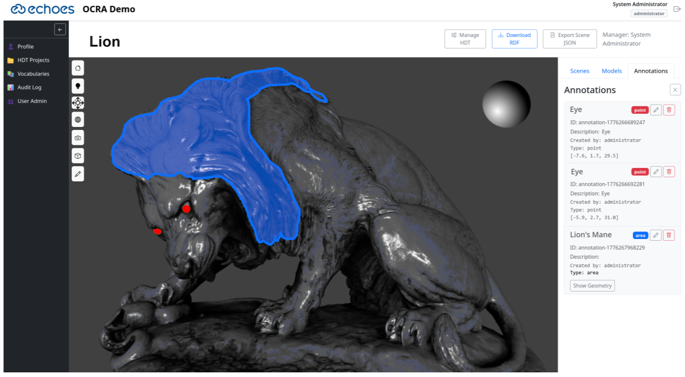
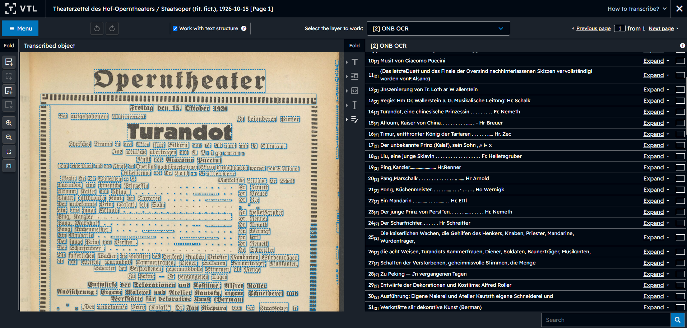
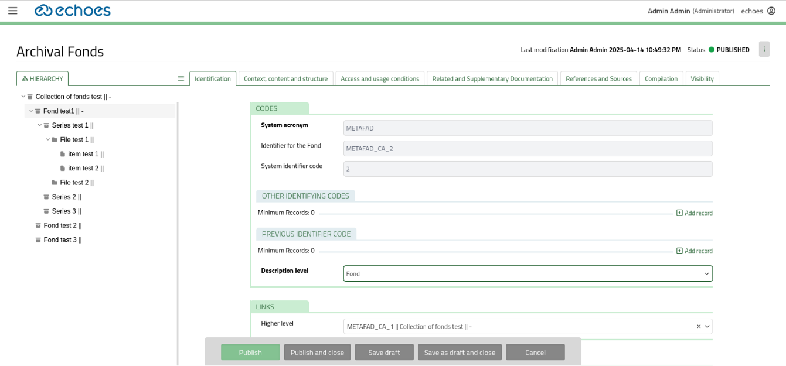

 European Cloud for Heritage Open Science

# Deliverable D8.1 Concepts for Vertical Applications

HORIZON-CL2-2023-HERITAGE-ECCCH-01

Horizon Innovation action

**Responsible authors CNR**

|    Project start    | 1 June 2024 |
|:-------------------:|-------------|
|  Project duration   | 60 months   |
| Document Identifier |             |

© 2025 by the authors, the ECHOES consortium. This work is licensed under a “CC BY 4.0” license.

# Deliverable Information

<table>
<colgroup>
<col style="width: 25%" />
<col style="width: 25%" />
<col style="width: 25%" />
<col style="width: 25%" />
</colgroup>
<thead>
<tr>
<th>Project Number</th>
<th>101157364</th>
<th>Acronym</th>
<th>ECHOES</th>
</tr>
</thead>
<tbody>
<tr>
<td>Full title</td>
<td colspan="3" style="text-align: left;">European Cloud for Heritage OpEn Science</td>
</tr>
<tr>
<td>Project URL</td>
<td colspan="3" style="text-align: left;"><a href="https://www.echoes-eccch.eu/">https://www.echoes-eccch.eu/</a></td>
</tr>
<tr>
<td>EU Project Officer</td>
<td colspan="3">Christian WILK</td>
</tr>
</tbody>
</table>

<table>
<colgroup>
<col style="width: 25%" />
<col style="width: 25%" />
<col style="width: 14%" />
<col style="width: 35%" />
</colgroup>
<thead>
<tr>
<th>Deliverable</th>
<th>D8.1</th>
<th>Title</th>
<th style="text-align: left;">Concepts for Vertical Applications</th>
</tr>
</thead>
<tbody>
<tr>
<td>Work Package</td>
<td>WP8</td>
<td><strong>Title</strong></td>
<td style="text-align: left;">Vertical Applications</td>
</tr>
<tr>
<td>Submission date</td>
<td colspan="3">29/05/2026</td>
</tr>
<tr>
<td>Pages</td>
<td>PP. 50</td>
<td><strong>Keywords</strong></td>
<td><mark>[List of free keywords relevant to the deliverable]</mark></td>
</tr>
</tbody>
</table>

<table>
<colgroup>
<col style="width: 25%" />
<col style="width: 12%" />
<col style="width: 18%" />
<col style="width: 43%" />
</colgroup>
<thead>
<tr>
<th colspan="4">Change log</th>
</tr>
</thead>
<tbody>
<tr>
<td>Date </td>
<td><strong>Version </strong></td>
<td><strong>Author</strong></td>
<td><strong>Change</strong></td>
</tr>
<tr>
<td>01/11/25</td>
<td>V0.1</td>
<td>Paolo Cignoni</td>
<td>First Skeleton Draft</td>
</tr>
<tr>
<td>28/01/26</td>
<td>V0.2</td>
<td>Paolo Cignoni</td>
<td>Post WP8 General Meeting</td>
</tr>
<tr>
<td>25/02/26</td>
<td>V0.3</td>
<td>Paolo Cignoni</td>
<td>Post WP8 General Meeting</td>
</tr>
<tr>
<td>25/04/26</td>
<td>V0.4</td>
<td>Paolo Cignoni</td>
<td>Post WP8 Pisa General Meeting</td>
</tr>
<tr>
<td>10/05/26</td>
<td>V0.9</td>
<td></td>
<td>Version for internal review</td>
</tr>
<tr>
<td>21/05/26</td>
<td>V1.0</td>
<td></td>
<td>Final Version with integrated comments from review</td>
</tr>
</tbody>
</table>

| Lead Partner | \[Names of lead-authors (partners short names)\] |
|----|----|
| Responsible Author | \[Responsible partner\] |
| Authors (Partner) | \[Names of co-authors (partners short names)\] |
| Contributors | \[Names of contributors (partners short names)\] |

*Disclaimer: Views and opinions expressed are however those of the author(s) only and do not necessarily reflect those of the European Union or the European Research Executive Agency. Neither the European Union nor the granting authority can be held responsible for them.*

# Abstract

This deliverable presents the conceptual framework and development roadmap for the Vertical Applications (VAs) developed within Work Package 8 (WP8) of the ECHOES project. Vertical Applications constitute the Application Layer of the European Collaborative Cloud for Cultural Heritage (ECCCH), providing domain-oriented tools that enable cultural heritage professionals and researchers to interact with, enrich, and exploit Heritage Digital Twins (HDTs) within a federated cloud environment.

The document introduces three reference Vertical Applications: the Online Conservation-Restoration Annotator (OCRA), supporting spatial annotation and analysis of 3D representations of cultural heritage objects; the Virtual Transcription Laboratory (VTL), enabling transcription and semantic enrichment of text-based cultural heritage materials through automated and human-assisted workflows; and the Collection Ingestion Tool (CIT), designed to facilitate standards-compliant cataloguing, semantic enrichment, and ingestion of cultural heritage collections into the ECCCH ecosystem.

Together, these applications demonstrate how domain-specific workflows can operate natively within the ECCCH infrastructure by consuming shared cloud services and producing semantically structured outputs aligned with the Knowledge Base and HDT framework. The deliverable also positions these VAs within the broader ECCCH ecosystem, highlighting their role as reference implementations that establish architectural patterns for future Vertical Applications developed by sister projects and cascading grant initiatives.

Finally, the document provides a consolidated architectural synthesis and development roadmap describing how the three VAs collectively support the HDT lifecycle, progressively increase interoperability and integration maturity, and contribute to the creation of interoperable Digital Commons for cultural heritage.

# Table of Contents

[Deliverable D8.1 Concepts for Vertical Applications](#deliverable-d8.1-concepts-for-vertical-applications)

[Deliverable Information](#deliverable-information)

[Abstract](#abstract)

[Table of Contents](#table-of-contents)

[List of abbreviations](#list-of-abbreviations)

[Glossary](#glossary)

[1. Introduction (CNR)](#introduction-cnr)

[1.1. Purpose and Scope of the Document](#purpose-and-scope-of-the-document)

[1.2. Vertical Applications in the ECCCH Architecture](#vertical-applications-in-the-eccch-architecture)

[1.3. The Role of Vertical Applications in the Digital Commons](#the-role-of-vertical-applications-in-the-digital-commons)

[1.4. Overview of the Three Vertical Applications](#overview-of-the-three-vertical-applications)

[1.5. Positioning of WP8 Vertical Applications within the ECCCH Ecosystem](#positioning-of-wp8-vertical-applications-within-the-eccch-ecosystem)

[1.6. Structure of the Document](#structure-of-the-document)

[2. VA01 OCRA: Online Conservation-Restoration Annotator](#va01-ocra-online-conservation-restoration-annotator)

[2.1. Introduction](#introduction)

[2.2. Use Case Description/Workflow](#use-case-descriptionworkflow)

[2.3. OCRA: Technical Architecture Overview](#ocra-technical-architecture-overview)

[2.4. Development Plan and Resources](#development-plan-and-resources)

[3. VA02 VTL: Virtual Transcription Laboratory](#va02-vtl-virtual-transcription-laboratory)

[3.1. Introduction](#introduction-1)

[3.2. Use Case Description / Workflow](#use-case-description-workflow)

[3.3. VTL: Technical Architecture Overview](#vtl-technical-architecture-overview)

[3.4. Development Plan](#development-plan)

[4. VA03 CIT: Collection Ingestion Tool](#va03-cit-collection-ingestion-tool)

[4.1. Introduction](#introduction-2)

[4.2. Use Case Description](#use-case-description)

[4.3. Development Plan](#development-plan-1)

[5. Cross-VA Architectural Synthesis](#cross-va-architectural-synthesis)

[5.1. Architectural Complementarity of the Three Vertical Applications](#architectural-complementarity-of-the-three-vertical-applications)

[5.2. Positioning Within the ECCCH Layered Architecture](#positioning-within-the-eccch-layered-architecture)

[5.3. HDT Lifecycle Coverage Across the VAs](#hdt-lifecycle-coverage-across-the-vas)

[5.4. Interoperability and Integration Maturity Progression](#interoperability-and-integration-maturity-progression)

[5.5. Development Roadmap Consolidation](#development-roadmap-consolidation)

[5.6. Extensibility and Ecosystem Growth](#extensibility-and-ecosystem-growth)

[~~6.~~ ~~References~~](#_Toc230165018)

# List of abbreviations

AAI — Authentication and Authorisation Infrastructure

API — Application Programming Interface

ATR — Automatic Text Recognition

CH — Cultural Heritage

CIT — Collection Ingestion Tool

CRUD — Create, Read, Update, Delete

DAM — Digital Asset Management

DoA — Description of Action

ECCCH — European Collaborative Cloud for Cultural Heritage

ECHOES — European Cloud for Heritage OpEn Science

GLAM — Galleries, Libraries, Archives, and Museums

HDT — Heritage Digital Twin

HDTO — Heritage Digital Twin Ontology

HC1 / HC2 — Heritage Context classes 1 and 2 (as defined in the HDT model)

IIIF — International Image Interoperability Framework

KB — Knowledge Base

KBMS — Knowledge Base Management System

ML — Machine Learning

NER — Named Entity Recognition

NLP — Natural Language Processing

OCR — Optical Character Recognition

OCRA — Online Conservation‑Restoration Annotator

OCC — Optimistic Concurrency Control

REST — Representational State Transfer

RTI — Relightable Transformation Imaging

SSO — Single Sign‑On

UPS — User Personal Space

URI — Uniform Resource Identifier

VA — Vertical Application

VTL — Virtual Transcription Laboratory

WP — Work Package

# Glossary

| Term | Intended meaning |
|----|----|
| Vertical Application | Domain-facing, partner-owned application integrated with ECCCH through platform contracts |
| Tool | A callable processing capability, possibly internal to a VA or eventually exposed as a ECCCH shared platform resource |
| Service | A network-accessible capability exposed through documented APIs |
| Workflow | A sequence of operations inside a VA that involve the use of specific functionality of the application and interaction with the ECCCH infrastructure. |
| Application component | Reusable part of an application, not automatically a cloud-core component |
| Publication | The process through which a Vertical Application publishes a Heritage Digital Twin representation to the federated ECCCH Knowledge Base using the shared semantic, validation, and integration services provided by the ECCCH infrastructure. |

# Introduction (CNR)

## Purpose and Scope of the Document

This Deliverable provides the conceptual foundation and development roadmap for the Vertical Applications (VAs) developed within Work Package 8 (WP8) of the ECHOES project.

In accordance with the Description of Action, this deliverable presents:

- A conceptual description of the Vertical Applications to be implemented in WP8

- A high-level description of their functional scope and target communities

- The VAs architectural positioning within the European Collaborative Cloud for Cultural Heritage (ECCCH)

- A staged development plan outlining their technical maturation

- How the WP8 aims to define and deploy the ECHOES Application Layer, integrating Cloud Components developed in WP6 and semantic infrastructure developed in WP7, and to develop three flagship Vertical Applications that demonstrate the practical value of the ECCCH platform across distinct cultural heritage scenarios

This deliverable does not present final implementations or demonstrators (covered in D8.2–D8.6), but instead establishes the conceptual architecture, workflows, interoperability approach, and integration strategy that guide their development and a description of the three vertical applications.

## Vertical Applications in the ECCCH Architecture

The ECCCH is conceived as a federated, semantically interoperable cloud infrastructure enabling collaborative creation, enrichment, and reuse of cultural heritage data. Its architecture consists of:

- A Cloud Base Layer (WP6), providing authentication, storage, processing, orchestration, and operational management services.

- A Knowledge Base (KB) and Heritage Digital Twin (HDT) ontology (WP7), forming the semantic backbone of the platform.

- An application-facing layer (WP8), where domain-specific tools and services — the Vertical Applications — operate through documented integration with shared ECHOES services.

In this deliverable, the WP8 Application Layer should be understood as the application-facing part of the broader ECCCH architecture. It is not a separate control plane and it does not duplicate platform-wide governance responsibilities. Rather, it provides the domain-specific environments through which communities interact with, create, enrich, and reuse cultural heritage data within the ECCCH ecosystem.

Vertica l Applications are domain-oriented tools or partner-owned domain-specific applications that:

- Address specific community needs (e.g., annotation of 2d and 3d works of art for conservation/restoration purposes, AI assisted transcription of digitized texts, collection ingestion)

- Operate on the Heritage Digital Twins representation, providing practical tools for creating, enriching, interpreting, or managing HDT-related content

- Consume and produce semantically structured data aligned with the HDT ontology

- Rely on shared cloud services (AAI, storage, compute, monitoring)

- Contribute to the actual creation of Digital Commons

At the same time, Vertical Applications should not be understood as autonomous platform cores or as isolated standalone tools. Their internal logic, workflows, technologies, and user experience remain application-specific. However, platform-wide responsibilities such as identity federation, entitlement resolution, publication governance, storage-target resolution, and managed operation semantics remain part of the shared ECCCH infrastructure rather than being re-implemented locally by each application.

They therefore serve a dual role:

1.  Demonstrators of the ECCCH paradigm, validating the integration of semantic, technical, and collaborative dimensions of the cloud

2.  Operational tools for specific workflows for specific communities

This distinction is important for understanding the architectural role of the VAs. Each VA may maintain its own local concepts, such as projects, drafts, sessions, annotation layers, cataloguing records, or temporary working data. These are application-level constructs that support visualization, user interaction and domain- and task-specific workflows. They do not automatically coincide with a published HDT, nor do they replace the authoritative platform-managed lifecycle of HDT-related objects. A VA may work on one HDT, multiple HDTs, or on the preparation of new HDT-related content; the governed transition from local application work to shared ECHOES objects takes place only when explicit save, registration, or publication actions are performed through the relevant platform-facing services.

Each VA is designed to comply progressively with the *D6.2 Interoperability Requirements and Guidelines*[^1] and the *D6.1 Data Strategy for the CH Knowledge Base*[^2] defined by WP6 and to integrate with the KB and HDT lifecycle described in WP7. Through this alignment, Vertical Applications become native components of the federated ECCCH ecosystem rather than standalone tools.

## The Role of Vertical Applications in the Digital Commons

The ECHOES vision extends beyond digitisation toward the co-creation of semantically enriched, reusable Digital Commons. Vertical Applications operationalise this vision by:

- Enabling domain experts to create structured, semantically grounded knowledge

- Linking digital representations, analytical outputs, and interpretative statements

- Recording provenance and maintenance actions

- Facilitating reuse across institutions and disciplines

Through their integration with the Heritage Digital Twin Ontology and Knowledge Base, the outputs of the Vertical Applications are not isolated datasets but become part of a shared semantic ecosystem. The availability of shared adapter components, described in D6.3, will help to handle the interactions with specific portions of the infrastructure, like the KB, in a common, consistent way.

In this sense, VAs are not merely tools, but knowledge-producing instruments embedded in a federated architecture.

## Overview of the Three Vertical Applications

WP8 develops three flagship Vertical Applications, each addressing a distinct but complementary segment of the cultural heritage domain:

- **VA01 – Online Conservation Restoration Annotator (OCRA)**

A collaborative 2D and 3D-based environment supporting conservation-restoration workflows through spatial annotation, semantic enrichment, and HDT-aligned documentation of tangible heritage objects.

- **VA02 – Virtual Transcription Laboratory (VTL)**

A modular environment supporting transcription, text recognition, and semantic enrichment of text-based cultural heritage materials, combining automated processing and expert curation.

- **VA03 – Collection Ingestion Tool (CIT)**

A collection management and metadata enrichment tool enabling cultural heritage institutions to catalogue, normalise, enrich, and publish collections in alignment with the ECCCH semantic framework.

Together, these three VA’s:

- Demonstrate different modalities (RTI+3D, text, collection metadata)

- Address distinct user communities (conservators, researchers, GLAM institutions)

- Cover complementary phases of the HDT lifecycle

- Validate the scalability of the ECCCH Application Layer

## Positioning of WP8 Vertical Applications within the ECCCH Ecosystem

The ECHOES project operates within a broader ecosystem of initiatives. Alongside the core ECHOES infrastructure development, several sister projects are funded to contribute datasets, tools, and workflows to the emerging European Collaborative Cloud for Cultural Heritage (ECCCH). These projects, including initiatives such as AUTOMATA, TEXTaiLES, and HERITALISE and others listed in the project web site, focus on domain-specific research and innovation activities that generate digital assets and methodological outputs relevant to the Cultural Heritage Cloud.

WP8 Vertical Applications (VAs) are positioned within this ecosystem as reference implementations of the ECCCH application-facing layer. Their role is twofold:

- Demonstration Role – The three flagship VAs developed in WP8 (OCRA, VTL, and CIT) demonstrate how domain-oriented tools can be architected to operate as integrated applications within the ECCCH environment. They illustrate the practical integration of:

  - Cloud Components developed in WP6 (authentication, storage, processing, orchestration and more),

  - The Knowledge Base and Heritage Digital Twin (HDT) ontology developed in WP7,

  - The interoperability and integration principles defined in WP3 and WP6.

- Integration Role – WP8 establishes the architectural and operational model that enables outputs from sister projects to be onboarded, integrated, and extended within the ECCCH. Rather than developing isolated tools, WP8 defines a modular application layer where additional Vertical Applications—originating from Cascading Grants, parallel EU calls, or affiliated initiatives—can interoperate with shared services and contribute to the Digital Commons.

Sister projects funded under the ECCCH call are expected to develop their own domain-specific Vertical Applications or application components as part of their research and innovation activities. These applications will address specialised use cases, datasets, and communities, contributing directly to the functional richness of the emerging ECCCH ecosystem.

In this context, the three Vertical Applications developed within WP8 (OCRA , VTL , and CIT ) are conceived as reference implementations and architectural exemplars of the ECCCH application-facing layer However, these VAs should not be understood as internal cloud core components in the strict sense. They remain partner-owned applications, with their own internal logic, technologies, and domain workflows. Their architectural relevance lies in the way they integrate with common services and governance mechanisms, but it will not mandate that all future applications (developed by sister projects or ECHOES) will share the same implementation stack, their internal design, or being hosted on the same premises.

Rather than constituting an exhaustive or closed set of applications, these three VAs establish a conceptual and technical template for future Vertical Applications developed by sister projects, Cascading Grants beneficiaries, and affiliated partners. They validate the integration patterns, interoperability requirements, and governance principles that enable domain-specific innovation to scale within a federated European infrastructure.

Through this approach, WP8 ensures that:

- Vertical Applications developed across the ECCCH ecosystem can interoperate coherently,

- Project-specific tools are not isolated but aligned with shared semantic and technical standards,

- The application-facing layer remains modular, extensible, and sustainable beyond the lifetime of the ECHOES project.

At the same time, the WP8 VAs do not replace the shared platform responsibilities defined ~~elsewhere~~ in the ECCCH architecture. They do not become alternative sources of truth for identity, entitlement, semantic authority, ~~storage policy~~, or publication governance. Instead, they demonstrate how these platform-governed responsibilities can be consumed through documented interfaces while preserving domain-specific workflows and user experiences.

For this reason, the WP8 VAs also provide a bridge between infrastructure and uptake. They show how ECCCH can support different categories of users and institutions through different kinds of applications:

- OCRA addresses collaborative annotation and interpretation workflows centred on 3D representations of tangible heritage;

- VTL addresses transcription, recognition, and enrichment workflows for text-based cultural heritage materials;

- CIT addresses cataloguing, normalisation, semantic enrichment, and publication workflows for collection-level and institutional metadata contexts.

Together, these applications demonstrate complementary functional modalities, serve different communities, and cover different parts of the HDT lifecycle. They therefore validate not only isolated use cases, but also the broader scalability and extensibility of the ECCCH application-facing environment.

By framing the WP8 VAs as reference implementations, Deliverable D8.1 positions them as enabling instruments for a broader, evolving ecosystem of Vertical Applications that will collectively populate and enrich the ECCCH platform.

## Structure of the Document

This deliverable is structured as follows:

- Section 2 describes VA01 – OCRA: Online Conservation-Restoration Annotator

- Section 3 describes VA02 – VTL: Virtual Transcription Laboratory

- Section 4 describes VA03 – CIT: Collection Ingestion Tool

- Section 5 synthesises their architectural positioning and development roadmap

- Section 6 concludes with integration and scaling perspectives

Each VA section follows a harmonised structure including:

- Conceptual positioning

- Functional scope

- Use case and workflow using personas from 4.1

- Architectural integration

- Development plan and milestones

# VA01 OCRA: Online Conservation-Restoration Annotator 

## Introduction

The Online Conservation-Restoration Annotator (OCRA) is a Vertical Application designed to support structured documentation, analysis, and semantic enrichment of two- and three-dimensional representations of tangible cultural heritage assets. The Vertical Application is jointly developed by CNR and CRS4 as affiliated entity.

Positioned within the ECCCH Application Layer, OCRA provides domain-specific workflows for conservation-restoration activities, enabling experts to create spatially grounded annotations directly on 3D models and on relightable 2D models (RTI being the most common representation) so as to generate information to be integrated within the Heritage Digital Twin (HDT) framework.

In conservation-restoration workflows, an annotation is a persistent record that associates a scholarly or scientific observation with a precisely localised region of a digital representation of a cultural heritage object or of a scene composed of many of them. It combines a spatial anchor — a geometric shape or set of points expressed in the coordinate system of a 3D model, a 2D relightable image, or a scene — with semantic content: descriptive text, classification tags, controlled vocabulary terms, and ontology-aligned metadata capturing the interpretive intent of the annotating scholar.

OCRA operates as a collaborative environment in which high-resolution 3D/multilayered 2D models (e.g, RTI and other relightable image models) serve as the primary interaction space for recording observations, analytical results, and interpretative statements in the form of annotations.

For maximum flexibility and collaboration support, OCRA adopts a decomposed, relational annotation model in which spatial anchors, semantic content, and their associations are represented as independent, first-class entities that can be edited collaboratively.

This design enables flexible reuse: a single geometry anchor may be associated with multiple semantic interpretations, and a single semantic record may apply to multiple spatial positions across different scenes or assets. Within the OCRA collaborative model, annotation components (i.e., geometric anchors and their contents) are the primary unit of concurrent scholarly work: multiple users may annotate the same digital object simultaneously, with consistency guaranteed at save time and real-time awareness mechanisms reducing the likelihood of conflicting edits.

- Moreover, annotations are designed to be auditable knowledge artefacts that record the provenance context of an observation. They support a managed lifecycle — from creation through collaborative review to governed publication — and are designed to be produced within the application-local OCRA workspace and later exported as semantically structured outputs aligned with the Heritage Digital Twin ontology, contributing to the shared ECHOES Knowledge Base.

|  |
|:-----------------------:|

## Use Case Description/Workflow 

This section describes a representative workflow for OCRA, highlighting both the actions performed by the users inside the application and the points at which the workflow interacts with shared ECHOES services. The purpose of the examples is not to define a final implementation sequence in every technical detail, but to clarify how a domain-specific application such as OCRA can support collaborative annotation while relying on the common ECCCH infrastructure for authentication, governed storage, and HDT-related integration. In the following, we describe two workflows, one where the object of interest is represented in 3D (a statue), and one where it is represented as a relightable image (a painting).

**3D annotation example**

In this example, we present the possible usage of OCRA in a conservation setting, where users are monitoring degradation over time. In this scenario, the OCRA project acts as an application-level collaborative workspace. It may be associated with a HDT, or with the preparation and enrichment of HDT-related content, but it should not automatically be interpreted as being identical to one published HDT. Governed save and publication actions take place only when OCRA invokes the relevant ECHOES platform-facing services.

**Actors and roles**

- Anna: OCRA administrator

- Bern: project creator and manager

- Carl: editor

- Denise: viewer

**High-level narrative**

Bern, a professor, wants his student Carl to analyse and annotate signs of degradation observed over time on a statue represented by two aligned 3D models. Bern obtains access to OCRA, creates a collaborative project, associates the project with the relevant heritage object and its HDT-related context, uploads the required 3D assets through ECHOES-governed services, and prepares the annotation workspace. Carl then performs the annotation work inside OCRA. Later, Bern reviews the results and shares them with his colleague Denise.

| **Action** | **Notes** |
|----|----|
| A gives to B project creation rights | Administrative role assignment inside OCRA or in related governance tooling. |
| B Logs on the system | The login process relies on the common ECHOES authentication and authorisation infrastructure in production settings. During development, equivalent local arrangements may be used, but ECHOES-facing operations are expected to rely on the shared AAI model. |
| B creates a new project called ‘Allegoria della Disperazione’. He is by default the project manager. | The project is an application-level collaborative workspace in OCRA. It may be associated with one HDT, multiple HDTs, or with HDT-related working material. Projects are by default private and visible only to authorised users inside the application and, where relevant, through ECHOES-governed access rules. |
| B gives C Editor rights | Application-level collaborative role assignment. The exact mapping between OCRA roles and ECHOES entitlements may be refined during implementation. |
| B gives D Viewer rights | Application-level collaborative role assignment with restricted permissions. |
| B imports a HDT from the KB by doing a simple query. | OCRA queries the relevant ECHOES services to discover and select an existing HDT or HDT-related object. The exact user interaction remains to be finalised, but architecturally the application should consume platform-governed query and retrieval services rather than duplicating KB logic locally. |
| B check the metadata imported from the KB about the work. They are arranged into the two HDTO main classes HC1 and HC2 | OCRA retrieves and presents a working application view of the selected HDT-related metadata according to the HDTO-based semantic model. This application view is not itself the authoritative semantic source of truth, but a domain-oriented projection used for interactive work. |
| B switches to the HC2 class of the HDT | The HC2-related part of the HDT provides the digital representation context relevant for this workflow. Here the focus is on preparing and associating 3D assets and annotations with the HDT-related working context. |
| B loads two 3D models from his pc into the OCRA system. | Loading the models into OCRA is an application-side preparation step. At this stage the assets may still be local application working material and are not yet automatically part of a governed HDT save or publication path. |
| B fill the needed basic metadata for the two models | This metadata supports later governed save, semantic association, and reuse. |
| B uploads/saves these two 3D models through the relevant ECHOES-governed storage services, obtaining stable asset references/URIs for use in the HDT-related working context | For the assets to participate in a governed HDT-related workflow, they must receive stable references under ECHOES-governed storage handling. This step should be described as governed save/upload into working context; publication to shared or public targets is a separate action. |
| B check that the two 3D models are in the same reference system and properly aligned | Domain-specific application logic internal to OCRA. |
| B prepare the work scene with these two models inside OCRA | Application-level preparation of the collaborative annotation workspace. |
| B tell C to start working in the annotation | At this point the project contains an OCRA-level working context linked to HDT-related content and stable asset references, but not necessarily a published HDT release. |
| C Logs into the system and he sees among his projects the ‘Allegoria della Disperazione’ one. | Thanks to shared authentication/session continuity, Carl can access the authorised project and continue work in the application context. |
| C creates annotations on the models | Annotations are initially application-level working content. Their governed persistence into ECHOES-managed semantic and/or binary contexts occurs only when OCRA invokes the relevant platform-facing save operations. |
| C saves the annotation work | Save should be described as a governed save into a private or controlled working context, not automatically as publication. OCRA may keep local draft state during editing, while explicit save crosses the ECHOES platform boundary. |
| B reviews the annotation results | Review remains an application-level collaborative action, although it may use governed saved state and ECHOES-backed references. |
| B shares the results with D | Sharing within the project should be distinguished from publication into shared or public ECHOES targets. Internal collaborative visibility and governed publication are not the same lifecycle step. |
| B publishes the validated results to ECHOES | If publication is part of the use case, it should be described as a separate governed platform action, possibly initiated from the OCRA UI but executed through the appropriate ECHOES publication path. |

**2D annotation example**

This example presents the possible usage of OCRA for painting analysis. We emphasize the commonality of the overall workflow with respect to the 3D example, together with the specific visualization and annotation features available when working with multilayered 2D data.

**Actors and roles**

- Anna OCRA Admin

- Bianca Project Creator and Manager

- Charles Editor

- Denise Editor

- Elsie Viewer

**High Level short user focused narrative description of the workflow** Bianca is a conservator studying surface details and conservation issues in a historical painting. He wants his colleagues Charles and Denise to analyse and annotate surface features, such as craquelure, retouching areas, and pigment degradation, using multiple Relightable Transformation Imaging (RTI) models of the artwork. Bianca requests access to the OCRA system, creates a project, and imports the RTI datasets of the painting. He prepares the relightable scene inside OCRA so that Charles and Denise can interactively change the light direction to reveal subtle surface features. Charles and Denise then collaboratively annotate relevant areas directly on the RTI images, changing lighting and switching from visible to false-colour multispectral viewing. Later, Bianca reviews Charles and Denise annotations and shares the results with his colleague Elsie for discussion.

<table style="width:100%;">
<colgroup>
<col style="width: 49%" />
<col style="width: 49%" />
</colgroup>
<thead>
<tr>
<th><strong>Action</strong></th>
<th><strong>Notes</strong></th>
</tr>
</thead>
<tbody>
<tr>
<td>A gives to B project creation rights</td>
<td>Administrative role assignment inside OCRA or in related governance tooling.</td>
</tr>
<tr>
<td>B Logs on the system</td>
<td>The login process is done relying on the common authentication system.</td>
</tr>
<tr>
<td>B creates a new project called “Retable of S. Bernardino – Surface Study”. He is by default the Project Manager.</td>
<td>Each project corresponds intuitively to a single HDT. Projects are by default private and can be seen only by the creator</td>
</tr>
<tr>
<td>B gives C and D Editor rights</td>
<td>Application-level collaborative role assignment. The exact mapping between OCRA roles and ECHOES entitlements may be refined during implementation.</td>
</tr>
<tr>
<td>B gives E Viewer rights</td>
<td>Application-level collaborative role assignment with restricted permissions.</td>
</tr>
<tr>
<td>B imports a HDT from the KB by doing a simple query.</td>
<td>The details of how this step will be taken in a user-friendly way will require cooperation between OCRA and ECHOES services.</td>
</tr>
<tr>
<td>B switches to the HC2 class of the HDT</td>
<td>The HC2 class represents the ‘digital’ part of the HDT.</td>
</tr>
<tr>
<td>B loads two RTI assets containing the RTI model of the painting under study, one acquired with visible light, the other using a multispectral setting</td>
<td>The assets correspond to interactively viewable versions of the archived models referenced in the HDT</td>
</tr>
<tr>
<td>B adds the models to the work scene and checks that they are properly aligned</td>
<td>The scene is automatically defined as a 2D scene since it contains RTI models. Different visualization layers are automatically set up to support multilayer visualization functions.</td>
</tr>
<tr>
<td>B tells C and D that they can start annotating the model</td>
<td>C and D must be registered users</td>
</tr>
<tr>
<td>C logs into the system and he sees among his projects the “Retable of S. Bernardino – Surface Study” one.</td>
<td>Thanks to shared authentication/session continuity, C can access the authorised project and continue work in the application context, logging in and out multiple times.</td>
</tr>
<tr>
<td>D logs into the system and he sees among his projects the “Retable of S. Bernardino – Surface Study” one.</td>
<td>Thanks to collaborative annotation support, concurrent editing of the same scene by two editors is fully supported.</td>
</tr>
<tr>
<td>C and D open the work scene on their local computers and start annotating</td>
<td>
During concurrent edit, each editor has a view of the current annotation state, and sees modifications done by all other active editors.

The interface permits pan, zoom, select layers and visualization modes, and relight. Annotations are spatially bound to model coordinates and enriched with structured metadata. During annotation, a user can select the best combination of layers and lighting parameters to emphasize features of interest. These settings are recorded with annotations, to allow their recall at annotation display time.
</td>
</tr>
<tr>
<td>C and D tell B and E that they have completed the work</td>
<td>Sharing within the project should be distinguished from publication into shared or public ECHOES targets. Internal collaborative visibility and governed publication are not the same lifecycle step.</td>
</tr>
<tr>
<td>B and E log in the OCRA, open the project, and view the annotations</td>
<td>B can modify them, while D is only a viewer</td>
</tr>
<tr>
<td>B tells D and E they have completed the review</td>
<td>Review remains an application-level collaborative action, although it may use governed saved state and ECHOES-backed references.</td>
</tr>
<tr>
<td>B optionally publishes the work in the HDT</td>
<td>If publication is part of the use case, it should be described as a separate governed platform action, possibly initiated from the OCRA UI but executed through the appropriate ECHOES publication path. The external HDT representation conforms to the standard and is used for long term archival.</td>
</tr>
</tbody>
</table>

## OCRA: Technical Architecture Overview

OCRA (Online Conservation-Restoration Annotator) is a modular web-based application supporting collaborative 2D and 3D annotation workflows for conservation-restoration and heritage science. It operates at the ECCCH application-facing layer, consuming shared cloud services and producing structured, semantically enriched outputs aligned with the Heritage Digital Twin (HDT) framework.

Architecturally, OCRA should be understood as a partner-owned, domain-specific Vertical Application integrated with the ECCCH environment through documented interfaces and shared governance mechanisms. It is not a core cloud component in the strict sense, nor does it own platform-wide responsibilities such as identity federation, entitlement resolution, storage-target resolution, publication governance, or managed operation semantics. These remain part of the shared ECHOES infrastructure.

OCRA follows a service-oriented client–server architecture:

**Application Frontend**

- Implemented in React/TypeScript.

- Provides project management, annotation editing, and collaborative workflows.

- Interacts with backend services via REST APIs.

- Provides the domain-specific user experience for conservation-restoration workflows, while relying on shared ECHOES services when actions require governed access, save, retrieval, or publication

A common workflow is implemented for the annotation of models of interest. Since annotations associate information to areas of interest on the annotated models, OCRA facilitates the task through a user interface that lets users to directly see and edit annotations on an object's visual representation. The specifics of the rendering of objects and their graphical annotation are specialized, with components that handle representation-specifics display and interaction methods. At present, we plan to support 3D object shapes and relightable 2D object representations, since they are the most common use-cases in digital heritage.

<u>Three-Presenter (3D Visualization Component)</u>

The 3D rendering and interaction layer is implemented as a separate reusable component: <https://github.com/cnr-isti-vclab/ThreePresenter>

Three-Presenter is designed as a generic ECCCH cloud component, that may support OCRA and potentially other applications, providing:

- WebGL-based 3D rendering

- Multi-resolution model handling

- Spatial interaction and metric consistency

OCRA consumes Three-Presenter as a visualization service. Its separation supports reuse by other Vertical Applications and aligns with ECCCH modular cloud component design.

<u>OpenLIME (2D Visualization component)</u>

The 2D visualization component is implemented on top of OpenLIME (Open Layered IMage Explorer), an open, scalable, and flexible framework under development by CRS4 and CNR for creating web-based interactive tools to annotate and inspect large multi-layered and multi-channel standard and relightable image models: <https://cnr-isti-vclab.github.io/openlime/>

The main features of interest to OCRA are the following:

- Streamlined visualization and interaction for objects mostly globally flat but locally rich in terms of geometric and material properties;

- Multi-resolution model handling

- Spatial interaction and metric consistency

- Multi-layered representation

A custom annotator is built on top of the OpenLIME framework. The annotator communicates with the rest of OCRA with a streamlined API that unifies 2D and 3D annotation and asset management.

**Backend (API Layer)**

- Built on Node.js/Express (TypeScript).

- Exposes RESTful endpoints for project lifecycle, role management, HDT-related content handling, annotation persistence, and collaborative coordination.

- Exposes real-time Server-Sent Events (SSE) channels for annotation mutation notifications, social-lock awareness, and structuring-state notifications.

The backend uses a layered data architecture based on multiple storage systems:

- PostgreSQL is the system of record for identity, authorization, sessions, project registry, project roles, and structuring coordination state.

  - This includes user/session data, project visibility and membership, project-wide structuring lock entities, and project presence leases.

<!-- -->

- MongoDB is used for content and annotation persistence:

  - ocra_content stores HDT-related project content (physical object metadata, digital assets, scenes) and the decomposed annotation model (annotation_geometry, annotation_data, annotation_link).

  - ocra_audit stores audit/event data.

- File storage keeps local working copies/cache of HDT-related assets (for example 3D and RTI files) to support interactive loading, rendering, and annotation workflows in OCRA.

  - These files are operational copies; governed HDT asset references remain the canonical external references for integration and publication workflows.

At service level, the backend enforces:

- role-based authorization and project scoping,

- exclusive structuring coordination through a project-wide lock with draining/exclusive states and presence-based session coordination,

- blocking of non-owner project access during active structuring phases (including read and write access, according to policy),

- scene/asset consistency rules for annotation links,

- optimistic concurrency control (OCC) via version-based conditional writes on mutable annotation entities,

- explicit lifecycle transitions (erasable/non-erasable) without implicit cross-collection cascades.

The backend should therefore be understood as the application-owned orchestration layer for OCRA workflows, while integrating with shared ECHOES platform-facing services for governed save, retrieval, and publication paths where required.

**Data and Interoperability Positioning**

Within the ECCCH interoperability framework (D6.2), OCRA functions as:

- An Application resource type,

- Consuming datasets (2D/3D models, metadata),

- Producing structured annotation data,

- Exposing service endpoints compliant with REST-based integration patterns.

Annotations are spatially bound to model or scene (group of models) coordinates and enriched with structured metadata. Their design allows mapping to HDT-aligned semantic representations and controlled vocabularies, supporting higher interoperability levels through semantic alignment and provenance traceability.

In architectural terms, OCRA may maintain application-local project structures, draft annotations, temporary editing state, and local persistence for interactive work. These application-level constructs support efficient domain workflows, but they do not replace the platform-managed lifecycle of HDT-related objects. The governed transition into ECHOES-managed semantic or binary contexts occurs only when OCRA invokes the appropriate shared save, registration, retrieval, or publication interfaces.

A useful distinction should therefore be maintained between:

- application-local persistence used to support visualization, editing, and collaboration inside OCRA;

- ECHOES-governed binary persistence used for stable asset references and managed storage handling;

- ECHOES-governed semantic persistence used when annotations or related metadata become part of an HDT-related managed object or publication path.

**Authentication and Deployment**

For development environments, OCRA integrates a local Keycloak identity provider. In production ECCCH settings, authentication and authorised access to ECHOES-facing services should rely on the federated AAI and shared trust model defined in WP6, ensuring alignment with the common OAuth2/OpenID-based access-control approach. Local identity-provider arrangements remain a development and pre-integration choice and should not be interpreted as the target ECCCH trust architecture.

OCRA is containerized (Docker-based deployment), supporting cloud-native orchestration, scalability, monitoring, and integration into the ECCCH operational environment.

From the ECCCH architectural perspective, OCRA should be treated as a provider-operated Vertical Application that integrates with centrally governed ECHOES services through documented contracts. Its containerised deployment supports portability and operational integration, but does not by itself imply that all OCRA-managed data, roles, or services are central cloud-core capabilities. The relevant distinction is between application-owned services and platform-governed ECHOES-facing operations.

## Development Plan and Resources

| *Project month* | *Features implemented* | *Use case steps* |
|----|----|----|
| M18 | Core OCRA web application available; project creation and role management inside the application; basic 3D/RTI asset loading and visualisation; local persistence of projects and scenes; first HDTO-aligned internal data structures; Integration with shared AAI/SSO for production-oriented ECCCH access; | User login; creation of collaborative project; assignment of editor/viewer roles; loading of 3D/RTI assets into OCRA; scene preparation; |
| M24 | Scene, asset and annotation data model; first implementation of full REST APIs for data management and frontend/backend communication; core backend features to support collaborative annotation editing inside a project; local persistence of annotations on shared database; use of stable asset references/URIs inside OCRA; generic user interface for annotation creation, update, and removal; improved metadata handling for HC1/HC2-related contexts; support for collaborative review workflows | Import/select HDT; inspect HDT-related metadata inside OCRA; prepare shared project workspace linked to HDT-related context; collaborative access to draft work; editing of annotations on scenes/assets; |
| M30 | Improved visual editing of 2D/3D annotations; Initial semantic integration of annotation outputs; export/mapping of OCRA annotations toward HDT-aligned semantic representations; support for governed save of HDT-related annotation content into private or controlled ECHOES contexts; better provenance capture for annotation actions, assets, and revisions; | Collaborative visual editing of annotations on 2D and 3D objects; Save annotations through platform-facing services; persist governed annotation outputs in private/controlled working context; associate annotation results with HDT-related semantic structures; track provenance of annotation and asset-related actions |
| M36 | Advanced support for concurrent collaborative editing of annotations; Publication-oriented workflows available through documented ECHOES interfaces; support for validation and review before publication; richer semantic mapping and controlled vocabularies; stronger interoperability with shared Knowledge Base services; improved monitoring, deployment, and operational readiness; possible reuse of technical components such as Three-Presenter and OpenLIME OCRA viewer in broader ECCCH contexts | Collaborate in real-time on annotating the same objects and scenes; Review validated results; trigger governed publication from OCRA UI through shared ECHOES publication paths; expose annotation results as reusable HDT-related outputs; support more mature end-to-end collaborative workflows |
| M40 | Mature integration with ECCCH operational environment; refinement of visual analysis and annotation features, publication, provenance, and semantic consistency workflows; scalability improvements for larger collaborative projects and richer assets; stronger support for long-term reuse of OCRA outputs in the Digital Commons; consolidation of deployment and provider-operated sustainability model | Full workflow support from project setup to governed save and publication; stable collaborative annotation environment integrated with shared ECHOES services; reusable and semantically aligned outputs suitable for wider ECCCH uptake |

# VA02 VTL: Virtual Transcription Laboratory

## Introduction

Virtual Transcription Laboratory (VTL) empowers researchers, cultural heritage professionals, and data providers to unlock and enrich text-based cultural heritage materials at scale. By combining advanced automated processing with expert human input, it delivers flexible, reusable workflows for text recognition, and semantic enrichment. Whether working with historical newspapers, manuscripts, or ancient tablets, the Vertical Application supports the transformation of diverse text-based cultural heritage objects into structured, searchable, and meaningful data.

VTL will offer the following features:

- ATR - automatic text recognition = image to text conversion for different types of texts

- Ability to process local and remote datasets

- Collaborative work - possibility to flexibly share resources (datasets, tools, models, computing resources) with colleagues across institutional boundaries

- Automated text enrichment, information extraction and other NLP (Natural Language Processing) tasks by integrating existing external tools

- Means to store and share newly generated data

- Integration with the CH Knowledge base through the platform layer – ability to work with existing HDT objects and to create and register new ones

|  |
|:-----------------------:|

## Use Case Description / Workflow

This section describes a representative workflow for the Virtual Transcription Laboratory (VTL), showing how a researcher can combine transcription, correction, enrichment, and publication-oriented actions within one domain-specific application while relying on shared ECHOES services for identity, governed persistence, discoverability, and HDT-related integration.

The use case concerns theatre playbills of operas, which contain rich information about performances, such as performance date, title, composer, librettists, translators, conductors, singers, actors, and stage or costume designers. A researcher specialising in early twentieth-century music theatre aims to analyse the cast of Giacomo Puccini’s Turandot at the Viennese Opera between 1926 and 1928. To support this analysis, the relevant material must be transcribed through ATR/OCR processes and enriched through named-entity recognition and related semantic processing. The material for the use case is part of the [ANNO](https://anno.onb.ac.at/anno-suche/simple?query=Turandot&from=151&selectedFilters=title:ope&selectedFilters=date:%5B1926%20TO%201928%5D) collection of historical newspapers provided by the Austrian National Library in Vienna (ÖNB). It was identified using the search functionality of ANNO. It contains about 30-50 issues of “Theaterzettel des Hof-Operntheaters/Staatsoper” between 1926-1928. For each issue, facsimile and metadata accessible via IIIF manifest is available, for example <https://api.onb.ac.at/iiif/presentation/v3/manifest/1241A62B> for the following entry: <https://anno.onb.ac.at/cgi-content/anno?aid=ope&datum=19261018>

In this scenario, the VTL project should be understood as an application-level working context for transcription and enrichment tasks. It may be associated with one or more HDTs, or with the preparation of HDT-related content, but it should not automatically be equated with a published HDT. The governed transition from VTL working data to ECHOES-managed objects occurs only when explicit save, registration, or publication actions are performed through the relevant platform-facing services.

<table style="width:99%;">
<colgroup>
<col style="width: 49%" />
<col style="width: 49%" />
</colgroup>
<thead>
<tr>
<th><strong>Action</strong></th>
<th><strong>Notes</strong></th>
</tr>
</thead>
<tbody>
<tr>
<td>User logs in to ECHOES portal</td>
<td>Using common AAI via SSO of the home institution</td>
</tr>
<tr>
<td>User creates a new project to work on</td>
<td>User can add other users and assign roles to them</td>
</tr>
<tr>
<td>
User searches in the central resource catalogue for existing HDTs of the ONB theatre playbills and adds them to the project.

If they are not available: User may create new HDTs starting, for example, by using the IIIF manifest to upload metadata and images
</td>
<td></td>
</tr>
<tr>
<td>User searches for tool to perform the OCR task and finds VTL</td>
<td></td>
</tr>
<tr>
<td>User opens VTL</td>
<td>
User is automatically logged in thanks to SSO mechanism

Optionally, user can invite other users and assign VA level roles to them
</td>
</tr>
<tr>
<td>User applies automatic transcription (OCR)</td>
<td>
User can choose language models and manually adapt the OCR.

User can perform OCR with various models on different layers of one image and choose the best version
</td>
</tr>
<tr>
<td>User can perform manual correction to the transcription</td>
<td>Manually corrected transcription is stored in a separate annotation layer so that it is distinguished from the automatic transcription. It can be later used as ground truth for improving the model</td>
</tr>
<tr>
<td>
User performs automated NER

<ol type="a">
<li>
Within VTL application
</li>
<li>
Eventually via ECCCH common NER tools
</li>
</ol></td>
<td>
a) VTL application can integrate with other external tools for NER

b) User can eventually choose an external NER tool (available via ECCCH infrastructure) to perform this task.
</td>
</tr>
<tr>
<td>User saves the transcriptions, including metadata on OCR and NER tasks performed and publishes them to the Cloud to enrich the HDT of the heritage object.</td>
<td>
The different transcriptions are stored in some defined cloud storage and recorded as additional digital representations of the underlying HDT object (including corresponding provenance record), so that they are accessible from the ECCCH portal

The user can choose at which step they want to make the data publicly available/accessible via the ECCCH web UI. Until then the project is set to private.
</td>
</tr>
</tbody>
</table>

## VTL: Technical Architecture Overview

- developed by PCSS

- Components

- Core in Java 11 (Spring Boot)

- UI: React (version 18).

- built-in IIIF Server: IIPImage (version 1.2)

- ATR engine: currently Tesseract, integrating other engines (Kraken) planned

- NER – planned NameTag@LINDAT, or other NER tools (c.f. SSH Open Marketplace)

- Formats:

- Input: JPG, IIIF

- Output: hOCR, ALTO, txt, TEI

- Deployment: https://vtl.echoes-eccch.psnc.pl/

VTL (Virtual Transcription Laboratory) is a specialized web-based application designed to support transcription workflows for digitized textual materials. Developed by PCSS, VTL facilitates the processing, annotation, and extraction of textual data from image-based sources, leveraging advanced optical character recognition (OCR) and natural language processing (NLP) techniques. Like OCRA it operates within the ECCCH application-facing layer, consuming shared cloud services and producing structured outputs aligned with the Heritage Digital Twin (HDT) framework.

Architecturally, VTL should be understood as a partner-owned, domain-specific Vertical Application integrated into the ECCCH environment through documented interfaces and shared governance mechanisms. Like the other Vertical Applications it is not a core cloud component in the strict sense, nor does it assume platform-wide responsibilities such as identity federation, entitlement resolution, storage-target resolution, publication governance, or managed operation semantics. These remain part of the shared ECHOES infrastructure.

VTL follows a service-oriented client–server architecture:

**Application Frontend**

- Implemented in React (version 18)- The frontend provides an intuitive user interface for managing transcription workflows, including image upload, text extraction, and annotation editing.

- Interacts with backend services via REST APIs - The frontend ensures seamless communication with the backend for data processing, persistence, and retrieval.

- Domain-specific user experience - VTL delivers a tailored user experience for transcription workflows while relying on shared ECHOES services for governed access, storage, and publication.

**Core Processing Engine**

- Built in Java 11 (Spring Boot) - The core engine handles transcription logic, including OCR processing, metadata management, and integration with NLP tools.

- Automatic Text Recognition (ATR) Engine - Currently powered by Tesseract for optical character recognition, with plans to integrate additional engines such as Kraken for enhanced capabilities.

- Named Entity Recognition (NER) Integration - NER functionality is planned, with potential integration of tools like NameTag (developed by LINDAT) or other solutions available in the SSH Open Marketplace.

**IIIF Server**

- Built-in IIPImage (version 1.2) - VTL includes an integrated IIIF (International Image Interoperability Framework) server for efficient handling of image-based inputs. This supports high-resolution image delivery and interaction, ensuring compatibility with IIIF standards.

**Backend (API Layer)**

- Built on Spring Boot: The backend exposes RESTful endpoints for transcription lifecycle management, metadata handling, and role-based access control.

- Data Formats: VTL supports input formats such as JPG and IIIF, and produces structured outputs in hOCR, ALTO, txt, and TEI formats.

- Persistence and Workflow Management: The backend manages VTL-specific workflows, local interaction state, and application-specific persistence. However, local persistence should not be interpreted as authoritative ECCCH semantic persistence. For governed storage, retrieval, or publication, VTL invokes shared ECHOES services.

**Data and Interoperability Positioning** Within the ECCCH interoperability framework, VTL functions as:

- An application resource type - Consuming image datasets and producing structured transcription outputs.

- Exposing service endpoints - Compliant with REST-based integration patterns.

- Semantic Alignment - Outputs are designed to support HDT-aligned semantic representations and controlled vocabularies, enabling higher interoperability levels through provenance traceability and metadata enrichment.

VTL maintains application-local constructs such as draft transcriptions, temporary editing states, and local persistence for interactive workflows. These constructs support efficient transcription processes but do not replace the platform-managed lifecycle of HDT-related objects. Governed transitions into ECHOES-managed contexts occur only when VTL invokes shared save, registration, retrieval, or publication interfaces.

**Authentication and Deployment**

- Authentication - For development environments, VTL integrates a local Keycloak identity provider. In production ECCCH settings, authentication and authorized access to ECHOES-facing services rely on the federated AAI and shared trust model defined in WP6, ensuring alignment with the common OAuth2/OpenID-based access-control approach.

- Deployment - VTL is containerized (Docker-based deployment), supporting cloud-native orchestration, scalability, monitoring, and integration into the ECCCH operational environment. The application is accessible at <https://vtl.echoes-eccch.psnc.pl/>.

From the ECCCH architectural perspective, VTL should be treated as a provider-operated Vertical Application that integrates with centrally governed ECHOES services through documented contracts. Its containerized deployment supports portability and operational integration but does not imply that all VTL-managed data, roles, or services are central cloud-core capabilities. The distinction between application-owned services and platform-governed ECHOES-facing operations remains critical for understanding its role within the broader ECCCH ecosystem.

## Development Plan

<table>
<colgroup>
<col style="width: 11%" />
<col style="width: 47%" />
<col style="width: 41%" />
</colgroup>
<thead>
<tr>
<th><em>Project month</em></th>
<th><em>Features implemented</em></th>
<th><em>Use case steps</em></th>
</tr>
</thead>
<tbody>
<tr>
<td>M18</td>
<td><ul>
<li>
Support for AAI / SSO
</li>
<li>
Read/write minimal HDTs from/to CH Knowledge Hub
</li>
<li>
Reading images via IIIF protocol
</li>
<li>
Automated ATR using tesseract
</li>
<li>
Manual correction of transcriptions
</li>
<li>
Initial set of NLP tools integrated in the ECHOES portal to be applied on the transcribed text
</li>
</ul></td>
<td style="text-align: left;">Sample project with a sample theater playbill as HDT created imported to VTL via IIIF, Baseline ATR performed, Transcription recorded in HDT, NLP tools available in ECHOES portal applied on the transcription</td>
</tr>
<tr>
<td>M24</td>
<td><ul>
<li>
Exporting data to external storage (esp. Personal User Space in the Cloud infrastructure)
</li>
<li>
Support other ATR engines, different models
</li>
<li>
Enable sending data to external NER services and retrieve back the annotations
</li>
</ul></td>
<td style="text-align: left;">
Project representing the whole use case containing HDTs for the whole dataset of relevant playbills created

Baseline ATR on all playbills performed

Baseline NER on all playbills performed

Evaluation of the quality of transcription, Creation of manually transcribed and annotated gold standard sample dataset to validate the automated results and potentially improve the automated process
</td>
</tr>
<tr>
<td>M30</td>
<td><ul>
<li>
Search for relevant HDTs in Resource Catalogue passing on datasets based on the search results to VTL
</li>
<li>
Read/write rich HDTs from/to CH Knowledge Hub including full provenance information
</li>
<li>
Enable sending data to external NER services and retrieve back the annotations
</li>
</ul></td>
<td style="text-align: left;">Broadening the scope of the use case – widening the spatio-temporal constraints and data sources used – testing the search in the Resource Catalogue</td>
</tr>
<tr>
<td>M36</td>
<td><ul>
<li>
Import Indexes of entities – or use external authorities
</li>
</ul></td>
<td style="text-align: left;">Comparison of results for different combinations of datasets, ATR engines and models and NER tools</td>
</tr>
<tr>
<td>M40</td>
<td><ul>
<li>
Iterative training ATR models using manually corrected data
</li>
</ul></td>
<td style="text-align: left;">Application of improved models based manually corrected data on the initial dataset, Comparison of baseline and improved results</td>
</tr>
</tbody>
</table>

# VA03 CIT: Collection Ingestion Tool

## Introduction

The Collection Ingestion Tool (CIT) is a modular, standards-compliant, multi-domain platform designed to support the systematic cataloguing, semantic enrichment, and ingestion of cultural heritage collections into the European Collaborative Cloud for Cultural Heritage (ECCCH).

Developed within ECHOES by ETT/META, it addresses persistent structural challenges that still affect cultural heritage metadata practices across Europe—namely fragmentation, heterogeneous standards, limited cross-institutional reuse, and significant barriers to digital participation for small and resource-constrained GLAM organisations. Despite decades of digitisation efforts, cultural collections are often still managed in isolated systems, using different descriptive models, languages, and workflows. This inhibits interoperability, collaborative knowledge creation, and large-scale exploitation of cultural heritage data. Smaller institutions, in particular, struggle to participate in European-level initiatives due to lack of infrastructure, expertise, and long-term maintenance capacity. CIT responds explicitly to these issues by enabling scalable, interoperable, semantically aligned cataloguing workflows that can be adopted by institutions of all sizes.

CIT builds upon the long-standing experience of MetaFAD, the open-source national platform co-developed with Italy’s central heritage institutes (ICCU, ICAR, ICCD) and widely adopted across small and medium GLAMs in Italy for museum, archival, and bibliographic cataloguing. By bringing this expertise into ECHOES, CIT transforms a nationally successful model into a European cloud-integrated tool, fully aligned with the ECHOES semantic framework and capable of contributing enriched metadata to the shared ECHOES Knowledge Base (KB).

The CIT is structured around a suite of integrated modules that together cover the full workflow of cultural heritage cataloguing:

- **Core domain modules** supporting international standards for museum/CH objects (LIDO), archival descriptions (EAD), and bibliographic assets (MODS, MARC21).

- **Digital Asset Management (DAM)** for storing, preserving, and delivering multimedia resources, with support for S3 storage, IIIF servers, and large-volume uploads.

- **AI-assisted tools** that leverage ECHOES Cloud Components to extract entities, propose metadata, and accelerate cataloguing tasks.

- **Internal Workflow management** enabling VA-Level role-based access, multi-step validation, and collaborative editing.

- **Data management utilities** offering import/export capabilities and API-based interoperability with external systems.

- **Semantic Layer Integration**, the distinguishing feature of CIT, which maps cataloguing records to semantic triples, enables contribution to the Knowledge Graph, and provides KB-driven suggestions.

Architecturally, CIT adopts a distributed, star-shaped model: each institution operates its own CIT environment—allowing local autonomy and flexibility—while all instances connect to, contribute to, and benefit from the central ECCCH Knowledge Base through the infrastructure provided layers. This ensures that local cataloguing efforts become part of a broader, pan-European ecosystem of interoperable cultural heritage data.

Through its modular design, native integration with the ECCCH infrastructure, and capacity to make advanced tools accessible even to smaller institutions, CIT is positioned to play a central role in making European cultural heritage cataloguing more accessible, more interoperable, more semantically enriched, and more aligned with FAIR principles.

**Technological Foundations**

The technological foundations of the Collection Ingestion Tool are designed to ensure modularity, scalability and ease of deployment, while relying on a robust and well-established open-source stack. The system is organised as an architecture of containerised microcomponents, where many of its principal functional modules (e.g. cataloguing, Digital Asset Management, etc.) are deployed as independent component.

Components orchestration is handled through Docker Compose for standard deployments, with the possibility to scale to more complex environments (e.g. Kubernetes). This approach allows:

- logical and technical independence of modules;

- selective update or replacement of individual components;

- Replication of the system in different environments with adaptable configurations.

The CIT relies on a proven open-source technology stack. Application logic is implemented in PHP for the backend and JavaScript/TypeScript for dynamic user interfaces, served through an Apache web server. For image delivery, the platform uses an IIIF-compliant server (e.g. Cantaloupe) to support standardised access to high-resolution images.

Structured data are stored in a relational database (e.g. MySQL), while Apache Solr is used for full-text search and indexing, optimised to handle large volumes of records and complex queries over cultural heritage entities.

Communication between the different modules takes place through REST/JSON interfaces, which ensure internal interoperability and facilitate integration with external systems and services in the ECHOES ecosystem. This combination of containerised deployment, modular components and standard web technologies allows the CIT to be installed in different institutional or cloud environments, and to be scaled or adapted according to the specific needs and capabilities of each adopting organisation.

|  |
|:-----------------------:|

## Use Case Description

This section describes a representative cataloguing and publication workflow for the Collection Ingestion Tool (CIT). The example is intended to show how an institutional cataloguing environment can interact with shared ECHOES services for authentication, HDT discovery, semantic integration, and governed publication, while preserving the application-specific workflow logic and editorial practices required by cultural heritage institutions.

In architectural terms, CIT should be understood as a provider-operated Vertical Application that supports local cataloguing and validation workflows while integrating with the shared ECCCH environment through documented platform-facing services. The cataloguing record managed in CIT is an application-level object used to organise institutional work. It may be linked to an existing HDT, contribute new HDT-related content, or support the creation of a new HDT-related managed object, but it should not automatically be equated with a published HDT.

**Use Case Actors**

The use case involves a set of human and system actors that interact throughout the cataloguing process. These actors perform complementary tasks, ranging from data entry and validation to HDT retrieval and publication. The actors are defined as follows:

**Persona 1 — Junior Cataloguer (Editor)** The Junior Cataloguer (JC) is responsible for creating and editing cataloguing records within the Vertical Application. They enter descriptive information, consult suggestions retrieved from the ECHOES HDT-related semantic services / Knowledge Base, and enrich the selected record or associated HDT-related working context by producing new Content Units within the twin. They cannot publish data to the ECHOES federated Knowledge Base.

**Persona 2 — Publishing Cataloguer (Publisher)** The Publishing Cataloguer (PC) is responsible for reviewing and validating the content prepared by Junior Cataloguers. The Publishing Cataloguer has the authority to approve and trigger governed publication of validated new or updated HDT-related content through the appropriate ECHOES publication services

In this workflow, CIT remains responsible for institutional cataloguing logic, local validation, editorial roles, and application-specific persistence. Shared ECHOES services remain responsible for platform-governed identity, entitlement context, authoritative HDT-facing persistence, publication governance, and the semantic/storage lifecycle of the resulting ECHOES-managed objects.

Use Case Steps

<table style="width:100%;">
<colgroup>
<col style="width: 19%" />
<col style="width: 60%" />
<col style="width: 20%" />
</colgroup>
<thead>
<tr>
<th>Step</th>
<th style="text-align: left;">Action</th>
<th>Notes/Open Issues</th>
</tr>
</thead>
<tbody>
<tr>
<td><ol type="1">
<li>
Login &amp; Access
</li>
</ol></td>
<td style="text-align: left;">→ The user logs into the CIT through the common ECCCH AAI system. → The CIT establishes the session, loads user permissions, and opens the dashboard.</td>
<td style="text-align: left;"></td>
</tr>
<tr>
<td><ol start="2" type="1">
<li>
Start a new catalogue record
</li>
</ol></td>
<td style="text-align: left;">
→ From the dashboard menu, the Junior Cataloguer opens the cataloguing section (e.g. LIDO)

→ The CIT displays the list of existing records and a <em>Create New Record</em> button.

→ The JC creates a new record.

→ The CIT displays an empty form and a <em>Search HDT in ECHOES</em> button.
</td>
<td style="text-align: left;">
Note:

1) If HDT selection is mandatory, record fields may remain disabled until an HDT is selected or a new one is created. 2) The process for creating a new HDT when the related HC1 does not yet exist still needs to be clarified. Further analysis is required to properly define and manage this aspect of the workflow.
</td>
</tr>
<tr>
<td><ol start="3" type="1">
<li>
HDT Search
</li>
</ol></td>
<td>
→ The JC selects Search HDT in ECHOES KB.

→ The CIT opens a modal search interface.

→ The JC enters basic information (title, author, type, location) about the heritage asset he is going to catalogue and starts the search (e.g. “Derynia icon”)

→ The CIT queries the relevant ECHOES KB/discovery services and retrieves candidate HDTs. Query parameters, matching criteria, and result-ranking logic still need to be defined at interface level, but the architectural principle is that CIT consumes shared ECHOES discovery/semantic services rather than reproducing KB logic locally.

→ Results are displayed in a datagrid with minimal descriptive metadata and a “View details” option. The minimal result projection to be shown in CIT should be defined as an application-oriented view over platform-governed metadata, not as an alternative semantic source of truth.
</td>
<td style="text-align: left;">
Note: available filters to be defined

Note: Query parameters need to be defined.

Note: Basic Information to show to be defined
</td>
</tr>
<tr>
<td><ol start="4" type="1">
<li>
HDT Detail View
</li>
</ol></td>
<td style="text-align: left;">
→ The JC selects a candidate HDT.

→ The CIT displays HDT content (entities and relations), with the option to filter by named graph.

→ The JC explores semantic data in the detail view and verifies that the HDT matches the cultural asset being catalogued.
</td>
<td style="text-align: left;">Note: The best UI strategy for visualizing semantic content is still to be defined.</td>
</tr>
<tr>
<td><ol start="5" type="1">
<li>
Selection of an HDT
</li>
</ol></td>
<td style="text-align: left;">
→ The JC goes back to the list and selects the HDT from the list and confirms the choice by clicking <em>"Confirm selection”</em>

→ The CIT closes the modal and displays the URI of the selected HDT in a read-only text field, with an adjacent link allowing the user to reopen the modal and access the HDT detail view.

Selecting an HDT establishes an application-level association between the local cataloguing record and an ECHOES-managed object. It does not by itself publish new data or alter the authoritative semantic state of the selected HDT.
</td>
<td style="text-align: left;"></td>
</tr>
<tr>
<td><ol start="6" type="1">
<li>
Contextual Suggestions during the cataloguing process
</li>
</ol></td>
<td style="text-align: left;">
→ For each field (or selected fields), the CIT displays an icon enabling access to the suggestion feature.

→ The JC click the icon next to a field he wants to get suggestion about (e.g. Material and Techniques)

→ The CIT queries the KB and extracts relevant statements from the selected HDT (and, optionally, related HDTs).

→ Suggestions are presented in a modal, including possible mappings to the field value.

<em>(e.g. in the Derynia Icon case, HDT data about materials/techniques such as analytical observations and inferred statements from the study are displayed on one side, while on the other side candidate values are extracted and proposed to populate the catalogue fields).</em>

-&gt; → The JC select a suggestion and confirms the selection

-&gt; The CIT closes the modal, populates the field with the selected value.

[The described flow can be repeated more time with other fields, until the JC completes its cataloguing session]
</td>
<td style="text-align: left;">
Note: Further analysis is required to determine whether this functionality should be provided for all fields or only for a defined subset of fields.

Note:

-&gt;The use of dedicated semantic tools may be beneficial to support this functionality (e.g. extracting relevant values from unstructured or semi-structured text).

-&gt; It should not be assumed that the system will always be able to provide a final suggested value. When possible, the system may propose direct mappings; otherwise, suggestions will serve as guidance and the user will manually enter the final value in the field.
</td>
</tr>
<tr>
<td><ol start="7" type="1">
<li>
Save record
</li>
</ol>
<blockquote>

(Draft)

</blockquote></td>
<td style="text-align: left;">
→ The Junior Cataloguer saves the record.

→ The CIT stores the record as a JSON object in the DB (including the identifiers for the selected HDT)

→ The CIT invokes a mapping service to convert the form fields into RDF triples aligned with the ECHOES ontological model.

-&gt; The CIT sends the RDF triples in a new namegraph in a private triple store.

Note: Steps 6 and 7 can be repeated multiple times. In case of further saving, the data will be updated in the same namegraph in the private triple store (that allows this kind of easy update)
</td>
<td>Note: It is still to be determined whether the mapping will be handled by an internal service or by an external service provided by ECHOES.</td>
</tr>
<tr>
<td><ol start="8" type="1">
<li>
Review &amp; Publication
</li>
</ol></td>
<td>
→ The Publishing Cataloguer reviews the record, corrects any issues, and selects Save as Published.

→ The CIT updates the record status in the DB

→ The CIT sends the request to ECHOES to move RDF triples from the private to the federated repository.

→ ECHOES returns feedback: success or error.
</td>
<td style="text-align: left;">Note: Displaying the semantic mapping of the record while in draft status may support the validation process. This could be made accessible via the icon used to open the detail view.</td>
</tr>
</tbody>
</table>

In order to provide a more concrete representation of the use case described above, a set of **low-fidelity wireframes** has been produced to visually illustrate the workflow. The illustrated example is based on the conceptual model of a Heritage Digital Twin (HDT) presented by Maria Theodoridou *et al.* in the paper *“Towards the Definition of the Heritage Digital Twin Ontology for the European Collaborative Cloud for Cultural Heritage”*, presented at the Digital Heritage International Congress 2025 (Siena), and is grounded in the specific case study of the Derynia Icon, a 16th century religious icon from Cyprus. The Derynia icon HDT is also illustrated in the report Heritage Digital Twins Ontology – First Report, developed within the ECHOES (European Cloud for Heritage Open Science) initiative (Version 0.1, June 2025), p. 29, link: [250625_ECHOES_HDT_Ontology_v0.1.pdf](https://univtoursfr.sharepoint.com/:b:/r/sites/ECHOES2/Documents%20partages/WP%2007%20Digital%20Commons%20Knowledge-Base/ECHOES_WP07_Deliverables/240624_ECHOES_WP07_D7.1_The_Digital_Commons/Heritage%20Digital%20Twin%20Ontology/250625_ECHOES_HDT_Ontology_v0.1.pdf?csf=1&web=1&e=cxsPRL) .

## Development Plan

The development plan of CIT follows a gradual progression from baseline cataloguing functionality toward closer interaction with shared ECHOES services. At this stage, the roadmap should be understood as the staged maturation of the application, starting from core cataloguing and HDT-related interaction features, then moving toward preparatory work for semantic and AI-assisted integration, and finally toward publication-oriented interaction and more mature deployment conditions within the ECHOES environment.

| *Project month* | *Features implemented* | *Use case steps* |
|----|----|----|
| M18 | Availability of the core CIT cataloguing application, including user login, dashboard access, creation of new catalogue records, and the baseline workflow for searching and selecting an HDT to be associated with the local catalogue record. | Steps 1–5: login and access; start a new catalogue record; HDT search; HDT detail view; selection of an HDT. |
| M24 | Preparatory work for future AI-assisted support functionalities (**information extraction** and **query enabler**), including interface definition and identification of the relevant integration points in the cataloguing workflow. Preliminary work on semantic mapping definition may also begin, without assuming implementation at this stage. | Preparatory activities related to later integration with Steps 3–7. |
| M30 | Improved interaction between cataloguing workflows and shared ECHOES services, with more mature handling of draft records and related working data, and further consolidation of the technical preparation for semantic alignment. | Steps 6–7, with stronger continuity between contextual support, record saving, and preparation of the data to be used in later semantic workflows. |
| M36 | Availability of publication-oriented workflows through shared ECHOES services, supporting the transition from validated local catalogue work to governed publication in the broader ECHOES environment. | Step 8: review and publication. |
| M40 | Scalable deployment and semantic consolidation, supporting a more mature operational condition of CIT within the ECHOES ecosystem. | Full workflow, from access and record creation to publication-oriented completion. |

# Cross-VA Architectural Synthesis 

## Architectural Complementarity of the Three Vertical Applications

The three Vertical Applications developed in WP8 — OCRA (VA01), VTL (VA02), and CIT (VA03) — address distinct modalities and community needs within the cultural heritage domain. However, they are architecturally unified through their shared positioning within the ECCCH Application Layer and their reliance on common cloud services and semantic infrastructure.

While each VA supports a specific operational workflow:

- OCRA focuses on spatially grounded annotation of 2D and 3D representations of tangible heritage entities,

- VTL addresses transcription, text recognition, and semantic enrichment of textual cultural heritage materials,

- CIT supports structured cataloguing, metadata enrichment, and ingestion of collections into the ECCCH ecosystem,

all three applications:

- Operate on, create, or enrich Heritage Digital Twins (HDTs),

- Consume shared Cloud Components (authentication, storage, processing),

- Produce structured outputs designed for semantic alignment with the Knowledge Base,

- Contribute to the progressive construction of Digital Commons.

This complementarity ensures that WP8 does not produce isolated tools but instead delivers a coordinated Application Layer capable of addressing heterogeneous cultural heritage resources (3D, text, structured metadata) within a unified architectural paradigm.

## Positioning Within the ECCCH Layered Architecture

The ECCCH architecture, as defined in D6.3, is described through a canonical layered model that distinguishes access and trust, platform control-plane responsibilities, execution services, knowledge management, storage, and the application-facing integration edge. Within this model, the three WP8 Vertical Applications are positioned primarily at the application-facing edge of the architecture, while consuming governed capabilities provided by the shared ECHOES platform.

For the purposes of WP8, this positioning can be read through the following architectural responsibilities:

- Access and trust layer**.** Provides federated authentication and authorisation, shared access continuity, and the trusted context through which users and applications access protected ECHOES services. The VAs rely on this shared access boundary rather than implementing independent platform identity models.

- **Platform control plane.** Provides the governed platform-facing services through which applications resolve effective rights, semantic scope, storage targets, managed save behaviour, workflow invocation, and publication actions. The VAs do not become alternative control-plane components; they invoke these shared services when ECHOES-facing actions are required.

- **Execution plane.** Supports tool execution, workflow coordination, and managed asynchronous operations. Depending on the use case, VA functionality may remain application-local, may consume shared ECHOES execution services, or may integrate external tools through documented interfaces.

- **Knowledge plane.** Provides the semantic backbone of the environment, including the Knowledge Base, HDT-related semantic persistence, ontology alignment, and governed publication of semantic content. The VAs consume and enrich HDT-related content, but they do not become independent semantic authorities.

- **Storage plane and User Personal Space.** Provide governed working storage, stable asset references, and publication/archival routing for binary content and related working materials. The VAs may upload, save, or reference assets, but should not hard-code physical storage or publication targets.

- **Applications and integration edge.** Hosts the domain-oriented Vertical Applications, including OCRA, VTL, and CIT, which provide community-specific workflows and user-facing environments while integrating with the shared ECHOES services described above.

The three WP8 VAs are therefore positioned at the application-facing integration edge, while relying on shared platform capabilities across the other layers. In particular, they depend on:

- shared access and trust services for identity, authentication, and protected access;

- platform control-plane services for governed save, workflow coordination, and publication-related actions;

- execution services for processing, orchestration, and interaction with tools or external services;

- storage services for governed asset handling, working persistence, and stable references.

This positioning clarifies the architectural boundaries of the WP8 VAs and ensures:

- that the VAs remain partner-owned applications rather than platform-core components;

- clear modular boundaries between application-specific logic and shared platform governance;

- scalability of the application-facing environment;

- reuse of shared cloud and semantic services across heterogeneous applications;

- alignment with the interoperability and integration principles defined in WP6 and refined in D6.3.

From this perspective, OCRA, VTL, and CIT should not be seen as occupying different architectural layers, but as different domain-specific instantiations of the same architectural position. Their differences concern domain focus, workflow logic, deployment model, and integration depth, not their belonging to different parts of the core architecture.

This shared positioning is also what makes them relevant as reference implementations for future Vertical Applications. Because they operate at the application-facing integration edge while consuming common platform capabilities, they provide a practical template for additional applications developed by sister projects, affiliated initiatives, or cascading-grant beneficiaries.

The modular separation of reusable technical elements, such as the Three-Presenter component used in VA01, may support reuse beyond a single application. However, such reuse should be understood as a contribution to the broader modular ecosystem of ECHOES applications and services, not automatically as evidence that the component is itself a cloud-core capability.

## HDT Lifecycle Coverage Across the VAs

Collectively, the three VAs address complementary parts of the Heritage Digital Twin (HDT) lifecycle. In line with D6.3, this lifecycle should not be understood as if a single Vertical Application owns the full end-to-end lifecycle of an HDT as an autonomous platform object. Rather, the VAs contribute domain-specific creation, enrichment, validation, and publication-oriented actions, while the governed lifecycle of HDT-related objects remains coordinated through the shared ECHOES platform.

> **HDT Lifecycle Phase** **Supporting VA**
>
> Creation / Ingestion of *collections* of structured metadata CIT / VTL
>
> Creation of digital representations (3D / RTI / textual layers) OCRA / VTL
>
> Semantic enrichment and annotation OCRA / VTL
>
> Provenance recording and iterative refinement All VAs
>
> Publication to federated Knowledge Base All VAs

This distribution of responsibilities should be read while keeping in mind that ~~carefully~~ the table does not imply that each VA directly performs authoritative platform lifecycle transitions on its own. Instead, it shows where each VA contributes domain-specific content, interaction logic, and workflow support to the broader HDT lifecycle. In architectural terms, the VA’s prepare, enrich, validate, and submit HDT-related material, while authoritative semantic persistence, governed publication, lifecycle-state transitions, and target resolution remain part of the shared ECHOES architecture.

This distributed lifecycle coverage ensures that:

- no single VA is solely responsible for the full governed HDT lifecycle, including working-state persistence, publication, versioning, and later lifecycle transitions;

- HDT enrichment emerges from domain-specific workflows implemented inside the VAs in response to community-specific needs;

- semantic consistency is supported jointly by VA-side domain logic, mappings, validation, and controlled interaction design, while final governed consistency of ECHOES-managed outputs depends on shared platform semantics, validation, and publication rules rather than on unaided user action alone.

A more precise way to read the contribution of each VA is therefore the following:

- OCRA contributes primarily to the preparation and enrichment of HDT-related digital representations and annotations for tangible heritage objects, especially in 2D/3D and RTI-oriented workflows.

- VTL contributes primarily to the generation, correction, enrichment, and structuring of text-based digital representations and related semantic outputs.

- CIT contributes primarily to the creation, normalisation, enrichment, and validation of structured cataloguing records and metadata that may be linked to, or become part of, HDT-related managed objects through governed ECHOES services.

Taken together, these contributions show that the WP8 VAs cover complementary operational paths across the HDT lifecycle without collapsing that lifecycle into a single application-owned process. This is fully consistent with D6.3, where HDTs are treated as platform-managed compound objects whose lifecycle spans private working context, governed save, publication, versioning, and later transitions under shared architectural control.

## Interoperability and Integration Maturity Progression

The staged development of the VAs aligns with the interoperability framework defined in WP6 in the D6.2 and with the architectural integration logic clarified in D6.3. Each VA progresses incrementally from baseline operational functionality toward deeper semantic, operational, and publication-oriented integration with the shared ECHOES environment.

This progression should not be interpreted as a transition from isolated local tools into autonomous platform components. Rather, the VAs remain partner-owned applications throughout the roadmap, while progressively deepening the scope and maturity of their integration with shared ECCCH services and with HDT-related semantic workflows.

**Initial Phase (M18–M24)**

- basic AAI integration and trusted access continuity;

- minimal HDT-related read/write or save capabilities through documented interfaces;

- baseline REST-based service exposure and application-to-platform interaction patterns;

- local application workflows and draft/project-level working contexts

**Intermediate Phase (M24–M36)**

- initial governed persistence patterns;

- extended semantic alignment with the HDT and Knowledge Base framework;

- richer provenance-aware processing and metadata capture;

- deeper integration with external NLP, 2D/3D, or domain-specific processing tools through documented interaction paths;

- increased reliance on shared ECHOES services for discoverability, governed save, execution support, and semantic interaction.

**Advanced Phase (M36–M40+)**

- governed publication of validated HDT-related outputs through shared ECHOES publication paths;

- more mature semantic validation, mapping refinement, and cross-system consistency;

- iterative model or workflow improvement, where relevant to the domain use case;

- increased automation, richer reuse of shared services, and stronger cross-application interoperability within the ECCCH ecosystem.

Through this progression, the VAs evolve from early-stage integrated applications with limited but concrete ECCCH interaction toward more mature, interoperable, and operationally aligned applications participating in a federated cultural heritage infrastructure. Their architectural identity does not change: they remain application-facing, partner-owned Vertical Applications, while the depth, reliability, and scope of their interaction with the shared ECHOES environment increase over time.

## Development Roadmap Consolidation

Although each VA follows its own internal roadmap, WP8 ensures coordination through aligned milestones:

| Milestone | OCRA | VTL | CIT |
|:--:|----|----|----|
| M18 | Core project structure, user management | Baseline ATR + HDT read/write | Core cataloguing + HDT search |
| M24 | Core 3D + RTI annotation workflows | Extended NLP + cloud export | HDT mapping + draft semantic publication |
| M30–M36 | Collaborative editing, KB integration | Full HDT provenance alignment | Federated publication workflows |
| M40 | Advanced integration and optimisation | Model retraining and performance evaluation | Scalable deployment and semantic consolidation |

This consolidated roadmap demonstrates that the three ECHOES VAs evolve coherently within the evolution and implementation of the ECCCH infrastructure reaching higher level of integrations with the development of the infrastructure.

## Extensibility and Ecosystem Growth

The architectural patterns validated through the three WP8 VAs provide a template for future Vertical Applications developed by sister projects, Cascading Grants beneficiaries, and affiliated initiatives. Because:

- Shared Cloud Components are reused,

- HDT alignment principles are consistently applied,

- REST-based integration patterns are adopted,

- Federated authentication is standardised,

new Vertical Applications can be onboarded without architectural redesign.

WP8 therefore establishes not only three applications, but an extensible Application Layer framework capable of scaling with the broader ECCCH ecosystem.

[^1]: Kowalska, J., Pawlikowski, K., Barbot, L., Hellmund, T., Andújar, C., Malchrowicz, L., Pitikakis, M., & Poznan Supercomputing and Networking Center. (2026). ECHOES Interoperability Requirements and Guidelines (D6.2). Zenodo. <https://doi.org/10.5281/zenodo.18656368>

[^2]: Sielli, A., Avgousti, A., Hermon, S., Demetrescu, E., Kowalska, J., Pawlikowski, K., Axaridou, A., Cignoni, P., Andújar, C., Durco, M., Kritsotakis, E., Theodoridou, M., Tzortzakakis, E., & Pitikakis, M. (2025). ECHOES Data Strategy for the CH Knowledge Base (D6.1). Zenodo. <https://doi.org/10.5281/zenodo.17751757>
