 European Cloud for Heritage Open Science

# Deliverable D9.1 - Evaluation Framework

HORIZON-CL2-2023-HERITAGE-ECCCH-01

Horizon Innovation action

**Responsible author:** Carlos Andujar (UPC)

|    Project start    | 1 June 2024                           |
|:-------------------:|---------------------------------------|
|  Project duration   | 60 months                             |
| Document Identifier | \[ number\] |

© 2025 by the authors, the ECHOES consortium. This work is licensed under a “CC BY 4.0” license.

Deliverable Information

<table>
<colgroup>
<col style="width: 25%" />
<col style="width: 25%" />
<col style="width: 25%" />
<col style="width: 25%" />
</colgroup>
<thead>
<tr>
<th>Project Number</th>
<th><strong>101157364</strong></th>
<th>Acronym</th>
<th><strong>ECHOES</strong></th>
</tr>
</thead>
<tbody>
<tr>
<td>Full title</td>
<td colspan="3" style="text-align: left;">European Cloud for Heritage OpEn Science</td>
</tr>
<tr>
<td>Project URL</td>
<td colspan="3" style="text-align: left;"><a href="https://www.echoes-eccch.eu/">https://www.echoes-eccch.eu/</a></td>
</tr>
<tr>
<td>EU Project Officer</td>
<td colspan="3">Christian WILK</td>
</tr>
</tbody>
</table>

<table>
<colgroup>
<col style="width: 25%" />
<col style="width: 18%" />
<col style="width: 14%" />
<col style="width: 42%" />
</colgroup>
<thead>
<tr>
<th>Deliverable</th>
<th><strong>D9.1</strong></th>
<th>Title</th>
<th style="text-align: left;"><strong>Evaluation Framework</strong></th>
</tr>
</thead>
<tbody>
<tr>
<td>Work Package</td>
<td><strong>WP9</strong></td>
<td>Title</td>
<td style="text-align: left;"><strong>Cloud Assessment Framework</strong></td>
</tr>
<tr>
<td>Submission date</td>
<td colspan="3">29/05/2026</td>
</tr>
<tr>
<td>Pages</td>
<td>pp. 190</td>
<td>Keywords</td>
<td style="text-align: left;">Continuous monitoring and evaluation, software quality, metadata quality, pilots, indicators.</td>
</tr>
</tbody>
</table>

<table style="width:100%;">
<colgroup>
<col style="width: 17%" />
<col style="width: 12%" />
<col style="width: 19%" />
<col style="width: 50%" />
</colgroup>
<thead>
<tr>
<th colspan="4">Change log</th>
</tr>
</thead>
<tbody>
<tr>
<td><strong>Date </strong></td>
<td><strong>Version </strong></td>
<td><strong>Author</strong></td>
<td><strong>Change</strong></td>
</tr>
<tr>
<td><strong>14/10/2024</strong></td>
<td>1.0</td>
<td>C. Andujar</td>
<td>First draft of TOC.</td>
</tr>
<tr>
<td><strong>18/02/2026</strong></td>
<td>2.0</td>
<td>C. Andujar</td>
<td>Refined TOC and some sections. Draft of sections <em>Introduction, How to use this document,</em> relationship with other Work Packages. Added Annexes.</td>
</tr>
<tr>
<td><strong>03/03/2026</strong></td>
<td>3.0</td>
<td>C. Andujar</td>
<td>Incorporated as wiki the content from the matrix of evaluation criteria.</td>
</tr>
<tr>
<td><strong>06/03/2026</strong></td>
<td>4.0</td>
<td>V. Piñón</td>
<td>Section on best practices for metadata quality.</td>
</tr>
<tr>
<td><strong>08/03/2026</strong></td>
<td>5.0</td>
<td>C. Andujar</td>
<td>Draft of evaluation of digital assets, software and infrastructure. Workflows related to pilots. Resources of the framework.</td>
</tr>
<tr>
<td><strong>11/03/2026</strong></td>
<td>6.0</td>
<td>A. Georgopoulos</td>
<td>ICOMOS contributions to 3.1 and 3.3.6.</td>
</tr>
<tr>
<td><strong>12/03/2026</strong></td>
<td>7.0</td>
<td>Y. Pflanzer</td>
<td>Section <a href="#pilot-tests-and-pilot-projects">4.7</a> on Pilots.</td>
</tr>
<tr>
<td><strong>22/03/2026</strong></td>
<td>8.0</td>
<td>L. Cadevall</td>
<td>Reading pathways and cross-reference table for WPs.</td>
</tr>
<tr>
<td><strong>30/03/2026</strong></td>
<td>9.0</td>
<td>C. Andujar</td>
<td>Best practices on Open Science Monitoring; Indicators for Research Data; principles of the framework.</td>
</tr>
<tr>
<td><strong>31/03/2026</strong></td>
<td>10.0</td>
<td>S. Minelli, C. Andujar</td>
<td>Integration of DedaNext’s contributions to the Monitoring and Evaluation Methodology.</td>
</tr>
<tr>
<td><strong>07/04/2026</strong></td>
<td>11.0</td>
<td>C. Andujar</td>
<td>Grammar review. Updated section on Pilots. Evaluation of AI-enabled resources, and digital and community-facing services.</td>
</tr>
<tr>
<td><strong>08/04/2026</strong></td>
<td>12.0</td>
<td style="text-align: left;">A. Puhr, E. Stadlinger</td>
<td>Integration of ONB parts in Sections <a href="#landscape-of-monitoring-and-evaluation-frameworks">3.1</a> and <a href="#ethics-and-user-related-data">4.6.2</a>.</td>
</tr>
<tr>
<td><strong>11/04/2026</strong></td>
<td>13.0</td>
<td>C. Andujar</td>
<td>Evaluation of the ECCCH as a cloud.</td>
</tr>
<tr>
<td><strong>17/04/2026</strong></td>
<td>14.0</td>
<td>C. Andujar</td>
<td>Prioritization of evaluation dimensions.</td>
</tr>
<tr>
<td><strong>04/05/2026</strong></td>
<td>15.0</td>
<td>A. Puhr</td>
<td>Addition to the disclaimer.</td>
</tr>
<tr>
<td><strong>15/05/2026</strong></td>
<td>16.0</td>
<td>All authors</td>
<td>Comments from internal reviewers.</td>
</tr>
<tr>
<td></td>
<td></td>
<td></td>
<td></td>
</tr>
</tbody>
</table>

| Lead Partner | UPC |
|----|----|
| Responsible Author | UPC |
| Authors (Partner) | Carlos Andujar (UPC), Victor Piñón (FORTH), Imanol Muñoz-Pandiella (UPC), Lydia Cadevall (UPC), Alexandra Sicobean (UPC), Sam Minelli (DedaNext), Anna Puhr (ONB), Rémi Petitcol (FSP), Yannick Pflanzer (Fraunhofer IGD). |
| Contributors | Álvaro González (UPC), Antoni Chica (UPC), Àlvar Vinacua (UPC), Areti Damala (CNRS), Mailane Sampaio (CNRS), Antoine Isaac (Europeana), Andreas Georgopoulos (ICOMOS), Grazia Tucci (ICOMOS), Elisabeth Stadlinger (ONB), Christoph Steindl (ONB), Dimitris Kotzinos (CYU), Charlotte Gallini (FSP), Amalia Siatou (E.C.C.O.), Joanna Kowalska (PCSS), Sophia Sotiropoulou (FORTH), Paolo Cignoni (CNR), Marco Callieri (CNR), Alessandra Azzola (ETT). |
| Reviewers | Tobias Hellmund (Fraunhofer), Anne Baillot (DARIAH). |

*Disclaimer: Views and opinions expressed are, however, those of the author(s) only and do not necessarily reflect those of the European Union or the European Research Executive Agency. Neither the European Union nor the granting authority can be held responsible for them.* *AI tools were used in the preparation of this document: ChatGPT 5.3+ Pro was used to review and improve the English of selected passages, process structured data files such as RSQKit indicators in YAML files, compile the outcomes of three working sessions on user data as groundwork for this deliverable, reformat some references in APA style, and fix details of images generated with Mermaid.Live tool. NotebookLM was used to search for specific information from public source documents, such as lists of indicators reported in ECHOES deliverables. GitHub Copilot was used as a coding assistance tool during the development of python scripts to convert diverse content (e.g. KPI lists) into tables. All outputs generated by these tools were reviewed for accuracy and were revised as necessary before inclusion in the document.*

Abstract

This document lays out the groundwork for the Cloud Assessment Framework that ECHOES is developing to support the continuous assessment of the European Collaborative Cloud for Cultural Heritage (ECCCH). As the first deliverable on evaluation, it represents an initial step in an iterative and collaborative effort that will be expanded and refined as the project progresses. Later deliverables, together with the associated wiki, will further specify indicators, data sources, roles, procedures, and supporting tools. The document defines the purpose, scope, and overall approach of evaluation as a continuous activity that supports both quality assurance and evaluation-informed governance as the ECCCH evolves into a sustainable, long-term ecosystem. It identifies the ECCCH resources to be assessed and organizes them into resource categories, including data and knowledge graph resources, semantic resources, software, infrastructure and services, community-oriented services, and AI-enabled resources. For each category, it outlines a set of evaluation dimensions aligned with the nature of the resource, combining technical, user-oriented, and sustainability perspectives. To support future implementation, the deliverable also presents examples of assessment instruments, such as standards, checklists, questionnaires, and software-based tools, and introduces a preliminary set of candidate indicators.

## Table of contents

Table of contents [6](#table-of-contents)

List of figures and tables [11](#list-of-figures-and-tables)

List of abbreviations [12](#list-of-abbreviations)

1 Introduction [14](#introduction)

1.1. Purpose of the Cloud Assessment Framework [14](#purpose-of-the-cloud-assessment-framework)

1.2. Scope and objectives of this document [15](#scope-and-objectives-of-this-document)

2 How to use this document [18](#how-to-use-this-document)

2.1. Intended audience [18](#intended-audience)

2.2. Suggested sections by stakeholder profile [19](#suggested-sections-by-stakeholder-profile)

2.3. Cross-reference table [21](#cross-reference-table)

2.4. Maintenance and updates [22](#maintenance-and-updates)

3 Frameworks, standards, and best practices for monitoring and assessment [23](#frameworks-standards-and-best-practices-for-monitoring-and-assessment)

3.1. Landscape of monitoring and evaluation frameworks [23](#landscape-of-monitoring-and-evaluation-frameworks)

3.2. Best practices for monitoring and evaluation [26](#best-practices-for-monitoring-and-evaluation)

3.2.1 Best practices in KPI design [26](#best-practices-in-kpi-design)

3.2.2 Best practices for collecting evaluation data [27](#best-practices-for-collecting-evaluation-data)

3.2.3 Ethics in evaluation and user research [29](#ethics-in-evaluation-and-user-research)

3.3. Review of per-resource evaluation frameworks and standards [30](#review-of-per-resource-evaluation-frameworks-and-standards)

3.3.1 Data, metadata and knowledge graph data [30](#data-metadata-and-knowledge-graph-data)

3.3.2 Software products [40](#software-products)

3.3.3 Infrastructures and digital services [43](#infrastructures-and-digital-services)

3.3.4 Strategic monitoring of Research Infrastructures [45](#strategic-monitoring-of-research-infrastructures)

3.3.5 Open Science and collaboration [46](#open-science-and-collaboration)

3.3.6 Cultural Heritage Institutions [46](#cultural-heritage-institutions)

4 Monitoring and evaluation methodology [49](#monitoring-and-evaluation-methodology)

4.1. Challenges in monitoring and evaluating the ECCCH [49](#challenges-in-monitoring-and-evaluating-the-eccch)

4.2. Resources, resource categories, dimensions [50](#resources-resource-categories-dimensions)

4.2.1 Resources [50](#resources)

4.2.2 Resource categories [51](#resource-categories)

4.2.3 Evaluation dimensions [51](#evaluation-dimensions)

4.3. Measures, metrics, indicators and KPIs [51](#measures-metrics-indicators-and-kpis)

4.3.1 Comparability across heterogeneous resources [55](#comparability-across-heterogeneous-resources)

4.4. Assessment instruments [56](#assessment-instruments)

4.5. Conceptual model of the CAF [57](#conceptual-model-of-the-caf)

4.6. Ethical and guiding principles of the CAF [59](#ethical-and-guiding-principles-of-the-caf)

4.6.1 Ethics of the CAF [59](#ethics-of-the-caf)

4.6.2 Ethics and User-related Data [61](#ethics-and-user-related-data)

4.6.3 Other guiding principles of the CAF [63](#other-guiding-principles-of-the-caf)

4.7. Pilot Tests and Pilot Projects [65](#pilot-tests-and-pilot-projects)

5 ECCCH resources and resource categories [67](#eccch-resources-and-resource-categories)

5.1. Resources of the ECCCH digital ecosystem [67](#resources-of-the-eccch-digital-ecosystem)

5.1.1 Main resources of the ECCCH [67](#main-resources-of-the-eccch)

5.1.2 Resources of the ECCCH by evaluable units [69](#resources-of-the-eccch-by-evaluable-units)

5.2. Resource categories [72](#resource-categories-1)

6 Evaluation dimensions, tools and indicators [75](#evaluation-dimensions-tools-and-indicators)

6.1. Prioritization criteria [75](#prioritization-criteria)

6.1.1 Core dimensions [76](#core-dimensions)

6.1.2 Summary of evaluation basis, core dimensions and expected outputs [78](#summary-of-evaluation-basis-core-dimensions-and-expected-outputs)

6.2. Evaluation of Metadata and Knowledge Graph Data [84](#evaluation-of-metadata-and-knowledge-graph-data)

6.2.1 Evaluation dimensions [85](#evaluation-dimensions-1)

6.2.2 Assessment instruments and indicators [90](#assessment-instruments-and-indicators)

6.2.3 Implications for metadata / knowledge graph data providers [92](#implications-for-metadata-knowledge-graph-data-providers)

6.3. Evaluation of Digital Assets [93](#evaluation-of-digital-assets)

6.4. Evaluation of data usage [95](#evaluation-of-data-usage)

6.4.1 Evaluation dimensions [95](#evaluation-dimensions-2)

6.4.2 Assessment instruments and indicators [95](#assessment-instruments-and-indicators-1)

6.4.3 Implications for dataset providers [96](#implications-for-dataset-providers)

6.5. Evaluation of Semantic Resources [96](#evaluation-of-semantic-resources)

6.5.1 Evaluation dimensions [97](#evaluation-dimensions-3)

6.5.2 Assessment instruments and indicators [98](#assessment-instruments-and-indicators-2)

6.5.3 Implications for semantic resource providers [100](#implications-for-semantic-resource-providers)

6.6. Evaluation of Software [101](#evaluation-of-software)

6.6.1 Evaluation dimensions [101](#evaluation-dimensions-4)

6.6.2 Assessment instruments and indicators [111](#assessment-instruments-and-indicators-3)

6.6.3 Implications for software resource providers [114](#implications-for-software-resource-providers)

6.7. Evaluation of Infrastructure and Digital Services [115](#evaluation-of-infrastructure-and-digital-services)

6.7.1 Evaluation dimensions [115](#evaluation-dimensions-5)

6.7.2 Assessment instruments and indicators [118](#assessment-instruments-and-indicators-4)

6.7.3 Implications for service providers [120](#implications-for-service-providers)

6.8. Evaluation of Community Services [121](#evaluation-of-community-services)

6.8.1 Evaluation dimensions [122](#evaluation-dimensions-6)

6.8.2 Assessment instruments and candidate indicators [125](#assessment-instruments-and-candidate-indicators)

6.8.3 Implications for community service providers [126](#implications-for-community-service-providers)

6.9. Evaluation of AI-enabled resources [127](#evaluation-of-ai-enabled-resources)

6.9.1 Main AI risks relevant to assessment [128](#main-ai-risks-relevant-to-assessment)

6.9.2 Evaluation dimensions [129](#evaluation-dimensions-7)

6.9.3 Assessment instruments and candidate indicators [130](#assessment-instruments-and-candidate-indicators-1)

6.9.4 Implications for AI-enabled resource providers [132](#implications-for-ai-enabled-resource-providers)

6.10. Evaluation of the ECCCH as a Cloud [133](#evaluation-of-the-eccch-as-a-cloud)

6.10.1 Strategic objectives of the ECCCH [133](#strategic-objectives-of-the-eccch)

6.10.2 Evaluation dimensions [135](#evaluation-dimensions-8)

6.10.3 KPIs for strategic monitoring of the ECCCH [135](#kpis-for-strategic-monitoring-of-the-eccch)

6.10.4 Assessment instruments and data sources [139](#assessment-instruments-and-data-sources)

6.10.5 Implications for the community [140](#implications-for-the-community)

6.10.6 Role of the external advisory bodies [140](#role-of-the-external-advisory-bodies)

7 Implementation of the CAF [141](#implementation-of-the-caf)

7.1. Resources of the CAF [141](#resources-of-the-caf)

7.1.1 Resources related to monitoring and evaluation [141](#resources-related-to-monitoring-and-evaluation)

7.1.2 Resources specifically related to pilots [142](#resources-specifically-related-to-pilots)

7.1.3 Resources related to ethics [143](#resources-related-to-ethics)

7.1.4 Implementation priorities [143](#implementation-priorities)

7.1.5 Framework architecture [144](#framework-architecture)

7.2. Self-assessment and quality review procedures [145](#self-assessment-and-quality-review-procedures)

7.2.1 Example 1: assessment of a software codebase [147](#example-1-assessment-of-a-software-codebase)

7.2.2 Example 2: assessment of knowledge graph data [147](#example-2-assessment-of-knowledge-graph-data)

7.2.3 Example 3: usability evaluation in a Pilot Project [148](#example-3-usability-evaluation-in-a-pilot-project)

7.2.4 General remarks on review procedures [149](#general-remarks-on-review-procedures)

7.2.5 Handling the risks of self-assessment [150](#handling-the-risks-of-self-assessment)

7.3. Follow-up and use of the assessment results [151](#follow-up-and-use-of-the-assessment-results)

8 Pilot-related workflows [153](#pilot-related-workflows)

8.1. Introduction and notation [153](#introduction-and-notation)

8.2. Proposing, specifying and launching a Pilot Test [154](#proposing-specifying-and-launching-a-pilot-test)

8.2.1 Initiation: Pilot Test requests [154](#initiation-pilot-test-requests)

8.2.2 Pilot Test specification [158](#pilot-test-specification)

8.2.3 Final preparation before Pilot Test launch [159](#final-preparation-before-pilot-test-launch)

8.2.4 Tasks coordinated by WP9 before Pilot Test launch [161](#tasks-coordinated-by-wp9-before-pilot-test-launch)

8.2.5 Participant recruitment [162](#participant-recruitment)

8.2.6 Summary [162](#summary)

8.3. Pilot Test monitoring [163](#pilot-test-monitoring)

8.4. Synthesis and reuse of pilot findings [164](#synthesis-and-reuse-of-pilot-findings)

9 Conclusions [166](#conclusions)

Annex A. Objectives linked to the ECCCH [167](#_Toc229766310)

A.1 ECHOES Specific Objectives [167](#_Toc229766311)

A.2 ESFRI WG Objectives for Research Infrastructures [167](#_Ref223864157)

Annex B. KPIs and indicators linked to ECCCH [168](#_Ref226795913)

B.1 KPIs listed in ECHOES deliverables [168](#_Ref229741616)

B.2 KPIs and indicators from ESFRI [174](#_Ref223864211)

Annex C. Indicators for Research Data [176](#_Ref229741479)

C.1 Openness of research data and data repositories [176](#_Toc229766317)

C.2 FAIRness of research data and data repositories [177](#_Toc229766318)

Annex D. Relationship with ECHOES WPs [180](#_Ref226445185)

D.1 WPs defining or monitoring KPIs and other indicators [180](#_Toc229766320)

D.2 Interdependencies between WP2 and WP9 [181](#_Toc229766321)

D.3 Interdependencies between WP3 and WP9 [182](#_Toc229766322)

D.4 Interdependencies between WP4 and WP9 [183](#_Toc229766323)

D.5 Interdependencies between WP5 and WP9 [184](#_Toc229766324)

D.6 Interdependencies between WP6 and WP9 [185](#_Toc229766325)

D.7 Interdependencies between WP7 and WP9 [187](#_Toc229766326)

D.8 Interdependencies between WP8 and WP9 [187](#_Toc229766327)

D.9 Interdependencies between WP10 and WP9 [188](#_Toc229766328)

D.10 Interdependencies between WP11 and WP9 [190](#_Toc229766329)

References [192](#references)

## List of figures and tables

[Figure 1. Workflow showing the CAF in the context of the integration roadmap.](#_Ref226692843)

[Figure 2. Conceptual model behind the Cloud Assessment Framework.](#_Toc229766351)

[Figure 3. Classification of the main resources of the ECCCH.](#_Ref225806975)

[Figure 4. Classification of the resources of the ECCCH by granular evaluable units.](#_Ref225807213)

[Figure 5. Taxonomy of resource categories.](#_Ref225807735)

[Figure 7. Quality dimensions for metadata and knowledge graph data.](#_Toc229766355)

[Figure 8. Semantic resource dimensions.](#_Toc229766356)

[Figure 9. Software dimensions (part 1/3).](#_Ref226827937)

[Figure 10. Software dimensions (part 2/3).](#_Ref226827974)

[Figure 11. Software dimensions (part 3/3).](#_Ref226827990)

[Figure 12. Dimensions for Infrastructure and digital services.](#_Toc229766360)

[Figure 13. Badge examples in a GitHub repository.](#_Ref226794425)

[Figure 14. Diagram showing an evaluation requested by the development teams.](#_Toc229766362)

[Figure 15. Diagram showing an evaluation requested by a cascading project.](#_Toc229766363)

[Figure 16. Diagram showing the workflow for pilots linked to CRS.](#_Toc229766364)

[Figure 17. Diagram showing the workflow for pilots requested by WP3/WP4.](#_Toc229766365)

[Figure 18. Diagram showing the tasks of the Pilot Specifier.](#_Toc229766366)

[Figure 19. Workflow for the WP9 technical team.](#_Toc229766367)

[Figure 20. Collaboration between different actors when launching a pilot.](#_Ref229740647)

[Table 1. Suggested sections by stakeholder profile.](#_Toc229765861)

[Table 2. Cross-reference table for other ECHOES documents.](#_Toc229765862)

## List of abbreviations

AI Artificial Intelligence

API Application Programming Interface

ASVS Application Security Verification Standard

BPMN Business Process Model Notation

CAF Cloud Assessment Framework

CCI Cultural and Creative Industries

CCM Cloud Controls Matrix

CD Continuous Deployment

CH Cultural Heritage

CI Continuous Integration

CI/CD Continuous Integration / Continuous Deployment

CIT Collection Integration Tool

CLI Command Line Interface

CRS Collaborative Research Scenarios

DMP Data Management Plan

EC European Commission

ECCCH European Collaborative Cloud for Cultural Heritage

ECHOES European Cloud for Heritage OpEn Science

EITF ECHOES Integration Task Force

EOSC European Open Science Cloud

EPF Europeana Publishing Framework

ESFRI European Strategy Forum Research Infrastructures

GDPR General Data Protection Regulation

GLAMs Galleries, Libraries, Archives and Museums

GUI Graphical User Interface

HDT Heritage Digital Twin

HDTO Heritage Digital Twin Ontology

ICT Information and Communication Technologies

IPR Intellectual Property Rights

KPI Key Performance Indicator

MTTR Mean Time to Recovery

NR No Reference

NSS Natural Scene Statistics

OCR Optical Character Recognition

OCRA Online Conservation Restoration Annotator 

OUS Ontology Usability Scale

OWL Ontology Web Language

PSNR Peak Signal-to-Noise Ratio

RDF Resource Description Framework

RI Research Infrastructure

RTM Requirements Traceability Matrix

R&I Research and Innovation

SAMM Software Assurance Maturity Model

SAST Static Application Security Testing

SEP Single Entry Point

SHACL Shapes Constraint Language

SLA Service Level Agreement

SLI Service Level Indicator

SLO Service Level Objective

SRIA Strategic Research and Innovation Agenda

SSIM Structural Similarity Index Measure

VA Vertical Application

VTL Virtual Transcription Laboratory

WCAG Web Content Accessibility Guidelines

WP Work Package

WSTG Web Security Testing Guide

## Introduction

### Purpose of the Cloud Assessment Framework

This document is the first deliverable in the development of the Cloud Assessment Framework (CAF), which ECHOES is establishing to support the continuous assessment of the ECCCH digital ecosystem. It sets out the foundation for this ongoing effort by providing an initial overview of why the ECCCH should be evaluated, that is, the purpose of the evaluation; what should be evaluated, namely the scope and objects of evaluation across the resources that make up the ECCCH; and how the evaluation should be approached. The evaluation design is organized around dimensions, referring to the attributes to be assessed, and methods, referring to the instruments, tools, indicators, and standards used to assess them.

The framework is intended not only as a technical assessment instrument but also as a strategic governance tool to support evaluation-informed decision-making throughout the evolution and operation of the ECCCH.

The CAF adopts a comprehensive approach. It addresses the continuous assessment of the ECCCH digital ecosystem, encompassing diverse resource categories, including data, metadata, knowledge graph data, semantic resources, software tools, infrastructure components, and both digital and community-facing services. This broad scope requires a multidimensional and resource-specific approach to evaluation.

In line with recent monitoring and evaluation frameworks developed by related initiatives, reviewed in Section [3](#frameworks-standards-and-best-practices-for-monitoring-and-assessment), the CAF is intended to evolve into a more fully specified framework that defines the indicators, data sources, processes, roles, responsibilities, and supporting procedures needed to implement monitoring and evaluation activities. In this first deliverable, these elements are introduced at a preliminary level and will be further specified in subsequent deliverables and in the associated wiki. The curation of this wiki will be led by WP9, coordinated by UPC, as part of its mandate to develop the CAF. After the end of the project, the maintenance of the evaluation criteria, recommended tools and related guidance should be integrated into the general maintenance processes of the ECCCH, in line with other monitoring and evaluation frameworks that require periodic review and updating.

| **Companion wiki.** The CAF has a companion wiki, currently under development. A preliminary version is available here: <https://echoes-eccch-technical.github.io/cloud-assessment-framework/> |
|----|

As an important mechanism for ensuring that the ECCCH aligns with the needs of the Cultural Heritage (CH) community, pilots, whether *Pilot Tests* led by ECHOES or *Pilot Projects* led by cascading grant awardees or sister projects, are expected to play a central role in the evaluation strategy. These pilots are understood as structured, context-specific evaluation activities in which selected ECCCH resources are assessed under realistic usage conditions, involving representative users and clearly defined objectives, metrics, and protocols.

| **Clarification on pilots.** In this framework, **pilots** are structured, context-specific *evaluation* activities in which selected ECCCH resources are assessed under realistic usage conditions, involving representative users and clearly defined objectives, metrics, and protocols. Pilots led by ECHOES are referred to as **Pilot Tests**. Pilots led by other consortia, including cascading projects and sister projects, are referred to as **Pilot Projects**. |
|----|

This deliverable is an important step toward the formalization of the framework. It identifies the cloud resources to be evaluated, groups them into resource categories, and outlines and prioritizes a set of resource-specific evaluation dimensions, such as data usage and data quality for data-related resources, and performance, usability, and security for software applications.

To support later implementation, this document also places particular emphasis on assessment instruments that can enable or facilitate the measurement of indicators across the proposed dimensions, including standards, checklists, questionnaires, and software-based tools. The CAF will follow a lightweight evaluation principle: resource providers first generate structured self-assessment evidence using recommended tools, questionnaires or templates, and ECHOES then reviews this evidence to support quality assessment and the later computation of indicators and KPIs. This two-step procedure is described in more detail in Section [7.2](#self-assessment-and-quality-review-procedures).

It also introduces a preliminary set of candidate indicators. More specific guidance on the indicators to be adopted, together with their corresponding data sources and application procedures, will be provided in subsequent deliverables and further elaborated in the associated wiki.

### Scope and objectives of this document

This document contributes to the CAF, which aims to:

- Present a conceptual framework for the continuous assessment of the ECCCH digital ecosystem.

- Support the assessment of ECCCH resources by resource providers and ECHOES partners.

- Outline conceptual and practical instruments that can inform the design and implementation of pilots.

- Identify tools that may need to be integrated or further developed in subsequent tasks within ECHOES Work Package 9 (WP9).

While the points above describe the general purpose of the framework, the objectives of this deliverable are more specifically defined as follows:

- Provide a clear overview of ECCCH resources, understood as the entities that define the scope and objects of assessment.

- Define resource categories based on shared quality attributes and assessment requirements.

- Propose a set of evaluation dimensions for each resource category and prioritize them.

- Describe relevant assessment instruments, including standards, checklists, software tools, and related candidate indicators.

Given its broad scope, the CAF has inter-dependencies with several other Work Packages (WPs) and deliverables in ECHOES. Two dependencies are particularly important. Deliverables D3.1 (Kotzinos et al., 2025) and D3.2 (Chambers et al., 2025) define the strategy and procedures for integrating resources, such as datasets and applications, into the ECCCH. On the other hand, Deliverable D6.2 (Kowalska et al. 2026) defines the interoperability requirements needed to support that integration.

In addition to these requirements, D6.2 addresses the evaluation and monitoring of interoperability, as well as validation and conformance testing. It establishes baseline requirements and maturity levels, applicable standards and protocols, security and privacy expectations, conformance validation procedures, engineering practices, and monitoring of interoperability over time.

The CAF extends the evaluation perspective beyond integration and technical compliance. This document complements the deliverables noted above by broadening the scope of evaluation beyond gate-level acceptance and technical conformance to include dimensions such as quality, usability, actual usage, community acceptance, and long-term sustainability. It also addresses aspects that go beyond interoperability in the strict sense, including the evaluation of community-facing services, the assessment of ecosystem-level properties of the cloud, such as usage, impact, and the degree of collaboration it enables, and the assessment of resources provided directly by ECHOES. These and other interdependencies are analyzed in detail in [Annex D](#_Ref226445185).

[Figure 1](#_Ref226692843) provides a simplified process view of how quality assessment activities (D9.1) complement the integration roadmap for new resources (D3.2) and the technical validation of interoperability requirements (D6.2). It shows how resource providers are expected to carry out both interoperability self-assessment, as defined in D6.2, and quality self-assessment, as outlined in this document (D9.1), before technical onboarding and formal validation. Evaluation does not stop at the point of release: monitoring and user evaluation continue after onboarding to assess how resources perform, are used, and create value over time.

<figure>
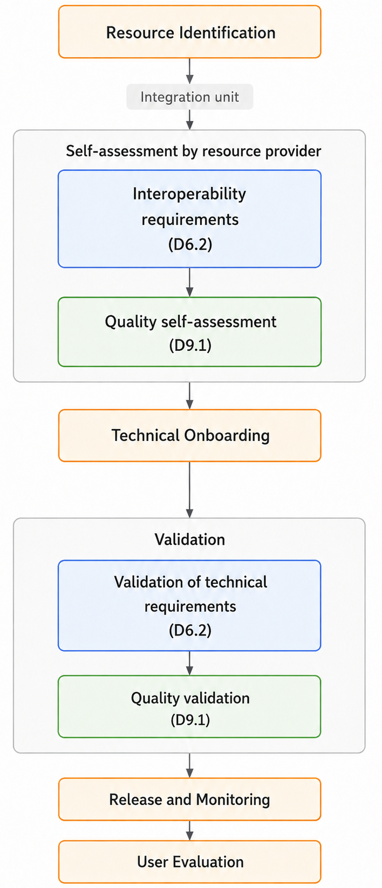
<figcaption>
Figure 1. Workflow showing the CAF in the context of the integration roadmap.
</figcaption>
</figure>

## How to use this document

### Intended audience

**Primary audience**

The primary audience for this document consists of:

- Internal ECHOES partners, including WP leaders and consortium members involved in the integration, development, governance, and sustainability of the ECCCH.

- Providers of resources, such as datasets, metadata, semantic resources, software applications, and other digital services intended for integration into the ECCCH, particularly cascading projects and sister projects.

For these stakeholders, D9.1 provides a reference framework that clarifies which dimensions of quality and performance are relevant for assessment, how resources are categorized, and which types of criteria may apply to each category. It is intended to support alignment across WPs and to help resource providers understand the broader assessment landscape beyond technical integration requirements.

**Secondary audiences**

Decision-makers and policy stakeholders are also secondary audiences. For this group, D9.1 provides a high-level overview of the assessment approach supporting the ECCCH. It highlights the quality dimensions and assessment principles intended to guide monitoring activities and long-term governance. However, this deliverable does not yet define the final set of indicators, measurable KPIs, or target thresholds.

In addition, several operational target groups identified in Deliverable D2.2 (Niccolucci et al., 2024) should also be considered part of the secondary audience, particularly:

- Cultural Heritage Professionals (Target Group 1)

- Cultural and Creative Industries (Target Group 2)

- Open Science Digital Communities (Target Group 4)

Many of the evaluation dimensions and criteria presented in this deliverable are directly relevant to these groups, especially Cultural Heritage Professionals and Open Science Digital Communities, which will both contribute to and rely on ECCCH resources in their professional practice. Dimensions such as usability, accessibility, data quality, semantic interoperability, reliability, and community relevance are closely linked to their needs, expectations, and workflows. For these stakeholders, D9.1 increases transparency regarding how resources within the ECCCH will be assessed beyond technical integration requirements. In doing so, it helps build trust in the ecosystem and clarifies the quality and performance expectations that resources will be expected to meet over time.

This document is also relevant to other EU projects and initiatives at both the European and national levels, including Research Infrastructures and the European Strategy Forum on Research Infrastructures (ESFRI). Reflecting the close relationship between the ECCCH and the Forum, it follows the recommendations set by its Working Group on Monitoring of Research Infrastructures Performance (European Strategy Forum on Research Infrastructures, 2019).

This deliverable should therefore be understood as a foundational document. It defines conceptual structures, resource categories, and evaluation dimensions, but the specific indicators, measurement procedures, responsibilities, and KPI frameworks will be further specified in subsequent documents and deliverables, in coordination with other WPs and through the associated wiki.

### Suggested sections by stakeholder profile

To support efficient navigation of this deliverable, the table below highlights sections that may be of particular interest to different stakeholder groups, based on their roles and likely information needs. The table is intended as a practical guide rather than a comprehensive map of all possible uses of the document.

<table>
<caption>
Table 1. Suggested sections by stakeholder profile.
</caption>
<colgroup>
<col style="width: 25%" />
<col style="width: 24%" />
<col style="width: 49%" />
</colgroup>
<thead>
<tr>
<th style="text-align: left;"><em>If you are a...</em></th>
<th style="text-align: left;"><em>Looking for...</em></th>
<th style="text-align: left;"><em>Suggested Sections (Context)</em></th>
</tr>
</thead>
<tbody>
<tr>
<td style="text-align: left;">ECHOES Partner / WP Leader</td>
<td style="text-align: left;">How the framework relates to your WP and to project-level KPIs</td>
<td style="text-align: left;">
<a href="#_Ref226445185">Annex D</a> (Interdependencies by WP)

Section <a href="#evaluation-of-the-eccch-as-a-cloud">6.10</a> (Evaluation of the ECCCH as a whole)

Section <a href="#resources-of-the-caf">7.1</a> (Resources of the CAF)

Section <a href="#pilot-related-workflows">8</a> (Pilot-related workflows)

<a href="#_Ref226795913">Annex B</a> (Consolidated KPI lists)
</td>
</tr>
<tr>
<td style="text-align: left;">Data or Metadata Provider</td>
<td style="text-align: left;">Metadata and knowledge graph quality, relevant standards, and assessment approaches</td>
<td style="text-align: left;">
Section <a href="#data-metadata-and-knowledge-graph-data">3.3.1</a> (Data/Metadata/KG frameworks)

Section <a href="#evaluation-of-metadata-and-knowledge-graph-data">6.2</a> (Evaluation of Metadata/KG)

Section <a href="#example-2-assessment-of-knowledge-graph-data">7.2.2</a> (Assessment procedures)
</td>
</tr>
<tr>
<td style="text-align: left;">Software Developer / Technical Team</td>
<td style="text-align: left;">Software quality dimensions, technical criteria, and possible metrics</td>
<td style="text-align: left;">
Section <a href="#software-products">3.3.2</a> (Software products)

Section <a href="#evaluation-of-software">6.6</a> (Evaluation of Software)

Section <a href="#implementation-of-the-caf">7</a> (Implementation of the framework)
</td>
</tr>
<tr>
<td style="text-align: left;">Infrastructure or Cloud Service Provider</td>
<td style="text-align: left;">Service availability, reliability, operational monitoring, and related standards</td>
<td style="text-align: left;">
Section <a href="#infrastructures-and-digital-services">3.3.3</a> (Infrastructure frameworks)

Section <a href="#evaluation-of-infrastructure-and-digital-services">6.7</a> (Evaluation of infrastructure and digital services)
</td>
</tr>
<tr>
<td style="text-align: left;">CH Professional / Researcher</td>
<td style="text-align: left;">Data evaluation, community relevance</td>
<td style="text-align: left;">
Section <a href="#evaluation-of-metadata-and-knowledge-graph-data">6.2</a> (Evaluation of Metadata/KG)

Section <a href="#evaluation-of-community-services">6.8</a> (Community Services)
</td>
</tr>
<tr>
<td style="text-align: left;">Decision Maker / Policymaker</td>
<td style="text-align: left;">High-level assessment approach, and alignment with ESFRI-related monitoring approaches</td>
<td style="text-align: left;">
Section <a href="#landscape-of-monitoring-and-evaluation-frameworks">3.1</a> (Monitoring frameworks)

Section <a href="#strategic-monitoring-of-research-infrastructures">3.3.4</a> (ESFRI RI monitoring)

Section <a href="#evaluation-of-the-eccch-as-a-cloud">6.10</a> (Evaluation of the ECCCH)

Section <a href="#implementation-of-the-caf">7</a> (Implementation of the framework)
</td>
</tr>
<tr>
<td style="text-align: left;">Sister Project</td>
<td style="text-align: left;">Evaluation of external contributions</td>
<td style="text-align: left;">
Section <a href="#evaluation-dimensions-tools-and-indicators">6</a> (Evaluation dimensions and tools)

Section <a href="#implementation-of-the-caf">7</a> (Implementation of the framework)
</td>
</tr>
<tr>
<td style="text-align: left;">Ethicists / Ethics Committee member</td>
<td style="text-align: left;">User safeguards, informed consents, assessment of AI-related processes</td>
<td style="text-align: left;">
Section <a href="#ethics-of-the-caf">4.6.1</a> (Ethical principles)

Section <a href="#evaluation-of-ai-enabled-resources">6.9</a> (AI evaluation)

Section <a href="#resources-related-to-ethics">7.1.3</a> (Ethics-related resources)
</td>
</tr>
<tr>
<td style="text-align: left;">Semantic Engineer</td>
<td style="text-align: left;">Evaluation of semantic resources</td>
<td style="text-align: left;">Section <a href="#evaluation-of-semantic-resources">6.5</a> (Evaluation of Semantic Resources)</td>
</tr>
</tbody>
</table>

### Cross-reference table

To clarify how this deliverable fits within the broader ECHOES documentation, the table below provides a quick reference to project’s main resources and context. This summary does not replace the detailed analysis of interdependencies provided later in [Annex D](#_Ref226445185).

| *More about...* | *Primary Document(s)* | *Context* |
|:---|----|----|
| Terminology and definitions | ECHOES Glossary (T4.2.3) | Serves as the primary reference for terminology used across the project. |
| Project-wide quality and risk KPIs | D1.3 Quality and Risk Management Plan (Rodier, Gadoin and Sampaio, 2025) | Outlines high-level indicators for project implementation performance and risk mitigation. |
| Stakeholder and target group profiles | D2.2 Communication & Dissemination Plan (Niccolucci et al., 2024) | Defines the target groups used to segment adoption- and usage-related metrics. |
| Strategic rationale and integration goals | D3.1 Integration Strategy (Kotzinos et al., 2025) | Provides the strategic rationale, conceptual basis, and governance roles for resource integration. |
| Operational integration processes | D3.2 Integration Roadmap (Chambers et al., 2025) | Describes the practical processes for incorporating diverse digital resources into the ECCCH ecosystem. |
| Community needs and acceptance | D4.1 Community Needs / D4.2 Engagement Strategy | Identifies user expectations, needs, and barriers relevant to assessing the perceived value of cloud resources. |
| Capacity building and training impact | D5.3 Strategy and Roadmap for Training (Azzola and Habibi, 2025) | Includes indicators related to learner satisfaction and the uptake of training and vertical applications. |
| Technical standards and requirements | D6.2 Interoperability Guidelines (Kowalska et al. 2026) | Specifies the data standards, protocols, and APIs that resources must meet to be validated. |
| Foundational governance principles | D10.1 Founding Principles of Cloud Governance (Pollé et al., 2025) | Establishes the high-level governance principles for the management of the ECCCH. |
| Mission, vision, added value, and strategic R&I objectives of the ECCCH | D11.1 ECCCH's Strategic Research and Innovation Agenda | Presents the Strategic Research and Innovation Agenda (SRIA) that guides the development and long-term sustainability of the ECCCH. |

Table 2. Cross-reference table for other ECHOES documents.

### Maintenance and updates

This document should be understood as a living document rather than a fixed specification. The CAF is expected to evolve alongside the progressive development of the ECCCH ecosystem, in response to emerging community needs, technical developments, and lessons learned from assessment and monitoring activities.

While this deliverable establishes the conceptual foundations, resource categories, and high-level evaluation dimensions of the framework, these elements will be refined as the ECHOES project progresses, the ecosystem becomes operational, and assessment practices become more established.

Like Deliverable D6.2 (Kowalska et al. 2026), this document is complemented by a dynamic wiki. This companion resource will provide more granular and more frequently updated information, including resource-specific evaluation dimensions, applicable tools, refined indicators, and practical implementation guidance. This approach allows the project to balance formal reporting requirements with the flexibility needed for continuous improvement and adaptive governance.

<table style="width:100%;">
<colgroup>
<col style="width: 99%" />
</colgroup>
<thead>
<tr>
<th>
<strong>Companion wiki.</strong> The CAF has a companion wiki, currently under development. A preliminary version is available here:

<a href="https://echoes-eccch-technical.github.io/cloud-assessment-framework/">https://echoes-eccch-technical.github.io/cloud-assessment-framework/</a>
</th>
</tr>
</thead>
<tbody>
</tbody>
</table>

D9.1 therefore represents the first step in an iterative process through which the CAF will be progressively further specified and implemented in coordination with other WPs and project activities.

## Frameworks, standards, and best practices for monitoring and assessment

| **Selective review.** This section does not aim to provide an exhaustive survey of all existing frameworks, standards, or best practices related to monitoring and assessment. Its purpose is to identify approaches that are especially useful for shaping the CAF in the ECCCH context. |
|----|

This section reviews selected frameworks, standards, and best practices for monitoring, assessment, and quality assurance that are relevant to the ECHOES ecosystem and to the development of the CAF. The review is not intended to be exhaustive. Rather, it identifies approaches that are particularly useful for defining assessment dimensions, indicators, data sources, responsibilities, and implementation mechanisms appropriate to the ECCCH context. It begins by examining recent monitoring and assessment frameworks in Heritage Science, Open Science, and related European initiatives. It then summarizes transversal best practices, such as KPI design and user studies, before turning to resource-specific frameworks and standards for key resource types, including data, metadata, and knowledge graphs; software applications; research infrastructures and digital services; and Open Science and collaboration, with additional references relevant to CH institutions.

### Landscape of monitoring and evaluation frameworks 

This subsection reviews selected recent publications on monitoring, assessment, and quality assurance, with particular attention to Open Science, Heritage Science, and research infrastructure initiatives that are relevant to the ECCCH context and aligned with the European Commission (EC).

The ESFRI Working Group on Monitoring of Research Infrastructures Performance proposed a shared, KPI-based approach for monitoring the performance of European Research Infrastructures (European Strategy Forum on Research Infrastructures, 2019). It links common RI objectives to sets of indicators spanning inputs, outputs, and outcomes. The report also stresses that indicators must be adapted to each RI’s mission, context, and stage of development, and that quantitative KPIs should be complemented by narrative interpretation to explain context, contribution, and outcomes not fully captured by numbers. This point is particularly relevant for ECHOES, where the diversity of ECCCH resources makes a mixed quantitative and qualitative approach especially important.

The European Research Infrastructure for Heritage Science (E-RIHS) Quality System Implementation Plan (Doherty, Andrews and Virgili, 2024) provides a particularly relevant example from Heritage Science. It defines a quality management framework combining a quality policy, which establishes principles and objectives, with operational procedures that translate them into responsibilities, instructions, and KPIs. Its scope includes access services, training activities, and external partnerships or endorsements, and it treats KPIs as instruments that should evolve as the infrastructure moves from initial operations toward a more stable phase.

In the European Open Science Cloud (EOSC) context, the Open Science Monitor specifications (Papastefanatos et al., 2018) provide an early example of a monitoring architecture for Open Science. They describe a process that includes configuration, harvesting from external data sources, analysis, scoring, and dissemination, with data collected through external APIs and then parsed, validated, and harmonized. The monitoring focus includes dimensions closely related to FAIR and openness. For ECHOES, this example is useful mainly as a reference for data collection and processing methods rather than as a direct model for governance.

A more recent reference is the EOSC Partnership Monitoring Framework, updated in 2024 (EC and EOSC Association, 2024). It links general, strategic, and operational objectives to a structured set of KPIs, specifies reporting entities and data providers, and includes practical data collection methods such as surveys and desk studies. EOSC also presents it as an adaptive monitoring and evaluation framework that is revised as the EOSC environment evolves. This is especially relevant to ECHOES because it illustrates how responsibilities, data sources, and indicators can be defined in a distributed ecosystem.

Another useful example is the Monitoring and Evaluation Framework developed by the INCENTIVE project, a Horizon 2020 project focused on Citizen Science (Angelidou *et al.*, 2022). It distinguishes between a monitoring framework for collecting data through different methods, tools, and indicators, and an assessment and evaluation framework for interpreting those data in relation to objectives and impact. The document combines questionnaires, aggregated reporting templates, organizational reporting, and stakeholder interviews, and it also assigns responsibilities for data collection and coordination.

This combination of quantitative and qualitative evidence within a structured governance logic is equally present in monitoring and assessment approaches for cultural heritage at the international level, particularly in the context of World Heritage governance, where the International Council on Monuments and Sites (ICOMOS) operates within the broader framework of the UNESCO World Heritage Convention. UNESCO identifies ICOMOS as the advisory body responsible for evaluating cultural and mixed properties proposed for inscription on the World Heritage List, while ICOMOS also describes its role as advising on the condition of inscribed properties. More broadly, ICOMOS contributes through methodological guidance, monitoring-related practices, and capacity-building resources, including its Member Handbook (ICOMOS International Secretariat, 2024). This example shows how heritage assessment can combine governance, expert review, monitoring procedures, and methodological guidance across multiple levels.

This multi-level architecture is further reinforced by the UNESCO Culture\|2030 Indicators, which establish a conceptual policy layer linking heritage monitoring to broader sustainable development goals. It is complemented by the technical standards of CEN/TC 346 and ISO/TC 349, which provide the harmonized methodologies for material analysis and documentation required for consistent monitoring across large-scale systems like the ECHOES framework.

To complement the external frameworks reviewed above, an internal stocktaking was conducted among ECHOES consortium partners to map their existing monitoring, evaluation, and quality assurance (QA) practices. The goal was to set a common baseline by understanding what each institution already does in terms of data collection and assessment across different operational contexts. The stocktaking revealed that user-related data collection is a widespread practice across the consortium, serving legal, operational, and strategic purposes. Institutions collect data to fulfil contractual and administrative requirements, monitor service quality, and support evidence-based decision-making. Common instruments include website registrations, user inquiries, and usage analytics, which feed into ongoing service refinement and strategic planning. Indicators such as website registrations or user inquiries enable the continuous refinement of services and lead to strategic planning and evidence-based decision-making.

Given the diverse nature of the ECHOES consortium, institutions have implemented formal evaluation plans on different scales. While larger institutions apply structured and systemized evaluation protocols as part of their QA frameworks, small and medium-sized CHIs rely on service-specific templates and basic evaluation activities. Standardized procedures embedded into an evaluation cycle provide summaries via evaluation matrices in order to assess performance across transversal activities.

These frameworks suggest several principles that are especially relevant for the CAF: indicators should be aligned with strategic objectives; responsibilities and data sources should be explicitly identified; quantitative monitoring should be complemented by qualitative interpretation; and frameworks should remain adaptable as infrastructures and communities mature.

### Best practices for monitoring and evaluation

The following subsections summarize best practices relevant to monitoring and assessment across the ECCCH ecosystem. They focus on practices that are broadly applicable across resource types, while standards and best practices specific to particular resource categories are reviewed separately in Section [3.3](#review-of-per-resource-evaluation-frameworks-and-standards).

#### Best practices in KPI design

Key Performance Indicators (KPIs) are essential tools for monitoring progress toward the objectives of an organization, program, or infrastructure, and for supporting evidence-based adjustments and informed decision-making. Effective KPIs are commonly expected to satisfy the SMART criteria, that is, to be Specific, Measurable, Achievable, Relevant, and Time-bound (Doran, 1981). In addition, they should be objective, transparent, internally consistent, and feasible to maintain.

In the context of Research Infrastructures, ESFRI recommends that KPIs comply with the RACER criteria (European Strategy Forum on Research Infrastructures, 2019). ESFRI also advises that each KPI be documented through a reference sheet specifying its definition, rationale, data sources, calculation method, and reporting frequency, to support consistent interpretation and comparability.

The Better Regulation Toolbox (EC, 2025) also adopts the RACER criteria and complements them with six additional quality requirements for indicators: attributability, data availability and quality, timeliness, definition of baselines and targets, metadata specification, and compliance with data protection frameworks

Within the ECCCH context, KPIs should therefore be understood as one component of a broader assessment approach. They should be complemented by more granular and case-specific information so that individual ECCCH resources can be assessed in a way that supports interpretation, comparison where appropriate, and the identification of areas for improvement. Most of these principles are reflected in the methodology described in Section [4](#monitoring-and-evaluation-methodology).

| **KPIs are not enough.** Within this framework, KPIs are important but not sufficient on their own. They should be complemented by more granular, resource-specific, and often qualitative evidence in order to support meaningful interpretation and improvement. |
|----|

#### Best practices for collecting evaluation data

Assessment activities across the ECCCH ecosystem will require the collection of both quantitative and qualitative data. As emphasized in the Evaluation Handbook (EC: Directorate-General for International Partnerships, 2025), evaluation data may be collected through both field-based and desk-based activities, using tools that range from well-established methods such as document reviews, surveys, and interviews, to newer approaches enabled by Information and Communication Technologies (ICT).

In the context of the CAF, however, the most relevant sources of evidence are expected to be:

- Data generated through user studies and pilots, including questionnaires, interviews, observation, and usability-related instruments.

- System-generated data, such as logs and analytics.

- Structured information provided by resource providers, including questionnaires, checklists, and related documentation.

A first major source of evaluation data will come from user studies and pilots. These are particularly important where the assessment concerns usability, usefulness, perceived value, accessibility, community relevance, or other dimensions that depend on the experience of users and stakeholders. In such cases, questionnaires and surveys can provide structured information that can be aggregated and compared across resources or activities. Closed-ended questions are useful when the goal is to produce consistent measures, while open-ended questions can capture explanatory detail, unexpected issues, and suggestions for improvement. To be effective, questionnaires should be directly linked to the relevant assessment questions, dimensions, and indicators, and should remain concise enough to avoid respondent fatigue and low response rates (EC: Directorate-General for International Partnerships, 2025).

In addition to surveys, interviews, observations and other user research methods may be needed when deeper contextual understanding is required. Interviews can help clarify the reasons behind user perceptions, barriers to adoption, or implementation challenges. Observation can be especially useful in Pilot Tests and usability-related assessments, since it makes it possible to examine actual behavior, workflows, and task performance rather than relying only on self-reported evidence. These methods are particularly relevant when the objective is not only to measure outcomes, but also to understand why problems occur and how resources or services might be improved.

A second major source of evaluation data will come from system-generated data, especially logs and analytics. These sources are likely to be central for the continuous assessment of many ECCCH resources because they can provide ongoing evidence about actual usage, service uptake, frequency of access, interaction patterns, reliability, and other forms of operational performance. Compared with self-reported data, logs and analytics can offer more direct and scalable information on how resources and services are used in practice. At the same time, such data requires careful interpretation. Usage patterns do not automatically reveal user satisfaction, value, or impact, and analytics may need to be complemented by qualitative evidence to explain what observed patterns mean in context.

A third major source of evaluation data will come from resource providers. Provider-supplied information, collected through diverse tools such as questionnaires, checklists, metadata records, and technical documentation, will be particularly important for assessing aspects that cannot be derived directly from logs or user studies. This may include information about compliance with standards, documentation quality, interoperability features, service characteristics, security measures, or other resource-specific properties. In this area, structured questionnaires and checklists can help ensure consistency across heterogeneous resources while also reducing ambiguity in reporting. However, self-reported information should be validated where possible through documentary review, technical verification, or triangulation with other evidence sources (Section [7.2](#self-assessment-and-quality-review-procedures)).

Across these evidence sources, document review remains an important supporting method. Relevant materials may include technical documentation, metadata records, onboarding materials, pilot protocols, training materials, and service descriptions.

The Evaluation Handbook (EC: Directorate-General for International Partnerships, 2025) also highlights the importance of addressing common risks in data collection, including confirmation bias, strategic distortion, self-censorship, and poorly formulated questions. These considerations are directly relevant to the CAF. In practice, this means that data collection instruments should use clear and neutral wording, avoid unnecessary complexity, protect anonymity where appropriate, and rely on triangulation across multiple sources whenever feasible.

For the CAF, no single data source will be sufficient across all resource categories and evaluation dimensions. A mixed-methods approach will therefore be necessary, combining user-based data, provider-supplied information, and system-generated data according to the nature of the component being assessed and the specific purpose of the assessment. This is especially important in our context, where technical quality, actual usage, usability, interoperability, and community relevance each require different but complementary forms of evidence.

To support later implementation, more detailed guidance on the operational use of specific data collection instruments, data sources, and validation procedures will be developed in the associated wiki (see also Section [7.2](#self-assessment-and-quality-review-procedures)).

#### Ethics in evaluation and user research

Ethics is a fundamental component of evaluation and assessment activities, especially when these involve human participants, personal data, or the observation of user behavior. Guidance from the EC emphasizes that evaluation processes should be conducted in accordance with core ethical principles such as honesty, transparency, independence, and respect for the rights and dignity of all stakeholders (EC: Directorate-General for International Partnerships, 2025). It also stresses the importance of identifying and mitigating ethical risks throughout the evaluation cycle, from the design of data collection instruments to the interpretation and reporting of results. Some of the ethical principles adopted in this document, particularly in Section [4.6](#ethical-and-guiding-principles-of-the-caf), are adapted from this guidance (EC: Directorate-General for International Partnerships, 2025).

These considerations are especially relevant in the context of the ECCCH, where assessment activities may involve users, resource providers, partner institutions, and pilot participants. Ethical practice in this setting requires particular attention to issues such as informed consent, privacy and data protection, the minimization of burdens on participants, and the appropriate use of data collected through questionnaires, interviews, observation, logs, and analytics. It also requires transparency about the purpose of data collection, the intended use of results, and any limitations affecting interpretation.

Closely related to ethics in evaluation is *user research*, which can be understood as the systematic study of users’ goals, needs, and capabilities to inform the design, development, or improvement of products and services (Schumacher, 2010). Within this broader area, *usability testing* is one of the main approaches employed to determine whether intended audiences can achieve their goals effectively. Usability can be defined as the extent to which a product can be used by specified users to achieve specified goals with effectiveness, efficiency, and satisfaction in a specified context of use (ISO 9241). In practice, this means that usability-related assessment may involve collecting data such as task completion rates, errors, task time, help-seeking behavior, user satisfaction, and reported usability problems (Sauro and Lewis, 2016).

User research and usability testing may serve different purposes within the CAF. In some cases, they serve a formative purpose, identifying problems and areas for improvement during the development or refinement of a resource or service. In other cases, they are used summatively, to assess performance against expectations, compare alternative solutions, or provide information for more formal evaluation purposes (Sauro and Lewis, 2016). Both approaches are relevant to the ECCCH context, particularly in pilot activities.

From an ethical perspective, user research should be designed so that it generates useful evidence while protecting participants from unnecessary risk, pressure, or confusion. This includes using proportionate and clearly worded instruments, ensuring that participation is voluntary, avoiding misleading or overly intrusive forms of observation, and interpreting findings with due regard for the limits of the data collected. Ethical and methodologically-sound user research is therefore not only a matter of compliance, but also a condition for producing trustworthy and useful assessment results.

### Review of per-resource evaluation frameworks and standards

#### Data, metadata and knowledge graph data

Data, metadata, and knowledge graph resources are a core part of the ECCCH ecosystem because they support the discovery, interpretation, interoperability, and reuse of cultural heritage assets. This subsection reviews selected frameworks, standards, and practices that are especially relevant to assessing and improving the quality of these resources in Cultural Heritage and Open Science contexts. The discussion starts with transversal aspects, such as FAIRness, and then proceeds to the aspects that are specific to each resource category.

**FAIR principles**

Evaluation frameworks for research data are strongly influenced by the FAIR principles (Findable, Accessible, Interoperable, and Reusable) introduced by Wilkinson et al. (2016). These principles have become a widely adopted reference for assessing the readiness of datasets and metadata for reuse in Open Science and cultural heritage contexts. In practice, FAIR-based assessment focuses on four broad dimensions: Findability, Accessibility, Interoperability, and Reusability.

- **Findable**: Data and metadata should be easy to discover by both humans and machines. This requires the use of globally unique and persistent identifiers, rich descriptive metadata, and registration or indexing in searchable repositories or catalogs, enabling datasets to be reliably located and referenced.

- **Accessible**: Data and metadata should be retrievable through standardized, open, and well-documented communication protocols. Access mechanisms may include authentication and authorization, when necessary, while metadata should remain accessible even if the data themselves are no longer available.

- **Interoperable**: Data and metadata should use formal, shared, and broadly applicable standards for data and knowledge representation. This includes the use of controlled vocabularies, ontologies, and standardized formats that allow them to be integrated with other datasets and systems.

- **Reusable**: To maximize reuse, data and metadata should be richly described with accurate contextual information, clear provenance, and explicit licenses. Compliance with relevant community standards further ensures that datasets can be properly interpreted and reused in different research or application contexts.

The practical implementation of the FAIR principles is supported by several initiatives and tools (Section [6.2.2](#assessment-instruments-and-indicators)), such as registries of standards, repositories, and policies across disciplines, or tools supporting the assessment of FAIRness by applying community-defined metrics and rubrics to datasets, software, and other research outputs.

Although the FAIR principles provide a widely used framework for improving the discoverability, accessibility, interoperability, and reusability of research data, they do not by themselves provide a complete model for assessing the quality of data and metadata. For this reason, they are often complemented by frameworks that address additional quality dimensions more explicitly.

| **FAIR is not the same as quality.** FAIR principles are highly relevant for assessing discoverability, accessibility, interoperability, and reuse, but they do not by themselves provide a complete model for data or metadata quality. Additional quality dimensions are needed, especially in cultural heritage contexts. |
|----|

**Quality of metadata and knowledge graph data**

Research on data quality commonly adopts the view that quality should be assessed in relation to intended use, often summarized as “fit for use.” On this basis, data quality is typically described through a set of measurable dimensions. A widely used classification distinguishes four main categories: intrinsic, contextual, representational, and accessibility-related dimensions (Zaveri et al. 2015). Intrinsic dimensions refer to properties inherent in the data itself, such as accuracy and consistency. Contextual dimensions address whether the data are relevant, sufficiently complete, and appropriate for the context of use. Representational dimensions concern clarity and interpretability, while accessibility-related dimensions refer to the ability to retrieve, access, and reuse the data through suitable mechanisms and standards.

In the context of knowledge graphs, evaluation approaches often focus on a set of intrinsic quality dimensions that capture the reliability and usability of the graph structure. Commonly considered aspects include accuracy (the degree to which facts correctly represent real-world entities and relationships), consistency (the absence of conflicting statements), completeness (the coverage of relevant entities and relations), timeliness (the extent to which information is up to date), and redundancy (the presence of duplicate or overlapping entities or assertions).

A wide range of tools and frameworks has been developed to assess metadata and knowledge graph quality, differing in purpose, methodological basis, and degree of automation. Existing surveys of knowledge graph quality assessment, including Zaveri et al. (2016) and Radulovic et al. (2017), identify several broad methodological families. For the purposes of this document, these approaches are grouped into six categories: rule-based validation tools, statistical and metric-based approaches, link discovery and interlinking tools, data integration and cleaning frameworks, FAIR compliance tools, and human-in-the-loop methods.

- **Rule-based validation tools**: Assess metadata quality by applying predefined rules derived from schemas, ontologies, or domain standards. Constraint languages such as Shape Constraint Language (SHACL) and Shape Expressions (ShEx) allow the specification of validation rules that check structural and semantic requirements, such as mandatory properties, datatype constraints, or cardinality restrictions. These tools are widely used to verify schema conformance, structural consistency, and logical coherence in Resource Description Framework (RDF) datasets. Examples include SHACL engines, ShEx validators, and Ontology Web Language (OWL) reasoners.

- **Statistical and metric-based approaches**: Analyze quantitative characteristics of datasets to identify anomalies, incompleteness, or irregular patterns. Rather than enforcing predefined constraints, these methods compute descriptive indicators such as the proportion of populated fields, value distributions, or connectivity measures. They are particularly useful for large datasets where manual inspection is impractical. Tools in this category can identify sparsely described records, missing properties, or unusually short descriptions, thereby providing insights into metadata completeness and structural patterns.

- **Link discovery and interlinking tools**: Evaluate and improve the connections between entities across datasets. In knowledge graphs, interlinks enable semantic integration and contextualization of information. These tools can detect duplicate entities, discover missing links, or evaluate the quality of existing connections. These approaches help improve interlinking completeness, conciseness, and overall graph connectivity.

- **Data integration and cleaning frameworks**: Address quality issues that arise when combining datasets from multiple sources. CH data are often aggregated from institutions using heterogeneous schemas and cataloguing practices, which can introduce inconsistencies, duplicates, or missing relationships. Tools in this category apply heuristics, probabilistic models, or graph algorithms to reconcile entities, normalize values, or infer missing information. Such approaches contribute to improving schema consistency, population completeness, and interoperability across integrated datasets.

- **FAIR compliance tools**: Evaluate how well datasets and metadata align with the FAIR principles. These tools typically perform automated checks on metadata records, persistent identifiers, access protocols, licensing information, and schema usage.

- **Human-in-the-loop approaches**: Address quality dimensions that remain difficult to assess through automated methods alone, including semantic accuracy, contextual relevance, and cultural interpretation. These approaches incorporate expert knowledge directly into the assessment process through methods such as expert validation, curator review, crowdsourced review of knowledge graph statements, or institutional quality checklists. Several tools combine automated selection of candidate statements with human validation, allowing quality assessment to scale while preserving expert oversight.

In practice, metadata quality management often follows iterative workflows that include metadata creation, validation, enrichment, aggregation, and quality monitoring. During these processes, automated validation tools are typically combined with expert curation and institutional guidelines to ensure both technical consistency and semantic accuracy.

Despite the availability of numerous tools and frameworks, several challenges remain in the evaluation of CH data and metadata. CH datasets are often heterogeneous, originating from institutions with different cataloguing practices and metadata standards. Multilingual descriptions, incomplete metadata, and semantic ambiguity further complicate automated evaluation. Moreover, while automated tools can efficiently detect structural inconsistencies, many aspects of semantic interpretation and contextual relevance still require expert validation.

Several initiatives in the CH domain have developed domain-specific frameworks and guidelines to support the evaluation and improvement of metadata quality in aggregated CH collections. A widely used reference in the CH domain is the Europeana Publishing Framework (EPF), which provides guidelines and quality tiers for publishing CH data through the Europeana platform (Scholz, 2015). The framework defines several levels of metadata and content quality, encouraging providers to progressively enrich their records with structured metadata, contextual information, and links to authoritative resources. These tiers address aspects such as metadata completeness, the presence of contextual links, and the availability of high-quality digital representations.

A recent example for the evaluation of *metadata enrichments* is the methodology used by Europeana Foundation to validate enrichment efforts (Isaac, 2024). The methodology is explicitly designed for enrichments produced through a range of processes, from fully manual to fully automated. The methodology combines two main parts. First, each enrichment effort is documented through an analysis phase in which the partner responsible for the enrichment documents its goals, sources, methods, and main findings. The methodology also recommends making evaluation data and supporting documentation openly accessible whenever possible, both to build trust and to enable later reuse.

Second, the methodology defines an acceptance-validation workflow for enrichment outputs. This workflow consists of sampling enrichments for validation, assessing enrichments on the sample dataset, validating the results against agreed quality requirements, and, where relevant, using the assessment to calibrate confidence scores and thresholds or to improve the enrichment process itself (Isaac, 2024).

In the assessment phase, the enrichments in the sample are evaluated for their fitness for the application they are meant to support, such as search improvement. Human evaluation remains key in many cases, because enrichments may be subjective and affected by inter-annotator variability. The methodology therefore recommends early testing of evaluation campaigns, careful elaboration of evaluator guidelines, and explicit attention to typical enrichment issues and possible sources of bias.

The questionnaire used by Europeana (Isaac, 2024) also provides a useful model for documenting automatic enrichment efforts. Its questions include, for example: the goal of the enrichment and the value it is expected to bring; the source of the enrichments, such as crowdsourcing, expert annotation, or a specific automatic enrichment tool; the type and target of the enrichment; the criteria used to select the dataset; the total number of enrichments produced and delivered; the main evaluation methodology and tools used; whether the evaluation covered the full enrichment set or only a sample; who the reviewers or annotators were; what results were obtained; what confidence thresholds are recommended for exploitation; and what issues were observed during evaluation.

**Quality of digital assets**

Digital assets include images, videos, audio, 3D models, and other resource types. Common quality dimensions such as accuracy, completeness, and consistency take on different meanings and require different assessment approaches depending on the type of digital resource. For example, evaluating these dimensions for an image is very different from evaluating them for a 3D model. A further challenge is that the quality of digital assets is often highly dependent on the intended context of use. For instance, a 2048 × 2048 image of a painting may be fully adequate for creative industry applications or virtual tourism, while being insufficient for more demanding research purposes such as conservation monitoring.

For these reasons, assessing the quality of digital assets remains challenging. Several ECCCH sister projects already work with these types of resources, and some are actively addressing the quality assessment of digital representations. The evaluation of digital asset quality should therefore be understood as a collaborative effort across the broader ECCCH community.

| **Digital asset quality is context-dependent.** The quality of images, 3D models, and other digital assets cannot usually be judged through universal thresholds alone. What counts as adequate quality depends strongly on the intended use, the type of asset, and the acquisition context. |
|----|

**Quality of digital images**

In cultural heritage imaging, image quality is not only a matter of visual appearance. It directly affects documentation, conservation, interpretation, reuse in digital platforms, and downstream analysis tasks such as optical character recognition (OCR), segmentation, and material inspection. Many common image quality issues are shared with other domains, but they are especially significant in Cultural Heritage collections. These include:

- Insufficient spatial resolution

- Blur caused by focus errors or motion

- Sensor noise

- Compression artifacts

- Overexposure or underexposure

- Uneven illumination

- Shadows

- Specular reflections

- Inaccurate color reproduction

- Color shifts caused by color profile issues during format conversion

- Low contrast

- Deformations caused by lenses

- Absence of scale

As an illustrative example, in manuscripts and early printed books, the issues above interact with aging substrates, stains, faded inks, and irregular textures. In museum and archival digitization workflows, they are further shaped by capturing constraints, object fragility, and heterogeneous acquisition processes. Recent work on manuscript digitization and quality control highlights this combination of general imaging defects and cultural heritage-specific degradation and emphasizes that automated checks are most effective when complemented by expert review (Moutsis et al., 2025).

Two major approaches are commonly distinguished in image quality assessment: *reference-based* methods and *no-reference (NR)*, or blind, methods. Reference-based methods compare a captured image with a target assumed to be of higher quality. This includes full reference metrics based on comparisons such as Peak Signal-to-Noise Ratio (PSNR) and Structural Similarity Index Measure (SSIM), although recent work has questioned the assumption that the reference is necessarily perfect. By contrast, no-reference methods estimate quality from the image alone. This distinction is particularly important in cultural heritage, since in many real settings no gold standard image is available. The capture may be the first high-quality representation ever produced, or the object itself may have changed over time. In practice, blind image quality assessment is therefore often the more realistic approach for cultural heritage workflows, especially at scale (Chen et al. 2025).

The literature also exhibits two important limitations. First, many studies address only a narrow class of defects, such as blur, contrast loss, noise, compression, or exposure problems, or they focus on highly specific domains such as document images, hyperspectral data, remote sensing images, or manuscript collections. Second, many no-reference methods still rely, either explicitly or implicitly, on Natural Scene Statistics (NSS). In these approaches, models learn what artifact-free images are expected to look like from photographs of natural scenes and then estimate quality by measuring deviations from those patterns. Although this strategy remains common and can be effective, it may be problematic for cultural heritage images, since paintings, illuminated manuscripts, degraded paper, multispectral captures, and reflective objects often depart from ordinary natural scene regularities for valid reasons.

As a result, developing robust quality metrics and tools for arbitrary Cultural Heritage imagery remains difficult. Such methods must account for diverse object types, acquisition modalities, and legitimate visual characteristics, while distinguishing actual defects from historically meaningful texture, traces of aging, or features relevant to conservation. Future tools will likely require domain-aware quality models, richer metadata on capture conditions, and benchmark datasets derived from diverse heritage collections rather than from standard natural image datasets alone (Yang et al., 2024).

**Quality of 3D models**

In Cultural Heritage, the quality of a 3D model includes multiple aspects, such as geometric accuracy, completeness, topological consistency, surface detail, texture fidelity, and suitability for tasks including documentation, conservation, virtual access, restoration planning, and expert analysis.

Commo*n geometry-related defects* include:

- Geometric inaccuracies

- Missing parts caused by occlusion or insufficient coverage

- Holes and non-manifold geometry

- Over-smoothing or loss of fine relief

- Geometric noise

- Scan misregistration

- Decimation/compression artifacts

- Inaccurate scale

- Erroneous surface descriptions

In textured 3D models, *texture-related defects* include:

- Blur

- Low-resolution

- Seams

- Baked lighting

- Color inconsistency, or ghosting caused by imperfect image alignment

In CH workflows, these issues are particularly critical because small geometric features may carry historical or conservation significance, and because acquisition conditions are often constrained by object fragility, reflective materials, restricted viewpoints, or the complexity and scale of heritage sites. Recent cultural heritage-oriented studies and digitization guidelines emphasize that model quality cannot be reduced to a single value. Rather, it depends on the intended use, the type of object, the acquisition method, and the metadata or paradata documenting how the model was produced (Bachi et al., 2024).

A further refinement concerns the distinction between movable heritage and built heritage. Although many of the general quality issues identified above apply across both domains, the requirements, acquisition conditions, spatial scales, and intended uses of 3D representations differ significantly between, for example, museum objects and architectural or archaeological heritage. As a result, the relevant quality criteria and their interpretation may also differ.

In the case of built heritage, it is useful to distinguish between point-based and surface-based representations. These models are often produced through different processing steps and are assessed according to different criteria. Point clouds are typically closer to the primary acquisition stage and are particularly important in survey and documentation workflows, while meshes usually involve additional interpretative and reconstructive steps intended to support visualization, analysis, dissemination, or downstream reuse. For this reason, the quality assessment of built heritage 3D resources should not treat all 3D representations as equivalent.

For point-based models, typical quality issues include insufficient sampling density, registration errors or misalignment between scans, noise and outliers, limited geometric accuracy, fragmented spatial data, and incomplete surface coverage caused by insufficient acquisition. In larger or weakly constrained datasets, metric drifts may also become relevant. Another particularly important aspect in the ECCCH context is the potential absence of a georeferenced coordinate system, which should be regarded as a key requirement for interoperability and spatial integration across resources. These issues are especially significant in built heritage documentation, where metric reliability, completeness, and spatial consistency are often key for reuse.

For surface-based models, additional quality issues include lack of geometric neutrality due to interpretative reconstruction or arbitrary surface completion, over-smoothing or loss of high-frequency geometric detail, topological inconsistencies, and, where textures are used, texture inconsistencies or misalignments. These issues directly affect not only visual quality, but also the reliability of the model for documentation, analysis, conservation-related interpretation, or other expert uses. In this sense, the distinction between acquisition-derived geometry and reconstructed or completed geometry is relevant for quality assessment.

As with 2D image quality, it is useful to distinguish between reference-based and no-reference evaluation approaches. Reference-based methods compare a reconstructed mesh or point cloud against a trusted ground-truth model, such as a higher-accuracy laser scan, calibrated measurements, or a benchmark object. These methods can quantify geometric deviation, point-to-surface distance, coverage, or the fidelity of rendered views. In practice, however, such references are often unavailable in CH contexts. Many artifacts and sites are digitized only once, and there may be no ideal acquisition against which to compare a reconstruction. For this reason, CH researchers increasingly rely on indirect measures, expert judgment, and no-reference indicators derived from the reconstructed geometry, texture, or capture process itself. Recent work on 3D reconstruction for cultural heritage applications shows that objective scores do not always align with human assessment, and that evaluation criteria must reflect the actual heritage use case rather than only generic reconstruction benchmarks (Llull et al., 2023).

A further complication is that many published methods remain narrow in scope. Some address only mesh geometry, others only textured appearance, and many are designed for highly specific data types such as compressed point clouds, immersive media, LiDAR surveys, or photogrammetric reconstructions under controlled conditions. Similarly, part of the no-reference literature on 3D content has focused on point cloud quality assessment, often in the context of compression or streaming rather than heritage documentation. These methods may still be useful, but they do not automatically generalize to arbitrary cultural heritage assets, which may include irregular sculptures, architectural fragments, archaeological sites, hybrid meshes combined with photographs, or models intended for metric analysis rather than visual display. Reviews of no-reference point cloud quality assessment make clear that the diversity of 3D data remains a major challenge (Porcu et al., 2024).

Developing robust quality metrics and tools for arbitrary CH 3D models is therefore particularly difficult. Unlike standard benchmark objects, heritage assets vary widely in many aspects. A metric that penalizes roughness or irregularity may incorrectly classify meaningful weathering, tool marks, inscriptions, or conservation traces as noise. Likewise, aggressive hole filling or smoothing may improve some quality scores while removing historically relevant evidence. In addition, quality in cultural heritage depends not only on geometry or visual appearance, but also on provenance, acquisition conditions, processing decisions, uncertainty documentation, and fitness for reuse. For this reason, current cultural heritage-specific guidance emphasizes quality frameworks that combine technical metrics with metadata, paradata, expert interpretation, and task-oriented validation.

In summary, although both reference-based and no-reference methods are important, there is still no universally reliable quality measure for general cultural heritage 3D content, especially when models differ substantially in modality, scale, and purpose (Ioannides et al., 2025). The evaluation of 3D model quality should therefore be understood as a collaborative effort across the broader ECCCH community. To support this effort, ECHOES will identify and recommend tools that can facilitate the self-assessment of the quality of different types of digital assets. Given the diversity of asset types and the rapid evolution of relevant methods, a wiki is a more suitable place than this deliverable for maintaining a more detailed and updateable inventory of tools, together with guidance on their applicability, strengths, and limitations.

#### Software products

This section briefly reviews previous work on software quality dimensions. Readers who are mainly interested in the list of software quality dimensions adopted in this framework, and their definitions, may skip this section and refer directly to Section [6.6](#evaluation-of-software).

**Software Quality Dimensions**

Software-related evaluation criteria, and software quality in particular, are essential in research infrastructures. The reliability, reproducibility, interoperability, sustainability, and long-term usability of the services provided by a research infrastructure depend directly on the robustness and maintainability of its software resources.

Numerous studies have analyzed the different aspects or dimensions of software quality (Pressman and Maxim, 2015). Although the sets of quality attributes proposed by different frameworks vary, many of these qualities appear in one form or another across most software quality models.

Garvin (1987) proposed eight dimensions for analyzing product quality. Another widely used reference is ISO 9126, which identifies six major software quality factors. The more recent ISO/IEC 25010 model extends and refines these earlier approaches. In this model, software quality is described through nine product quality characteristics.

In recent years, several initiatives within the European Open Science Cloud (EOSC) ecosystem have addressed the specific challenges of research software quality. One important example is the EOSC Task Force on Infrastructure for Quality Research Software report *Ensure Software Quality* (David et al., 2024), which provides a structured overview of software quality attributes and associated metrics relevant to research software. After consolidating overlapping terminology from the literature, the report identifies 126 quality attributes and metrics, grouping them into six categories representing different perspectives on software quality:

- **Source code metrics**: Metrics derived directly from the source code, such as lines of code or number of assertions.

- **Time and performance metrics**: Metrics related to time or productivity aspects, such as the number of resolved bugs per period.

- **Qualitative attributes**: Metrics obtained through surveys or manual evaluation by developers, administrators, or users, such as usability or user satisfaction.

- **DevOps – Software release and management attributes**: Metrics related to software development and release practices, often aligned with DevOps methodologies.

- **DevOps – Testing attributes**: Metrics related to software testing practices, such as the use of integration tests.

- **Service operability attributes**: Attributes related to the operation of scientific services or platforms, such as monitoring or accounting capabilities.

This compilation provides a reference for identifying relevant evaluation dimensions and candidate indicators for the assessment of research software in infrastructures such as the ECCCH.

Adding to this work, the EVERSE project, linked to the EOSC ecosystem, has developed the Research Software Quality Kit (RSQKit). RSQKit (EVERSE, 2026) provides curated best practices for improving research software quality and is intended for researchers, research software engineers, project managers, and operators of research infrastructures. Unlike many other frameworks, RSQKit is openly available, with documentation and supporting material distributed under a CC BY 4.0 license.

At the time of writing this document, the RSQKit version 1.4.0 (February 2026) identifies a set of software quality dimensions that are particularly relevant for research software:

- **Compatibility**: Ability of a system or component to exchange information and operate effectively with other systems in the same environment.

- **FAIRness**: Extent to which research software follows the FAIR principles, meaning it is Findable, Accessible, Interoperable, and Reusable.

- **Flexibility**: Capacity of the software to adapt to new requirements, contexts of use, or environments, including adaptability, scalability, installability, and replaceability.

- **Functional suitability**: Degree to which the software provides functions that meet stated and implied needs, including functional completeness, correctness, and appropriateness.

- **Interaction capability**: Degree to which users can interact effectively with the software interface, including learnability, operability, user assistance, and inclusivity.

- **Maintainability**: Effectiveness and efficiency with which the software can be modified, corrected, or adapted over time.

- **Open-source software**: Availability of source code for inspection, modification, and reuse, supporting transparency, reproducibility, and community contribution.

- **Performance efficiency**: Degree to which the software performs its functions within required time and throughput limits while using computational resources efficiently.

- **Reliability**: Ability of the system to perform its functions consistently over time, including fault tolerance and recoverability.

- **Safety**: Avoidance of states that could endanger human life, property, or the environment.

- **Security**: Protection of software systems against malicious attacks and unauthorized access.

- **Sustainability**: Ability of software to remain usable, maintainable, and available over time as technologies and requirements evolve.

Because of its strong alignment with FAIR and open research software practices, the CAF draws on the software quality dimensions proposed by RSQKit and adapts them to the specific needs of the ECCCH ecosystem (Section [6.6](#evaluation-of-software)).

Also linked to the EVERSE project is a recent initiative to maintain a catalog of tools and services for research software quality, intended to support the assessment, measurement, and improvement of software developed for research purposes. This initiative also includes the TechRadar (Vuillaume et al., 2026), a visual dashboard for exploring the catalog.

It is important to note that software quality does not emerge automatically; it is the result of sound software engineering and effective project management. Pressman and Maxim (2014) identify four main contributing activities: the use of appropriate engineering methods, the application of sound management practices, the performance of quality control, and the establishment of quality assurance. Analysis and design provide the technical foundation for quality; project management supports it through estimation, scheduling, risk planning, and change management; quality control examines work products through reviews, inspections, testing, and feedback; and quality assurance provides the broader framework for monitoring these activities and informing management whether quality goals are being achieved.

**Software quality indicators**

Numerous software metrics have been proposed for the quantitative assessment of software quality. As many authors note, these metrics are indirect measures: software quality itself is not measured directly, but rather through observable properties of the codebase, development process, or runtime behavior that are assumed to reflect broader attributes such as reliability, maintainability, or performance (Pressman and Maxim, 2014). In the context of research software, a recent effort to compile and structure such indicators is being developed within the EVERSE project through the RSQKit. In version 1.4.0 (February 2026), RSQKit proposes a set of 29 indicators for assessing research software quality.

#### Infrastructures and digital services

While software quality focuses on the intrinsic properties of software products and codebases, the evaluation of research infrastructures also requires a complementary assessment of the quality of digital services in operation. In this context, the object of assessment is not only the software product itself, but also the infrastructure’s ability to provide stable, secure, accessible, high-performing, and sustainable services over time. This distinction is important because software engineering quality and service quality should not be treated as the same thing. At the service level, the assessment perspective is better aligned with frameworks such as ISO/IEC 20000-1:2018 and Google’s Site Reliability Engineering approach (Beyer et al., 2016), both of which emphasize measurable service outcomes, continuous monitoring, incident management, and iterative improvement.

| **Service quality is not software quality.** The evaluation of software products should be distinguished from the evaluation of digital services in operation. The former focuses on the software artifact itself, while the latter focuses on operational behavior such as availability, resilience, monitoring, and service continuity. |
|----|

For this reason, software quality dimensions must be complemented by a specific set of dimensions for digital infrastructures and services. These dimensions should capture how services behave in production, how resilient they are to disruption, how effectively they are operated, and how well they meet user and organizational expectations. They should be assessed through service level indicators and operational data, rather than through code-level or product-level characteristics alone. In practice, this involves defining explicit Service Level Indicators (SLI), Service Level Objectives (SLO), and, where appropriate, Service Level Agreements (SLA), together with documented procedures for monitoring, incident response, continuity, and improvement.

According to Google's Site Reliability Engineering framework (Beyer et al., 2016), services can be broadly characterized by the types of indicators that are most relevant to users:

- For user-facing serving systems, such as search interfaces, the most relevant indicators typically include availability, latency, and throughput of user requests.

- For storage systems, key indicators include latency, availability, durability of read and write operations, and data integrity.

- For computing and data processing pipelines, relevant indicators include throughput, meaning how much data can be processed, and end-to-end latency, meaning the elapsed time from ingestion to completion.

In the context of ECHOES, Deliverable D6.2 (Kowalska et al. 2026) and its companion ECHOES interoperability wiki already provide an important basis for this perspective. As part of the interoperability requirements, D6.2 describes service management baselines, event-driven architecture and standardized messaging, reliability patterns, and interoperability-oriented API design. The D6.2 companion wiki also proposes practices such as publish-subscribe mechanisms, queues, selective event sourcing, and versioned machine-readable specifications based on OpenAPI and AsyncAPI. In addition, the ECHOES interoperability wiki describes API behavior indicators, such as endpoint availability, predictable error handling, and versioning discipline, as well as operational indicators such as health endpoints, response time, error rate, dependency resilience, and telemetry accessibility.

These elements provide an important starting point for the CAF. From the perspective of WP9, however, they should be understood as baseline criteria that need to be complemented by more general assessment dimensions addressing service quality in operation, user experience, adoption, and long-term sustainability. The evaluation of Digital Services is discussed in depth in Section [6.7](#evaluation-of-infrastructure-and-digital-services).

#### Strategic monitoring of Research Infrastructures

Beyond operational monitoring and infrastructure-level assessment criteria, initiatives such as ECCCH and Research Infrastructures (RIs) also require assessment at a more strategic level. This higher-level assessment should be linked to their core objectives and carried out less frequently than typical Service Level Indicator monitoring, for example, on an annual basis.

Section [3.1](#landscape-of-monitoring-and-evaluation-frameworks) already introduced the ESFRI Working Group on Monitoring of Research Infrastructures and its report on the monitoring of Research Infrastructure performance (European Strategy Forum on Research Infrastructures, 2019). That report provides a set of recommendations for Research Infrastructures to develop their own monitoring frameworks. These include:

- Establish clear objectives based on the specific mission and maturity of the infrastructure.

- Identify the performance factors needed to achieve those objectives and translate them into quantifiable or qualifiable indicators.

- Adapt indicators to the specific context of the infrastructure, including whether it is single sited or distributed and its stage of development.

- Prepare reference sheets for each indicator, including its definition, data source, and calculation method.

- Complement quantitative KPIs with narratives and qualitative indicators to provide context for interpretation.

- Identify or develop the methods and tools needed for reliable data collection and reporting. The report notes that, for some indicators, suitable methods or tools may still need to be developed or agreed upon by Research Infrastructures, and recommends that ESFRI support this process.

- Finalize the framework through dialogue with governing boards, funders, and expert groups.

- Establish periodic monitoring and review processes, typically through regular data collection and periodic evaluations.

To support this process, the ESFRI Working Group report also includes a list of potential strategic objectives for Research Infrastructures (see Annex [A.2](#_Ref223864157)) and a sample list of indicators (see Annex [B.2](#_Ref223864211)). ECHOES is following these recommendations in shaping the strategic assessment of the ECCCH as a Research Infrastructure, in alignment with the ECCCH Strategic Research and Innovation Agenda (D11.1).

The evaluation of the ECCCH as a whole is discussed in Section [6.10](#evaluation-of-the-eccch-as-a-cloud).

#### Open Science and collaboration

Beyond resource-specific quality frameworks, the ECCCH should also be assessed in relation to broader Open Science objectives, A comprehensive list of dimensions and indicators for measuring Open Science initiatives can be found in EOSC's Open Science Monitor specifications (Papastefanatos et al., 2018). The document identifies the following as the main monitoring targets: FAIR, Open Access, Research Collaboration / Scholarly Communication, Trustworthiness, Skills, and Readiness.

A key point made by Papastefanatos et al. (2018) is that FAIR and Open Access overlap but are not identical. FAIR is framed primarily in relation to machine-actionability, interoperability, and reuse, whereas Open Access is more directly concerned with issues such as access conditions, cost, and ethics.

The EOSC Open Science Monitor specifications also include a substantial set of monitoring targets and indicators. In the context of the ECCCH, the most relevant are those related to the openness and FAIRness of research data and data repositories, which are listed in [Annex C](#_Ref229741479).

#### Cultural Heritage Institutions

This subsection broadens the perspective from resource-specific frameworks to approaches developed in the wider cultural heritage sector.

Monitoring and evaluation (M&E) in cultural heritage has progressively evolved from a predominantly conservation-oriented, site-based activity into a complex, multi-scalar governance system that integrates policy evaluation, technical standardization, and professional regulation. This transformation reflects a broader shift in how cultural heritage is conceptualized: no longer confined to material preservation alone, it is increasingly understood as a dynamic resource embedded in sustainable development agendas, socio-economic systems, and cultural rights frameworks.

At the international level, this shift is most clearly articulated through the work of UNESCO, particularly via the Culture\|2030 Indicators, which establish a comprehensive framework for assessing the contribution of culture, including heritage, across the Sustainable Development Goals. By structuring evaluation around four interconnected dimensions—environment, prosperity, knowledge, and inclusion—this framework moves beyond sectoral metrics and introduces a transversal logic that positions heritage as both a driver and an outcome of broader societal processes. Its hybrid methodology, combining quantitative data with qualitative assessments and proxy indicators, reflects an attempt to reconcile the scarcity of harmonized cultural data with the demand for globally comparable evidence.

At the same time, UNESCO’s World Heritage monitoring system maintains a parallel, more traditional model focused on the condition of heritage, management effectiveness, and governance of individual sites. This coexistence of macro-level policy indicators and micro-level site monitoring reveals an enduring structural fragmentation within heritage M&E. Within this context, advisory bodies such as ICOMOS play a critical intermediary role within the governance framework of the UNESCO World Heritage Convention. UNESCO identifies ICOMOS as the advisory body responsible for evaluating cultural and mixed properties proposed for inscription on the World Heritage List, while ICOMOS also advises on the condition of inscribed properties. More broadly, ICOMOS contributes through methodological guidance, monitoring-related practices, and capacity-building resources, including its Member Handbook (ICOMOS International Secretariat, 2024). The ICOMOS case is particularly relevant, as its frameworks and tools have significantly shaped internationally recognized approaches to heritage monitoring and evaluation. Its contribution operates through a layered system that includes reactive monitoring processes, preventive monitoring initiatives, management effectiveness assessments developed in collaboration with UNESCO, ICCROM, and IUCN, heritage management system frameworks, and cultural tourism monitoring tools. Together, these mechanisms form one of the most influential international M&E architectures for cultural heritage governance. In this sense, ICOMOS functions as a bridge between normative policy frameworks and applied evaluation practices, translating global objectives into expert-driven assessments while feeding empirical evidence back into governance processes.

Parallel to these policy and governance developments, the technical dimension of M&E has been significantly strengthened through standardization efforts, particularly within Europe. The work of CEN/TC 346 has been instrumental in establishing harmonized methodologies for conservation, including standards for material characterization, environmental monitoring, condition assessment, and documentation. These standards provide the technical infrastructure necessary for consistent and reproducible monitoring, enabling comparability across sites and projects. However, their epistemological focus remains largely confined to the material and physical aspects of heritage, limiting their direct applicability to broader evaluation frameworks concerned with social impact, cultural value, or policy effectiveness. This limitation becomes more evident with the emergence of ISO/TC 349, a newly established global committee that extends standardization beyond the European context and explicitly incorporates monitoring and evaluation processes within its scope. ISO/TC 349 reflects a move toward the globalization of heritage standards, emphasizing harmonized terminology, methodologies, and technological approaches, and aligning M&E increasingly with engineering and scientific paradigms, while raising questions about balancing technical precision with cultural complexity.

Complementing both policy frameworks and technical standards is a third layer of governance centered on professional regulation and ethical practice. The E.C.C.O. plays a pivotal role in proposing the competencies, responsibilities, and ethical obligations of conservation professionals. Through its guidelines and codes of practice, E.C.C.O. establishes a normative framework that directly shapes how monitoring and evaluation activities are conducted, documented, and interpreted. Although it does not function as a formal M&E system, it provides essential quality assurance by ensuring that data collection and conservation interventions adhere to recognized professional standards. This introduces a “soft governance” dimension, where compliance is achieved through peer accountability, professional accreditation, and shared ethical norms.

Taken together, these developments point toward the emergence of an integrated yet still fragmented M&E architecture in cultural heritage. At one level, UNESCO frameworks define what should be measured and why, embedding heritage within global policy agendas. At another level, CEN and ISO standards determine how measurement is carried out through technical protocols. At a third level, organizations such as E.C.C.O. propose who is authorized to perform these tasks and under what ethical conditions, within its professional competences. Despite this convergence, significant challenges remain, particularly the lack of interoperability between policy indicators and technical data, which limits the translation of site-level monitoring into global evaluation frameworks. Moreover, the growing emphasis on quantification and standardization risks marginalizing the qualitative, context-dependent dimensions of heritage value.

Ultimately, the evolution of M&E in cultural heritage reflects a tension between the drive for standardization and the need to preserve complexity. While the integration of policy frameworks, technical standards, and professional governance enhances rigor and accountability, it also requires the development of integrative methodologies capable of linking material condition assessment with broader socio-cultural evaluation, ensuring that heritage M&E systems remain both scientifically robust and culturally meaningful.

## Monitoring and evaluation methodology

This section presents the methodological foundations of the Cloud Assessment Framework. It clarifies the main challenges of evaluating the ECCCH, introduces the core concepts used to structure the framework, and explains how measures, indicators, assessment instruments, and guiding principles fit together to support consistent and meaningful evaluation across a highly heterogeneous ecosystem.

### Challenges in monitoring and evaluating the ECCCH

The main challenges of the CAF stem from the complexity, diversity, and evolving nature of the ECCCH digital ecosystem. These challenges can be grouped into several key areas:

- **Evolving pilot definitions**: The framework must remain flexible enough to support the consistent specification, monitoring, and analysis of Pilot Tests and Pilot Projects, which will often be defined progressively during the project lifecycle.

- **Heterogeneity of CH data and metadata**: The diversity of cultural heritage resources poses major evaluation difficulties, including multilingual descriptions, incomplete metadata, semantic ambiguity, and highly variable cataloging practices across different institutions.

- **Lack of universal quality metrics for digital assets**: For several types of CH digital assets, such as 3D models or multispectral images, there are still no universally reliable quality metrics, making standardized assessment particularly difficult. Furthermore, quality is strongly context-dependent, as the suitability of a resource often depends on its intended use (Section [3.3.1](#data-metadata-and-knowledge-graph-data)).

- **Measuring collaborative effectiveness**: A significant challenge lies in accurately measuring the depth, quality, and effectiveness of collaboration within and across diverse heritage communities.

- **Multidimensional and resource-specific evaluation**: More broadly, the diversity of ECCCH resources means that evaluation cannot rely on a single method or on a limited set of indicators but instead requires a multidimensional and resource-specific approach.

In response to these challenges, the CAF should support three distinct functions:

- Gate-level acceptance, handled mainly through D6.2 (Kowalska et al. 2026) and related onboarding and interoperability procedures.

- Formative quality review and continuous improvement, which is the main role of the framework (D9.1) for most resource categories.

- Governance-oriented follow-up and prioritization, building on assessment findings to support decisions about feedback, improvement actions, support, and strategic monitoring across the ECCCH.

### Resources, resource categories, dimensions

This section defines three basic concepts used to structure the framework: resources, resource categories, and evaluation dimensions. Resources identify what is assessed, resource categories group assessable objects according to the criteria and indicators that apply to them, and evaluation dimensions define the aspects of quality or impact to be considered. Together, they provide the basis for the resource-oriented framework developed in Sections [5](#eccch-resources-and-resource-categories) and [6](#evaluation-dimensions-tools-and-indicators).

#### Resources

From an assessment perspective, whether the ECCCH is evaluated as an integrated whole or through its individual parts, the digital ecosystem can be understood as a set of interrelated *resources* that together enable heritage professionals and researchers to access, manage, reuse, and enrich cultural heritage data, tools, and services within a secure and federated environment.

These resources define the *scope* of what can be assessed and are therefore essential for framing assessment activities. An indicator may apply to a specific and delimited part of the cloud, such as a particular vertical application; to transversal elements spanning multiple resources, such as datasets accessible through the ECCCH or ontologies integrated into the ecosystem; or to the cloud as a whole, for example when assessing overall impact or sustainability. A vertical application is a cross-layer specialized application, normally with a Graphical User Interface (GUI), within the ECHOES infrastructure that integrates/uses resources from multiple architectural levels to showcase the end-to-end exploitation of platform services.

These scopes or objects of assessment are referred to this document as resources, a term consistent with Deliverable D3.1 (Kotzinos et al., 2025). Here, resources refer from the perspective of scope, regardless of whether a given resource is a candidate for integration into the cloud. A detailed description of the resources within the ECCCH digital ecosystem, from the point of view of their evaluation, is provided in Section [5.1](#resources-of-the-eccch-digital-ecosystem).

#### Resource categories

To enable consistent and meaningful assessment of the ECCCH, resources must be grouped into *categories* according to the measures, metrics, and evaluation criteria that apply to them.

Each metric is meaningful only for certain types of resources. For example, cyclomatic complexity applies to functions within the source code of a software application and is typically used to assess structural complexity; it does not apply to an ontology, a dataset, a training course, or a workflow description. Similarly, usability testing protocols are relevant to user-facing applications, while semantic consistency metrics are appropriate for ontologies or knowledge models.

For this reason, resource categories are defined around resource types for which coherent sets of quality criteria and measurable indicators can be established. These categories align with those introduced in Deliverable D3.2 (Chambers et al., 2025). This document seeks to remain consistent with that classification while adopting an explicitly evaluative perspective. The focus here is not on integration into the cloud, but on defining how different types of resources can be assessed once they are part of, or interacting with, the ECCCH ecosystem.

A detailed description of the resource categories from the point of view of their evaluation, is provided in Section [5.2](#resource-categories-1).

#### Evaluation dimensions

Each resource category can be evaluated across multiple facets or *dimensions*, depending on its nature and intended use. These dimensions, understood as *evaluation criteria*, may include data quality, semantic interoperability, software performance and reliability, usability and accessibility, compliance and security, sustainability, and community relevance and impact.

Not all dimensions apply uniformly to all resource categories. Their relevance depends on the specific characteristics of the resource under evaluation. Section [6](#evaluation-dimensions-tools-and-indicators) specifies the main evaluation dimensions identified for each resource category, and prioritizes them.

### Measures, metrics, indicators and KPIs

A robust evaluation framework for the ECCCH requires a shared hierarchy of measurement concepts to ensure consistency. The transition from raw data collection to evidence-based decision-making is enabled by a progression from basic measures to strategic KPIs. The following definitions, based primarily on Pressman and Maxim (2014), introduce the main concepts related to indicators and their use within the framework.

**Measure:** A single observed or collected data value. *Example:* the number of errors found in a software resource. *Example:* 12 errors found in a software resource.

**Measurement:** The process or result of collecting one or more measures. *Example:* reviewing three software resources and recording the number of errors found in each - 12, 8, and 16 respectively.

**Metric:** A quantitative value derived from one or more measures according to a defined method or formula. Metrics make it possible to interpret and compare raw measurements. *Example:* the average number of errors per resource, calculated as 12 errors based on the three reviews above.

**Indicator:** A metric, or a combination of metrics, that provides insight into a specific condition, trend, or objective. *Example:* An indicator showing defect density over time to monitor product quality improvement.

**KPI:** A particularly important indicator used to monitor the performance of an organization, program, or infrastructure in relation to its objectives, and to trigger corrective or improvement actions when values fall outside predefined thresholds. For example, an average defect resolution time above five days may trigger a process review. When monitored regularly, KPIs provide valuable information for both operators and stakeholders and support evidence-based adjustments to activities and priorities.

In short, measures are *collected* through measurement processes, while metrics, indicators, and KPIs are *defined* on the basis of those measures.

**Desirable properties of KPIs**

KPIs are generally expected to satisfy the SMART criteria (Doran, 1981):

- **Specific**: Clearly defined and focused, leaving no room for ambiguity.

- **Measurable**: Must be quantifiable and based on data that can be measured consistently over time.

- **Achievable**: Realistic given the available resources and constraints.

- **Relevant**: Aligned with the project goals; measure or indicate progress toward goals.

- **Time-bound**: Should have a defined time frame, such as monthly, annually, or at a specific milestone or delivery point.

Other desirable features of KPIs are:

- **Objectivity**: Based on fact-based criteria, not influenced by personal interpretations, ensuring impartial evaluation.

- **Consistency**: Should be stable in how it is measured and reported over time.

- **Transparency**: Should be communicated transparently throughout the consortium.

- **Cost-effectiveness**: The benefits of measuring and tracking a KPI should outweigh the costs associated with collecting and analyzing the data.

In the context of Research Infrastructures, ESFRI WG recommends testing KPIs against the RACER criteria, meaning that they should be relevant, accepted, credible, easy to monitor, and robust (European Strategy Forum on Research Infrastructures, 2019):

- **Relevant**: Closely linked to the objectives of the RI over a defined period.

- **Accepted**: Endorsed by the RI at all levels and by stakeholders, otherwise implementation will remain limited.

- **Credible**: Clear for non-experts, unambiguous, and easy to interpret.

- **Easy to monitor**: Feasible to collect at reasonable cost and effort.

- **Robust**: Defined and measured in a way that makes the indicator reliable over time, not overly sensitive to minor methodological changes, and difficult to manipulate intentionally or unintentionally. A robust KPI should continue to provide meaningful information even when applied across different reporting periods or contexts.

Regarding the monitoring of large initiatives, the Better Regulation Toolbox (EC, 2025) recommends considering several additional criteria alongside RACER:

- **Attributable**: Changes in the indicator should be attributable to the initiative/aspect it refers to. There should be a clear causal link, unless the indicator is used for contextual information.

- **Availability**: Evaluation data should be readily available and of a good quality, ideally at national/regional level if appropriate.

- **Timeliness**: Indicators should capture the effects due to the initiative within a reasonable length of time, considering also the frequency of capturing or measuring the indicators.

- **Baseline and target**: For monitoring progress, it is important to clarify the link to the relevant objective, have a baseline (starting point) and explain the target values to put the indicator value into context.

- **Metadata**: Indicator’s definition should come with the unit of measurement, the source of the data, frequency of data collection and any other relevant information to facilitate data sharing, use and reuse, and aggregation.

ESFRI also recommends that each KPI be accompanied by a reference sheet documenting its definition, data sources, calculation method, and any additional information needed to interpret its applicability and results (European Strategy Forum on Research Infrastructures, 2019).

According to the ESFRI report, these reference sheets should provide the following information for each KPI:

- **Objective**: The higher-level aim the KPI contributes to. *Example*: “Enabling Scientific Excellence.”

- **Indicator**: The name of the KPI. *Example*: “Number of users served.”

- **Definitions**: What exactly is being measured. *Example*: number of registered users.

- **Rationale**: Why does this KPI matter and what it is intended to show. *Example*: Indicates the size of the community served by the RI.

- **Assumptions**: Context, dependencies, and other aspects that might affect the KPI's meaning. *Example*: Early-stage RIs may start small, while mature facilities may be capacity-limited and oversubscribed, so indicators should take this aspect for a correct interpretation.

- **Data/information needs and resources**: What data must exist and what systems are needed to collect it. *Example*: A tracking system within the RI to log users.

- **Who is providing this information**: The reporting entity responsible for supplying the KPI values. *Example*: The RI provides the data.

- **Detailed methodology for indicator calculation**: How the KPI is computed and reported, including categorization rules. Subgroups may be reported: Optional breakdowns that add analytical value and comparability. *Example*: Record and report count of active users per country; if multiple service types exist, report values per category.

- **Unit of measure**: The measurement unit used for reporting. *Example*: Number (count).

- **Frequency of measurement**: How often is the KPI collected and reported. *Example*: Annually.

- **Assessment of indicator quality and comparability**: Notes on how standard the KPI is and how comparable it is across RIs. *Example*: “Commonly used,” generally comparable if definitions are applied consistently.

- **Estimated cost of data collection (including access to external databases)**: Expected effort/cost to gather the data. *Example*: Low, because it typically comes from internal logs.

- **Level of reporting effort**: How heavy the reporting workload is for the RI. *Example*: Low.

- **Additional issues and observations**: Extra clarifications, known ambiguities, edge cases, or improvement notes. *Example*: Some services may not distinguish between “logged user” and “anonymous users”.

KPIs should nevertheless be complemented by more detailed and resource-specific evidence. This is necessary not only to assess the overall performance of the ECCCH, but also to understand the behavior and quality of individual resources within the ecosystem. Such granularity provides a more precise view and makes it possible to identify which aspects of which resources require improvement.

The concepts introduced in this section are intended to support a later implementation of the framework in a concrete data management solution. This means that evaluation data, such as dimensions, indicators, and assessment results, should later be stored and managed in a shared evaluation repository built on top of a suitable configurable platform.

This alignment enables the evaluation framework to be instantiated in a repository that ensures data traceability, versioning, and contextualization of evaluation results over time. Evaluation data produced through monitoring activities, Pilot Tests, and user studies can thus be consistently stored, queried, and aggregated, while preserving explicit links between evaluated resources, applied metrics, and assessment instruments.

We aim to ground the conceptual model in a repository-oriented approach. The framework will support progressive operationalization in subsequent tasks while remaining flexible to accommodate extensions and adaptations as the ECCCH ecosystem evolves.

#### Comparability across heterogeneous resources

The ECCCH includes highly heterogeneous resources, and many of the dimensions considered in this framework are strongly context-dependent. For this reason, the framework does not assume that all results can be compared through universal thresholds or aggregated into a single common scale. Instead, comparison should be understood as context-dependent. In the first instance, results should be compared within the same resource category and for the same dimension, using similar instruments and under comparable conditions. In the second instance, ecosystem-level monitoring should rely mainly on indicators that are safely aggregable, such as counts, distributions, repeated patterns, standardized outputs, or trends over time. Other forms of information, especially those related to metadata quality, usability findings, or impact, may still be highly valuable, but should be synthesized through category-specific interpretation or qualitative analysis rather than reduced to a single score. In this way, the framework can support aggregation and governance use at ecosystem level while reducing the risk of misleading comparisons.

| **Fair assessment comparisons.** Assessment results are not assumed to be universally comparable across all ECCCH resources. Comparability should be sought primarily within the same resource category, dimension, and assessment context, while ecosystem-level monitoring should focus on safely aggregable indicators and trends over time. |
|----|

In this context, the fact that a resource has been assessed and that evidence has been documented is itself a meaningful quality indicator. Even when results are not directly comparable across categories or cannot be reduced to a common score, assessment increases transparency, supports accountability, and creates a basis for continuous improvement. For this reason, ECCCH deployments should establish organizational rules requiring relevant software resources, services, datasets, and other resources to undergo appropriate assessment, and, where possible, to make selected results or quality characteristics publicly visible through the ECCCH Knowledge Base, an ECHOES repository of services and resources, the CAF wiki, or similar mechanisms. This would make evaluation activity part of normal cloud governance.

### Assessment instruments

An assessment instrument, or simply an assessment tool, is a software application, service, or methodology that facilitates the collection of measurements used to compute specific metrics or indicators. Examples include logging frameworks such as the ELK Stack, monitoring platforms such as Prometheus or Grafana, survey tools such as SurveyMonkey or Google Forms, RDF validation tools such as SHACL validators, usability questionnaires such as the System Usability Scale, and security tools, checklists, or compliance frameworks. These instruments can be linked explicitly to specific evaluation dimensions and metrics to clarify their applicability and support a systematic and reproducible assessment process.

Assessment instruments are designed to operate within a coherent data management context that enables the systematic interpretation and reuse of the evidence they generate. For this reason, outputs generated by assessment instruments should ultimately be integrated into a structured evaluation repository. In later stages of the framework, a shared platform such as DedaNExt’s metaFAD, a collection management solution already used within the consortium, or a similar open-source solution, may provide a suitable environment for storing and contextualizing results produced by heterogeneous instruments, including questionnaires, checklists, automated validation tools, monitoring services, and pilot-specific workflows.

This approach is intended to ensure that measurements collected through different instruments can be linked to the metrics, indicators, and KPIs defined by the framework. It also makes it possible to aggregate and compare results across resource categories and evaluation dimensions, thereby supporting the reproducibility and transparency of assessment processes.

Connecting assessment instruments to the evaluation repository would help avoid fragmented data collection practices and establish a stronger foundation for subsequent analysis, reporting, and evidence-based decision-making. In this sense, the conceptual model may also support an implicit lifecycle for evaluation data, from collection and contextualization to aggregation and reuse across assessment cycles.

### Conceptual model of the CAF

The conceptual model underlying the Cloud Assessment Framework formalizes the relationships between the key entities involved in the evaluation of the ECCCH digital ecosystem. It comprises five core entities: ECCCH Resources, which represent the objects of assessment; Resource Categories, which group resources according to coherent sets of applicable evaluation criteria; Evaluation Dimensions, which represent the facets along which a resource category can be assessed; Indicators, which provide the measurable variables used to assess each dimension; and Assessment Instruments, which are the tools and methodologies used to collect the measurements from which indicators are computed.

These entities define a traceable path from the object of assessment to the evidence collected about it. This structure is designed to be directly mappable to a concrete data management solution, ensuring that evaluation activities remain grounded in the specifics of each resource type while enabling aggregation and comparison at the ecosystem level.

<figure>
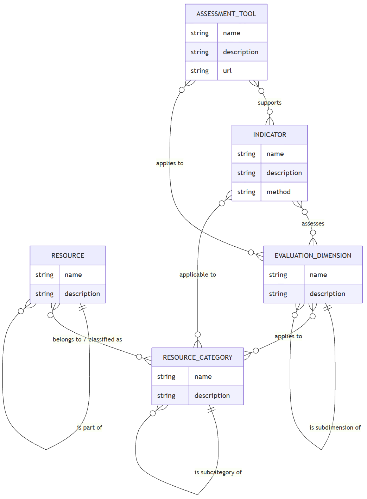
<figcaption>
Figure 2. Conceptual model behind the Cloud Assessment Framework.
</figcaption>
</figure>

### Ethical and guiding principles of the CAF

Ethical considerations are integral to the CAF, ensuring that monitoring and assessment activities are conducted in a responsible, transparent, and culturally sensitive manner. In the ECCCH context, ethics extend beyond mere compliance; they require an approach that is simultaneously methodologically rigorous, socially accountable, and responsive to the diversity of the cultural heritage ecosystem. Accordingly, this section addresses EU Ethical Principles for Evaluation Processes including different user data types that need to be collected within the CAF and expands additional guiding principles to consider. Finally, it introduces Pilot Tests and Pilot Projects, a topic that will be explored in greater detail in Section [8](#pilot-related-workflows).

#### Ethics of the CAF

This section is based largely on the Evaluation Handbook authored by the European Commission (EC: Directorate-General for International Partnerships, 2025). Its purpose is to help ensure that all individuals involved in assessment activities are treated fairly, safely, and respectfully. In the ECCCH context, these standard principles are extended to account for the specific nature of cultural heritage, where evaluation involves not only people and data but also cultural meaning, identity, and collective memory. This ensures that the framework supports reliable findings and responsible decision-making while remaining aligned with heritage values. Responsibility for upholding ethical standards is shared by all actors involved in the assessment process, including evaluators, managers, and participants.

**EU Ethical Principles for Evaluation Processes**

The EU evaluation framework is based on six key principles, which are adopted here for the CAF:

- **Honesty and transparency**: Evaluators must clearly present methods, data sources, limitations, and conclusions, and avoid any behavior that could bias the evaluation. Evaluation reports should cite sources and explicitly acknowledge and explain limitations and potential biases. This also includes transparency in how cultural value is interpreted to avoid oversimplifying or misrepresenting complex heritage meanings.

- **Respect for human rights**: The rights, safety, and well-being of participants must always be protected. Participation must be voluntary and informed. Evaluators must comply with legal and safeguarding requirements, especially when conducting interviews with vulnerable individuals. Prospective participants must be free to choose whether to participate and must be fully informed of their rights. This is also a legal obligation under the General Data Protection Regulation (GDPR).

- **Respect for dignity and diversity**: Evaluations must take into account cultural differences, gender roles, age, ethnicity, religion, and other relevant social factors. This extends to respecting the rights of communities connected to heritage, including issues of ownership and access to cultural knowledge

- **Do no harm**: Evaluation activities must not expose individuals or communities to risk or harm. In addition to protecting participants, this includes avoiding the disclosure or misuse of sensitive cultural information, especially in cases involving intangible heritage or vulnerable sites.

- **Impartiality**: Evaluations must take into account multiple perspectives and avoid favoring particular stakeholders. For example, policy makers should not evaluate their own work. If certain stakeholders cannot be reached, this should be explicitly stated as a methodological limitation, and findings should be qualified accordingly.

- **Independence**: Evaluators must remain free from external pressure and conflicts of interest. Evaluation managers must not impose restrictions on the scope, content, comments, or recommendations of the evaluation process or its outputs.

**Ethics throughout the Evaluation Process**

Although the CAF adopts a continuous assessment approach, individual assessment activities still unfold through a sequence of phases, from preparation and inception to implementation, synthesis, dissemination, follow-up, and quality assurance. The Evaluation Handbook (EC: Directorate-General for International Partnerships, 2025) emphasizes that ethical considerations should be addressed throughout all phases of this process.

- **Preparatory phase**: Evaluators should assess whether an ethical evaluation is feasible, ensure that the team has the necessary expertise, and confirm that no conflicts of interest exist.

- **Inception phase**: Evaluation methods must adhere to ethical standards and respect cultural norms. This includes establishing clear procedures for consent, confidentiality, and data protection, while specifically assessing risks associated with handling sensitive or community-owned cultural knowledge.

- **Implementation phase**: Evaluators must ensure that methods are culturally and socially sensitive, especially regarding vulnerable groups and heritage concerns. This includes avoiding intrusive questioning and verifying that all evaluation tools are contextually relevant and respectful.

- **Synthesis phase**: Reports should transparently present findings, limitations, and any ethical risks.

- **Dissemination phase**: Evaluators must ensure that the communication of results does not expose individuals, communities, or heritage assets to harm. This is critical when handling sensitive cultural data or contested heritage narratives.

- **Follow up**: Evaluation managers should ensure that recommendations are followed up and that final reports accurately reflect the evaluators' findings. This follow-up process is particularly relevant for the ECCCH, since it helps ensure that evaluation findings are not merely recorded, but are effectively used to guide improvements and changes in resources, services, and assessment procedures. It is discussed further in Section [7.3](#follow-up-and-use-of-the-assessment-results).

- **Quality assurance**: Unlike the other phases, quality assurance runs throughout the entire evaluation process, from the preparatory to dissemination and follow-up phases, ensuring that the outputs of each phase meet the required quality standards and that final reports accurately reflect the study findings.

#### Ethics and User-related Data

User-related data plays a key role for evaluation, scientific research, and service improvement purposes for the ECCCH and the development of transparent data-driven processes. Therefore, the collection of user-related data requires thorough ethical considerations. Furthermore, in the cultural heritage domain, the collection and use of such data require enhanced ethical consideration, as user information is often closely linked not only to individuals but also to institutional practices, professional roles, and, in some cases, culturally sensitive knowledge and heritage-related activities.

In the CAF context, two types of data will be collected:

**Actively collected data**

Consists of data that users actively provide, such as through registration systems, online contact forms, and user study questionnaires. Common data categories include:

- Personal and contact information such as name, title, address, date of birth, email, and phone number.

- Administrative and consent-related information such as user credentials, billing details, and acceptance of terms and conditions.

- Organizational or contextual information such as departmental affiliation or institutional role which in the CH context is particularly relevant for distinguishing between different types of stakeholders (e.g. museums, research institutions, conservation professionals, or community actors).

- Demographic data collected in user studies such as gender, age group, country of work, and other variables related to user performance, preferences, or experience. In the CH domain, these data support the assessment of inclusiveness, accessibility, and the reach of services across diverse professional and geographic contexts.

**Passively collected data**

Consists of data that is automatically generated through system or website use, such as IP addresses, timestamps, operating system details, access methods, requested URLs, referring pages, access status, and data volume transferred. In ECCCH, these data are particularly relevant for understanding how users interact with digital heritage services and infrastructures, including patterns of access to datasets, tools, and documentation resources.

Several categories of user data are particularly relevant for assessment: demographic information; user journey data, capturing interactions and touchpoints across services and tools; and user profiles, detailing professional background and activity, including roles in cultural heritage conservation, documentation, research, or other relevant fields. Together, these data types help understand user needs, evaluate engagement, and support evidence-based decision-making. . In the CH context, these data types help not only to understand user needs and evaluate engagement, but also to assess how different professional communities engage with digital transformation processes and how services support their specific workflows and practices.

A combination of legal requirements and internal policies build the ground on which data is collected and processed for evaluation purposes. The General Data Protection Regulation (GDPR) provides the general framework guiding ECCCH data documentation procedures, which may include the implementation of Registers of Processing Activities (RoPA), Data Processing Agreements (DPAs), Retention Policies, and Data Protection Impact Assessments (DPIAs). In the cultural heritage domain, these mechanisms must also account for the potential sensitivity of data that may indirectly relate to heritage assets, institutional strategies, or community-linked knowledge.

Governance structures are supported by internal privacy policies, data processing directories, and guidelines for anonymization or aggregation, ensuring that data used for evaluation avoids individual profiling or unauthorized sharing with third parties. In the CH context, anonymization and aggregation are particularly important to prevent the identification of individuals or institutions in ways that could expose sensitive information about heritage practices, condition of CH assets, or research activities. Oversight by the data protection officer (Cignoni, 2025) and research ethics committees ensures compliance with broader legal and ethical standards which will be examined in more detail in the following section.

#### Other guiding principles of the CAF

In addition to the ethical principles outlined above, the CAF is guided by the following broader principles:

- **Continuous evaluation**: Assessment will not be treated as a one-time activity, but as a continuous process accompanying the ECCCH throughout its lifecycle. Linked to the evolving nature of Cultural Heritage (CH) infrastructures and services, which require ongoing monitoring due to continuous changes in collections, digitization processes, and user needs.

- **Evaluation-informed governance**: The framework is conceived as a strategic instrument for generating evidence that will support quality assurance, prioritization, and informed decision making over time. Connected to evidence-based decision-making within the CH ecosystem, supporting the strategic management of cultural institutions, repositories, and digital infrastructures.

- **Pilot-driven methodology**: Pilot Tests and Pilot Projects will be used to assess both technical fitness and alignment with community needs under realistic conditions of use. Grounded in real-world CH use cases involving museums, archives, libraries, research infrastructures and individuals testing services under authentic operational conditions.

- **Adaptive and evolving structure**: The framework is conceived as a living structure that will progressively mature, refining its dimensions, indicators, and procedures in response to technical progress, community feedback, and lessons learned. Reflects the inherently heterogeneous and fast-changing CH landscape, including evolving standards, metadata practices, and interoperability frameworks.

- **Transparency and trust**: By establishing clear evaluation criteria and quality expectations, the framework aims to strengthen trust across the CH community and support the adoption of ECCCH resources and services. Related to ensuring reliability, provenance, and integrity of CH data and services for institutions, researchers, and the wider public.

- **Involvement of users external to the consortium**: Evaluation activities are designed to involve users beyond the ECHOES consortium. Pilot Tests conducted within ECHOES may include external participants, while Pilot Projects carried out by cascading grant awardees and sister projects are also expected to involve external users. Linked to the broader CH stakeholder community beyond the consortium, including GLAM institutions, individual professionals, researchers, educators, creative industries, and citizen users who contribute to and validate CH services.

- **Evaluation data as a persistent, long-lived asset of the ECCCH**: A further core principle of the CAF is that evaluation rationale should remain distinct from its concrete operational implementation, while relying on a stable and coherent data backbone for assessment activities. Because evaluation outputs will be produced over time, by different actors, and through different instruments, they need to be managed in a way that preserves their context, scope, and temporal validity. This enables longitudinal assessment, supports the refinement of metrics over time, and reduces the risk that knowledge generated through Pilot Tests, monitoring, and user studies will be lost. By treating evaluation data as a long-lived asset of the ECCCH knowledge base rather than as a transient by-product of individual studies, the framework supports cumulative learning, evidence-based governance, and the progressive maturation of assessment practices across WPs and project phases. Aligned with the long-term preservation, reuse, and cumulative development of CH knowledge and digital heritage infrastructures, ensuring evaluation outputs remain reusable and contextually meaningful over time.

- **Proportionality and minimization of assessment burden**: The framework seeks to balance the need for sufficiently complete and reliable information with the need to minimize the burden of data collection, both for resource providers and for cloud administrators. In practice, this implies a hybrid strategy that combines self-assessment by resource providers with supervision and support from ECHOES. It also implies prioritizing tools and procedures that automate or simplify data collection wherever possible. Connected to the operational constraints of CH institutions, particularly resource-limited organisations, ensuring evaluation activities are feasible, non-intrusive, and compatible with existing CH workflows and technical environments, including automated digital pipelines. For example, in the case of software resources, preference should be given to tools that can be integrated easily into Continuous Integration (CI) and Continuous Deployment (CD) workflows.

### Pilot Tests and Pilot Projects

As introduced in Section [1.1](#purpose-of-the-cloud-assessment-framework), Pilot Tests and Pilot Projects are an integral part of the ECCCH for several reasons. They provide a structured approach to test ideas and validate whether resources meet technical, organizational, legal, and societal requirements. In this way, they reduce implementation risks and provide valuable feedback early in the project lifecycle.

One key area assessed through pilots is technical fitness, which concerns those aspects of the ECCCH that are realized through software and the underlying cloud infrastructure. In cloud-based environments, this typically involves both user-facing resources, such as web interfaces, and back-end services that provide business logic and data processing. In this context, Pilot Tests can be used to validate key properties of cloud services under realistic conditions of use. These may include:

- Usability and accessibility (inclusive, easy-to-learn user experience)

- Functional correctness and completeness (features work as intended, edge-case handling)

- Interoperability and standards compliance

- Performance, scalability and latency (responsive interaction under realistic load and growth)

- Resilience, reliability and high availability (automatic fail‑over, fault tolerance, service continuity)

- Security and privacy (authentication, authorization, encryption, GDPR-compliant data handling)

- Legal and policy compliance (auditability, traceability, adherence to national copyright and CH regulations)

- Cost efficiency, sustainability and environmental impact (resource utilization, carbon footprint, long-term operating budget)

Feedback from such pilots can then be used to improve the quality of services and applications by revealing usability issues, faulty behavior, and other types of problems. In practice, this may involve combining user feedback with operational data, such as latency, error rates, or resource consumption, to support iterative improvement.

Pilots can also provide value beyond technical validation. They may be used to test governance models, decision-making procedures, and conflict-resolution mechanisms, and to assess whether stakeholder expectations remain aligned with the development of the project. They can also help demonstrate value at an early stage and support training and capacity-building through early exposure to ECCCH services and workflows.

To support consistency and comparability across pilots, evaluation data produced through Pilot Tests and Pilot Projects should be captured and managed in a structured way. In later stages of the framework, this may be supported through a shared evaluation repository capable of representing pilot descriptions, evaluation objectives, applied methodologies, collected measurements, and resulting indicators. Such an approach would allow each pilot to be documented not only as an isolated exercise, but also as a contextualized contribution to the broader assessment of the ECCCH ecosystem. It would also support cross-pilot analysis, longitudinal comparison, and the gradual refinement of evaluation criteria and indicators over time.

Pilots are discussed more in depth in Section [8](#pilot-related-workflows).

## ECCCH resources and resource categories

This section develops in more detail the ECCCH resources and resource categories briefly introduced in Section [4.2](#resources-resource-categories-dimensions). It clarifies both what may be assessed within the ECCCH ecosystem and how those assessable objects can be grouped into categories that support coherent and meaningful evaluation.

### Resources of the ECCCH digital ecosystem

| **Resources define scope.** In this framework, resources are used to define the scope or object of assessment. A resource may be the whole ECCCH, a broad class of resources, or a specific evaluable unit such as one application, one ontology, or one workflow. |
|----|

The following subsections present two complementary classifications of the ECCCH resources. These classifications are not intended to be exhaustive and reflect the conception of the ECCCH at the time this deliverable was prepared. The set of resources considered part of the ECCCH is expected to evolve as the ecosystem becomes operational and matures. Most of the resources presented here synthesize information already introduced in previous ECHOES deliverables, including D3.1 and D3.2 on the integration strategy, and D6.2 on interoperability requirements.

#### Main resources of the ECCCH

The first and most basic classification uses the nature of the resources, such as data, software applications and services ([Figure 1](#_Ref225806975)). This criterion is adopted because the nature of each component strongly influences how it can be assessed.

<figure>
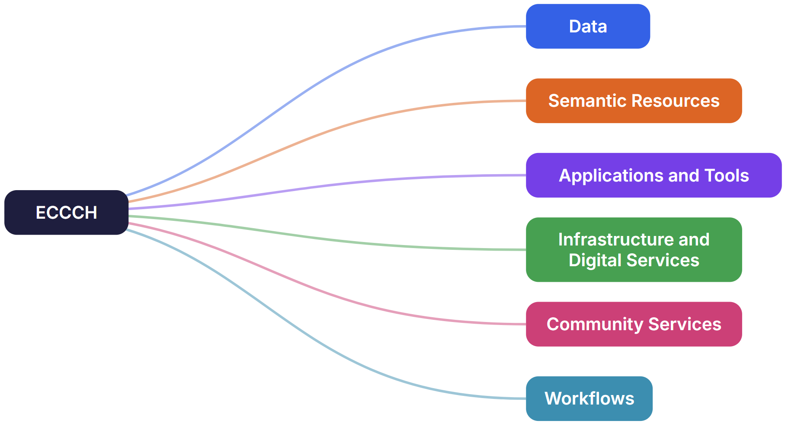
<figcaption>
Figure 3. Classification of the main resources of the ECCCH.
</figcaption>
</figure>

We now briefly describe each of these main resources:

- **ECCCH**: The entire Cultural Heritage Cloud, or ECCCH for short. The ECCCH is an open, federated, community-driven digital ecosystem where tools, services, and knowledge are co-developed by and for the heritage sector, evolving continuously through community contribution and shared stewardship, with services and knowledge growing alongside the communities that use them.

- **Data**: This includes the digital heritage assets (digital representations of cultural heritage, such as images, audios and 3D models) that serve as the foundational building blocks for heritage representations within the cloud, as well as the metadata and semantic knowledge accessible through the Cultural Heritage Cloud through the ECCCH Knowledge Base.

- **Semantic resources**: This encompasses the conceptual and semantic resources that support the ECCCH ecosystem, including the ECHOES Data Model (Heritage Digital Twin Ontology, HDTO), controlled vocabularies, taxonomies, and related metadata schemas used to describe, interlink, and interpret cultural heritage assets.

- **Applications and tools**: The vertical applications and other software tools provided by the Cultural Heritage Cloud to support tasks such as data management, visualization, analysis, and user interaction across the ECCCH ecosystem.

- **Infrastructure and digital services**: The infrastructure that will provide access to CH data, metadata and digital services in a secure, federated environment. Sample services include user access management, data storage, data sharing, computing resources, search capabilities, workflow management, and Intellectual Property Rights (IPR) services.

- **Community services**: Community-facing services such as workshops, seminars, and other training, engagement and networking programs to support ECCCH stakeholders.

- **Workflows**: Workflows are structured, potentially automatable sequences of tasks that support the management, analysis, enrichment, preservation, dissemination, and reuse of cultural heritage, enabling their efficient integration and interoperability across the cloud ecosystem.

It should be noted that resources may originate from different types of providers. For example, data resources may include datasets produced by sister projects, contributions from CH institutions supported through the Cascading Grants program, or data provided by individual and institutional researchers, CH professionals, and other stakeholders. Applications and tools may include not only ECHOES Vertical Applications, but also resources contributed by the broader ecosystem, including private companies.

#### Resources of the ECCCH by evaluable units

One way to refine the classification above is to introduce additional levels that identify concrete, individually assessable resources within each type ([Figure 2](#_Ref225807213)). Compiling a comprehensive catalog of such resources is beyond the scope of this document. Instead, we provide illustrative examples at the lowest level of the hierarchy, such as specific heritage digital twins, ontologies, vertical applications, courses, and workflows. These represent meaningful and well-defined units that can be selected independently as subjects of evaluation activities.

For the sake of completeness, we briefly describe these resources, grouped by component type:

**Data**

- **CH assets**: These are the raw digital materials ("computable data"), such as 3D geometry, text, or audio, that serve as the foundational building blocks for heritage representations within the cloud.

- **Semantic metadata and knowledge**: This encompasses the standardized descriptive information and contextual relationships mapped to the Heritage Digital Twin Ontology (HDTO) to provide machine-readable meaning to assets.

- **Heritage digital twins**: Heritage Digital Twins (HDT) are defined as the integrated sum of both computable data and semantic knowledge that capture the full space-time-culture identity of a heritage asset.

- *Example*: HDT of the Neptune Fountain in Bologna: A hypothetical HDT of the Neptune Fountain in Bologna.

**Semantic Resources**

- **Ontologies**: Ontologies that define the entities and relationships used to describe cultural heritage assets and their properties.

- *Example*: Heritage Digital Twin Ontology: The Heritage Digital Twin Ontology (HDTO) is the data model, based on CIDOC CRM, that will be used in the ECCCH Knowledge Graph to unify descriptions and facilitate query and navigation.

- **Controlled vocabularies**: Structured collections of standardized terms that ensure consistent description and classification of cultural heritage data.

- **Semantic mappings**: Mappings that define correspondences between ontologies, enabling their interoperability.

<figure>
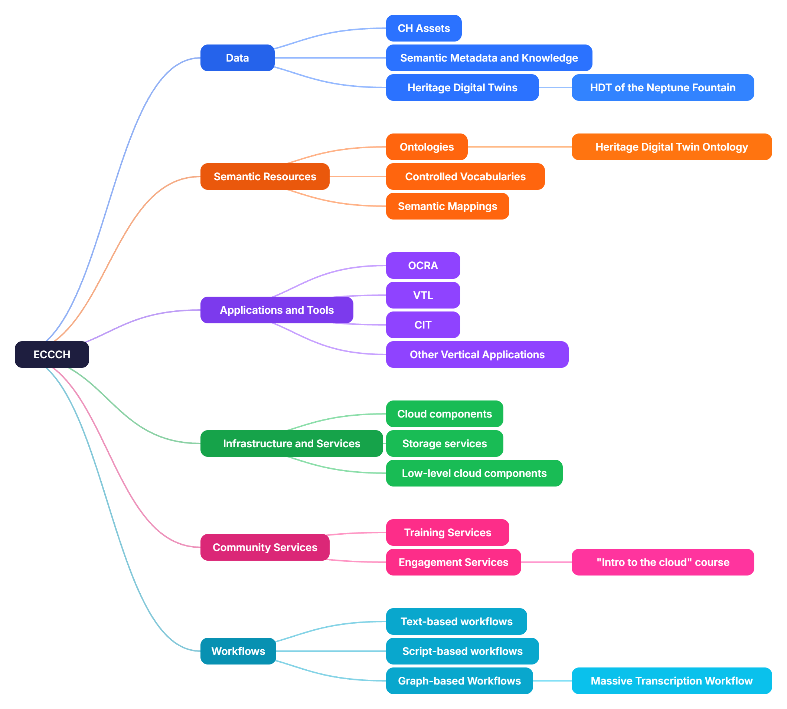
<figcaption>
Figure 4. Classification of the resources of the ECCCH by granular evaluable units.
</figcaption>
</figure>

**Applications and Tools**

- **OCRA**: OCRA (Online Conservation and Restoration Annotator) is a cloud-integrated tool for annotating and documenting the conservation and restoration of cultural heritage assets.

- **VTL**: The VTL (Virtual Transcription Laboratory) is a cloud-based tool that supports the collaborative transcription, annotation, and enrichment of digitized cultural heritage texts.

- **CIT**: The CIT (Collection Integration Tool) is a cloud-based application that enables the aggregation, harmonization, and enrichment of cultural heritage collections within the ECHOES ecosystem.

- **Other applications**: Applications and tools from sister projects, cascading grants and other initiatives.

**Infrastructure and Digital Services**

- **Cloud components**: This includes the SEP gateway, Authentication and Authorization, and other system-level services.

- **Storage services**: Includes RDF triple stores, personal user space and other storage-related services.

- **Low-level cloud components**: Services for monitoring, resource management, node management, etc.

**Community Services**

- **Training and capacity-building services**: Programs, workshops, and learning resources designed to strengthen the digital, technical, and heritage management skills of ECCCH stakeholders.

- **Engagement and networking services**: Activities and platforms that promote community participation, knowledge exchange, and collaboration among cultural heritage professionals, researchers, and institutions.

- *Example*: "Introduction to the cloud" course: A course offered by ECHOES that introduces CH professionals, researchers, and developers to the purpose, core concepts, and practical applications of the ECCCH.

**Workflows**

- **Text-based workflows**: Workflows documented as textual instructions that are executed manually, providing basic knowledge sharing but limited reproducibility and automation.

- **Script-based workflows**: Script-based workflows that encode execution logic and can be reused across compatible environments, improving portability, versioning, and partial reproducibility. These workflows might require user approval at a step level.

- **Graph-based workflows**: Fully executable and orchestrated workflows managed by the cloud, enabling end-to-end automation, deep provenance tracking, and federated execution across multiple nodes.

- *Example*: Massive Transcription Workflow: Hypothetical workflow based on a workflow engine that massively ingests images in one country and performs OCR and processing in another one.

The classifications discussed above can be used to delimit the scope of a specific assessment activity. For example, a Pilot Test may focus on the latest version of a vertical application such as OCRA.

### Resource categories

To support consistent and meaningful evaluation, ECCCH resources must be grouped into *resource categories* defined by the measures, metrics, and evaluation criteria that apply to them. These categories ([Figure 3](#_Ref225807735)) are therefore based on which quality dimensions can be assessed for each type of resource and which indicators can be defined and measured reliably.

| **Resource categories determine what can be assessed.** A resource category is not simply a descriptive label. Its main function is to identify which dimensions, metrics, indicators, and tools are meaningful for a given type of resource. |
|----|

<figure>
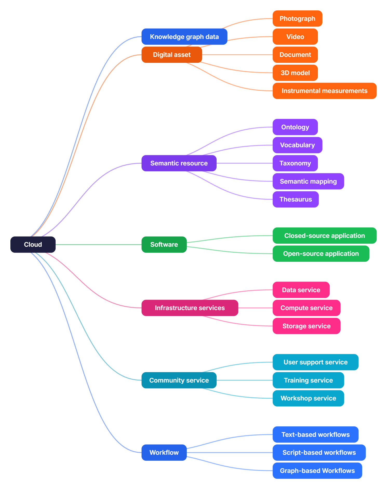
<figcaption>
Figure 5. Taxonomy of resource categories.
</figcaption>
</figure>

Our classification of resource categories is related to the resource type classification introduced in Deliverable D3.1 (Kotzinos et al., 2025). However, the perspective adopted here is explicitly evaluative. The focus is not only on what the resource is, but on which quality dimensions can be defined for it and which indicators can be meaningfully applied. In other words, the purpose of the resource category concept is to bridge the gap between identifying a specific ECCCH resource and determining how its quality, performance, and impact can be assessed in practice.

The main resource categories are described below.

- **Knowledge graph data:** Structured semantic data linking heritage entities.

- **Digital asset:** Digitized materials representing heritage content.

- **Semantic resource:** Conceptual and linguistic resources.

  - *Ontology*: Formal conceptual models of a domain.

  - *Vocabulary*: Controlled lists of terms and definitions.

  - *Taxonomy*: Hierarchical classification of concepts.

  - *Semantic mapping*: Correspondences between different schemas or vocabularies.

  - *Thesaurus*: Semantic networks of related terms.

- **Software:** Applications and Services to process data.

  - *Closed-source application*: Proprietary software tools.

  - *Open-source application*: Openly licensed software tools.

- **Infrastructure services:** Underlying hardware, system resources, and digital services.

  - *Data service*: Services providing access to datasets.

  - *Compute service*: Services offering computation capabilities.

  - *Storage service*: APIs managing data storage operations.

- **Community service:** Support and engagement resources for users.

  - *User support service*: Help and assistance for platform users.

  - *Training service*: Learning and capacity-building activities.

  - *Workshop service*: Interactive events for collaboration and learning.

- **Workflow:** Defined sequences of processes and tasks (Chambers et al., 2025).

  - *Text-based workflows*: Workflows documented as textual instructions that are executed manually, providing basic knowledge sharing but limited reproducibility and automation.

  - *Script-based workflows*: Script-based workflows that encode execution logic and can be reused across compatible environments, improving portability, versioning, and partial reproducibility.

  - *Graph-based workflows*: Fully executable and orchestrated workflows managed by the cloud, enabling end-to-end automation, deep provenance tracking, and federated execution across multiple nodes.

## Evaluation dimensions, tools and indicators

Building on the resource categories introduced in Section [5](#eccch-resources-and-resource-categories), this section translates the CAF into a more directly usable resource-oriented form. For each main resource category of the ECCCH, it identifies the most relevant evaluation dimensions, outlines indicative assessment instruments and tools, and discusses the kinds of indicators that may support assessment, review, and later aggregation. Its purpose is not yet to provide a final specification, but to establish a coherent basis for progressive implementation of the framework. Because ECCCH resources are highly heterogeneous, the subsections below should be understood as resource-specific assessment pathways within a common methodological framework. They provide the basis for guided self-assessment by resource providers, review and follow-up by ECHOES, and the progressive development of more mature indicators, procedures, and supporting tools over time.

In each resource category, the assessment also depends on an explicit evaluation basis, understood as the evidence, artefacts, operational data, or documentation on which the analysis is performed. Depending on the resource type, this basis may include metadata records, knowledge graph dumps or endpoints, ontology documentation, source code repositories, API specifications, monitoring logs, usage analytics, questionnaire responses, or pilot evaluation outputs. The definition of this evaluation basis clarifies what is being assessed, which indicators can be derived, and what level of automation, expert review, or provider self-assessment is appropriate. The sections below clarify the evaluation basis for each resource category.

### Prioritization criteria

The dimensions presented in this deliverable do not all have the same priority within the framework. Some are treated as core dimensions for the initial implementation phase, others as context-dependent dimensions relevant only to certain resource types, use cases, or pilots, and others as not currently prioritized dimensions, which are recognized as relevant but are not part of the first implementation focus of the framework.

| **Prioritization of evaluation dimensions. Core dimensions** are essential for the initial implementation phase. **Context-dependent dimensions** are relevant only to certain resource categories or use cases. **Not currently prioritized dimensions**, although relevant, are not part of the first implementation phase of the framework. |
|----|

For the prioritization of dimensions across resource categories, this document adopts a set of pragmatic criteria. A dimension is treated as core when it is relevant to most resources in the category, important for the initial operation and governance of the ECCCH, sufficiently clear to support reasonably consistent assessment, and supported by assessment tools that can facilitate its measurement in practice. A dimension is treated as context-dependent when its relevance depends strongly on the specific resource, use case, or pilot scenario. A dimension is treated as not currently prioritized when it is recognized as meaningful and potentially valuable, but is not part of the first implementation focus of the framework, for example because it would require disproportionate effort, further methodological discussion, stronger alignment with other WPs, or more mature procedures before it can be applied consistently. A good example is provided by workflow resources, whose precise definition, typologies, and scope are not yet fully harmonized across the project, because different but complementary understandings of what constitutes a reusable workflow still coexist.

This prioritization is intended to support progressive implementation of the framework (Section [7](#implementation-of-the-caf)) and to distinguish the dimensions that are central to the first implementation phase from those that are relevant only in specific cases or left for later refinement, considering the timeline of ECHOES and the ECCCH.

#### Core dimensions

Although evaluation dimensions are discussed in detail in the subsections below, we present here a summary of the dimensions considered core for the first implementation phase of the Cloud, distinguishing between the evaluation of individual resources and the evaluation of the Cloud as a whole.

At the level of individual resources, Data usage is treated as core because it is broadly relevant, important for understanding uptake and reuse, and comparatively feasible to support through logs and analytics. For semantic resources, the core dimensions are Usability and Understandability and Interoperability and Compatibility. These are considered core because they are broadly relevant to most semantic resources and important for supporting understanding, documentation, adoption, and reuse. For metadata and knowledge graph data quality dimensions, the core dimensions are Structural Completeness, Property Coverage, Multilingual Labeling Coverage, Foundational and Format Consistency, Accessibility and Connectivity, Licensing (Rights), and Conformance to Standards. These are treated as core because they are broadly applicable and largely automatable across metadata resources within the ECCCH, and because they are essential for ensuring that metadata can be accessed, validated, processed, reused, and shared consistently.

For software-related dimensions, the core dimensions are Compatibility, Open-Source Software, FAIRness, Security, and Usability. These are treated as core because they are central to software resources operating within the ECCCH ecosystem, and because they can be assessed, at least partially, through tools, checklists, documentation, or integration requirements. For digital services, the core dimensions are Reliability and Security (beyond gate-level acceptance). They are considered core because they apply broadly across most digital services and are linked to predictable, trustworthy, and secure service operation.

For community services, the core dimensions are Reach and Participant experience. They are treated as core because they are relevant, comparatively feasible to assess, and already aligned with available data sources such as questionnaires and passive analytics.

For AI-enabled resources, the core dimensions are Risk classification and regulatory relevance, Transparency and explainability, Human oversight and accountability, and Performance reliability and robustness. These are considered central to the initial governance and assessment of AI-enabled resources.

At Cloud level, the main dimensions should capture whether the ECCCH is becoming an accessible, useful, and sustainable ecosystem for digital cultural heritage. They include Ecosystem availability and interoperability, which assesses the availability of interoperable resources, services, tools, applications, HDTs, and shared platform resources; Participation and ecosystem reach, which captures the breadth and diversity of institutions, projects, stakeholders, and users engaged with the Cloud; Training, engagement, and capacity building, which reflects the extent to which the ECCCH supports adoption and effective use; Openness and reusability, which assesses the availability of reusable open resources and documented services; Meaningful reuse and adoption, which focuses on whether resources and services are actually used in research, professional workflows, applications, and collaborative initiatives; Perceived usefulness and community value, which captures the value reported by target communities; Collaboration and co-creation, which assesses joint work and outputs across institutions, disciplines, and communities; Scientific and professional contribution, which captures outputs enabled by the Cloud; and Sustainability and institutional readiness, which assesses progress towards long-term organizational, legal, and operational sustainability.

#### Summary of evaluation basis, core dimensions and expected outputs

The following summary tables provide a compact overview of how the CAF is applied to the main resource categories considered in this deliverable. For each category, the tables identify the main evaluation basis, the core dimensions or relevant criteria, the principal types of assessment instruments, the expected assessment output, and the evidence that resource providers or other relevant contributors should prepare. The purpose of these tables is to support navigation across the more detailed resource-specific subsections that follow, while explicitly making the link between evaluation dimensions, assessment evidence, and practical implementation.

<table style="width:100%;">
<colgroup>
<col style="width: 50%" />
<col style="width: 49%" />
</colgroup>
<thead>
<tr>
<th colspan="2" style="text-align: left;"><strong>RESOURCE CATEGORY Metadata and Knowledge Graph Data</strong></th>
</tr>
</thead>
<tbody>
<tr>
<td colspan="2" style="text-align: left;">
<strong>SECTION REFERENCES</strong>

<strong>Section 6.2 Evaluation of Metadata and Knowledge Graph Data</strong>

<strong>Related sections:</strong> Section 3.3.1 Data, metadata and knowledge graph data; Section 6.2.1 Evaluation dimensions; Section 6.2.2 Assessment instruments and indicators; Section 6.2.3 Implications for metadata / knowledge graph data providers; Section 7.2.2 Example 2: assessment of knowledge graph data
</td>
</tr>
<tr>
<td style="text-align: left;">
<strong>EVALUATION BASIS</strong>

<strong>•</strong> Metadata records.

<strong>•</strong> Knowledge graph data.

<strong>•</strong> Schemas, validation rules or equivalent documentation.

<strong>•</strong> Identifiers, labels, properties, links, licenses and rights information.

<strong>•</strong> Evidence produced through validation, profiling or review procedures.
</td>
<td style="text-align: left;">
<strong>CORE DIMENSIONS / CRITERIA</strong>

<strong>•</strong> Structural Completeness.

<strong>•</strong> Property Coverage.

<strong>•</strong> Multilingual Labeling Coverage.

<strong>•</strong> Foundational and Format Consistency.

<strong>•</strong> Accessibility and Connectivity.

<strong>•</strong> Licensing.

<strong>•</strong> Conformance to Standards.
</td>
</tr>
<tr>
<td style="text-align: left;">
<strong>MAIN INSTRUMENTS</strong>

<strong>•</strong> Metadata and knowledge graph validation tools.

<strong>•</strong> Schema, profile or constraint-based checks.

<strong>•</strong> Completeness and coverage analysis.

<strong>•</strong> FAIRness and interoperability-oriented checks.

<strong>•</strong> License, rights and provenance review.

<strong>•</strong> Expert or curator review where semantic interpretation is required.
</td>
<td style="text-align: left;">
<strong>EXPECTED OUTPUT</strong>

<strong>•</strong> Structured evidence on metadata or knowledge graph quality.

<strong>•</strong> Assessment of completeness, consistency, accessibility, connectivity, licensing and standards conformance.

<strong>•</strong> Identification of gaps or improvement needs.

<strong>•</strong> Evidence that can support quality review and later indicator computation.
</td>
</tr>
<tr>
<td colspan="2" style="text-align: left;">
<strong>WHAT RESOURCE PROVIDERS SHOULD PREPARE</strong>

<strong>•</strong> Access to the metadata or knowledge graph resource.

<strong>•</strong> Documentation of the data model, schema, ontology, application profile or mappings used.

<strong>•</strong> Information on identifiers, labels, links, licenses, rights and provenance.

<strong>•</strong> Available validation reports or quality-control evidence.

<strong>•</strong> Known limitations or pending improvements.
</td>
</tr>
</tbody>
</table>

<table style="width:100%;">
<colgroup>
<col style="width: 49%" />
<col style="width: 50%" />
</colgroup>
<thead>
<tr>
<th colspan="2" style="text-align: left;"><strong>RESOURCE CATEGORY Digital Assets</strong></th>
</tr>
</thead>
<tbody>
<tr>
<td colspan="2" style="text-align: left;">
<strong>SECTION REFERENCES</strong>

<strong>Section 6.3 Evaluation of Digital Assets</strong>

<strong>Related sections:</strong> Section 3.3.1 Data, metadata and knowledge graph data; Section 6.4 Evaluation of data usage
</td>
</tr>
<tr>
<td style="text-align: left;">
<strong>EVALUATION BASIS</strong>

<strong>•</strong> Digital asset files or access links.

<strong>•</strong> Technical metadata.

<strong>•</strong> Digitization, acquisition or processing documentation.

<strong>•</strong> Paradata where available.

<strong>•</strong> Use-case information relevant to assessing fitness for purpose.
</td>
<td style="text-align: left;">
<strong>CORE DIMENSIONS / CRITERIA</strong>

<strong>•</strong> No single uniform core dimension set is defined for all digital asset types in D9.1.

<strong>•</strong> Asset-type-specific quality criteria should be refined through later CAF implementation and the wiki.

<strong>•</strong> Data usage, where relevant to access, uptake and reuse.
</td>
</tr>
<tr>
<td style="text-align: left;">
<strong>MAIN INSTRUMENTS</strong>

<strong>•</strong> Asset-type-specific quality assessment methods.

<strong>•</strong> Technical metadata and paradata review.

<strong>•</strong> Expert review where automated assessment is insufficient.

<strong>•</strong> Reference-based or no-reference quality assessment approaches where appropriate.

<strong>•</strong> Use-case-specific assessment criteria.
</td>
<td style="text-align: left;">
<strong>EXPECTED OUTPUT</strong>

<strong>•</strong> Evidence on the quality and fitness for purpose of the digital asset.

<strong>•</strong> Identification of asset-specific quality issues affecting reuse or interpretation.

<strong>•</strong> Documentation of relevant technical, acquisition or processing context.

<strong>•</strong> Recommendations for further assessment or improvement where needed.
</td>
</tr>
<tr>
<td colspan="2" style="text-align: left;">
<strong>WHAT RESOURCE PROVIDERS SHOULD PREPARE</strong>

<strong>•</strong> Access to the digital asset or representative sample.

<strong>•</strong> Technical metadata.

<strong>•</strong> Digitization, acquisition or processing documentation.

<strong>•</strong> Information on intended use cases.

<strong>•</strong> Known quality limitations or uncertainty information.

<strong>•</strong> Existing quality-control reports where available.
</td>
</tr>
</tbody>
</table>

<table style="width:100%;">
<colgroup>
<col style="width: 49%" />
<col style="width: 50%" />
</colgroup>
<thead>
<tr>
<th colspan="2" style="text-align: left;"><strong>RESOURCE CATEGORIES Metadata, Knowledge Graph Data, and Digital Assets</strong></th>
</tr>
</thead>
<tbody>
<tr>
<td colspan="2" style="text-align: left;">
<strong>SECTION REFERENCES</strong>

<strong>Section 6.4 Evaluation of data usage</strong>

<strong>Related sections:</strong> Section 6.4.1 Evaluation dimensions; Section 6.4.2 Assessment instruments and indicators; Section 6.4.3 Implications for dataset providers
</td>
</tr>
<tr>
<td style="text-align: left;">
<strong>EVALUATION BASIS</strong>

<strong>•</strong> Access, reuse or interaction evidence related to data resources.

<strong>•</strong> Logs and analytics where available and appropriate.

<strong>•</strong> Download, access, query or integration records.

<strong>•</strong> Provider-supplied usage information where usage is not captured directly by ECCCH services.

<strong>•</strong> Pilot or user-study evidence concerning data reuse.
</td>
<td style="text-align: left;">
<strong>CORE DIMENSIONS / CRITERIA</strong>

<strong>•</strong> Data usage.
</td>
</tr>
<tr>
<td style="text-align: left;">
<strong>MAIN INSTRUMENTS</strong>

<strong>•</strong> Usage analytics.

<strong>•</strong> Access, download or query statistics.

<strong>•</strong> Provider-supplied usage reports.

<strong>•</strong> Pilot evaluation outputs.

<strong>•</strong> Reuse evidence from workflows, services or applications.
</td>
<td style="text-align: left;">
<strong>EXPECTED OUTPUT</strong>

<strong>•</strong> Evidence of access, uptake or reuse of data resources.

<strong>•</strong> Usage indicators suitable for later aggregation or interpretation.

<strong>•</strong> Identification of resources with limited, emerging or significant reuse.

<strong>•</strong> Evidence supporting monitoring of uptake and value over time.
</td>
</tr>
<tr>
<td colspan="2" style="text-align: left;">
<strong>WHAT RESOURCE PROVIDERS SHOULD PREPARE</strong>

<strong>•</strong> Description of how the data resource is accessed.

<strong>•</strong> Available usage, access or download statistics.

<strong>•</strong> Known examples of reuse.

<strong>•</strong> Information on external access channels not visible to ECCCH analytics.

<strong>•</strong> Relevant pilot or user feedback where available.
</td>
</tr>
</tbody>
</table>

<table style="width:100%;">
<colgroup>
<col style="width: 49%" />
<col style="width: 49%" />
</colgroup>
<thead>
<tr>
<th colspan="2" style="text-align: left;"><strong>RESOURCE CATEGORY Semantic Resources</strong></th>
</tr>
</thead>
<tbody>
<tr>
<td colspan="2" style="text-align: left;">
<strong>SECTION REFERENCES</strong>

<strong>Section 6.5 Evaluation of Semantic Resources</strong>

<strong>Related sections:</strong> Section 6.5.1 Evaluation dimensions; Section 6.5.2 Assessment instruments and indicators; Section 6.5.3 Implications for semantic resource providers
</td>
</tr>
<tr>
<td style="text-align: left;">
<strong>EVALUATION BASIS</strong>

<strong>•</strong> Ontology, vocabulary, taxonomy, thesaurus or semantic mapping.

<strong>•</strong> Documentation and usage guidance.

<strong>•</strong> Scope, purpose and intended use.

<strong>•</strong> Mappings or alignments with other semantic resources.

<strong>•</strong> Evidence on understandability, interoperability and reuse.
</td>
<td style="text-align: left;">
<strong>CORE DIMENSIONS / CRITERIA</strong>

<strong>•</strong> Usability and Understandability.

<strong>•</strong> Interoperability and Compatibility.
</td>
</tr>
<tr>
<td style="text-align: left;">
<strong>MAIN INSTRUMENTS</strong>

<strong>•</strong> Documentation review.

<strong>•</strong> Ontology or vocabulary quality checks.

<strong>•</strong> Consistency and compatibility checks.

<strong>•</strong> Mapping and alignment review.

<strong>•</strong> Expert review.

<strong>•</strong> User or community feedback where appropriate.
</td>
<td style="text-align: left;">
<strong>EXPECTED OUTPUT</strong>

<strong>•</strong> Evidence on usability, understandability, interoperability and compatibility.

<strong>•</strong> Identification of documentation gaps, ambiguous concepts or alignment issues.

<strong>•</strong> Assessment evidence supporting review and improvement of the semantic resource.

<strong>•</strong> Recommendations for clarification, extension or better integration.
</td>
</tr>
<tr>
<td colspan="2" style="text-align: left;">
<strong>WHAT RESOURCE PROVIDERS SHOULD PREPARE</strong>

<strong>•</strong> Machine-readable semantic resource file or access point.

<strong>•</strong> Human-readable documentation.

<strong>•</strong> Statement of scope and intended use.

<strong>•</strong> Examples of use where available.

<strong>•</strong> Mappings or alignments with relevant standards, vocabularies or ontologies.

<strong>•</strong> Versioning or maintenance information.
</td>
</tr>
</tbody>
</table>

<table style="width:100%;">
<colgroup>
<col style="width: 49%" />
<col style="width: 49%" />
</colgroup>
<thead>
<tr>
<th colspan="2" style="text-align: left;"><strong>RESOURCE CATEGORY Software</strong></th>
</tr>
</thead>
<tbody>
<tr>
<td colspan="2" style="text-align: left;">
<strong>SECTION REFERENCES</strong>

<strong>Section 6.6 Evaluation of Software</strong>

<strong>Related sections:</strong> Section 3.3.2 Software products; Section 6.6.1 Evaluation dimensions; Section 6.6.2 Assessment instruments and indicators; Section 6.6.3 Implications for software resource providers; Section 7.2.1 Example 1: assessment of a software codebase
</td>
</tr>
<tr>
<td style="text-align: left;">
<strong>EVALUATION BASIS</strong>

<strong>•</strong> Software codebase or repository.

<strong>•</strong> Software documentation.

<strong>•</strong> License and reuse information.

<strong>•</strong> Installation, deployment or execution information.

<strong>•</strong> Testing, release, maintenance or security evidence where available.

<strong>•</strong> User-facing evidence where usability is assessed.
</td>
<td style="text-align: left;">
<strong>CORE DIMENSIONS / CRITERIA</strong>

<strong>•</strong> Compatibility.

<strong>•</strong> Open-Source Software.

<strong>•</strong> FAIRness.

<strong>•</strong> Security.

<strong>•</strong> Usability.
</td>
</tr>
<tr>
<td style="text-align: left;">
<strong>MAIN INSTRUMENTS</strong>

<strong>•</strong> Repository and documentation review.

<strong>•</strong> Software quality checklists.

<strong>•</strong> Static analysis or code-quality tools where appropriate.

<strong>•</strong> Testing and release evidence review.

<strong>•</strong> Security-oriented checks.

<strong>•</strong> FAIR software assessment instruments.

<strong>•</strong> User feedback or pilot-based usability evaluation.
</td>
<td style="text-align: left;">
<strong>EXPECTED OUTPUT</strong>

<strong>•</strong> Software quality self-assessment evidence.

<strong>•</strong> Evidence on compatibility, openness, FAIRness, security and usability.

<strong>•</strong> Identification of documentation, maintainability, security or reuse issues.

<strong>•</strong> Evidence supporting ECHOES quality review and improvement planning.
</td>
</tr>
<tr>
<td colspan="2" style="text-align: left;">
<strong>WHAT RESOURCE PROVIDERS SHOULD PREPARE</strong>

<strong>•</strong> Repository URL or source-code package.

<strong>•</strong> License information.

<strong>•</strong> README, installation and usage documentation.

<strong>•</strong> Information on dependencies, releases and maintenance status.

<strong>•</strong> Available test, quality or security reports.

<strong>•</strong> Description of intended users and use context.
</td>
</tr>
</tbody>
</table>

<table style="width:100%;">
<colgroup>
<col style="width: 49%" />
<col style="width: 50%" />
</colgroup>
<thead>
<tr>
<th colspan="2" style="text-align: left;"><strong>RESOURCE CATEGORY Infrastructure and Digital Services</strong></th>
</tr>
</thead>
<tbody>
<tr>
<td colspan="2" style="text-align: left;">
<strong>SECTION REFERENCES</strong>

<strong>Section 6.7 Evaluation of Infrastructure and Digital Services</strong>

<strong>Related sections:</strong> Section 3.3.3 Infrastructures and digital services; Section 6.7.1 Evaluation dimensions; Section 6.7.2 Assessment instruments and indicators; Section 6.7.3 Implications for service providers
</td>
</tr>
<tr>
<td style="text-align: left;">
<strong>EVALUATION BASIS</strong>

<strong>•</strong> Service or infrastructure description.

<strong>•</strong> Technical and operational documentation.

<strong>•</strong> Monitoring and operational evidence.

<strong>•</strong> Security and access-control information.

<strong>•</strong> Incident, availability or reliability evidence where available.

<strong>•</strong> User-facing evidence where the service is directly used by end users.
</td>
<td style="text-align: left;">
<strong>CORE DIMENSIONS / CRITERIA</strong>

<strong>•</strong> Reliability.

<strong>•</strong> Security.
</td>
</tr>
<tr>
<td style="text-align: left;">
<strong>MAIN INSTRUMENTS</strong>

<strong>•</strong> Operational monitoring.

<strong>•</strong> Service availability and reliability checks.

<strong>•</strong> Security review.

<strong>•</strong> Incident and recovery evidence review.

<strong>•</strong> Documentation review.

<strong>•</strong> User feedback or pilot evaluation where relevant.
</td>
<td style="text-align: left;">
<strong>EXPECTED OUTPUT</strong>

<strong>•</strong> Evidence on reliability and security of the service or infrastructure component.

<strong>•</strong> Identification of operational risks, security issues or monitoring gaps.

<strong>•</strong> Evidence supporting service quality review.

<strong>•</strong> Recommendations for operational improvement or further monitoring.
</td>
</tr>
<tr>
<td colspan="2" style="text-align: left;">
<strong>WHAT RESOURCE PROVIDERS SHOULD PREPARE</strong>

<strong>•</strong> Description of the service or infrastructure component.

<strong>•</strong> Technical and operational documentation.

<strong>•</strong> Available monitoring or availability evidence.

<strong>•</strong> Security and access-control documentation.

<strong>•</strong> Known incidents, limitations or operational risks.

<strong>•</strong> Relevant user feedback or service-support evidence where available.
</td>
</tr>
</tbody>
</table>

<table style="width:100%;">
<colgroup>
<col style="width: 49%" />
<col style="width: 50%" />
</colgroup>
<thead>
<tr>
<th colspan="2" style="text-align: left;"><strong>RESOURCE CATEGORY Community Services</strong></th>
</tr>
</thead>
<tbody>
<tr>
<td colspan="2" style="text-align: left;">
<strong>SECTION REFERENCES</strong>

<strong>Section 6.8 Evaluation of Community Services</strong>

<strong>Related sections:</strong> Section 6.8.1 Evaluation dimensions; Section 6.8.2 Assessment instruments and candidate indicators; Section 6.8.3 Implications for community service providers
</td>
</tr>
<tr>
<td style="text-align: left;">
<strong>EVALUATION BASIS</strong>

<strong>•</strong> Training, engagement, support or capacity-building activity records.

<strong>•</strong> Participant registrations and attendance evidence.

<strong>•</strong> Questionnaires, feedback forms or user-study outputs.

<strong>•</strong> Community engagement evidence.

<strong>•</strong> Follow-up or reuse evidence where available.
</td>
<td style="text-align: left;">
<strong>CORE DIMENSIONS / CRITERIA</strong>

<strong>•</strong> Reach.

<strong>•</strong> Participant experience.
</td>
</tr>
<tr>
<td style="text-align: left;">
<strong>MAIN INSTRUMENTS</strong>

<strong>•</strong> Registration and attendance records.

<strong>•</strong> Participant questionnaires.

<strong>•</strong> Training or event feedback forms.

<strong>•</strong> Engagement analytics where appropriate.

<strong>•</strong> Follow-up surveys or interviews where appropriate.

<strong>•</strong> Pilot or activity evaluation reports.
</td>
<td style="text-align: left;">
<strong>EXPECTED OUTPUT</strong>

<strong>•</strong> Evidence on reach and participant experience.

<strong>•</strong> Indicators on participation, stakeholder groups and engagement.

<strong>•</strong> Feedback on relevance, usefulness and perceived value.

<strong>•</strong> Recommendations for improving accessibility, delivery or community relevance.
</td>
</tr>
<tr>
<td colspan="2" style="text-align: left;">
<strong>WHAT RESOURCE PROVIDERS SHOULD PREPARE</strong>

<strong>•</strong> Description of the community service or activity.

<strong>•</strong> Target audience and objectives.

<strong>•</strong> Registration and attendance data.

<strong>•</strong> Feedback forms or questionnaire results.

<strong>•</strong> Materials, documentation or outputs from the activity.

<strong>•</strong> Evidence of follow-up, reuse or continued engagement where available.
</td>
</tr>
</tbody>
</table>

<table style="width:100%;">
<colgroup>
<col style="width: 50%" />
<col style="width: 49%" />
</colgroup>
<thead>
<tr>
<th colspan="2" style="text-align: left;"><strong>RESOURCE CATEGORY AI-enabled Resources</strong></th>
</tr>
</thead>
<tbody>
<tr>
<td colspan="2" style="text-align: left;">
<strong>SECTION REFERENCES</strong>

<strong>Section 6.9 Evaluation of AI-enabled resources</strong>

<strong>Related sections:</strong> Section 6.9.1 Main AI risks relevant to assessment; Section 6.9.2 Evaluation dimensions; Section 6.9.3 Assessment instruments and candidate indicators; Section 6.9.4 Implications for AI-enabled resource providers
</td>
</tr>
<tr>
<td style="text-align: left;">
<strong>EVALUATION BASIS</strong>

<strong>•</strong> Description of the AI-enabled functionality.

<strong>•</strong> Intended use and use context.

<strong>•</strong> Risk-related documentation.

<strong>•</strong> Transparency and user-information materials.

<strong>•</strong> Performance, reliability or robustness evidence where available.

<strong>•</strong> Human oversight and accountability information.

<strong>•</strong> Pilot or user feedback where relevant.
</td>
<td style="text-align: left;">
<strong>CORE DIMENSIONS / CRITERIA</strong>

<strong>•</strong> Risk classification and regulatory relevance.

<strong>•</strong> Transparency and explainability.

<strong>•</strong> Human oversight and accountability.

<strong>•</strong> Performance reliability and robustness.
</td>
</tr>
<tr>
<td style="text-align: left;">
<strong>MAIN INSTRUMENTS</strong>

<strong>•</strong> AI risk self-assessment.

<strong>•</strong> Regulatory relevance screening.

<strong>•</strong> Documentation review.

<strong>•</strong> Transparency and explainability review.

<strong>•</strong> Performance, reliability and robustness assessment.

<strong>•</strong> Human oversight and accountability review.

<strong>•</strong> Pilot-based or user-based evaluation where relevant.
</td>
<td style="text-align: left;">
<strong>EXPECTED OUTPUT</strong>

<strong>•</strong> Evidence on AI-related risks and regulatory relevance.

<strong>•</strong> Assessment of transparency, explainability, oversight and accountability.

<strong>•</strong> Evidence on performance reliability and robustness where available.

<strong>•</strong> Identification of limitations, safeguards or improvement needs.

<strong>•</strong> Input for later monitoring and governance of AI-enabled resources.
</td>
</tr>
<tr>
<td colspan="2" style="text-align: left;">
<strong>WHAT RESOURCE PROVIDERS SHOULD PREPARE</strong>

<strong>•</strong> Description of the AI-enabled component or functionality.

<strong>•</strong> Intended users, use cases and operating context.

<strong>•</strong> Available risk classification or risk assessment evidence.

<strong>•</strong> Documentation explaining how the AI-enabled resource works at an appropriate level.

<strong>•</strong> Performance, reliability or robustness evidence where available.

<strong>•</strong> Information on human oversight, accountability and escalation procedures.

<strong>•</strong> Known limitations and safeguards.
</td>
</tr>
</tbody>
</table>

<table style="width:100%;">
<colgroup>
<col style="width: 49%" />
<col style="width: 50%" />
</colgroup>
<thead>
<tr>
<th colspan="2" style="text-align: left;"><strong>RESOURCE CATEGORY ECCCH as a Cloud</strong></th>
</tr>
</thead>
<tbody>
<tr>
<td colspan="2" style="text-align: left;">
<strong>SECTION REFERENCES</strong>

<strong>Section 6.10 Evaluation of the ECCCH as a Cloud</strong>

<strong>Related sections:</strong> Section 6.10.1 Strategic objectives of the ECCCH; Section 6.10.2 Evaluation dimensions; Section 6.10.3 KPIs for strategic monitoring of the ECCCH; Section 6.10.4 Assessment instruments and data sources; Section 6.10.5 Implications for the community; Section Annex B KPIs and indicators linked to ECCCH
</td>
</tr>
<tr>
<td style="text-align: left;">
<strong>EVALUATION BASIS</strong>

<strong>•</strong> ECCCH strategic objectives.

<strong>•</strong> Cloud-level KPIs and indicators.

<strong>•</strong> Resource and service inventories.

<strong>•</strong> Usage, participation, training and engagement evidence.

<strong>•</strong> Evidence of openness, reuse, collaboration and outputs.

<strong>•</strong> Governance and sustainability evidence.

<strong>•</strong> Qualitative interpretation and contextual evidence.
</td>
<td style="text-align: left;">
<strong>CORE DIMENSIONS / CRITERIA</strong>

<strong>•</strong> Ecosystem availability and interoperability.

<strong>•</strong> Participation and ecosystem reach.

<strong>•</strong> Training, engagement, and capacity building.

<strong>•</strong> Openness and reusability.

<strong>•</strong> Meaningful reuse and adoption.

<strong>•</strong> Perceived usefulness and community value.

<strong>•</strong> Collaboration and co-creation.

<strong>•</strong> Scientific and professional contribution.

<strong>•</strong> Sustainability and institutional readiness.
</td>
</tr>
<tr>
<td style="text-align: left;">
<strong>MAIN INSTRUMENTS</strong>

<strong>•</strong> Strategic KPI reporting.

<strong>•</strong> Resource and service inventories.

<strong>•</strong> Usage and participation monitoring.

<strong>•</strong> Training and engagement reporting.

<strong>•</strong> Survey and pilot evaluation synthesis.

<strong>•</strong> Collaboration and output tracking.

<strong>•</strong> Governance and sustainability review.

<strong>•</strong> Narrative interpretation of quantitative indicators.
</td>
<td style="text-align: left;">
<strong>EXPECTED OUTPUT</strong>

<strong>•</strong> Cloud-level strategic monitoring evidence.

<strong>•</strong> Aggregated view of availability, participation, reuse, value, collaboration, outputs and sustainability.

<strong>•</strong> Evidence supporting governance, prioritization and continuous improvement.

<strong>•</strong> Contextual interpretation of quantitative indicators.

<strong>•</strong> Identification of gaps, risks or areas requiring further development.
</td>
</tr>
<tr>
<td colspan="2" style="text-align: left;">
<strong>WHAT CONTRIBUTORS, WP LEADS AND SERVICE/RESOURCE PROVIDERS SHOULD PREPARE</strong>

<strong>•</strong> Updated information on resources and services contributed to the ECCCH.

<strong>•</strong> Evidence of accessibility, interoperability, openness or reuse where relevant.

<strong>•</strong> Usage, participation or engagement evidence where available.

<strong>•</strong> Examples of reuse, collaboration or outputs enabled by the resource.

<strong>•</strong> Relevant documentation, repository links or Knowledge Base references.

<strong>•</strong> Maintenance, governance or sustainability information where relevant.
</td>
</tr>
</tbody>
</table>

The tables above are intended as a synthetic guide to the resource-specific sections that follow. They do not replace the detailed descriptions of dimensions, instruments and candidate indicators provided in Sections [6.2](#evaluation-of-metadata-and-knowledge-graph-data)-[6.10](#evaluation-of-the-eccch-as-a-cloud).

### Evaluation of Metadata and Knowledge Graph Data

The quality of metadata and knowledge graph data is considered a transversal and enabling factor that supports the effective use and impact of all digital asset types. Metadata within the ECCCH are evaluated along four main axes that reflect complementary aspects of quality. These dimensions ensure that metadata is not only correct, but also usable, interoperable, accessible, and sustainable in practice.

#### Evaluation dimensions

<figure>
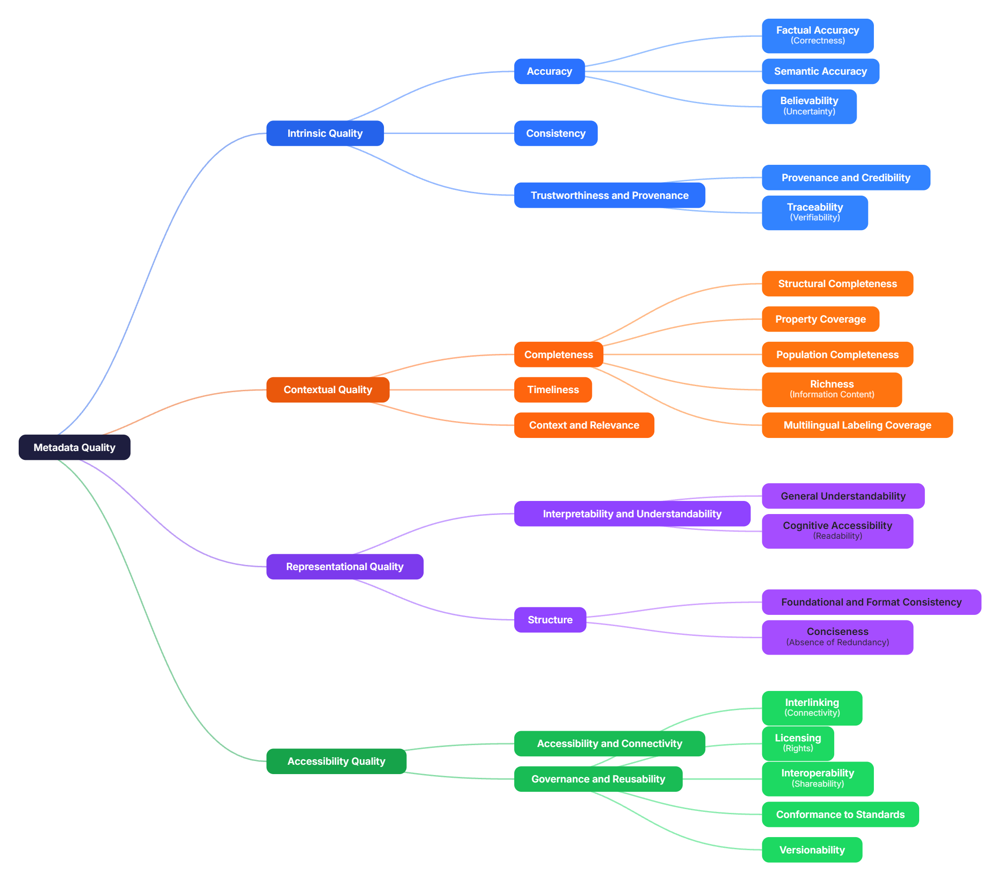
<figcaption>
Figure 7. Quality dimensions for metadata and knowledge graph data.
</figcaption>
</figure>

Main dimensions:

- **Intrinsic quality:** Concerns the inherent properties of metadata that can be evaluated independently of the user's needs or external context; measures whether the metadata is factually correct, coherent, and trustworthy based only on the information within the dataset.

  - ***Accuracy*:** Measures how well metadata represents real-world entities.

    - *Factual accuracy (correctness)*: Verifies whether metadata values are free from errors (correct names, dates, identifiers, spatial coordinates, etc.); ensures RDF triples represent facts, and the metadata correctly describes the actual resource.

    - *Semantic accuracy*: Checks whether metadata correctly conveys the meaning and interpretation of the associated resource; assesses whether the meaning conveyed is accurate and appropriate (interpretation, categorization, or alignment between fields and resources).

    - *Believability (uncertainty)*: Confirms whether uncertainty is explicitly represented and modeled transparently.

  - ***Consistency*:** Relates to the coherence of metadata and the absence of contradictions among statements; data should adhere to logical rules defined by the underlying data model (e.g., domain and range constraints). Evaluates as well, whether free-text fields of the same resource (e.g., title, description, subject) describe the same object in a semantically similar way, preventing confusing or contradictory descriptions.

  - ***Trustworthiness and provenance*:** Evaluates whether the metadata source is reliable, authoritative, and accurate. Factors may include the reputation of the institution, expertise of contributors, quality-control procedures, and mechanisms ensuring authenticity and integrity.

    - *Provenance and credibility*: Describes the origin and history of the metadata, including who created it, when it was created, the sources used, and any transformations or processing applied over time.

    - *Traceability (verifiability)*: Determines whether metadata statements can be verified and linked to authoritative evidence such as catalog entries, archival records, publications, or external datasets.

- **Contextual quality:** Verifies whether metadata is sufficient, timely, and fitting for its domain (beyond being correct).

  - ***Completeness*:** Ensures that metadata contains all the information required.

    - *Structural completeness*: Assesses whether individual records contain values for all required metadata fields defined by the schema; can be measured as ratio of filled fields to expected fields.

    - *Property coverage*: Validates whether the metadata model itself is appropriately used to describe a given type of resource; assesses whether relevant classes and properties defined in the schema are employed across the dataset.

    - *Population completeness*: Assesses the extent to which real-world objects are represented in the dataset. A dataset may be structurally complete for the records it contains while still covering only a fraction of the actual collection.

    - *Richness (information content)*: Evaluates the amount and diversity of descriptive information available for a resource; adds a gradual, qualitative layer beyond the minimum ensured by structural completeness.

    - *Multilingual labeling coverage*: Validates the presence, correctness, and consistency of multilingual metadata; includes appropriate language tags and consistency across multilingual descriptions.

  - ***Timeliness*:** Ensures that metadata remains up-to-date and relevant to the present; modification dates should be documented to avoid outdated contradictory knowledge.

  - ***Context and relevance*:** Measures whether the metadata is useful for the intended audience or use case; assesses whether the information meets the user's needs.

- **Representational quality:** Evaluates how well the data is expressed, structured, and presented; focuses on readability, interpretability, structural representation, and the quality of language.

  - ***Interpretability and understandability*:** Evaluates how easily interpretable by human users and machine agents metadata is; identifies poor wording, lack of context, and ambiguous phrasing.

    - *General understandability*: Assesses whether data is presented clearly and can be easily interpreted by its intended audience (user or machine); influenced by schema usage and clarity of labels, identifiers, and short descriptive fields.

    - *Cognitive accessibility (readability)*: Checks whether textual metadata is easy to read; focuses on the cognitive effort required to read it (assuming it is already interpretable).

  - ***Structure*:** Concerned with the syntactic and structural correctness of metadata; validates representation types including URIs and RDF constructs.

    - *Foundational and format consistency*: Checks whether metadata respects structural and syntactic rules of the underlying data model (datatype compliance, correct use of object vs. datatype properties, valid/resolvable URIs, valid language-tagged strings).

    - *Conciseness (absence of redundancy)*: Evaluates how efficiently metadata describes resources; checks for unnecessary redundancy such as duplicate entities under multiple identifiers or repeated equivalent values.

- **Accessibility quality:** Assesses how easily the data can be found, accessed, and reused.

  - ***Connectivity*:** Ensures metadata can be accessed reliably in Knowledge Graphs and Linked Data; checks dereferenceable URIs, reachable resources, downloadable metadata files in standard formats, and stable/responsive endpoints.

  - ***Governance and reusability*:** Ensures data and metadata can be reused, shared, and maintained long-term.

    - *Interlinking (connectivity)*: Verifies both internal and external metadata links, including links to authority files, equivalences, and internal links between related resources.

    - *Licensing (rights)*: Checks that metadata includes accurate information about rights, permissions, and licensing, which determines whether metadata can be reused and under what conditions.

    - *Interoperability (shareability)*: Evaluates the ease with which metadata can be shared across systems/platforms/institutions; assesses use of common standards, adherence to controlled vocabularies, and compatibility with Linked Data technologies.

    - *Conformance to standards*: Assesses whether metadata follows community standards, schemas, and best practices, supporting reusability and automated validation. This includes conformance to D6.2 (Kowalska et al. 2026) interoperability guidelines.

    - *Versionability*: Capacity to maintain multiple versions of the same record, track changes, and allow rollback in case of errors.

**Prioritization**

Structural Completeness, Property Coverage, Multilingual Labeling Coverage, Foundational and Format Consistency, Accessibility and Connectivity, Licensing (Rights), and Conformance to Standards should be treated as Core dimensions. These dimensions are broadly applicable and largely automatable across metadata resources within the ECCCH and are especially important for ensuring that metadata can be accessed, validated, processed, reused, and shared consistently. Structural Completeness is considered essential for usability and schema compliance. Property Coverage is essential for usability and processing. Multilingual Labeling Coverage is fundamental to the ECCCH. Foundational and Format Consistency ensures the validity of metadata. Accessibility and Connectivity is a precondition for any use of metadata and benefits from clear and consistent evaluation criteria. Licensing is essential for legal reuse and governance and can be consistently assessed across datasets. Conformance to Standards is important for interoperability and reuse and can be automated using validators and schema alignment tools.

Provenance and Credibility, Traceability (Verifiability), Richness (Information Content), Interlinking (Connectivity), Interoperability (Shareability), Context and Relevance and General Understandability should be treated as Context-dependent. Provenance information is valuable for transparency, but its assessment depends strongly on the presence and quality of provenance metadata. Traceability is useful for reproducibility and trust, but links to authoritative sources are often unavailable or incomplete. Richness depends on evolving enrichment strategies, since there is no universal level of richness: a minimal record may be sufficient for indexing but insufficient for research. Interlinking depends on institutional strategy and the extent to which datasets are intended to participate in linked data ecosystems. Interoperability is also context-dependent, since expectations regarding mappings between schemas, properties, and vocabularies vary across use cases and resource types. Context and Relevance is inherently subjective and depends on the definition of specific user scenarios. General Understandability is important for usability, but it is only partially automatable and difficult to measure consistently across domains.

Factual Accuracy (Correctness), Semantic Accuracy, Believability (Uncertainty), Population Completeness, Timeliness, Cognitive Accessibility (Readability), Conciseness (Absence of Redundancy), and Versionability should be treated as Not currently prioritized. Factual Accuracy is important for trust, but difficult to assess without expert validation. Semantic Accuracy depends on interpretation, domain knowledge, and context. Believability requires semantic analysis of textual fields. Population Completeness is conceptually important, but difficult to automate because it requires knowledge of the full real-world population and is therefore highly context-dependent. Timeliness is relevant mainly for dynamic datasets and is less critical for many static cultural heritage resources. Cognitive Accessibility would require advanced natural language processing techniques and remains difficult to assess consistently across languages. Conciseness improves quality and efficiency, but reliable detection depends on stable identifiers and deduplication strategies. Versionability depends on the availability and maturity of version control mechanisms, currently being refined within WP7.

#### Assessment instruments and indicators

The assessment of metadata and knowledge graph data requires a combination of automatic and semi-automatic tools. Automatic tools are especially useful for dimensions such as structural consistency, schema conformance, interlinking, accessibility, and selected aspects of FAIRness, where rules, constraints, and machine-readable checks can be applied at scale. Semi-automatic tools are also important, particularly where automated processing can identify records, statements, links, or patterns that may require further review, such as possible errors, inconsistencies, missing information, weak interlinking, or other quality issues. In these cases, human interpretation or validation remains necessary. This mixed approach is essential because metadata quality includes both machine-checkable properties and dimensions that depend on expert judgment or community interpretation.

| **Metadata quality combines automated and human assessment.** Some metadata quality dimensions, such as schema conformance or URI validity, can be checked automatically at scale. Others, such as semantic accuracy, contextual relevance, or interpretability, require expert review, community participation, or sampled validation. |
|----|

For dimensions that do not readily support full automation, such as semantic accuracy, contextual relevance, interpretability, and parts of provenance assessment, ECHOES will recommend a small set of human-in-the-loop instruments. These instruments can support activities such as crowdsourced validation of RDF triples, sampled factual and semantic checks, cultural heritage metadata enrichment and community validation campaigns, and rubric-based expert or community assessment of reuse-oriented dimensions such as licensing, interoperability, and standards compliance. Together, they enable structured community participation alongside automated validation.

**Examples of tools**

A small sample of tools is shown below. The full list, together with richer descriptions and relevant properties such as the evaluation dimensions they cover, is available in the companion wiki.

<table>
<colgroup>
<col style="width: 21%" />
<col style="width: 78%" />
</colgroup>
<thead>
<tr>
<th>Tool</th>
<th>Description /Link</th>
</tr>
</thead>
<tbody>
<tr>
<td>SHACL</td>
<td>
Shapes Constraint Language is a W3C language for validating RDF graphs against a set of conditions. These conditions are provided as shapes and other constructs expressed in the form of an RDF graph.

<a href="https://www.w3.org/TR/shacl/">https://www.w3.org/TR/shacl/</a>
</td>
</tr>
<tr>
<td>pySHACL</td>
<td>
Python-based SHACL validator for RDF graphs.

<a href="https://github.com/RDFLib/pySHACL">https://github.com/RDFLib/pySHACL</a>
</td>
</tr>
<tr>
<td>Shape Expressions</td>
<td>
A structural schema language for validation, traversal and transformation of RDF graphs

<a href="http://shex.io/">http://shex.io/</a>
</td>
</tr>
<tr>
<td>RDFUnit</td>
<td>
Rule-based validation framework using SPARQL test patterns to detect structural issues and missing links.

https://github.com/AKSW/RDFUnit
</td>
</tr>
<tr>
<td style="text-align: left;">F-UJI</td>
<td>
A web service to programmatically assess FAIRness of research data objects based on metrics developed by the FAIRsFAIR project.

https://www.f-uji.net/
</td>
</tr>
<tr>
<td style="text-align: left;">FAIR-Shake</td>
<td>
Combines automated FAIR checks with human-evaluated rubrics.

https://github.com/MaayanLab/FAIRshake
</td>
</tr>
<tr>
<td style="text-align: left;">TripleCheckMate</td>
<td>
Crowdsourcing platform for human validation of RDF triples selected automatically.

https://aksw.org/Projects/TripleCheckMate.html
</td>
</tr>
<tr>
<td style="text-align: left;">CrowdHeritage</td>
<td>
Open crowdsourcing platform for cultural heritage institutions to run campaigns in which contributors enrich and validate digitized cultural heritage metadata by adding annotations or reviewing existing ones.

https://crowdheritage.eu/
</td>
</tr>
<tr>
<td style="text-align: left;">Europeana methodology for validating enrichments</td>
<td>Methodology used by the Europeana Foundation to validate metadata enrichment efforts before acceptance. It combines documentation of the enrichment context, representative sampling, manual or semi-automated assessment of sample outputs, validation against agreed quality requirements, and, where relevant, calibration of confidence thresholds and iterative improvement of the enrichment process (Isaac, 2024).</td>
</tr>
</tbody>
</table>

As the framework matures, ECHOES will progressively define a limited set of indicators for metadata and knowledge graph quality, derived from the dimensions described above and from the assessment instruments recommended in the companion wiki. These indicators may cover aspects such as completeness of required information, technical validity of identifiers and links, consistency with agreed schemas or constraints, availability of provenance information, multilingual coverage, accessibility of metadata, and clarity of rights or licensing information. At this stage, they should be understood as indicative areas for future indicator development rather than as a fixed or exhaustive list of metrics.

#### Implications for metadata / knowledge graph data providers

At a gate level, metadata and knowledge graph resources must comply with the interoperability requirements defined in Deliverable D6.2, according to the corresponding interoperability level. These requirements establish the minimum conditions for integration into the ECCCH, including conformance to data models, standards, and access mechanisms.

Beyond these baseline requirements, a comprehensive evaluation of metadata and knowledge graph quality is inherently challenging due to the multidimensional and context-dependent nature of the quality dimensions described above. For this reason, the CAF adopts a self-assessment approach, whereby each resource provider is responsible for evaluating the quality of their metadata or knowledge graph resources.

For those dimensions that can be assessed through automated or semi-automated methods, ECCCH will recommend, adapt, or provide tools such as those described in the previous section. Resource providers will be expected to execute these tools and share the resulting evaluation outputs with ECHOES. This may include, for example, metrics related to completeness, consistency, interlinking, or FAIRness, together with supporting reports generated by validation or profiling tools.

For dimensions that do not readily support automation, such as semantic accuracy, contextual relevance, or interpretability, evaluation requires the involvement of domain experts and the broader community. In these cases, the framework foresees community-driven and continuous evaluation processes, based on the assessment of representative samples of the knowledge graph or metadata collections. This may involve expert review, crowdsourced validation approaches, or evaluation activities conducted within pilot activities.

Overall, metadata resource providers are expected not only to ensure compliance with interoperability requirements, but also to actively participate in ongoing quality assessment processes, combining automated validation with community-based evaluation. This approach enables continuous improvement while acknowledging the complexity and heterogeneity of CH metadata and knowledge graph data.

### Evaluation of Digital Assets

The ECCCH ecosystem will encompass a wide range of digital assets, including photographs, videos, documents, 3D models, and instrumental measurements. Each of these asset types may require specific quality dimensions and metrics. In Section [6.2](#evaluation-of-metadata-and-knowledge-graph-data), licensing, FAIRness, completeness, and similar aspects have already been discussed. However, in this document, the evaluation of digital assets themselves is addressed only at a high level.

This limited coverage is justified by several factors. First, the diversity of digital assets in the Cultural Heritage domain is extremely broad. Even within a single category such as images, there are multiple subtypes with distinct technical and semantic characteristics, including high-resolution photography, multispectral imaging, thermal imaging, and radiographic images. Likewise, 3D representations differ substantially in structure and intended use, ranging from point clouds and polygonal meshes to Neural Radiance Fields, Gaussian Splats, and other emerging representations. Each of these formats requires tailored quality criteria and specialized technical metrics.

Second, several initiatives closely related to ECHOES are already developing indicators, methodologies, and tools to assess the quality of specific types of digital assets, particularly advanced 3D models. Rather than duplicating these efforts, the present framework acknowledges their relevance and focuses on complementary dimensions.

For these reasons, this document places greater emphasis on the evaluation of metadata and related descriptive layers, which are essential for discovery, interoperability, reuse, and long-term preservation of digital assets within the ECCCH.

The evaluation basis for digital assets depends strongly on the type of asset and the quality dimension under consideration. It may include the asset file itself, associated technical metadata, capture or digitization documentation, reference measurements or reference models where available, processing pipelines, and domain-specific quality reports. For this reason, this deliverable does not define a uniform evaluation basis for all digital assets but instead proposes that asset-type-specific guidance be maintained in the companion wiki.

The evaluation of digital asset quality should therefore be understood as a collaborative effort across the broader ECCCH community. To support this effort, ECHOES plans to compile a catalog of software tools that can facilitate the evaluation of different types of digital assets. This catalog will be published either as part of WP3 activities related to the inventory of tools or through the CAF wiki space. The wiki will identify and recommend tools that can facilitate the self-assessment of the quality of different types of digital assets. Given the diversity of asset types and the rapid evolution of relevant methods, a wiki is a more suitable place than this deliverable for maintaining a more detailed and updateable inventory of tools, together with guidance on their applicability, strengths, and limitations.

**Examples of tools**

For example, in the case of 3D model evaluation, the companion wiki may reference tools that support the assessment of geometric deviation between a model under evaluation and a reference representation. These may include CloudCompare, a widely used desktop tool for point-cloud inspection and direct visual comparison; Open3D, a programmable library suited to reproducible evaluation pipelines; PCL (Point Cloud Library), a framework useful for building custom point-cloud comparison workflows; MeshLab and PyMeshLab, which support distance-based analysis for meshes and point clouds; and Blender, which, although not a dedicated metrology tool, can support custom comparison workflows through scripting and geometry-based processing. Together, such tools illustrate the range of options available, from interactive visual inspection to more automated and reproducible analysis workflows.

The purpose of the wiki will not be to prescribe a single tool for each asset type, but rather to help resource providers identify suitable instruments for their specific use cases, levels of technical expertise, and target quality dimensions.

**Prioritization**

At this stage, this subsection does not yet define a list of main evaluation dimensions comparable to those provided for the other resource categories below. This is consistent with the strong diversity of asset types, technical representations, intended uses, and assessment methods. In the current stage of implementation of the framework, the evaluation of digital assets themselves should therefore be understood as not currently prioritized. This does not mean that digital asset quality is unimportant. Rather, it reflects the fact that suitable dimensions, indicators, and tools are still highly dependent on the specific type of asset and use context and are better developed progressively through the companion wiki and in coordination with the broader ECCCH community.

### Evaluation of data usage

This dimension assesses how datasets, metadata, and paradata are accessed, reused, and integrated within the ECCCH ecosystem, providing insight into their relevance, adoption, and impact.

#### Evaluation dimensions

- **Access frequency:** Measures how often a dataset or resource is accessed over a given period, including views, queries, or downloads, indicating its level of visibility and demand.

- **User demographics:** Characterizes the types of users accessing the data (e.g., researchers, cultural heritage professionals, educators, public), enabling analysis of reach across different stakeholder groups.

- **User engagement:** Evaluates the depth and quality of interaction with the data, including session duration, repeated access, queries performed, or reuse in workflows and applications.

- **Integration rate:** Measures the extent to which datasets are integrated into applications, workflows, knowledge graphs, or other services within the ECCCH, indicating their level of reuse and interoperability in practice.

**Prioritization**

Data usage is a core dimension in the initial framework because it is broadly relevant, important for understanding uptake and reuse, and comparatively feasible to support through logs and analytics. The corresponding indicators are expected to show some volatility during the first years of ECCCH operation, as is common in initiatives in their early growth phase. To support this dimension properly, WP9 is working closely with the technical WPs to ensure that appropriate logging and data-collection mechanisms are incorporated into the relevant requirements from the beginning.

#### Assessment instruments and indicators

The evaluation basis for data usage consists primarily of the access and interaction data generated by the services through which datasets, metadata, and paradata are discovered, accessed, queried, downloaded, reused, or integrated. Depending on the access pathway, this may include service logs, API usage records, application-level analytics, authentication or session information where appropriate, and provider-supplied usage reports for resources accessed outside ECCCH-managed APIs. These instruments support the definition of basic indicators such as number of accesses, downloads, queries, unique users, session duration, repeated access, and integration events. These indicators provide a quantitative view of dataset visibility, usage patterns, and reuse across the ECCCH ecosystem.

#### Implications for dataset providers

When datasets are accessed through ECCCH-provided services, the necessary logging and analytics mechanisms can be implemented at the ECCCH level. In this case, resource providers are not expected to deploy additional usage tracking mechanisms, since the relevant data can be collected directly through the cloud infrastructure.

However, some applications may integrate with ECCCH services, such as the Authentication and Authorization Infrastructure, while managing dataset access outside ECCCH-provided APIs. In such cases, usage data is not directly captured by ECHOES. Where this occurs, resource providers will be expected to implement comparable logging and analytics mechanisms and to make the resulting usage data available to ECHOES for evaluation purposes. This is necessary to ensure that datasets considered part of the ECCCH can still be assessed in a consistent way with respect to visibility, usage, and reuse.

### Evaluation of Semantic Resources

Semantic resources within the ECCCH include ontologies, vocabularies, taxonomies, semantic mappings, and thesauri. These resources are essential for enabling interoperability, knowledge integration, and semantic consistency across the ecosystem. In practice, however, the present subsection focuses primarily on ontologies, since they are the most complex semantic resources and the ones for which the richest set of evaluation methods, tools, and quality frameworks is currently available, and because the HDTO, defined in WP7, provides the ECCCH knowledge backbone and a main integration point for semantic interoperability across the Cloud. Many of the considerations discussed here are also relevant, with appropriate adaptation, to other semantic resources such as controlled vocabularies, mappings, and thesauri.

| **This subsection focuses mainly on ontologies.** Semantic resources include several artifact types, but ontologies receive particular attention here because they are the most complex semantic resources and the ones for which the richest set of assessment methods and tools is currently available. |
|----|

#### Evaluation dimensions 

<figure>
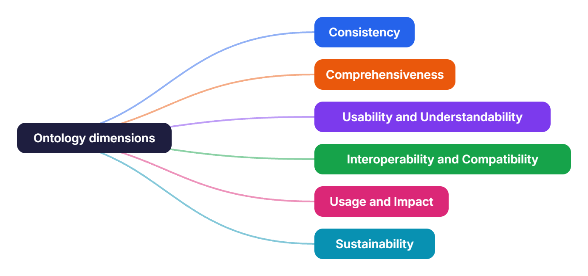
<figcaption>
Figure 8. Semantic resource dimensions.
</figcaption>
</figure>

- **Consistency:** The extent to which the ontology is coherent and free from logical contradictions.

- **Comprehensiveness:** The extent to which the ontology can represent cultural heritage information in a sufficiently broad and appropriate way. This includes coverage of relevant asset types, entities, relationships, and properties across different cultural heritage domains and use cases.

- **Usability and understandability:** The extent to which the ontology can be understood, adopted, and applied effectively by stakeholders. This includes conceptual clarity, accessibility, quality of documentation, and practical usefulness.

- **Interoperability and compatibility:** The extent to which the ontology can be integrated and used with other models, standards, and systems. This includes alignment with established data models, controlled vocabularies, and relevant standards, as well as technical compatibility through supported formats and interfaces.

- **Usage and impact:** The extent to which the ontology is adopted, reused, and influential in cultural heritage research and practice, including its contribution to collaboration within the ECCCH ecosystem.

- **Sustainability:** The extent to which the ontology can remain viable over time, including ease of maintenance, adaptability to new domains or standards, scalability, and the existence of appropriate governance and versioning practices.

**Prioritization**

Usability and Understandability, together with Interoperability and Compatibility should be treated as core dimensions. They are broadly relevant to most semantic resources within the ECCCH and are especially important in practice, since the usefulness of semantic resources depends not only on formal aspects, but also on whether they are understandable, well documented, and easy to adopt and reuse. Documentation quality is particularly important in this respect.

Usage and Impact should be treated as context-dependent. Information of actual usage can be highly relevant in some cases, especially for semantic resources that are actively reused across projects and datasets. However, general impact is harder to define and measure consistently, and its relevance may depend strongly on the maturity and scope of the resource.

Comprehensiveness and Sustainability should be treated as not currently prioritized. Comprehensiveness is difficult to assess consistently because the ECCCH will include both broad reference ontologies and more specialized domain-specific ontologies, extensions, and mappings, for which expectations of coverage will vary significantly. Sustainability is also clearly relevant, but it is harder to assess in a proportionate and consistent way at this stage of the framework and would require more mature governance- and lifecycle-related procedures.

#### Assessment instruments and indicators

The assessment of semantic resources requires a combination of different types of instruments. Some tools support the creation, inspection, documentation, and collaborative maintenance of ontologies and can therefore provide useful information about understandability, documentation quality, and aspects of sustainability. Others are designed more directly for formal validation, reasoning, quality diagnostics, and metric-based analysis, and are especially useful for dimensions such as consistency, and interoperability. A third group includes questionnaires, checklists, and broader quality-assessment frameworks, which are particularly important for dimensions that cannot be assessed reliably through formal validation alone, such as comprehensiveness, usability and adoption. For this reason, the tools listed below should not be understood as covering all evaluation dimensions equally. Most of them primarily support the assessment of formal, structural, documentation-related, or governance-related aspects of semantic resources. Broader dimensions such as comprehensiveness, usability and understandability, usage and impact, and parts of sustainability typically require complementary expert-based assessment through questionnaires, checklists, workshops, or other structured review processes.

**Examples of tools**

A small sample of tools is shown below. The full list, together with richer descriptions and relevant properties such as the evaluation dimensions they cover, is available in the companion wiki.

<table>
<colgroup>
<col style="width: 20%" />
<col style="width: 79%" />
</colgroup>
<thead>
<tr>
<th>Tool</th>
<th>Description /Link</th>
</tr>
</thead>
<tbody>
<tr>
<td style="text-align: left;">Protégé Desktop</td>
<td>
Free, open-source OWL ontology editor with built-in integration to DL reasoners and support for debugging inconsistencies and refactoring ontologies.

https://protege.stanford.edu/
</td>
</tr>
<tr>
<td style="text-align: left;">HermiT OWL Reasoner</td>
<td>
OWL 2 DL reasoner that checks ontology consistency and computes class hierarchies (classification) and related inferences.

https://www.hermit-reasoner.com
</td>
</tr>
<tr>
<td style="text-align: left;">ELK Reasoner</td>
<td>
High-performance OWL 2 EL reasoner for large ontologies; used to classify and validate profile-consistent ontologies efficiently.

https://liveontologies.github.io/elk-reasoner/
</td>
</tr>
<tr>
<td style="text-align: left;">Pletka</td>
<td>
Pletka is a platform for collaboratively creating, documenting, and sharing semantic data models.

https://dev.pletka.io/
</td>
</tr>
<tr>
<td style="text-align: left;">FOCA</td>
<td>
Framework for Ontology Quality Assessment is a methodology for ontology evaluation based on a Goal–Question–Metric approach. It includes a questionnaire and a scoring model to assess ontology quality beyond formal consistency, with questions about completeness, reuse, documentation, organizational fitness, and alignment.

https://arxiv.org/abs/1612.03353
</td>
</tr>
<tr>
<td style="text-align: left;">OUS</td>
<td>
Ontology Usability Scale is a questionnaire-style usability instrument proposed specifically for ontologies, with short statements intended to assess ontology usability in terms of effectiveness, efficiency, satisfaction, contextual relevance, intended use, and fitness for use.

https://datascience.codata.org/articles/799/files/submission/proof/799-1-3963-1-10-20180510.pdf
</td>
</tr>
</tbody>
</table>

Specific indicators for assessing semantic resources will be progressively refined as ECHOES advances, combining formal validation metrics, documentation and governance indicators, and expert-based assessment criteria.

Formal and structural indicators may include the number of unsatisfiable classes, reasoning performance, ontology size and complexity measures, and the degree of alignment with HDTO or other relevant reference models.

Documentation and governance indicators may include the presence of a persistent URI policy, the availability and completeness of human- and machine-readable documentation, the existence of competency questions or other explicit scope statements, the regularity of releases and updates, the availability of version history and change logs, and issue response time.

Community and adoption indicators may include the number and quality of alignments to external ontologies and standards, the number of imported or reused semantic resources, evidence of community adoption or reuse cases, and results derived from structured questionnaires, checklists, or rubric-based expert review.

#### Implications for semantic resource providers

As with metadata and knowledge graph resources, semantic resources must comply, at a gate level, with the interoperability requirements defined in Deliverable D6.2, depending on the targeted interoperability level. These requirements ensure basic alignment with shared data models, standards, and integration mechanisms within the ECCCH.

Beyond these baseline requirements, the evaluation of semantic resources is inherently complex, as many of the relevant dimensions, such as comprehensiveness, usability, or impact, cannot be fully captured through automated means. For this reason, the CAF adopts a *combined self-assessment approach*, based on both tool-supported evaluation and structured qualitative feedback.

For those aspects that can be assessed through automated or semi-automated tools, ECCCH will recommend and support the use of ontology engineering and validation tools such as those described in the previous section. Resource providers will be expected to execute these tools and share the resulting outputs with ECHOES. This includes, for example, reports on logical consistency, structural quality, ontology metrics, documentation completeness, or detected modeling issues.

In addition, for dimensions that require expert judgment or community input, ECHOES plans to define *lightweight questionnaires and assessment templates* to be completed by semantic resource providers, including sister projects and other contributors. These questionnaires will collect structured feedback on aspects such as usability, understandability, coverage, alignment with domain needs, and perceived impact. This approach allows for capturing qualitative insights that cannot be derived from automated tools alone.

Overall, semantic resource providers are expected to participate actively in the evaluation process by combining tool-based self-assessment with structured feedback mechanisms. This combined approach supports a more comprehensive and scalable evaluation of semantic resources while fostering community involvement and continuous improvement across the ECCCH ecosystem.

### Evaluation of Software

Software resources within the ECCCH include both core services and user-facing applications, such as vertical applications and other tools contributed by the broader ecosystem. Their evaluation must address not only technical robustness, but also usability, interoperability, sustainability, security, and adoption in practice. Because software resources vary significantly in purpose, architecture, maturity, and operational context, not all dimensions apply equally to every resource, and some subdimensions may need to be adapted to the specific characteristics of each application or service. The dimensions presented below therefore provide a structured but flexible basis for assessing software quality within the ECCCH.

As discussed in Section [3.3.2](#software-products)*,* the CAF adopts several software quality dimensions proposed by RSQKit, adapting them to the specific needs of the ECCCH ecosystem.

#### Evaluation dimensions

Most of the dimensions listed below are adapted from RSQKit 1.4.0 ([Figure 5](#_Ref226827937) and [Figure 6](#_Ref226827974)), while others have been added or refined to reflect ECCCH-specific requirements ([Figure 7](#_Ref226827990)). Together, they aim to cover both core software quality characteristics and broader concerns related to cultural heritage use, governance, compliance, and adoption.

<figure>
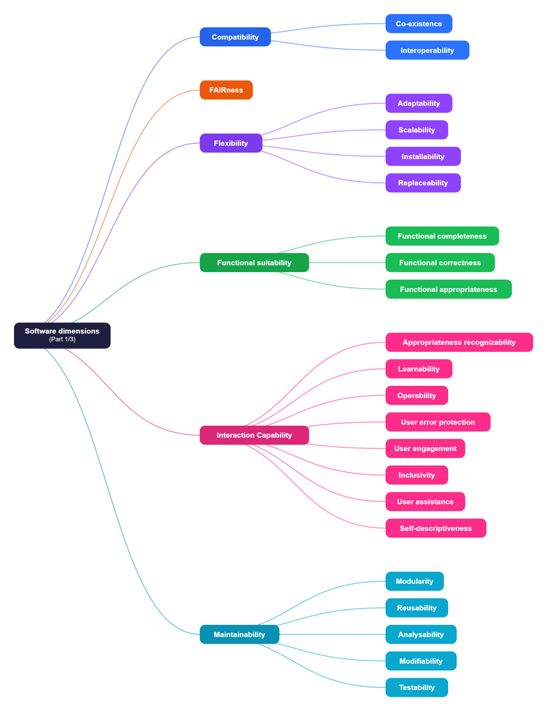
<figcaption>
Figure 9. Software dimensions (part 1/3).
</figcaption>
</figure>

<figure>
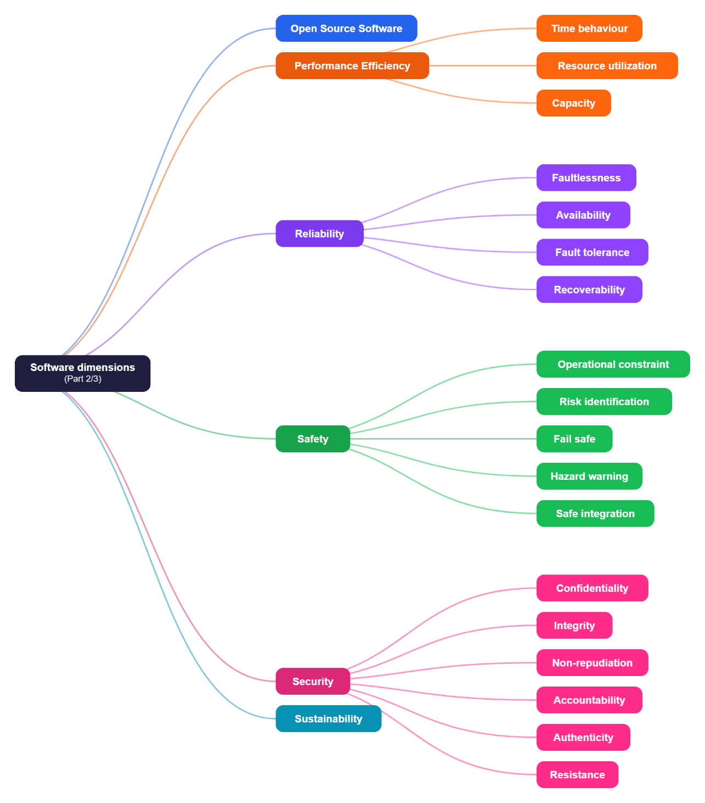
<figcaption>
Figure 10. Software dimensions (part 2/3).
</figcaption>
</figure>

<figure>
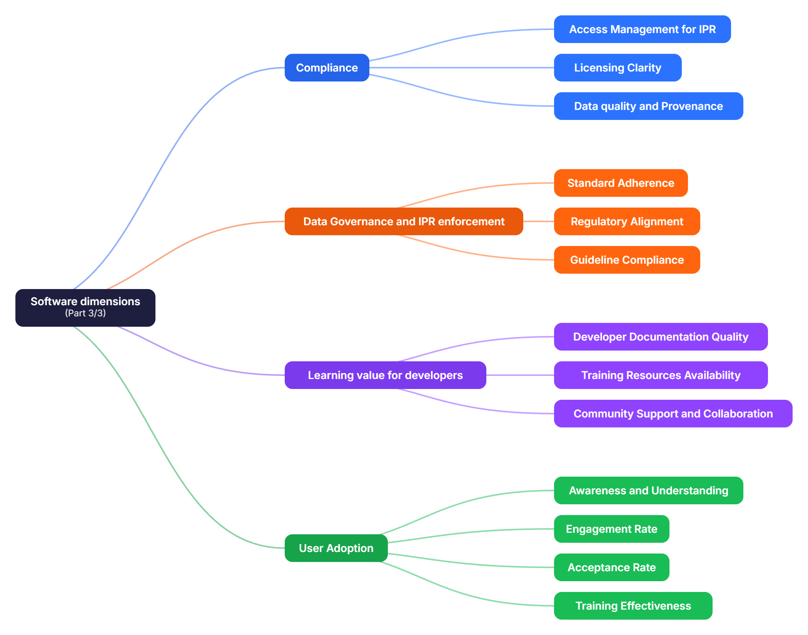
<figcaption>
Figure 11. Software dimensions (part 3/3).
</figcaption>
</figure>

Some dimensions, such as compatibility, functional suitability, maintainability, reliability, performance efficiency, safety, and security, are grounded in established software quality models and standards. Others, such as compliance, data governance and IPR enforcement, learning value for developers, and user adoption, reflect ECCCH-specific concerns and should therefore be understood as more preliminary dimensions that will require further refinement in later stages of the framework.

- **Compatibility:** Degree to which a product, system or resource can exchange information with other products, systems or resources, and/or perform its required functions while sharing the same common environment and resources.

  - ***Co-existence*:** Degree to which a product can perform its required functions efficiently while sharing a common environment and resources with other products, without detrimental impact on any other product.

  - ***Interoperability*:** Degree to which a system, product or resource can exchange information with other products and mutually use the information that has been exchanged.

- **FAIRness:** Degree to which research software adheres to the FAIR principles: Findable, Accessible, Interoperable, and Reusable. These principles, adapted for research software, aim to enhance the discoverability, accessibility, interoperability, and reusability of software, thereby maximizing its value and impact in scientific research.

- **Flexibility:** Degree to which a product can be adapted to changes in its requirements, contexts of use or system environment.

  - ***Adaptability*:** Degree to which a product or system can effectively and efficiently be adapted for or transferred to different hardware, software or other operational or usage environments.

  - ***Scalability*:** Degree to which a product can handle growing or shrinking workloads or adapt its capacity to handle variability.

  - ***Installability*:** Degree of effectiveness and efficiency with which a product or system can be successfully installed and/or uninstalled in a specified environment.

  - ***Replaceability*:** Degree to which a product can replace another specified software product for the same purpose in the same environment.

- **Functional suitability:** This characteristic represents the degree to which a product or system provides functions that meet stated and implied needs when used under specified conditions.

  - ***Functional completeness*:** Degree to which the set of functions covers all the specified tasks and intended users’ objectives.

  - ***Functional correctness*:** Degree to which a product or system provides accurate results when used by intended users.

  - ***Functional appropriateness*:** Degree to which the functions facilitate the accomplishment of specified tasks and objectives.

- **Interaction capability:** Degree to which a product or system can be interacted with by specified users to exchange information via the user interface to complete specific tasks in a variety of contexts of use.

  - ***Appropriateness recognizability*:** Degree to which users can recognize whether a product or system is appropriate for their needs.

  - ***Learnability*:** Degree to which the functions of a product or system can be learnt to be used by specified users within a specified amount of time.

  - ***Operability*:** Degree to which a product or system has attributes that make it easy to operate and control.

  - ***User error protection*:** Degree to which a system prevents users from operation errors.

  - ***User engagement*:** Degree to which a user interface presents functions and information in an inviting and motivating manner encouraging continued interaction.

  - ***Inclusivity*:** Degree to which a product or system can be used by people of various backgrounds (such as people of various ages, abilities, cultures, ethnicities, languages, genders, economic situations, etc.).

  - ***User assistance*:** Degree to which a product can be used by people with the widest range of characteristics and capabilities to achieve specified goals in a specified context of use.

  - ***Self-descriptiveness*:** Degree to which a product presents appropriate information, where needed by the user, to make its capabilities and use immediately obvious to the user without excessive interactions with a product or other resources (such as user documentation, help desks or other users).

- **Maintainability:** his characteristic represents the degree of effectiveness and efficiency with which a product or system can be modified to improve it, correct it or adapt it to changes in environment, and in requirements.

  - ***Modularity*:** Degree to which a system or computer program is composed of discrete components such that a change to one component has minimal impact on other components.

  - ***Reusability*:** Degree to which a product can be used as an asset in more than one system, or in building other assets.

  - ***Analyzability*:** Degree of effectiveness and efficiency with which it is possible to assess the impact on a product or system of an intended change to one or more of its parts, to diagnose a product for deficiencies or causes of failures, or to identify parts to be modified.

  - ***Modifiability*:** Degree to which a product or system can be effectively and efficiently modified without introducing defects or degrading existing product quality.

  - ***Testability*:** Degree of effectiveness and efficiency with which test criteria can be established for a system, product or component, and tests can be performed to determine whether those criteria have been met.

- **Open-source software:** Degree to which the software source code is openly available for inspection, use, modification, and redistribution, supporting transparency, reproducibility, and community contribution (Chue Hong et al. 2026).

  - ***Source code availability***: Degree to which the software source code is publicly accessible through a recognized repository or platform.

  - ***Open-source licensing***: Degree to which the software is released under a recognized open-source license that explicitly permits inspection, modification, and redistribution.

  - ***Integration with open-source ecosystems***: Degree to which the software is compatible with and builds upon existing open-source tools, frameworks, and operating systems.

  - ***Alignment with open-source community practices***: Degree to which the software follows standard open-source community practices, including contributor guidelines, codes of conduct, and use of platforms supporting community interaction.

  - ***Alignment with open-source decision making practices***: Degree to which the software development process follows open and transparent decision-making practices, including publicly maintained roadmaps and documented governance structures.

- **Performance efficiency:** This characteristic represents the degree to which a product performs its functions within specified time and throughput parameters and is efficient in the use of resources (such as CPU, memory, storage, network devices, energy, materials…) under specified conditions.

  - ***Time behavior*:** Degree to which the response time and throughput rates of a product or system, when performing its functions, meet requirements.

  - ***Resource utilization*:** Degree to which the amounts and types of resources used by a product or system, when performing its functions, meet requirements.

  - ***Capacity*:** Degree to which the maximum limits of a product or system parameter meet requirements.

- **Reliability:** Degree to which a system, product or component performs specified functions under specified conditions for a specified period.

  - ***Faultlessness*:** Degree to which a system, product or component performs specified functions without fault under normal operation.

  - ***Availability*:** Degree to which a system, product or component is operational and accessible when required for use.

  - ***Fault tolerance*:** Degree to which a system, product or component operates as intended despite the presence of hardware or software faults.

  - ***Recoverability*:** Degree to which, in the event of an interruption or a failure, a product or system can recover the data directly affected and re-establish the desired state of the system.

- **Safety:** This characteristic represents the degree to which a product under defined conditions avoids a state in which human life, health, property, or the environment is endangered.

  - ***Operational constraint*:** Degree to which a product or system constrains its operation to within safe parameters or states when encountering operational hazards.

  - ***Risk identification*:** Degree to which a product can identify a course of events or operations that can expose life, property or environment to unacceptable risk.

  - ***Fail safe*:** Degree to which a product can automatically place itself in a safe operating mode, or to revert to a safe condition in the event of a failure.

  - ***Hazard warning*:** Degree to which a product or system provides warnings of unacceptable risks to operations or internal controls so that they can react in sufficient time to sustain safe operations.

  - ***Safe integration*:** Degree to which a product can maintain safety during and after integration with one or more components.

- **Security:** Degree to which a product or system defends against attack patterns by malicious actors and protects information and data so that persons or other products or systems have the degree of data access appropriate to their types and levels of authorization.

  - ***Confidentiality*:** Degree to which a product or system ensures that data are accessible only to those authorized to have access.

  - ***Integrity*:** Degree to which a system, product or component ensures that the state of its system and data are protected from unauthorized modification or deletion either by malicious action or computer error.

  - ***Non-repudiation*:** Degree to which actions or events can be proven to have taken place so that the events or actions cannot be repudiated later.

  - ***Accountability*:** Degree to which the actions of an entity can be traced uniquely to the entity.

  - ***Authenticity*:** Degree to which the identity of a subject or resource can be proved to be the one claimed.

  - ***Resistance*:** Degree to which the product or system sustains operations while under attack by a malicious actor.

- **Sustainability:** Degree to which software can continue to exist, be maintained, and remain useful over time across changing platforms, dependencies, and user needs.

- **Compliance:** This dimension evaluates the adherence of the application to established standards, regulations, and project-specific guidelines.

  - ***Access management for IPR*:** Evaluates the effectiveness of the application in managing and restricting access based on Intellectual Property Rights.

  - ***Licensing clarity*:** Measures the application's ability to enforce explicit licensing terms for all data.

  - ***Data quality and provenance*:** Measures the application's ability to ensure data quality, consistency, and clear traceability of its origin and modifications.

- **Data governance and IPR enforcement:** This dimension focuses on how the application facilitates or enforces the data governance model and the preservation of intellectual property rights.

  - ***Standard adherence*:** Assesses conformity with relevant technical standards, data formats, and open models.

  - ***Regulatory alignment*:** Measures compliance with national, European, and international legal and ethical frameworks.

  - ***Guideline compliance*:** Ensures adherence to specific integration, development, and communication guidelines provided by the ECHOES consortium.

- **Learning value for developers:** This dimension considers how well the application supports and educates developers willing to contribute their own applications.

  - ***Developer documentation quality*:** Assesses the clarity, comprehensiveness, and utility of technical documentation tailored for developers, including examples and guidelines.

  - ***Training resources availability*:** Evaluates the provision of educational materials, tutorials, and capacity-building activities specifically for developers to enhance their skills.

  - ***Community support and collaboration*:** Measures the effectiveness of mechanisms that facilitate knowledge exchange, problem-solving, and collaborative development among the developer community regarding a specific application.

- **User adoption:** This dimension measures the extent to which CH stakeholders embrace and effectively use a specific application.

  - ***Awareness and understanding*:** Reflects how well target communities are informed about and comprehend the advantages of using a specific ECCCH application.

  - ***Engagement rate*:** Indicates the frequency and depth of active use of the application by users (active users, session duration...).

  - ***Acceptance rate*:** Measures the overall willingness and readiness of the community to integrate and use a specific application in their workflows.

  - ***Training effectiveness*:** Evaluates the success of capacity-building activities and the ECHOES curriculum in equipping users with the necessary skills for using the application.

**Prioritization**

Compatibility, Open-Source Software, FAIRness, Security, and Interaction Capability should be treated as core dimensions in the initial implementation of the framework. Compatibility is central because software resources in the ECCCH must operate within an interoperable ecosystem, and some of its aspects can be assessed in multiple practical ways. Open-Source Software and FAIRness are also suitable as core dimensions because they are highly relevant in the ECHOES context and can be evaluated, at least partially, through existing tools, checklists, and documentation. Security is clearly essential for software resources integrated into the ECCCH, while Interaction Capability is critical because many of these resources are intended for direct use by stakeholders and because poor usability would directly undermine adoption and value.

Maintainability, Safety, Flexibility, Functional suitability, Data Governance and IPR enforcement, User Adoption, and Sustainability should be treated as context-dependent. Some aspects of Maintainability can be supported by automated tools, but its relevance and interpretation may vary significantly depending on the maturity of the software. Functional suitability is essential, but it is highly specific to each application, so it cannot be applied in a uniform way across all software resources. Safety, Flexibility, Data Governance and IPR enforcement, User Adoption, and Sustainability are all relevant in certain cases, but their importance depends strongly on the nature of the resource, its users, its deployment context, and its stage of maturity. User Adoption is included here because the framework should be prepared to assess it where relevant, even if it will not apply equally to all software resources from the initial implementation.

Performance Efficiency, Reliability, Compliance, and Learning value for developers should be treated as not currently prioritized. Performance Efficiency and Reliability are both important dimensions, but in the current state of the framework they make more sense as a stronger focus once the surrounding infrastructure and service environment are more mature and more systematic monitoring data is available. Compliance remains relevant, but it is still too broad and not yet sufficiently stabilized in the current framework. Learning value for developers is also meaningful, especially for ecosystem growth, but it is not part of the first implementation focus of the framework.

#### Assessment instruments and indicators

The evaluation basis for software resources consists of the artefacts that describe, implement, test, deploy, document, and operate the resource under assessment. Depending on the software resource and its maturity, this may include the architecture description, source code repository, dependency manifests, API specifications, configuration files, CI/CD workflows, test suites and test reports, issue trackers, release history, user and developer documentation, deployment descriptors, security reports, operational logs, and pilot evaluation results. These artefacts provide evidence on which the relevant software quality dimensions can be assessed.

For example, providers may use an architecture description, complemented by repository-level evidence, to document the number and type of subcomponents, interfaces, dependencies, integration points, and separation of concerns. This self-reported data can inform the assessment of dimensions such as compatibility, interoperability, modularity, maintainability and scalability. Codebase and pipeline review, carried out by the provider through recommended tools where possible, can provide complementary evidence for maintainability, testability, security, reliability, and stability, for instance through static analysis, dependency scanning, test coverage reports, CI results, and review of release or deployment workflows. User documentation, tutorials, questionnaires, and pilot feedback provide additional evidence for usability, documentation quality, learning value for developers, and adoption.

The assessment of software quality requires a combination of different types of instruments. Some provide reference models and standards that define software quality characteristics and associated measures. Others provide automated or semi-automated analysis tools, such as static analysis tools, security scanners, test coverage tools, and performance monitoring platforms, which generate information for specific dimensions. A third group includes process-oriented or user-oriented instruments, such as checklists, questionnaires, traceability matrices, interview protocols, and pilot-based testing methods, which are especially important for dimensions that cannot be assessed reliably through automation alone.

No single instrument can cover all software dimensions. For this reason, the tools and frameworks listed below should be understood as complementary. Some are more suitable for code quality, maintainability, security, or performance, while others are more relevant for functional suitability, documentation quality, usability, learning value, or user adoption.

For readability, the following instruments are grouped into broad families, including general software quality frameworks, functional suitability instruments, end-to-end testing tools, static code analysis tools, security assessment instruments, and performance analysis tools.

**Examples of tools**

A small sample of tools is shown below. The full list, together with richer descriptions and relevant properties such as the evaluation dimensions they cover, is available in the companion wiki.

##### General software quality tools and frameworks

<table>
<colgroup>
<col style="width: 29%" />
<col style="width: 70%" />
</colgroup>
<thead>
<tr>
<th style="text-align: left;">Tool</th>
<th>Description /Link</th>
</tr>
</thead>
<tbody>
<tr>
<td style="text-align: left;">
ISO/IEC 25010

software product quality model
</td>
<td style="text-align: left;">
Defines a standardized model of software product quality characteristics and sub-characteristics, providing a common vocabulary and reference framework for specifying, evaluating and comparing software quality.

https://www.iso.org/standard/35733.html
</td>
</tr>
<tr>
<td style="text-align: left;">OMG ASCQM v1.1</td>
<td style="text-align: left;">
OMG’s Automated Source Code Quality Measures specification for automatically measuring software structural quality through static source-code analysis. It defines a catalog of weaknesses and detection patterns.

https://www.omg.org/spec/ASCQM/1.1/PDF
</td>
</tr>
<tr>
<td style="text-align: left;">OpenSSF Best Practices Badge</td>
<td style="text-align: left;">
Provides a checklist-based assessment and public badge to evaluate and communicate adherence to recognized best practices in open-source software projects.

https://www.bestpractices.dev/en, https://openssf.org/projects/best-practices-badge/
</td>
</tr>
<tr>
<td style="text-align: left;">FAIR4RS</td>
<td style="text-align: left;">
FAIR for Research Software Principles defines principles and assessment criteria to improve the findability, accessibility, interoperability and reusability of research software.

https://doi.org/10.1038/s41597-022-01710-x, https://zenodo.org/records/6623556
</td>
</tr>
</tbody>
</table>

##### Static code analysis tools

<table>
<colgroup>
<col style="width: 29%" />
<col style="width: 70%" />
</colgroup>
<thead>
<tr>
<th>Tool</th>
<th>Description /Link</th>
</tr>
</thead>
<tbody>
<tr>
<td>Semgrep</td>
<td>
Multi-language static analysis tool with customizable rules.

https://github.com/semgrep/semgrep
</td>
</tr>
<tr>
<td>SonarQube</td>
<td>
Comprehensive code quality and security analysis platform. Community edition does not cover all languages/features.

https://www.sonarqube.org
</td>
</tr>
<tr>
<td>CodeQL</td>
<td>
Semantic code analysis engine developed by GitHub; focuses on security vulnerabilities.

https://codeql.github.com
</td>
</tr>
<tr>
<td>Lizard</td>
<td style="text-align: left;">
Cyclomatic Complexity Analyzer for many programming languages including C#, C/C++, Java, JavaScript, Python and TypeScript.

https://github.com/terryyin/lizard
</td>
</tr>
</tbody>
</table>

##### Security testing 

<table>
<colgroup>
<col style="width: 29%" />
<col style="width: 70%" />
</colgroup>
<thead>
<tr>
<th>Tool</th>
<th>Description /Link</th>
</tr>
</thead>
<tbody>
<tr>
<td style="text-align: left;">OWASP ASVS</td>
<td>
Application Security Verification Standard is a standard that defines security requirements and verification levels for designing, building, and testing secure web applications and APIs.

https://owasp.org/www-project-application-security-verification-standard/
</td>
</tr>
<tr>
<td style="text-align: left;">OWASP WSTG</td>
<td>
Web Security Testing Guide is a comprehensive guide that provides methodologies and test cases for performing web application security testing and penetration testing.

https://owasp.org/www-project-web-security-testing-guide/
</td>
</tr>
<tr>
<td style="text-align: left;">OWASP Dependency-Check</td>
<td style="text-align: left;">
A tool that identifies known vulnerabilities in third-party dependencies by scanning project dependency manifests.

https://owasp.org/www-project-dependency-check/
</td>
</tr>
<tr>
<td>Trivy</td>
<td style="text-align: left;">
A security scanner for containers, cloud-native workloads, dependencies, and infrastructure-as-code configurations.

https://aquasecurity.github.io/trivy/
</td>
</tr>
</tbody>
</table>

#### Implications for software resource providers

At a gate level, software resources must first satisfy the interoperability and integration requirements defined in Deliverable D6.2, according to the relevant interoperability level. These baseline requirements are necessary for entry into the ECCCH, but they are not sufficient to support a broader assessment of software quality, usability, security, sustainability, and adoption. For this reason, the CAF adopts a self-assessment approach for software resources. Software providers will be expected to evaluate their applications or services against the relevant quality dimensions using appropriate tools and frameworks, such as those listed in the previous section, and to share the resulting outputs with ECHOES. This may include, for example, outputs from static analysis, test coverage tools, security scanners, performance testing tools, or documentation and FAIRness checklists. Since not all dimensions can be fully assessed automatically, self-assessment will also be complemented by lightweight questionnaires and structured reporting templates, to be progressively defined by ECHOES, covering aspects such as usability, sustainability, learning value for developers, and expected user adoption. In addition, some dimensions, especially those related to usability, interaction capability, and community acceptance, will require complementary evaluation through pilot activities involving representative users. Overall, software resource providers are expected to contribute actively to this evaluation process by combining tool-based self-assessment with the sharing of supporting evidence and participation in follow up evaluation activities where needed.

Where appropriate, selected software quality characteristics and review outcomes may also be made visible through an ECHOES repository of services and resources, the ECCCH Knowledge Base, the CAF wiki, or ECCCH-specific badges. This could include, for example, information on licensing, documentation availability, interoperability level, FAIRness, test evidence, release status, security review status, known limitations, and links to public evidence where available, while keeping sensitive technical details subject to appropriate confidentiality and security constraints.

### Evaluation of Infrastructure and Digital Services

Digital services within the ECCCH include operational services that provide access to data, APIs, workflows, computation, storage, authentication, search, and other shared capabilities within the ecosystem. Their evaluation should be distinguished from both the evaluation of software products and the evaluation of the underlying infrastructure. While software evaluation focuses on the quality of the application or codebase, and infrastructure evaluation focuses on broader platform-level capacity and sustainability, the evaluation of digital services focuses on how services behave in operation: whether they are available, reliable, secure, performant, observable, and manageable over time. In this respect, the present subsection builds on the gate-level interoperability and provider requirements defined in D6.2 and in the ECHOES Engineering Handbook, but extends the perspective beyond baseline conformance toward service quality in operation.

#### Evaluation dimensions

To support a consistent and scalable assessment of digital services within the ECCCH ecosystem, it is necessary to define a set of evaluation dimensions that capture the key properties of the infrastructure. These dimensions translate high-level quality objectives into observable and measurable aspects that can be monitored over time. The framework identifies four primary dimensions, availability, reliability, performance, and security, each further articulated through specific indicators that enable systematic assessment and comparison across services.

<figure>
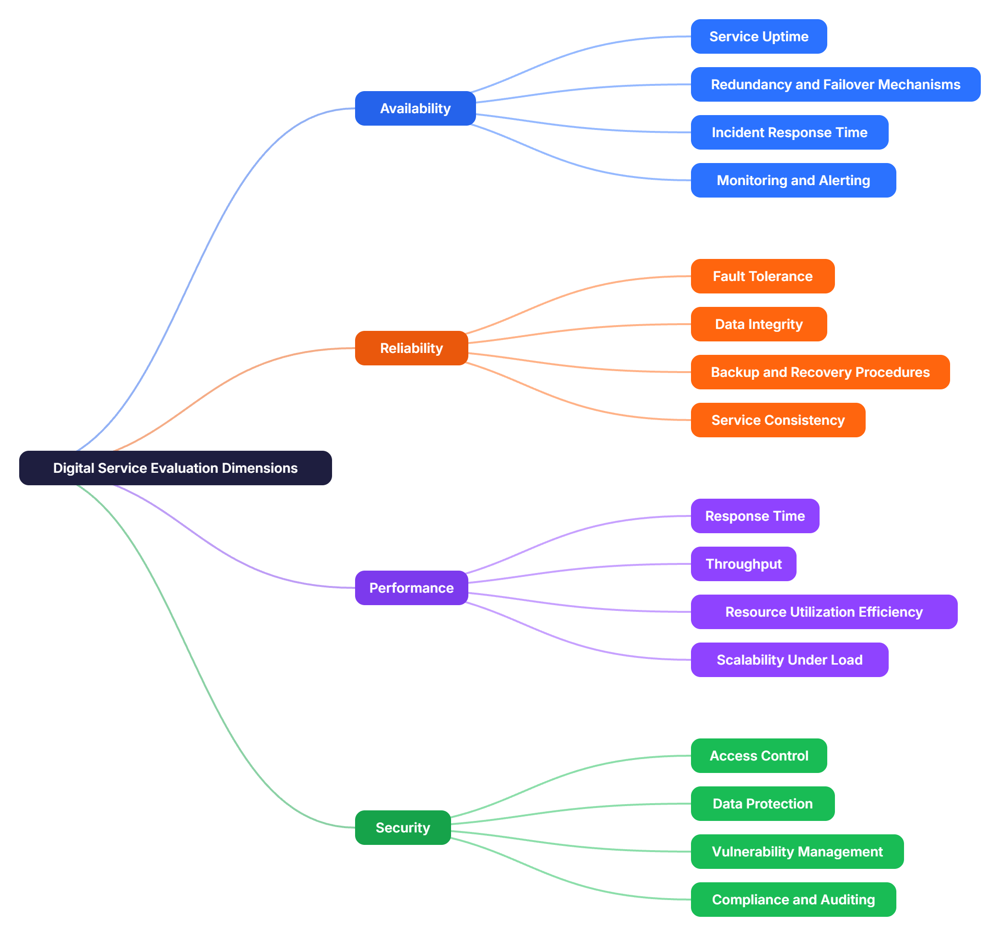
<figcaption>
Figure 12. Dimensions for Infrastructure and digital services.
</figcaption>
</figure>

Main dimensions:

- **Availability:** This dimension assesses the extent to which the digital services are continuously operational and accessible, minimizing downtime and ensuring users can reliably access CH resources at any time.

  - ***Service uptime*:** Measures the proportion of time that the services remain fully operational and accessible to users.

  - ***Redundancy and failover mechanisms*:** Assesses the presence and effectiveness of backup systems, load balancing, and failover strategies that ensure service continuity in case of component failure.

  - ***Incident response time*:** Evaluates how quickly the infrastructure team can detect, respond to, and resolve outages or service interruptions.

  - ***Monitoring and alerting*:** Examines the robustness of monitoring systems and real-time alert mechanisms that track service health and performance.

- **Reliability:** This dimension evaluates the infrastructure’s ability to deliver consistent and dependable service performance under expected and peak workloads, avoiding system failures and data loss.

  - ***Fault tolerance*:** Assesses the infrastructure’s capacity to continue operating correctly even when components fail or experience errors.

  - ***Data integrity*:** Evaluates mechanisms ensuring that data remains accurate, complete, and consistent during storage, processing, and transmission.

  - ***Backup and recovery procedures*:** Measures the effectiveness and frequency of data backups and the ability to restore systems quickly after a failure or data loss.

  - ***Service consistency*:** Examines the ability of the infrastructure to provide predictable and stable service performance under varying workloads and operational conditions.

- **Performance:** This dimension measures the responsiveness, speed, and efficiency of the infrastructure and its services in processing, storing, and retrieving CH data and metadata.

  - ***Response time*:** Measures how quickly the infrastructure and its services respond to user actions or data requests.

  - ***Throughput*:** Evaluates the volume of operations, transactions, or data processed by the infrastructure within a given time period.

  - ***Resource utilization efficiency*:** Assesses how effectively the system uses available computing resources (CPU, memory, storage, and network) to deliver optimal performance.

  - ***Scalability under load*:** Examines the infrastructure’s ability to maintain or improve performance as the number of users, data volume, or computational demand increases.

- **Security:** This dimension evaluates the mechanisms protecting data, metadata, and services from unauthorized access, alteration, or loss, ensuring confidentiality, integrity, and compliance with relevant security standards.

  - ***Access control*:** Assesses the effectiveness of authentication and authorization mechanisms that manage and restrict user access to systems and data.

  - ***Data protection*:** Evaluates the safeguards ensuring confidentiality, integrity, and availability of CH data during storage, transfer, and processing.

  - ***Vulnerability management*:** Measures the processes for identifying, assessing, and mitigating security risks, vulnerabilities, and potential threats within the infrastructure.

  - ***Compliance and auditing*:** Examines adherence to relevant security standards and regulations, and the implementation of regular audits to verify compliance and detect anomalies.

**Prioritization**

Reliability and Security (beyond gate-level acceptance) should be treated as core dimensions in the initial implementation of the framework. They are broadly relevant across most digital services in the ECCCH and are closely related to the need for services to behave predictably, protect data and access, and support trustworthy operation over time.

Availability and Performance should be treated as context-dependent. Both are important service-level dimensions, but their priority depends strongly on the role and criticality of the service. Not all digital services within the ECCCH are equally critical or equally exposed to demanding requirements. For example, these dimensions are especially important for essential ECHOES-provided services and other user-facing or central services, where uptime, responsiveness, and capacity directly affect the functioning of the ecosystem. By contrast, for less critical or more specialized services, the same dimensions may remain relevant but not necessarily require the same level of assessment effort or monitoring intensity in the initial implementation phase.

#### Assessment instruments and indicators

The assessment of digital services should combine baseline conformance information with operational monitoring data. Some instruments are oriented toward contract and conformance validation, such as OpenAPI-based validation, health and readiness verification, and checks on error handling, pagination, filtering, and versioning behavior. Others are oriented toward runtime monitoring and observability, such as service dashboards, metrics collection, log aggregation, and alerting systems. A third group includes performance and resilience testing tools, which help assess response time, throughput, degradation behavior, and recovery under load or fault conditions.

**Examples of tools**

At a minimum, assessment instruments for ECCCH digital services should support the following functions, as indicated by D6.2:

- **API contract and conformance validation**: Tools and procedures that verify alignment between actual service behavior and the formally specified service contract, including request and response structures, status codes, error models, pagination, filtering, and versioning discipline.

- **Health and readiness verification**: Mechanisms that confirm whether a service is operational, whether dependencies are reachable, and whether the service is ready to receive traffic under normal conditions.

- **Observability and monitoring**: Platforms and tools that collect and expose indicators such as availability, latency, throughput, error rates, queue lengths, dependency failures, and structured logs.

- **Performance and load testing**: Tools that assess service behavior under realistic and peak workloads, including response time, throughput, scalability, and degradation under stress.

- **Security-relevant operational data**: Instruments that support the review of authentication and authorization behavior, secure transport, secret handling, audit trails, and related controls in operation.

- **Deployment and drift-control validation**: Tools and procedures that help verify configuration consistency, deployment reproducibility, version traceability, and the detection of contract or implementation drift over time.

Indicative service-level indicators may include:

- Uptime percentage

- Health-check and readiness-check success rate

- Request success and error rates

- Median and percentile response times

- Throughput over time

- Time to detect incidents

- Time to recover from incidents

- Rate of failed authentication or authorization events

- Frequency of dependency-related failures

- Frequency of contract-drift or deployment-validation failures

These indicators should be understood as extending the gate-level requirements defined in D6.2 and in the ECHOES Engineering Handbook. In this framework, they are not intended only to verify minimum conformance, but also to provide information about the actual quality of digital services in operation. More specific indicators and recommended tools should be progressively refined as the CAF matures and as ECCCH services become operational.

#### Implications for service providers

Once digital services have satisfied the gate-level interoperability and provider requirements defined in Deliverable D6.2, service providers should be expected to contribute information not only of conformance, but also of operational quality. In practice, this means demonstrating how the service performs in real conditions of use, not only how it is specified at onboarding.

For this reason, the CAF adopts a self-assessment approach for digital services. Service providers are expected to assess their own services against the relevant dimensions described above and to collect the corresponding operational data. Depending on the nature of the service, this may include API specifications and validation results, health and readiness data, monitoring outputs, logs and metrics, performance and load-testing results, incident and recovery information, and documentation on deployment, versioning, and security-related controls.

A central expectation of this self-assessment approach is that service providers share the resulting indicators and support evidence with ECHOES. This is necessary to enable consistent review, comparison, and aggregation across services, and to support a broader understanding of service quality at the ecosystem level. The evidence shared with ECHOES should therefore include not only raw technical outputs where relevant, but also the specific indicators derived from them and the contextual information needed to interpret those indicators correctly.

Because the quality of digital services can only be assessed meaningfully over time, providers should also be prepared to participate in periodic reassessment. This includes maintaining service documentation, updating operational information when relevant changes occur, and reporting revised indicators when incidents, degradations, or substantial modifications affect service behavior. In this sense, the assessment of digital services should be understood as a continuing process.

Overall, service providers are expected to contribute actively to the evaluation process by combining self-assessment, the regular sharing of indicators and supporting information with ECHOES, and participation in follow-up review where needed. This approach allows the CAF to move beyond gate-level acceptance and toward a more meaningful assessment of service quality in operation.

### Evaluation of Community Services

This section should be understood as preliminary and will be progressively refined as discussion advances in the two WPs most directly related to these services: WP4, from the perspective of community engagement, and WP5, from the perspective of training and capacity building. Community services within the ECCCH include workshops, seminars, training activities, engagement actions, and networking programs designed to support stakeholders across the ecosystem. Unlike data, software, or infrastructure resources, these services are assessed not only in terms of delivery and uptake, but also, where appropriate, in terms of the value they create for participants and communities. This perspective is especially relevant for training activities and for recurrent workshops or seminar series, where it is meaningful to examine outcomes and potential impact over time. By contrast, for more occasional or ad hoc activities, a lighter evaluation approach focused primarily on participation and participant feedback may be sufficient. For recurring services such as training courses, evaluation should therefore combine operational data, participant feedback, and an impact-oriented perspective. Where appropriate, this assessment can be aligned with the Europeana Impact Playbook, which provides a flexible and iterative methodology to design, measure, narrate, and evaluate the impact of cultural heritage activities, with a particular focus on understanding the changes generated for stakeholders.

A number of CH-specific frameworks provide complementary perspectives on how to evaluate such services. At the policy level, the work of UNESCO, particularly through the Culture\|2030 Indicators, positions training and engagement activities within general processes of capacity building, inclusion, and knowledge transmission, encouraging evaluation beyond participation toward societal impact. This perspective is further operationalized by capacity-building approaches developed by ICCROM and ICOMOS, which emphasize a multi-level understanding of impact, from individual learning outcomes to institutional uptake and system-level change in heritage practices.

Complementing these, frameworks developed by the EC, such as those used in Erasmus+ and Creative Europe, introduce structured evaluation processes based on inputs, outputs, outcomes, and impacts, enabling consistent and comparable assessment across services. At the same time, research infrastructure approaches promoted by ESFRI add methodological rigor through criteria such as relevance, credibility, and robustness, ensuring that indicators remain both meaningful and operationally feasible.

These approaches support a multi-dimensional evaluation model for community services within the ECCCH context, combining delivery metrics, user feedback, learning outcomes, and longer-term impact. This allows such services to be assessed not only as discrete activities, but as contributors to capacity building, knowledge exchange, and the overall sustainability and effectiveness of the CH ecosystem.

#### Evaluation dimensions

- **Relevance**: This dimension assesses the extent to which a community service responds to the needs and expectations of stakeholders.

  - ***Stakeholder needs alignment***: Evaluates how well the service addresses identified needs, gaps, and priorities of target groups.

  - ***Contextual appropriateness***: Assesses the suitability of content and format in relation to professional, institutional, and sectoral contexts.

- **Reach**: This dimension assesses who is reached by the service, at what scale, and with what degree of diversity.

  - ***Participation***: Measures the number of participants across activities and formats.

  - ***Stakeholder diversity***: Assesses representation across different stakeholder groups, roles, and sectors.

  - ***Geographic coverage***: Examines the territorial distribution of participants.

  - ***Institutional representation***: Evaluates participation across different types of organizations, from large national institutions to smaller community heritage organizations.

- **Inclusivity and accessibility**: This dimension assesses the extent to which services are designed and delivered to enable broad and equitable participation.

  - ***Material accessibility***: Assesses availability of recordings, captions, translations, and adaptable materials.

  - ***Inclusive design***: Evaluates the use of inclusive language, moderation practices, and engagement methods that accommodate different user needs, backgrounds, and levels of technical expertise.

  - ***Barrier mitigation***: Examines efforts to identify and mitigate financial, technical, or organizational barriers to participation, and assesses responsiveness to diverse user needs and contexts.

- **Participant experience**: This dimension evaluates how participants perceive the organization, clarity, usefulness, and overall quality of the service, typically collected through post-activity feedback instruments (e.g. surveys, questionnaires, or evaluation forms).

  - ***Content quality***: Assesses clarity, structure, and relevance of materials and presentations.

  - ***Delivery quality***: Evaluates facilitation, pacing, and overall organization of the activity.

  - ***Participant satisfaction***: Measures perceived usefulness and overall experience.

  - ***Perceived value***: Assesses the extent to which participants consider the service useful, relevant, and their willingness to recommend the activity to others.

- **Learning and short-term outcomes**: This dimension assesses the immediate changes that community services may help generate, especially in knowledge, confidence, awareness, motivation, or readiness to act.

  - ***Knowledge acquisition***: Measures learning gains and understanding of key concepts introduced during the activity.

  - ***Skills development***: Assesses improvements in practical or professional capabilities relevant to participants' roles.

  - ***Confidence and readiness***: Evaluates increased confidence and preparedness to apply knowledge in practice.

  - ***Awareness and motivation***: Examines shifts in awareness, interest, or intention to act as a result of participation.

- **Engagement and community-building**: This dimension assesses the extent to which services foster interaction, sustained participation, and collaboration within the ECCCH community. It is especially relevant for workshops, seminars, and networking activities intended to strengthen collaboration across stakeholder groups.

  - ***Interaction levels**:* Measures participation in discussions, Q&A sessions, and collaborative activities during the service.

  - ***Networking outcomes***: Assesses connections, exchanges, and partnerships initiated or strengthened through the service.

  - ***Continued engagement***: Evaluates participation beyond the activity, including follow-ups and repeat involvement.

- **Impact and contribution to change**: This dimension assesses the contribution of services to broader changes for stakeholders and the ecosystem.

  - ***Application of learning:*** Assesses the extent to which participants apply acquired knowledge or skills in their professional practice following the activity.

  - ***Organizational uptake***: Evaluates the integration of practices, tools, or approaches within participant organizations because of engagement with ECCCH community services.

  - ***Contribution pathways***: Examines plausible links between activities, outcomes, and longer-term changes, drawing on the change pathway approach of the Europeana Impact Playbook.

  - ***Evidence of change:*** Identifies qualitative or quantitative signals of impact over time, recognizing that contribution rather than attribution is the appropriate standard for this type of service.

- **Sustainability:** This dimension assesses whether services can be sustained, repeated, or adapted over time, supporting the long-term development of the ECCCH community.

  - ***Reusability***: Evaluates availability and quality of reusable resources such as recordings, slides, toolkits, and reference documents, and whether activities can be repeated or adapted in other contexts.

  - ***Continuity mechanisms***: Examines structures supporting ongoing delivery, such as communities of practice, training series, or peer learning networks.

  - ***Continuous improvement***: Evaluates how participant feedback and evaluation findings are incorporated into future iterations of the service

At this stage, the assessment of community services should be understood as preliminary. For training activities, it should align closely with the practices developed in WP5. For other recurring community services, such as workshops and seminars, the framework presented in this section remains subject to further discussion within WP4, particularly from the perspective of community engagement. Current data sources include participant questionnaires and passive analytics. Together, these provide an initial basis for assessing satisfaction, perceived usefulness, participation patterns, and selected aspects of reach and engagement.

**Prioritization**

Reach and Participant experience should be treated as core because they are relevant, comparatively feasible to assess, and already aligned with current evaluation data sources such as questionnaires and passive analytics. Relevance, Inclusivity and accessibility, and Learning and short-term outcomes should be treated as context-dependent, since their relevance and feasible depth of assessment may vary across service formats. Relevance is especially important for training and targeted engagement activities, while Inclusivity and accessibility and Learning and short-term outcomes may require more specific data collection depending on the nature, duration, and objectives of the service.

#### Assessment instruments and candidate indicators

**Participant questionnaires**

Dimensions covered: quality of delivery and participant satisfaction; relevance; learning and short-term outcomes; selected aspects of impact.

Structured post-activity questionnaires are currently the main assessment instrument used for training and related community services. Existing items already capture participant satisfaction, perceived usefulness for work, and willingness to recommend the activity to others. They also gather contextual information on participant roles, work settings, and free-text feedback.

Examples of currently used questionnaire items include (from Europeana training):

- “How satisfied are you with this training?” (5-point Likert scale)

- “I found this training useful for my work.” (5-point Likert scale)

- “I would recommend this training to others.” (5-point Likert scale)

- “Which of the following roles apply to you and your work?” (check boxes)

- “Where do you work?” (check boxes)

- “What is your job function?” (short text)

- “Do you have any other feedback for this course?” (long text)

Candidate indicators derived from these questionnaires may include average satisfaction score, average perceived usefulness score, recommendation rate, distribution of participant roles, distribution of institutional settings, and recurring themes in open feedback.

**Passive analytics**

Dimensions covered: participation and reach; engagement; selected aspects of sustainability and reuse.

Passive analytics may provide evidence on registration, attendance, participation patterns, repeat participation, access to training materials, and other forms of engagement with community services. Depending on the service format and platform, these data may help identify levels of uptake, continued interest, and patterns of interaction over time.

Candidate indicators may include number of registrants, number of attendees, attendance rate, repeat participation rate, number of views or downloads of supporting materials, and patterns of participation across stakeholder groups.

**Impact-oriented assessment aligned with the Europeana Impact Playbook**

Dimensions covered: learning and short-term outcomes; impact and contribution to change.

For training and related community services, impact assessment should progressively align with the Europeana Impact Playbook. In practical terms, this means moving beyond satisfaction alone and identifying intended changes for defined stakeholder groups, then selecting proportionate indicators and data sources to assess those changes. In a first phase, this may focus on shorter-term outcomes such as increased understanding, confidence, readiness to apply learning, or intention to change practice, rather than requiring immediate proof of long-term impact.

Specific indicators for assessing community services, especially those related to medium- and long-term outcomes, will be progressively defined as ECHOES advances and in coordination with the community pillar (WP4 and WP5).

#### Implications for community service providers

Community service providers within the ECCCH, including those responsible for training, engagement, and networking activities, are expected to contribute actively to the assessment process by collecting and sharing structured data about participation, satisfaction, and selected outcomes. At this stage, this primarily means aligning with the instruments and practices already being developed in WP5, including participant questionnaires and passive analytics.

Beyond basic reporting on delivery and participation, providers should progressively adopt a more impact-oriented approach to assessment, especially for training services. In alignment with the Europeana Impact Playbook, this means clarifying which stakeholder groups a service is intended to benefit, what changes it is expected to contribute to, and which forms of evidence are appropriate for assessing those changes. This approach is especially useful because it supports proportionate impact assessment without requiring every activity to demonstrate long-term effects immediately.

In practice, community service providers should be prepared to use shared questionnaire instruments where appropriate, contribute participation and analytics data, and support the gradual refinement of outcome-oriented indicators. ECHOES, in coordination with WP4 and WP5, should provide guidance and lightweight templates to promote consistency across activities while keeping the reporting burden proportionate.

### Evaluation of AI-enabled resources

AI-enabled resources within the ECCCH may include applications or services that incorporate AI-based functionality for tasks such as transcription, translation, tagging, enrichment, classification, recommendation, synthetic content generation, or other forms of automated analysis and interaction. Their evaluation requires a distinct perspective because they raise not only technical questions, but also issues of transparency, fairness, accountability, human oversight, legal compliance, and risk management. This is especially important considering the EU AI Act, which adopts a risk-based approach and distinguishes between unacceptable-risk, high-risk, limited-risk, and minimal risk AI systems. High-risk systems are subject to specific legal requirements, while limited risk systems are primarily subject to transparency obligations.

Within ECHOES, the evaluation of AI-enabled resources should also be aligned with the governance principles set out in Deliverable D10.1. In summary, D10.1 requires AI applications within the Cloud to be transparent, ethically designed, and aligned with fairness and accountability. It also states that Cloud governance should follow the EU AI Act’s risk-based logic; that high-risk AI applications should be subject to stricter oversight, including inclusivity audits, explainability measures, and human oversight; that lower-risk applications should remain subject to transparency obligations and periodic review for bias or inaccuracy; and that an AI Risk Register should be used to classify and monitor AI systems over time. This governance approach is particularly relevant for applications such as AI systems processing personal or archival data, where ethical or legal concerns may be especially significant. The resulting implication for the CAF is that AI evaluation should combine compliance-oriented checks with broader ethical and operational assessment.

Recent EU-level guidance is also relevant for resources that rely on general-purpose AI. On March 2025, the EC published the third draft of the General-Purpose AI Code of Practice, prepared by independent experts. According to the Commission, this draft includes transparency and copyright commitments for all providers of general-purpose AI models, together with additional safety and security commitments for providers of general-purpose AI models with systemic risk. The Commission also states that the Code is intended to serve as a tool for demonstrating compliance with the AI Act as implementation progresses.

#### Main AI risks relevant to assessment

The Safety and Security section of the third draft General-Purpose AI Code of Practice highlights a set of model propensities that are highly relevant as assessment concerns for AI-enabled resources. Although this draft is addressed specifically to general-purpose AI providers, the risk patterns it identifies are useful as a reference for the broader evaluation of AI-enabled resources in the ECCCH.

- **Misalignment with human intent or values:** The system may optimize for outputs or behaviors that do not reflect the legitimate aims of users, institutions, or affected communities. In cultural heritage contexts, this may lead to outputs that are technically plausible but culturally inappropriate, misleading, or insensitive.

- **Harmful deployment of capabilities:** AI resources may be used in ways that manipulate, deceive, or otherwise create harm. In the ECCCH, this is especially relevant for synthetic media, reconstructed voices or images, and persuasive or authoritative-seeming outputs that may be mistaken for verified heritage knowledge.

- **Hallucinations:** AI systems may generate false, fabricated, or unsupported outputs with a high degree of fluency or confidence. For cultural heritage applications, this is a major risk because users may incorrectly treat generated descriptions, interpretations, or reconstructions as reliable data.

- **Discriminatory bias:** AI outputs may systematically disadvantage or misrepresent certain persons, communities, languages, or heritage traditions. This is especially important in a multilingual and culturally diverse environment such as the ECCCH.

- **Lack of performance reliability:** The system may behave inconsistently across contexts, datasets, or time, making its outputs difficult to trust or reuse in a stable way.

- **Lawlessness:** AI resources may operate without sufficient regard for applicable legal duties or the rights and protected interests of affected persons. In ECCCH terms, this may involve copyright-sensitive materials, personal data in archival collections, or other regulated content.

- **Goal-pursuing resistance or power-seeking behavior:** Although more relevant to advanced or general-purpose systems, this risk refers to systems that resist modification, evade constraints, or pursue harmful sub-goals in ways that undermine human control.

- **Collusion with other AI systems:** AI resources may interact with other systems in ways that reinforce harmful outcomes, amplify errors, or reduce transparency about responsibility.

- **Mis-coordination or conflict with other AI systems:** AI-enabled resources may also interact poorly with other systems, producing conflicting outputs, unstable workflows, or unintended failures in complex service environments.

#### Evaluation dimensions

- **Risk classification and regulatory relevance**: This dimension assesses whether the AI-enabled resource falls into a relevant risk category under the EU AI Act, and what obligations may therefore apply. At a minimum, this includes identifying whether the resource raises issues associated with prohibited, high-risk, limited-risk, or general-purpose AI use, and whether additional compliance analysis is needed.

- **Transparency and explainability:** This dimension assesses whether users and other stakeholders are informed that AI is being used, whether the system’s role and limitations are communicated clearly, and whether the basis of outputs can be explained at a level appropriate to the use case. This is particularly important for lower-risk systems subject to transparency obligations and for higher-risk contexts where explainability supports accountability and human oversight.

- **Fairness, bias, and inclusivity**: This dimension assesses whether the AI-enabled resource may introduce discriminatory bias, exclude certain users or groups, or produce uneven performance across languages, communities, or types of cultural heritage material. In the ECCCH context, this is especially relevant where AI systems interact with multilingual, historically sensitive, or unevenly represented cultural heritage resources.

- **Human oversight and accountability**: This dimension assesses whether appropriate mechanisms exist for human review, intervention, escalation, and responsibility assignment. In line with the governance approach summarized from D10.1, this is particularly important for higher-risk applications and for uses that may affect rights, representations, or sensitive content.

- **Performance reliability and robustness**: This dimension assesses whether the AI-enabled resource performs consistently and predictably in its intended context of use, including resistance to failure, instability, or unacceptable error rates. It also includes attention to hallucinations, unreliable outputs, and other forms of performance degradation that may undermine trust or usability.

- **Safety, security, and misuse risk**: This dimension assesses whether the resource could enable harmful, deceptive, manipulative, or otherwise unsafe behavior, and whether safeguards are in place to reduce such risks. For relevant systems, this should include consideration of the broader safety and security concerns highlighted in current EU guidance on general-purpose AI.

- **Data governance, privacy, and legal compliance**: This dimension assesses whether the AI-enabled resource is designed and operated in accordance with applicable legal and governance requirements, including data protection, traceability, documentation, and, where relevant, copyright- and data-related obligations under the evolving EU AI governance framework.

- **Impact on accessibility and community trust**: This dimension assesses whether the AI-enabled resource improves or undermines accessibility, inclusivity, and trust for ECCCH stakeholders. In lower-risk applications such as translation or metadata tagging, even relatively modest inaccuracies or biases may affect discoverability, usability, and community confidence if left unmonitored.

**Prioritization**

The four core dimensions are those that seem most central to the initial governance and assessment of AI-enabled components: Risk classification and regulatory relevance, Transparency and explainability, Human oversight and accountability, and Performance reliability and robustness.

Fairness, bias, and inclusivity, Safety, security, and misuse risk, Data governance, privacy, and legal compliance, and Impact on accessibility and community trust are all important, but their relevance depends strongly on the type of AI resource, the data involved, the use case, and the level of risk.

#### Assessment instruments and candidate indicators

**EU AI Act Compliance Checker**

Dimensions covered: risk classification and regulatory relevance; transparency; selected compliance obligations.

The EU AI Act Compliance Checker is an online tool designed to help organizations understand whether, and in what way, the AI Act may apply to a given AI system. It provides an initial indication of possible obligations and explicitly notes that it is a simplification and still work in progress. For ECCCH purposes, this tool can serve as a first screening instrument when identifying the likely regulatory profile of an AI-enabled resource.

**AI Risk Register**

Dimensions covered: risk classification; human oversight and accountability; safety and security; legal compliance.

In line with the governance principles summarized from D10.1, the framework should support the use of an AI Risk Register to classify, document, and periodically review AI-enabled resources according to their risk profile, intended use, data sensitivity, and mitigation measures. At this stage, the Risk Register should be understood as a structured governance instrument rather than as a single software tool.

**Structured transparency and documentation templates**

Dimensions covered: transparency and explainability; data governance; accountability.

AI-enabled resources should be accompanied by structured documentation covering intended purpose, use context, model or system role, data dependencies, known limitations, human oversight arrangements, and relevant legal or ethical considerations. For resources relying on general-purpose AI, this aligns with the broader direction of the Code of Practice, which emphasizes transparency-related documentation and model information.

**Bias, inclusivity, and expert review checklists**

Dimensions covered: fairness, bias, and inclusivity; impact on accessibility and community trust.

Because many AI-related risks cannot be captured through purely automated means, lightweight expert-review checklists and structured assessment templates should be used to evaluate issues such as representational bias, multilingual performance, inclusivity, appropriateness of outputs, and potential harms to affected communities.

**Logging, monitoring, and incident tracking**

Dimensions covered: performance reliability and robustness; safety and security; accountability.

Operational monitoring should be used to capture failures, anomalies, error patterns, and, where relevant, user-reported issues associated with AI outputs. For higher-risk or more sensitive AI uses, this should also support periodic review and incident reporting.

**Europeana-style methodology for validating AI-generated outputs**

Dimensions covered: Performance reliability and robustness; transparency and explainability; fairness, bias, and inclusivity; human oversight and accountability; impact on accessibility and community trust.

The Europeana Foundation’s approach to enrichment validation (Isaac, 2024) can be adapted to assess more general AI-generated outputs. In the AI context, it can support the documentation of the AI use case, the selection of representative samples of outputs, the manual or semi-automated assessment of those outputs against agreed quality criteria, the validation of results against predefined thresholds, and, where relevant, the calibration of confidence scores or other acceptance criteria. This approach is particularly useful for AI-based outputs that cannot be assessed reliably through automated checks alone, such as generated metadata, translations, transcriptions, and semantic annotations.

Candidate indicators for AI-enabled resources may include: AI Act risk category; presence of user-facing AI disclosure; availability of human-review mechanisms; documented intended purpose and known limitations; frequency of hallucination or materially incorrect outputs in reviewed samples; number of identified bias or inclusivity issues; incident response time for AI-related problems; presence of an updated risk register entry; and frequency of periodic review. More specific indicators will need to be defined progressively as ECHOES advances and as the treatment of AI-enabled components within the ECCCH becomes more concrete.

#### Implications for AI-enabled resource providers

Providers of AI-enabled resources should be expected to report, at a minimum, whether AI is used, what role it plays in the resource, what data or content it acts upon, and whether the use case may raise obligations under the EU AI Act or related regulations. As a first step, providers are expected to complete an initial screening using the EU AI Act Compliance Checker or an equivalent structured assessment process, and to share the resulting classification and supporting information with ECHOES.

Beyond this initial screening, providers are expected to document the resource’s intended purpose, relevant limitations, oversight arrangements, and main ethical or legal risks. Where AI-enabled resources may fall into higher-risk or more sensitive use cases, providers should also be prepared to report on bias mitigation measures, explainability arrangements, human oversight mechanisms, and incident handling procedures. For resources relying on general-purpose AI, providers should also pay attention to the evolving EU framework around transparency, copyright, and safety and security obligations.

Because many AI-related concerns cannot be assessed reliably through automated checks alone, providers should also be prepared to participate in structured qualitative assessment, including expert review, targeted questionnaires, and, where relevant, pilot-based evaluation under realistic conditions of use. This is particularly important for applications involving outputs that may affect community trust and inclusivity.

Overall, providers of AI-enabled resources are expected to contribute actively to an assessment process that combines compliance-oriented screening, operational monitoring, structured documentation, and qualitative review.

### Evaluation of the ECCCH as a Cloud

#### Strategic objectives of the ECCCH

At the time this deliverable was prepared for internal review, Deliverable D11.1 on the SRIA had not yet been published. Based on the preliminary version available at that stage, the following initial list of Strategic Objectives for the ECCCH can be identified.

Explicit in the list of Strategic Principles:

| SRIA-SO1 | Advance *interoperability* across the cultural heritage ecosystem. Ensure semantic, technical, and organizational interoperability so that data, services, and workflows can operate across heterogeneous heritage domains, institutions, and national contexts. |
|:---|----|
| SRIA-SO2 | Ensure legal clarity, trust, and responsible conditions for data sharing and reuse. Establish a trusted framework for access, use, reuse, and valorization of digital cultural heritage resources under transparent, ethical, and rights-aware conditions. |
| SRIA-SO3 | Enable flexible participation while respecting institutional autonomy. Support participation models that allow institutions to contribute according to their own capacities and contexts, while remaining connected to the wider collaborative ecosystem. |
| SRIA-SO4 | Embed *sustainability* as a systemic and long-term responsibility. Pursue sustainability across the interdependent dimensions of physical heritage, digital infrastructure, governance, community engagement, and resource use. |
| SRIA-SO5 | Strengthen the *open-source* foundation of the ECCCH ecosystem. Foster the development, adoption, and maintenance of open-source tools, services, and resources to ensure transparency, adaptability, and collective value creation. |

The following objectives are derived from the ECCCH Mission and Value Proposition:

| SRIA-SO6 | Foster equitable collaboration across institutions, disciplines, and borders. Promote collaborative frameworks that reduce fragmentation and enable meaningful participation by cultural heritage professionals, researchers, and institutions of different scales across Europe. |
|:---|----|
| SRIA-SO7 | Support the co-creation, enrichment, and stewardship of *Heritage Digital Twins*. Enable communities to collaboratively create, enrich, validate, and reuse Heritage Digital Twins as shared digital knowledge objects. |
| SRIA-SO8 | Build and sustain a *common Knowledge Base* for cultural heritage. Develop a shared Knowledge Base that connects data, tools, services, and expertise in support of *scientific excellence*. |
| SRIA-SO9 | Lower barriers to access, uptake, and effective use of *advanced digital tools and services*. Expand access to digital tools, services, and training resources so that a broader range of heritage actors, including smaller institutions, can participate in and benefit from the ECCCH. |
| SRIA-SO10 | Establish transparent and inclusive *governance* for the long-term evolution of the ECCCH. Pursue governance arrangements that are transparent, participatory, and capable of ensuring balanced representation, accountability, and continuity over time. |
| SRIA-SO11 | Ensure *long-term continuity*, active use, and sustainability beyond project funding. Develop the organizational, community, and sustainability conditions needed for the ECCCH to remain active, relevant, and viable beyond the lifetime of ECHOES. |

These Strategic Objectives already encompass most of the objectives commonly identified for Research Infrastructures in the ESFRI framework (Annex [B.2](#_Ref223864211)), particularly those related to scientific excellence, training and capacity-building, transnational collaboration, data use, and long-term sustainability.

#### Evaluation dimensions

At the level of the ECCCH as a collaborative cloud, the most appropriate evaluation dimensions are the Strategic Objectives themselves. In other words, the cloud should be assessed in relation to the extent to which it advances interoperability, enables responsible sharing and reuse, supports participation, embeds sustainability, strengthens open-source foundations, fosters collaboration, supports Heritage Digital Twins and the Knowledge Base, lowers barriers to uptake, and establishes inclusive governance and long-term continuity.

For this reason, this subsection does not introduce a separate set of dimensions beyond the Strategic Objectives listed above. Instead, the main evaluation challenge is to identify, for each Strategic Objective, a small and meaningful set of indicators that can support periodic strategic monitoring of the ECCCH as an evolving ecosystem.

It should also be noted that some important areas of cloud evaluation are outside the scope of the present deliverable, although they are explicitly included in WP9. In particular, WP9 T9.4 Tools for the continuous evaluation of the use and acceptance of ECCCH services (M25-M48) will develop analysis, visualization, reporting tools, and dashboards for assessing the ECCCH essential services, and the ease with which external agents can contribute new data, applications, and services to the cloud. Likewise, WP9 T9.5 Tools for monitoring and assessing ECCCH-supported collaboration within and across communities (M24-M48) will develop methods and tools for the continuous evaluation of data flows, aggregation and integration with European Data Spaces, and the collection, analysis, and visualization of collaboration supported by ECCCH at different levels. These tasks are essential for the strategic evaluation of the ECCCH as a cloud, but their detailed operationalization belongs to later stages of WP9.

#### KPIs for strategic monitoring of the ECCCH

Given the broad scope of the Strategic Objectives, only a small number of high-level KPIs have been selected at this stage. However, these should not be limited to indicators of scale or activity alone. To support meaningful strategic monitoring, the initial KPI set should progressively combine indicators of ecosystem growth and participation with indicators of reuse, perceived value, collaboration, and longer-term contribution. In some cases, especially where outcomes and impact are concerned, quantitative KPIs will also need to be complemented by qualitative information and narrative interpretation.

The following KPIs are proposed as an initial core set.

<table style="width:100%;">
<colgroup>
<col style="width: 69%" />
<col style="width: 30%" />
</colgroup>
<thead>
<tr>
<th><strong>ECCCH-KPI1 Number of interoperable resources and services accessible through the ECCCH.</strong></th>
<th style="text-align: center;">
<strong>STRATEGIC OBJECTIVES</strong>

<strong>SRIA-SO1</strong> <strong>SRIA-SO5</strong> <strong>SRIA-SO8</strong> <strong>SRIA-SO9</strong>
</th>
</tr>
</thead>
<tbody>
<tr>
<td colspan="2">
<strong>DESCRIPTION &amp; RATIONALE</strong>

It captures the extent to which the ECCCH succeeds in making interoperable data, applications, and services available through the cloud. It provides a high-level indication of growth of the ecosystem and of progress in interoperability and service uptake.
</td>
</tr>
<tr>
<td colspan="2">
<strong>POTENTIAL SUB-INDICATORS &amp; EXAMPLES</strong>

<strong>•</strong> Number of HDTs available.

<strong>•</strong> Number of vertical applications available.

<strong>•</strong> Number of interoperable software tools.

<strong>•</strong> Number of shared services exposed through the platform.
</td>
</tr>
</tbody>
</table>

<table style="width:100%;">
<colgroup>
<col style="width: 69%" />
<col style="width: 30%" />
</colgroup>
<thead>
<tr>
<th><strong>ECCCH-KPI2 Number of institutions, projects, and stakeholders actively participating in the ECCCH</strong></th>
<th style="text-align: center;">
<strong>STRATEGIC OBJECTIVES</strong>

<strong>SRIA-SO3</strong> <strong>SRIA-SO6</strong> <strong>SRIA-SO9</strong> <strong>SRIA-SO10</strong>
</th>
</tr>
</thead>
<tbody>
<tr>
<td colspan="2">
<strong>DESCRIPTION &amp; RATIONALE</strong>

It captures the breadth of participation in the ecosystem, including institutional and individual engagement. It reflects whether the ECCCH is effectively reducing barriers to participation and fostering equitable collaboration across scales, domains, and countries.
</td>
</tr>
<tr>
<td colspan="2">
<strong>POTENTIAL SUB-INDICATORS &amp; EXAMPLES</strong>

<strong>•</strong> Number of engaged institutions and individuals.

<strong>•</strong> Number of founding members (legal entity).

<strong>•</strong> Number of umbrella organizations involved.

<strong>•</strong> Participation of funded projects or external contributors.
</td>
</tr>
</tbody>
</table>

<table style="width:100%;">
<colgroup>
<col style="width: 69%" />
<col style="width: 30%" />
</colgroup>
<thead>
<tr>
<th><strong>ECCCH-KPI3 Number of training, engagement, and capacity-building activities and their participants</strong></th>
<th style="text-align: center;">
<strong>STRATEGIC OBJECTIVES</strong>

<strong>SRIA-SO3</strong> <strong>SRIA-SO6</strong> <strong>SRIA-SO9</strong>
</th>
</tr>
</thead>
<tbody>
<tr>
<td colspan="2">
<strong>DESCRIPTION &amp; RATIONALE</strong>

It captures the extent to which the ECCCH supports the uptake and effective use of its resources through training and community-facing services. It is particularly relevant for assessing broader and more inclusive participation.
</td>
</tr>
<tr>
<td colspan="2">
<strong>POTENTIAL SUB-INDICATORS &amp; EXAMPLES</strong>

<strong>•</strong> Number of training sessions, workshops, and webinars.

<strong>•</strong> Number of other engagement events.

<strong>•</strong> Total number of participants reached.
</td>
</tr>
</tbody>
</table>

<table style="width:100%;">
<colgroup>
<col style="width: 69%" />
<col style="width: 30%" />
</colgroup>
<thead>
<tr>
<th><strong>ECCCH-KPI4 Number of Heritage Digital Twins and other enriched knowledge objects actively used or processed through the ECCCH</strong></th>
<th style="text-align: center;">
<strong>STRATEGIC OBJECTIVES</strong>

<strong>SRIA-SO7</strong> <strong>SRIA-SO8</strong> <strong>SRIA-SO1</strong>
</th>
</tr>
</thead>
<tbody>
<tr>
<td colspan="2">
<strong>DESCRIPTION &amp; RATIONALE</strong>

It captures the extent to which the ECCCH is supporting the co-creation, enrichment, stewardship, and operational use of Heritage Digital Twins and related knowledge objects.
</td>
</tr>
<tr>
<td colspan="2">
<strong>POTENTIAL SUB-INDICATORS &amp; EXAMPLES</strong>

<strong>•</strong> Number of HDTs accessible through the cloud.

<strong>•</strong> Number of HDTs processed by ECCCH tools or workflows.
</td>
</tr>
</tbody>
</table>

<table style="width:100%;">
<colgroup>
<col style="width: 69%" />
<col style="width: 30%" />
</colgroup>
<thead>
<tr>
<th><strong>ECCCH-KPI5 Number of collaborative outputs enabled by the ECCCH</strong></th>
<th style="text-align: center;">
<strong>STRATEGIC OBJECTIVES</strong>

<strong>SRIA-SO6</strong> <strong>SRIA-SO8</strong> <strong>SRIA-SO5</strong>
</th>
</tr>
</thead>
<tbody>
<tr>
<td colspan="2">
<strong>DESCRIPTION &amp; RATIONALE</strong>

It captures the extent to which the ECCCH supports collaboration and knowledge co-creation across institutions and disciplines.
</td>
</tr>
<tr>
<td colspan="2">
<strong>POTENTIAL SUB-INDICATORS &amp; EXAMPLES</strong>

<strong>•</strong> Collaborative scientific publications.

<strong>•</strong> Jointly developed tools or services.

<strong>•</strong> Co-creation projects between stakeholder groups.

<strong>•</strong> Collaborative initiatives launched through the cloud.
</td>
</tr>
</tbody>
</table>

<table style="width:100%;">
<colgroup>
<col style="width: 69%" />
<col style="width: 30%" />
</colgroup>
<thead>
<tr>
<th><strong>ECCCH-KPI6 Number of reusable open resources made available through the ECCCH</strong></th>
<th style="text-align: center;">
<strong>STRATEGIC OBJECTIVES</strong>

<strong>SRIA-SO2</strong> <strong>SRIA-SO5</strong> <strong>SRIA-SO8</strong>
</th>
</tr>
</thead>
<tbody>
<tr>
<td colspan="2">
<strong>DESCRIPTION &amp; RATIONALE</strong>

It captures the extent to which the ECCCH advances trusted and reusable openness.
</td>
</tr>
<tr>
<td colspan="2">
<strong>POTENTIAL SUB-INDICATORS &amp; EXAMPLES</strong>

<strong>•</strong> Open datasets.

<strong>•</strong> Open-source tools.

<strong>•</strong> Openly documented services.

<strong>•</strong> Publicly available documentation and resources supporting reuse.
</td>
</tr>
</tbody>
</table>

<table style="width:100%;">
<colgroup>
<col style="width: 69%" />
<col style="width: 29%" />
</colgroup>
<thead>
<tr>
<th><strong>ECCCH-KPI7 Sustainability readiness of the ECCCH legal and organizational framework</strong></th>
<th style="text-align: center;">
<strong>STRATEGIC OBJECTIVES</strong>

<strong>SRIA-SO4</strong> <strong>SRIA-SO10</strong> <strong>SRIA-SO11</strong>
</th>
</tr>
</thead>
<tbody>
<tr>
<td colspan="2">
<strong>DESCRIPTION &amp; RATIONALE</strong>

It captures whether the ECCCH is progressing toward sustainable long-term operation beyond project funding. Currently milestone-oriented, more detailed KPIs developed in WP11 will be integrated later.
</td>
</tr>
<tr>
<td colspan="2">
<strong>POTENTIAL SUB-INDICATORS &amp; EXAMPLES</strong>

<strong>•</strong> Number of founding members.

<strong>•</strong> Geographical balance of membership.

<strong>•</strong> Existence of a sustainable budget model.

<strong>•</strong> Evidence of institutional commitment.
</td>
</tr>
</tbody>
</table>

<table style="width:100%;">
<colgroup>
<col style="width: 69%" />
<col style="width: 30%" />
</colgroup>
<thead>
<tr>
<th><strong>ECCCH-KPI8 Extent of meaningful reuse of ECCCH resources and services.</strong></th>
<th style="text-align: center;">
<strong>STRATEGIC OBJECTIVES</strong>

<strong>SRIA-SO1</strong> <strong>SRIA-SO7</strong> <strong>SRIA-SO8</strong> <strong>SRIA-SO9</strong>
</th>
</tr>
</thead>
<tbody>
<tr>
<td colspan="2">
<strong>DESCRIPTION &amp; RATIONALE</strong>

It captures whether ECCCH resources and services are not only available, but are actually reused in research, professional workflows, applications, training activities, or collaborative initiatives. It strengthens the outcome-oriented dimension of strategic monitoring.
</td>
</tr>
<tr>
<td colspan="2">
<strong>POTENTIAL SUB-INDICATORS &amp; EXAMPLES</strong>

<strong>•</strong> Integration into workflows.

<strong>•</strong> Repeated use in projects.

<strong>•</strong> Reuse in external applications.

<strong>•</strong> Documented cases of adoption in research and professional practice.
</td>
</tr>
</tbody>
</table>

<table style="width:100%;">
<colgroup>
<col style="width: 69%" />
<col style="width: 30%" />
</colgroup>
<thead>
<tr>
<th><strong>ECCCH-KPI9 Reported usefulness and value of ECCCH resources and services for target communities</strong></th>
<th style="text-align: center;">
<strong>STRATEGIC OBJECTIVES</strong>

<strong>SRIA-SO3</strong> <strong>SRIA-SO6</strong> <strong>SRIA-SO9</strong>
</th>
</tr>
</thead>
<tbody>
<tr>
<td colspan="2">
<strong>DESCRIPTION &amp; RATIONALE</strong>

It captures the extent to which ECCCH resources and services are perceived as useful and valuable by their intended users and communities. It is particularly important because scale and access alone do not prove meaningful benefits to its users.
</td>
</tr>
<tr>
<td colspan="2">
<strong>POTENTIAL SUB-INDICATORS &amp; EXAMPLES</strong>

<strong>•</strong> Questionnaires and pilot evaluations.

<strong>•</strong> Training feedback forms.

<strong>•</strong> Assessment activities addressing relevance, usefulness, and contribution to work or research practice.

<strong>•</strong> Overall perceived value.
</td>
</tr>
</tbody>
</table>

<table style="width:100%;">
<colgroup>
<col style="width: 69%" />
<col style="width: 30%" />
</colgroup>
<thead>
<tr>
<th><strong>ECCCH-KPI10 Extent of ECCCH-supported collaboration across institutions, disciplines, and communities.</strong></th>
<th style="text-align: center;">
<strong>STRATEGIC OBJECTIVES</strong>

<strong>SRIA-SO6</strong> <strong>SRIA-SO8</strong> <strong>SRIA-SO10</strong>
</th>
</tr>
</thead>
<tbody>
<tr>
<td colspan="2">
<strong>DESCRIPTION &amp; RATIONALE</strong>

It captures collaboration outcomes enabled or strengthened by the ECCCH. It moves beyond simple counts of participants to assess whether the ECCCH is strengthening collaboration across the ecosystem. Its implementation could benefit from the EOSC Partnership Monitoring Framework (EC and EOSC Association, 2024).
</td>
</tr>
<tr>
<td colspan="2">
<strong>POTENTIAL SUB-INDICATORS &amp; EXAMPLES</strong>

<strong>•</strong> Joint initiatives, co-created outputs.

<strong>•</strong> Cross-institutional reuse of resources.

<strong>•</strong> Shared workflows.

<strong>•</strong> Network-level collaboration indicators derived from participation and usage data.
</td>
</tr>
</tbody>
</table>

<table style="width:100%;">
<colgroup>
<col style="width: 69%" />
<col style="width: 30%" />
</colgroup>
<thead>
<tr>
<th><strong>ECCCH-KPI11 Scientific and professional outputs enabled by the ECCCH.</strong></th>
<th style="text-align: center;">
<strong>STRATEGIC OBJECTIVES</strong>

<strong>SRIA-SO5</strong> <strong>SRIA-SO6</strong> <strong>SRIA-SO8</strong> <strong>SRIA-SO9</strong>
</th>
</tr>
</thead>
<tbody>
<tr>
<td colspan="2">
<strong>DESCRIPTION &amp; RATIONALE</strong>

It captures the contribution of the ECCCH to scientific excellence and to professional knowledge creation and reuse.
</td>
</tr>
<tr>
<td colspan="2">
<strong>POTENTIAL SUB-INDICATORS &amp; EXAMPLES</strong>

<strong>•</strong> Scientific publications.

<strong>•</strong> Documented research outputs.

<strong>•</strong> Professional reuse cases.

<strong>•</strong> Other outputs that make significant use of ECCCH resources or services.
</td>
</tr>
</tbody>
</table>

The KPI set above is informed in part by ESFRI strategic monitoring (Annex [B.2](#_Ref223864211)), but it does not attempt to reproduce the full ESFRI indicator set. Some ESFRI-recommended areas, such as geographical balance, policy contribution, and financial sustainability, may later be incorporated more explicitly either as additional KPIs or as sub-indicators refining the KPIs listed above.

#### Assessment instruments and data sources

The strategic KPIs above require a combination of data sources and assessment instruments. These will include, depending on the KPI, platform and service analytics, inventories of resources and services, onboarding and integration records, membership and governance records, event and training records, dissemination and outreach statistics, project monitoring data, and reporting from relevant ECHOES WPs ([Annex D](#_Ref226445185)). In addition, some indicators will rely on qualitative interpretation or milestone-based assessment rather than purely quantitative measurement.

For indicators related to use, access, and acceptance of ECCCH services, dashboards and visualization tools developed in WP9 will be especially important. For indicators related to collaboration within and across communities, WP9 will also develop new tools based on visual analytics and social network analysis. Information for training- and community-related outcomes will need to build on the instruments and practices developed in WP4 and WP5, including participant questionnaires, feedback mechanisms, and related analytics. For longer-term organizational and financial sustainability, WP11 is developing additional sustainability-related KPIs that should later be integrated into this section.

For scientific and professional outputs enabled by the ECCCH, the framework may also need to draw on bibliographic sources, documentation of professional reuse cases, project reporting, and other forms of information showing substantive use of ECCCH resources and services. At this stage, however, some of these areas should still be understood as in development and will require further refinement as the ECCCH matures and as data collection practices become more established.

At this stage, the role of this deliverable is therefore not to fully specify the complete monitoring architecture for the ECCCH as a whole, but to identify the most important strategic indicators and the broad categories of evidence required to support them.

#### Implications for the community

The strategic evaluation of the ECCCH as a whole depends on active participation by the wider community. Institutions, projects, and users will not only contribute resources and services to the cloud, but will also generate part of the data needed to understand whether the ECCCH is succeeding in practice. This includes data related to participation, adoption, collaboration, training, reuse, and long-term engagement.

For this reason, the evaluation of the ECCCH as a whole should be understood as a shared process rather than as a purely internal monitoring activity. Community actors will need to contribute data, respond to questionnaires where relevant, participate in pilots and assessment activities, and help validate whether the cloud is delivering value in relation to its Strategic Objectives. In return, the framework should provide transparency on how this information is used and how it informs governance, prioritization, and continuous improvement.

By linking the cloud assessment to the Strategic Objectives, as recommended by ESFRI, the framework can help ensure that it remains aligned with its mission, responsive to its communities, and capable of maturing into a sustainable long-term ecosystem.

#### Role of the external advisory bodies

ECHOES has set up several independent and external advisory bodies, including the Policy Advisory Board (PAB), the Scientific Committee (ScS), and the Technical Assessment Committee (TAC). These bodies should be understood as important consumers of the main findings generated through the CAF. In different ways, they can use the results of the framework to inform strategic, scientific, and technical advice related to the evolution of the ECCCH, including governance, sustainability, scientific relevance, and the quality of its resources, tools, and services. Deliverable D10.2 contains a more refined description of the technical governance. The companion wiki (and the dashboards to be developed in later WP9 tasks) should facilitate this role by making assessment results, indicators, and recurring patterns more accessible and easier to interpret.

## Implementation of the CAF

This section describes how the CAF will be put into practice. It is organized around three main areas. First, it outlines the types of resources the framework will provide, covering monitoring and evaluation tools, pilot support instruments, and ethics-related resources, together with implementation priorities for the next phase of work. Second, it describes the self-assessment and quality review procedures that will govern how resource providers generate and share assessment evidence with ECHOES, and how that evidence will be reviewed and used. Third, it discusses how assessment findings will inform follow-up actions, feedback to providers, and governance-level prioritization decisions across the ECCCH ecosystem. Together, these elements define a practical and scalable model for operationalizing the framework progressively over time.

### Resources of the CAF

The CAF will include both conceptual instruments and practical tools to support the continuous monitoring, evaluation, and improvement of the ECCCH digital ecosystem, as well as the consistent definition, planning, implementation, monitoring, and analysis of pilots. The subsections below describe the resources included in the framework.

| **The framework includes both methods and tools.** The CAF is intended to combine methodological resources, such as dimensions, indicators, and procedures, with practical implementation resources, such as tools, repositories, dashboards, and pilot-support instruments. |
|----|

#### Resources related to monitoring and evaluation

The CAF will provide the following resources, some of which have already been introduced in this document:

- A catalog of ECCCH components and resource categories, defined from an evaluation perspective (see Sections [5.1](#resources-of-the-eccch-digital-ecosystem) and [5.2](#resource-categories-1)).

- A catalog of resource-specific evaluation criteria, tools, and associated indicators to support measurement and assessment (see Section [6](#evaluation-dimensions-tools-and-indicators)).

- A shared and living catalog of project-wide KPI definitions (in coordination with the other ECHOES WPs). A list of ECCCH-wide KPIs is provided in Section [6.10](#evaluation-of-the-eccch-as-a-cloud).

- A catalog of reusable resources linked to data collection approaches, such as surveys, interviews, focus groups, and participatory methods, adapted to the ECHOES context, together with guidance on data collection bias and mitigation measures.

- ECHOES-developed tools to address gaps in the current landscape and support the evaluation of specific aspects, such as metadata quality. This also includes the adoption, adaptation, or development of tools to automate or facilitate evaluation processes, including tools for functional testing, citability, data provenance, and collaboration assessment.

- Analysis, visualization, reporting, and dashboard tools to support continuous evaluation of the use and acceptance of ECCCH services, as well as the assessment of data flows, aggregation, and integration with other European initiatives. Likewise, tools to collect, analyze, and visualize ECCCH-supported collaboration within and across communities at different levels, including interactive visual analytics. The development of visualization tools will be carried out in coordination with other WPs, particularly WP6.

| **The companion wiki will be the operational layer.** Because many resources of the framework must evolve over time, detailed tool lists, templates, questionnaires, and implementation guidance will be maintained in the companion wiki rather than in this deliverable. |
|----|

#### Resources specifically related to pilots

Regarding Pilot Tests and Pilot Projects, the CAF will provide the following resources, some of which have already been mentioned in this document, and which focus on workflows, guidelines, and supporting tools for the consistent proposal, definition, implementation, monitoring, and analysis of pilots (Section [8](#pilot-related-workflows)):

- Templates or template-generation tools for pilot specifications.

- Tools to identify suitable participants, contact them, and handle their participation in pilots.

- A catalog of pilots conducted in the context of the ECCCH.

- Tools to support the preparation of usability questionnaires, including templates and selected standardized usability questionnaires.

- Visualization and reporting tools for monitoring Pilot Tests and Pilot Projects.

- Support for pilot participation, including provision of user accounts, access to training materials, and collection of informed consent where applicable.

- Support channels, established in coordination with developers in WP6-WP8, and with domain experts in WP3, to address questions raised by pilot participants.

#### Resources related to ethics

The framework will also provide these resources connecting to ethics:

- Definitions of the different types of passive and active data to be collected about users during evaluation processes, taking ethical considerations into account.

- Templates for informed consent documents and evaluation protocols.

- Templates or template-generation tools for pilot proposals to support their review by an Ethics Committee.

#### Implementation priorities

Although several elements of the CAF will be further refined in later WP9 tasks and through the companion wiki, the next phase of implementation should prioritize a small set of resources that can support immediate use by ECHOES partners, sister projects, and other resource providers. Priority should be given to:

- Ready-to-use questionnaire templates for pilot-based usability evaluation, including a minimal shared set of standardized instruments.

- Simple reporting templates for self-assessment results in a reusable format.

- A curated first subset of recommended assessment tools focused on core dimensions (using badges connected to assessment tools whenever possible).

- Lightweight guidance, including example workflow definitions where appropriate, showing how outputs can be generated and shared with ECHOES.

This progressive approach is intended to make the framework usable in practice from an early stage, while allowing more complex procedures, dashboards, and resource-specific guidance to mature over time.

In a later phase of implementation, the CAF may benefit from adopting elements of a data mesh approach (Goedegebuure et al., 2025) for managing evaluation-related data across the ECCCH ecosystem. Following this logic, different actors or domains, such as resource providers, sister projects, service operators, and WPs responsible for specific assessment areas, would remain responsible for producing and maintaining their own assessment outputs, while doing so according to shared standards that make those outputs reusable across the wider framework. This approach might be appropriate for the ECCCH because assessment data will be inherently distributed, heterogeneous, and generated by multiple actors using different instruments and workflows. A data mesh perspective could help improve scalability, reduce central bottlenecks, strengthen ownership of assessment data close to its source, and support more sustainable long-term governance of the framework.

To make such an approach viable, the framework would need to rely increasingly on common data contracts (Preis, 2025), understood as explicit agreements on the structure, meaning, quality expectations, and exchange format of the data to be shared. In the context of the CAF, these contracts could apply, for example, to self-assessment outputs, pilot result packages, monitoring feeds, questionnaire results, or derived indicators. Their use would help improve consistency, comparability, and interoperability across distributed assessment processes, while allowing implementation to remain decentralized. The CAF will explore the use of open-source tools to support this contract-based approach to exchange evaluation data. One possible direction would be to adopt the Open Data Contract Standard (Bitol, 2025) as a shared format for selected assessment outputs, maintain those contracts in a shared repository, and validate them through tools such as the Data Contract CLI (Christ et al., 2026). Additional layers for data discovery, data observability, and data governance could be incorporated if deemed necessary (OpenMetadata, 2026).

#### Framework architecture

From an architectural perspective, the evaluation framework could be conceived as a system in which data collection, storage, analysis, and reporting are clearly separated but logically connected. At the core of this architecture lies a structured evaluation repository, implemented on top of an extensible data management platform such as metaFAD, or an equivalent solution, which would be responsible for the persistent storage and governance of evaluation data. This repository acts as the reference point for evaluation-related information, including metrics, indicators, survey results, monitoring data, self-assessment outputs, quality review results, and contextual metadata describing evaluation activities. Evaluation data flow into the repository through multiple channels, such as possibly automated data collection mechanisms, direct upload, structured questionnaires, pilot-specific reporting processes, and manual inputs from evaluation stakeholders. All collected data will be stored in a harmonized representation that preserves links between evaluated ECCCH resources, applied evaluation dimensions, and assessment instruments. This architectural separation can ensure that downstream processes, such as aggregation, analysis, and visualization, can evolve independently of data collection mechanisms, while maintaining consistency, traceability, and long-term sustainability of evaluation data across the ECCCH ecosystem. This architectural view makes explicit the end-to-end flow of evaluation data, from initial collection through assessment instruments and pilot activities, to storage, aggregation, and subsequent use for reporting and governance purposes.

| **Evaluation data should be persistent and reusable.** Evaluation data should be persistent and reusable. The framework assumes that assessment outputs should not remain isolated in individual spreadsheets, reports, pilot files, GitHub workflows, or external repositories. Selected quality data and review outcomes should be stored or referenced, for example through an ECHOES repository of resources, the Knowledge Base, the CAF wiki, or equivalent mechanisms. This should support traceability, aggregation, comparison over time, and reuse across assessment cycles, while preserving links to the original evidence where appropriate. |
|----|

### Self-assessment and quality review procedures

When assessing external resources, the quality dimensions addressed by the Cloud Assessment Framework go beyond the gate-level interoperability and integration requirements defined in D6.2 (Kowalska et al. 2026). This is especially true for dimensions such as software maintainability, documentation quality, usability, metadata quality, and other aspects that cannot be fully assessed during technical onboarding alone. For this reason, the framework foresees a two-step approach in which resource providers perform a guided self-assessment, and ECHOES then carries out an evidence review based on the outputs produced (see concrete examples below).

To support the guided self-assessment, ECHOES provides or recommends a set of lightweight assessment instruments (Section [6](#evaluation-dimensions-tools-and-indicators)), including command-line tools, structured questionnaires, and reporting templates, that resource providers can execute or complete in their own environments. In the case of software and data-related resources, these tools may be integrated into GitHub Actions or other Continuous Integration (CI) workflows and run directly on the provider's repository or data. The output of these assessments should be a structured report, for example in JSON, YAML, CSV, or another agreed format, that can be shared with ECHOES together with relevant contextual information.

| **Two-step procedure.** For external resources, the framework will follow a two-step approach: resource providers first carry out a **guided self-assessment**, and **ECHOES then reviews** the resulting evidence. Whenever possible, the evidence should be produced in a standardized format so that it can support resource-level review and the later computation of indicators. |
|----|

The evidence review refers to the process by which ECHOES examines the outputs produced by resource providers through the guided self-assessment, verifying that the agreed procedures were followed and that the outputs are complete, interpretable, and consistent with the reported context. It is not intended to establish strict minimum quality thresholds or to make pass/fail decisions beyond the gate-level requirements already addressed in D6.2. This is especially true for some metadata quality dimensions, such as completeness, for which it would be extremely difficult to define reasonable thresholds. Expectations vary considerably across domains and across cultural heritage datasets. For example, some objects may have no title, or only a very generic one, not because the metadata creator omitted it, but because no more specific title exists in that particular context. The evidence produced can later be used by ECHOES to better understand the state of quality across the ecosystem, identify recurring strengths and weaknesses, compute comparable indicators and, where appropriate, higher-level KPIs, inform improvements to the cloud, and provide feedback to the community in the form of recommendations, guidance, training, or examples of good practice. In some cases, feedback provided by resource owners, complemented by usage metrics and other analytics generated by ECCCH services, may also help detect gaps and prioritize support efforts toward those tools and resources that are actively used by the community (see Section [7.3](#follow-up-and-use-of-the-assessment-results) on assessment follow-up)

In some cases, the outcome of this process could also be communicated through *quality badges*. The use of badges is already well established in software and open-science communities, where repositories often display indicators related to build status, test coverage, software releases, archival deposition, code quality, security best practices, or FAIR software practices ([Figure 10](#_Ref226794425)). In a similar way, badges could make assessment activity more visible, encourage good practice, and provide an accessible entry point to the underlying evidence and review status. WP9 may therefore also define ECCCH-specific badges adapted to the quality dimensions and procedures of the CAF.

<figure>
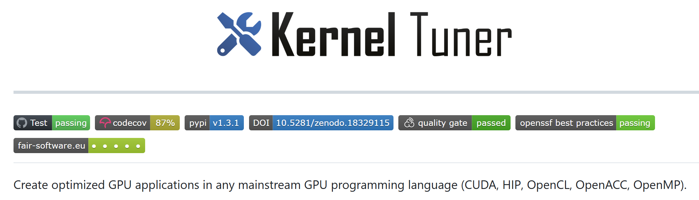
<figcaption>
Figure 13. Badge examples in a GitHub repository.
</figcaption>
</figure>

The three assessment examples below illustrate this general procedural approach through representative resource types. In the text below, ECHOES refers to the governance body overseeing cloud assessment activities, with the understanding that this role will progressively be assumed by the legal entity established through ECHOES as the ECCCH governance framework matures.

| **The following examples are illustrative.** The procedures described below are examples of how the framework may operate for representative resource types. They are intended to clarify the conceptual basis of the approach, not to define the final procedure for every resource category. |
|----|

#### Example 1: assessment of a software codebase

A first example concerns an open-source software application contributed to the ECCCH by an external provider. Assume that the application already satisfies the basic interoperability requirements needed for integration, such as API conformance and authentication alignment. In this case, the CAF may focus on quality dimensions that go beyond these baseline conditions, for example maintainability, documentation quality, and open-source good practices.

In such a case, ECHOES could recommend a small set of command-line tools and checklists that the provider runs in its own repository. For example, the provider could execute static-analysis tools to generate indicators related to maintainability and code quality, together with a checklist-based tool such as the OpenSSF Best Practices Badge or an ECCCH-defined equivalent. The assessment workflow could be integrated into GitHub Actions so that it runs automatically on release branches or tagged versions. The resulting structured output file would include, for example, code complexity metrics, test coverage summaries, presence of a license, evidence of contribution guidelines, issue-tracking configuration, and documentation-related indicators.

The provider would then share this output with ECHOES, together with a short contextual note explaining aspects such as the scope of the assessment, the version assessed, and any justified exceptions. ECHOES would review the results primarily to verify that the agreed self-assessment procedure has been executed and that the outputs are complete and interpretable. The resulting information could then be used by ECHOES both to compute indicators for software quality monitoring and to identify recurring quality issues across software resources, improve guidance to providers, and, where relevant, provide targeted feedback to the application provider.

#### Example 2: assessment of knowledge graph data

A second example concerns a metadata or knowledge graph resource contributed by a sister project or another external provider, especially where the resource includes automatically generated or semi-automatically generated *enrichments*. Assume that the resource has already passed the relevant gate-level integration and interoperability checks defined in D6.2. The next question is not whether the data can technically be ingested, but whether the provider is systematically assessing the quality of the enrichments and documenting the resulting evidence.

In this case, ECHOES could recommend a self-assessment package combining automated checks with a lightweight sampling-based review methodology. The automated part could include tools for structural consistency, interlinking quality, multilingual labeling coverage, completeness, or selected FAIR-related aspects. In parallel, the provider could be asked to conduct a small-scale sampled review of enrichment outputs, especially for dimensions that are difficult to assess through automation alone. This review could be documented through a structured template inspired by approaches such as Europeana’s enrichment-validation methodology (Isaac, 2024), including information on the goal of the enrichment, the datasets involved, the sampling rationale, the types of issues observed, and the qualitative or quantitative results of the review.

The resulting package shared with ECHOES could therefore include both machine-generated outputs and a short, structured report describing the enrichment context and the sampled review. ECHOES would process and review this material to verify that the provider has actually carried out the recommended quality self-assessment and documented it in a sufficiently transparent way. The evidence collected could then support the computation of indicators related to metadata and enrichment quality across datasets, while also helping ECHOES identify common enrichment issues, and improve recommendations for resource providers. This process could optionally be reflected through an ECCCH badge.

#### Example 3: usability evaluation in a Pilot Project

A third example concerns a tool or application contributed by a sister project and evaluated through a Pilot Project involving representative users. In this case, the focus is on usability and interaction quality, which go beyond technical interoperability and require direct user-based feedback. ECHOES could recommend a minimal shared set of standardized questionnaires for this purpose, for example, combining the System Usability Scale (SUS) for overall perceived usability with the Single Ease Question (SEQ) for task-level ease. The SUS is a widely used 10-item questionnaire with five response options, while the SEQ question is commonly used as a post-task rating of perceived ease.

Under this model, the sister project would conduct the usability study as part of the pilot, administering the common questionnaires alongside any additional project-specific questions. The structured output shared with ECHOES would include, at a minimum, the wording of each question, its response scale, the interpretation of the scale endpoints, the number and profile of participants, the task definitions, summary statistics for the common measures, and the most relevant findings of the study. For example, the report could state explicitly that SUS items were collected on a five-point agreement scale and that SEQ responses were collected immediately after each task on a seven-point ease scale, to enable automation and scalability in processing these outputs.

The purpose of the ECCCH review would again not be to certify that the tool has achieved a fixed usability threshold, but to verify that the study was carried out using the agreed shared instruments and that the results were reported in a structured and interpretable way. This would allow ECHOES to compare findings across pilots, compute indicators related to usability and task ease, identify recurring usability problems across tools, and provide feedback to the community on common patterns and good practices. If the reported user ratings are consistently poor, ECHOES may ask the resource provider to define and implement remedial actions and, after the relevant improvements have been introduced, to repeat the evaluation to document whether usability has improved.

#### General remarks on review procedures

These procedure examples are illustrative. The exact tools, output formats, reporting templates, and derived indicators will need to be defined progressively in later stages of WP9 and documented in the companion wiki. The key principle, however, remains the same: quality dimensions that go beyond mandatory integration requirements should be supported by a structured self-assessment process executed by resource providers, followed by a quality review by ECHOES based on the evidence shared.

The evidence produced through these procedures should not remain only in the provider’s own environment. Where appropriate, selected quality data, structured outputs, review outcomes, and links to supporting evidence should also be persisted or referenced within the ECHOES context, for example in an ECHOES repository of services and resources, the ECCCH Knowledge Base, the CAF wiki, or a similar shared location. In the software example, this could include information such as code analysis outputs, test coverage summaries, licensing status, documentation availability, release status, open-source good-practice checks, and links to the corresponding public repository, workflow run, badge, or assessment report. Sensitive technical details, especially those related to security, operational logs, or vulnerabilities, should remain subject to appropriate confidentiality and security constraints.

This model also fits well with the principles of the framework (Section [4.6](#ethical-and-guiding-principles-of-the-caf)). It supports effort proportionality, since providers generate evidence in their own environments using lightweight and reusable tools. It supports transparency, since the review is based on explicit outputs and documented procedures. It also supports continuous improvement, since the same procedures can be repeated over time and can gradually evolve into more mature forms of reporting, indicators, dashboards, community feedback, and ECCCH self-assessment badges across the ecosystem.

The active participation of the community will be essential for this evolution. In particular, sister projects, cascading-grant beneficiaries, and other external contributors should not be seen only as users of assessment procedures, but also as contributors to their refinement. Their feedback will be necessary to improve the recommended tools, reporting formats, questionnaires, workflow templates, and review procedures over time, ensuring that the CAF remains useful across the diversity of ECCCH resources.

| **Community feedback is part of the framework’s evolution.** Sister projects, cascading-grant beneficiaries, and other contributors are expected not only to use the framework, but also to help refine its tools, templates, reporting formats, and review procedures over time. |
|----|

#### Handling the risks of self-assessment

A self-assessment-based approach is necessary for reasons of feasibility, scalability and sustainability, but it also introduces some risks. These include variable quality of the information produced by different providers, optimistic self-reporting, uneven interpretation of dimensions and indicators, and limited comparability across providers and resource types. In addition, verifying that a self-assessment has been carried out is not the same as independently validating all quality claims. The framework therefore does not assume that self-assessment alone is sufficient. Rather, it seeks to make self-assessment more robust, comparable, and useful through a combination of standardization, review, triangulation, and proportionate follow-up.

A first safeguard is standardization. Wherever possible, ECHOES will recommend or provide shared assessment instruments, common reporting templates, and machine-readable output formats; as discussed in Section [7.1](#resources-of-the-caf), tools such as Data Contracts can facilitate such standardization. This is intended to reduce variability in how evidence is generated and documented, and to make results easier to compare across providers and over time. The use of agreed formats is especially important because it allows assessment outputs to be reused later for the derivation of indicators and, where appropriate, higher-level KPIs.

A second safeguard is that the quality review performed by ECHOES should not be limited to checking whether a self-assessment was submitted. It should also verify whether the agreed procedure was followed, whether the information provided is sufficiently complete and interpretable, and whether the reported results are internally coherent and plausible in relation to the resource and its context.

A third safeguard is triangulation. Where possible, provider-supplied information should be considered together with other available sources of information, such as usage metrics, service logs, pilot results, participant feedback, documentation review, or repeated assessments over time. This is particularly important where self-reported information alone would be difficult to interpret, or where the framework needs to reduce the risk of overly optimistic reporting.

Finally, the framework should apply a proportionate approach to follow-up. Not all self-assessment results require the same level of examination. Additional attention may be justified for strategically important resources, heavily used resources, recurring weaknesses, or cases in which the reported material raises specific questions. In this way, the framework seeks to balance feasibility with robustness, improving the comparability and trustworthiness of self-assessment without turning all quality review into a fully ECHOES-led validation process. The follow-up approach is discussed below.

### Follow-up and use of the assessment results

The CAF is primarily intended to support formative review, continuous improvement, and governance-informed prioritization, rather than to impose universal pass/fail quality thresholds beyond the gate-level requirements defined in D6.2 (Kowalska et al. 2026). Nevertheless, assessment findings are expected to inform subsequent actions, ensuring that the collected information is used to guide appropriate follow-up where needed.

In most cases, the primary outcome of the review will be feedback to the resource provider. Where the information provided is complete and the reported results do not indicate substantial weaknesses, the findings may simply be recorded and later used to derive indicators, examples of good practice, or broader ecosystem-level insights. Where weaknesses are identified, ECHOES may provide recommendations for improvement, request an improvement plan, invite the provider to repeat the assessment after changes have been introduced, or use the findings to guide further support and follow-up.

The response to identified should depend on their nature, persistence, and relevance to the resource category concerned. A single weak result in a context-dependent dimension may simply lead to feedback or recommendations, while persistent weaknesses, recurring issues across several assessments, or poor performance in core dimensions may justify a closer monitoring. In such cases, ECHOES may ask the provider to document planned improvements, repeat the relevant assessment after updates, or participate in additional follow-up activities, such as targeted usability testing, documentation review, or data-quality checks.

Assessment findings may also inform prioritization decisions within the ECCCH. For example, if repeated assessments reveal similar weaknesses across multiple resources, ECHOES may decide to prioritize the development of new supporting tools, shared templates, guidance, training materials, or community support actions. Likewise, where weak results concern resources that are heavily used, strategically important, or closely tied to core ECCCH services, the findings may justify closer monitoring or more active engagement.

It is important to distinguish this follow-up process from the handling of gate-level requirements. Where assessment findings indicate problems that concern baseline interoperability, legal, security, or onboarding conditions already governed through Deliverable D6.2 (Kowalska et al. 2026), those issues should be addressed through the corresponding processes and governance mechanisms. The role of the CAF in such cases is complementary: it can provide additional information and context, but it does not replace the baseline acceptance process defined elsewhere.

## Pilot-related workflows

### Introduction and notation

As introduced in Section [1.1](#purpose-of-the-cloud-assessment-framework), pilots are structured, context-specific evaluation activities in which selected ECCCH components are assessed under realistic conditions of use, involving representative users and clearly defined objectives, metrics, and protocols. Pilots led by ECHOES are referred to as *Pilot Tests*, while pilots led by other consortia, including cascading grant projects and sister projects, are referred to as *Pilot Projects*.

| **This section focuses on Pilot Tests.** Unless stated otherwise, the workflows described in this section refer primarily to Pilot Tests led by ECHOES. Pilot Projects led by sister projects or cascading-grant beneficiaries may use some of the same tools and templates, but they are not the main object of the operational workflows described here. |
|----|

This section describes the process that ECHOES will follow to launch and monitor Pilot Tests. As WP9 progresses, some of the supporting tools developed for this purpose, such as participant recruitment and matching participants to specific studies, may also be made available to cascading grant projects and sister projects for use in their own Pilot Projects.

It is important to note that for any external resource, whether originating from cascading grants, sister projects, or other contributors, its consideration within a Pilot Test is contingent on its integration status. Depending on the degree of integration required, the resource to be evaluated may first need to go through the integration process described in Deliverable D3.2 before it can be effectively assessed within the ECCCH environment.

This section uses Business Process Model and Notation (BPMN) 2.02 to model the workflow related to pilots. BPMN is a standardized graphical representation used to model processes. It provides a visual method to outline the flow of tasks and events in a process, making it easier for stakeholders to understand complex workflows. BPMN also represents the responsibility for each task.

In the context of the ECCCH, its inherent complexity implies that some tasks would need to be adjusted as the project evolves. BPMN 2.0 is relatively easy to edit and thus supports refinement iterations well, but at the same time it is powerful enough to model processes up to the point of enabling their execution via a process engine.

| **BPMN diagrams below are simplified process views.** The BPMN diagrams in this section are intended to clarify roles, tasks, and dependencies at a practical level. They are not meant to imply that every Pilot Test will follow an identical or fully rigid workflow. |
|----|

### Proposing, specifying and launching a Pilot Test 

The following sections sketch the process of launching a pilot (from the proposal of the pilot until participants provide feedback).

| **A Pilot Test can be triggered by different kinds of needs.** Pilot requests may originate from new ECHOES features/releases, external resources, Collaborative Research Scenarios, or newly identified evaluation gaps. What these cases have in common is not the source of the request, but the need for an evaluation activity under realistic conditions of use. |
|----|

#### Initiation: Pilot Test requests 

A Pilot Test request may be triggered by events, including but not limited to the following:

**New software releases / new software features within Echoes**

The ECHOES developer teams (WP6, WP7, WP8) will use agile methodologies to provide early versions of the different software elements of the cloud and will release new versions with short iteration cycles. The first type of event initiating a pilot request is thus the availability of a new set of features worth testing.

For example:

- New features in one of the Vertical Applications (including also major releases),

- New features or optimizations in the cloud components.

- New features affecting the knowledge base (new version of the query engine, updated ontology, new HDTs...).

When triggering a Pilot Test, the developer team is expected to provide a description of the new or updated features, together with any supporting material such as release notes, tutorials, videos, and any other information that might be relevant for its evaluation (e.g., stress tests for testing scalability).

<figure>
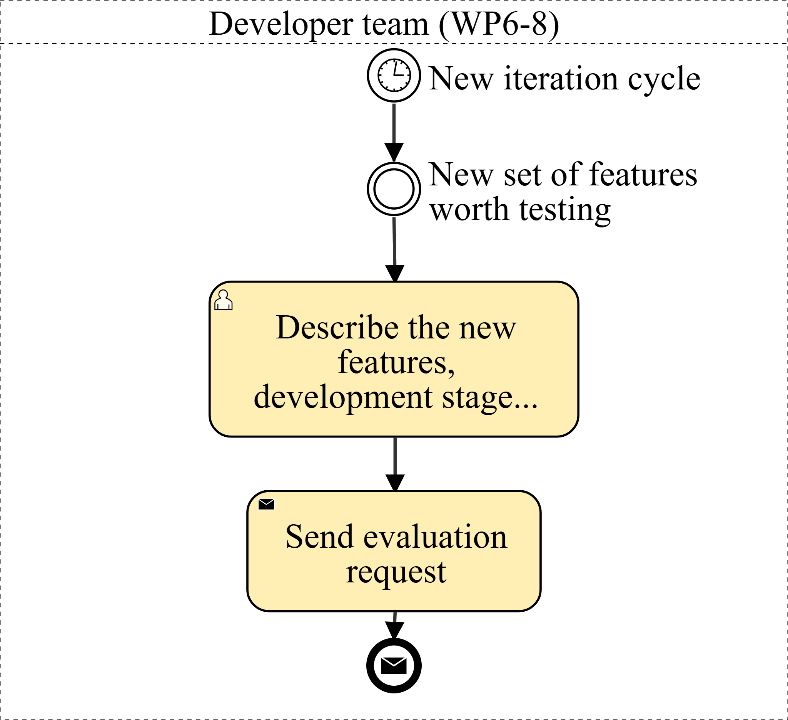
<figcaption>
Figure 14. Diagram showing an evaluation requested by the development teams.
</figcaption>
</figure>

**New resource from a cascading grant project**

It is reasonable to expect that some cascading grant projects may also introduce resources that motivate or enable a new Pilot Test. For example, a cascading project may produce new datasets, metadata, or knowledge graph resources that make it possible to evaluate aspects of the cloud not previously covered by the existing Vertical Applications, such as support for new data types or workflows.

In this case, the cascading grant project provides a resource to be evaluated or that facilitates the evaluation of other ECCCH resources, but the evaluation itself is conducted by ECHOES. This should be distinguished from cases in which the cascading grant project carries out part of the evaluation itself, for example by reporting on the ease with which a Heritage Digital Twin can be created, or data can be ingested. That latter case corresponds to a Pilot Project, not a Pilot Test, and is therefore outside the scope of this section.

As in the previous case, the cascading grant project is expected to provide a description of the resource to be evaluated, such as data, metadata, or related documentation. It should also provide any relevant information that may support the evaluation design, for example the preferred profile of target users, the intended use context, or specific aspects that should be prioritized in the assessment.

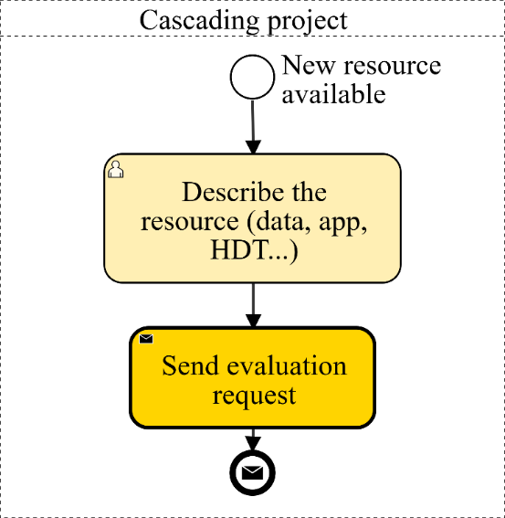

Figure 15. Diagram showing an evaluation requested by a cascading project.

**New resource from a sister project**

Although the relationship between ECHOES and sister projects is less direct than in the case of cascading grant projects, sister projects are also expected to provide resources that may require evaluation within the ECCCH context.

In the perspective considered here, the sister project acts as the provider of a resource to be evaluated, or of a resource that facilitates the evaluation of other ECCCH resources, while the evaluation itself is carried out by ECHOES. As in the previous cases, the sister project is expected to provide the resource together with the relevant information needed to support its evaluation, including documentation, intended use, and any considerations that may help define the assessment.

This should be distinguished from situations in which sister projects conduct their own evaluation activities on their own resources. Such activities correspond to Pilot Projects, not Pilot Tests, and therefore fall outside the scope of this section.

**New idea for a Collaborative Research Scenario**

As part of the broader evaluation of the ECCCH, WP3 will design, implement, and evaluate a set of Collaborative Research Scenarios (CRS). Due to their highly collaborative and multidisciplinary nature, these scenarios may require specific workflows and assessment instruments. They may also lead to the launch of Pilot Tests focused on particular ECCCH resources, services, or workflows involved in the scenario. In this context, CRS can act as a source of new pilot ideas, especially where they reveal specific evaluation needs that can be addressed through more focused pilot activities.

<figure>
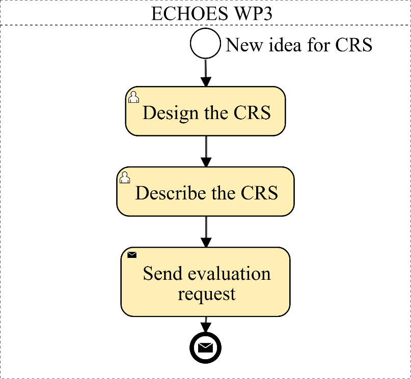
<figcaption>
Figure 16. Diagram showing the workflow for pilots linked to CRS.
</figcaption>
</figure>

**New pilot idea from WP3/WP4**

Finally, the process also accommodates Pilot Tests proposed by WP3 and WP4. During the project, it may become apparent that certain communities, professional profiles, or use cases have been underrepresented in previous evaluations, or that some ECCCH features are easily understood by some user groups but create significant barriers for others. In such cases, WP3 or WP4 may request the initiation of a Pilot Test to specifically assess these gaps. Such Pilot Tests may focus on validating the accessibility, usability, and relevance of selected ECCCH resources, services, or workflows for the targeted user groups. This enables the evaluation framework to address identified gaps in a timely and targeted manner and to generate evidence for improving the inclusiveness and effectiveness of the platform.

<figure>
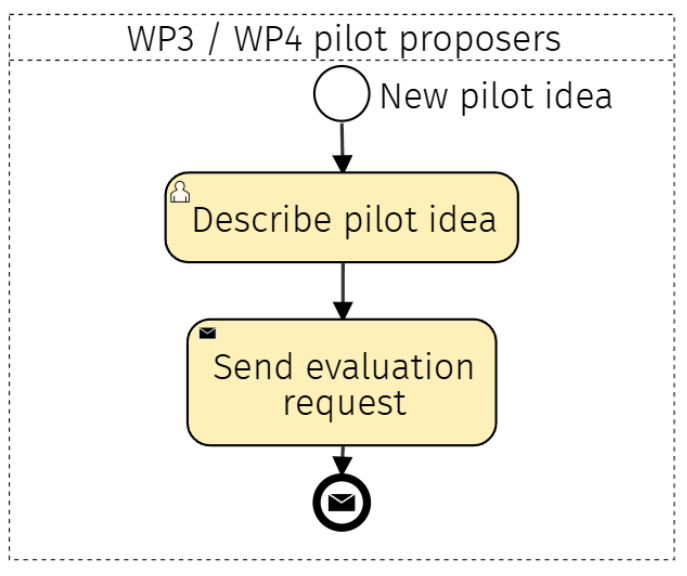
<figcaption>
Figure 17. Diagram showing the workflow for pilots requested by WP3/WP4.
</figcaption>
</figure>

#### Pilot Test specification 

A clear and complete Pilot Test specification is essential for the successful evaluation of the cloud. One of the objectives of the CAF is to provide tools and templates that facilitate and streamline the consistent specification of Pilot Tests.

| **A pilot specification is an evaluation design document.** The pilot specification is not only a description of the resource to be tested. It must also define the objectives, scope, target users, methods, tasks, data to be collected, and ethical considerations needed to conduct the evaluation in a consistent way. |
|----|

The task of turning an initial pilot idea into a full specification is the responsibility of the Pilot Specifier. In most cases, this role will be assumed by the same person or institution that proposed the pilot. However, this role will receive support from ECHOES. Pilot Tests evaluating resources developed within ECHOES will be supported by the WP9 team, while Pilot Tests linked to the evaluation of integration units, as defined in Deliverable D3.2, will be supported by the ECHOES Integration Task Force (EITF).

The pilot specification must include all information necessary to design and conduct the associated evaluation activity. In many cases, this will involve a user study in which CH stakeholders interact with a specific ECCCH resource and provide feedback under defined conditions. The specification should include, at a minimum, the following elements:

**Pilot definition**

- Objectives of the pilot, for example testing new image annotation features in a Vertical Application.

- Scope of the pilot, including the exact features or resources to be evaluated.

- Use cases, describing the context, scenarios, and data to be used in the evaluation, for example a specific Heritage Digital Twin.

- Development stage or maturity level of the resource, such as alpha or beta.

**Target participants**

- Profile, such as conservators, curators, researchers, or developers.

- Affiliation, depending on the development stage, for example internal to ECHOES for early versions.

- Recruitment criteria and recommendations, such as geographic area, age range, background, and minimum/maximum number of participants.

**Evaluation design**

- Evaluation dimensions to be assessed, such as functionality, usability, security, or performance.

- Evaluation methods to be used, such as analytics, user metrics, supervised user testing, surveys, questionnaires, heuristic evaluation, expert reviews, or field studies.

- Specific content associated with those methods, such as the actual questionnaires or interview guides.

- Additional aspects of the study design, such as within subject or between subject design, or the inclusion of control groups.

- Tasks and procedures to be carried out by participants during the evaluation.

- Timeline of the pilot, including milestones and duration.

**Ethical, legal and privacy considerations**

- Data to be collected about participants during the evaluation, including any additional demographic or profile information not already available through general cloud registration.

- Ethical considerations relevant to the pilot.

- Information relevant to informed consent procedures.

- Disclosure of any use of AI models within the evaluated resource or the evaluation process.

A complete pilot specification may require a substantial amount of information. Through appropriate templates and supporting tools, WP9 aims to make this process significantly easier, more consistent, and more scalable across different types of Pilot Tests.

#### Final preparation before Pilot Test launch 

Once the Pilot Test specification has been completed, several additional steps are required before the pilot can be launched:

- Determine whether the Pilot Test requires review or approval by the relevant Ethics Committee, particularly in cases involving user studies or the collection of participant data. A new ethics review may not be necessary when the Pilot Test reproduces a previously approved study without substantial methodological changes.

- If the Ethics Committee provides recommendations or conditions, for example regarding bias mitigation, inclusivity, or data collection practices, the pilot specification may need to be revised accordingly before launching.

- If the Pilot Test requires, or would clearly benefit from, capacity building support, a request should be sent to WP5 so that appropriate training materials or support actions can be prepared.

<figure>
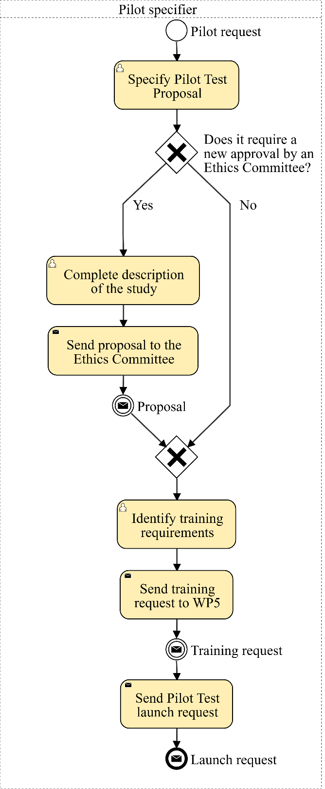
<figcaption>
Figure 18. Diagram showing the tasks of the Pilot Specifier.
</figcaption>
</figure>

These steps conclude the main responsibilities of the Pilot Specifier in preparing the launch of the Pilot Test, although the Pilot Specifier may continue to supervise or support the evaluation activities during later stages.

#### Tasks coordinated by WP9 before Pilot Test launch

Even once the pilot specification is complete, additional preparatory tasks may still be required before participants can be enrolled, and the Pilot Test can start. These tasks fall within the operational support provided by WP9 through the CAF.

These tasks might include:

- Creating support channels for participants, such as a mailing list, help desk contact point, or other coordination channel.

- Preparing the tools and environments required for the Pilot Test. In some cases, this may require a dedicated test environment so that actions performed during the Pilot Test do not affect production systems, databases, or knowledge graph content. For example, changes introduced during a Pilot Test may need to be isolated from the production Knowledge Base or discarded once the evaluation is completed.

- Setting up participant accounts and access rights where needed.

- Configuring any additional instrumentation required for the evaluation, depending on the aspect under assessment. For example, usability studies may require logging user interactions, while performance-related pilots may require the activation of specific monitoring or analytics mechanisms.

These tasks are essential to ensure that Pilot Tests can be conducted in a controlled and safe way.

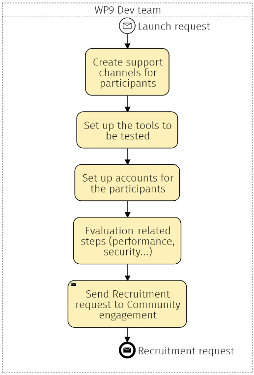

Figure 19. Workflow for the WP9 technical team.

#### Participant recruitment 

Once the preparatory steps have been completed, participants can be recruited and engaged, primarily through WP4, and where appropriate through dissemination channels supported by WP2. Umbrella Cultural Heritage organizations participating in the project are expected to play a particularly important role in mobilizing representative users for evaluation activities.

At the end of this process, selected participants receive the necessary invitation link, access details, information and consent form, and onboarding instructions required to begin the evaluation.

#### Summary 

[Figure 20](#_Ref229740647) illustrates how different actors collaborate in the proposal, specification, and launch of a Pilot Test.

<figure>
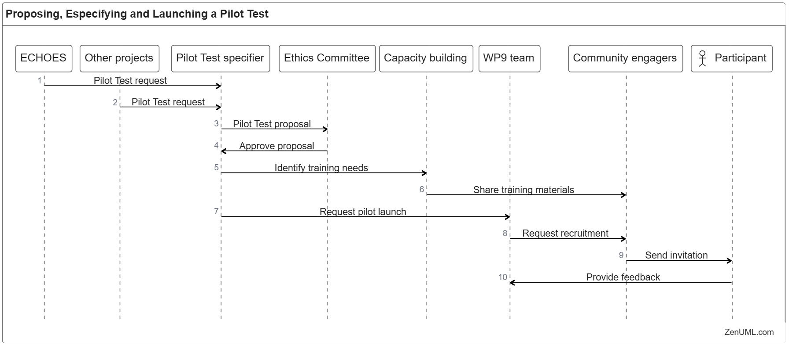
<figcaption>
Figure 20. Collaboration between different actors when launching a pilot.
</figcaption>
</figure>

### Pilot Test monitoring 

Monitoring Pilot Tests is also an important aspect of the CAF. Monitoring is needed not only to capture technical and user-related evidence, but also to follow the operational progress of each pilot and ensure that evaluation activities are completed as planned.

| **Pilot monitoring is broader than technical monitoring.** Monitoring a Pilot Test includes not only service telemetry, but also participant progress, completion status, and user feedback. These different forms of evidence are complementary and are all needed to interpret pilot results correctly. |
|----|

During any Pilot Test or Pilot Project, progress must be monitored so that feedback can be incorporated into subsequent development iterations. This includes technical indicators, participant progress indicators, and user-provided feedback about the evaluated services. Technical monitoring collects telemetry that feeds a set of KPIs describing the health, performance, and usability of the service. These KPIs may include:

- **Latency**: The time elapsed between a request and the response.

- **Error rates**: The proportion of requests that fail, such as HTTP 5xx responses or validation errors, out of total requests.

- **Throughput**: The number of successful operations or transactions the system can handle per unit of time.

- **Resource utilization**: The percentage of CPU, memory, storage, and network capacity being consumed by the service.

- **Security events**: Detected incidents such as authentication failures, unauthorized access attempts, or vulnerability exploits.

Adverse events can be automatically detected and reported when these KPIs are coupled with threshold-based alerting. This helps ensure service availability, since the relevant personnel can be informed in a timely manner and critical issues can be escalated when necessary. These metrics can be presented to the relevant stakeholders through live dashboards, allowing the status of the pilot to be easily monitored. KPI data should be stored at least for the duration of the pilot so that trends and changes over time can be analyzed. Where appropriate, data collected in one pilot may also be compared with data from future pilots.

In addition to technical monitoring, the operational progress of participants must also be tracked. This includes monitoring which participants have agreed to take part in the pilot, whether they have completed any required onboarding steps, when they begin using the evaluated tools or services, and whether they complete the planned tasks or reach the end of the evaluation process. These indicators are important both for practical coordination and for interpreting evaluation results correctly, since incomplete participation, drop off, or delays may affect the validity and representativeness of the findings.

User feedback is a cornerstone of any pilot because it reveals how the service is perceived and used in real world conditions. By listening to the experiences, expectations, and pain points of the people who will ultimately rely on the system, project teams can identify usability shortcomings, gaps in functionality, and mismatches between the service design and the cultural heritage workflows it is intended to support. This early insight enables the consortium to prioritize corrective actions, refine interaction models, and adjust the product roadmap before the solution is scaled to a wider audience. Moreover, systematic collection of user observations fosters a shared understanding among technical developers, domain experts, and policy makers, helping ensure that the evolving service remains aligned with the values, accessibility requirements, and operational realities of the Cultural Heritage community. In short, use-centered evidence gathered during the pilot supports continuous improvement, reduces the risk of costly rework later, and helps build the trust needed for successful long-term adoption.

### Synthesis and reuse of pilot findings

The findings generated through pilots should be captured and reused in a standardized and comparable way wherever possible. This requires not only continuous monitoring during the pilot, but also a consistent approach to documenting results, limitations, and follow-up actions after the pilot has been completed.

For this reason, each Pilot Test should produce a standardized pilot result package. This should include the metadata elements established in Pilot Test specification phase (see Section [8.2.2](#pilot-test-specification)) such as the evaluated resource or feature, the objectives of the pilot, the dimensions assessed, the participant profile, the recruitment strategy, the sample size, the methods and instruments used, and the main findings. It should also include the most relevant quantitative outputs, a concise synthesis of qualitative findings, and a record of the main limitations or potential sources of bias affecting interpretation. This package supports both the review of individual pilots and the reuse of pilot results across the framework.

Comparability across pilots should be sought where it is methodologically justified, but not assumed universally. Meaningful comparison is most likely when pilots concern similar resource categories, shared evaluation dimensions, common instruments, or comparable participant and task profiles. In other cases, pilot findings may still be highly valuable but should be synthesized qualitatively or interpreted within their own context rather than treated as directly comparable with all other pilots. In this sense, pilots should contribute not only scores or measurements, but also contextual information.

The issue of representativeness should also be handled explicitly. Not all Pilot Tests will aim at statistical representativeness, and in many cases this would not be realistic or methodologically appropriate. However, each pilot should document the sampling method used, whether it is intended to be representative, expert-based, convenience-based, or otherwise constrained by the context of the study. This is necessary so that the findings can later be interpreted correctly and so that biases or limitations in participation are not overlooked.

Bias should likewise be addressed explicitly in pilot reporting. This may include, depending on the pilot, recruitment bias, imbalance in participant profiles, incomplete participation, learning effects, prior familiarity with the evaluated tools, or contextual factors affecting how results should be interpreted. The aim is not to eliminate all sources of bias in every pilot, but to document them transparently and, where possible, mitigate them through the design of the study and the interpretation of results.

Finally, pilot results should feed both resource-level improvement and ecosystem-level monitoring. At the level of the individual resource, pilot findings should support feedback, improvement actions, repeated assessment where appropriate, and refinement of the resource itself. At ecosystem level, pilot results should contribute to the identification of recurring strengths and weaknesses, the refinement of assessment procedures and tools, and, where justified, the derivation of indicators and higher-level KPIs. In this way, Pilot Tests can function as a key element for the continuous improvement and strategic monitoring of the ECCCH.

## Conclusions

This deliverable establishes the conceptual foundations of the CAF for the continuous evaluation of the ECCCH. Given the diversity and complexity of the ecosystem, evaluation cannot rely on a single method or on a limited set of indicators. Instead, the framework adopts a structured approach based on resource categories, evaluation dimensions, assessment instruments, and pilot-oriented procedures that together support the continuous improvement of the cloud.

| **Living framework.** The CAF is intended to evolve progressively as the ECCCH ecosystem matures, as new resource types and services emerge, and as ECHOES and the wider community gain experience through pilots, monitoring, and assessment activities. |
|----|

A key outcome of this deliverable is the initial definition of the main building blocks of the CAF itself. These include, first, monitoring and evaluation components such as catalogs of ECCCH resources and resource categories, catalogs of evaluation criteria, tools, and indicators, a shared and evolving project-wide KPI catalog, reusable resources for data collection methods, ECHOES-developed or adapted assessment tools, and analysis, visualization, and reporting tools. Second, the framework will include pilot-related resources such as workflows, guidelines, templates, pilot catalogs, usability support materials, monitoring and reporting tools, participant support mechanisms, and coordination channels with developers and domain experts. Third, it will include ethics-related resources such as definitions of passive and active user data to be collected, informed consent templates, evaluation protocols, and resources to support ethics review of pilot activities.

Because of its broad scope, the CAF is closely connected with most ECHOES Work Packages. Its implementation will depend on strong coordination across integration, interoperability, engagement, training, infrastructure, applications, ethics, and sustainability activities. This interdependence is not a limitation, but a necessary condition for ensuring that evaluation is embedded throughout the ECCCH lifecycle and across its technical, organizational, and community dimensions.

This deliverable is only a first step in an iterative process. At this stage, it defines the conceptual structure of the framework and outlines its main future components, while the precise indicators, data collection procedures, KPI definitions, operational workflows, and supporting tools will be further developed in subsequent tasks and deliverables in collaboration with other WPs and the broader ECCCH community. In this sense, the framework should be understood as a living structure that will progressively mature as the cloud evolves and as evaluation practices become more established.

1.  Objectives linked to the ECCCH

Due to their impact and relationship with indicators and KPIs, the following sections briefly review the strategic and specific objectives of ECHOES and related initiatives.

2.  ECHOES Specific Objectives

The ECHOES D1.3 Quality and Risk Management Plan (Rodier, Gadoin and Sampaio, 2025) refers to the following list of specific objectives for the ECHOES project:

1.  ECHOES-SO1: Develop Open-Source Infrastructure

2.  ECHOES-SO2: Establish a Sustainable Legal Entity

3.  ECHOES-SO3: Build a Community of Stakeholders

4.  ECHOES-SO4: Integrate Results of Past and Current Initiatives

5.  ECHOES-SO5: Foster Innovative Knowledge Co-Creation

Although some of these objectives refer mainly to the ECHOES project (SO1, SO2), others apply or can be easily adapted to apply to the ECCCH (SO3-SO5).

3.  ESFRI WG Objectives for Research Infrastructures

The ESFRI Working Group (European Strategy Forum on Research Infrastructures, 2019) identified the following nine objectives for RIs:

- ESFRI-SO1: Enabling scientific excellence

- ESFRI-SO2: Delivery of education and training

- ESFRI-SO3: Enhancing transnational collaboration in Europe

- ESFRI-SO4: Facilitating economic activity

- ESFRI-SO5: Outreach to the public

- ESFRI-SO6: Optimizing data use

- ESFRI-SO7: Provision of scientific advice

- ESFRI-SO8: Facilitating International co-operation

- ESFRI-SO9: Optimizing management

All these objectives apply largely to the ECCCH in the case of SO1-SO6, and to a partial extent in the case of SO7-SO9.

4.  KPIs and indicators linked to ECCCH

5.  KPIs listed in ECHOES deliverables

    KPIs linked to ECHOES Quality Plan (D1.3)

The ECHOES D1.3 Quality and Risk Management Plan (Rodier, Gadoin and Sampaio, 2025) defines the following list of KPIs, designed to measure the progress ECHOES deliverables:

**KPI 1.1 Data Quality and Monitoring**

Description: The Data Management Plan (DMP) is published and implemented correctly by all partners.

Target: DMP published by Month 6; annual compliance monitored.

Strategic objective linked: SO1: Develop Open-Source Infrastructure.

**KPI 1.2 Single Entry Point (SEP)**

Description: The SEP is functional and adopted by cultural heritage communities.

Target: Annual increase in access after launch.

Strategic objective linked: SO1: Develop Open-Source Infrastructure.

**KPI 1.3 Heritage Digital Twin (HDT) Availability**

Description: Number of HDTs accessible through the platform.

Target: \>5,000 HDTs available by Month 60.

Strategic objective linked: SO1: Develop Open-Source Infrastructure.

**KPI 1.4 HDT Quality**

Description: Number of HDTs processed by tools on the platform.

Target: \>2,000 HDTs processed by Month 60.

Strategic objective linked: SO1: Develop Open-Source Infrastructure.

**KPI 1.5 Vertical Applications (VAs) Availability**

Description: Number of VAs available online for stakeholders.

Target: Accessible VAs by Month 48.

Strategic objective linked: SO1: Develop Open-Source Infrastructure.

**KPI 1.6 Software Tools**

Description: Number of interoperable software tools accessible via the platform.

Target: Target: \>20 tools available by Month 48.

Strategic objective linked: SO1: Develop Open-Source Infrastructure.

**KPI 1.7 Cloud Performance Monitoring**

Description: Operational monitoring tools for cloud components.

Target: Target: Fully functional tools by Month 48.

Strategic objective linked: SO1: Develop Open-Source Infrastructure.

**KPI 2.1 Founding Members**

Description: Number of founding members for the legal entity.

Target: \>20 members.

Strategic objective linked: SO2: Establish a Sustainable Legal Entity.

**KPI 2.2 Geographical Balance**

Description: Representation of founding members from diverse regions.

Target: Members from \>10 countries.

Strategic objective linked: SO2: Establish a Sustainable Legal Entity.

**KPI 2.3 Community Engagement**

Description: Number of umbrella organizations involved.

Target: \>15 umbrella organizations.

Strategic objective linked: SO2: Establish a Sustainable Legal Entity.

**KPI 2.4 Financial Viability**

Description: Financial contributions for long-term sustainability secured.

Target: Sustainable budget by Month 60.

Strategic objective linked: SO2: Establish a Sustainable Legal Entity.

**KPI 3.1 Inclusion of Pan-European Stakeholders**

Description: Number of engaged institutions and individuals.

Target: \>500 stakeholders.

Strategic objective linked: SO3: Build a Community of Stakeholders.

**KPI 3.2 ECCCH Dissemination Strategy**

Description: Number of visits to the project website and campaign reach.

Target: \>60,000 visits annually.

Strategic objective linked: SO3: Build a Community of Stakeholders.

**KPI 3.3 Training and Capacity Building**

Description: Number of training sessions and participants.

Target: \>10 sessions with \>200 participants.

Strategic objective linked: SO3: Build a Community of Stakeholders.

**KPI 3.4 Cascading Grants**

Description: Diversity of cultural heritage stakeholders receiving funding.

Target: At least 45 projects funded.

Strategic objective linked: SO3: Build a Community of Stakeholders.

**KPI 4.1 Inventory and Gap Analysis**

Description: Number of initiatives mapped and integrated.

Target: \>50 initiatives.

Strategic objective linked: SO4: Integrate Results of Past and Current Initiatives.

**KPI 4.2 Synergy Creation**

Description: Number of collaborative projects launched through integration.

Target: \>10 joint projects.

Strategic objective linked: SO4: Integrate Results of Past and Current Initiatives.

**KPI 4.3 Coordination and Networking**

Description: Engagement with ECCCH-funded projects and initiatives.

Target: 90% participation in general meetings.

Strategic objective linked: SO4: Integrate Results of Past and Current Initiatives.

**KPI 5.1 Multidisciplinary Collaboration**

Description: Number of collaborative scientific publications and outputs.

Target: \>50 peer-reviewed articles.

Strategic objective linked: SO5: Foster Innovative Knowledge Co-Creation.

**KPI 5.2 Data Reuse and Enrichment**

Description: Increase in the reuse and enrichment of data.

Target: Measured through platform analytics and user feedback.

Strategic objective linked: SO5: Foster Innovative Knowledge Co-Creation.

**KPI 5.3 Inclusivity**

Description: Number of projects addressing diversity and socio-cultural challenges.

Target: \>10 community-based projects.

Strategic objective linked: SO5: Foster Innovative Knowledge Co-Creation.

**KPI 5.4 Metadata Enhancement**

Description: Improvement in metadata quality and accessibility.

Target: Increased access and reuse by stakeholders.

Strategic objective linked: SO5: Foster Innovative Knowledge Co-Creation.

KPIs for monitoring communication

The ECHOES D2.2 Communication and Dissemination Plan (Niccolucci et al., 2024) lists the following list of KPIs for monitoring outreach (notice that monitoring in the context of WP2 refers to the activities and outputs of ECHOES and not the Cultural Heritage Cloud):

- Total number of website visitors

- Total number of page views

- Total number of referrals

- No. videos visualizations

- Number of Social media followers (X/Twitter, LinkedIn, Facebook, Instagram)

- Number of LinkedIn impressions

- Number of Facebook impressions

- Number of X/Twitter impressions

- Number of Instagram impressions

- Number of newsletter subscribers

- Number of scientific papers

- Number of views of ECHOES technical reports and deliverables

- Number of downloads of ECHOES technical reports and deliverables

- Number of events organized by the Cultural Heritage Cloud network (hands-on sessions, workshops, community events, webinars, open days)

- Number of people reached through the events organized by the project

- Number of ECHOES presentations at third party events (major conferences, international networks)

- Number of people reached through the participation at third party events

Besides these general outreach indicators, D2.2 also lists some potential indicators for each of the target groups:

**Target group 1 (Engaging Cultural Heritage professionals)**

- Number of GLAMs attending webinars or workshops

- Satisfaction scores from GLAM participants in outreach events

- Number of GLAMs who accessed to Cascading Grants

- Number of interdisciplinary projects facilitated by the Cloud

- Volume of published research utilizing ECHOES tools and datasets

**Target group 2 (Engaging Cultural and Creative Industries)**

- Attendance at workshops and CCI-focused events

- Number of co-creation projects between CCIs and GLAMs

- Number of CCIs who accessed to Cascading Grants

- Number of CCIs accessing Cloud datasets or tools

**Target group 3 (Engaging Software Development and Service Companies)**

- Number of software companies participating in workshops, hackathons, and grants

- Volume of APIs, tools, or services developed and integrated into the Cloud

**Target group 4 (Engaging Open Science Digital Communities)**

- Number of participants in open science events

- Volume of open-access publications and resources generated

- Engagement metrics on collaborative platforms (e.g., GitHub)

**Target group 5 (Engaging Decision Makers)**

- Number of policy briefs and reports disseminated

- Attendance and feedback from policymakers at ECHOES events

**Target group 6 (Engaging other projects and initiatives at European and national level)**

- Number of collaborative events and joint publications

- Partnerships formalized through Memoranda of Understanding (MoUs)

- Increased visibility of ECHOES through partner networks

**Target group 7 (Engaging Educators and Students)**

- Number of educators trained through workshops and webinars

- Volume of educational materials developed and distributed

**Target group 8 (Engaging Non-Professional Participants)**

- Attendance at community-based events and workshops

- Growth in social media followers and engagement metrics

  KPIs for monitoring project impact

The ECHOES D2.2 Communication and Dissemination Plan (Niccolucci et al., 2024) also foresees some indicators about the impact of the project. These include usage rates and user satisfaction scores related to the tools developed in ECHOES that provide access to the Cultural Heritage Cloud, such as:

- Number of users accessing the Cloud datasets or tools,

- Number of users adopting ECHOES tools in their daily practice,

- Feedback scores on the relevance and usefulness of tools and resources provided,

- Number of projects who accessed to cascading Grants,

- Volume of new tools or services developed and integrated into the Cloud.

6.  KPIs and indicators from ESFRI

The ESFRI Working Group (European Strategy Forum on Research Infrastructures, 2019) describes 21 KPIs *quantitative indicators* linked to the objectives listed in Annex [A.2](#_Ref223864157):

1.  Number of user requests for access; Linked objective: Enabling scientific excellence

2.  Number of users served; Linked objective: Enabling scientific excellence

3.  Number of publications; Linked objective: Enabling scientific excellence

4.  Percentage of top (10%) cited publications; Linked objective: Enabling scientific excellence

5.  Number of master and PhD students using the RI; Linked objective: Delivery of education and training

6.  Training of people who are not RI staff; Linked objective: Delivery of education and training

7.  Number of members of the RI from ESFRI countries; Linked objective: Enhancing collaboration in Europe

8.  Share of users and publications per ESFRI member country; Linked objective: Enhancing collaboration in Europe

9.  Share of users associated with industry and publications with industry; Linked objective: Facilitating economic activities

10. Income from commercial activities and the number of entities paying for service; Linked objective: Facilitating economic activities

11. Engagement achieved by direct contact; Linked objective: Outreach to the public

12. Outreach through media; Linked objective: Outreach to the public

13. Outreach via the RI’s own web and social media; Linked objective: Outreach to the public

14. Number of publicly available data sets used externally; Linked objective: Optimizing data use

15. Participation by RIs in policy related activities; Linked objective: Provision of scientific advice

16. Citations in policy related publications; Linked objective: Provision of scientific advice

17. Share of users and publications per non-ESFRI member country; Linked objective: Facilitating international cooperation

18. International trainees; Linked objective: Facilitating international cooperation

19. Number of members of the RI from non-ESFRI countries; Linked objective: Facilitating international cooperation

20. Revenues; Linked objective: Optimizing management

21. Extent of resources made available; Linked objective: Optimizing management

In addition to the quantitative indicators above, the ESFRI WG also proposes qualitative indicators for the RIs. While the RIs are invited to develop these indicators, some examples are provided in the document (European Strategy Forum on Research Infrastructures, 2019).

7.  Indicators for Research Data

The EOSC's Open Science Monitor specifications (Papastefanatos et al., 2018) provide a comprehensive list of indicators for different Open Science resources. Considering ECCCH scope, we summarize below the monitoring targets, subtargets, and candidate indicators for two core areas:

1.  Openness of research data and data repositories, and

2.  FAIRness of research data and data repositories.

**Openness** concerns the legal, organizational, and practical conditions under which research outputs can be accessed, shared, redistributed, and reused.

**FAIRness** concerns the extent to which those outputs are Findable, Accessible, Interoperable, and Reusable for both humans and machines.

8.  Openness of research data and data repositories

The target of openness of research data and data repositories measures the degree to which research data are made available under transparent, understandable, and sufficiently permissive conditions for access and reuse. It addresses both the openness of the datasets themselves and the openness of the surrounding repository environment.

The main subtargets under this target are:

- Transparency of licensing and terms of use

- Downstream reuse and redistribution permissions

- Openness of access conditions

- Visibility of contact and clarification mechanisms

- Financial support conditions for open data sharing

Candidate indicators for this target include whether:

- the applicable data use terms are clearly documented

- the license or terms of use are easy to locate

- the terms are understandable to intended users

- the terms enable reuse, redistribution, and derivative use without unnecessary negotiation

- standard open licenses are used

- a contact point exists for clarification of reuse conditions

- downstream implications or flow-through restrictions are made explicit

- links to the original license terms are provided where relevant

- authorization requirements for redistribution are clearly stated

- data are available free of charge

- data are available under an open license

- countries or funders recommend or require open data licenses

- funders cover the costs associated with data sharing or storage

- the types of eligible costs are specified

- such costs are included in grant applications

- the duration of funder support for data sharing and storage is defined

9.  FAIRness of research data and data repositories

The target of FAIRness of research data and data repositories measures the degree to which research data conforms to the four FAIR dimensions: Findability, Accessibility, Interoperability, and Reusability. The assessment should consider both the properties of the data objects and the capabilities of the repositories through which they are exposed.

Under **Findability**, the main subtargets are:

- globally unique and persistent identifiers

- rich and machine-readable metadata

- explicit linkage between metadata and the resource

- indexing in searchable resources

Under **Accessibility**, the main subtargets are:

- open and standardized retrieval protocols

- transparent authorization and authentication procedures where needed

- availability of machine-actionable access mechanisms

- persistence of metadata over time

Under **Interoperability**, the main subtargets are:

- use of standardized and machine-readable formats

- use of shared vocabularies, ontologies, and exchange standards

- presence of explicit schemas or data models

- technical readiness for data exchange and integration

Under **Reusability**, the main subtargets are:

- clear and accessible usage licenses

- provenance documentation

- contextual metadata supporting interpretation

- compliance with community or disciplinary standards

Candidate indicators for **Findability** include:

- existence of globally unique identifiers

- evidence of identifier persistence

- presence of machine-readable metadata

- inclusion of the resource identifier in the metadata

- indexing in searchable resources

- metadata completeness

- presence of core descriptive fields such as author, organization, date released, date updated, and license

- registration in external services such as repository registries and aggregators

- discoverability through web search and application-based search

- discoverability through repository search interfaces or APIs

Candidate indicators for **Accessibility** include:

- availability of complete dataset downloads

- availability of query-based access

- existence of APIs

- support for standard output formats such as JSON or TSV

- PID-based retrieval of records

- support for batch access or paging

- publicly documented versioning and change management

- publication of service availability or uptime information

- use of open, free, and universally implementable access protocols

- clear documentation of authorization procedures for restricted access

- existence of a metadata longevity policy or equivalent persistence plan

Candidate indicators for **Interoperability** include:

- proportion of standardized formats used

- presence of machine-readable data and metadata

- use of controlled vocabularies or ontologies

- use of identifiers, vocabularies, and exchange standards

- provision of data dictionaries

- availability of explicit schemas or data models

- alignment of repository services with those models

Candidate indicators for **Reusability** include:

- presence of public and discoverable licenses;

- use of standard and machine-resolvable license reference

- degree to which the license covers all relevant data

- proportion of datasets requiring no additional negotiation for reuse

- extent of reuse restrictions

- use of recognized provenance vocabularies

- inclusion of contextual and citational provenance information

- compliance with relevant community or disciplinary standards

10. Relationship with ECHOES WPs

The CAF developed under WP9, due to its broad scope, presents significant interdependencies with almost all WPs in the project.

Explaining these interdependencies, which are often distributed across multiple documents and deliverables, is essential to properly contextualize the role of WP9 within the overall project architecture. It clarifies how evaluation activities build upon, complement, and extend integration, interoperability, engagement, training, and sustainability efforts carried out in other Work Packages. It also ensures transparency regarding responsibilities, data flows, and feedback mechanisms, thereby supporting alignment, avoiding duplication of effort, and reinforcing coherence across the ECCCH implementation and monitoring strategy.

11. WPs defining or monitoring KPIs and other indicators

Given that ECHOES encompasses a wide range of activities, several WPs are responsible for defining, establishing, or monitoring KPIs and other impact indicators. In addition to the ECHOES Work Package developing the CAF (WP9), the following WPs play a key role in performance measurement and impact assessment:

- WP1 Project Management is responsible for overseeing overall implementation performance of ECHOES, including quality assurance procedures and the monitoring of high-level project KPIs, as described in ECHOES D1.3 Quality and Risk Management Plan (Rodier, Gadoin and Sampaio, 2025). The associated KPIs are listed in Annex [B.1](#_Ref229741616).

- WP2 Communication, Dissemination, and Engagement defines specific KPIs to assess the effectiveness of communication and outreach activities. These include website statistics such as total number of visitors and page views; engagement metrics such as growth in social media followers, participation in events, and satisfaction scores; and dissemination outputs. These KPIs are described in the ECHOES Communication and Dissemination Plan (Niccolucci et al., 2024) and summarized in Annex [B.1](#_Ref229741616)

- WP3 Enhancing Collaboration and Integration will define integration metrics to monitor the progress of integration units and will use Collaborative Research Scenarios to qualitatively assess collaborative impact. According to ECHOES D3.2 Integration Roadmap (Chambers et al., 2025), indicators will include measures such as value of technology index improvement, knowledge improvement index, partnership synergy, and capacity changes.

- WP5 Capacity Building and Training is developing an Impact Model under Task 5.2.2 to define metrics for assessing the effectiveness of training initiatives. According to ECHOES D5.3 Strategy and Roadmap for Capacity Building, Training and Knowledge Transfer (Azzola and Habibi, 2025), key indicators will address learner satisfaction, application of acquired skills such as mastery of vertical applications, and broader community impact.

- WP11 Sustainability and Assessment of Impact will focus on KPIs that demonstrate the added value of cultural heritage enabled by the Cloud, as well as indicators related to long-term sustainability and overall impact.

Together, these WPs contribute complementary perspectives on monitoring and impact assessment. The CAF developed under WP9 will align with and support these efforts by providing a coherent structure for evaluating the quality, performance, usability, adoption, and broader relevance of ECCCH resources.

12. Interdependencies between WP2 and WP9

Regarding the interdependencies between WP2 Communication, Dissemination and Engagement and WP9, the CAF generates evidence on the performance, quality, uptake, and impact of the ECCCH, while WP2 produces engagement and outreach data that are essential for a comprehensive evaluation of the ecosystem.

**Relevance of WP9 for WP2 Activities**

WP2 is responsible for monitoring and evaluating communication, dissemination, and exploitation activities related to ECHOES outcomes. WP9, in contrast, focuses on the Cultural Heritage Cloud itself, including its development, adoption, usage, and broader impact among identified stakeholder groups. The results of the continuous evaluation carried out under WP9 will be systematically shared with WP2 to inform and refine communication and engagement strategies. For example, if evaluation results reveal limited adoption or low engagement from specific stakeholder communities, WP2 may prioritize targeted outreach and tailored communication actions toward those groups (Niccolucci et al. 2024).

**Support Required from WP2**

To ensure a holistic and data-based evaluation of the ECCCH ecosystem, the CAF relies on data streams coordinated by WP2. This includes communication and outreach metrics such as website analytics, usage statistics, and social media engagement data; user feedback and satisfaction scores collected during events, workshops, and webinars; and feedback gathered during training activities and resource onboarding processes, which informs the assessment of usability, adoption, and overall user experience.

In addition, the active involvement of WP2 will be required to disseminate calls for participation in pilot studies and other evaluation activities coordinated under WP9. This reciprocal exchange ensures that evaluation, communication, and engagement activities remain aligned and mutually reinforcing.

13. Interdependencies between WP3 and WP9

The interdependencies between WP3 (Enhancing Collaboration and Integration) and WP9 are primarily driven by three aspects: resource integration, collaborative evaluation activities, and cascading grants. WP3 leads the resource integration work within ECHOES, including coordination of the ECHOES Integration Task Force. WP3 also designs and evaluates Collaborative Research Scenarios developed under Task 3.3 to iteratively assess how ECHOES can increase collaboration across target communities through the use of shared resources, tools, and workflows. In addition, WP3 designs, monitors, and evaluates the cascading grants mechanism, which will contribute new resources and services to the ECCCH ecosystem.

**Relevance of WP9 for WP3 Activities**

- Integration. The CAF provides evaluation dimensions, criteria, and assessment instruments that can support resource providers during integration. Several instruments can contribute to partial automation and improved consistency of key steps of the integration roadmap, including interoperability self-assessment and (to a lesser extent) integration validation.

- Cascading grants. Many cascading grant awardees will act as resource providers. The support described above therefore also applies to these consortia, both in terms of facilitating integration and in ensuring that the quality, usability, and adoption of funded outputs can be assessed consistently. In addition, the CAF will provide usage and acceptance evidence that can help WP3 assess the relevance and uptake of integrated resources, including those from cascading grants.

- Collaborative Research Scenarios (CRS). Collaborative Research Scenarios can benefit from the pilot-oriented workflows, protocols, and evaluation instruments developed under WP9, especially where CRS activities require structured user involvement and measurement of outcomes.

**Support Required from WP3**

To ensure that the CAF captures collaboration outcomes and community-level impact, WP9 relies on inputs and coordination mechanisms led by WP3.

- CRS. WP3 will provide qualitative and structured results from Collaborative Research Scenarios, capturing improvements in collaboration, usability, and community impact. These results complement WP9 monitoring and support interpretation of quantitative indicators. In addition, WP9 will maintain a catalog of pilot studies in a broad sense, and CRS activities are closely related to pilots and should be incorporated within the overall pilot landscape and reporting structure.

- Integration-related indicators. WP3 also plans to contribute indicators aligned with WP9 monitoring needs, in particular collaboration focused measures such as value of technology improvement, knowledge improvement, partnership synergy, and changes in capacity. These indicators support KPI alignment across WPs and enable the assessment of collaboration outcomes beyond technical integration success.

- Cascading grant calls as instruments to address identified gaps. Cascading grant calls represent a key mechanism to translate community feedback and identified gaps into targeted development actions. In this context, the third cascading grant call, currently planned for publication in January 2027, can be used to attract proposals that address needs and weaknesses identified through continuous evaluation.

- Engagement of cascading grant awardees in evaluation. WP3 is also the main interface with cascading grant awardees. Active WP3 involvement is therefore required to ensure that awardees are engaged in evaluation activities, including participation in pilot studies and the proposal of new pilots linked to their resources and services.

14. Interdependencies between WP4 and WP9

WP4 (Building a New Community) and WP9 are linked through a continuous feedback loop that connects community needs identification with data from evaluation activities.

**Relevance of WP9 for WP4 Activities**

WP4 relies on the assessment tools and information generated under WP9 to strengthen community engagement.

- Refining alignment with community needs: WP4 can use periodic analyses and reporting produced under WP9 to improve alignment between ECCCH developments and evolving community needs.

- Assessment as part of the needs and objectives strategy: Within WP4, assessment activities will be supported by WP9 through the evaluation framework, pilots, and associated data collection methods.

- Systematic monitoring of ECCCH value: WP9 enables systematic monitoring of usage, performance, and user-perceived value, combining quantitative data such as usage frequency with qualitative feedback. This information will support iterative updates on needs, objectives, and roadmaps.

**Support Required from WP4**

WP9 requires active involvement from WP4 to ensure that evaluation activities reflect representative community perspectives.

- Recruiting participants for Pilot Tests and Pilot Projects: While WP9 defines the evaluation framework and pilot protocols, WP4, in coordination with WP2, supports participant recruitment and engagement to ensure representative and sustained involvement.

- Defining user profiles for assessment: Evaluation metrics and KPIs developed under WP9 must be interpreted in relation to community attributes and user profiles defined by WP4.

- Feeding the feedback loop: The continuous improvement cycle depends on structured feedback from target communities. WP4 supports the collection and contextualization of this feedback and its integration into the evaluation loop implemented by WP9.

15. Interdependencies between WP5 and WP9

WP5 (Capacity Building and Training) and WP9 are linked through the connection between capacity building and evaluation activities.

**Relevance of WP9 for WP5 Activities**

WP9 provides evaluation information that helps ensure WP5 capacity building activities remain relevant, targeted, and effective.

- Feedback on training needs and barriers: WP9 evaluates ECCCH applications and services across dimensions such as usability and user acceptance. Findings from this continuous evaluation can identify barriers, pain points, and documentation gaps, providing input for WP5 to refine training content and delivery.

- Ensuring long-term relevance: WP5 training and capacity building activities can be informed by results produced under the CAF, ensuring that learning resources evolve in response to community needs and ecosystem maturity.

**Support Required from WP5**

WP9 relies on WP5 inputs to ensure that pilot-based evaluation activities can be executed effectively, and that learning-related information is captured consistently.

- Training materials for pilots: WP5 will develop and maintain high-quality training resources, including user manuals, tutorials, and seminars. These materials enable participants to engage with ECCCH resources under realistic conditions and support reliable evaluation outcomes.

- Integration of evaluation into training: WP5 training actions can include structured evaluation elements, such as questionnaires and feedback forms, generating user evidence that feeds into WP9 assessment processes.

- Training success metrics: WP5 defines and monitors indicators such as learner satisfaction and skill application. These measures complement WP9 monitoring by providing insight into learning outcomes, adoption readiness, and capacity-related impact.

16. Interdependencies between WP6 and WP9

Interoperability requirements defined in WP6 (Setting the Cloud Environment) Deliverable D6.2 (Kowalska et al. 2026) constitute gate-level entry conditions for integration into the ECCCH. These requirements establish baseline technical compliance and conformance criteria necessary for federation and integration.

The CAF, as introduced in this document, will extend the evaluation perspective beyond these gate-level conditions. While interoperability is a prerequisite, it is not sufficient to ensure quality, usability, adoption, and long-term sustainability. Future stages of the framework will therefore assess additional dimensions such as usability, intrinsic and contextual quality, actual usage patterns, reliability, community acceptance, and overall contribution to the ECCCH ecosystem.

**Relevance of WP9 for WP6 Activities**

WP9 provides an evaluation framework that supports the iterative refinement of the ECCCH infrastructure services developed under WP6.

- Evaluation results produced under WP9 can be used by WP6 to identify priorities for improvement and to guide iterative development in line with the project's evolutionary approach.

- The framework for monitoring and evaluating the ECCCH digital ecosystem includes the essential infrastructure services delivered by WP6.

- Supporting quality beyond minimum requirements: As discussed above, WP9 proposes evaluation dimensions and instruments that enable assessment beyond gate-level interoperability and baseline acceptance, supporting progression toward higher quality levels.

**Support Required from WP6**

- Provision of usage metrics: WP9 requires platform-usage information collected at the level of the infrastructure and operational software, such as session-level indicators, access patterns, and resource-consumption data.

- Operational monitoring services: WP6 provides operational monitoring capabilities, including continuous monitoring of core services, which constitute primary data sources for performance and reliability evaluation.

- Infrastructure for evaluation feedback loops: WP6 provides and maintains the cloud infrastructure needed to support evaluation activities and iterative improvement cycles, including environments required for pilot execution.

- Activity logging and auditing: Horizontal infrastructure components delivered by WP6, such as authentication, storage, and processing services, will support logging and auditing capabilities that enable observability, incident analysis, and data-based evaluation.

- Infrastructure compatibility for pilots: WP6 ensures that the infrastructure supports the pilots in WP9, including iterative validation under realistic conditions prior to broader deployment.

17. Interdependencies between WP7 and WP9

WP7 (Digital Commons Knowledge-Base) and WP9 interdependencies are related to the evaluation of semantic services and knowledge-based components that are central to the ECCCH.

**Relevance of WP9 for WP7 Activities**

WP9 evaluation activities include the essential semantic services and Knowledge Base related components delivered by WP7.

- Periodic analyses and reporting produced under WP9 can support WP7 in identifying priorities for improvement, based on community acceptance evidence.

- WP9 proposes assessment instruments for metadata quality and semantic resources, including the Heritage Digital Twin Ontology (HDTO). These instruments support validation activities and user-oriented evaluation of resources integrated into the Knowledge Base.

**Support Required from WP7**

- WP7 provides Heritage Digital Twins and Knowledge Base technologies that enable users to test and validate semantic services, such as intelligent search and browse and editing capabilities, using meaningful and representative data during evaluation pilots.

- Alignment on quality criteria: WP7 will contribute definitions of data quality, relevance, and value for semantic resources and Knowledge Base content. This input is required to align WP9 evaluation dimensions and indicators with the semantics and governance of the Knowledge Base.

- Reference examples for adopters: WP7 supports the collection and curation of reference examples that can be used by sister projects and cultural heritage institutions to adopt and validate the ECHOES semantic model in a consistent way.

18. Interdependencies between WP8 and WP9

WP8 develops Vertical Applications (VAs), which have a two-fold role regarding evaluation: VA are both a resource (software product) to be evaluated, and a means to evaluate other aspects of the cloud (e.g. data access).

**Relevance of WP9 for WP8 Activities**

- WP9 provides a structured methodology to design and run Pilot Tests and Pilot Projects used to validate Vertical Application results.

- WP8 can use periodic analyses and reporting from WP9 to identify improvement areas and prioritize refinements in line with the ECCCH evolutionary approach.

- WP9 supports multi-dimensional evaluation of Vertical Applications, including functionality, usability, performance, compatibility, and user acceptance.

- WP9 streamlines pilot specifications by supporting consistent definition of goals, context, and required resources, such as relevant Heritage Digital Twins.

**Support Required from WP8**

WP8 provides application-level usage analytics and makes these data available to WP9 for monitoring and evaluation.

- WP8 developer teams initiate evaluation cycles by sharing release notes, documentation, and a clear description of new or changed features to be tested.

- WP8 Vertical Applications serve as system-level test cases for assessing transversal aspects of the ECCCH, such as API usability and Knowledge Base access patterns.

- WP8 supports continuous assessment through an iterative (e.g., every 3-6 months) release frequency aligned with evaluation planning.

The Vertical Applications delivered under WP8 also play a key role as reference implementations, providing concrete examples that support other institutions in developing applications designed for integration with ECCCH cloud services.

19. Interdependencies between WP10 and WP9

WP10 (Cloud Governance) is responsible for organizing the governance of the ECCCH, which includes establishing its legal and ethical foundations, designing the governance structure, and establishing the formal legal entity that will manage the Cloud.

Deliverable D10.1 (Pollé et al., 2025) outlines the founding principles of the ECCCH governance framework. The governance structure is built upon seven fundamental principles: equity, inclusivity, awareness, transparency, accountability, adaptability, and excellence (Pollé et al., 2025).

A part of D10.1 deals with AI-related issues. Key AI-related commitments in D10.1 include (Pollé et al., 2025):

- AI should be designed and operated so people can understand when it is being used, why it is being used, and who is responsible for outcomes.

- It commits to following the EU AI Act’s risk-based approach. That means AI uses should be classified by risk level, and the stronger the potential harm, the stronger the safeguards and oversight must be.

- For high-risk AI uses, the document commits to stricter controls. These include checking for bias and exclusion, making AI decisions more explainable, and ensuring meaningful human oversight so people can intervene when needed.

- For lower-risk AI tools such as automated translation and text-based metadata tagging, it commits to transparency and routine quality checks. Users should be told when AI is involved, and the tools should be periodically evaluated to reduce bias and errors that could harm accessibility or inclusivity.

- For limited-risk AI, it commits to putting in safeguards and keeping ongoing oversight in place.

- A key commitment is creating an AI Risk Register to record which AI systems are being used, how they are classified, and how they are monitored over time.

- D10.1 (Pollé et al., 2025) also emphasizes interdisciplinary review of AI impacts, and monitoring mechanisms to ensure AI use stays compliant with ethical principles.

- It also links AI use to related commitments: protecting privacy and personal data (GDPR, data minimization, and impact assessments) and respecting intellectual property and rights (important when AI is trained on, processes, or generates outputs from contributed heritage content).

In this context, the interdependencies with WP9 can be summarized as follows.

**Relevance of WP9 for WP10 and WP12**

- Monitoring ethical compliance: WP9 will propose mechanisms and tools for monitoring AI-driven processes, supporting compliance with the ethical standards, governance principles, and accountability requirements already defined by WP10 and WP12.

- Identification of AI refinements: Evaluation results generated under WP9 can help identify areas for improvement and trigger software refinements, including retraining of AI models that exhibit biased or suboptimal behavior. WP9 provides or recommends technical tools to support this process. However, meaningful validation of AI outputs requires collaborative human oversight involving the broader cultural heritage community, not only WP9 or ECHOES partners.

- Bias detection: The WP9 evaluation framework will propose procedures and instruments aimed at detecting errors, bias, and unintended effects in AI-based processes and outputs.

**Support Required from WP10 and WP12**

- Definition of ethical governance policies: WP10 defines the ethical governance framework, establishing the reference requirements that WP9 must consider in evaluation activities.

- Self-assessment and risk management frameworks: WP10 has already recommended instruments such as the Assessment List for Trustworthy Artificial Intelligence (High-Level Expert Group on Artificial Intelligence, 2020) and the AI Risk Register, which provide guidance for monitoring of AI resources and inform WP9 evaluation criteria.

- Oversight for high-risk applications: WP10 has defined requirements for oversight, inclusivity, transparency, and explainability for high-risk AI systems. WP9 supports the validation of these requirements through testing tools and user evaluation processes.

20. Interdependencies between WP11 and WP9

The relationship between WP9 and WP11 (Long-term Sustainability) is centered on sustainability.

**Relevance of WP9 for WP11 Activities**

- WP9 evaluation results and periodic reports provide information that can support WP11 impact studies and sustainability analyses, including usage, deployment, and acceptance data for ECCCH resources and services.

- WP9 monitoring outputs can inform strategy updates by highlighting strengths, gaps, and priorities for improvement based on observed performance and community uptake.

**Support Required from WP11**

- WP11 defines sustainability-related dimensions, including financial, economic, social, environmental, and excellence-related aspects, which provide a reference basis for WP9 evaluation criteria.

- WP11 provides the long-term strategic and operational sustainability framework that guides the evolution and interpretation of WP9 evaluation activities.

## References

Angelidou, M., Politis, C., Premyanov, N. and Roma-Athanasiadou, E. (2023) D4.1: INCENTIVE Monitoring & Evaluation Framework. Deliverable D4.1, INCENTIVE project. Zenodo. doi:10.5281/zenodo.8178393.

Azzola, A., and Habibi Minelli, S. (2025). ECHOES Strategy and Roadmap for Capacity Building, Training and Knowledge Transfer (D5.3). Zenodo. <https://doi.org/10.5281/zenodo.17747265>

Bachi, V., Balean, J., Bini, M., Fresa, A., Iglésias, D., Ioannides, M., Lamata Martinez, I., Le Riche-Maugis, A., Nogué, H., Panayiotou, P., & Wuyts, J. (2024, noviembre). Good practices for 3D digitization of cultural heritage. EUreka3D. <https://eureka3d.eu/wp-content/uploads/2024/12/EUreka3D-FinalBooklet.pdf>

Beyer, B., Jones, C., Petoff, J., & Murphy, N. R. (Eds.). (2016). *Site reliability engineering*. O’Reilly Media. <https://sre.google/sre-book/table-of-contents/>

Bitol. (2025). Open Data Contract Standard (ODCS) (Version 3.1.0) \[Standard\]. LF AI & Data Foundation. <https://bitol-io.github.io/open-data-contract-standard/>

Chambers, S., Barbot, L., Durco, M., & Dalla Torre, G. (2025). ECHOES Integration Roadmap (D3.2). Zenodo. <https://doi.org/10.5281/zenodo.17751670>

Chen, D., Wu, T., Ma, K., & Zhang, L. (2025). Toward generalized image quality assessment: Relaxing the perfect reference quality assumption. In Proceedings of the Computer Vision and Pattern Recognition Conference (pp. 12742-12752).

Christ, J., Negele, S., & Harrer, S. (2026). datacontract-cli (Version 0.12.2) \[Computer software\]. GitHub. <https://github.com/datacontract/datacontract-cli>

Cignoni, P., Siotto, E., Potenziani, M., & National Research Council. (2025). ECHOES Ethics and Data Management Plan (D1.2). Zenodo. <https://doi.org/10.5281/zenodo.17513615>

David, M., Colom, M., Garijo, D., Castro, L. J., Louvet, V., Ronchieri, E., Torquati, M., del Caño, L., Cerlane, L., Van den Bossche, M., Campos, I., & Di Cosmo, R. (2024). Ensure Software Quality (1.0.0). Zenodo. <https://doi.org/10.5281/zenodo.10723608>

Doherty, B., Andrews, M. and Virgili, V. (2024) E-RIHS IP D3.5 E-RIHS Quality System Implementation Plan. Zenodo. Available at: <https://doi.org/10.5281/zenodo.14546122> (Accessed: 17 February 2026).

Doran, G. T. (1981). There's a SMART way to write managements's goals and objectives. Management review, 70(11).

EC (2025) Better regulation’ toolbox - December 2025 edition. Available at <https://commission.europa.eu/law/law-making-process/better-regulation/better-regulation-guidelines-and-toolbox_en> (Accessed: 5 March 2026).

EC: Directorate-General for International Partnerships, Evaluation handbook - 2025 edition, Publications Office of the European Union, 2025, <https://data.europa.eu/doi/10.2841/0700577> (Accessed: 5 March 2026).

EC and EOSC Association (2024) The EOSC Partnership Monitoring Framework. V7.0. Brussels: European Commission and EOSC Association. Available at: <https://eosc.eu/wp-content/uploads/2024/08/20240621_Draft_EOSC_Monitoring_Framework_v7_Final_Clean.pdf> (Accessed: 16 February 2026).

European Strategy Forum on Research Infrastructures (2019) Report of the ESFRI Working Group on Monitoring of Research Infrastructures Performance (WG Monitoring). ESFRI Working Group Report. European Strategy Forum on Research Infrastructures (ESFRI). Available at: <https://www.esfri.eu/sites/default/files/ESFRI_WG_Monitoring_Report.pdf> (Accessed: 17 February 2026).

EVERSE (2026). Research Software Quality Toolkit (RSQKit). <http://everse.software/RSQKit/> (Accessed 7 March 2026)

Goedegebuure, A., Kumara, I., Driessen, S., van den Heuvel, W. J., Monsieur, G., Tamburri, D. A., & Di Nucci, D. (2025). Data mesh: A systematic gray literature review. ACM Computing Surveys, 57(1), Article 11. <https://doi.org/10.1145/3687301>

Chue Hong, N., Diblen, F., Garijo, D., Maassen, J., Peru, G., Orfanou, A., Pechlivanis, N., Psomopoulos, F., Amodeo, S., Bos, P., Doglioni, C., Nenadic, A., Sparks, M., & Sufi, S. (2026). EVERSE Reference Framework. Zenodo. <https://doi.org/10.5281/zenodo.18861872>

High-Level Expert Group on Artificial Intelligence. (2020). *Assessment list for trustworthy artificial intelligence (ALTAI) for self-assessment*. European Commission. [https://digital-strategy.ec.europa.eu/en/library/assessment-list-trustworthy-artificial-intelligence-altai-self-assessment](https://digital-strategy.ec.europa.eu/en/library/assessment-list-trustworthy-artificial-intelligence-altai-self-assessment?utm_source=chatgpt.com)

Isaac, A. (2024). Methodology for validating enrichments. Europeana Foundation. <https://pro.europeana.eu/post/methodology-for-validating-enrichments> (Accessed: 9 April 2026).

ICOMOS International Secretariat. (2024). ICOMOS member handbook (4th ed.). <https://www.icomos.org/icomos-member-handbook/> (Accessed: 9 April 2026).

Ioannides, M., Baker, D., Agapiou, A., Siegkas, P., & Cassar, A. (2025). Quality Certification in Data Acquisition for Cultural Heritage: The Power of Paradata for High Quality Digital 3D Cultural Heritage Assets. The International Archives of the Photogrammetry, Remote Sensing and Spatial Information Sciences, 48, 623-628.

Kotzinos, D., Chambers, S., Barbot, L., Durco, M., & Dalla Torre, G. (2025). ECHOES Integration Strategy for datasets, tools and workflows with potential for reuse in ECHOES (D3.1). Zenodo. https://doi.org/10.5281/zenodo.17751335

Kowalska, J., Pawlikowski, K., Barbot, L., Hellmund, T., Andújar, C., Malchrowicz, L., Pitikakis, M., & Poznan Supercomputing and Networking Center. (2026). ECHOES Interoperability Requirements and Guidelines (D6.2). Zenodo. <https://doi.org/10.5281/zenodo.18656368>

Llull, C., Baloian, N., Bustos, B., Kupczik, K., Sipiran, I., & Baloian, A. (2023). Evaluation of 3D reconstruction for cultural heritage applications. In Proceedings of the IEEE/CVF international conference on computer vision (pp. 1642-1651).

Moutsis, S. N., Ioakeimidou, D., Tsintotas, K. A., Evangelidis, K., Nastou, P. E., & Tsolomitis, A. (2025). Artificial Intelligence for Historical Manuscripts Digitization: Leveraging the Lexicon of Cyril. Engineering Proceedings, 107(1), 8. <https://doi.org/10.3390/engproc2025107008>

Niccolucci, F., Prandoni, C., Bassett, S., Capacciol, F., Bua, M., & Niccolucci, G. (2024). ECHOES Communication and Dissemination Plan for Months 6-24 (Deliverable D2.2). Zenodo. <https://doi.org/10.5281/zenodo.17513820> (Accessed: 18 February 2026).

OpenMetadata. (2026). OpenMetadata (Version 1.12.8-release) \[Computer software\]. GitHub. https://github.com/open-metadata/OpenMetadata

Papastefanatos, G., Papadopoulou, E., Meimaris, M., Mack, L. and Thorat, R. (2018) D3.2: EOSC Open Science Monitor specifications. Version 1. Zenodo DOI <https://doi.org/10.5281/zenodo.3387564> (Accessed: 16 February 2026).

Pollé, A., Vendrix, P., Czech, L., Petitcol, R., Gallini, C., Stadlinger, E., Steindl, C., Puhr, A., Marçal, E., Szatucsek, Z., Habibi Minelli, S., & Nowak, A. (2025). ECHOES Founding principles of the Cloud Governance (D10.1). Zenodo. <https://doi.org/10.5281/zenodo.17599162> (Accessed: 4 March 2026)

Porcu, S., Marche, C., & Floris, A. (2024). No-Reference Objective Quality Metrics for 3D Point Clouds: A Review. Sensors, 24(22), 7383. <https://doi.org/10.3390/s24227383>

Preis, S. J. (2025). Synergizing data contracts and BPM to improve process interoperability: An analysis of gaps and opportunities of data exchange agreements in BPM models. In M. Elstermann & M. Lederer (Eds.), Subject-oriented business process management. Models for designing digital transformations (pp. 65–82). Springer. <https://doi.org/10.1007/978-3-031-72041-3_5>

Pressman, R. S., & Maxim, B. R. (2014). *Software engineering: A practitioner's approach* (8th ed.). McGraw-Hill Education.

Radulovic, F., Mihindukulasooriya, N., García-Castro, R., & Gómez-Pérez, A. (2017). A comprehensive quality model for linked data. *Semantic Web, 9*(1), 3–24.

Rodier, X., Gadoin, L., and Sampaio, M. (2025). ECHOES Quality and Risk Management Plan (D1.3). Zenodo. <https://doi.org/10.5281/zenodo.17600734> (Accessed: 18 February 2026).

Sauro, J., and Lewis, J. Quantifying the User Experience (2016). Elsevier. DOI 10.1016/B978-0-12-802308-2.00002-3

Scholz, H. (2015). Publishing Framework. Europeana Pro. <https://pro.europeana.eu/post/publishing-framework> (Accessed: 9 April 2026).

Schumacher, R. (2009). The handbook of global user research. Morgan Kaufmann.

UNESCO, ICCROM, ICOMOS, & IUCN. (2023). Enhancing our heritage toolkit 2.0: Assessing management effectiveness of World Heritage properties and other heritage places. UNESCO Publishing. <https://doi.org/10.58337/HBZY1376>

Vuillaume, T., Diblen, F., Gamgami, A., Bajare, S., Breitmoser, E., Pechlivanis, N., Pringle, K., Ghosh, S., Garijo, D., & Pollet, V. (2026). EVERSE TechRadar \[Computer software\]. GitHub. https://github.com/EVERSE-ResearchSoftware/TechRadar/

Wilkinson, M., Dumontier, M., Aalbersberg, I. et al. (2016). The FAIR Guiding Principles for scientific data management and stewardship. Sci Data 3, 160018. <https://doi.org/10.1038/sdata.2016.18>

Yang, Y., Lei, Z., & Li, C. (2024). No-Reference Image Quality Assessment Combining Swin-Transformer and Natural Scene Statistics. Sensors, 24(16), 5221. <https://doi.org/10.3390/s24165221>

Zaveri, A., Rula, A., Maurino, A., Pietrobon, R., Lehmann, J., & Auer, S. (2015). Quality assessment for linked data: A systematic literature review and conceptual framework. *Semantic Web, 7*(1), 63–93. <https://doi.org/10.3233/SW-150175>
